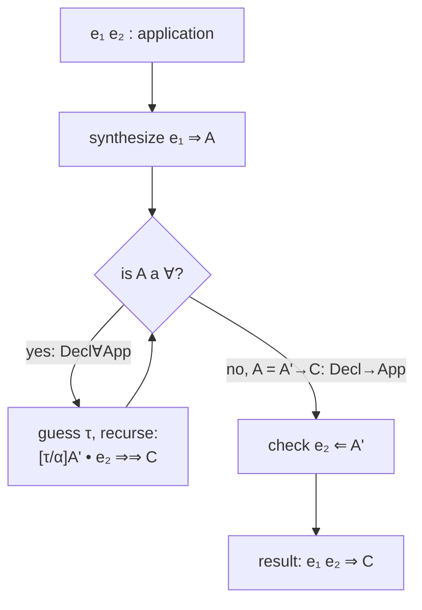

[[book-guidelines|↩ Back to guidelines]]

## Why a type checker needs two directions, not one

Suppose you're writing a type checker the naive way: one big function `infer(e) -> Type` that walks a term and returns its type. This works fine for simple languages, but it falls apart almost immediately once you add anything expressive — lambda-calculus with `\x -> e` alone is already a problem. Given `\x -> x`, what type should `infer` return? `Bool -> Bool`? `Int -> Int`? `forall a. a -> a`? There's no unique answer without more information. A single-direction inference function either has to guess (unsound in general) or you restrict the source language until every subterm carries enough local information to make inference syntax-directed (which, for full System F-style polymorphism, is *undecidable* — this is the same wall that motivates Damas-Milner's restriction to rank-1 polymorphism, and why Damas-Milner-style inference can't scale to higher-rank types without becoming undecidable itself).

**Bidirectional typechecking** sidesteps this by splitting "find the type of a term" into two separate judgments that call each other:

- **Synthesis (inference)**: given a term, *produce* a type. Written $\Psi \vdash e \Rightarrow A$ — "under context $\Psi$, $e$ synthesizes type $A$."
- **Checking**: given a term *and* an expected type, verify they match. Written $\Psi \vdash e \Leftarrow A$ — "under context $\Psi$, $e$ checks against type $A$."

The key design move is: which judgment applies to which term isn't arbitrary — it's determined by the term's *syntactic shape*. Constructors (things that build values — `()`, `\x -> e`) are naturally checked against a known type, because their type is only partially determined by their own shape (a lambda doesn't say what its argument type is). Eliminators/uses of variables (things that consume values — variable references, applications) naturally synthesize, because you can read their type off directly from what you already know (a variable's type is whatever the context says it is; an application's result type falls out of the function's type).

This isn't just an engineering convenience — it has a name and a proof-theoretic pedigree, which is what makes the "foundations" of this paper more than folklore.

## What breaks without a principled split: the "where do I even start" problem

If you don't fix *some* discipline for when a term is being checked vs. inferred, you either (a) need type annotations on nearly everything (Church-style, tedious for the programmer), or (b) need full unification-based inference (Damas-Milner style, decidable only for restricted polymorphism). Bidirectional typing threads the needle: it needs annotations only in specific, predictable places (more on this below), while staying decidable even for expressive polymorphism — this is the entire promise of the paper this book distills.

## The proof-theoretic grounding: focalization

Here's the "why" behind the checking/synthesis split, and it's genuinely elegant rather than an ad hoc engineering choice. Watkins et al. (2004) showed that bidirectional typechecking corresponds to *normalization* in intuitionistic type theory — specifically to a proof-theoretic phenomenon called **focalization** (Andreoli 1992), originally developed for proof search in linear logic sequent calculi.

The rough idea of focalization: in a sequent-calculus proof search, you don't want to try every rule in every order — that's what makes naive proof search explode combinatorially. Focalization organizes rule applications into alternating phases: an "inversion" phase where you eagerly apply every invertible rule (rules where, if the conclusion is provable, the premises are too — no information is lost, so there's no reason to delay them), and a "focus" phase where you commit to decomposing one particular formula and drive that decomposition all the way down before switching focus. This discipline doesn't lose any provability, but it collapses the search space combinatorially — you're never re-deciding a choice you'd already implicitly made.

Under the Curry-Howard-style correspondence between proofs and programs:

- **Normal forms** — terms that are "fully reduced," i.e. built up entirely from introduction forms without any redexes exposed at the top — correspond to **checking mode**.
- **Neutral terms** (also called atomic terms) — terms built from a variable at the head, followed by a chain of eliminations (projections, applications) — correspond to **synthesis mode**.

This isn't a loose analogy. If you already have intuitions about normal forms vs. neutral terms from operational semantics or from a normalization-by-evaluation (NbE) implementation, you already understand why checking and synthesis split the way they do: checking mode walks down the *introduction* rules of a type (how do you *build* something of this type), and synthesis mode walks down the *elimination* rules applied to a known head (what do you already know, and what can you *read off*).

### Why this matters for an elaborator, concretely

If you've ever looked at how Lean's kernel or elaborator is structured, this is the same shape: `isDefEq`/normalization phases correspond to the "inversion" discipline, and metavariable-driven elaboration corresponds to focusing on a particular subterm and driving it to completion before backing out. The synthesis/checking split in bidirectional typing is the *typing-level* shadow of the same discipline that shows up at the *definitional-equality* level in a dependently-typed elaborator. When you eventually build an elaborator with bidirectional typing (per your project's stated architecture), this correspondence is not incidental — it's the reason bidirectional typing was the right tool to reach for in the first place, rather than an arbitrary implementation choice.

## The payoff: type annotations only at redexes

The focalization correspondence isn't just aesthetically pleasing — it *proves* something practically important. Because normal forms correspond to checking mode and don't need external type information to be well-formed (their type is built up compositionally from their shape), **type annotations are only ever necessary at reducible expressions (redexes)** — that is, exactly at the places where synthesis mode has to "start" without already knowing the expected type, e.g., a term used where its type isn't otherwise pinned down by the surrounding context. Fully-normal terms need no annotations at all.

This is a theorem, not a heuristic, and it's provable *without reference to any particular typechecking algorithm* — it falls straight out of the declarative bidirectional specification. That's the paper's broader agenda: get the specification right first (Section 3 of this vault covers the full declarative system), and let facts like "where must I annotate" fall out as consequences, rather than being baked in as ad hoc rules of an algorithm.

```rust
// Illustrating the checking/synthesis split as a Rust-shaped sketch.
// (Types simplified; no polymorphism yet — that's the paper's real subject,
// covered in "The Problem of Polymorphism in Bidirectional Systems".)

enum Term {
    Var(String),                 // synthesizes: look up in context
    Unit,                        // checks: matches expected type `Unit`
    Lam(String, Box<Term>),      // checks: expected type must be an arrow
    App(Box<Term>, Box<Term>),   // synthesizes: read result off function's type
    Anno(Box<Term>, Type),       // synthesizes: the annotation IS the type
}

fn synthesize(ctx: &Context, e: &Term) -> Result<Type, TypeError> {
    match e {
        Term::Var(x) => ctx.lookup(x),
        Term::Anno(e, ty) => {
            check(ctx, e, ty)?;   // synthesis for Anno *calls back into* checking
            Ok(ty.clone())
        }
        Term::App(e1, e2) => {
            let fn_ty = synthesize(ctx, e1)?;
            apply(ctx, &fn_ty, e2)   // the "application judgment" — see below
        }
        _ => Err(TypeError::CannotSynthesize),
    }
}

fn check(ctx: &Context, e: &Term, expected: &Type) -> Result<(), TypeError> {
    match (e, expected) {
        (Term::Unit, Type::Unit) => Ok(()),
        (Term::Lam(x, body), Type::Arrow(a, b)) => {
            check(&ctx.extend(x, a), body, b)
        }
        // Fallback: anything that only knows how to synthesize can still be
        // checked, by synthesizing and comparing — this is `DeclSub` in the paper.
        _ => {
            let actual = synthesize(ctx, e)?;
            subtype(ctx, &actual, expected)
        }
    }
}
```

Notice the shape: `check` and `synthesize` are mutually recursive, and there's exactly one place where control flow crosses from synthesis-land into checking-land in a "downward" sense (annotations) and one place it crosses "upward" (the fallback `DeclSub` rule, which subsumes a synthesized type into a checking position via subtyping — trivial equality-checking when there's no polymorphism, but this is exactly the hook where subtyping-as-instantiation will later plug in once quantifiers are involved).

## The application judgment: why plain applications aren't enough for polymorphism

Here's where this paper's specific contribution begins, and where the "foundations" chapter sets up the actual technical problem the rest of the paper solves.

In a *non-polymorphic* bidirectional system, the standard rule for checking/synthesizing an application $e_1\ e_2$ is simple: synthesize a type $A \to B$ for $e_1$, check $e_2$ against $A$, and return $B$. One synthesis, one check, done.

With polymorphism this breaks down immediately. Suppose $e_1$ synthesizes a *polymorphic* type, say $\forall\alpha.\, \alpha \to \alpha$. There's no arrow type sitting right at the top — you first have to instantiate the quantifier before you can even see the argument and result types. And you don't know in advance *how many* quantifiers you'll need to peel off: a function's type might be $\forall\alpha.\, \forall\beta.\, (\beta \to \beta) \to \alpha \to \alpha$, and you need to strip both $\forall$s to expose the arrow.

The paper's fix draws on **spine form**: rather than treating an application $e_1\ e_2$ as an isolated binary node, view it as part of a *spine* — a sequence of applications to a head. This is a standard proof-theoretic device (Cervesato and Pfenning 2003) for representing "peel off one argument at a time" cleanly. Concretely, this motivates a *third* judgment alongside checking and synthesis:

$$\Psi \vdash A \bullet e \Rightarrow\!\Rightarrow C$$

Read: "under context $\Psi$, applying a function of type $A$ to argument $e$ synthesizes result type $C$." This is the **application judgment**. It works by iterating: if $A$ is a quantified type $\forall\alpha.\,A'$, guess an instantiation $\tau$ for $\alpha$ and recurse into $[\tau/\alpha]A' \bullet e \Rightarrow\!\Rightarrow C$ (rule $\mathrm{Decl}\forall\mathrm{App}$) — peeling one quantifier at a time — until an arrow type $A' \to C$ is exposed, at which point you check $e$ against $A'$ and return $C$ (rule $\mathrm{Decl}{\to}\mathrm{App}$). The ordinary application rule $\mathrm{Decl}{\to}\mathrm{E}$ then reads: synthesize $A$ for $e_1$, feed $A$ and $e_2$ into the application judgment, and take the result as the type of $e_1\ e_2$.

$$
\frac{\Psi \vdash e_1 \Rightarrow A \qquad \Psi \vdash A \bullet e_2 \Rightarrow\!\Rightarrow C}{\Psi \vdash e_1\ e_2 \Rightarrow C} \;\mathrm{Decl}{\to}\mathrm{E}
$$

Worked example straight from the paper: applying a value of type $\forall\alpha.\, (\forall\beta.\,\beta\to\beta) \to \alpha \to \alpha$ to $x$ (of type $\forall\beta.\,\beta \to \beta$):

$$
\frac{
  \frac{\Psi \vdash x \Leftarrow (\forall\beta.\,\beta\to\beta)}
       {\Psi \vdash (\forall\beta.\,\beta\to\beta) \to 1 \to 1 \bullet x \Rightarrow\!\Rightarrow 1 \to 1}\; \mathrm{Decl}{\to}\mathrm{App}
}{
  \Psi \vdash \forall\alpha.\, (\forall\beta.\,\beta\to\beta) \to \alpha \to \alpha \bullet x \Rightarrow\!\Rightarrow 1 \to 1
}\; \mathrm{Decl}\forall\mathrm{App}
$$

The outer quantifier over $\alpha$ gets instantiated (here, to $1$, the unit type — the premise $\Psi \vdash 1$ is elided in the paper's presentation), but the *inner* quantifier over $\beta$, sitting inside the argument type, is left completely alone. This is exactly the "instantiate quantifiers exactly when needed to reveal a function type, and no others" behavior that makes the system predictable: the application judgment decides *precisely* how many quantifiers get peeled off, driven entirely by the shape of $A$, with no guessing beyond what's syntactically forced.



Note one detail flagged in the text as important for later sections: this judgment "guesses" the instantiation $\tau$ out of thin air ($\mathrm{Decl}\forall\mathrm{App}$'s premise $\Psi \vdash \tau$ then $\Psi \vdash [\tau/\alpha]A \bullet e \Rightarrow\!\Rightarrow C$) — it's a *declarative specification*, not yet an algorithm. Nothing here says *how* to pick $\tau$. That's precisely the gap the algorithmic system (covered in [[Algorithmic-Contexts]] and [[Algorithmic-Subtyping-and-Instantiation]]) fills, by replacing "guess $\tau$" with a disciplined process of introducing an *existential type variable* and solving it incrementally as more information becomes available.

## Where this leads

This chapter sets up the vocabulary and proof-theoretic justification the rest of the paper builds on:

- The checking/synthesis split, motivated by focalization, is the scaffold that [[Declarative-Type-System]] formalizes fully (adding subtyping, let-generalization, and the theorems relating this system to plain type-assignment System F).
- The application judgment introduced here is the *reason* the paper needs anything beyond the textbook two-judgment bidirectional system — [[The-Problem-of-Polymorphism-in-Bidirectional-Systems]] explains exactly what additionally breaks (stability under $\eta$-reduction, decidability under impredicativity) that pushes the declarative system toward subtyping-as-instantiation.
- The "guess $\tau$" nondeterminism in $\mathrm{Decl}\forall\mathrm{App}$ is exactly what the algorithmic contexts and existential variables of [[Algorithmic-Contexts]] are built to eliminate — turning a declarative specification that guesses into a deterministic algorithm that solves.
- For your elaborator project: this application judgment is the direct ancestor of "argument-driven implicit instantiation" — the same shape of problem Lean's elaborator solves when applying a function with implicit `{α : Type}` arguments to explicit arguments, deciding how many implicits to insert before hitting an explicit argument position.
