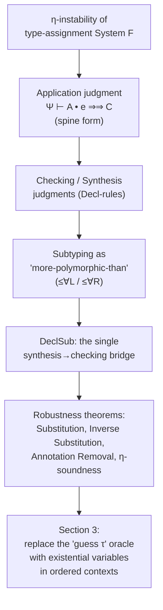

[[book-guidelines|↩ Back to guidelines]]

# Declarative Type System

## Why not just use System F's type-assignment rules?

Before this section, the paper has already promised two things: a *declarative* bidirectional calculus for higher-rank polymorphism, and a *sound and complete algorithm* for it. Section 2 delivers the first piece, and it opens with a surprisingly pointed admission: "finding the correct declarative system to use as a specification is itself an interesting problem." Why isn't the obvious choice — the type-assignment presentation of System F, where a term $e$ simply *has* a type $A$, full stop — good enough to be that specification?

**What breaks without a bidirectional declarative system.** Take a variable $f : 1 \to \forall\alpha.\alpha$. Under ordinary type-assignment System F, the term $\lambda x.\, f\, x$ can be given the type $1 \to 1$: you apply $f$ to $x$, instantiate the returned $\forall\alpha.\alpha$ at $1$ (since the argument position of $f$ demands something applicable at $1$), and the whole abstraction has type $1 \to 1$. But the $\eta$-reduct of that term, plain $f$, *cannot* be given the type $1 \to 1$ under that same system — there's no syntactic position left at which to perform the instantiation, because there's no application anymore. The quantifier can only be resolved once $f$ is actually applied.

This is a real failure, not a technicality: it means typability is not preserved under $\eta$-reduction, and in languages like Haskell where $\eta$-equivalence is a valid program equality, that's unacceptable. If your declarative specification doesn't validate the $\eta$ law, no algorithm faithful to that specification can either — you'd be building a sound and complete algorithm for the wrong target.

If you've worked with a `dyn Trait` object in Rust, there's a loose analogy: a `Box<dyn Fn() -> T>` erases the concrete type until the call site, and *when* you can specialize it depends entirely on where in the code the call happens. System F's implicit instantiation has the same problem, except worse — it can happen at any position deep inside a term, not just at a clearly marked boundary.

## Fixing it: spine form and the application judgment

The paper's fix comes from **focalization** (Andreoli 1992), the proof-theoretic machinery underlying bidirectional typechecking generally. The key move is to stop thinking of application as a binary operation and instead view every application as a **spine**: a sequence of type applications followed by a term application, applied to a head. This licenses a third judgment beyond the usual checking/synthesis pair — the **application judgment**:

$$\Psi \vdash A \bullet e \Rightarrow\!\Rightarrow C$$

read as: "applying something of type $A$ to argument $e$ synthesizes result type $C$." Because this judgment walks through *all* the quantifiers in $A$ before it hits an arrow type, instantiation happens exactly when — and exactly as many times as — needed to expose that arrow. There's no leftover ambiguity about "how many quantifiers to peel off"; the application judgment's own structure answers that question, which is also precisely why it restores the $\eta$ law (more on this below).

If you're modeling a compiler pass in Rust, this maps naturally onto an explicit recursive helper rather than folding the logic into your general type-checking function:

```rust
enum Type {
    Unit,
    Var(String),
    Forall(String, Box<Type>),
    Arrow(Box<Type>, Box<Type>),
}

// Ψ ⊢ A • e ⇒⇒ C : "applying a function of type A to argument e synthesizes C"
fn apply_judgment(ctx: &Context, fn_ty: &Type, arg: &Expr) -> Result<Type, TypeError> {
    match fn_ty {
        // Decl∀App: guess an instantiation τ, recurse into [τ/α]A
        Type::Forall(alpha, body) => {
            let tau = guess_monotype(); // the declarative rule's "oracle"
            let instantiated = substitute(body, alpha, &tau);
            apply_judgment(ctx, &instantiated, arg)
        }
        // Decl→App: base case — check the argument, return the result type
        Type::Arrow(param, ret) => {
            check(ctx, arg, param)?;
            Ok((**ret).clone())
        }
        _ => Err(TypeError::NotAFunction),
    }
}
```

The `guess_monotype()` call is doing something dishonest — it's the "oracle" that makes this a *declarative* rule rather than an algorithm; Section 3's existential variables are exactly the mechanism that replaces this guess with something computable. Keep that seam in mind: it's the hinge the whole paper turns on.

## The three judgments, precisely

Figure 4 of the paper gives three judgments over a context $\Psi$ (a list of type-variable declarations $\alpha$ and term-variable bindings $x:A$):

- **Checking**, $\Psi \vdash e \Leftarrow A$ — "$e$ checks against the known type $A$."
- **Synthesis**, $\Psi \vdash e \Rightarrow A$ — "$e$ synthesizes (infers) the type $A$."
- **Application**, $\Psi \vdash A \bullet e \Rightarrow\!\Rightarrow C$ — "applying a function of type $A$ to $e$ synthesizes $C$" (introduced above).

The grammar of terms is minimal: $e ::= x \mid () \mid \lambda x.\, e \mid e\, e \mid (e:A)$ — unit, variables, abstraction, application, and annotation. Types are $A, B, C ::= 1 \mid \alpha \mid \forall\alpha.A \mid A \to B$, with monotypes $\tau, \sigma$ being the same minus $\forall$.

### The checking and synthesis rules

$$
\dfrac{(x:A) \in \Psi}{\Psi \vdash x \Rightarrow A}\ \mathrm{DeclVar}
\qquad
\dfrac{\Psi \vdash e \Rightarrow A \quad \Psi \vdash A \le B}{\Psi \vdash e \Leftarrow B}\ \mathrm{DeclSub}
\qquad
\dfrac{\Psi \vdash A \quad \Psi \vdash e \Leftarrow A}{\Psi \vdash (e:A) \Rightarrow A}\ \mathrm{DeclAnno}
$$

$$
\dfrac{}{\Psi \vdash () \Leftarrow 1}\ \mathrm{Decl1I}
\qquad
\dfrac{}{\Psi \vdash () \Rightarrow 1}\ \mathrm{Decl1I}\!\Rightarrow
\qquad
\dfrac{\Psi, \alpha \vdash e \Leftarrow A}{\Psi \vdash e \Leftarrow \forall\alpha.A}\ \mathrm{Decl}\forall I
$$

$$
\dfrac{\Psi, x:A \vdash e \Leftarrow B}{\Psi \vdash \lambda x.e \Leftarrow A \to B}\ \mathrm{Decl}{\to}I
\qquad
\dfrac{\Psi \vdash \sigma \to \tau \quad \Psi, x:\sigma \vdash e \Leftarrow \tau}{\Psi \vdash \lambda x.e \Rightarrow \sigma \to \tau}\ \mathrm{Decl}{\to}I\!\Rightarrow
$$

Reading this as a checklist: `DeclVar` looks a variable's type up in context. `DeclAnno` synthesizes the type off an explicit annotation, after confirming the term actually checks against it. `Decl1I` and `Decl→I` are the introduction rules you'd expect — a unit literal checks against $1$, a lambda checks against an arrow type by extending the context with the parameter's binding. `Decl∀I` is the introduction rule for polymorphism itself: $e$ has type $\forall\alpha.A$ if $e$ has type $A$ once you extend the context with a *fresh* universal variable $\alpha$ — this is literally "generalize over a variable nothing else in the context can see," the same discipline a Rust generic function's type parameters enforce, or what Lean's `intro α` does when you're proving a `∀`-goal.

Note the two "extra" rules, $\mathrm{Decl1I}\!\Rightarrow$ and $\mathrm{Decl}{\to}I\!\Rightarrow$: in the *minimal* proof-theoretic formulation, introduction forms only ever check and elimination forms only ever synthesize — not even `()` would synthesize a type. The paper deliberately loosens this for practicality, letting `()` and monomorphic lambdas synthesize too, foreshadowing Section 8's discussion of [[Design-Variations|design variations]] (a purist no-inference system versus something closer to full Damas–Milner).

### The application rules

$$
\dfrac{\Psi \vdash \tau \quad \Psi \vdash [\tau/\alpha]A \bullet e \Rightarrow\!\Rightarrow C}{\Psi \vdash \forall\alpha.A \bullet e \Rightarrow\!\Rightarrow C}\ \mathrm{Decl}\forall\mathrm{App}
\qquad
\dfrac{\Psi \vdash e \Leftarrow A}{\Psi \vdash A \to C \bullet e \Rightarrow\!\Rightarrow C}\ \mathrm{Decl}{\to}\mathrm{App}
\qquad
\dfrac{\Psi \vdash e_1 \Rightarrow A \quad \Psi \vdash A \bullet e_2 \Rightarrow\!\Rightarrow C}{\Psi \vdash e_1\,e_2 \Rightarrow C}\ \mathrm{Decl}{\to}E
$$

This is the payoff of the spine-form idea: $\mathrm{Decl}{\to}E$ (function application at the term level) synthesizes a type for the function $e_1$, then hands the whole business of "peel off however many quantifiers are needed" to the application judgment. $\mathrm{Decl}\forall\mathrm{App}$ guesses a monotype $\tau$ (the oracle from earlier), substitutes it in, and recurses; $\mathrm{Decl}{\to}\mathrm{App}$ is the base case that finally checks the argument against the exposed domain type.

The paper's own worked example is worth internalizing directly. Given $x : \forall\alpha.\, (\forall\beta.\beta\to\beta) \to \alpha \to \alpha$:

$$
\dfrac{\Psi \vdash x \Leftarrow (\forall\beta.\beta\to\beta)}{\Psi \vdash (\forall\beta.\beta\to\beta) \to 1 \to 1 \bullet x \Rightarrow\!\Rightarrow 1 \to 1}\ \mathrm{Decl}{\to}\mathrm{App}
\Bigg/
\dfrac{}{\Psi \vdash \forall\alpha.(\forall\beta.\beta\to\beta) \to \alpha \to \alpha \bullet x \Rightarrow\!\Rightarrow 1 \to 1}\ \mathrm{Decl}\forall\mathrm{App}
$$

$\mathrm{Decl}\forall\mathrm{App}$ instantiates only the *outer* quantifier (guessing $\alpha := 1$), then stops — the inner quantifier over $\beta$ is left completely alone, because it's guarded behind an argument position, not exposed at the head. This selective, exactly-as-needed instantiation is the entire point.

## Subtyping as "more polymorphic than"

The declarative system needs one more piece to make `DeclSub` — the single rule that switches between synthesis and checking — actually do useful work: a subtyping judgment $\Psi \vdash A \le B$, read as "$A$ is at least as polymorphic as $B$."

$$
\dfrac{\alpha \in \Psi}{\Psi \vdash \alpha \le \alpha}\ {\le}\mathrm{Var}
\qquad
\dfrac{}{\Psi \vdash 1 \le 1}\ {\le}\mathrm{Unit}
\qquad
\dfrac{\Psi \vdash B_1 \le A_1 \quad \Psi \vdash A_2 \le B_2}{\Psi \vdash A_1 \to A_2 \le B_1 \to B_2}\ {\le}{\to}
$$

$$
\dfrac{\Psi \vdash \tau \quad \Psi \vdash [\tau/\alpha]A \le B}{\Psi \vdash \forall\alpha.A \le B}\ {\le}\forall L
\qquad
\dfrac{\Psi, \beta \vdash A \le B}{\Psi \vdash A \le \forall\beta.B}\ {\le}\forall R
$$

Most of this is unsurprising structural recursion — subtyping is reflexive on atoms, and arrows are contravariant in the domain, covariant in the codomain, exactly as in any subtyping discipline you've seen for function types. All the interesting content lives in the two quantifier rules, and this is the technical device that makes the $\eta$ law hold at all: following Odersky and Läufer (1996), the paper models **instantiation as subtyping**. Concretely, $1 \to \forall\alpha.\alpha$ is a subtype of $1 \to 1$ — a more-polymorphic function type can always stand in wherever a more specific one is expected, because it can always be specialized down. This single fact is what lets $\mathrm{DeclSub}$ absorb the instantiation that used to require an explicit application: you no longer need the syntactic position of an application to trigger instantiation, because the *subtyping check itself* can do it.

- $\le\forall L$: "$\forall\alpha.A$ is a subtype of $B$, if *some* instantiation $[\tau/\alpha]A$ is a subtype of $B$." This guesses $\tau$ "out of thin air" — it's precisely this guess that keeps the rule declarative rather than algorithmic, mirroring $\mathrm{Decl}\forall\mathrm{App}$'s own oracle.
- $\le\forall R$: "$A$ is a subtype of $\forall\beta.B$, if $A$ is a subtype of $B$ once you extend the context with a fresh $\beta$." Two ways to see why this rule is correct. **Semantically**: since $\forall\beta.B$ is a subtype of $[\tau/\beta]B$ for *every* $\tau$, we need $A \le [\tau/\beta]B$ for every $\tau$ too — and showing $A \le B$ with $\beta$ held abstract, then appealing to a substitution principle, gets you exactly that "for all $\tau$" property for free. **Proof-theoretically**: $\le\forall L$ and $\le\forall R$ are nothing more than the standard left and right sequent-calculus rules for the universal quantifier. Type inference here really is a restricted form of theorem proving, and this subtyping judgment supplies some of the prover's own inference rules.

This proof-theoretic framing pays off immediately: because reflexivity and transitivity of $\le$ are *admissible* rather than primitive (the sequent calculus's identity and cut-admissibility properties), the paper can leave them out of the rule set entirely — which is why the rules end up "practically syntax-directed." The one real choice point is when both sides are quantifiers, where either $\le\forall L$ or $\le\forall R$ could fire; since $\le\forall R$ is invertible, the practical strategy is to apply it eagerly whenever possible.

If you're grounding this in Lean, this correspondence is worth naming directly: $\le\forall R$'s "extend the context with a fresh variable, then recurse" is exactly the discipline Lean's `intro` tactic enforces when the goal is a `∀` — you cannot `intro` a variable that's already in scope, precisely because doing so would let you conflate "true for one specific instance" with "true for all instances," which is the same scoping discipline this rule is protecting.

## Let-generalization, deliberately absent

Many treatments of type inference — Damas–Milner, most prominently — give `let`-bindings special treatment: generalize the bound term's type over all its free type variables before checking the body. This paper pointedly does **not** do that, and the reasoning is proof-theoretic: `let`-bindings, viewed through a logical lens, internalize the **cut rule**. Giving them special polymorphic treatment risks breaking **cut-elimination** — i.e., typability might not survive substituting a `let`-bound term away, which is exactly the kind of robustness property (Section 2.3, below) this system cares about. Making let-generalization *safe* typically requires extra machinery, like a principal-types property, and that property itself gets endangered by richer type-system features such as higher-rank polymorphism or refinement types.

So `let` is simply omitted from the formal system. But because **cut is admissible** here (this is exactly what the Substitution theorem below states), restoring `let` later is safe, as long as it gets no special treatment that substitution can't account for:

$$
\dfrac{\Psi \vdash e \Rightarrow A \quad \Psi, x:A \vdash e' \Leftarrow C}{\Psi \vdash \mathsf{let}\ x = e\ \mathsf{in}\ e' \Leftarrow C}
$$

Notice: no generalization step. $e$ synthesizes some type $A$ (monomorphic, under this system's restrictions — see below), and $x$ is bound at exactly that type, no broader.

## Relationship to type-assignment System F

Having built a bidirectional system that is *not* the usual type-assignment presentation, the paper owes you a proof that the two aren't just unrelated formalisms wearing similar clothes. Figure 5 gives ordinary type-assignment rules for predicative System F — $\mathrm{AVar}$, $\mathrm{AUnit}$, $\mathrm{A}{\to}I$, $\mathrm{A}{\to}E$, $\mathrm{A}\forall I$, $\mathrm{A}\forall E$ — using a single judgment $\Psi \vdash e : A$ with no checking/synthesis distinction. Writing $|e|$ for the erasure of all type annotations from $e$:

> **Theorem 1 (Completeness of Bidirectional Typing).** If $\Psi \vdash e : A$ then there exists $e'$ such that $\Psi \vdash e' \Rightarrow A$ and $|e'| = e$.
>
> **Theorem 2 (Soundness of Bidirectional Typing).** If $\Psi \vdash e \Leftarrow A$ then there exists $e'$ such that $\Psi \vdash e' : A$ and $e' =_{\beta\eta} |e|$.

Read together: anything typeable in ordinary System F can be typed bidirectionally by adding the right annotations (completeness — you never *lose* typability by switching to the bidirectional discipline, you just have to be more explicit about where quantifiers get eliminated); and anything the bidirectional system accepts corresponds to a System-F-typeable term up to $\beta\eta$-equality (soundness — the bidirectional system isn't typing anything spurious, modulo the fact that you may need to $\eta$-expand a term to make it typecheck under type assignment, and the soundness proof itself needs to $\beta$-reduce away identity coercions it introduces along the way).

## Robustness: substitution, inverse substitution, annotation removal

Section 2.3 is where the payoff of the whole bidirectional design becomes concrete, and it's the part most directly relevant if you're building an elaborator: type annotations in this system are required **only at redexes**, and monomorphic types can always be inferred (guessed), so the precise answer to "where do I need to write an annotation?" is: *only on bindings of polymorphic type*. That's a genuinely actionable, checkable property for a language designer or a tool author to promise users.

> **Theorem 3 (Substitution).** Assume $\Psi \vdash e \Rightarrow A$.
> - If $\Psi, x{:}A \vdash e' \Leftarrow C$ then $\Psi \vdash [e/x]e' \Leftarrow C$.
> - If $\Psi, x{:}A \vdash e' \Rightarrow C$ then $\Psi \vdash [e/x]e' \Rightarrow C$.
>
> **Theorem 4 (Inverse Substitution).** Assume $\Psi \vdash e \Leftarrow A$.
> - If $\Psi \vdash [(e{:}A)/x]e' \Leftarrow C$ then $\Psi, x{:}A \vdash e' \Leftarrow C$.
> - If $\Psi \vdash [(e{:}A)/x]e' \Rightarrow C$ then $\Psi, x{:}A \vdash e' \Rightarrow C$.

Substitution is stated over *synthesizing* terms because any checking term can be turned into a synthesizing one just by wrapping it in an annotation. Inverse substitution runs the process backward: it lets you pull any checking subterm out into a `let`-binding with an explicit annotation — literally the "un-inlining" transformation a refactoring tool would need to perform soundly. (The paper is careful to flag that the *fully general* version of inverse substitution — for any synthesizing $e'$, not just an annotated one $(e:A)$ — does *not* hold; the footnote example is $e = \lambda y.y$, $e' = x$, where $\lambda y.y$ synthesizes $1\to1$ but also checks against $C_1 \to C_2$ for arbitrary $C_1, C_2$, so you can't recover a checking judgment for $x$ at that same broader type without more information.)

> **Theorem 5 (Annotation Removal).**
> - If $\Psi \vdash (\lambda x.e) : A \Leftarrow C$ then $\Psi \vdash \lambda x.e \Leftarrow C$.
> - If $\Psi \vdash (() : A) \Leftarrow C$ then $\Psi \vdash () \Leftarrow C$.
> - If $\Psi \vdash e_1\,(e_2 : A) \Rightarrow C$ then $\Psi \vdash e_1\,e_2 \Rightarrow C$.
> - If $\Psi \vdash (x:A) \Rightarrow A$ then $\Psi \vdash x \Rightarrow B$ and $\Psi \vdash B \le A$.

This is the theorem that makes "predict exactly where annotations are needed" a *practical* guarantee rather than an aspiration: applying inverse substitution indiscriminately would leave a term riddled with redundant annotations, so Annotation Removal characterizes exactly when you're allowed to strip one back out without losing typeability. For a tool implementer, this is the formal license behind an "insert as few annotations as possible" or "simplify annotations" feature.

Finally, the theorem that ties the whole section back to its opening motivation:

> **Theorem 6 (Soundness of Eta).** If $\Psi \vdash \lambda x.\, e\, x \Leftarrow A$ and $x \notin \mathrm{FV}(e)$, then $\Psi \vdash e \Leftarrow A$.

This is the property that the type-assignment presentation of System F *failed* to give you for $f : 1 \to \forall\alpha.\alpha$ back at the start of this section. Here, it holds outright, precisely because subtyping-as-instantiation (via `DeclSub`) doesn't need an application's syntactic position to trigger quantifier instantiation — the subtyping judgment can absorb that work no matter how the term is shaped.

## Where this leads



Everything in this section exists to be *replaced*, in a very specific, controlled way, by Section 3. $\le\forall L$'s and $\mathrm{Decl}\forall\mathrm{App}$'s "guess $\tau$ out of thin air" is the single non-constructive step in an otherwise entirely syntax-directed system — and the paper's algorithmic contribution is showing that this guess can be replaced by an **existential type variable**, solved incrementally as constraints accumulate, with **no backtracking and no data structure more complex than a list**. Every theorem proved here (soundness, completeness, the robustness properties) becomes the *specification* that Section 3's algorithm is checked against — this declarative system is the thing the algorithm has to be provably faithful to.

This is directly load-bearing for a bidirectional elaborator in the Miller-pattern-unification tradition (the kind Lean's own elaborator implements): the `DeclSub`/subtyping-as-instantiation design is the declarative shadow of what a real elaborator's metavariable-solving does operationally — guessing an instantiation *declaratively* here is exactly what gets replaced by constraint generation and unification against metavariables once you have an algorithm. If you're building the Rust side of such a system, this section is the contract your unifier's *correctness* gets measured against, not the thing you implement directly — Section 3's ordered contexts with unsolved/solved existentials are the actual mechanism you'd translate into Rust data structures and Lean-style `isDefEq` reasoning.
