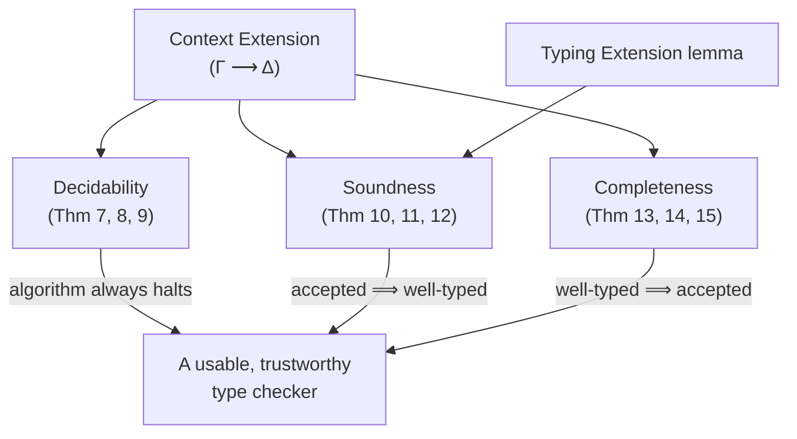

[[book-guidelines|↩ Back to guidelines]]

# Metatheory of the Algorithm

## What problem is being solved here?

Every previous section built machinery: the [[Algorithmic-Contexts|algorithmic context]] as a data structure, the [[Algorithmic-Subtyping-and-Instantiation|subtyping and instantiation rules]] that fill in existential variables, and the [[Algorithmic-Typing|typing rules]] that drive the whole thing. None of that machinery is worth anything as a *type checker* unless four questions get real answers:

1. **Does it terminate?** ("Decidability") — a checker that might loop forever is not a checker.
2. **When it says "yes," is the program actually well-typed?** ("Soundness") — a checker that accepts ill-typed programs is worse than useless, it's actively dangerous, because it's exactly the property a trusted kernel must never violate.
3. **When a program really is well-typed, does the checker always find that out?** ("Completeness") — a checker that rejects valid programs is merely annoying, not unsound, but it breaks the paper's central promise: that programmers can predict exactly where annotations are needed.
4. **What's the common currency that lets you even *state* soundness and completeness, given that the algorithmic system and the declarative system don't talk about the same objects** (one has existential variables scribbled all over its contexts, the other doesn't)? This is **context extension**, and it's the connective tissue underneath all three other properties.

If you are building your own bidirectional elaborator, this section is the one that tells you what claims you're actually allowed to make about it once it's built. "It compiles and passes my test suite" is not the same claim as "it is sound." This section is where the paper earns the right to make the stronger claim.

## Context extension: the common currency

### What breaks without it

The algorithmic judgments are all of the shape $\Gamma \vdash \cdots \dashv \Delta$: you go in with an input context $\Gamma$ and come out with an output context $\Delta$ that has learned something — an existential got solved, a new one got introduced. The declarative judgments, by contrast, are just $\Psi \vdash \cdots$: no threading, no existentials, no output context. If you want to say "the algorithm's answer matches the declarative spec's answer," you need a way to relate an algorithmic context (full of $\hat\alpha$'s in various states of solvedness) to the *plain* declarative context the specification talks about, and you need a way to compare two algorithmic contexts at different points in a derivation and say one is "more solved than" the other, without that comparison silently smuggling in contradictions.

### The judgment

The **context extension** judgment $\Gamma \longrightarrow \Delta$, read "$\Gamma$ is extended by $\Delta$" (or "$\Delta$ extends $\Gamma$"), captures *information increase*. Three equivalent readings, all worth holding onto simultaneously:

- $\Delta$ carries at least as much information as $\Gamma$.
- $\Gamma$ is *entailed* by $\Delta$: anything derivable from $\Gamma$ (e.g. "$\hat\alpha$ is in scope") is still derivable from $\Delta$, which may know more (e.g. "$\hat\alpha$ is equal to $\text{some particular type}$").
- Key lemma: extension preserves well-formedness — if $\Gamma \vdash A$ and $\Gamma \longrightarrow \Delta$, then $\Delta \vdash A$.

The rules (Figure 13 in the paper) build this up compositionally over the structure of the context:

$$
\cfrac{}{\cdot \longrightarrow \cdot}\ {\longrightarrow}\mathrm{ID}
\qquad
\cfrac{\Gamma \longrightarrow \Delta \quad [\Delta]A = [\Delta]A'}{\Gamma, x{:}A \longrightarrow \Delta, x{:}A'}\ {\longrightarrow}\mathrm{Var}
\qquad
\cfrac{\Gamma \longrightarrow \Delta}{\Gamma, \alpha \longrightarrow \Delta, \alpha}\ {\longrightarrow}\mathrm{Uvar}
$$

$$
\cfrac{\Gamma \longrightarrow \Delta}{\Gamma, \hat\alpha \longrightarrow \Delta, \hat\alpha}\ {\longrightarrow}\mathrm{Unsolved}
\qquad
\cfrac{\Gamma \longrightarrow \Delta \quad [\Delta]\tau = [\Delta]\tau'}{\Gamma, \hat\alpha=\tau \longrightarrow \Delta, \hat\alpha=\tau'}\ {\longrightarrow}\mathrm{Solved}
\qquad
\cfrac{\Gamma \longrightarrow \Delta}{\Gamma, \hat\alpha \longrightarrow \Delta, \hat\alpha=\tau}\ {\longrightarrow}\mathrm{Solve}
$$

$$
\cfrac{\Gamma \longrightarrow \Delta}{\Gamma \longrightarrow \Delta, \hat\alpha}\ {\longrightarrow}\mathrm{Add}
\qquad
\cfrac{\Gamma \longrightarrow \Delta}{\Gamma \longrightarrow \Delta, \hat\alpha=\tau}\ {\longrightarrow}\mathrm{AddSolved}
\qquad
\cfrac{\Gamma \longrightarrow \Delta}{\Gamma, I_{\hat\alpha} \longrightarrow \Delta, I_{\hat\alpha}}\ {\longrightarrow}\mathrm{Marker}
$$

Reading these as a checklist for each declaration in $\Gamma$: a variable stays typed at (a possibly-narrowed-by-substitution) the same type, a universal or scope marker just has to be echoed unchanged, and an existential is allowed to (a) stay unsolved, (b) stay solved to an equivalent (up to further substitution) type, or (c) *get* solved. New existentials may be freely tacked onto $\Delta$ (solved or not) since they're simply new information not yet present in $\Gamma$.

### Rigid where it must be, flexible where it can afford to be

This is the conceptual payoff of the whole judgment, stated directly in the paper: extension is **rigid** in two specific senses — every declaration in $\Gamma$ survives into every extension of $\Gamma$, and it survives *in the same relative order*. If $\hat\beta$ is declared after $\hat\alpha$ in $\Gamma$, it stays declared after $\hat\alpha$ in every $\Delta$ with $\Gamma \longrightarrow \Delta$. This rigidity is exactly what makes the [[Algorithmic-Contexts|ordered context's]] ordering discipline meaningful across a whole derivation, not just a snapshot — it's what lets the algorithm reason about scoping and dependency ("this existential can't be solved to a type mentioning that one, because it comes first") *globally*, not just locally at one rule application.

At the same time, extension is **flexible** about *what an existential's solution looks like*, as long as the solution only gets more specific. The paper gives a subtle worked example: the extension
$$
\hat\alpha,\ \hat\alpha=1,\ \hat\beta=\hat\alpha \ \longrightarrow\ \hat\alpha=1,\ \hat\beta=1
$$
is valid even though $\hat\beta$'s solution changed from "$\hat\alpha$" to the literal type "$1$" — because once you apply the final complete context to both sides, $[\Omega]\hat\alpha = [\Omega]1 = 1$ either way. Extension doesn't require syntactic identity of solutions, only that applying enough information to both sides makes them agree. This is the "solving via elaboration" pattern any metavariable-based elaborator lives inside: partial solutions get refined, not thrown away and restarted, as long as refinement never *contradicts* earlier information.

```rust
// Extension, as an invariant a Rust elaborator's context-threading code
// must be able to assert of every rule it implements: for every
// (input_ctx, output_ctx) pair produced by a typing/subtyping/instantiation
// step, this predicate must hold.
fn extends(gamma: &Context, delta: &Context) -> bool {
    // every declaration in gamma has a corresponding, compatible
    // declaration in delta, in the same relative order, and no
    // existential's solution info has been lost — only gained.
    // (a full implementation walks both contexts in lockstep per
    // the seven rules above; this signature is the contract, not
    // the implementation.)
    todo!()
}
```

If you are writing an elaborator in Rust and you find yourself needing to justify "it's fine that I mutated the metavariable store mid-unification," this is the formal shape of that justification: every mutation you perform must be an extension of the store as it was before.

### Context application, the bridge to the declarative world

A **complete context** $\Omega$ (no unsolved variables left) can be *applied* to any type or context that it extends, via $[\Omega]\Gamma$ (Figure 14) — substituting away every existential's final solution. Crucially:

$$
\textbf{Lemma (Stability of Complete Contexts).}\quad \text{If } \Gamma \longrightarrow \Omega \text{ then } [\Omega]\Gamma = [\Omega]\Omega.
$$

This says: no matter *when* in the derivation you grab your snapshot $\Gamma$, as long as it's eventually extended to the same final complete context $\Omega$, applying $\Omega$ to it gives the same declarative context as applying $\Omega$ to itself. This is what lets soundness and completeness talk about "the" declarative context corresponding to an algorithmic derivation without ambiguity — $[\Omega]\Omega$ *is* the plain declarative context, existential-free, that the whole derivation was secretly computing.

## Decidability: the algorithm actually halts

### Why this needs an argument at all

Nothing about "search for a derivation using these rules" is automatically terminating — Prolog-style search over inference rules can loop. The paper needs to show termination for each of the three layers, in dependency order: typing depends on subtyping, subtyping depends on instantiation, so decidability is proved bottom-up.

### Instantiation terminates

The subtle fact instantiation must be shown to preserve is: instantiating $\hat\alpha := A$ does **not** always solve *some* existential (rule `InstLReach` can just point $\hat\alpha$ at another existential $\hat\beta$ without making $\hat\beta$ any more solved), but instantiating to a **monotype specifically** always does:

$$
\textbf{Lemma (Monotypes Solve Variables).}\quad \text{If } \Gamma \vdash \hat\alpha \mathbin{:=}\!\!< \tau \dashv \Delta \text{ (or the mirror)}, \text{ then } |\mathrm{unsolved}(\Gamma)| = |\mathrm{unsolved}(\Delta)| + 1.
$$

Combined with a size-preservation lemma for the (substituted) type across instantiation steps, this gives **Theorem 7 (Decidability of Instantiation)**: for well-formed, fully-substituted $A$ with $\hat\alpha \notin FV(A)$, it's decidable whether an instantiation derivation exists.

### Subtyping terminates: a three-part lexicographic measure

Subtyping needs a genuinely three-dimensional decreasing measure, because no single quantity shrinks on every rule application:

$$
(S1)\ \#\forall\text{-quantifiers in } A, B \qquad (S2)\ |\mathrm{unsolved}(\Gamma)| \qquad (S3)\ |\Gamma \vdash A| + |\Gamma \vdash B|
$$

$(S3)$'s **contextual size** is the interesting one — it deliberately *penalizes* solved existentials rather than treating $\hat\alpha$'s size as trivially $1$:

$$
|\Gamma \vdash \alpha| = 1 \qquad |\Gamma[\hat\alpha] \vdash \hat\alpha| = 1 \qquad |\Gamma[\hat\alpha=\tau] \vdash \hat\alpha| = 1 + |\Gamma[\hat\alpha=\tau] \vdash \tau|
$$

Why penalize a solved variable instead of just calling it size 1 like an unsolved one? Because a rule can turn an unsolved $\hat\alpha$ into a solved $\hat\alpha = \tau$ *without changing (S1) or (S2) at all* — if size didn't grow to reflect that $\tau$'s own structure is now "inside" $\hat\alpha$, the measure could stay flat forever across a chain of solve-steps that never actually terminates in reality. Making solved existentials "cost" their solution's size is what turns "we made progress by solving something" into a number that visibly goes up in the *conclusion* relative to a hypothetical unsolved premise, which — combined with (S1)/(S2) handling the cases where quantifiers or unsolved-counts actually shrink — is what closes the termination argument. The lexicographic ordering means: a rule only needs to shrink *one* of (S1)/(S2)/(S3), as long as it never *grows* an earlier component while shrinking a later one out of order — e.g. examining rule `<:→`: if either side is polymorphic, the domain premise drops (S1); otherwise (S1) and (S2) are unchanged but (S3) strictly drops, because you've peeled off exactly the "$1 +$" from the arrow-size definition.

This yields **Theorem 8 (Decidability of Subtyping)**.

### Typing terminates

**Theorem 9 (Decidability of Typing)** covers all three judgments (synthesis, checking, application) with one combined lexicographic measure on $\langle e, \Leftarrow/\Rightarrow/\Rightarrow\!\Rightarrow, |\Gamma \vdash B\ \text{or}\ A| \rangle$, ordering the *judgment kind* itself as $\Rightarrow \prec \Leftarrow \prec \Rightarrow\!\Rightarrow$ (synthesis strictly smaller than checking, strictly smaller than application) for a fixed term $e$. This is what justifies, for instance, that in rule `Sub` the synthesis premise is smaller than the checking conclusion — same term, but synthesis has already "used up" one step of judgment-ordering before you even look at type size.

## Soundness: what the algorithm proves is really true

### The shape of the argument

Soundness says: run the algorithm, get an output context $\Delta$; pick *any* complete context $\Omega$ extending $\Delta$ (there's always at least one, since $\Delta$ itself, once you finish solving everything, extends to something complete); apply $\Omega$ everywhere; the result is a genuine **declarative** derivation. The proof proceeds bottom-up through the same dependency chain as decidability — instantiation soundness first, then subtyping soundness built on top of it, then typing soundness built on top of that:

$$
\textbf{Theorem 10 (Instantiation Soundness).}\ \text{Given } \Delta \longrightarrow \Omega \text{ and } [\Gamma]B = B,\ \hat\alpha \notin FV(B):
$$
$$
(1)\ \Gamma \vdash \hat\alpha \mathbin{:=}\!\!< B \dashv \Delta \implies [\Omega]\Delta \vdash [\Omega]\hat\alpha \le [\Omega]B \qquad (2)\ \text{mirror image for } {=}\!\!\!<:
$$

$$
\textbf{Theorem 11 (Soundness of Algorithmic Subtyping).}\quad \Gamma \vdash A <: B \dashv \Delta,\ \Delta \longrightarrow \Omega \implies [\Omega]\Delta \vdash [\Omega]A \le [\Omega]B.
$$

$$
\textbf{Theorem 12 (Soundness of Algorithmic Typing).}\ \text{Given } \Delta \longrightarrow \Omega: \text{ checking, synthesis, and application each carry over to their declarative counterparts under } [\Omega].
$$

### Why the Typing Extension lemma is load-bearing

None of this works unless you already know $\Gamma \longrightarrow \Delta$ for the *specific* $\Gamma, \Delta$ that came out of a given typing derivation — otherwise "pick $\Omega$ extending $\Delta$" doesn't automatically give you "$\Omega$ extends $\Gamma$ too," which the proof needs at multiple points (e.g. to justify well-formedness of types under the input context after applying $\Omega$). That's exactly what this lemma supplies:

$$
\textbf{Lemma (Typing Extension).}\quad \Gamma \vdash e \Leftarrow A \dashv \Delta\ \text{ or } \ \Gamma \vdash e \Rightarrow A \dashv \Delta\ \text{ or } \ \Gamma \vdash A \bullet e \Rightarrow\!\Rightarrow C \dashv \Delta \implies \Gamma \longrightarrow \Delta.
$$

Without it, soundness of typing would need a fresh induction over the *entire* typing-derivation structure simultaneously with the soundness argument — a much heavier proof. With it, "the output extends the input" is proved once, up front, and then just gets invoked as a black-box fact everywhere downstream, including inside Theorem 12's own proof (to combine sub-derivations' extensions via transitivity). This is the general shape worth remembering for your own metatheory: factor out a purely *structural* invariant (extension only ever grows) before trying to prove a *semantic* property (soundness) on top of it.

## Completeness: nothing well-typed gets missed

### Why completeness is soundness "in reverse," but subtler

Soundness starts from an algorithmic derivation and an output context, and derives a declarative fact. Completeness starts from a declarative fact and has to *construct* an algorithmic derivation — including inventing the existential variables that the algorithmic system needs but the declarative derivation never mentions (it has none). The problem: for soundness, you're given $\Delta \longrightarrow \Omega$ for free, because $\Delta$ already exists as the real output of a real derivation. For completeness, only the starting context $\Gamma \longrightarrow \Omega$ is given as a hypothesis; the algorithm hasn't run yet, so there's no $\Delta$ to relate to $\Omega$ a priori.

The paper's fix: don't ask the *constructed* algorithmic output $\Delta$ to extend the *original* $\Omega$ directly. Instead, build a **completing context** $\Omega'$ that extends *both*:

$$
\Omega \longrightarrow \Omega' \qquad \text{and} \qquad \Delta \longrightarrow \Omega'
$$

$\Omega'$ is $\Omega$ "topped up" with solutions for whatever fresh existentials the algorithmic derivation introduced along the way — information $\Omega$ never needed to have, because the declarative world doesn't have existentials to solve.

$$
\textbf{Theorem 13 (Instantiation Completeness).}\ \text{Given } \Gamma \longrightarrow \Omega,\ \hat\alpha \in \mathrm{unsolved}(\Gamma),\ A = [\Gamma]A,\ \hat\alpha \notin FV(A):
$$
$$
(1)\ [\Omega]\Gamma \vdash [\Omega]\hat\alpha \le [\Omega]A \implies \exists \Delta, \Omega'.\ \Omega \longrightarrow \Omega' \wedge \Delta \longrightarrow \Omega' \wedge \Gamma \vdash \hat\alpha \mathbin{:=}\!\!< A \dashv \Delta \qquad (2)\ \text{mirror image}
$$

$$
\textbf{Theorem 14 (Generalized Completeness of Subtyping).}\quad \text{same shape, built on Theorem 13, for } \Gamma \vdash A <: B \dashv \Delta.
$$

$$
\textbf{Theorem 15 (Completeness of Algorithmic Typing).}\quad \text{three parts (checking/synthesis/application), same } \Omega, \Omega' \text{ pattern, built on Theorem 14.}
$$

### The engineering consequence

For your own elaborator: **completeness is the reason you're allowed to promise users "if it should typecheck, it will."** If your implementation's metavariable-solving strategy ever discards information rather than only ever extending it — say, by re-trying a metavariable's solution from scratch instead of refining it, or by failing to track that a *fresh* metavariable it just invented needs to be reconciled against the caller's expectations — you've broken the precondition this whole argument depends on, and you can no longer claim completeness even if your test suite is green. Passing tests is evidence, not proof; this section is what proof actually requires.

## Where this leads



Context extension is the one idea underneath all three metatheoretic pillars — it is what makes "more solved" a precise, provable relation instead of an intuition. **Decidability** is what lets you ship the algorithm at all. **Soundness** is the property your trusted kernel must never lose, no matter how much you later optimize or extend the elaborator — it's the property proof-producing/proof-checking architectures ultimately rest their trust on. **Completeness** is what makes the whole bidirectional discipline *usable* rather than merely correct: it's the formal guarantee behind the paper's promise that a programmer can predict, from the term's shape alone, exactly where an annotation is required — no failed-to-infer surprises hiding behind an incomplete algorithm.

For the reader's own dependent-type/refinement compiler, this section is the template for what "my metavariable-based elaborator is correct" has to actually mean: (1) state an extension-like invariant your context/store mutations must satisfy, (2) prove your solving procedure terminates against a measure like (S1)–(S3), (3) prove soundness relative to your *specification* (the type system you intend, stated independently of the algorithm), and (4) prove completeness relative to that same specification — with a completing-context argument if your algorithm, like this one, invents auxiliary structure (existentials, or in a Miller-pattern-unification setting, fresh metavariables) that the specification doesn't mention. Sections 8 and 9 next explore what happens when you *relax* pieces of this system — see [[Design Variations]] and [[Related Approaches to Higher-Rank Type Inference]] — and each design point there is really a question of which of these four guarantees you're willing to trade away.
