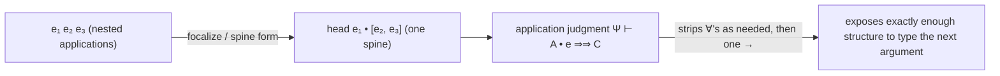
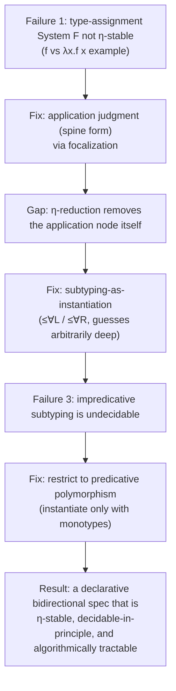

[[book-guidelines|↩ Back to guidelines]]

# The Problem of Polymorphism in Bidirectional Systems

## Why bidirectional typing needs a rethink for polymorphism

Ordinary bidirectional typechecking is built on two judgments that trade information back and forth: a **checking** judgment $\Psi \vdash e \Leftarrow A$ ("does $e$ have type $A$?") and a **synthesis** judgment $\Psi \vdash e \Rightarrow A$ ("what type does $e$ produce?"). For simply-typed languages this is a clean, complete story: introduction forms (lambdas, unit) get checking rules, elimination forms (application, variable lookup) get synthesis rules, and the one rule that crosses between the two — subsumption — happens exactly at the boundary where a synthesized type needs to be checked against something else.

The rule for checking an application $e_1\, e_2$ in a simply-typed setting is: synthesize $A \to B$ for $e_1$, check $e_2$ against $A$, and hand back $B$. This works because a function type has exactly one arrow to peel off before you find where to plug in the argument.

**What breaks without polymorphism-awareness:** once $e_1$ can synthesize a *polymorphic* type like $\forall\alpha.\alpha \to \alpha$, "peel off one arrow" is no longer well-defined. Before you can see an arrow at all, you may need to strip off an unknown number of quantifiers first — and you don't know how many until you look. The naive two-judgment formulation has no place to put that work. This is the paper's core technical problem, and everything in this topic is about diagnosing it precisely enough to fix it.

If you've built a typechecker in Rust or OCaml before, you'll recognize this as the moment a `match` on the type's outer constructor stops being enough — you need something that actively "drills down" through quantifiers before dispatching on the arrow constructor. That drilling-down operation is exactly what this section is building toward (and gets its own name, the *application judgment*, introduced properly in [[Declarative-Type-System|Declarative Type System]]).

## Failure 1: type-assignment System F is not stable under η-reduction

The paper's first, sharpest diagnostic is a worked counterexample against the "obvious" declarative specification: ordinary **type-assignment System F** (the system where a term either has a type or it doesn't, with no synthesize/check distinction — Figure 5 in the paper, rules like $\mathrm{AVar}$, $\mathrm{A}{\to}I$, $\mathrm{A}{\to}E$, $\mathrm{A}\forall I$, $\mathrm{A}\forall E$).

Take a variable $f$ of type $1 \to \forall\alpha.\alpha$ (a function from the unit type to "give me any type you like, monomorphic, and I'll act like it"). Consider two terms:

$$\lambda x.\, f\, x \qquad \text{vs. its } \eta\text{-reduct} \qquad f$$

- $\lambda x.\, f\, x$ **can** be given the type $1 \to 1$. You apply $f$ to $x$ (getting something of type $\forall\alpha.\alpha$), then instantiate that quantifier to $1$ — there's a syntactic position (right after the application) where the quantifier elimination rule $\mathrm{A}\forall E$ can fire.
- $f$ itself **cannot** be given the type $1 \to 1$ in type-assignment System F. There is no application node to hang a quantifier-instantiation on — $f$ is a bare variable of type $1 \to \forall\alpha.\alpha$, and nothing forces the $\forall\alpha.\alpha$ part to collapse to $1$ until *after* $f$ gets applied to something.

So $\eta$-reduction — a step that should be type-preserving, since it's just "don't bother naming an argument you're going to immediately forward" — silently breaks typability. This is a real problem, not a curiosity: in a language like Haskell where the $\eta$ law is a valid program equality (compilers rely on it for optimizations, refactoring, and reasoning about equivalence of code), a type system that disagrees with $\eta$-equivalence is unsound with respect to how programmers actually reason about their code.

**Why this matters for elaboration work specifically:** if your declarative specification isn't $\eta$-stable, then *any* elaborator or optimizer built on top of it inherits the instability — a "harmless" simplification pass could silently turn well-typed code into ill-typed code. This is exactly the kind of soundness gap you cannot patch after the fact; it has to be designed out of the specification.

```rust
// The shape of the problem, made concrete: `f` closes over a rank-2-ish
// capability (produce a value of *any* caller-chosen type from unit),
// but Rust's own type system sidesteps the issue by requiring the
// polymorphism to be a first-class function pointer/generic, not
// something you can "under-apply" and still keep the same behavior.
fn eta_expanded<A: Default>(f: impl Fn(()) -> A) -> impl Fn(()) -> A {
    move |x: ()| f(x) // this has a concrete instantiation site for A
}
// The eta-reduct `f` itself has no such site — it's polymorphic in a way
// that only resolves once applied. System F's naive typing rules can't
// see that "would resolve if applied" is enough to justify a type.
```

## The fix: an application judgment (spine form)

Type-assignment System F's problem is really an *artifact of the syntax*: applications are written as flat, single juxtapositions ($e_1\ e_2$), but the type information that determines how many quantifiers to strip is smeared across a whole *chain* of applications and the head they originate from.

The paper's answer comes from **focalization** (Andreoli 1992), the proof-theoretic foundation underlying bidirectional typechecking generally. Focalization suggests representing applications in **spine form**: rather than nesting $((e_1\ e_2)\ e_3)$, view the whole chain as one head applied to a *spine* — a sequence of arguments. This licenses a third judgment alongside checking and synthesis:

$$\Psi \vdash A \bullet e \Rightarrow\!\Rightarrow C$$

read as: "applying something of type $A$ to argument $e$ produces something of type $C$." Crucially, this judgment can recurse through quantifiers *before* it recurses through an arrow — so "strip however many $\forall$s you need, then consume one argument" becomes a single coherent judgment instead of something bolted onto the outside of application-typing. Quantifiers get instantiated exactly when — and only when — an application forces them to reveal an arrow. This is the mechanism that will let $f$ and $\lambda x.\, f\, x$ end up with the *same* typing behavior: the instantiation site moves from "syntactically visible in the term" to "wherever the application judgment needs it," which no longer depends on whether you wrote the redex explicitly or eta-reduced it away.



This machinery alone (the application judgment) is enough to suppress *explicit type applications* in the term syntax — but, as the next subsection shows, it is not yet enough to fully restore the $\eta$ law.

## Failure 2 (subtler): even spine form isn't enough — modeling instantiation via subtyping

The application judgment handles quantifiers that appear *at the head of a chain of applications*. But $\eta$-reduction removes an application entirely — after reducing $\lambda x.\, f\, x$ to $f$, there is no application node left at all for the application judgment to attach to. You need some other mechanism that assigns $f$ the type $1 \to 1$ *without* ever looking at an application.

The paper's move — following Odersky and Läufer (1996) — is to **model instantiation via subtyping**. Define a subtyping judgment $\Psi \vdash A \le B$, read as "$A$ is at least as polymorphic as $B$" (a "more-polymorphic-than" relation), with rules that let it guess instantiations *arbitrarily deep inside a type*, not just at an application site:

$$\dfrac{\Psi \vdash \tau \qquad \Psi \vdash [\tau/\alpha]A \le B}{\Psi \vdash \forall\alpha.A \le B}\ (\le\forall L) \qquad\qquad \dfrac{\Psi, \beta \vdash A \le B}{\Psi \vdash A \le \forall\beta.B}\ (\le\forall R)$$

With this in hand, $1 \to \forall\alpha.\alpha$ becomes a subtype of $1 \to 1$ directly — no application required. $\le\forall L$ digs under the arrow (subtyping is contravariant in the domain, covariant in the codomain, like function subtyping in any OO type system) and instantiates $\alpha$ to $1$ purely as a *type-level* comparison. This is the missing piece: subsumption (checking $e \Leftarrow B$ by synthesizing $e \Rightarrow A$ and showing $A \le B$) now does double duty as the site where deep instantiation happens, so both $\lambda x.\, f\, x$ and its $\eta$-reduct $f$ can be typed at $1 \to 1$ via the *same* mechanism (one indirectly through application, one directly through subsumption) — restoring $\eta$-stability.

**Where this connects to unification and elaboration:** this "more-polymorphic-than" subtyping relation, which guesses instantiations, is a close cousin of what a real elaborator's unifier does when resolving implicit arguments — except here the "guess" is nondeterministic and declarative (the specification just asserts *some* $\tau$ works), whereas an algorithm needs to compute $\tau$ deterministically. That gap — from "guess $\tau$ exists" to "compute $\tau$" — is precisely what [[Algorithmic-Subtyping-and-Instantiation|Algorithmic Subtyping and Instantiation]] is about: existential type variables and an instantiation judgment replace the guess with a search that always terminates in the right answer.

```lean
-- The declarative subtyping-as-instantiation idea, sketched: `LE A B`
-- says "A is at least as polymorphic as B". The ∀L rule is exactly a
-- metavariable-style existential: "there exists a τ such that..."
-- which is the same shape as Lean's elaborator introducing a metavariable
-- and later assigning it via unification.
inductive LE : Ty → Ty → Prop
  | arrow : LE B1 A1 → LE A2 B2 → LE (A1.arrow A2) (B1.arrow B2)
  | forallL : (τ : Ty) → LE (subst α τ A) B → LE (Ty.forall α A) B  -- ∃τ, guessed here
  | forallR : LE A B → LE A (Ty.forall β B)                          -- (β fresh)
```

## Failure 3: impredicative subtyping is undecidable — so predicativity is forced

Preserving the $\eta$ law this way comes at a real cost, and the paper is upfront about it. The subtyping relation induced by this style of instantiation is **undecidable for impredicative polymorphism** (Tiuryn and Urzyczyn 1996; Chrząszcz 1998) — impredicative meaning quantifiers can be instantiated with *any* type, including other polymorphic (quantified) types, so a $\tau$ substituted at $\le\forall L$ could itself contain more $\forall$s, and the search space for "does some instantiation make this subtyping hold" is unbounded and, in general, not decidable.

Since the whole point of this project is a typechecking **algorithm** that is sound *and* complete — not just a specification with good properties on paper — undecidable subtyping is a non-starter. The paper's resolution: restrict to **predicative polymorphism**. Quantifiers may only be instantiated with **monotypes** $\tau$ (types with no quantifiers at all — the "$\tau, \sigma$" distinguished from general types $A, B$ in the grammar), never with other polymorphic types. This is a real expressiveness restriction (you lose some impredicative instantiations that would type-check under full System F), but it is exactly the restriction that makes the subtyping — and hence the whole algorithm — decidable. Section 9 of the paper surveys systems (MLF, HML, FPH) that keep the full impredicative System F type language and pay for it with more complex algorithms or weaker completeness guarantees; this paper deliberately trades some of that expressiveness for the "no data structure more sophisticated than a list, no search or backtracking" simplicity promised in the introduction.

**What breaks without this restriction:** if quantifiers could be instantiated with polymorphic types, the algorithmic system built in later sections — which relies on existential variables solving to monotypes so that a strictly-decreasing termination measure exists (see [[Metatheory-of-the-Algorithm|Metatheory of the Algorithm]]) — would lose its decidability argument outright. Predicativity isn't a simplifying afterthought; it's a load-bearing precondition for every decidability proof that follows.

## Synthesis: three failures, one fix



Each of these three moves closes a gap the previous one opened: the application judgment fixes the *obvious* failure (application-visible polymorphism) but exposes a subtler one ($\eta$-reduced terms with no application node); subtyping-as-instantiation fixes that but is only decidable if you give up impredicativity; predicativity is accepted as the necessary price. The result is the declarative type system built in full in [[Declarative-Type-System|Declarative Type System]] — checking, synthesis, and application judgments, plus the $\le\forall L / \le\forall R$ subtyping rules — which the paper then proves sound and complete with respect to type-assignment System F (up to $\beta\eta$-equivalence), *despite* being a genuinely different specification from it.

## Where this leads

This section sets the actual target the rest of the paper has to hit: a declarative specification that is $\eta$-stable and — because it's predicative — has a fighting chance at a decidable, complete algorithm. [[Declarative-Type-System|Declarative Type System]] formalizes the three judgments and subtyping rules sketched here and proves the soundness/completeness/robustness theorems. Because the declarative $\le\forall L$ rule "guesses" a monotype $\tau$ out of thin air, it is not itself an algorithm — turning that guess into a deterministic, terminating procedure is the job of existential type variables and ordered contexts, covered starting in [[Algorithmic-Contexts|Algorithmic Contexts]] and [[Algorithmic-Subtyping-and-Instantiation|Algorithmic Subtyping and Instantiation]]. If you're building an elaborator, this is the point in the paper to internalize: predicativity is the concession that makes metavariable-driven instantiation (as opposed to full higher-order unification) tractable — the same tradeoff every practical implicit-argument resolver, including Lean's, has to make in some form.
