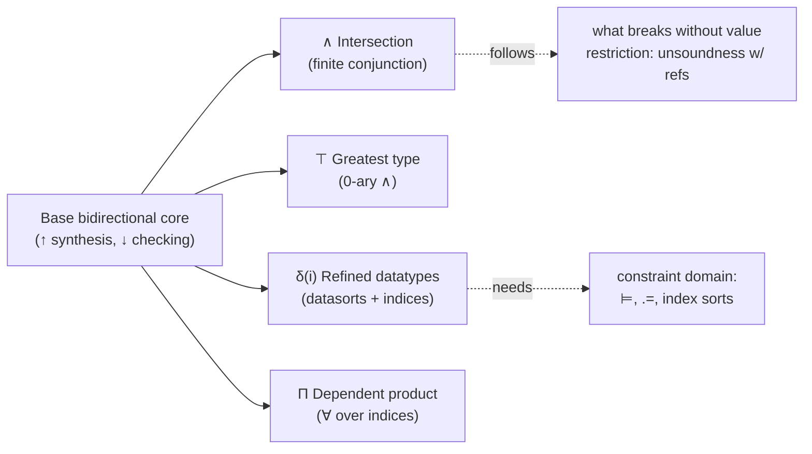

[[book-guidelines|↩ Back to guidelines]]

## Why "definite" property types at all?

Ordinary type systems tell you *what shape* a value has: "this is an `int`," "this is a `list`." They don't tell you *which* value of that shape you have. A function `Nil() : list` and a function returning `Cons(1, Cons(2, Nil()))` both just typecheck as `list`. If you want to statically guarantee something like "this list has even length" or "this value is exactly the boolean `true`," the base type system has nothing to say — that information either lives in a comment, in a runtime assertion, or nowhere at all.

**Property types** are Dunfield and Pfenning's answer: types that layer *properties of values* on top of the base type structure, checked at compile time, with no runtime cost. The paper splits these into two flavors, and this article covers only the first:

- **Definite property types** ($\wedge$, $\top$, refined datatypes, $\Pi$) — the type of the *whole* term is fully determined by structural, compositional rules. You never need to look outside the term itself to know its type.
- **Indefinite property types** ($\vee$, $\bot$, $\Sigma$) — covered in the companion article ["Indefinite Property Types and the Third Direction"](Indefinite-Property-Types-and-the-Third-Direction.md) — where the type of a *use site* can depend on context in a way that forces the typechecker to reach into evaluation position. That distinction is the paper's central organizing idea, and it's worth holding onto as you read: everything below is "easy" precisely *because* it stays compositional.

The mechanism that makes any of this checkable without a full unification engine is **bidirectional typing** (see ["Bidirectional Typechecking Design Principles"](Bidirectional-Typechecking-Design-Principles.md)): every judgment is either a *synthesis* judgment $e \uparrow A$ ("given $e$, compute its type") or a *checking* judgment $e \downarrow A$ ("given $e$ and a candidate type $A$, verify it"). The rule of thumb, straight from Curry-Howard: **introduction forms (constructors) are checked; elimination forms (destructors) synthesize.** Every property type below follows this rule mechanically, which is exactly why the presentation feels so uniform once you see the pattern once.



---

## 1. Intersection types $A \wedge B$

### What breaks without it

Suppose you want to write one function that behaves correctly both when treated as `int → even` and as `int → odd`, because its actual behavior depends on structural properties the base type system can't see (e.g. it doubles its input, or negates parity depending on a refinement you'll meet in §3 below). Without intersections, you'd need to either duplicate the function under two names, or throw away one of the two guarantees. Intersection types let a single term legitimately carry *both* typings simultaneously.

### The idea, then the rules

A value $v$ has type $A \wedge B$ exactly when it has type $A$ *and* it has type $B$. Since this is a property of a value being *constructed* correctly under two different lenses, it's an introduction form — so, per the rule of thumb above, it's **checked**, not synthesized:

$$
\frac{\Gamma \vdash v \downarrow A \qquad \Gamma \vdash v \downarrow B}{\Gamma \vdash v \downarrow A \wedge B} \quad (\wedge I)
$$

The elimination rules extract either half. Since you already know you have an $A \wedge B$ (an elimination form always *starts from* known structure), these synthesize:

$$
\frac{\Gamma \vdash e \uparrow A \wedge B}{\Gamma \vdash e \uparrow A} \quad (\wedge E_1)
\qquad\qquad
\frac{\Gamma \vdash e \uparrow A \wedge B}{\Gamma \vdash e \uparrow B} \quad (\wedge E_2)
$$

The paper is careful to point out a subtlety here: for *ordinary* types, elimination rules are usually just consequences of a subtyping rule combined with (sub) — you don't need to state them separately. For intersections, once bidirectionality is strictly enforced, $(\wedge E_1)$/$(\wedge E_2)$ must be given as **primitive** rules; they don't fall out for free. Still, if you erase all the bidirectional bookkeeping, what's left is the ordinary logical rules for conjunction — the directionality is a bidirectional-typechecking artifact layered on top of a completely standard logical core.

### The value restriction — the one thing you must not skip

$(\wedge I)$ is written with a **value** $v$, not an arbitrary expression $e$. This is not a presentational shortcut — it's load-bearing. If you allowed $(\wedge I)$ over arbitrary expressions in a call-by-value language with mutable references, the rule becomes **unsound**. Here's the shape of the counterexample the value restriction guards against: a `ref` cell, once allocated at one type, can be aliased and mutated through a second incompatible type if the type system ever lets you "launder" an effectful expression through two different static views of the same value. Intersections make this worse than ordinary polymorphism because $(\wedge I)$ literally asks the same *elaborated term* to satisfy two typing derivations — if evaluating it twice (once per derivation) could produce two different results or perform an effect twice, soundness collapses. Restricting to values sidesteps this because a value is already "settled" — evaluating it again is a no-op.

This is the same shape of restriction you'll recognize from ML's value restriction on `let`-polymorphism — same disease (effects + generalization), same cure (only generalize over things with no evaluation left to do).

### Grounding: intersection as trait intersection

**Rust.** Rust doesn't have intersection types as a first-class value-level construct, but the *checking-not-synthesizing* discipline maps cleanly onto trait bound checking. A function that requires `T: Even + Positive` is checking a value against a conjunction of properties, verified once at the call site rather than synthesized from the value's structure:

```rust
trait Even { fn is_even_proof(&self) -> bool; }
trait Positive { fn is_positive_proof(&self) -> bool; }

// Checking-mode: caller must prove T inhabits BOTH properties.
fn halve_safely<T: Even + Positive>(x: T) -> T {
    // by construction, x already satisfies both bounds
    x
}
```

The trait-bound conjunction `Even + Positive` is exactly $(\wedge I)$'s checking obligation, and pulling a single bound back out (`fn f<T: Even>(x: impl Even + Positive)`) is exactly $(\wedge E_1)$ — Rust's trait solver does this elimination for you implicitly at every call site, which is precisely why it *can* stay implicit: Rust's trait bounds are refinement-free (they don't carry index arithmetic), so there's no completeness problem to solve. Once you add refinement indices (§3 below), that implicitness stops being free — which is exactly the problem the whole paper exists to solve.

**Lean.** Lean's kernel gives you the more literal analogue via `And` and structure conjunction, but the *type-level* (not proof-level) intersection is better seen through Lean's own elaboration of a term against multiple expected types via unification retries — structurally, checking `v : A ∧ B` is exactly asking Lean's `isDefEq` to succeed against two different expected types for the same elaborated term, in sequence, with no re-elaboration in between (mirroring why $(\wedge I)$ requires a *value*, not an expression to be re-run).

```lean
structure EvenOdd (A B : Prop) where
  left  : A
  right : B
-- constructing ⟨proofA, proofB⟩ is checking-mode (∧I);
-- .left / .right projections are synthesis-mode (∧E₁ / ∧E₂)
```

---

## 2. The greatest type $\top$

$\top$ is deliberately anticlimactic: it's presented as **the 0-ary form of intersection**. Where $\wedge$ conjoins two properties, $\top$ conjoins *zero* properties — meaning it imposes no constraint at all.

$$
\frac{}{\Gamma \vdash v \downarrow \top} \quad (\top I)
\qquad\qquad
\frac{}{\Gamma \vdash A \le \top} \quad (\top R)
$$

Two things to notice, both direct consequences of "$\top$ is $\wedge$ with zero conjuncts":

- **There is no elimination rule and no left-subtyping rule for $\top$.** This mirrors the fact that $(\wedge E_1)/(\wedge E_2)$ extract one of the *given* conjuncts — with zero conjuncts, there's nothing to extract. Similarly there's no rule "$\top \le B$" for arbitrary $B$, because $\top$ carries no information you could use to justify that $B$ holds.
- **The value restriction still applies** — $(\top I)$ is checked against a value $v$, same as $(\wedge I)$, for the identical soundness reason.

$\top$ is the type-theoretic analogue of Rust's `()` used as a trivial trait bound, or of a universal top type in a subtyping lattice — everything is a subtype of it, and knowing a value has type $\top$ tells you nothing you didn't already know.

---

## 3. Refined datatypes: datasorts and index refinements

This is where the paper's connection to **refinement types** proper becomes concrete, and it's the densest part of §3.

### The two independent refinement axes

The paper refines each datatype along **two separate, orthogonal axes**:

1. **Datasorts** ($\delta$) — an atomic subtyping relation $\sqsubseteq$ over *symbolic* refinements of a datatype's *constructors*. A datasort identifies a subset of values of the form $c(v)$ for some constructor $c$. The paper's own example: for `bool`, the datasorts `true` and `false` each identify a singleton subset of `bool`'s values — not by predicate, but by which constructor built the value.
2. **Index refinements** — numeric (or more generally, constraint-domain) parameters attached to a datasort, drawn from some **constraint domain**. The combined type $\delta(i)$ is "the type of values having datasort $\delta$ *and* index $i$." In this paper the only index sort used is the natural numbers $\mathbb{N}$ with equality and $+, -, *$.

The worked example makes both axes concrete at once: refine a list datatype by `odd`/`even` datasorts (parity of length) *and* by the length itself as an index:

$$
\mathsf{Nil} : 1 \to \mathsf{even}(0)
$$
$$
\mathsf{Cons} : (\Pi a{:}\mathbb{N}.\ \mathsf{int} * \mathsf{even}(a) \to \mathsf{odd}(a+1)) \wedge (\Pi a{:}\mathbb{N}.\ \mathsf{int} * \mathsf{odd}(a) \to \mathsf{even}(a+1))
$$

Read this literally: `Cons`'s type is an *intersection* (§1 above — this is where $\wedge$ actually earns its keep) of two `Π`-quantified (§4 below) cases, one per parity flip. This single example is a microcosm of the whole section: refined datatypes, index refinements, intersections, and dependent products all cooperating to give `Cons` a precise, checkable type that ordinary `list` never could. Given this, the function that doubles a list's elements while preserving structure —

```
fix repeat. λx.
  case x of Nil ⇒ Nil | Cons(h,t) ⇒ Cons(h, Cons(h, repeat(t)))
```

— **checks against** $\Pi a{:}\mathbb{N}.\ \mathsf{list}(a) \to \mathsf{even}(2*a)$: for *any* input length $a$, the output is provably even (it's literally $2a$). That's a property no ordinary type system states, let alone verifies, and it's checked with zero runtime cost.

### The machinery underneath: contexts, entailment, and the constructor typing judgment

To support index variables, the context $\Gamma$ is extended to hold not just program-variable typings but also index-variable sorts and propositions: $\Gamma ::= \cdot \mid \Gamma, x{:}A \mid \Gamma, a{:}\gamma \mid \Gamma, P$. Because program-variable bindings are irrelevant to index reasoning, the paper defines a **restriction function** $\overline{\Gamma}$ that strips program-variable typings out, leaving only the index-relevant skeleton — this is exactly what gets fed to the constraint solver.

The constraint domain itself is treated abstractly, required only to supply:

- a decidable **entailment** (consequence) relation $\Gamma \models P$ — "given the index typings and propositions in $\Gamma$, does $P$ necessarily hold?"
- an equivalence relation $\dot{=}$ on indices, and a sort-membership judgment $\Gamma \vdash i : \gamma$,
- and (for the metatheory to go through) that $\overline{\cdot} \not\models \bot$, and that $\models$ and $\vdash$ have the expected substitution and weakening properties.

Constructors are typed via a judgment $\Gamma \vdash c : A \to \delta(i)$ — note that a single constructor `c` can have **more than one** refined type (as `Cons` did above, via the intersection). Constructing a refined value then checks the argument against whichever $A$ the chosen typing demands:

$$
\frac{\Gamma \vdash c : A \to \delta(i) \qquad \Gamma \vdash e \downarrow A}{\Gamma \vdash c(e) \downarrow \delta(i)} \quad (\delta I)
$$

**Why the entailment relation matters for correctness, not just types:** case analysis over a refined datatype checks every arm's body against the result type, under a context enriched with whatever propositions that arm's pattern implies. If that enrichment makes $\Gamma$ *contradictory* — formally, $\overline{\Gamma} \models \bot$ — the arm is statically unreachable given the refinement information, and the typechecker doesn't even bother checking its body:

$$
\frac{\overline{\Gamma} \models \bot}{\Gamma \vdash e \downarrow A} \quad (\text{contra})
$$

This is a small but real piece of **dead-code elimination baked directly into the type system**, driven purely by the entailment relation of the constraint domain — the paper notes datasort-based unreachability (as opposed to index-based) is handled separately.

Datasort subtyping is checked structurally, decomposing $\sqsubseteq$ on the datasort and equality on the index, **separately**:

$$
\frac{\delta_1 \sqsubseteq \delta_2 \qquad \Gamma \vdash i \dot= j}{\Gamma \vdash \delta_1(i) \le \delta_2(j)} \quad (\delta)
$$

— and $\sqsubseteq$ must itself be reflexive and transitive, precisely so that the derived subtyping relation on $\delta(i)$ inherits reflexivity and transitivity (a prerequisite for any well-behaved subtyping system, needed downstream for (sub) to compose sanely).

### Grounding: refined datatypes as a typestate/refinement layer

**Rust.** The cleanest mechanical analogue is the *typestate pattern*: encode a datasort as a marker type parameter, and let each constructor's signature narrow the marker. This is a compiler-pass-shaped sketch of exactly the `Cons`/parity example above:

```rust
use std::marker::PhantomData;

struct Even; struct Odd;               // datasorts, as zero-sized marker types
struct List<Parity> { len: usize, data: Vec<i64>, _p: PhantomData<Parity> }

impl List<Even> {
    fn cons(self, h: i64) -> List<Odd> {           // (a) -> odd(a+1)
        List { len: self.len + 1, data: prepend(h, self.data), _p: PhantomData }
    }
}
impl List<Odd> {
    fn cons(self, h: i64) -> List<Even> {           // (a) -> even(a+1)
        List { len: self.len + 1, data: prepend(h, self.data), _p: PhantomData }
    }
}
# fn prepend(h: i64, mut v: Vec<i64>) -> Vec<i64> { v.insert(0, h); v }
```

Two things this sketch *cannot* express that the paper's system can, and it's worth naming the gap explicitly: (1) Rust's type system has no constraint solver, so it can encode `Even`/`Odd` as *sorts* but not track the numeric index $a$ symbolically the way $\delta(i)$ does — you'd need a real refinement-type extension (à la Liquid Haskell/Flux-style tooling, or a bespoke elaborator — which is exactly the kind of tool your standing project is aiming at) to get the length tracked as a first-class index rather than baked into the marker type's identity; (2) there's no entailment relation, so Rust's exhaustiveness checker can't discharge `(contra)`-style unreachable-arm reasoning from arithmetic facts, only from pattern shape.

**Lean.** Lean is the far more literal translation, because Lean *has* a real constraint/index layer via dependent types and decidable propositions. An indexed inductive family plays the role of $\delta(i)$ directly, and Lean's own definitional-equality/decision-procedure machinery *is* the entailment relation $\Gamma \models P$ the paper treats abstractly:

```lean
inductive EvenList : Nat → Type
  | nil : EvenList 0
  | cons : Int → OddList n → EvenList (n + 1)
inductive OddList : Nat → Type
  | cons : Int → EvenList n → OddList (n + 1)
```

Here the index `n` is tracked exactly (not just its parity marker), `Lean`'s kernel-level `decide`/`omega` tactics play the role of $\Gamma \models P$, and pattern-matching's built-in exhaustiveness/impossibility checking is `(contra)` made concrete — Lean will refuse an impossible case arm using precisely the same "context is contradictory" reasoning, just discharged by its own decision procedures instead of an abstract constraint domain.

---

## 4. The dependent product $\Pi a{:}\gamma.\, A$

### The idea

Not every property is fixed once and for all — sometimes a function must work correctly *for every* value of some index. $\Pi a{:}\gamma.\, A$ universally quantifies an index variable $a$ of sort $\gamma$ over the body type $A$. The paper is explicit that you can read this two ways simultaneously: as an infinitary intersection over all instantiations of $a$ (in keeping with the "definite types are compositional" theme), or — closer to what a programmer expects — as **a dependent function type, but over indices rather than terms**. `Cons`'s type above used exactly this to quantify over "any starting length $a$."

$$
\frac{\Gamma, a{:}\gamma \vdash v \downarrow A}{\Gamma \vdash v \downarrow \Pi a{:}\gamma.\, A} \quad (\Pi I)
\qquad\qquad
\frac{\Gamma \vdash e \uparrow \Pi a{:}\gamma.\, A \qquad \Gamma \vdash i : \gamma}{\Gamma \vdash e \uparrow [i/a]A} \quad (\Pi E)
$$

$(\Pi I)$ checks the body against $A$ under a context extended with a **fresh** index variable $a$ — general assumption throughout the paper, always achievable by renaming, i.e. $\alpha$-conversion. $(\Pi E)$ instantiates: give it a concrete index $i$ of the right sort, and it substitutes $[i/a]A$ into the result — mechanically identical to how a term-level $\Pi$-type (a dependent function) would be applied, just at the index layer instead of the term layer. As with $\wedge$ and $\delta$, the introduction form is restricted to **values**, for the same effects-soundness reason as before.

### The subtlety that sets up the *next* article

There's a scoping trap buried in $(\Pi I)$ that the paper flags explicitly and defers: the value $v$ being checked **cannot reference $a$ inside an internal type annotation**, because doing so would violate $\alpha$-conversion — you couldn't safely rename $a$ to $b$ inside $\Pi a{:}\gamma.\,A$ (which is $a$'s natural scope) if some annotation buried inside $v$ also silently depends on that same name. The paper's fix — **[[Contextual-Typing-Annotations|contextual typing annotations]]** — is developed in the very next section of the book (and is the subject of a separate article); it's worth flagging here because it's the first crack in "definite types are simply compositional": even fully definite $\Pi$ has a real annotation-hygiene problem lurking in it.

Subtyping for $\Pi$ has a left rule (instantiate, mirroring $(\Pi E)$) and a right rule (generalize, mirroring $(\Pi I)$):

$$
\frac{\Gamma \vdash [i/a]A \le B \qquad \Gamma \vdash i : \gamma}{\Gamma \vdash \Pi a{:}\gamma.\, A \le B} \quad (\Pi L)
\qquad\qquad
\frac{\Gamma, b{:}\gamma \vdash A \le B}{\Gamma \vdash A \le \Pi b{:}\gamma.\, B} \quad (\Pi R)
$$

with the usual proviso on $(\Pi R)$ that $b$ must not occur free in $A$. One genuinely practical wrinkle the paper is upfront about: $(\Pi L)$ and $(\Pi E)$ both require *guessing* the instantiating index $i$. In an actual implementation you don't guess — you plug in a fresh **existentially quantified** metavariable for $i$ and let constraint solving determine it later. The paper's own remark here is worth italicizing for the standing-project angle: *even a system with no explicit $\Sigma$ types at all* would still need its constraint solver to support existentially quantified variables internally, purely to implement $\Pi$-elimination algorithmically. Index-metavariable resolution here is a small, self-contained instance of exactly the metavariable-unification machinery an elaborator (Lean-style) needs for implicit-argument resolution in general — the same shape of problem recurs at the term level in later sections.

### Grounding: universal index quantification

**Lean** is the natural primary grounding here, because Lean's own `∀`/`Π` *is* this rule, just without the term/index stratification the paper insists on for decidability reasons:

```lean
-- Πa:ℕ. list(a) → even(2*a), directly as a dependent Lean type:
def doubleUp {a : Nat} (l : Vec Int a) : Vec Int (2 * a) := ...
-- (ΠE) instantiation happens automatically at each call site: Lean infers `a`
-- exactly like the paper's "plug in a fresh existential index variable."
```

**Rust**, by contrast, has no index-level quantification at all — `const` generics are the closest analogue (`fn f<const N: usize>(...)`), but Rust's const-generic solver is far weaker than a general constraint domain (no arbitrary linear arithmetic entailment, for instance), so treat this as an illustrative gesture rather than a load-bearing translation: a `const N: usize` parameter is a syntactically-restricted, non-existential fragment of what $\Pi a{:}\mathbb{N}.\,A$ expresses.

---

## Where this leads

Everything in this article stays **compositional**: every rule's premises talk only about the term (or its immediate subterms) being checked, never about *how that term is being used elsewhere*. That's precisely why $\wedge$, $\top$, $\delta(i)$, and $\Pi$ could all be handled with garden-variety bidirectional typing, no extra machinery required.

That compositionality breaks the moment you need **indefinite** property types — unions $A \vee B$, the void type $\bot$, and existential sums $\Sigma a{:}\gamma.\,A$ — because eliminating them requires finding a term's *evaluation context*, i.e. reasoning about the surrounding expression before you can typecheck the piece you started with. That's the paper's namesake "third direction," covered next in ["Indefinite Property Types and the Third Direction"](Indefinite-Property-Types-and-the-Third-Direction.md).

Separately, the $\alpha$-conversion trap flagged under $\Pi$ above (§4) is the seed of ["Contextual Typing Annotations"](Contextual-Typing-Annotations.md) — the mechanism that lets the *checking* direction survive contact with intersections and index-scoped quantifiers without breaking completeness.

**For the standing compiler/elaborator project:** this section is close to a direct blueprint for a refinement-type checker's core: datasorts + index refinements + an abstract entailment relation is exactly the shape of "constraint-based inference for refinement types" your project targets, and the entailment judgment $\Gamma \models P$ is where a real implementation would plug in an SMT solver or a bespoke arithmetic decision procedure. The $\Pi$-elimination instantiation problem (guess $i$, defer via a fresh existential, resolve via constraint solving) is a miniature, term-index-only preview of the general metavariable-unification problem a Miller-pattern-style elaborator has to solve at the term level — worth remembering when you get to the paper's later sections on contextual annotations, where that same instantiation problem reappears at full strength.
