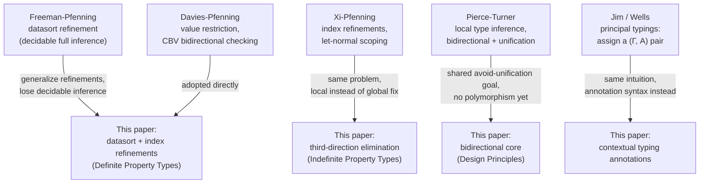

# Related Work on Refinement, Intersection, and Union Types

[[book-guidelines|↩ Back to guidelines]]

## Why a related-work section matters here

Every device this paper builds — datasort refinements, the value restriction, contextual typing annotations — is a *fix* for something. The most efficient way to actually understand why each fix has the shape it has is to see what it replaced, and what limitation forced the replacement. Section 6 is Dunfield and Pfenning doing exactly that: closing the paper by placing their own machinery against five prior lines of work. This article walks through each comparison as a "before/after," because that's the form the paper's own argument takes, and because it gives you — someone about to build a refinement-type checker of your own — a map of design choices other systems made, and why this paper's authors made different ones.

## Datasort refinement: decidable inference at a cost

**The lineage.** Tim Freeman and Frank Pfenning's earlier work (*Refinement Types for ML*, PLDI '91 and Freeman's 1994 thesis) combined datasort refinements with intersection types and showed that **full type inference is decidable** — you don't write any annotations at all — provided the refinements obey what they called the *refinement restriction*. The technique came from abstract interpretation: the datasort discipline is restrictive enough that inference can be phrased as computing a fixed abstract value.

**What "the refinement restriction" costs you.** That decidable-inference result only holds for a constrained fragment of refinements. This paper's own datasort refinements (covered in [[Definite-Property-Types]]) are more expressive — arbitrary index refinements over a constraint domain, not just a closed abstract-interpretation lattice — and as a direct consequence, full inference is *not* recoverable. That's precisely why this paper needs an annotation discipline (contextual typing annotations) at all: the tradeoff for more expressive refinements is that the programmer has to say more.

**The mechanism connection worth keeping in mind:** what Freeman–Pfenning get "for free" via abstract interpretation, this paper's datasort subtyping relation $\sqsubseteq$ and entailment judgment $\Gamma \models P$ (from [[Definite-Property-Types]]) get via an explicit constraint-domain oracle instead — the same underlying question ("which values does this refinement denote, and is one contained in another"), answered by a different, more general mechanism.

## The value restriction: soundness under effects

Rowan Davies and Frank Pfenning's earlier work was the first to conclusively handle intersection types in a **call-by-value language with effects**. Two contributions carry over directly into this paper:

1. **The value restriction on intersection introduction** — the requirement (used throughout [[Definite-Property-Types]]'s treatment of $\wedge I$) that a term can only be checked against an intersection $A \wedge B$ if it's a *value*. Davies and Pfenning identified *why* this restriction is necessary: without it, intersection introduction is unsound in the presence of mutable references, because a single evaluation of an effectful expression can't simultaneously "be" two different observations of two different types.
2. **A practical bidirectional checking algorithm** for the resulting system — this paper's entire checking/synthesis apparatus (see [[Bidirectional-Typechecking-Design-Principles]]) descends from that line, adapted first for property types generally, and now extended to the tridirectional (union/existential) case.

**What breaks without the value restriction:** consider a term `e` with an effect (say, incrementing a mutable counter) that could be checked against `A ∧ B` by evaluating it "twice" — once under each conjunct's expectations. In a call-by-value language, `e` only actually runs once; the two typing derivations would be lying about what the program does. Restricting introduction to values sidesteps the problem entirely by only ever intersecting things that have no effects left to observe.

## Xi's index refinements: a different answer to scope

This is the comparison the paper spends the most care on, because it's the closest prior system to the "third direction" material in [[Indefinite-Property-Types-and-the-Third-Direction]].

**The shared problem.** Hongwei Xi and Frank Pfenning's earlier work introduced index refinements — the machinery behind this paper's $\delta(i)$ and $\Pi a{:}\gamma.A$ (see [[Definite-Property-Types]]). Both systems then hit the same wall: an existential index quantifier $\Sigma a{:}\gamma.A$ needs elaboration to figure out **where the existential's scope begins** in the source program, and that scope boundary isn't syntactically marked.

**Xi's fix: force evaluation order onto the whole program.** Xi's approach was to translate the entire program into **let-normal form** before checking index refinements — essentially forcing every subexpression evaluation to be named and sequenced up front, so that "when does this existential get eliminated" becomes syntactically explicit by construction. This is a global, whole-program transformation.

**This paper's fix: a local, on-demand third direction.** Rather than transforming the whole program up front, [[Indefinite-Property-Types-and-the-Third-Direction]]'s $(\vee E)/(\bot E)/(\Sigma E)$ rules locally decompose *just the subterm that needs it* into an evaluation context $E$ and a synthesizing hole, on demand, during typechecking itself.

**The tradeoff the paper is explicit about:** their tridirectional system provably admits *more* programs than Xi's let-normal translation, even restricted to just index refinements — but at the cost of nondeterminism (which evaluation-context decomposition do you pick?), which is exactly the problem [[The-Left-Tridirectional-System]] exists to tame. Interestingly, the paper doesn't claim Xi's idea is simply worse: it conjectures that Xi's whole-program evaluation-order traversal could be adapted to *eliminate* the (directL) rule's nondeterminism in their own left system — a piece of unfinished business they flag as future work rather than resolved here.

**Why this matters for an elaborator you'd build:** this is a direct preview of a design axis you'll face in any implementation with existentials/metavariables — *global* scope-resolution passes (Xi's style) versus *local, on-demand* resolution triggered by need (this paper's style, and closer to how a Miller-pattern-unification-based elaborator typically works, deferring metavariable resolution until a constraint forces it rather than pre-normalizing everything).

## Intersections and unions as program-analysis devices

The paper briefly distinguishes its use of intersection/union types from a different tradition: **program analysis for control flow** (Palsberg and Pavlopoulou; Reynolds' original practical intersection-type language; Pierce's syntactic-marker-based union typechecking). In that tradition, intersection/union types encode control-flow *facts* discovered by analysis, not specifications a programmer writes down; "soft typing" systems for dynamically-typed languages use a similar toolkit (intersection, union, even conditional types) for inference under a different goal (permissiveness, not specification). The paper notes plainly that despite superficial notational overlap, the technical realization and the goals diverge substantially — worth knowing mainly so you don't conflate "a type checker that uses intersection types" with "a control-flow analysis that happens to produce intersection-shaped facts."

## Local type inference: avoiding unification, differently

Benjamin Pierce and David Turner's **local type inference** is described as the closest relative in spirit: also a bidirectional system with synthesis and checking judgments, also trying to avoid heavyweight global inference (see [[Bidirectional-Typechecking-Design-Principles]] for why this paper avoids unification in the first place).

**Where it diverges.** Pierce and Turner's language has subtyping *and* impredicative polymorphism — a combination where full type inference is undecidable outright. To make partial inference work anyway, they **infer type arguments to polymorphic functions**, which the paper notes "seems to substantially complicate matters." Dunfield and Pfenning's system, by contrast, doesn't yet have parametric polymorphism at all, and the paper is candid that prior attempts to add it (with or without syntactically distinguishing "ordinary" from "property" types) aren't conclusive — though they suggest ML-style *prefix* polymorphism specifically should be tractable to add consistently with the bidirectional discipline.

**Why this is a load-bearing comparison for you:** "avoid unification for type arguments, infer them locally and bidirectionally instead" is the same design tension a Lean-style elaborator faces with implicit-argument resolution via metavariables. Pierce–Turner's experience — that inferring type arguments bidirectionally is workable but "substantially complicates matters" once you add polymorphism — is a direct, empirically-grounded warning about what to expect when you extend a bidirectional core (like this paper's) with implicit/polymorphic arguments resolved via unification, exactly the elaborator feature in your project's target design.

## Principal typings: the ancestor of contextual annotations

**The concept.** A *principal type* of a term $e$ is a single type that represents every type $e$ could be assigned in a given context $\Gamma$. A **principal typing** (Trevor Jim's term, refined by Joe Wells) generalizes this one step further: instead of fixing $\Gamma$ and asking for the most general $A$, a principal typing is a *pair* $(\Gamma, A)$ that represents every valid pair $(\Gamma', A')$ under which $e$ type-checks. Wells' contribution was making the underlying notion of "representation" precise enough that different systems' principal typings could be meaningfully compared — Jim's original formulation left "represents" underspecified in a way that made comparisons difficult across systems.

**Why this paper cites it rather than proves it.** Dunfield and Pfenning are explicit: full type inference for their system is unattainable in general (a consequence of the same expressiveness that costs them decidable inference in the datasort-refinement comparison above), so they haven't investigated whether principal typings exist for their language in the formal Jim/Wells sense.

**The actual connection: contextual typing annotations *are* [[Definite-Property-Types#The idea|the idea]], informally.** Recall from [[Contextual-Typing-Annotations]] that a contextual typing annotation has the form $(e : \Gamma_1 \vdash A_1, \ldots, \Gamma_n \vdash A_n)$ — a term annotated not with one type, but with a *list* of context/type pairs. That is structurally the same move principal typings make: assigning a term a **typing** (a $(\Gamma, A)$ pair, or here, a small family of them) rather than collapsing everything down to a single type in a single fixed context. The paper frames this explicitly as how the "assign a typing, not just a type" idea shows up in their system — not as a formal instance of Jim/Wells principal typings, but as the same underlying intuition solving the same underlying problem (representing several valid ways a term could be typed) via a different technical route: annotation syntax rather than a computed canonical form.

## Map of the lineage

## Where this leads

This section is connective tissue rather than new mechanism — but it's the clearest single map in the paper of which design choices were *deliberate departures* from known alternatives (Xi's global let-normal transform, Pierce–Turner's type-argument inference) versus which were *direct adoptions* (the value restriction, index refinements' basic setup). For your own refinement-type-checker project, the load-bearing lesson is the Xi comparison: local, on-demand scope/evaluation-context resolution (this paper's choice) versus global whole-program normalization (Xi's choice) is a real fork in elaborator design, not just a stylistic difference — and this paper's own unresolved conjecture (that Xi's global-traversal idea might tame the left system's remaining nondeterminism) is a hint that the two approaches aren't strictly opposed so much as trading determinism for locality.
