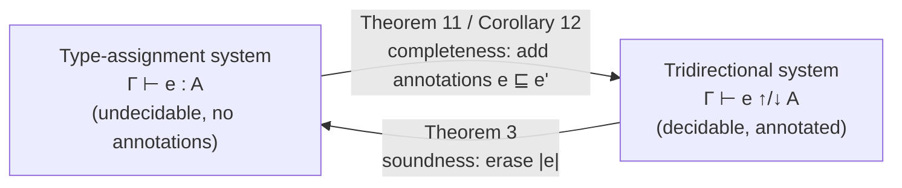

[[book-guidelines|↩ Back to guidelines]]

## Why you need two separate theorems here

Every typechecking algorithm secretly makes a bet: *"the terms I accept are exactly the terms that should be accepted."* That bet splits into two independent halves, and it's worth being pedantic about which half is which, because they fail in completely different ways.

- **Soundness**: everything the tridirectional checker accepts is actually a correct term. If soundness breaks, your checker is a liar — it stamps `well-typed` on programs that go wrong. This is the half a trusted kernel can *never* get wrong, because everything downstream (a compiler backend, a proof-carrying-code consumer, an SMT-backed verifier) trusts the stamp without re-deriving it.
- **Completeness**: the checker doesn't wrongly *reject* correct programs. If completeness breaks, your checker is merely annoying — it's conservative, and the programmer has to fight it. Painful, but not unsound.

[[Contextual-Typing-Annotations|Contextual typing annotations]] are the *mechanism* the paper builds to make both of these theorems provable — you should already have that mechanism (comma-separated `(e : Γ₁⊢A₁, …, Γₙ⊢Aₙ)` annotations and the contextual subtyping relation `▷`) in hand before reading this article. This article is about what happens *once you have that mechanism*: how do you actually state and prove that it's sound, and that it's enough?

The two proofs have wildly different shapes. Soundness is almost embarrassingly easy — a two-line induction. Completeness is the hard one, and understanding *why* it's hard is the real payoff of this section: it forces you to confront a subtlety about annotations that looks like a footnote but is actually load-bearing for the whole annotation discipline.

## Soundness: erasure as the correctness criterion

### What "sound" has to mean here

The paper doesn't invent a fresh semantic notion of correctness for the tridirectional system. It reuses one it already trusts: the **type-assignment system** — the original, undecidable, annotation-free system from the authors' prior work, where terms carry no annotations at all and you just ask "does `e` have type `A`?" (written `Γ ⊢ e : A`, no arrow). That system is the *specification*. The tridirectional system, annotations and all, is the *implementation*. Soundness says: whatever the implementation accepts, the specification would also accept, once you strip away the implementation-specific scaffolding.

That stripping operation is **erasure**, written $|e|$: delete every typing annotation from $e$, recursively. An annotated term like $(\lambda x.\, x : (\vdash A \to A))$ erases to plain $\lambda x.\, x$.

$$
\textbf{Theorem 3 (Soundness, Tridirectional).} \quad \text{If } \Gamma \vdash e \uparrow A \text{ or } \Gamma \vdash e \downarrow A, \text{ then } \Gamma \vdash |e| : A.
$$

Read this as: *annotations are advice to the checker, not part of the meaning of the program.* Whatever synthesizes or checks in the tridirectional system, its unannotated skeleton is a legitimate type-assignment derivation. This is exactly the same move a Rust programmer makes when they think of a type ascription `x as u32` or an explicit turbofish `::<T>` as something the compiler needs but that doesn't change what the *value* is — annotations guide inference, they don't alter denotation.

### Why the proof is a two-liner

> *Proof. By straightforward induction on the derivation.*

That's genuinely the whole proof in the paper. Why does it collapse so easily? Because every rule of the tridirectional system was *designed* to be erasure-compatible: each rule's conclusion, once you erase all annotations from premises and conclusion, is literally a valid rule of the type-assignment system. The (sub) rule erases to nothing extra; ($\wedge I$) erases to the type-assignment system's intersection introduction; the annotation rule (ctx-anno) erases the annotation itself and leaves behind exactly the premise $\Gamma \vdash e \downarrow A$, which recursively erases to $\Gamma \vdash |e| : A$. There's no case where the tridirectional system does something the type-assignment system *can't* also justify — the tridirectional rules are a strict discipline layered *on top of* an already-correct set of typing rules, not a different logic.

**What breaks without this:** if some tridirectional rule let you synthesize or check a type that the underlying type-assignment system would reject, you'd have built an algorithm that "proves" false theorems — accepts programs the semantics doesn't actually support. Erasure-soundness is the mechanical proof that this can't happen, precisely because it's checked rule-by-rule, not by some global semantic argument.

**Rust/Lean framing.** This is the same relationship a bidirectional elaborator has to a trusted kernel: Lean's elaborator inserts metavariables, coercions, and instance arguments (all "annotation-shaped" scaffolding), but the *kernel* only ever re-checks the elaborated, fully-explicit term — and a soundness theorem exactly like Theorem 3 (usually implicit, sometimes explicit as a kernel-independence result) says that stripping elaborator artifacts still yields something the kernel's un-elaborated core logic would accept. In a Rust verifier you're building, this is the theorem that licenses discarding your inference/annotation machinery before final proof emission — the trusted kernel only ever needs to check the "erased," fully-explicit form.

## Completeness: the hard direction

### Why you can't just say "add an annotation"

The obvious-sounding completeness statement is: *if the type-assignment system accepts $e$, some annotated version of $e$ synthesizes in the tridirectional system.* True as a slogan, false as a proof strategy if you're sloppy about it. Consider:

$$
\vdash \lambda x.\, x : A \to A \quad \text{(type-assignment, for any } A\text{)}
$$

but plain $\lambda x. x$ *never* synthesizes in the tridirectional system — introduction forms don't synthesize, that's the whole bidirectional discipline (see [[Bidirectional-Typechecking-Design-Principles]]). You must annotate:

$$
\vdash (\lambda x.\, x : (\vdash A \to A)) \uparrow A \to A
$$

So completeness has to talk about *some annotated version* of the original term, not the term itself. That's a genuinely different shape of theorem than soundness — soundness is a direct induction on one derivation; completeness has to *construct* a new term (the annotated one) and simultaneously prove it type-checks. Before that construction can be made precise, the paper needs machinery for talking about "an annotated version of $e$."

### The scaffolding: synthesizing form and two notions of extension

**Definition 4 (synthesizing form).** A term is in synthesizing form if it's one of: a variable $x$, an application $e_1\, e_2$, a value-index-application $u$, an already-annotated term $(e : As)$, or a projection $\mathsf{fst}(e)/\mathsf{snd}(e)$. In other words: exactly the syntactic shapes the bidirectional discipline lets synthesize on their own, without needing a fresh annotation. This is the same list you'd get by looking at which constructors of your AST enum are *elimination-shaped* — think of it as a predicate `fn is_synthesizing_form(e: &Term) -> bool` your elaborator would need before deciding whether a subterm needs a fresh metavariable-annotation slot or can just be re-checked in place.

**Definition 5 (extension, $e' \sqsupseteq e$).** $e'$ extends $e$ if $e'$ is $e$ with zero or more typing annotations *added*, subject to one restriction: $e'$ must not add annotations to the *roots* of subterms that are already in synthesizing form. Why the restriction? Because an already-synthesizing subterm doesn't need help — wrapping it in an annotation would be redundant scaffolding, and worse, it would break the induction that completeness is proved by (the proof needs to match the *shape* of the original type-assignment derivation, and an unnecessary annotation changes that shape).

**Definition 6 (light extension, $e' \sqsupseteq_\ell e$).** A strictly narrower notion: $e'$ lightly extends $e$ if $e'$ is $e$ with zero or more *additional alternatives appended to typing-annotation lists that were already present*. You can turn $(e : As)$ into $(e : As, A')$, but you cannot introduce a *brand-new* annotation where there was none. Light extension is extension's well-behaved little sibling — it never changes where annotations exist, only how many alternatives they carry once they're already there.

Both relations are reflexive and transitive (Proposition 7 — "obvious from the definitions," the paper says, and it is: adding zero annotations is a no-op, and extending twice composes). Two supporting lemmas do quiet but essential work:

- **Lemma 8**: if $e$ is a value and $e' \sqsupseteq e$, then $e'$ is also a value. Extension can't turn a value into a non-value — annotations don't touch evaluation.
- **Lemma 9 (Light Extension)**: if $e' \sqsupseteq_\ell e$, then whatever $e$ synthesizes or checks against, $e'$ does too. This is the "safe to strengthen an annotation list" lemma — proved by a straightforward induction where either the terms must be syntactically identical (annotation-list contents don't matter to the rule), or you apply the induction hypothesis to every premise.

### The subtlety: why naive monotonicity fails

Here's the part that looks like a technicality but is actually the conceptual heart of the section. You'd love the following to be true, because it would make the completeness induction trivial:

$$
\text{"If } e \downarrow A \text{ and } e' \sqsupseteq e \text{ then } e' \downarrow A\text{"} \qquad \textbf{(naive monotonicity — FALSE)}
$$

In words: *adding more annotation alternatives to a term can never make it stop typechecking.* Sounds safe — more information should never hurt. It's false. The paper's counterexample is small and sharp:

$$
\vdash () \downarrow 1 \quad \text{is derivable.} \qquad \vdash (() : (\vdash \top)) \downarrow 1 \quad \text{is \emph{not} derivable, even though } (() : (\vdash \top)) \sqsupseteq ().
$$

Why does annotating `()` with $\top$ *break* its ability to check against $1$? Because of how annotation-checking works: given a list of annotation alternatives, the checker must successfully use *at least one of them* — it can't just ignore the annotation list and fall back to checking the bare term. So once you've written $(() : (\vdash \top))$, the checker is committed to discharging the obligation through that $\top$ annotation, and $\top$ (the greatest type, [[Definite-Property-Types|discussed here]]) has no useful subtyping relationship to $1$ that lets the check against $1$ go through. Adding an annotation didn't add information for free — it added an *obligation*, and that obligation can conflict with what you were trying to prove.

**What breaks without this insight:** if you tried to prove completeness by naive induction assuming monotonicity, the inductive step for $(\wedge I)$ (checking a term against $A \wedge B$, hence needing it to check against both $A$ and $B$) would silently need to combine two *independently* extended witness terms into one — and naive monotonicity doesn't let you do that combination safely, because extending toward $A$'s witness might break the check against $B$.

The fix is not "avoid annotating" — it's "annotate correctly, by *adding to* an existing annotation list rather than introducing a fresh one." Continuing the example: $(() : (\vdash \top))$ alone fails against $1$, but *lightly* extending it to $(() : (\vdash \top), (\vdash 1))$ succeeds — now the checker has an alternative, $\vdash 1$, that actually discharges the obligation. This is exactly what Lemma 9 (Light Extension) guarantees is always safe: light extension only ever adds alternatives to an annotation that's already committed to being checked, so it can only help, never hurt.

This is why the paper needs the *two* separate extension relations. General extension ($\sqsupseteq$) is what completeness needs semantically (you may need entirely new annotations on previously-unannotated subterms), but it's not monotone. Light extension ($\sqsupseteq_\ell$) *is* monotone (Lemma 9), but it's not expressive enough on its own to reach a synthesizing derivation from scratch. **Lemma 10 (Monotonicity under Annotation)** stitches them together into the property that's actually true and actually sufficient:

$$
\text{(1) If } \Gamma \vdash e \downarrow A \text{ and } e' \sqsupseteq e, \text{ then there exists } e'' \sqsupseteq_\ell e' \text{ such that } \Gamma \vdash e'' \downarrow A.
$$
$$
\text{(2) If } \Gamma \vdash e \uparrow A \text{ and } e' \sqsupseteq e, \text{ then there exists } e'' \sqsupseteq_\ell e' \text{ such that } \Gamma \vdash e'' \uparrow A.
$$

Read this as: general extension might temporarily break your derivation, but you can always repair it with a *light* extension on top — you never need to backtrack and remove an annotation, only add alternatives to lists that already exist. That's precisely strong enough to drive an induction where at $(\wedge I)$ you extend toward $A$'s witness, get a (possibly light-extension-repaired) derivation, then extend *that* toward $B$'s witness and light-extension-repair again, converging on one term that checks against both.

### Closing the loop: Theorem 11 and Corollary 12

$$
\textbf{Theorem 11 (Completeness, Tridirectional).} \text{ If } \Gamma \vdash e : A \text{ and } e' \sqsupseteq e, \text{ then}
$$
$$
\text{(i) there exists } e_1'' \sqsupseteq e' \text{ with } \Gamma \vdash e_1'' \downarrow A, \qquad \text{(ii) there exists } e_2'' \sqsupseteq e' \text{ with } \Gamma \vdash e_2'' \uparrow A.
$$

This is deliberately more general than the slogan version — it's stated *relative to* an arbitrary starting extension $e'$, not just $e$ itself, precisely so the induction can go through: at each inductive step you're extending what's already been extended, and Lemma 10 is what makes each such step land safely.

**Corollary 12** is the special case that actually matches the informal slogan from the start of this article — set $e' = e$:

$$
\text{If } \Gamma \vdash e : A, \text{ then there exists } e' \sqsupseteq e \text{ with } \Gamma \vdash e' \downarrow A, \text{ and there exists } e'' \sqsupseteq e \text{ with } \Gamma \vdash e'' \uparrow A.
$$

Every type-assignment-derivable term has *some* annotated extension that both checks and (a possibly different extension) that synthesizes in the tridirectional system. Combined with Theorem 3 (soundness), this pins down exactly what the tridirectional system is: not a different, more restrictive language, but the *same* set of typeable programs as the original undecidable system, reachable by adding a decidable amount of annotation guidance.

## Where this leads

This soundness/completeness pair is what licenses everything downstream: Section 5's [[The-Left-Tridirectional-System|left tridirectional system]] doesn't have to redo this correctness argument from scratch — it's instead proved sound and complete *relative to the simple tridirectional system already characterized here*, and composes with Theorem 3 to inherit full type safety against the original semantics. For the trusted-kernel/proof-producing-architecture angle on your own compiler: this is the template for separating an elaborator's annotation-insertion (completeness-flavored: "can I always find enough annotations to make this typecheck?") from a kernel's re-checking (soundness-flavored: "does the fully-annotated, fully-explicit term actually typecheck, with no shortcuts?") — and Lemma 10's monotonicity-under-annotation subtlety is exactly the kind of edge case a real implementation needs to get right when its elaborator incrementally refines metavariable solutions rather than solving everything atomically.
