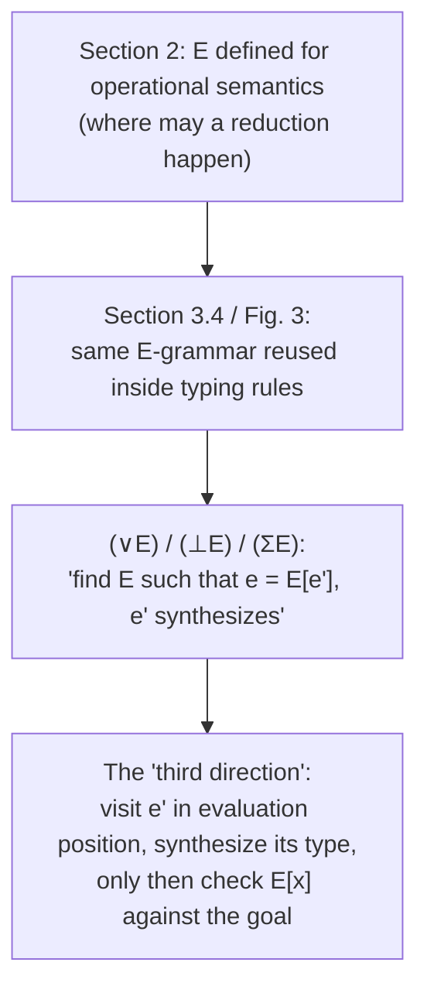

[[book-guidelines|↩ Back to guidelines]]

# The Core Language and Its Bidirectional Typing

## Why build the plain language first?

Everything interesting in this paper — intersections, unions, index-refined dependent types, the "third direction" — gets bolted onto a base language that is, on its own, almost boring: units, functions, pairs, and simple datatypes with `case`. That's deliberate. Before you can argue that a *rich* type system is decidable and complete, you need a *simple* one where the bidirectional discipline is airtight, so that everything added later is a controlled extension rather than a redesign. This article is about that base layer: its syntax, its call-by-value semantics, and the concrete typing rules that realize the checking/synthesis discipline described in [[Bidirectional-Typechecking-Design-Principles|Bidirectional Typechecking Design Principles]] (that sibling article covers *why* introduction rules check and elimination rules synthesize — read this one for what those rules actually look like, symbol by symbol).

If you're building a Rust type checker, this section is effectively "chapter 1 of the compiler": an AST, a step relation, and a `typecheck` function with two entry points. Everything from Section 3 onward is a matter of adding more `match` arms to that same function, not restructuring it.

## The syntax (Figure 1)

The paper gives the grammar as:

$$
\begin{aligned}
\text{Types } A, B, C &::= 1 \mid A \to B \mid A * B \mid \delta \\
\text{Terms } e &::= x \mid u \mid \lambda x.\, e \mid e_1\, e_2 \mid \mathsf{fix}\, u.\, e \\
&\mid () \mid (e_1, e_2) \mid \mathsf{fst}(e) \mid \mathsf{snd}(e) \\
&\mid c(e) \mid \mathsf{case}\ e\ \mathsf{of}\ ms \\
\text{Matches } ms &::= \cdot \mid c(x) \Rightarrow e \mid ms \\
\text{Values } v &::= x \mid \lambda x.\, e \mid () \mid (v_1, v_2) \\
\text{Eval. contexts } E &::= [\,] \mid E(e) \mid v(E) \mid (E, e) \mid (v, E) \mid \mathsf{fst}(E) \mid \mathsf{snd}(E) \mid c(E) \mid \mathsf{case}\ E\ \mathsf{of}\ ms
\end{aligned}
$$

Nothing here is exotic: a unit type $1$, function types $A \to B$, product types $A * B$, and a family of user datatypes $\delta$ with constructors $c$ and a `case` eliminator. What *is* worth pausing on is the last line — evaluation contexts $E$ — because it is the one piece of machinery that this simple system barely uses, but that becomes load-bearing later.

**What an evaluation context is, concretely.** $E$ is a term with exactly one hole $[\,]$ standing for "the next place a reduction is allowed to happen." The grammar of $E$ mirrors the grammar of $e$, but at each binary/n-ary constructor it commits to *which* subterm may still contain the hole — and crucially, it requires everything to the hole's left to already be a *value*. Look at $E ::= v(E)$: the function has already been reduced to a value $v$, and the *argument* is where reduction continues. This single design choice — "reduce arguments left-to-right, only after the function position is a value" — is exactly a call-by-value evaluation order, made syntactically explicit as a *grammar* rather than left implicit in an interpreter's control flow.

**Rust grounding.** If you were implementing this AST directly, the terms and evaluation contexts would look like:

```rust
enum Type {
    Unit,
    Arrow(Box<Type>, Box<Type>),
    Product(Box<Type>, Box<Type>),
    Datatype(String), // δ
}

enum Term {
    Var(String),
    FixVar(String),           // u — bound by `fix`
    Lambda(String, Box<Term>),
    App(Box<Term>, Box<Term>),
    Fix(String, Box<Term>),
    Unit,
    Pair(Box<Term>, Box<Term>),
    Fst(Box<Term>),
    Snd(Box<Term>),
    Constructor(String, Box<Term>), // c(e)
    Case(Box<Term>, Vec<(String, String, Term)>), // e, [(c, x, branch)]
}
```

You would *not* usually implement `EvalContext` as its own recursive enum in a real interpreter — that's the paper's proof-theoretic device for talking precisely about "where reduction is allowed," not an implementation strategy. In Rust you'd realize the same left-to-right, values-first policy imperatively, e.g. with a small-step `step: &Term -> Option<Term>` that recurses into subterms in the order the $E$ grammar prescribes, or a zipper/continuation-passing evaluator. But — and this matters a lot later in the paper — the *typechecker itself* does eventually need to talk about evaluation contexts explicitly, as data, not just as an evaluation strategy. Section 3's union and existential elimination rules require finding *which* evaluation context a subterm sits in, so that the type system can "reach into" evaluation position before typing the surrounding term. Keep the `EvalContext` grammar in the back of your mind — it's reintroduced with real teeth once unions show up.

## Operational semantics: call-by-value, small-step

The reduction rules are unsurprising given the grammar:

$$
\begin{aligned}
(\lambda x.\, e)\, v &\mapsto_R [v/x]\, e \\
\mathsf{fix}\, u.\, e &\mapsto_R [\mathsf{fix}\, u.\, e / u]\, e \\
\mathsf{fst}(v_1, v_2) &\mapsto_R v_1 \\
\mathsf{snd}(v_1, v_2) &\mapsto_R v_2 \\
\mathsf{case}\ c(v)\ \mathsf{of}\ \ldots c(x) \Rightarrow e \ldots &\mapsto_R [v/x]\, e
\end{aligned}
$$

with the single congruence rule lifting a redex reduction to a full-term reduction:

$$
\frac{e' \mapsto_R e''}{E[e'] \mapsto E[e'']}
$$

This is the standard trick for presenting small-step semantics without writing out a separate congruence rule for every syntactic position: instead of "if $e_1 \mapsto e_1'$ then $e_1\, e_2 \mapsto e_1'\, e_2$" and "if $v$ is a value and $e_2 \mapsto e_2'$ then $v\, e_2 \mapsto v\, e_2'$" and so on for every constructor, you say once: *any* term that decomposes as $E[e']$ for some evaluation context $E$ steps by stepping $e'$ and reassembling. The $\mapsto_R$ rules above are exactly the redexes — the "head reductions" — and $E$ says where they're allowed to fire. This is what "evaluation context" buys you: a compact, uniform congruence closure.

**What breaks without this.** If you tried to specify call-by-value order by hand with per-constructor congruence rules, you'd need to write (and prove things about) $n$ separate rules for an $n$-ary language, and you'd have no single place to point to when later sections need to say "there exists *some* evaluation context around this subterm" — which is precisely the move Section 3's `(∨E)`, `(⊥E)`, and `(ΣE)` rules need to make. Evaluation contexts aren't just notational sugar for the semantics; they're the exact vocabulary the *type system* borrows later to justify visiting a subterm "out of order."

## The typing rules (Figure 2)

Subtyping for this base language is entirely structural and (unsurprisingly) covariant/contravariant in the usual places:

$$
\frac{\Gamma \vdash B_1 \le A_1 \quad \Gamma \vdash A_2 \le B_2}{\Gamma \vdash A_1 \to A_2 \le B_1 \to B_2}(\to)
\qquad
\frac{}{\Gamma \vdash 1 \le 1}(1)
\qquad
\frac{\Gamma \vdash A_1 \le B_1 \quad \Gamma \vdash A_2 \le B_2}{\Gamma \vdash A_1 * A_2 \le B_1 * B_2}(*)
\qquad
\frac{}{\Gamma \vdash \delta \le \delta}(\delta)
$$

Note there's a context $\Gamma$ threaded through even here, where it's inert — it exists so the *same* subtyping judgment can be reused once Section 3 adds index refinements, whose subtyping rules genuinely need $\Gamma$ to look up constraint facts. That's a small piece of forward-compatible design worth noticing: the judgment shape is fixed early so richer content can be poured into it later without changing its type.

The typing rules follow the checking/synthesis split directly:

$$
\frac{\Gamma(x) = A}{\Gamma \vdash x \uparrow A}(\mathrm{var})
\qquad
\frac{\Gamma, x{:}A \vdash e \downarrow B}{\Gamma \vdash \lambda x.\, e \downarrow A \to B}(\to I)
\qquad
\frac{\Gamma \vdash e \uparrow A \quad \Gamma \vdash A \le B}{\Gamma \vdash e \downarrow B}(\mathrm{sub})
$$

$$
\frac{\Gamma(u) = A}{\Gamma \vdash u \uparrow A}(\mathrm{fixvar})
\qquad
\frac{\Gamma, u{:}A \vdash e \downarrow A}{\Gamma \vdash \mathsf{fix}\, u.\, e \downarrow A}(\mathrm{fix})
\qquad
\frac{\Gamma \vdash e_1 \downarrow A_1 \quad \Gamma \vdash e_2 \downarrow A_2}{\Gamma \vdash (e_1, e_2) \downarrow A_1 * A_2}(*I)
\qquad
\frac{}{\Gamma \vdash () \downarrow 1}(1I)
$$

$$
\frac{\Gamma \vdash e \uparrow A * B}{\Gamma \vdash \mathsf{fst}(e) \uparrow A}(*E_1)
\qquad
\frac{\Gamma \vdash e \uparrow A * B}{\Gamma \vdash \mathsf{snd}(e) \uparrow B}(*E_2)
\qquad
\frac{\Gamma \vdash e_1 \uparrow A \to B \quad \Gamma \vdash e_2 \downarrow A}{\Gamma \vdash e_1\, e_2 \uparrow B}(\to E)
$$

$$
\frac{c{:}A \to \delta \quad \Gamma \vdash e \downarrow A}{\Gamma \vdash c(e) \downarrow \delta}(\delta I)
\qquad
\frac{\Gamma \vdash e \uparrow \delta \quad \Gamma \vdash ms \downarrow_\delta B}{\Gamma \vdash \mathsf{case}\ e\ \mathsf{of}\ ms \downarrow B}(\delta E)
$$

$$
\frac{}{\Gamma \vdash \cdot \downarrow_\delta B}
\qquad
\frac{c{:}A \to \delta \quad \Gamma, x{:}A \vdash e \downarrow B \quad \Gamma \vdash ms \downarrow_\delta B}{\Gamma \vdash c(x) \Rightarrow e \mid ms \downarrow_\delta B}
$$

A few things worth naming explicitly, because the paper states them tersely:

- **`(var)` and `(fixvar)` are the only two axioms that produce a synthesized type "from nothing"** — everything else derives its type from a premise. This is exactly what makes the system decidable-by-construction rather than requiring guesswork: a synthesis derivation is a purely bottom-up walk of the term, and a checking derivation only ever needs a type because something *above* it (an enclosing `(sub)`, or the expected type of a `let`) supplied one.
- **`fix u. e` uses the same "assume the variable, check the body" shape as `λx. e`**, but notice it's a checking rule for the *whole* fixed point (not an introduction/elimination split) — `u` stands for the recursive occurrence of the whole expression, not a value being consumed, which is why the paper calls it "a new form of variable ... [that] does not stand for a value, but for an arbitrary term." Operationally this matches the reduction rule $\mathsf{fix}\, u.\, e \mapsto_R [\mathsf{fix}\, u.\, e/u]\, e$: unfolding one step of recursion.
- **`(δI)`/`(δE)` treat constructor application as checking and `case` as synthesizing**, following the same Curry–Howard reading as products and functions: $c$ is an introduction form (checked against the datatype), `case` is an elimination form (needs to know the scrutinee's type already, hence `e ↑ δ`, before it can dispatch on the constructor). The match-list judgment $\Gamma \vdash ms \downarrow_\delta B$ recurses over the branches, extending $\Gamma$ with $x{:}A$ per constructor's argument type and checking each branch against the same result type $B$ — this is precisely how you'd implement exhaustiveness-adjacent checking in a real compiler (the paper elides the actual coverage check, "that the left-hand sides ... cover all constructors," as a side condition, not a typing rule).
- **`(sub)` is the hinge between the two judgments**, and it's worth re-stating why it's *safe* to place here mode-correctness-wise: by the time `(sub)` fires, its premise `e ↑ A` has already produced a concrete `A`, so checking `A ≤ B` is a lookup/comparison, never a search. This is the mechanism, not just the slogan from the design-principles article — you can see directly in the rule that no metavariable ever needs to be guessed.

**Lean grounding.** If you've used Lean's elaborator, `(var)`/`(fixvar)` are what `Lean.Elab.Term.elabIdent` does when it resolves a local hypothesis from the context — a direct lookup, no unification. The `(sub)` rule is structurally what an elaborator does when it infers a type for an expression and then needs it to match an expected type: infer, then call `isDefEq`-or-subtyping to reconcile. The difference from Lean's `isDefEq` is that here the comparison is *subtyping* $A \le B$, not definitional equality — but the *shape* of the move (infer first, then compare against what's expected) is identical, and it's exactly the shape you'll want for your own elaborator's `check` entrypoint: always try to delegate to `infer` and compare, rather than threading an expected type through rules that don't structurally need it.

**Python sketch** (illustrative only — a five-line mental model of the two mutually recursive functions this induces):

```python
def synth(ctx, e):
    match e:
        case Var(x): return ctx[x]                      # (var)
        case App(e1, e2):
            a_to_b = synth(ctx, e1)                      # (→E)
            check(ctx, e2, a_to_b.arg)
            return a_to_b.res
        case Fst(e): return synth(ctx, e).left           # (∗E1)
        # ...

def check(ctx, e, expected):
    match e:
        case Lambda(x, body):                            # (→I)
            check({**ctx, x: expected.arg}, body, expected.res)
        case Pair(e1, e2):                                # (∗I)
            check(ctx, e1, expected.left); check(ctx, e2, expected.right)
        case _:
            a = synth(ctx, e)                             # (sub)
            require(subtype(a, expected))
```

This is literally the two-function architecture the paper describes in its opening paragraph ("two mutually recursive functions... the first...either returns A or fails; the second...takes the term e and a type A and succeeds or fails"), and it's the skeleton every later extension in the paper (intersections, unions, existentials) slots into as additional `match` arms — never a rewrite of the control flow.

## Evaluation contexts, twice



The reason this section bothers to give evaluation contexts a full grammar — rather than just saying "call-by-value, left-to-right" in prose — is that Section 3 (specifically the union/void/existential elimination rules) reuses this *exact* grammar as a component of a *typing* rule, not just the semantics. The type system needs to ask "does this term decompose as $E[e']$ for some evaluation context $E$, where $e'$ synthesizes a union type?" — and it can only ask that question precisely because $E$ was already defined as syntax you can pattern-match on, not merely an informal reduction strategy. That reuse is the mechanical seed of "tridirectional": the third direction is exactly "traverse into evaluation position, synthesize, then resume checking the surrounding context" — and "evaluation position" already has a precise meaning by page 2.

## Xi's alternative formulation

The paper briefly contrasts its choice with Hongwei Xi's formulation, which gives *some* introduction forms both a synthesis and a checking rule — e.g. a synthesizing pair rule $\dfrac{\Gamma \vdash e_1 \uparrow A_1 \quad \Gamma \vdash e_2 \uparrow A_2}{\Gamma \vdash (e_1, e_2) \uparrow A_1 * A_2}$ alongside the checking one. This shrinks annotation burden in some cases (e.g. `case (x,y) of ...` — the scrutinee can synthesize directly) but costs a clean Curry–Howard story: introduction forms are supposed to *check*, on the logical reading, so giving pairs a synthesis rule too is an ad hoc convenience rather than a principled consequence. Dunfield and Pfenning explicitly trade a few extra annotations for a system where "ours seems to be the simplest plausible formulation and has a clear logical foundation" — a preference for systematic extensibility over minimizing annotation count in the base case. Worth remembering as a design-tradeoff data point if you're designing your own elaborator's inference/checking split: strict introduction-checks/elimination-synthesizes is more predictable to extend, even if it's not maximally annotation-frugal.

## Where this leads

This core language and its typing rules are the fixed floor everything else in the paper builds on:

- Section 3 ([[Definite-Property-Types|Definite Property Types]]) adds intersections, $\top$, refined datatypes, and $\Pi$-types as *more* introduction/elimination rule pairs over this same `synth`/`check` skeleton — no new judgment shapes, just new `match` arms.
- Section 3's continuation ([[Indefinite-Property-Types-and-the-Third-Direction|Indefinite Property Types and the Third Direction]]) is where the evaluation-context grammar defined here gets reused *inside* typing rules, producing the tridirectional system this paper is named for.
- Section 4 ([[Contextual-Typing-Annotations|Contextual Typing Annotations]])'s soundness proof is erasure back to the untyped/type-assignment system — which only works because every rule here (and every rule added later) is a structurally faithful, annotation-erasable version of an ordinary type-assignment rule.
- For the elaborator/compiler project: this is the reference shape for `infer`/`check` as two mutually recursive functions over an AST, with subtyping (or, in your setting, definitional/propositional equality and constraint generation) inserted at exactly one seam — the `(sub)` rule — rather than smeared across every case. When you get to metavariables and unification later in the book's project arc, that seam is where a metavariable-solving step would be inserted analogously to how `(sub)` inserts a subtyping check here.
