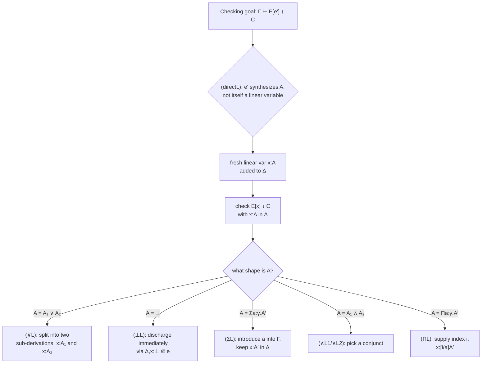

[[book-guidelines|↩ Back to guidelines]]

# The Left Tridirectional System

## The problem this section has to solve

Take stock of where the paper is by the end of Section 4. The *simple tridirectional system* is sound and complete — it can type every term the underlying pure type-assignment system can, using contextual annotations to patch the gaps intersections and index scoping open up. But soundness and completeness are proof-theoretic properties. They tell you the system doesn't lie and doesn't miss anything. They tell you nothing about whether a machine can actually *run* the system as an algorithm.

And the simple system, run as an algorithm, is a disaster. Look at rule `(direct)`:

$$
\frac{\Gamma \vdash e' \uparrow A' \qquad \Gamma, x{:}A' \vdash E[x] \downarrow C}{\Gamma \vdash E[e'] \downarrow C} \quad \text{(direct)}
$$

To apply this rule to a checking goal `Γ ⊢ E[e'] ↓ C`, a typechecker has to *guess* a decomposition of the term into an evaluation context `E` and a synthesizing subterm `e'`. There is no algorithm specified for finding that decomposition — it's existentially quantified in the rule's own statement. The same problem hits `(∨E)`, `(⊥E)`, and `(ΣE)`: each one requires magically knowing where in the term to look. If you tried to implement this directly, you'd be reduced to trying every possible subterm as a candidate `e'`, at every possible position, which is exponential at best and doesn't obviously terminate at all.

This is exactly the gap between "a system that types the right programs" and "a system you can hand to a compiler." Section 5 closes it. The tool for closing it is **linearity** — and once you see why linearity fixes the nondeterminism, the rest of the section (soundness, completeness, decidability, type safety) is really just confirming that the fix didn't break anything.

If you've written a borrow checker, or thought about affine/linear type systems in Rust's mold, the shape of the fix will feel familiar even though the goal here is different: Rust uses linearity to track *resource ownership*; this system uses linearity to track *where in a term evaluation is allowed to happen next*. Same discipline, different payload.

## What breaks without linearity, concretely

Consider checking `E[e'] ↓ C` via `(direct)`. The rule needs the typechecker to pick `e'` — some subterm sitting in evaluation position inside `E`. Nothing in the *syntax* of the goal tells you which subterm that is. You could pick a subterm too small (missing information needed to synthesize a useful type) or too large (accidentally including parts of the term that should stay under checking mode), and the rule gives no guidance for choosing.

The paper's fix is to stop asking "where should `e'` go?" as an open-ended search, and instead force the term itself to *tell* you the answer, by construction — via a fresh variable that is only allowed to appear in exactly one place. That's what a **linear variable** is for.

## Linear contexts: making evaluation position a syntactic invariant

The core new idea is a second context, written `Δ`, alongside the ordinary context `Γ`. Judgments in the left tridirectional system have the shape

$$
\Gamma ; \Delta \vdash e \uparrow_L A \qquad \Gamma ; \Delta \vdash e \downarrow_L A
$$

`Γ` behaves exactly as before — it's the ordinary typing context, holding ordinary variables that can appear anywhere, any number of times. `Δ` is new: it holds **linear variables**, and the discipline governing them is the whole point of the section.

A linear variable `x ∈ dom(Δ)` is required to appear **exactly once** in the term being typed, and it must appear **in evaluation position**. The paper formalizes "appears exactly once, in evaluation position" with two judgments:

- `Δ ⊏ e` — a weaker relation: every `x ∈ dom(Δ)` appears exactly once free in `e`, and every free linear variable of `e` is in `dom(Δ)` (Definition 13).
- `Δ ⋐ e` — the stronger relation actually used to drive the algorithm: for every `x ∈ dom(Δ)`, there is an evaluation context `E` such that `e = E[x]` and `x` doesn't occur in `E` itself (Definition 15). This is the formal way of saying "`x` sits exactly at a hole reachable by evaluation."

Why does this fix the nondeterminism? Because now the "where is `e'`?" question the old `(direct)` rule had to guess is answered *before* typechecking even starts — it's baked into which variable in the term is linear. The typechecker doesn't search for a decomposition; it reads the decomposition off the term's own structure, because exactly one occurrence of `x` marks the spot.

## `(directL)`: the only rule that introduces linearity

Only one rule in the whole system is allowed to add a variable to `Δ`:

$$
\frac{e' \text{ not a linear variable} \qquad \Gamma ; \Delta_1 \vdash e' \uparrow_L A \qquad \Gamma ; \Delta_2, x{:}A \vdash E[x] \downarrow_L C}{\Gamma ; \Delta_1, \Delta_2 \vdash E[e'] \downarrow_L C} \quad \text{(directL)}
$$

Compare this line-by-line against `(direct)`. Structurally it's the same idea — synthesize a type for a subterm, then check the surrounding context against that type via a fresh hypothesis. But `(directL)` adds one crucial restriction that `(direct)` didn't have: **`e'` cannot itself be a linear variable**. This one restriction is doing real work, and it shows up twice more in the section (in the decidability proof and the soundness proof), so it's worth understanding why it's there.

Without it, you could apply `(directL)` to a term that's *already* just a bare linear variable `y`, "bringing it out" again into a fresh `x`, over and over, with nothing in the term getting smaller. That's a non-terminating chain of proof steps with no progress. Forbidding `e'` from being a linear variable guarantees that every application of `(directL)` strictly decreases some measure of the term (concretely: linear variables count as the smallest possible terms in the decidability ordering, Section 5.3) — so the "bring a subterm out and evaluate it" move can only happen finitely many times before you bottom out at variables and constants.

This is the single design decision that turns "guess an evaluation-context decomposition, over and over, forever" into "peel off one synthesizing layer at a time, each one strictly smaller than the last."

## The left rules: consuming a linear variable structurally

Once a linear variable `x:A` is in scope (via a `(directL)` premise like `Γ; Δ₂, x:A ⊢ E[x] ↓_L C`), something still has to actually use it — to case-split on it if `A` is a union, propagate `⊥`, unpack an existential, and so on. That job falls to the **left rules**, which replace the contextual rules `(∨E)`, `(⊥E)`, `(ΣE)` outright:

$$
\frac{\Gamma; \Delta, x{:}A \vdash e \downarrow_L C \qquad \Gamma; \Delta, x{:}B \vdash e \downarrow_L C}{\Gamma; \Delta, x{:}A \vee B \vdash e \downarrow_L C} \quad (\vee L)
\qquad
\frac{\Delta, x{:}\bot \Vdash e}{\Gamma; \Delta, x{:}\bot \vdash e \downarrow_L C} \quad (\bot L)
$$

$$
\frac{\Gamma, a{:}\gamma; \Delta, x{:}A \vdash e \downarrow_L C}{\Gamma; \Delta, x{:}\Sigma a{:}\gamma.\, A \vdash e \downarrow_L C} \quad (\Sigma L)
$$

plus two more the paper adds beyond what the contextual rules covered — `(∧L₁)`/`(∧L₂)` (pick a conjunct of an intersection typing a linear variable) and `(ΠL)` (instantiate a `Π`-bound index variable). Notice the pattern across all of these: they're all **structural on the type of a linear variable already sitting in `Δ`**, not existential searches over the term. `(∨L)` doesn't ask "where's the union-typed subterm?" — it looks at the type annotation `x:A ∨ B` already recorded in the context and splits into two checking obligations. This is exactly the trade the section is making: push all the nondeterminism into the single `(directL)` rule (deciding *when* to bring a subterm out), and make every subsequent rule about that variable purely syntax-directed.

## Soundness: translating a linear proof back to a simple one (§5.1)

The left system is only useful if it's still typing the *same* programs as the simple tridirectional system (which is itself sound/complete relative to the underlying type-assignment system from prior work). Section 5.1 proves this direction: left-typeable implies simple-typeable.

The mechanism is a **renaming** `ρ` (Definition 17) — literally a variable-for-variable substitution, but one that can be applied to *contexts* as well as terms, letting it move variables between the linear context `Δ` and the ordinary context `Γ`. Applying a renaming `[ρ]∆` to a linear context, where `ρ` maps linear variables to fresh ordinary variables, turns `Δ` into an ordinary `Γ`-fragment.

$$
\textbf{Theorem 18 (Soundness, Left Rule System).} \; \text{If } \rho \text{ renames linear vars to ordinary vars and } \Gamma; \Delta \vdash e \downarrow_L C \text{ (or } \uparrow_L\text{) and } \Delta \Vdash e \text{ and } \mathrm{dom}(\rho) \supseteq \mathrm{dom}(\Delta), \text{ then } \Gamma, [\rho]\Delta \vdash [\rho]e \downarrow C \text{ (or } \uparrow\text{).}
$$

Read operationally: take a left-tridirectional derivation, rename every linear variable to an ordinary one everywhere it occurs, and the result is a valid derivation *in the simple system*. The proof is by induction on the derivation; the only interesting cases are `(directL)` (recovers `(direct)` after the rename) and the left rules (each recovers its corresponding contextual elimination rule). This is precisely a *simulation* argument — a proof technique you'll see constantly in compiler correctness and elaboration correctness: two systems are related if every step of the "more constrained" one can be replayed, unchanged in meaning, as a step of the "less constrained" one.

## Completeness: the harder direction (§5.2)

Completeness needs the opposite: if a term is typeable in the *simple* system, some (possibly different, but equally-shaped) term is typeable in the *left* system. This is genuinely harder, because the simple system's `(direct)`/`(∨E)`/`(⊥E)`/`(ΣE)` don't have the "not a linear variable" restriction that `(directL)` imposes — so a naive induction breaks exactly at those four rules.

Theorem 20 handles this with a case split at precisely those trouble spots:

- **If the subterm being decomposed is not a variable already renamed by `ρ`**: apply the induction hypothesis, mint a *new* linear variable, and reconstruct via `(directL)` plus the matching left rule.
- **If it *is* already a renamed variable**: don't re-apply `(directL)` at all (which would violate its restriction) — instead lean on `Lemma 19`, a substitution-like lemma that lets you fold a variable's existing linear typing into a use site without re-deriving it from scratch.

The restriction that made `(directL)` terminating (no re-bringing-out of already-linear variables) is exactly the restriction that has to be worked around here — soundness and completeness are, in a real sense, proving that the very device which buys decidability doesn't cost you any typeable programs.

## Decidability: the actual payoff (§5.3, Theorem 21)

This is the section's destination. `Γ; Δ ⊢ e ↓_L A` is decidable — meaning there's an algorithm, not just a specification. The proof constructs a well-founded order `<` on judgments and shows every rule's premises are strictly smaller than its conclusion, so no infinite derivation is possible; the algorithm is: keep applying the only rule that matches the goal's shape (the system is syntax-directed everywhere except `(directL)`, whose applicability is now bounded by the ordering) until you bottom out.

The ordering, applied to two judgments `J₁ = Γ₁; Δ₁ ⊢ e₁ ↓↑ A₁` and `J₂ = Γ₂; Δ₂ ⊢ e₂ ↓↑ A₂`, is **lexicographic** across four criteria, checked in this priority order:

1. **Term size.** If `e₁` is a strictly smaller term than `e₂`, `J₁ < J₂` — full stop, nothing else matters. Linear variables are defined to be the *smallest* possible terms, smaller than any compound expression. This single stipulation is why `(directL)`'s "not a linear variable" restriction matters for termination: its second premise `Γ; Δ₂, x:A ⊢ E[x] ↓_L C` has `E[x]` strictly smaller than the conclusion's `E[e']`, precisely *because* `x` is guaranteed smallest and `e'` was not itself already a linear variable (had it been, no size decrease would be guaranteed).
2. **Judgment direction**, when term sizes tie: synthesis is considered smaller than checking. This handles `(sub)`, whose premise `Γ; Δ ⊢ e ↑ A'` is same-term, but synthesis instead of checking.
3. **Type size**, with a genuinely counterintuitive twist: for *checking* judgments, a smaller type in the premise makes the premise smaller, as you'd expect. But for *synthesis* judgments, the paper explicitly notes: *"a synthesis judgment whose type expression becomes larger is considered smaller!"* This sounds backwards until you see why it has to be this way — synthesis judgments like `(ΠE)` or `(∧E)` *grow* their synthesized type relative to what's stored in the context (e.g. instantiating `Πa:γ.A` at index `i` to get `[i/a]A`, which can be a larger expression than `A`). If growing-type synthesis judgments weren't ranked as decreasing, the ordering would have no way to justify `(ΠI)`/`(ΠE)`-style rules terminating. Synthesis derivations are guaranteed to "bottom out" eventually at rules like `(ctx-anno)` or `(var)`/`(fixvar)`, where the type comes directly from a finite context — so even though individual steps can grow the type, there's a floor.
4. **Type-constructor counts in `Δ`**, used only for the left rules — where the term, direction, and type genuinely don't shrink across the step, but the *number* of `∨, Σ, ⊥, ∧, Π, ⊤` constructors appearing in `Δ` strictly decreases (each left rule consumes exactly one such constructor from the linear variable's type).

The proof's real subtlety is criterion 3's inversion for synthesis, and criterion 1's dependence on `(directL)`'s restriction — together, these are the two places where the *earlier* design decisions in this section (linear variables as smallest terms; `(directL)` forbidding linear `e'`) get cashed in as the actual reason termination holds. This is a good example of a general pattern worth internalizing for building your own checker: a termination argument is rarely free-standing — it usually depends on an earlier, seemingly unrelated restriction in the rule set, and you should expect to trace it back that far.

## Type safety: composing four theorems (§5.4)

Section 5.4 is short because it's pure composition, not new machinery — a satisfying pattern once you have the pieces:

$$
\underbrace{\cdot;\cdot \vdash e \downarrow_L A}_{\text{left system}} \xRightarrow{\text{Thm 18}} \underbrace{\cdot \vdash e \downarrow A}_{\text{simple system}} \xRightarrow{\text{Thm 3}} \underbrace{\cdot \vdash |e| : A}_{\text{type-assignment system}} \xRightarrow{\text{prior work's Preservation + Progress}} \text{diverges or reduces to a value of type } A
$$

Each arrow is a previously-proved theorem, chained: soundness of the left system (Thm 18) hands you a simple-tridirectional derivation; soundness of the simple system (Thm 3, via erasure `|e|` of all annotations) hands you a type-assignment derivation in the prior undecidable system; and *that* system's own, already-established, Type Preservation and Progress theorems give you the actual runtime guarantee. Nothing here needed re-proving from first principles — decidability (Thm 21) plus this composed chain is what makes the left tridirectional system a genuine, safe, checkable typechecker, not just a decidable-but-unsound approximation.

## Where this leads

If you're building a Rust type checker for a refinement/dependent language, this section is closer to your actual implementation than anything earlier in the paper. The simple tridirectional system tells you *what* should be typeable; this section tells you *how to search* for a derivation without backtracking exponentially. Concretely:

- `Δ` and the linear-variable discipline are a direct model for how a checker's recursive-descent function should thread "the one subterm I'm currently allowed to evaluate/synthesize" through a checking call — in Rust terms, something like passing an `Option<HoleContext>` or a single designated "in evaluation position" marker down through your `check`/`synth` functions, rather than searching the AST for candidate positions.
- The `(directL)`-not-a-linear-variable restriction is the kind of invariant you'd enforce with a Rust type (e.g. an enum distinguishing `Fresh(Term)` from `AlreadyLinear(Var)` at the call site) so the checker can't even *express* the non-terminating case.
- Theorem 21's lexicographic termination measure is the template for proving your own checker terminates — and, notably, its "synthesis growing is decreasing" inversion is a reminder to look for exactly this kind of trick whenever a naive size measure doesn't obviously decrease across a rule you know intuitively *should* terminate.
- The whole section is a worked example of what your learning-goals project calls "algorithmic mechanisms" and "proof-producing architecture": every rule application here corresponds one-to-one with a derivation step you could literally reify as a proof term or certificate, which is the discipline a trusted-kernel-style verifier needs.

The one thing this section does *not* give you — flagged explicitly by the authors as future work — is a fully deterministic algorithm: `(directL)` is still nondeterministic in *when* to fire relative to other applicable rules, even though it's now guaranteed to terminate. The authors mention Xi's let-normal-form idea (traverse the whole program strictly in evaluation order) as a plausible way to remove that remaining nondeterminism — worth knowing about if your own checker needs a fully syntax-directed algorithm rather than "decidable, but still make a search choice at each `(directL)` opportunity."
