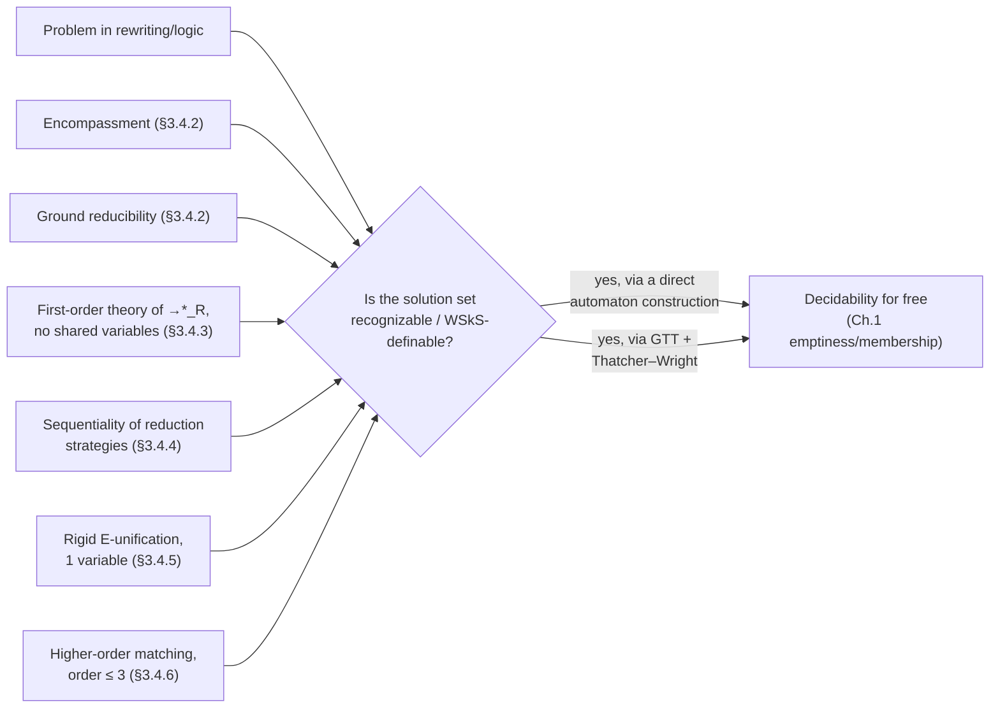

# Applications of Tree Automata to Term Rewriting

[[book-guidelines|↩ Back to guidelines]]

## Why this chapter exists: automata as a decision-procedure factory

Everything up to this point in the book has been building machinery: recognizable languages (Ch. 1), grammars and generative equivalents (Ch. 2), then in this chapter itself, relations on tuples of trees via GTTs (§3.2) and a whole monadic second-order logic, WSkS, that turns out to define exactly the recognizable sets (§3.3, Thatcher–Wright). §3.4 is where the payoff shows up. The pattern is always the same shape: take a question about term rewriting that looks like it needs its own bespoke decision procedure — "is this term reducible?", "does this rewrite relation's first-order theory have a decision procedure?", "does this rewrite system admit an optimal evaluation order?" — and show that the question secretly reduces to an automaton emptiness or membership check, which Chapter 1 already solved.

This is worth sitting with for a second, because it's the real intellectual content of the section: tree automata are not just a formalism for describing sets of trees, they're a **generic reduction target**. If you can show that the solution set of your problem is recognizable (or WSkS-definable, which by Thatcher–Wright is the same thing), you get decidability for free, and you get it uniformly across wildly different-looking problems. The rest of this article walks through six such reductions, roughly in increasing order of how much machinery they need — and the last two (rigid $E$-unification, higher-order matching) are the ones that matter most for anyone building a unification engine, so they get the deepest treatment.



## Order-sorted signatures as automata with subsort transitions (§3.4.1)

The section opens with a small but useful observation: a *sort system* — the kind of thing that says "this argument must be a `Nat`, not just any term" — can itself be read as a tree automaton. Fix a tree automaton (or equivalently, order-sorted signature) whose states are sorts $S$. Then a **sort expression** built from $\top_S, \bot_S, \vee, \wedge, \neg$, and applying a symbol $f(s_1,\dots,s_n)$ to sorts, gets an interpretation $[\![s]\!]_S \subseteq T(F)$ exactly the way you'd hope:

$$[\![s_1 \vee s_2]\!]_S = [\![s_1]\!]_S \cup [\![s_2]\!]_S, \qquad [\![f(s_1,\dots,s_n)]\!]_S = \{f(t_1,\dots,t_n) \mid t_i \in [\![s_i]\!]_S\}$$

A substitution $\sigma$ *solves* an atomic constraint $t \in s$ if $t\sigma \in [\![s]\!]_S$. **Theorem 3.4.1** says: satisfiability of arbitrary first-order formulas over these atomic constraints is decidable, by decomposing on the outermost symbol and falling back on the closure properties of $\mathrm{Rec}^\times$ from §3.2.

This is the same idea a type checker uses when it decides "is this well-typed" by structural recursion on the syntax tree, checking each argument against its declared sort — except here the "sorts" are literally automaton states, so subsort polymorphism (a subtype relation between sorts) is just $\epsilon$-transitions between states. If you've ever implemented an order-sorted unification algorithm, this is exactly what's happening under the hood: sort-checking *is* a bottom-up automaton run.

## The encompassment theory for linear terms (§3.4.2)

Here's the section's first real workhorse, and it's the foundation for everything that follows.

**[[Automata-with-Constraints#What breaks|What breaks]] without it:** rewriting theory constantly needs to ask "is this term reducible by some rule in my system?" The naive way to answer this is: for every rule $l_i \to r_i$ and every subterm $u'$ of $u$, try to unify $u'$ with $l_i$. That's a search over all subterms and all rules — no static structure to exploit, and definitely nothing you could feed to a decision procedure for a whole *theory* about reducibility (as opposed to one instance check).

**The fix — encompassment.** Say $u$ **encompasses** $t$ (written $t \cdot\!\!\preceq u$) if some substitution $\sigma$ makes $t\sigma$ a subterm of $u$. This is exactly the relation you need: a term is reducible by a rewrite system $R$ iff it encompasses some left-hand side of $R$. Encompassment turns "does some substitution instance of $t$ occur as a subterm anywhere in $u$" into a single binary relation you can reason about uniformly.

**Proposition 3.4.3** is the key construction: if $t$ is *linear* (each variable occurs at most once — this restriction matters, see below), the set $\{u \mid t \cdot\!\!\preceq u\}$ is recognized by an NFTA of size $O(|t|)$. The construction is elegant: build one state $q_v$ per non-variable subterm $v$ of $t$, plus a "wildcard" state $q_\top$ that accepts literally everything (rules $f(q_\top,\dots,q_\top) \to q_\top$ for every symbol $f$). Then $q_v$'s transitions mirror $t$'s own structure but let variable positions match anything via $q_\top$, and — the crucial extra move — any subterm can non-deterministically "jump into" the accepting state $q_t$ at any position, because encompassment only needs $t\sigma$ to occur *somewhere* inside $u$, not at the root.

Here's a Rust sketch of that automaton, built directly from a linear pattern term:

```rust
#[derive(Clone, Debug)]
enum Term {
    Var(String),
    App(String, Vec<Term>),   // symbol, children
}

#[derive(Clone, Copy, PartialEq, Eq, Hash, Debug)]
enum State {
    Top,               // q_top: accepts anything
    Node(usize),       // q_v for the subterm at this index
}

struct EncompassmentAutomaton {
    // maps (symbol, child_states) -> resulting state,
    // plus the "jump into acceptance" rule handled separately
    transitions: std::collections::HashMap<(String, Vec<State>), State>,
    accepting: State,
}

// A term u is accepted (i.e. t encompasses no subterm — read the *complement*
// story the other way: u is accepted iff t encompasses u) by bottom-up
// evaluation: label every subterm of u with a state, then check the run
// reaches `accepting` at *some* position, not just the root.
fn run(automaton: &EncompassmentAutomaton, u: &Term) -> Vec<State> {
    // returns every state reachable at every subterm position of u —
    // this is exactly the "does t cdot-preceq u" check: non-empty
    // intersection with {accepting} at any position means yes.
    match u {
        Term::Var(_) => vec![State::Top],
        Term::App(f, children) => {
            let child_states: Vec<Vec<State>> = children.iter()
                .map(|c| run(automaton, c)).collect();
            // (cross-product over children states, looked up against
            // automaton.transitions — omitted for brevity)
            vec![State::Top] // placeholder for the real subset-style evaluation
        }
    }
}
```

The point of showing this in code isn't the omitted cross-product logic — it's that **this automaton is doing exactly the job of a pattern-matching compiler's failure/wildcard states**: `q_top` is "match anything (a wildcard arm)", and the "jump to accepting at any depth" rule is "keep scanning subterms looking for *any* match, not just a root match." If you've written a `match` compiler that lowers patterns to a decision tree, you've built a hand-specialized version of this automaton.

**Corollary 3.4.4:** if every left-hand side of $R$ is linear, both the set of reducible terms and the set of normal forms (irreducible terms) are finite-tree-automaton-recognizable — a direct consequence of §1.3's closure under union applied over all the rules.

**The reducibility theory is decidable (Theorem 3.4.5).** Now the payoff: define the *reducibility theory* as the set of first-order formulas built from unary predicates $E_t(x)$ ("$x$ is encompassed by $t$", i.e. $t \cdot\!\!\preceq x$) for $t$ ranging over a set of linear terms. Since Proposition 3.4.3 makes each atomic $E_t$ recognizable, and recognizable = WSkS-definable (Lemma 3.3.6, from §3.3), *any* Boolean/quantified combination of these predicates translates into a WSkS formula — and WSkS is decidable (Theorem 3.3.8). This is the first place in the section where the WSkS machinery from §3.3 actually gets used for something concrete: it's the "compiler backend" that turns "first-order formula over encompassment predicates" into "decidable."

One honest caveat the book flags: this uses only a small fragment of WSkS's power (the atomic solutions land in the weaker class $\mathrm{Rec}^\times$), so you don't get WSkS's complexity bounds for free — the actual complexity of the reducibility theory is, as of the book's writing, open.

## Ground reducibility (§3.4.2, continued)

A term $t$ is **ground reducible** by $R$ if *every* ground instance $t\sigma$ is reducible — even if $t$ itself (which may contain variables) is irreducible. The book's example makes the distinction vivid: with $R = \{s(s(0)) \to 0\}$, the term $s(s(x))$ is irreducible (it's not literally an instance of the left-hand side, since $x$ isn't $0$), yet *every* ground instance $s(s(c))$ for a constant $c$ is reducible.

Ground reducibility is expressible entirely inside the encompassment theory:

$$\forall x.\Big(t \cdot\!\!\preceq(x) \Rightarrow \bigvee_{i=1}^n l_i \cdot\!\!\preceq(x)\Big)$$

("every instance of $t$ is an instance of some $l_i$"), so by Theorem 3.4.5 it's decidable whenever $t, l_1,\dots,l_n$ are linear — the book notes it's actually EXPTIME-complete, without proving it. Ground reducibility is precisely the kind of check a dependently-typed compiler needs when deciding whether a recursive function's pattern match is *exhaustive*: "does every ground instance of this scrutinee shape get handled by some clause?" is the exact same question, with clauses playing the role of $l_i$.

## The first-order theory of a reduction relation — no shared variables (§3.4.3)

This is where GTTs from §3.2 finally pay their rent. Consider the theory of formulas built purely from a single binary predicate $\to$, interpreted either as one-step rewriting $\xrightarrow{R}$ or as the reflexive-transitive closure $\xrightarrow{*}_R$. Both are **undecidable in general** — but decidable when $R$ is linear and left/right-hand sides of each rule *share no variables*.

**Proposition 3.4.7** is the mechanism: build a GTT $(A, A')$ where $A$ recognizes instances of all the $l_i$'s and $A'$ recognizes instances of all the $r_i$'s (each pair sharing exactly one "final" synchronization state $q_{f_i}$, tying a specific $l_i$-instance to its corresponding $r_i$-instance). The claim is that the *iterated closure* $(A^*, A'^*)$ — which Theorem 3.2.14 guarantees is still a GTT — recognizes exactly $\xrightarrow{*}_R$.

**This is the moment to answer the chapter's third Key Question directly: why does the no-shared-variables restriction matter, and what does it motivate next?** The proof of Proposition 3.4.7 needs, at the position $p$ where a rewrite step happens, that $u|_p$ being an $l_i$-instance and $v|_p$ being the *corresponding* $r_i$-instance under the *same* substitution $\sigma$ forces $u|_p \xrightarrow{*}_R v|_p$ — and conversely, that any GTT-accepted pair $(u,v)$ really does decompose into a valid rewrite sequence. That correspondence only works because a synchronization state $q_{f_i}$ carries *no information about which substitution instantiated the shared variables* — a GTT's synchronization states just say "these two subtrees are linked," not "linked by consistently substituting the same variable-bindings on both sides." If a rule's left and right side shared a variable $x$, you'd need the automaton to remember, at the moment of synchronization, *which* term $x$ was bound to on the left, so it can enforce the identical binding appearing on the right — and a finite-state bottom-up automaton fundamentally cannot carry an unboundedly large binding across a shared synchronization point without exploding its state space. This exact gap — "recognizing that two subtrees are related by rewriting" is fine, but "recognizing that two subtrees are related by rewriting *while also being forced to be equal at shared positions*" is not — is precisely the motivation for Chapter 4's *automata with equality constraints*: those add exactly the machinery (constraints between designated positions) that a plain GTT structurally lacks. You'll see this idea again immediately: it's the technical seed from which the entire next chapter grows.

**Theorem 3.4.8** closes the loop: once $\xrightarrow{*}_R$ is a GTT, it's in $\mathrm{Rec}$ (Proposition 3.2.7 — even though it wasn't in the weaker $\mathrm{Rec}^\times$, this is exactly why the chapter needed GTT and not just $\mathrm{Rec}^\times$ or $\mathrm{Rec}$ alone in §3.2), hence WSkS-definable (Lemma 3.3.6), hence decidable (Theorem 3.3.8). Three separate chapters' worth of machinery — GTT closure, Thatcher–Wright, WSkS decidability — chained into one decidability result.

## Reduction strategies and sequentiality (§3.4.4)

A different flavor of application: not "is this decidable" but "does an *optimal evaluation order* exist, and can we compute it." The motivating example is a rewrite system like $\{x \vee \top \to \top,\ \top \vee x \to \top\}$: given $e_1 \vee e_2$ with both operands unevaluated, there's no way to commit up front to evaluating $e_1$ first or $e_2$ first without risking wasted work, because either operand alone might resolve to $\top$ and make evaluating the other unnecessary. Huet and Lévy's theory of **sequentiality** formalizes exactly when a deterministic "always reduce this position" strategy is safe.

The technical setup: extend the alphabet with a special "unevaluated" constant $\Omega$, giving $T(F_\Omega)$ ordered by $u \sqsubseteq v$ ("$u$ is less evaluated than $v$"). A predicate $P$ is *monotonic* if evaluating more can't falsify it once it's true. Given monotonic $P$, position $p$ is an **index** for $t$ if every more-evaluated completion of $t$ satisfying $P$ has $p$ filled in — i.e., you're *forced* to evaluate at $p$ no matter what. $P$ is **sequential** if every term not yet satisfying $P$ but completable to satisfy it has *some* index — meaning a deterministic strategy ("always reduce an index") exists and is optimal (for non-overlapping, left-linear systems).

**Theorem 3.4.13** connects this back to the chapter's central theme: if $P$ is WSkS-definable, sequentiality of $P$ is *also* WSkS-expressible — "just translate the definitions directly." So for the natural predicate $N_R$ ("reducible to some $R$-normal form"), if $R$'s rules share no variables, $N_R$ is recognizable (chaining Propositions 3.4.7 and 3.2.7) hence WSkS-definable hence its sequentiality is decidable. In general $N_R$'s sequentiality is undecidable, but the book notes a monotonicity trick: if $R \subseteq R'$ as rewrite relations, indices for $R'$ are indices for $R$, so approximating $R$ by a "safer" (more constrained) $R'$ whose $N_{R'}$ *is* decidable gives you a sound (if incomplete) sequentiality check for $R$ itself — exactly the kind of sound-approximation move you'd expect from an abstract-interpretation-flavored analysis.

## Application to rigid $E$-unification (§3.4.5) — this is where unification lives

If you're building a unifier, this is the subsection to read twice.

**The problem.** Ordinary $E$-unification, given equations $E$ and a goal $s = t$: find $\sigma$ with $E \models s\sigma = t\sigma$. This is undecidable in general — no surprise, unification modulo an arbitrary equational theory subsumes arbitrary term rewriting. **Simultaneous rigid $E$-unification** changes the question subtly but importantly: find $\sigma$ such that

$$\models \Big(\bigwedge_{e \in E} e\sigma\Big) \Rightarrow \Big(\bigwedge_{i=1}^n s_i\sigma = t_i\sigma\Big)$$

The "rigid" part means $\sigma$ is applied to $E$ itself too, not held as a fixed background theory — this is exactly the "does not close under all its consequences, only this one instantiation" framing that makes rigid $E$-unification decidable in cases where general $E$-unification (over the *closure* of $E$) is not. This restriction is precisely what makes the problem *rigid* in the sense that matters for automated deduction: the equational premises get frozen into one specific instance rather than treated as an open-ended congruence.

**Theorem 3.4.15:** rigid $E$-unification with one variable is EXPTIME-complete. The membership direction, via **Lemma 3.4.16**, is the part worth internalizing: *the solution set of a rigid $E$-unification problem with one variable is recognizable by a finite tree automaton.* The construction (sketched, not fully proven, in the book) reduces the single-variable case to normal forms in a canonical ground rewrite system $R$ built from treating the shared variable $x$ as a fixed constant: solving for the right substitution reduces to identifying which *subterm* $u$ of the whole problem the variable must denote (a finite, polynomial-time-computable candidate set $T$), and then the actual solution set is $\xrightarrow{*}_{R^{-1}}(T)$ — the set of terms that reduce (in reverse) to some candidate in $T$. Since Proposition 3.4.7's construction gives you $\xrightarrow{*}_R$ as a GTT-recognizable (hence $\mathrm{Rec}$, hence in this restricted single-variable setting NFTA-recognizable) relation, you get the whole solution set essentially for free by re-using the exact same "reduction relations are automaton-recognizable" machinery from §3.4.3.

**Why this matters for pattern unification.** The pattern here generalizes past this one specific problem: *unification's solution set, viewed as a set of ground substitution instances of one variable, is often exactly a recognizable tree language* — which is the deep reason tree automata show up as a solver backend for constrained unification problems at all. If you're implementing Miller-pattern unification for an elaborator (the tractable higher-order fragment where metavariable applications are restricted to distinct bound variables), this is worth keeping in your mental toolkit as an alternative lens: instead of thinking purely operationally ("apply an occurs-check, invert the substitution"), you can sometimes think denotationally ("what is the *set* of terms this metavariable is allowed to denote, and is that set finite-state-representable"). The rigidity restriction — freezing $E$ instead of closing it — is structurally the same move as restricting general higher-order unification down to the pattern fragment: both trade full generality (and undecidability) for a finite, automaton-friendly solution space.

## Application to higher-order matching (§3.4.6) — 2-automata

The chapter's final application moves into simply-typed $\lambda$-calculus, and it's the most directly relevant piece for an elaborator that does bidirectional typing with metavariables.

**Setup, minimally.** Types are built from a base type $o$ and $\tau \to \tau'$; after Curryfication, every non-base type is $\tau_1,\dots,\tau_n \to o$ — "takes $n$ arguments, returns a base value" — and the **order** of a type is $O(o)=1$, $O(\tau_1,\dots,\tau_n\to o) = 1+\max_i O(\tau_i)$. Terms are the usual simply-typed $\lambda$-terms, always kept in $\eta$-long form and considered up to $\alpha$-equivalence, with the standard $\beta$-reduction rule and unique normal forms $t{\downarrow}$ (via termination + confluence of $\beta\eta$).

A **matching problem** is $s = t$ where $t$ has *no* free variables — you're solving for the free variables of $s$ only, i.e. asking "what substitution into $s$ makes it $\beta\eta$-equal to this fixed, closed $t$." (Contrast with unification, where both sides can have free variables — matching is the one-sided, and generally easier, special case, exactly analogous to why pattern matching in a functional language is decidable while general unification of two open terms is not.) The book is candid that general matching decidability was open at time of writing, but it *is* decidable when every free variable in $s$ has order $\le 4$ — and tree automata are exactly how you get there for the low-order cases.

**2-automata: the key extension.** A **2-automaton** extends an ordinary NFTA with a distinguished "hole" symbol $\square$: a term $u$ is accepted iff some term $v$ accepted in the ordinary sense becomes $u$ after replacing *each* occurrence of $\square$ with a term of the right type — crucially, **different occurrences may be filled with different terms**. This is a genuinely new degree of freedom beyond plain recognizability: it's a language with "typed blanks" that can each be filled independently, which is exactly the shape of a higher-order matching solution — a single higher-order variable $x$ applied to arguments that recur at different, independently-substitutable positions.

**Theorem 3.4.17** works out the third-order case concretely: for a matching problem $x(s_1,\dots,s_n) = t$ with $x$ a third-order variable and $s_1,\dots,s_n,t$ closed, the automaton $A_{s_1,\dots,s_n,t}$ has one state $q_u$ per subterm $u$ of $t$ (plus a hole-state $q_\square$ and a final state $q_f$), with transitions built so that applying variable $x_i$ to argument states corresponds exactly to substituting into $s_i$ and normalizing — the automaton is literally *evaluating the candidate substitution as it reads the input term bottom-up*. The book's worked example (a $\lambda x_1\lambda x_2.x_1(x_2(x_1(x_1(a,\square),\square)),\square)$ instance solving $x(\lambda y_1\lambda y_2.y_1,\ \lambda y_3.f(y_3,y_3)) = f(a,a)$) shows the run reducing step by step to the final state — worth working through by hand once, since it makes the "the automaton run *is* the evaluation" idea completely concrete.

```lean
-- The essential shape of what the 2-automaton is deciding, stated as a
-- proposition rather than an algorithm: existence of a substitution
-- for a higher-order variable applied to fixed closed arguments,
-- modulo βη-equality to a fixed closed target.
def MatchingProblem (Term : Type) (x : Term) (args : List Term) (target : Term)
    (subst : Term → Term) (betaEtaEq : Term → Term → Prop) : Prop :=
  betaEtaEq (subst (applyArgs x args)) target

-- Theorem 3.4.17's content, informally: for order-3 x, the set of `subst`
-- witnessing `MatchingProblem` is exactly the language of a 2-automaton
-- built from `target`'s subterm structure — i.e. matching-solution-existence
-- reduces to 2-automaton non-emptiness, which is decidable by construction.
```

**Why this is the deepest connection in the whole batch for an elaborator project.** Higher-order matching (and its cousin, higher-order unification) is exactly what a dependently-typed elaborator's metavariable-resolution machinery has to solve every time it hits an application of an implicit metavariable to argument spine — `?m a b c =?= t`. Miller's pattern fragment is the well-behaved special case where `a b c` are distinct bound variables (making the substitution for `?m` unique and computable by a simple projection), but the *general* problem — arbitrary closed arguments, not just distinct variables — is exactly the matching problem this section studies, and it's exactly why general higher-order unification is undecidable while the pattern fragment is tractable: the order restriction ($\le 4$ here) and the 2-automaton construction are, in effect, *the automata-theoretic analogue* of the syntactic restrictions (distinct bound-variable arguments) that make Miller patterns solvable. If your elaborator ever needs to go beyond the pattern fragment — say, to handle a "quasi-pattern" or to attempt higher-order matching as a fallback when pattern unification fails — this section is a concrete, constructive existence proof that *some* structured, decidable fragment of the general problem is achievable, and it hands you a genuinely different algorithmic strategy (build an automaton whose run simulates evaluation, then check emptiness) than the usual "substitute, occurs-check, recurse" pattern-unification algorithm. It's worth keeping both algorithmic styles in mind: syntactic unification algorithms are typically presented as search procedures over substitutions, while this section shows a genuinely different paradigm — compile the *problem* into an automaton and let a generic decision procedure (emptiness) answer the existence question, with the automaton's run doubling as a certificate of the witnessing substitution's shape.

## Where this leads

Structurally, this section is the chapter's demonstration payoff: everything built in §3.2 (GTTs, the three notions of relation-recognizability) and §3.3 (WSkS, Thatcher–Wright) gets cashed out here as decidability results for genuinely different-looking rewriting and unification problems. The chain "reduce your problem to a recognizable/WSkS-definable set → invoke Thatcher–Wright and WSkS decidability" recurs across encompassment, ground reducibility, first-order rewriting theories, sequentiality, and rigid $E$-unification — it is the section's one real idea, applied six times.

The GTT-based decidability of §3.4.3 explicitly needs the "no shared variables" restriction, and the reason it needs it — a GTT's synchronization states can't carry the unbounded binding information needed to enforce equal substitutions at linked positions — is the direct motivation for **Chapter 4's automata with equality and disequality constraints**, which add exactly that missing capability (at the cost of undecidable emptiness in the fully general case, and a careful hunt for decidable subclasses). If you're continuing sequentially through this batch, Chapter 4 is where "constraints between subtrees" stops being a gap and starts being a first-class feature of the automaton model.

For the standing elaborator/compiler project: the rigid $E$-unification and higher-order matching subsections (§3.4.5–3.4.6) are the most load-bearing material in this entire topic — they are concrete instances of unification and higher-order matching being reduced to automaton-theoretic decision procedures, offering both a conceptual bridge (rigidity ≈ pattern restriction, both trade generality for a finite solution space) and a genuinely alternative implementation strategy (compile-to-automaton-then-check-emptiness) worth having in reserve alongside the standard substitution-and-occurs-check style of unification algorithm.
