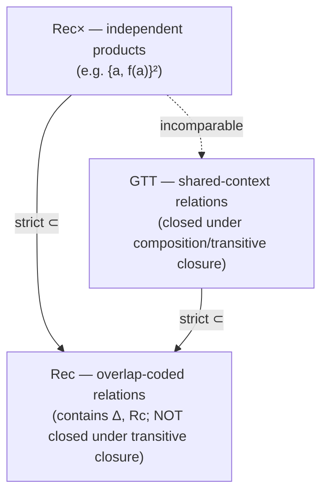

[[book-guidelines|↩ Back to guidelines]]

# Automata on Tuples of Trees

## What breaks when you only recognize single trees

Chapter 1 gave you a clean, well-behaved theory: recognizable *sets* of trees, closed under union, intersection, complement, decidable emptiness, the works. But almost nothing interesting in verification, rewriting, or logic is stated as a single-tree property. "This term rewrites to that term in one step." "This program's input relates to its output by such-and-such a transformation." "This assignment of variables satisfies this formula." All of these are **relations** — statements about *tuples* of trees, not properties of one tree in isolation. If your only tool is "is this one tree in this one recognizable set," you can't even *state* "term $t$ rewrites to term $u$," let alone decide it.

So the question this section answers is: what does it mean for a tree automaton to recognize a *relation* $R \subseteq T(F)^n$, rather than a set $L \subseteq T(F)$? It turns out there isn't one obvious answer — there are (at least) three, and they trade off expressiveness against closure properties in a genuinely interesting way. Understanding *why* there are three, and not one, is the heart of this section.

The motivating context, laid out in the book's introduction to Chapter 3, is Trakhtenbrot's "trinity" of Logic, Automata, and Verification: a logical formula $\varphi(x_1, \ldots, x_n)$ with $n$ free variables defines an $n$-ary relation (its solution set), and — going back to Büchi's 1960 result for word automata, extended by Doner, Thatcher, and Wright to trees — that relation is exactly what certain automata can recognize. Presburger arithmetic is the classic illustration: writing numbers in binary and stacking $n$ tuples of digit-strings into one string over an alphabet of "digit columns" turns "$x = y + z$" into a regular *word* language, and $\exists$, $\wedge$, $\vee$, $\neg$ become projection, intersection, union, and complement on automata. This section (§3.2) works out the tree-shaped analogue of that stacking trick — and, in the process, discovers a subtlety word automata never expose: the stacked encoding of *tree* tuples has a closure property that quietly fails, motivating the introduction of a third, more restrictive but better-behaved, notion.

## The first, weakest notion: $\mathrm{Rec}^\times$

The most naive idea: a relation is recognizable if it's a finite union of **products** of recognizable sets, $S_1 \times \cdots \times S_n$. Concretely, this means: run $n$ independent tree automata, one per component, and accept the tuple if automaton $i$ accepts component $i$. This class is called $\mathrm{Rec}^\times$.

**[[Automata-with-Constraints#What breaks|What breaks]]:** the diagonal relation
$$\Delta = \{(t, t) \mid t \in T(F)\}$$
is *not* in $\mathrm{Rec}^\times$. Intuitively: a product of independent automata can never enforce that two components are related to each other — each automaton reads its own component in total ignorance of the others. $\mathrm{Rec}^\times$ relations don't actually *relate* their components; they just independently constrain each one. That's a serious limitation — "$t$ rewrites to itself," "$t$ equals $u$," anything requiring the components to co-vary, is out of reach.

```rust
// Rec× as literally a pair of independent automata
struct RecTimes<A> {
    component_automata: Vec<A>, // one per tuple position, run independently
}

impl<A: TreeAutomaton> RecTimes<A> {
    fn accepts(&self, tuple: &[Term]) -> bool {
        // no cross-communication between components — this is exactly the limitation
        self.component_automata.iter().zip(tuple).all(|(a, t)| a.accepts(t))
    }
}
```

## The second notion: $\mathrm{Rec}$, via overlap-coding

To relate components, you need an automaton that reads them *simultaneously*, position by position — the tree analogue of "stack the binary digit-strings into columns." Given $F$, define a padded alphabet
$$F' = (F \cup \{\bot\})^n$$
where $\bot$ is a fresh "padding" symbol standing in for "this component has already run out of structure here." The arity of a tuple-symbol $(f_1, \ldots, f_n) \in F'$ is the *max* of the arities of its (non-$\bot$) components — you have to go as deep as the tallest of the $n$ trees.

The **coding** $[t_1, \ldots, t_n]$ of an $n$-tuple of trees is then defined by simultaneous recursion: at each position, pair up the symbols (padding with $\bot$ wherever a shorter subtree has already bottomed out at a constant while another hasn't), and recurse into the children, again padding with $\bot$-subtrees where one component's subtree is shallower than another's. For a pair, the book's Figure 3.2 example makes this concrete: overlapping $f(g(a),a)$ and $f(a,a)$ produces the single term $ff(ga, a\bot, a a)$ — reading off one tuple-symbol per position.

$$\mathrm{Rec} = \{ R \subseteq T(F)^n \mid \{[t_1,\ldots,t_n] \mid (t_1,\ldots,t_n)\in R\} \text{ is recognized by an NFTA over } F' \}$$

Now $\Delta \in \mathrm{Rec}$: the one-state automaton with the single rule $ff(q,\ldots,q) \to q$ for every $f \in F$ (i.e. "both components must literally have used the same symbol at every position, all the way down") recognizes exactly the coded diagonal. **Proposition 3.2.6**: $\mathrm{Rec}^\times \subsetneq \mathrm{Rec}$, strictly — every product-of-automata relation can be simulated by a single automaton on the overlapped alphabet (run both component automata "in parallel" inside one automaton whose states are pairs $(q_1, q_2)$), but $\Delta$ witnesses that the inclusion is proper.

```rust
// The coding is the key data structure: pair up symbols position-by-position,
// padding with ⊥ where one component has already bottomed out.
#[derive(Clone, PartialEq, Eq, Hash)]
enum Padded<F> { Sym(F), Bot }

// A term over F' = (F ∪ {⊥})^n is a term whose labels are n-tuples of Padded<F>
type CodedLabel<F, const N: usize> = [Padded<F>; N];

fn overlap<F: Clone>(terms: &[Term<F>]) -> Term<CodedLabel<F, 2>> {
    // recurse: at each position pair up the two (arity-mismatched) symbols,
    // padding the shorter side's children with a ⊥-subtree
    todo!("simultaneous recursion per the book's inductive definition")
}
```

**But $\mathrm{Rec}$ has a real drawback**: it is *not closed under transitive closure*. There is a binary relation in $\mathrm{Rec}$ whose transitive closure (e.g. "reachable by zero or more rewrite steps," starting from "reachable by exactly one step") is *not* in $\mathrm{Rec}$. This is the crack that motivates the whole rest of the section — a rewriting relation is barely useful if you can recognize one step but not "eventually reduces to."

## Why does $\mathrm{Rec}$ fail on transitive closure? (Key Question)

The book doesn't spell out the failing example in the main text of §3.2 (it's an exercise), but the structural reason is visible in how the overlap-coding works: the coded automaton for a pair $(t, u) \in R$ walks *both* trees in lockstep, one automaton state per *position pair*, reasoning about $t$'s label and $u$'s label at the *same* position simultaneously. That lockstep coupling is precisely what makes $\Delta$ expressible — but it also means the automaton's states are inherently tied to "where in $t$ am I, and where in the tuple's other components am I, at the same time." Composing two such relations — finding a $v$ such that $(t,v) \in R$ and $(v,u) \in R$ — requires *existentially quantifying away* the shared intermediate term $v$, and there is no general way to eliminate $v$ from an overlap-coded automaton without possibly needing unboundedly many bookkeeping states to track "which positions of $t$ and $u$ could have been reached via some common $v$." Overlap-coding buys you a coupling between components, but it buys that coupling *positionally*, and composition is not in general a positional operation.

**What GTT buys you** is a different, looser kind of coupling: instead of forcing $t$ and $u$ to be read in the same automaton at the same position, a GTT lets $t$ and $u$ be decomposed into *matching contexts* around a shared set of "synchronization states" — a much weaker commitment that turns out to be exactly closed under the operations (composition, transitive closure) that matter for rewriting.

## The third notion: Ground Tree Transducers (GTT)

**Definition 3.2.2.** A GTT is a *pair* of bottom-up tree automata $(A_1, A_2)$ over the same alphabet $F$, whose state sets may overlap in some **synchronization states**. A pair $(t, t')$ is accepted if there is a context $C \in \mathcal{C}^n(F)$ (a context with $n$ numbered holes) and states $q_1, \ldots, q_n$ shared by both automata such that
$$t = C[t_1, \ldots, t_n], \qquad t' = C[t'_1, \ldots, t'_n], \qquad t_i \xrightarrow{*}_{A_1} q_i, \qquad t'_i \xrightarrow{*}_{A_2} q_i \text{ for all } i.$$

In words: $t$ and $t'$ must share an *outer skeleton* $C$ exactly, symbol for symbol — but at the $n$ positions where they may differ, it's enough that $A_1$ can reduce $t$'s subterm there to some synchronization state $q_i$, and $A_2$ can independently reduce $t'$'s subterm there to that *same* $q_i$. The two automata never look at each other's run directly; they only have to "meet" at shared state names.

This is visibly weaker than $\mathrm{Rec}$'s lockstep coupling — GTT can't enforce equality symbol-by-symbol the way $\mathrm{Rec}$'s diagonal automaton does everywhere, only agreement-up-to-a-state at finitely many designated "difference points." **Proposition 3.2.7**: $\mathrm{GTT} \subsetneq \mathrm{Rec}$ — every GTT relation is codable in $\mathrm{Rec}$ (run the two component automata "together" with $\epsilon$-transitions merging shared states into one accepting state), but the inclusion is strict: **Proposition 3.2.8** exhibits $\mathrm{GTT} \not\subseteq \mathrm{Rec}^\times$ and $\mathrm{Rec}^\times \not\subseteq \mathrm{GTT}$ (every GTT contains $\Delta$ as a sub-case since a GTT with no transitions still trivially recognizes it via $n=0$, while $\{a, f(a)\}^2$, a plain product of two finite sets, cannot be forced into GTT's shared-context shape without also containing $\Delta$-like pairs) — and there's a relation $R_c$ (associated with the one-step rewrite relation for $a(x) \to x$) that lies in $\mathrm{Rec}$ but in neither $\mathrm{Rec}^\times$ nor GTT. So the three classes form a genuinely three-way landscape, not a simple chain:



The canonical example motivating GTT's usefulness: **one-step parallel rewriting** by a term rewriting system whose left-hand sides are linear and right-hand sides are ground. The rewrite step replaces some ground subterm matching the (linear) left side with the ground right side — everywhere *outside* the rewritten redex, $t$ and $t'$ are literally identical (the shared context $C$), and at the redex position(s), $A_1$ recognizes "any term matching this pattern" while $A_2$ recognizes "the fixed replacement term," meeting at a shared synchronization state. Example 3.2.5 in the book works this out concretely for the rewrite rule $0 \times x \to 0$.

```rust
struct Gtt<S> {
    a1: BottomUpAutomaton<S>, // reduces t-side subterms at "difference" positions
    a2: BottomUpAutomaton<S>, // reduces t'-side subterms at "difference" positions
    // states in a1.states() ∩ a2.states() are the synchronization states
}

impl<S: Eq + std::hash::Hash + Clone> Gtt<S> {
    fn accepts(&self, t: &Term, t_prime: &Term) -> bool {
        // find a common context C and holes p_1..p_n such that
        // t|_{p_i} reduces (in a1) to some sync state q_i, and
        // t'|_{p_i} reduces (in a2) to that SAME q_i, for every i,
        // while t and t' agree exactly outside those holes.
        todo!("nondeterministic search over the shared context / hole decomposition")
    }
}
```

## Closure properties: Boolean operations, projection, cylindrification

Both $\mathrm{Rec}^\times$ and $\mathrm{Rec}$ are closed under union, intersection, and complement (Proposition 3.2.9) — for $\mathrm{Rec}$, this is inherited directly from Chapter 1's Boolean closure results applied to the coded alphabet $F'$.

More specific to *relations* are two new operations:

- **Projection** (Definition 3.2.10): given $R \subseteq T(F)^n$, the $i$-th projection $R_i \subseteq T(F)^{n-1}$ existentially quantifies away the $i$-th component: $R_i(t_1,\ldots,t_{n-1}) \iff \exists t.\, R(t_1,\ldots,t_{i-1},t,t_i,\ldots,t_{n-1})$. This is the automata-theoretic mirror of $\exists x. \varphi$.
- **Cylindrification** (Definition 3.2.11): the reverse operation — inserting a "don't care" extra component, mirroring how a formula with $n$ free variables can be trivially viewed as one with $n+1$ (the new variable simply unconstrained).

**Proposition 3.2.12**: both operations are computable in linear time on $\mathrm{Rec}$ automata. The proof is a beautiful direct application of Chapter 1's tree-homomorphism machinery: projecting out component $i$ is exactly the (linear!) tree homomorphism that erases the $i$-th coordinate of every tuple-symbol, so by **Theorem 1.4.3** (linear homomorphisms preserve recognizability under direct image), the projection is automatically recognizable — no new theory needed, just an application of Chapter 1's closure result to this specific homomorphism. Cylindrification is the *inverse* homomorphic image of that same map, so it's covered by **Theorem 1.4.4** (inverse images always preserve recognizability, linear or not) instead. This is a nice illustration of how much mileage the two homomorphism theorems from Chapter 1 buy once you frame the right questions as homomorphisms.

One subtlety worth flagging: projecting a *deterministic* automaton can produce a *nondeterministic* one — projection is fundamentally an existential ("does some value of the erased component make this true"), and existentials are exactly what forces determinism to break down (the standard automata-theoretic reason $\exists$ costs you determinism, the same phenomenon as NFA-to-DFA subset construction being necessary once you existentially search over "some accepting path").

## GTT's payoff: closed under composition and transitive closure

This is the theorem the whole section has been building to.

**Theorem 3.2.14**: if $R \subseteq T(F)^2$ is recognized by a GTT, its transitive closure $R^*$ is *also* recognized by a GTT. **Proposition 3.2.16**: if $R, R'$ are both GTT-recognizable, so is their composition $R \circ R'$.

The proof idea (illustrated in the book's Figure 3.5) is genuinely elegant: to compose $(t,v) \in R$ with $(v,u) \in R'$, you don't need to *construct* $v$ inside a bigger automaton — you only need to notice that wherever $A_2$ (reading $v$, on the $R$ side) reaches a state $q$ and $A_1'$ (also reading $v$, on the $R'$ side) reaches a state $q'$, and both are reachable by *some* common term, you can simply add an $\epsilon$-transition $q \to q'$ directly to the automaton. This "completion" process — repeatedly adding $\epsilon$-transitions between states that share a witnessing term in their languages — terminates (it's monotone and bounded by $|Q_1 \cup Q_2|^2$) and yields a *fixed-point* automaton pair $(A_1^*, A_2^*)$ that recognizes exactly $R^*$ (or $R \circ R'$, by the same construction across the two different automaton pairs). Deciding *when* to add such a transition uses Chapter 1's decidability of language-intersection-emptiness ($L_{A_2^n}(q) \cap L_{A_1^n}(q') \neq \emptyset$?) — another place where Chapter 1's decision procedures get reused as a black box, this time as the termination-check inside an iterative automaton-construction algorithm rather than as a standalone yes/no answer.

Contrast this with $\mathrm{Rec}$'s failure on transitive closure: $\mathrm{Rec}$'s lockstep, position-by-position coupling gives it no analogous "splice in an $\epsilon$-transition" move, because there's no single shared state where two overlap-coded automata could be spliced together — the coupling is baked into the *coding itself*, not into a separable state-graph. GTT's looser, context-based coupling is exactly loose enough to admit this kind of local surgery.

```rust
// The core of the composition/transitive-closure construction: iteratively
// splice ε-transitions wherever two states are witnessed by a common term.
fn saturate<S: Eq + std::hash::Hash + Clone>(
    a1: &mut BottomUpAutomaton<S>,
    a2: &mut BottomUpAutomaton<S>,
) {
    loop {
        let mut added = false;
        for q in a1.states() {
            for q_prime in a2.states() {
                // decidable: Chapter 1 gives us intersection-nonemptiness for free
                if !a1.has_epsilon(q, q_prime) && languages_intersect(a2, q, a1, q_prime) {
                    a1.add_epsilon(q, q_prime);
                    added = true;
                }
            }
        }
        if !added { break; } // termination: bounded by |Q1 ∪ Q2|² pairs
    }
}
```

## Where this leads

Structurally, this section is the bridge between Chapter 1 (single-tree recognizability) and the rest of Chapter 3: §3.3 will code a *finite set of positions* as a single tree (a monadic second-order variable becomes a tree over an extended alphabet) and reuse exactly this overlap-coding idea — a set-of-positions is, after all, just another "tuple" to overlap-encode, this time encoding a set rather than a fixed arity of trees — to connect WSkS formulas to recognizable tree languages. §3.4 then leans heavily on GTT specifically: it's the mechanism behind deciding first-order properties of ground rewriting relations exactly *because* GTT survives composition and transitive closure where plain $\mathrm{Rec}$ can't.

For the compiler/verifier project this workbench is built around, GTT is worth flagging as directly load-bearing rather than merely a curiosity: a relational abstract domain for a CSP/abstract-interpretation kernel needs *exactly* this shape of result — a representation of "reachable in zero-or-more steps" (transitive closure) and "reachable via this relation, then that one" (composition) that stays within a decidable, automata-representable class. That's precisely the CHC/reachability-analysis problem of computing whether a program's states can reach a bad configuration, phrased over tree-shaped program states (ASTs, symbolic heaps) rather than flat words. The "structural tractability" thread from the learning goals is visible here too: GTT achieves its good closure properties by giving up the unrestricted coupling of $\mathrm{Rec}$ in exchange for a *structurally restricted* form of relatedness (shared context plus synchronization states) — the same kind of trade a tractable relational abstract domain has to make to stay decidable, and the same trade that shows up again, in a different guise, wherever a static analysis restricts its constraint language just enough to keep fixed-point computation terminating.
