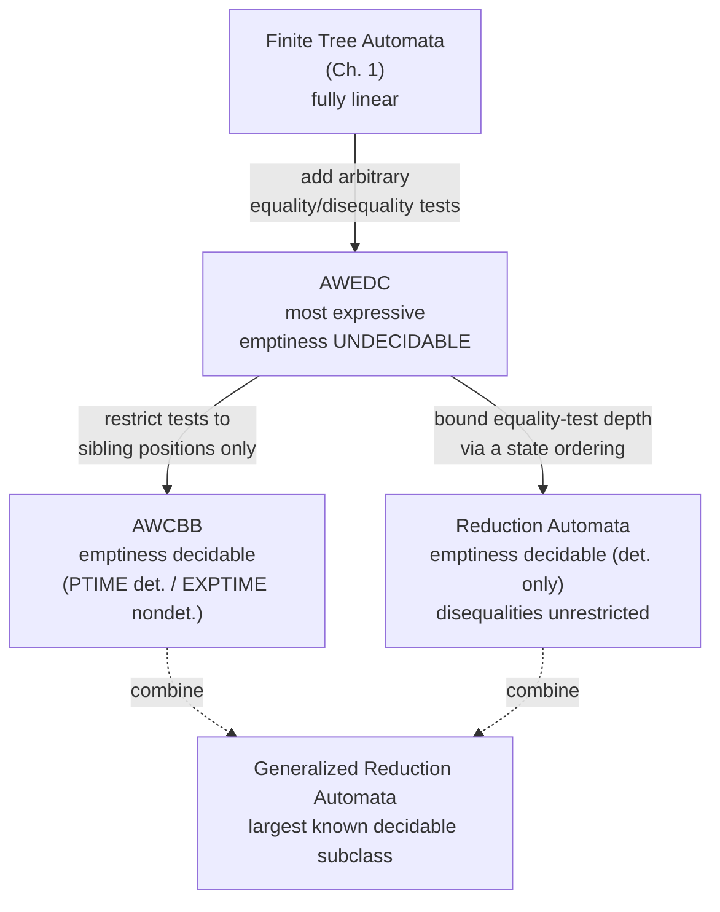

[[book-guidelines|↩ Back to guidelines]]

## The problem: siblings don't talk to each other

Every tree automaton you've built so far (finite tree automata from Chapter 1, GTT-based relational automata from Chapter 3) shares one structural limitation, and it's worth stating it as bluntly as the book does: **a bottom-up automaton processes the children of a node independently**. By the time you're deciding which state to assign to $f(t_1, t_2)$, all you know about $t_1$ is "it reached state $q_1$" and all you know about $t_2$ is "it reached state $q_2$." You have thrown away everything about $t_1$ and $t_2$ except a single finite label.

That's exactly the design that makes automata tractable — determinization, minimization, the pumping lemma, all of it rests on "finite information flows upward." But it also means a tree automaton fundamentally *cannot* recognize the language

$$
\{\, f(t,t) \mid t \in T(F) \,\}
$$

the set of terms whose two children happen to be *identical*. To accept this you'd need to compare $t_1$ and $t_2$ directly, not just consult two finite labels. If $t$ can be arbitrarily large, no finite state carries enough information to reconstruct "were these equal." This is precisely the same wall you hit in Chapter 1's discussion of linear tree homomorphisms and in Chapter 3's reducibility theory — every one of those results quietly assumed *linearity* (no repeated variables) for exactly this reason.

So the question this chapter answers is: can we patch tree automata to handle *some* non-linear situations without losing everything that makes them useful? The answer is yes, but — as you'll see — every fix trades something. This is the general shape of these results, and it echoes a pattern you'll want to recognize elsewhere: **unrestricted expressive power kills decidability, and the engineering move is always to find the maximal tractable fragment.** That's the same story as unrestricted higher-order unification being undecidable while Miller's *pattern unification* fragment (linear, distinct metavariable applications) is decidable and efficient — you're about to watch tree automata theory rediscover the identical tradeoff independently.



## Adding tests between subtrees: AWEDC

The natural first move is to let a transition rule carry a **Boolean constraint** comparing subtree positions. Fix a term $t$ and two positions $\pi, \pi' \in \{1,\dots,k\}^*$ (paths of child-indices, exactly the position notation from the Preliminaries). Define:

$$
t \models \pi = \pi' \iff \pi,\pi' \in \mathrm{Pos}(t) \text{ and } t|_\pi = t|_{\pi'}
$$

and $t \models \pi \neq \pi'$ as the negation. Extend $\models$ to Boolean combinations of these atoms in the obvious way ($\top$, $\bot$ for empty conjunction/disjunction).

An **automaton with equality and disequality constraints** (AWEDC) is $(Q, F, Q_f, \Delta)$ where transition rules now look like

$$
f(q_1,\dots,q_n) \xrightarrow{c} q
$$

with $c$ a Boolean combination of position (dis)equalities. The move relation is the same rewriting relation as Chapter 1, except a rule only fires if the actual subterms being consumed satisfy $c$:

$$
t \to_A t' \iff t = C[f(q_1(u_1),\dots,q_n(u_n))],\ t' = C[q(f(u_1,\dots,u_n))],\ f(q_1,\dots,q_n)\xrightarrow{c}q\in\Delta,\ f(u_1,\dots,u_n)\models c
$$

**Worked example** (the book's own): balanced complete binary trees over $\{f/2, a/0\}$ are recognized by a single-state AWEDC:

$$
a \to q \qquad f(q,q) \xrightarrow{1=2} q
$$

The rule for $f$ only fires when the two subtrees consumed are literally equal — which is exactly $\{f(t,t) \mid t \in T(F)\}$ generalized recursively. This is our first working solution to the problem from the introduction.

```rust
// A constraint is a boolean formula over position-equality atoms.
enum Constraint {
    True,
    Eq(Vec<usize>, Vec<usize>),   // positions π, π'
    Neq(Vec<usize>, Vec<usize>),
    And(Box<Constraint>, Box<Constraint>),
    Or(Box<Constraint>, Box<Constraint>),
    Not(Box<Constraint>),
}

struct AwedcRule<Q> {
    symbol: String,
    children_states: Vec<Q>,
    constraint: Constraint,
    target: Q,
}

fn satisfies(t: &Term, c: &Constraint) -> bool {
    match c {
        Constraint::True => true,
        Constraint::Eq(p, p_) => t.subterm(p) == t.subterm(p_),
        Constraint::Neq(p, p_) => t.subterm(p) != t.subterm(p_),
        Constraint::And(a, b) => satisfies(t, a) && satisfies(t, b),
        Constraint::Or(a, b)  => satisfies(t, a) || satisfies(t, b),
        Constraint::Not(a)    => !satisfies(t, a),
    }
}
```

Comparing subtrees is only cheap if you represent terms with **maximal sharing** (a DAG) so equality is a pointer/hash comparison rather than a structural recursive walk — the book makes this a standing assumption for all its complexity results in this chapter, and it's the same assumption you'd want in a real term-rewriting or CSP engine: hash-cons your terms, and structural-equality constraint checks become $O(1)$ per check instead of $O(\|t\|)$.

### What you keep

Reassuringly, most of Chapter 1's machinery survives with only complexity-cost changes:

- **Completion** (Proposition 4.2.4): you can always add a trash state $q_\bot$ and make the automaton total, in polynomial time, preserving determinism. The one subtlety is that the constraint on the "else" transition must be the *negation of the disjunction* of all other constraints on that same left-hand side, so completion doesn't silently accept extra terms.
- **Determinization** (Proposition 4.2.6): subset construction still works, but now each transition of the determinized automaton is *itself* labeled by a derived Boolean constraint built from conjunctions/disjunctions/negations of the original constraints — this is exponential, same asymptotic cost as ordinary NFTA determinization, but now the *constraint size* also blows up combinatorially, not just the state count.
- **Boolean closure** (Proposition 4.2.8): union (linear), intersection (quadratic, product automaton with conjoined constraints), complement (exponential, via determinization). Structurally identical to Theorem 1.3.1.
- **Membership** (Proposition 4.2.9): polynomial in general, linear for deterministic AWEDC — assuming the DAG-sharing representation so each constraint check is $O(|\pi|+|\pi'|)$.

### What breaks

**Emptiness is undecidable** (Theorem 4.2.10). The proof reduces the **Post Correspondence Problem**: given word pairs $(w_i, w_i')$ over $\{a,b\}$, PCP asks whether some sequence $i_1,\dots,i_p$ makes $w_{i_1}\cdots w_{i_p} = w'_{i_1}\cdots w'_{i_p}$. The construction builds states tracking "prefix of some $w_i$ built so far" on one branch and "prefix of the corresponding $w_i'$" on a parallel branch of the same term, with an equality constraint forcing the two branches to encode identical strings at the point they're compared, and a final equality constraint $1=3$ forcing the *whole* two sequences to coincide. A term is accepted exactly when it encodes a valid PCP solution — so $L(A) = \emptyset \iff$ PCP has no solution, and since PCP is undecidable, so is AWEDC emptiness.

This is the moment the pattern from the introduction becomes concrete: giving constraints full expressive freedom (any positions, arbitrary Boolean combinations) makes emptiness as hard as *encoding an entire undecidable combinatorial search* inside a single automaton run. The rest of the chapter is about walking that expressiveness back to regain decidability.

## Restricting to siblings: AWCBB

The first restriction: only allow (dis)equality tests **between brother positions** — indices $i, j \in \mathbb{N}^+$ directly, not arbitrary paths. This is exactly enough to accept $\{f(t,t)\}$ (both branches are literally siblings under the same $f$-node) but not enough to encode PCP's long-range path comparisons.

**Closure properties transfer unchanged** (Proposition 4.3.2) — same proofs as AWEDC, same complexities, since none of those constructions cared about *where* the compared positions were, only about Boolean combination.

**Emptiness becomes decidable**, but the naive Chapter-1 marking algorithm ("mark reachable states, propagate upward") doesn't directly work, because of a subtlety the book illustrates cleanly:

> Consider $a \to q$, $b \to q$, $f(q,q) \xrightarrow{1\neq 2} q_1$. Marking $q$ (because $a \in L(A,q)$) tells you *some* term reaches $q$ — but not that *two distinct* terms reach $q$, which is what you need to satisfy $1 \neq 2$ and reach $q_1$.

So the fix is to track not just "is this state inhabited" but "how many *distinct* terms (up to a bound) are known to inhabit this state." **Lemma 4.3.4** proves the key bound: for a *deterministic* AWCBB, if a state already has $\geq \mathrm{maxar}(F)$ known distinct witnesses (where $\mathrm{maxar}(F)$ is the largest arity in the alphabet), that's already enough combinatorial room to satisfy *any* Boolean combination of sibling (dis)equalities that might reference it — you never need more than $\mathrm{maxar}(F)$ witnesses per state. This gives a marking algorithm that's a direct, PTIME generalization of Chapter 1's:

```
Marked : Q → set of terms, capped at maxar(F) per state
repeat:
    for each rule f(q1,...,qn) --c--> q, and witnesses ti in Marked(qi):
        if t = f(t1,...,tn) satisfies c and |Marked(q)| < maxar(F):
            add t to Marked(q)
until fixpoint
accept iff some qf has Marked(qf) ≠ ∅
```

**Theorem 4.3.5**: PTIME for deterministic AWCBB (bounded-width marking, Lemma 4.3.4 does the work). **Theorem 4.3.6**: EXPTIME-complete for nondeterministic AWCBB — the upper bound is "determinize then run the PTIME algorithm" (paying the usual exponential determinization cost), and the *lower bound* is a reduction from ordinary NFTA intersection-nonemptiness (already known EXPTIME-complete from Chapter 1 §1.7): you encode $n$ separate tree automata's runs as *siblings* under a synchronizing symbol $g$, with equality constraints forcing all the siblings to represent the same witness term, so "some term is accepted by all $n$" becomes "some term is accepted by the combined AWCBB." This is the sharpest illustration in the chapter of *why* the determinism assumption in Lemma 4.3.4 matters: without it, you lose the witness bound and the problem provably jumps a full exponential class.

**Failure mode worth flagging**: AWCBB is *not* closed under projection or cylindrification (Section 4.3.4) — the move from single trees to tuples of trees (Chapter 3's territory) doesn't survive this restriction, because a sibling-equality constraint like $00(00,01) \models 1 \neq 2$ can become invalid after you project away one coordinate. So AWCBB happily extends *single-tree* applications (sort constraints, encompassment, ground reducibility for terms whose non-linearity is sibling-shaped) but not the *relational* applications from Chapter 3 (reduction strategies, which genuinely need automata on tuples).

## Bounding depth instead of position: Reduction Automata

AWCBB's restriction is *where* constraints can point (siblings only). The second restriction takes a completely different axis: allow constraints to point *anywhere*, but bound *how many equality tests can fire along any single branch* of a run. Disequalities stay unrestricted.

Formally: a **reduction automaton** is an AWEDC equipped with an ordering $>$ on states such that every rule $f(q_1,\dots,q_n)\xrightarrow{c}q$ has $q$ an upper bound of $q_1,\dots,q_n$, and a *strict* upper bound whenever $c$ contains an equality constraint. Intuitively: passing through an equality test must strictly increase your position in the ordering, so you can only do it finitely many times before hitting the top.

This is exactly the shape you need for the encompassment/reducibility applications from Chapter 3: `Proposition 4.4.2` shows the set of terms encompassing an arbitrary (possibly non-linear) term $t$ is accepted by a deterministic, complete reduction automaton, polynomial in $\|t\|$ — recovering, for *arbitrary* non-linear patterns, exactly the automaton construction that Chapter 3's Proposition 3.4.3 only gave for *linear* ones.

### Closure: union/intersection yes, complement unknown in general

Union and intersection transfer (Proposition 4.4.3, same product construction). Complementation is subtler: it's open whether the *general* class of reduction automata is closed under complement, but Proposition 4.4.4 gives a workaround — you can complete a reduction automaton preserving determinism, and **complete deterministic reduction automata are closed under complement**. This "closure holds, but only in the deterministic corner" foreshadows something more serious.

### Emptiness: decidable, but only for the deterministic case, and expensively so

**Theorem 4.4.5**: emptiness is decidable for complete, deterministic reduction automata (the proof is a pumping-lemma argument with a genuinely nasty complexity — a tower of exponentials — which the book only sketches). The core difficulty, illustrated by Example 4.4.6: ordinary tree-automaton pumping replaces a subterm reaching a repeated state with a smaller one reaching the same state, but a disequality constraint elsewhere in the term can depend on the *specific identity* of the term you just deleted:

$$
a \to q,\quad b \to q,\quad f(q,q)\xrightarrow{1\neq 2} q
$$

Here $t = f(f(a,b), b)$ is accepted, and $f(a,b)$ and $b$ both reach $q$ — but replacing $f(a,b)$ with $b$ gives $f(b,b)$, which is *not* accepted, because you've just destroyed the very disequality that made the original acceptance work. The book calls this "creating an equality," and distinguishes **close** equalities (created near the pumping point — these can usually be avoided by pumping more carefully, using a combinatorial bound on constraint size) from **remote** equalities (created between the pumping point and somewhere else entirely, which require switching to a different branch and pumping in two places jointly to avoid).

**Theorem 4.4.7 — nondeterministic reduction automata have undecidable emptiness.** This is the sharp boundary the chapter has been building toward, and answers Key Question 1 directly: the proof reduces the **halting problem for 2-counter machines**. Configurations $p(n,m)$ are encoded as terms $p(s^n(0), s^m(0))$; a single computation *step* is encoded via a gadget term $g(c, h(g(c', y), y))$ where the equality constraints on the encoding force the two occurrences of the "rest of the computation" $y$, and the two occurrences of each counter's before/after value, to coincide *across* what's structurally a long-range, non-brother, non-depth-bounded-in-the-obvious-sense comparison. The full computation trace is one big right-branching term (Figure 4.6 in the source), and $M$ halts iff the corresponding automaton's language at the final state is non-empty.

**Why does this specifically require non-determinism to break the decidability?** Because the pumping argument for Theorem 4.4.5 relies on being able to say "two positions reaching the *same* state via a *deterministic* run must, along the equivalence classes tracked by the automaton, actually correspond to equal or interchangeable subterms" — determinism is what lets you define pumping *on equivalence classes of positions* cleanly. Once the automaton is nondeterministic, two occurrences of $y$ (Figure 4.6) can be accepted at completely different states depending on which run you're following, and there's no way to guarantee that pumping one occurrence preserves the synchronization the constraints depend on. The undecidability construction directly exploits this: it needs the *same* subterm $y$ to be simultaneously constrained from two different "directions" in the same run, something only expressible because nondeterminism lets the automaton "guess" which parts of the term correspond to which counter-machine transition without committing structurally.

**Corollary 4.4.8**: reduction automata **cannot be determinized** — if they could, you'd get a decidable-emptiness deterministic automaton from every nondeterministic one, contradicting Theorem 4.4.7. This is a genuinely different failure mode from AWEDC/AWCBB, where determinization always existed (just expensively). Here determinization is provably *impossible*, not just expensive.

### Application: normal forms of arbitrary term rewriting systems

**Proposition 4.4.10**: given *any* term rewriting system $R$ (linear or not), the ground $R$-normal forms are recognized by a reduction automaton — as the complement of the union of "terms encompassing $l_i$" automata (each built via Proposition 4.4.2), the union taken via the usual product construction. **Corollary 4.4.11**: emptiness and finiteness of ground normal forms are therefore decidable for *any* TRS.

This directly generalizes what Chapter 3 could only prove for the linear case — and answers Key Question 3: GTT-based decidability (Chapter 3, Proposition 3.4.7) needs rewrite rules to share *no variables at all* to get closure under transitive closure/composition for the *relational* first-order theory of $\xrightarrow{*}_R$; reduction automata instead decide a *narrower* question — ground reducibility / normal-form recognition for a single term — but they do it for *arbitrary* non-linear rules, no shared-variable restriction needed. Neither mechanism subsumes the other: GTT buys you the full first-order theory of the rewrite *relation itself* (composable, iterable) at the cost of linearity; reduction automata buy you non-linearity at the cost of only deciding the specific *encompassment/normal-form* fragment, not arbitrary relational composition. They're solving genuinely different problems that happen to look similar from a distance.

## Squeezing more out: other decidable subclasses

Section 4.5 tightens the analysis further:

- **Disequality-only AWEDC** (no equality constraints at all): emptiness decidable in **DEXPTIME**. Ground normal forms of any TRS still fall into this subclass, which matters because it's a strictly *tighter* complexity bound than the general reduction-automaton tower-of-exponentials result.
- **Non-overlapping constraints**: if a deterministic reduction automaton's constraints are structured so equality tests never "reach back" into positions already committed by an earlier test on the same path, emptiness drops to **PTIME** — same flavor of gain as AWCBB's bounded-witness trick, just phrased along branches instead of across siblings.
- **Generalized reduction automata**: combine AWCBB's sibling-only restriction with the reduction-automaton depth ordering — but relaxed so *only* multi-position ($|\pi|>1$) equality constraints need to strictly increase the ordering; sibling-level ($|\pi|=1$) equalities are unrestricted. This is explicitly presented as **the largest known decidable subclass of AWEDC**, and extends the reducibility theory to include restricted sort declarations alongside encompassment predicates.

## Where this leads

Structurally, this chapter closes the "how far can non-linearity go" arc that Chapter 3 opened: Chapter 3 got you relational tree automata (GTT) and a full applications survey under a blanket linearity assumption; this chapter goes back and asks, for each of those applications, "what's the decidable non-linear analogue?" — and the honest answer, section by section, is *it depends which axis of expressiveness you restrict*. The chapter's real lesson isn't any one theorem, it's the shape of the tradeoff space: **unrestricted constraints (AWEDC) buy PCP-hard undecidability; sibling-restricted constraints (AWCBB) buy PTIME/EXPTIME decidability but lose relational applications; depth-bounded constraints (reduction automata) buy decidability for a genuinely non-linear pattern class but at the cost of losing determinizability itself.** Later, Chapter 5's tree-set automata revisit a structurally similar tension (closure under complement failing, decidability rescued only in restricted "simple"/deterministic subclasses) — the same architecture of "the general model is too powerful, carve out the tractable corner" recurs there too.

For the CSP-kernel and abstract-interpretation side of the project: this chapter is a direct, worked example of the exact tradeoff that any constraint-solving engine over automaton-shaped domains (DFA/tree-automaton representations of program states, invariants, or abstract data structures) will hit. If your domain representation allows arbitrary equality constraints between arbitrarily distant parts of a structure — the moral equivalent of full higher-order unification, or unrestricted aliasing between abstract locations — you inherit PCP-flavored undecidability for free, exactly as Theorem 4.2.10 shows. The fix is never "solve the general problem faster"; it's always "identify which syntactic restriction (sibling-only, like AWCBB; or depth-bounded, like reduction automata) still covers your actual use cases while restoring decidability" — precisely the same move Miller's pattern-unification fragment makes against full higher-order unification, and precisely the design question to ask before building the CSP kernel's non-linear-constraint representation: which fragment of "shared variables between abstract domain cells" do you actually need, and can you restrict propagation to stay inside a decidable (or at least tractable) corner of this same landscape?
