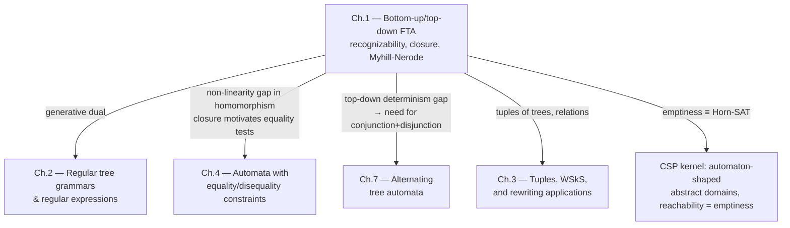

[[book-guidelines|↩ Back to guidelines]]

## Why you need an automaton that runs on trees, not strings

Everything you already know about regular languages was built for one shape of data: a sequence. A word automaton reads a linear string of symbols left to right. But most of the data structures that actually matter in a compiler or a verifier — abstract syntax trees, proof terms, typing derivations — are not sequences, they're trees. If you want the machinery of "regularity" (finite-state recognition, closure under Boolean operations, decidable emptiness) to apply to *those* structures, you need to generalize the automaton itself from strings to trees.

The generalization turns out to be remarkably clean, because a string can always be viewed as a special, degenerate case of a tree: a word $abb$ over $\{a,b\}$ is exactly the unary term $a(b(b(\sharp)))$ over the ranked alphabet $F = \{a(\cdot), b(\cdot), \sharp\}$, where $\sharp$ is a dummy leaf. Once you see this, tree automata stop looking like a new, exotic formalism and start looking like what they actually are: the same finite-state idea, generalized from "symbols of arity 1, chained" to "symbols of arbitrary arity, nested." This is why this chapter can, and does, replay essentially the entire undergraduate theory of finite automata (Hopcroft–Ullman style) almost sentence for sentence — determinization, closure properties, minimization, decision-problem complexity — just one level of generality up. It's also why the two or three places where the tree case *genuinely* diverges from the word case (top-down determinism, homomorphism closure) are worth paying close attention to: they are exactly the places where "nested" structure behaves differently from "chained" structure.

## 1. Bottom-up automata: states as a bottom-up type-inference pass

### The definition, motivated before formalized

Think about how you'd actually decide "does this ground term belong to my language?" The natural strategy, if the term is a tree, is to process it from the leaves upward: compute some finite piece of information (a *state*) for each leaf, then combine the states of a node's children (together with the node's own label) into a state for the node itself, and finally check whether the state computed at the root is "accepting." This is precisely a **bottom-up evaluation** of the term into a finite domain — which is exactly what a finite tree automaton is.

Formally, a nondeterministic finite tree automaton (NFTA) over a ranked alphabet $F$ is a tuple

$$A = (Q, F, Q_f, \Delta)$$

where $Q$ is a finite set of states, $Q_f \subseteq Q$ are the final (accepting) states, and $\Delta$ is a set of transition rules of the shape

$$f(q_1(x_1), \dots, q_n(x_n)) \to q(f(x_1, \dots, x_n)), \qquad f \in F_n,\ q, q_1,\dots,q_n \in Q.$$

There is no "initial state" the way there is for word automata — instead, the rules for constant symbols ($n=0$), of the form $a \to q(a)$, play that role: they seed the bottom of the computation. A **run** of $A$ on a ground term $t$ is a mapping $r : \mathrm{Pos}(t) \to Q$ that respects $\Delta$ at every position, and $t$ is **accepted** if some run labels the root ($\epsilon$) with a final state. The set of all ground terms accepted by $A$ is $L(A)$, the tree language it *recognizes*; a set is **recognizable** if it equals $L(A)$ for some NFTA.

**Rust grounding.** The cleanest way to internalize this is to actually write the evaluator. A ranked term is naturally an enum where each variant carries exactly as many children as its arity, and a run is a fold from the leaves up:

```rust
#[derive(Clone)]
enum Term {
    Leaf(Symbol),                  // arity 0
    Node(Symbol, Vec<Term>),       // arity n, n children
}

type State = u32;

struct Nfta {
    final_states: HashSet<State>,
    // key: (symbol, child-state tuple) -> set of possible resulting states
    delta: HashMap<(Symbol, Vec<State>), HashSet<State>>,
}

impl Nfta {
    // returns every state reachable at the root — the "set of runs" view
    fn reachable_states(&self, t: &Term) -> HashSet<State> {
        match t {
            Term::Leaf(f) => self.delta
                .get(&(*f, vec![]))
                .cloned()
                .unwrap_or_default(),
            Term::Node(f, children) => {
                // for NFTA, a child can be labeled by *any* state its own
                // subtree can reach — so we must consider every combination
                let child_state_sets: Vec<HashSet<State>> =
                    children.iter().map(|c| self.reachable_states(c)).collect();
                let mut result = HashSet::new();
                for combo in cartesian_product(&child_state_sets) {
                    if let Some(qs) = self.delta.get(&(*f, combo)) {
                        result.extend(qs);
                    }
                }
                result
            }
        }
    }

    fn accepts(&self, t: &Term) -> bool {
        !self.reachable_states(t).is_disjoint(&self.final_states)
    }
}
```

Notice the `cartesian_product` over child state-sets in the nondeterministic case — this is precisely where the algorithm's cost lives, and it's the seed of the determinization blow-up discussed below. In the **deterministic** case (a DFTA — no two rules share a left-hand side), this collapses to a genuine bottom-up fold with one state per subterm, and the transition relation becomes a transition *function* $\delta$, letting you view the whole automaton as nothing more than a finite $F$-algebra: a carrier set $Q$, one $n$-ary operation $f^A : Q^n \to Q$ per symbol $f \in F_n$, and a designated "accepting" subset. Accepting a term is then just: evaluate it in this algebra via the unique homomorphism $T(F) \to A$, and check whether the result lands in the accepting subset. If you've ever implemented a small evaluator or interpreter, this is *exactly* the shape of a denotational-semantics-style fold — the automaton *is* an interpreter into a finite semantic domain.

**[[Automata-with-Constraints#What breaks|What breaks]] without nondeterminism-then-elimination.** It's tempting to think you always want a DFTA in hand, since it's the one that gives you a genuine single-pass evaluator. But NFTAs are often vastly more natural to *write down* (e.g. "guess which disjunct of a union a subterm belongs to"), and the theorem that rescues you is the tree-automata analogue of the subset construction (§1.1, Theorem 1.1.9): every NFTA has an equivalent DFTA. As in the word case, this determinization can blow the state count up exponentially — TATA gives a canonical witness (Example 1.1.11: a language that needs $2^{n+1}$ states deterministically but only $n+2$ nondeterministically) built by forcing the automaton to "remember" the last $n$ symbols along a branch. This is the tree-shaped version of the classic "regular languages requiring exponentially larger DFAs" argument, and it matters concretely: if you ever compile a nondeterministic automaton-shaped domain (e.g. a grammar over abstract values) down to something you evaluate deterministically at analysis time, this exponential is a real cost you'll pay, not a theoretical curiosity.

### $\epsilon$-rules, and why they cost nothing

It's convenient to allow $\epsilon$-rules $q \to q'$ (change state without consuming a symbol) — useful for encoding subsort inclusions (e.g. "every nonempty list is a list," `List* ⊆ List`), a pattern TATA flags as literally an order-sorted algebra. The saving grace (Theorem 1.1.5) is that $\epsilon$-rules add no expressive power: you can eliminate them by precomputing the $\epsilon$-closure of every state (a transitive-closure computation, $O(|Q|^3)$) and folding it into the ordinary rules. This is worth internalizing as a recurring pattern in automata theory generally: a convenience feature that doesn't consume input is almost always eliminable by closure-precomputation, at some finite (often cubic) one-time cost.

## 2. The pumping lemma: from "a specific proof trick" to a reusable non-recognizability certificate

Consider the language $L = \{f(g^i(a), g^i(a)) \mid i > 0\}$ — pairs of identical unary towers. Intuitively, no finite automaton can recognize this: it would need to *count* the height of the left branch and check the right branch matches, but a finite-state machine only has finitely many states to remember "how far along I am." TATA turns this intuition into a general, mechanical proof recipe.

**Pumping Lemma.** For any recognizable $L$, there is a constant $k > 0$ such that every $t \in L$ with $\mathrm{Height}(t) > k$ decomposes as $t = C[C'[u]]$ for a context $C$, a *non-trivial* context $C'$, and a term $u$, such that $C[C'^n[u]] \in L$ for **every** $n \geq 0$.

The proof is a direct pigeonhole argument: run an automaton with $|Q| = k$ states on $t$; since $t$ is taller than $k$, some path revisits a state, and the loop between the two visits is exactly the pumpable context $C'$ (you can splice in as many or as few copies of it as you like, because the automaton can't tell the difference — it only remembers the state, not how it got there). This directly explains the counting-language failure above: to accept $f(g^k(a), g^k(a))$, a $k$-state automaton must revisit a state along the (unary) left branch, and pumping that loop produces $f(g^{j}(a), g^k(a))$ with $j \ne k$ still "accepted" by the same run structure — contradicting that $L$ only contains *matched* pairs.

Beyond disproving recognizability, the same pigeonhole bound gives you decidable emptiness and finiteness essentially for free (Corollary 1.2.3): $L(A) \ne \emptyset$ iff some accepted term has height $\le |Q|$, and $L(A)$ is infinite iff some accepted term has height strictly between $|Q|$ and $2|Q|$. This is a good example of a theme that recurs throughout automata theory: a structural bound on witnesses (here, height) turns an existential decision problem into a *search* problem over a bounded space.

## 3. Closure properties: union, intersection, complementation — and why the *representation* you pick matters

Recognizable tree languages are closed under union, intersection, and complementation (Theorem 1.3.1) — but the *constructions* differ in an instructive way depending on whether you insist on staying deterministic.

- **Union** has two constructions: the naive one just takes the disjoint union of two automata's states and rules (cheap, but destroys determinism/completeness even if the inputs had it), and a **product automaton** construction that processes both automata "in parallel" on the same input and takes final states to be $Q_{f1} \times Q_2 \cup Q_1 \times Q_{f2}$ — this one *does* preserve determinism, but crucially requires both inputs to already be **complete** (every state/symbol combination has some transition), otherwise a term accepted by one but rejected-by-absence-of-a-run in the other silently vanishes from the product.
- **Complementation** is almost embarrassingly simple *if* you already have a complete DFTA: just flip $Q_f$ to its complement in $Q$. But if you start from an NFTA, you must first determinize (and complete) it — paying the potential exponential blow-up from §1 — before you can flip anything. This is the tree-automata restatement of a fact you may already know from the word case: nondeterministic automata are not closed under complementation "for free"; determinism is a prerequisite resource, not a cosmetic property.
- **Intersection** can be derived from De Morgan ($L_1 \cap L_2 = \overline{\overline{L_1} \cup \overline{L_2}}$), but that route forces you through the expensive complementation/determinization detour. TATA instead gives you the direct product-automaton construction (states $Q_1 \times Q_2$, final states $Q_{f1} \times Q_{f2}$), which needs no completeness assumption and preserves determinism directly.

The general lesson: "closed under an operation" is a statement about *existence* of a construction, but different constructions carry wildly different complexity and preconditions — and this is exactly the kind of distinction that matters once you're deciding how to represent an abstract domain in a real implementation, not just proving a closure theorem on paper.

## 4. Tree homomorphisms: where linearity — not determinism — becomes the load-bearing property

### What a tree homomorphism is, and why duplication is dangerous

A tree homomorphism $h : T(F) \to T(F')$ is determined by a mapping $h_F$ that sends each $f \in F_n$ to a term $t_f \in T(F', X_n)$ — you're replacing each symbol by a fixed pattern with holes, then substituting recursively: $h(f(t_1,\dots,t_n)) = t_f\{x_1 \leftarrow h(t_1), \dots, x_n \leftarrow h(t_n)\}$. This is a strict generalization of a word homomorphism (replace each letter by a fixed word) to ranked alphabets.

In the word case, regular languages are closed under **both** homomorphisms and inverse homomorphisms. In the tree case, this symmetry breaks, and it breaks for a specific, structural reason: **direct image is closed under only *linear* homomorphisms** — those where each variable $x_i$ appears at most once in $t_f$ (Theorem 1.4.3) — while **inverse image is closed under arbitrary homomorphisms**, linear or not (Theorem 1.4.4).

Why does non-linearity break the direct image? Trace the failure exactly, since the resolved learning goals here call for tracing *where* a proof breaks, not just citing the theorem. The forward proof direction of Theorem 1.4.3 (building an automaton $A'$ for $h(L)$ from one for $L$) constructs, for each rule $r: f(q_1,\dots,q_n) \to q$, a little gadget automaton over the states of the pattern $t_f$'s positions, which reduces $t_f\{x_1 \leftarrow q_1, \dots\}$ down to $q$. If $t_f$ is linear, each variable $x_i$ appears once, so there is exactly one "slot" per $q_i$ to plug in, and the construction is a clean structural recursion. If $t_f$ is *non-linear* — say $x_1$ appears twice, as in $h_F(f) = f'(x_1, x_1)$ — then in the reverse direction of the proof (showing $h(L) \subseteq$ what the gadget accepts implies a preimage in $L$), you would need to guarantee that **both occurrences of $x_1$** were substituted by the *same* term, not merely by terms reaching the same state $q_1$. But an automaton's states only remember "which state was reached," not "which specific term produced it" — so two occurrences of a variable can be independently filled by different terms $u, u'$ that both reach state $q_1$ but aren't equal, and the construction silently accepts spurious duplicated-but-unequal instances. TATA's own witness makes this concrete: $L = \{f(g^i(a)) \mid i \ge 0\}$ is recognizable, but under $h_F(f) = f'(x_1,x_1)$, $h(L) = \{f'(g^i(a), g^i(a)) \mid i \ge 0\}$ is exactly the pumping-lemma counterexample from §2 — non-recognizable. **Duplication is precisely what a finite-state automaton cannot check for equality on**, because equality-of-subtrees is not a finite-state-checkable property in general (this is the same root cause that will resurface, generalized, in Chapter 4's constrained automata, which exist specifically to patch this gap).

The inverse-image direction has no such problem, because going from $h(t)$ backward to $t$ never requires *comparing* two positions in $t$ for equality — you just simulate, symbol by symbol, what state each subterm of $t$ would need to reach so that its image reaches the right state, independently at each position.

**Rust framing.** If you've ever written a lowering/desugaring pass in a compiler (e.g. expanding a `for` loop into a `while` loop, or expanding sugar into core-calculus terms), you've written a tree homomorphism. The moment your desugaring duplicates a subexpression — expanding `x += e` into `x = x + e`, copying `e` — you've made it non-linear, and this theorem is telling you exactly why: a static analysis that was decidable/finite-state on the desugared form need not remain so, precisely because of the duplication, unless something stronger than plain recognizability tracks the equality constraint.

### Named special cases

TATA singles out a few structurally important subclasses: $\epsilon$-free/non-erasing (no $t_f$ collapses to a bare variable), symbol-to-symbol (each $t_f$ has height 1), complete (every input variable $x_i$ actually appears in $t_f$), delabeling (complete + linear + symbol-to-symbol — just a relabeling, possibly reordering children), and alphabetic/relabeling (symbol-to-symbol *and* preserves child order exactly). Each of these preserves recognizability in both directions, in linear time — they're the "safe," structure-preserving homomorphisms you reach for when you need to translate between two term representations of essentially the same tree shape.

## 5. Minimization: the Myhill-Nerode theorem, generalized one dimension up

### The congruence-closed-under-context idea

The word-automata Myhill-Nerode theorem says: a language is regular iff the relation "$u$ and $v$ are interchangeable in every context" has finitely many equivalence classes. The tree generalization is the same idea, with "context" now meaning a linear term with one designated hole $C \in T(F, \{x\})$ (formally, a *linear* single-variable term — the general $n$-hole context $C[t_1,\dots,t_n]$ specializes to this for $n=1$). An equivalence relation $\equiv$ on $T(F)$ is a **congruence** if it's compatible with every function symbol (component-wise equivalent children give equivalent parents), and it's **of finite index** if it has finitely many classes. Define the canonical congruence for a language $L$:

$$u \equiv_L v \iff \forall C \in C(F),\ C[u] \in L \Leftrightarrow C[v] \in L.$$

**Myhill-Nerode Theorem.** $L$ is recognizable $\iff$ $L$ is a union of classes of *some* finite-index congruence $\iff$ $\equiv_L$ itself is a finite-index congruence.

The proof's three implications are worth internalizing as *constructions*, not just abstract equivalences, because each one is directly runnable:

- $(i) \Rightarrow (ii)$: given a complete DFTA $A$, define $u \equiv_A v \iff \delta(u) = \delta(v)$ — literally "reach the same state." This is trivially a finite-index congruence (bounded by $|Q|$), and $L$ is the union of the classes landing in $Q_f$.
- $(ii) \Rightarrow (iii)$: any finite-index congruence $\sim$ whose classes union up to $L$ must be a *refinement* of $\equiv_L$ (being $\sim$-equivalent is a stronger, more specific condition than being $\equiv_L$-equivalent), so $\equiv_L$'s index is bounded by $\sim$'s — hence also finite.
- $(iii) \Rightarrow (i)$: build the automaton whose states literally *are* the equivalence classes $[u]$ of $\equiv_L$, with $\delta_{\min}(f, [u_1],\dots,[u_n]) = [f(u_1,\dots,u_n)]$ (well-defined precisely because $\equiv_L$ is a congruence) and $Q_{f,\min} = \{[u] \mid u \in L\}$.

That last construction, $A_{\min}$, is not just *an* automaton for $L$ — it is (up to renaming states) *the* unique minimum-state DFTA for $L$ (Corollary 1.5.1), because any other DFTA $A$'s own state-equivalence $\equiv_A$ is necessarily a refinement of $\equiv_L$, so $A$ can have no fewer states than $A_{\min}$ has classes.

### A concrete minimization algorithm: partition refinement

Building $A_{\min}$ directly from $\equiv_L$ is existence-only; the constructive algorithm (MIN) is the tree-shaped generalization of Hopcroft-style partition refinement. Start with the coarsest possible partition — final vs. non-final states — and repeatedly refine: two states $q, q'$ stay together only if, for every symbol and every choice of the *other* argument positions, substituting $q$ vs. $q'$ into that one position leads to states that are *themselves* still in the same class. Iterate until the partition stabilizes.

```rust
// Sketch: one refinement round. `partition[q]` is q's current class id.
fn refine_once(automaton: &Dfta, partition: &mut HashMap<State, ClassId>) -> bool {
    let mut changed = false;
    let mut signature: HashMap<State, Vec<(Symbol, usize, ClassId /* siblings' + result's class */)>> = ...;
    // for each state q, compute a "signature": for every rule application where
    // q occupies argument position i, what class does the result land in
    // (given the *current* classes of the other arguments)?
    // states with identical signatures + same current class stay merged;
    // otherwise split them into a fresh class.
    ...
    changed
}
```

This is exactly DFA minimization generalized to "arity-many neighbors instead of one predecessor/successor," and it terminates in the same style — the partition can only get strictly finer, bounded by $|Q|$ refinements.

**Why this matters for a CSP/abstract-interpretation kernel.** If you represent an abstract domain value (say, a recursive data-structure shape, or a set of reachable states in some symbolic execution) as a tree automaton, minimization is not a cosmetic optimization — it is *the* mechanism that gives you a canonical, comparable representative for "this abstract value," the same way BDD/DFA canonicalization underlies efficient symbolic model checking. Equivalence-checking two automaton-represented domain elements reduces, via minimization, to comparing two canonical forms rather than solving a language-equivalence problem from scratch each time.

## 6. Top-down automata: the one place nondeterminism is *not* free

Everything so far has been "bottom-up": start at the leaves, work toward the root. You can just as naturally define a **top-down** automaton: start at the root with an initial state, and push a rule $q(f(x_1,\dots,x_n)) \to f(q_1(x_1),\dots,q_n(x_n))$ downward, assigning a state to each child independently. As sets of accepted languages, top-down NFTA and bottom-up NFTA coincide exactly (Theorem 1.6.1 — reverse the arrows, swap initial/final states) — no surprise there.

The surprise is what happens under determinism. A top-down automaton is deterministic if it has one initial state and no two rules share a left-hand side — and **deterministic top-down automata are strictly weaker** than nondeterministic ones (Proposition 1.6.2). The canonical witness: $T = \{f(a,b), f(b,a)\}$ over $F = \{f(\cdot,\cdot), a, b\}$. A top-down automaton processes both children of $f$ *independently*, each only knowing the state assigned by the (single, deterministic) rule for $f$ — it has no way to correlate "if the left child got $a$, the right child must get $b$, and vice versa" without nondeterministically guessing which disjunct it's in. Try to build one deterministically and it necessarily also accepts $f(a,a)$.

**Why this is the real asymmetry between bottom-up and top-down, worth contrasting explicitly with the subset construction of §1:** bottom-up processing computes a child's state *before* combining it with its siblings — by the time you assign a state to the parent, you already know everything about every child, so nondeterminism can always be "resolved in retrospect" by tracking the *set* of states each subtree could reach (exactly the subset construction). Top-down processing has to commit to a state for each child *before* it has looked at that child at all — there is no "retrospective" information available, so a nondeterministic *choice* made at the parent cannot, in general, be replaced by a deterministic function of only the parent's own state and label. Intuitively (and made precise via Exercise 1.6's path-language machinery), a deterministic top-down automaton can only express **path-closed** properties — constraints that decompose into independent constraints along each root-to-leaf path — and $T = \{f(a,b), f(b,a)\}$ is precisely a *sibling-correlation* property, which is not path-decomposable.

This distinction is worth filing away as a genuinely recurring pattern: **whenever an analysis needs to correlate information across siblings rather than along a single path, top-down/single-pass deterministic processing is insufficient, and you need either nondeterminism (backtracking/multiple hypotheses) or bottom-up accumulation.** This is the same structural tension you'll meet again, formalized, in Chapter 4's automata-with-constraints (which exist specifically to let a bottom-up automaton test equality *between* sibling subtrees).

## 7. Complexity: what each decision problem actually costs

TATA closes the chapter with a systematic complexity map, worth having as a reference table rather than prose:

| Problem | Complexity |
|---|---|
| Membership (fixed automaton) | ALOGTIME-complete |
| Uniform membership (DFTA) | linear time |
| Uniform membership (NFTA) | polynomial (simulated determinization) |
| Emptiness | **linear time**, but **P-complete** (no faster in parallel) |
| Intersection non-emptiness ($n$ automata) | **EXPTIME-complete** |
| Universality / emptiness-of-complement (NFTA) | **EXPTIME-complete** |
| Finiteness | polynomial |
| Inclusion / equivalence (NFTA) | **EXPTIME-complete** |
| Singleton-language test | polynomial |

Two of these deserve a first-principles "why," because they are exactly the results that will matter most if you ever implement automaton-based abstract domains:

**Emptiness is linear, but it's *also* P-complete** — meaning it is inherently sequential; there's no expectation of an efficient parallel algorithm, since P-completeness under log-space reductions is evidence against $\mathrm{NC}$-membership. The linear algorithm itself is a clean fixpoint computation: reduce the automaton (Section 1.1's marking algorithm, tracking *accessible* states bottom-up), and the language is empty exactly when no final state is accessible. TATA makes the connection to logic explicit and elegant: associate a propositional variable $X_q$ with each state, and each rule $f(q_1,\dots,q_n) \to q$ with the Horn clause $X_q \vee \neg X_{q_1} \vee \dots \vee \neg X_{q_n}$ (i.e. "if all children are activated then so is the parent"); then emptiness of $L(A)$ is exactly *satisfiability* of this Horn system together with $\{\neg X_q \mid q \in Q_f\}$. **This is worth sitting with**: bottom-up tree-automaton emptiness *is*, literally, propositional Horn-SAT — the same linear-time unit-propagation fixpoint that underlies both Datalog/CHC solving and one of the cheapest fragments of SAT. If your CSP/abstract-interpretation kernel represents reachability or invariant-generation queries as automaton-emptiness questions, you are, underneath, running Horn-clause satisfiability — the connection the learning-goals file explicitly asks to be surfaced between CHCs and structural automata problems.

**Intersection non-emptiness is EXPTIME-complete**, even though computing the product automaton of $n$ automata and checking *its* emptiness is easy to state — the catch is that the product's *size* is the *product* of the sizes ($\|A_1\| \times \cdots \times \|A_n\|$), which is exponential in $n$. The hardness direction is proved by simulating a linear-space-bounded alternating Turing machine, where each of $n$ tree automata polynomially encodes one "slice" of an accepting computation and their conjunction (intersection) encodes the full computation existing. This result reappears constantly in practice under another name: it is the same combinatorial explosion behind why naive conjunctive type-inference / multi-constraint-set intersection can blow up exponentially even when each individual constraint is automaton-representable and simple — exactly the tension your refinement-type inference and CSP-based invariant search will need to manage (e.g. via incremental/lazy intersection rather than eagerly materializing the full product).

## Where this leads

This chapter fixes the acceptor-side vocabulary — NFTA/DFTA, recognizability, closure, minimization, complexity — that every later chapter either directly reuses or deliberately extends to patch a specific gap it exposes:



Concretely: **Chapter 2** revisits everything here from the generative side (grammars, regular expressions) and proves it's the same class of languages, viewed differently. **Chapter 4**'s entire motivation is patching exactly the gap exposed in §4 above — ordinary bottom-up automata cannot check equality between sibling subtrees, so non-linear pattern languages like $\{f(t,t)\}$ escape recognizability; constrained automata add exactly that missing test. **Chapter 7**'s alternating automata revisit the top-down determinism gap from §6 by adding *conjunctive* branching (not just disjunctive/nondeterministic branching) to top-down automata, which turns out to restore a clean, determinization-free complementation — directly dual to how Boolean satisfiability of Horn clauses (§7's emptiness-as-SAT connection) generalizes to full propositional satisfiability.

For the compiler/elaborator project specifically: this chapter is the direct blueprint for representing recursive, tree-shaped abstract values (refinement-type shapes, inductive-datatype invariants, or even proof-term skeletons) as finite automata in a CSP/abstract-interpretation kernel — closure under union/intersection gives you domain-lattice meet/join, minimization gives you canonical comparison, and the emptiness-as-Horn-SAT connection is the concrete mechanism by which "is this abstract state reachable" queries reduce to a solved, linear-time-decidable problem rather than a search you have to reinvent.
