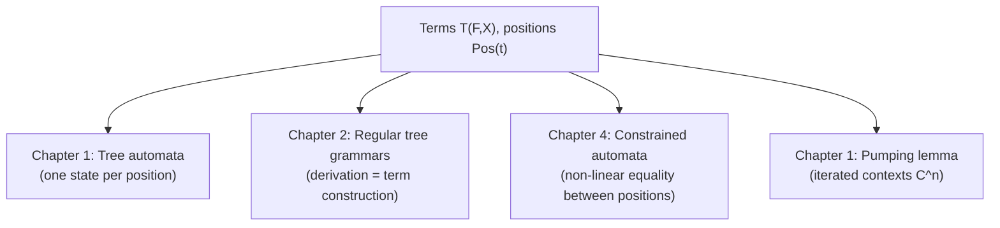

[[book-guidelines|↩ Back to guidelines]]

# Terms, Trees, and Contexts

## Why bother with a formal notion of "term" at all?

Every automated-reasoning system — a compiler's parser, a term rewriter, a type checker — eventually has to answer a deceptively simple question: *what, precisely, is a piece of syntax?* Intuitively you already know: it's a nested expression like `f(g(a, b), h(c))`, and you've been drawing it as a tree since your first data-structures course. But "draw it as a tree" is not yet a *definition* — it doesn't tell you what a subterm is, what it means to replace one subterm by another, or how to talk about "the node three steps down and one step right" without inventing ad hoc terminology every time. TATA's Preliminaries chapter exists to nail all of this down once, rigorously, so every later chapter (tree automata, transducers, constraints) can build on a shared, unambiguous vocabulary instead of re-explaining "what a tree is" each time.

The key design decision — and the one that will feel initially over-engineered if you're coming from a "trees are just structs/enums" mental model — is defining a tree not as a recursive data structure but as **a partial function from strings of positive integers to labels**. This is worth understanding *why*, because it is exactly the move that makes reasoning about tree automata clean later on.

## Ranked alphabets: giving symbols a fixed arity

Start with the vocabulary. A **ranked alphabet** is a pair $(F, \mathrm{Arity})$: $F$ is a finite set of symbols, and $\mathrm{Arity}: F \to \mathbb{N}$ assigns each symbol its arity — how many children it takes. $F_p$ denotes the symbols of arity exactly $p$; arity-0 symbols are called **constants**.

This is the tree-automata analogue of a signature in an algebraic type system: `cons` has arity 2, `nil` and `a` have arity 0. Nothing subtle yet — but notice this already buys you something a raw "nested list" representation doesn't give for free: *every symbol's out-degree is fixed and known in advance*. That fixed-arity discipline is precisely what will let a finite-state automaton process a tree by looking at one node's label and its (already-computed) children states — there's no need to first discover how many children a node has by scanning ahead.

**Rust grounding.** The direct translation of a ranked alphabet is a Rust `enum` where each variant's field count *is* its arity — the type system enforces the ranked-alphabet discipline for you at compile time:

```rust
enum Term {
    A,                          // constant, arity 0
    Nil,                        // constant, arity 0
    Cons(Box<Term>, Box<Term>), // arity 2
}
```

You cannot construct a `Cons` with the wrong number of children; the compiler's exhaustiveness checking on `match` forces you to handle every arity case. This is a preview of a theme that recurs throughout type theory: *fixing a signature up front lets you replace runtime arity-checking with static guarantees*.

## Terms: the smallest set closed under application

Given a ranked alphabet $F$ and a set of variables $X$ (disjoint from the constants $F_0$), the set of **terms** $T(F,X)$ is defined as the *smallest* set such that:

- $F_0 \subseteq T(F,X)$ (constants are terms),
- $X \subseteq T(F,X)$ (variables are terms),
- if $f \in F_p$ ($p \geq 1$) and $t_1,\dots,t_p \in T(F,X)$, then $f(t_1,\dots,t_p) \in T(F,X)$.

"Smallest set closed under these rules" is the formal way of saying "terms are built up by finitely many applications of the constructors, nothing more exotic (no infinite terms, nothing outside this grammar)" — an inductive definition, in the same sense that a Rust `enum` or a Lean `inductive` type is generated by finitely many constructors.

When $X = \emptyset$, $T(F,X)$ is written $T(F)$, and its members are **ground terms** — terms with no variables, i.e. fully concrete data. A term is **linear** if every variable occurs at most once in it — this restriction will matter a great deal later (contexts, later chapters' non-linear pattern matching), so it's worth flagging now even though nothing forces linearity yet.

**Lean grounding.** This inductive definition is close to verbatim what an `inductive` declaration says:

```lean
inductive Term (F : Type) (arity : F → Nat) (X : Type) where
  | var : X → Term F arity X
  | const : (f : F) → arity f = 0 → Term F arity X
  | app : (f : F) → (args : Fin (arity f) → Term F arity X) → Term F arity X
```

The `Fin (arity f)`-indexed family of arguments is Lean's way of saying exactly what the ranked alphabet says informally: a symbol of arity $n$ takes *exactly* $n$ children, dependently tied to $f$ itself.

## The real payoff: trees as partial functions on positions

Here's the definition that looks needlessly abstract at first glance but is actually the load-bearing idea of the whole chapter. A term $t \in T(F,X)$ can equivalently be viewed as a finite ordered tree — which TATA defines as **a partial function $t : \mathbb{N}^* \to F \cup X$** whose domain $\mathrm{Pos}(t)$ (the *positions*) is:

(i) nonempty and **prefix-closed** (if $p \in \mathrm{Pos}(t)$ and $q$ is a prefix of $p$, then $q \in \mathrm{Pos}(t)$),
(ii) at every position $p$ with $t(p) \in F_n$, $n \geq 1$: exactly the children $p1, p2, \dots, pn$ are in $\mathrm{Pos}(t)$,
(iii) at every position $p$ with $t(p) \in X \cup F_0$ (a leaf): no children exist.

So a position is a string over $\mathbb{N}^*$ — think "path from the root": $\varepsilon$ is the root, $1$ is the first child of the root, $21$ is the first child of the second child of the root, and so on. $\mathrm{Head}(t) = t(\varepsilon)$ is the root symbol.

**[[Automata-with-Constraints#What breaks|What breaks]] without this?** If you represent a term only as a nested recursive data structure (as the Rust `enum` above does), you have no uniform, structure-independent *name* for "a node inside the tree" — you can only get at a subterm by pattern-matching your way down, one recursive case at a time, and the "address" of that subterm exists only implicitly, as the call stack of the traversal that found it. The position-function view gives every node a first-class, portable identifier — a plain string like `21` — independent of any particular traversal. That is exactly what you need to state things like "compare position $p$ in this tree against position $q$ in *that* tree" (crucial for the non-linear constraints of Chapter 8) or "replace whatever is at position $p$" without having to re-derive a path each time. It's the difference between an AST node being reachable only via recursion and an AST node being addressable by name — the latter is what makes automaton *states*, one per subtree, coherent as a concept: a bottom-up tree automaton assigns a state to each *position*, and the transition rule at a node depends only on the states already assigned to its children's positions, not on how you got there.

Because ranked alphabets fix out-degree by arity, conditions (i)–(iii) are just "the tree literally has the right number of children at every node, no more, no less" — recognizable trees are, structurally, in bijection with well-formed terms.

**Rust grounding — positions as paths.** The position type is just what it looks like:

```rust
type Position = Vec<usize>; // e.g. [2, 1] = "second child, then first child"

fn subterm_at<'a>(t: &'a Term, pos: &[usize]) -> Option<&'a Term> {
    match (t, pos) {
        (_, []) => Some(t),
        (Term::Cons(l, r), [0, rest @ ..]) => subterm_at(l, rest),
        (Term::Cons(l, r), [1, rest @ ..]) => subterm_at(r, rest),
        _ => None, // position doesn't exist in this term
    }
}
```

Walking a `Position` down a `Term` and walking a string down the domain of the partial function $t$ are the same operation, described two ways.

## Subterms, replacement, and the subterm ordering

Given a position $p \in \mathrm{Pos}(t)$, the **subterm** $t|_p$ is defined precisely because "trees as position-functions" makes it a one-line definition rather than a recursive traversal: $\mathrm{Pos}(t|_p) = \{j \mid pj \in \mathrm{Pos}(t)\}$ and $t|_p(q) = t(pq)$ — restrict the domain to strings starting with $p$, then strip the $p$ prefix. $t[u]_p$ is $t$ with the subterm at $p$ replaced by $u$.

The **subterm ordering** $t \trianglerighteq t'$ ("$t'$ is a subterm of $t$") and its strict version $t \triangleright t'$ give a notion of "closed" term set: $F$ is closed if $t \in F$ and $t \trianglerighteq t'$ implies $t' \in F$ — i.e. the set is downward-closed under "being a subterm of." This ordering will resurface constantly: recognizable tree languages are exactly the ones a finite automaton can track via a finite partition of $T(F)$ compatible with this substructure (the Myhill–Nerode congruence, in Chapter 1).

**Size and height** are the two basic measures, defined by the obvious structural induction: $\mathrm{Height}(t) = 0$, $\|t\| = 0$ for a variable; $\mathrm{Height}(t) = \|t\| = 1$ for a constant; and for $\mathrm{Head}(t) \in F_n$, $\mathrm{Height}(t) = 1 + \max_i \mathrm{Height}(t_i)$ while $\|t\| = 1 + \sum_i \|t_i\|$. These are exactly the base cases and recursive cases you'd write in a Rust function computing tree depth/node count — nothing hides here beyond formalizing what you already do.

## Substitutions: renaming variables, formally

A **substitution** $\sigma$ is a mapping from $X$ into $T(F,X)$ (or into $T(F)$, for a *ground* substitution) that is the identity on all but finitely many variables. Written $\{x_1 \leftarrow t_1, \dots, x_n \leftarrow t_n\}$, it extends homomorphically to all of $T(F,X)$:
$$\sigma(f(t_1,\dots,t_n)) = f(\sigma(t_1),\dots,\sigma(t_n)).$$
TATA writes this in **postfix notation**, $t\sigma$, applying $\sigma$ to $t$ — a convention you'll see throughout the book (and throughout rewriting theory generally, where $t\sigma \to t'\sigma$ reads left-to-right as "apply the substitution, then rewrite").

This is precisely the operation you already know as "instantiating a template" — plugging concrete values in for placeholders — and it is worth flagging explicitly, because it is the single most-reused piece of plumbing in this entire subject. It's the same *mechanism* (not just an analogy) that later shows up as: substituting a rewrite rule's variables with matched subterms in term rewriting, and substituting a metavariable's solution into a partially-elaborated term during unification.

**Rust grounding:**

```rust
use std::collections::HashMap;

fn substitute(t: &Term, sigma: &HashMap<Var, Term>) -> Term {
    match t {
        Term::Var(x) => sigma.get(x).cloned().unwrap_or_else(|| t.clone()),
        Term::Cons(l, r) => Term::Cons(
            Box::new(substitute(l, sigma)),
            Box::new(substitute(r, sigma)),
        ),
        _ => t.clone(),
    }
}
```

The homomorphic extension is just structural recursion: apply $\sigma$ at the leaves, and recurse compositionally everywhere else.

## Contexts, and why they must be linear

A **context** is a linear term $C \in T(F, X_n)$ over a fixed set of $n$ "hole" variables $x_1,\dots,x_n$. Given ground terms $t_1,\dots,t_n$, $C[t_1,\dots,t_n]$ denotes $C\{x_1 \leftarrow t_1,\dots,x_n \leftarrow t_n\}$ — plug $t_i$ into hole $i$.

**Key Question, addressed directly:** *why must a context be linear for $C[t_1,\dots,t_n]$ to unambiguously mean "plug $t_i$ in at the $i$-th designated hole"?* Substitution, as just defined, replaces *every occurrence* of a variable simultaneously. If $C$ were **not** linear — say $x_1$ appeared twice in $C$ — then $C[t_1]$ would replace *both* occurrences of $x_1$ with the same $t_1$. That's not "fill hole 1 with $t_1$, independently of hole 2" — it collapses what should be two independent positions into one, forced-identical, position. A context is meant to represent "a term with $n$ *distinguishable*, independently-fillable holes"; substitution alone can only give you that guarantee when each hole-variable is a stand-in for exactly one position. So linearity isn't a stylistic restriction — it's the precise condition under which "substitution" and "plug something into this designated hole" coincide. (Non-linear terms *are* still useful — they're exactly how you express "these two subtrees must be equal," which is the whole subject of Chapter 8's [[Automata-with-Constraints|automata with constraints]] — but that's a different use case from "context with holes," and TATA keeps the two concepts separate for exactly this reason.)

TATA also defines $C^n$ for a single-hole context $C \in \mathcal{C}(F)$: $C^0$ is the trivial (single-variable) context, $C^1 = C$, and $C^n = C^{n-1}[C]$ — repeatedly nesting $C$ inside itself. This iterated-context notation is exactly the machinery the **pumping lemma** (Chapter 1) needs: "pump" a tree by repeating a context $C$ along a path, $C^k[u]$, to produce arbitrarily tall accepted trees whenever a recognizable language contains one tall enough tree to begin with.

## Words as a special case: the second Key Question

**Key Question, addressed directly:** *how does treating a word over a finite alphabet as a unary term make tree automata a strict generalization of word automata?* A word $a_1 a_2 \cdots a_n$ over alphabet $\Sigma$ can be encoded as the unary term $a_1(a_2(\cdots a_n(\bot)\cdots))$, where every $a_i \in \Sigma$ is given arity 1 and $\bot$ is a single arity-0 "end of string" constant. Under this encoding:

- $\mathrm{Pos}(t) = \{\varepsilon, 1, 11, 111, \dots\}$ — positions form a single chain, exactly mirroring the linear sequence of string indices,
- a term automaton's transition rule at each position has exactly one child-state to consult, which is precisely the single-predecessor-state structure of a word automaton's transition function,
- $\mathrm{Height}(t) = n+1$ recovers word length.

So a *unary* ranked alphabet degenerates the tree formalism exactly back down to strings, and everything this chapter defines (positions, contexts, substitution) specializes correctly to the familiar word-automata notions. Tree automata are then "what you get when you let symbols have arity greater than 1" — the generalization is not a different theory bolted on top of word automata, it's the *same* definitions with the arity-1 restriction lifted.

## Where this leads

Every later chapter operates on exactly the structure fixed here — nothing about terms, positions, or substitution gets redefined or generalized until Chapter 12 (unranked trees, for XML). Concretely:



For the compiler/elaborator project this workbench is building toward: this chapter's $T(F,X)$ is, structurally, exactly an AST type with metavariables playing the role of $X$ — and the substitution operation defined here is the same mechanism (not merely an analogy) as substituting a solved metavariable's value into a partially-elaborated term, or substituting a matched argument into a Hoare-triple's postcondition. The subterm-position addressing scheme is also what later automaton constructions (and, in a dependent-type setting, occurs-checks during unification) rely on to talk about "a specific place inside a term" without re-deriving a traversal path each time.
