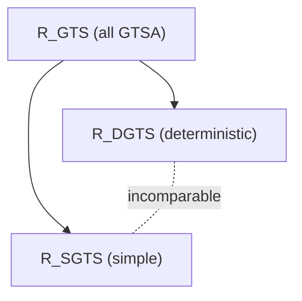

[[book-guidelines|↩ Back to guidelines]]

## Why you'd want an automaton that isn't a language acceptor

Every automaton you've seen so far in this book answers one question: "is this term in my language?" A bottom-up NFTA (Chapter 1) partitions $T(F)$ into accept/reject. A GTT (Chapter 3) does the same for pairs. But there's a different question that shows up constantly in program analysis, and it doesn't fit that mold at all: **"is this *assignment of sets to variables* a valid solution to a system of constraints?"**

Concretely: you're doing type inference, and you've decided (following Set-Based Analysis) to represent a program variable's possible values as a set of terms — a "type" is just a set. You write down constraints like

$$
\mathrm{Nat} = 0 \cup s(\mathrm{Nat}), \qquad \mathrm{List} = \mathrm{cons}(\mathrm{Nat}, \mathrm{List}) \cup \mathrm{nil}, \qquad \mathrm{List}^+ \subseteq \mathrm{List}, \qquad \mathrm{car}(\mathrm{List}^+) \subseteq s(\mathrm{Nat})
$$

and you want to know: does this system have a solution — an actual assignment of concrete sets of terms to $\mathrm{Nat}$, $\mathrm{List}$, $\mathrm{List}^+$ that makes every inclusion true? If a solution exists, is there always a "nice" (regular) one? Is the least solution decidable? These are exactly the questions your refinement-type checker will ask about its own inference constraints, just dressed in the vocabulary of 1980s–90s type-inference research (Reynolds, Mishra, Aiken–Wimmers, Heintze).

**[[Automata-with-Constraints#What breaks|What breaks]] if you try to answer this with an ordinary tree automaton:** an ordinary automaton accepts or rejects a *single term*. A solution to a set-constraint system is an *n*-tuple of (possibly infinite) sets of terms. You need a machine whose "language" is a set of *valuations* — a set of ways to color the whole term universe with truth values — not a set of terms. That's a fundamentally different acceptor shape, and that's exactly what this chapter builds: the **Generalized Tree Set Automaton (GTSA)**.

## From "recognize a language" to "classify by range"

**Generalized tree set.** Fix a ranked alphabet $F$ and a finite set of labels $E$. A **generalized tree set (GTS)** is simply a total function $g : T(F) \to E$ — it labels *every* term in the (typically infinite) universe $T(F)$ with one of finitely many labels. When $E = \{0,1\}^n$, a GTS is exactly an $n$-tuple of tree languages $(L_1, \ldots, L_n)$, with $g(t)_i = 1 \iff t \in L_i$. So "a GTS" is just a packaging of "an $n$-tuple of subsets of $T(F)$" — which is exactly the shape of a solution to a set-constraint system over $n$ variables.

**Why not just intersect $n$ ordinary tree automata, one per $L_i$?** Because you don't want to recognize *one specific* tuple — you want to recognize the *set of all tuples that satisfy some constraint system*. The automaton's job shifts from "accept this term" to "accept this entire infinite labeling of the universe." That's a language over GTSs, not over terms — call it $\mathcal{G}_E \subseteq (T(F) \to E)$.

**The GTSA definition, and the pivot: acceptance via range, not via final states.** A GTSA is a triple $A = (Q, \Delta, \Omega)$: states $Q$, a transition relation $\Delta \subseteq \bigcup_p Q^p \times F_p \times E \times Q$, and — this is the new ingredient — a set $\Omega \subseteq 2^Q$ of *accepting sets of states*. A **run** on a GTS $g$ is a map $r: T(F) \to Q$ respecting the transitions:
$$
(r(t_1), \ldots, r(t_p), f, g(f(t_1,\ldots,t_p)), r(f(t_1,\ldots,t_p))) \in \Delta.
$$
The run is **successful** if its *range* — the set of all states it actually uses, $r(T(F))$ — belongs to $\Omega$. Note carefully what changed from Chapter 1: there's no designated "root" to check against $Q_f$, because there's no root — $T(F)$ is infinite, every term is simultaneously a "leaf" (if it's a constant) and buried arbitrarily deep inside larger terms. The only thing you *can* ask about an infinite run is a global property of the set of states it touches. $\Omega$ is exactly that global property, made checkable.

**What breaks without an acceptance condition at all — i.e., why you can't just always accept.** If every run were automatically successful, $\Omega = 2^Q$, you could never express "some state must be visited somewhere" — you could never assert non-emptiness of an implicit set, and you'd lose the ability to model constraints like $Y \not\subseteq \bot$ (Section 5.4's example) that say "some witness exists." $\Omega$ is precisely the mechanism for smuggling existential ("this must happen somewhere in the infinite run") content into an otherwise purely local, per-node transition system.

```rust
// A GTSA in the E = {0,1}^n reading: states classify terms, Ω constrains
// which sets of states a run is allowed to actually use.
struct Gtsa<F, const N: usize> {
    states: Vec<StateId>,
    // Δ: (children states, symbol, label ∈ {0,1}^N) -> parent state
    delta: HashMap<(Vec<StateId>, F, [bool; N]), StateId>,
    omega: Vec<HashSet<StateId>>, // accepting sets of states
}
```

A finite fragment (a finite, subterm-closed set of terms) is all you ever *compute* with in practice — but $\Omega$'s condition is a property of the *entire infinite run*, which is why the decidability results below (Section 5.3.2) need real proof machinery rather than "just run the automaton and see."

## The four automaton flavors, and what each buys you

- **Deterministic**: at most one target state per $(q_1,\ldots,q_p, f, l)$ tuple — so at most one run per GTS, but many GTSs can still be accepted (Example 5.2.1.2: an automaton for "any subset of Lisp-like lists of naturals").
- **Strongly deterministic**: at most one target state *and label* per $(q_1,\ldots,q_p,f)$ — so the automaton, run bottom-up on the term structure alone, determines *both* the run and the unique GTS it's compatible with. $L(A)$ is then always a singleton (Example 5.2.1.1: the one-and-only characteristic function of "Lisp-lists of naturals").
- **Complete**: every tuple has *at least* one applicable rule (always achievable without changing the language, Proposition 5.3.2(a) — add a trap state).
- **Simple**: $\Omega$ is subset-closed ($\omega \in \Omega \Rightarrow$ every subset of $\omega$ is in $\Omega$ too). This is the crucial one to internalize: a simple GTSA can never force a state to be *used somewhere* — it can only forbid states, never mandate their appearance. Concretely, if $\Omega = 2^Q$ (trivially subset-closed), *every* run succeeds; you get pure "local consistency," no existential content.

**Why this maps directly onto positive vs. general set constraints:** a positive constraint system ($e \subseteq e'$ only, no negation/complement) never needs to assert "this set is non-empty" as a stand-alone fact — non-emptiness there is always a *consequence* of the inclusions, checkable locally. A general system with negation can state $Y \not\subseteq \bot$ directly, which *is* a bare non-emptiness assertion — and Example 5.2.3 proves formally that no simple GTSA can recognize "$L \neq \emptyset$." This is the same design lesson as topic 8's constrained automata: **restricting the acceptance mechanism (subset-closed $\Omega$) is exactly what buys you the easy, straightforward emptiness algorithm** (Theorem 5.3.7's simple case is a one-line fixed-point check), while the unrestricted mechanism needs the harder, unshown general proof. Tractability is bought by throwing away exactly the expressive power you don't need for the constraint fragment at hand.

## The strict hierarchy: $\mathcal{R}_{SGTS}, \mathcal{R}_{DGTS} \subsetneq \mathcal{R}_{GTS}$, and $\mathcal{R}_{DGTS} \not\subseteq \mathcal{R}_{SGTS}$, $\mathcal{R}_{SGTS}\not\subseteq \mathcal{R}_{DGTS}$

Three classes: $\mathcal{R}_{GTS}$ (recognized by *some* GTSA), $\mathcal{R}_{DGTS}$ (deterministic), $\mathcal{R}_{SGTS}$ (simple). The book proves these are genuinely incomparable in the deterministic/simple direction:

- **$\mathcal{R}_{DGTS} \not\subseteq \mathcal{R}_{SGTS}$** (Example 5.2.3): the language $\{L \mid L \neq \emptyset\}$ is trivially deterministic (one state transition per input) but, as just argued, no simple automaton can express bare non-emptiness — a pumping-style argument on longer and longer witnesses $f^i(a)$ forces a "loop" that a simple automaton, being subset-closed, can't help but also accept the empty case.
- **$\mathcal{R}_{SGTS} \not\subseteq \mathcal{R}_{DGTS}$** (Example 5.2.4): the language $\{L \mid \forall t.\, f(t)\in L \Leftrightarrow h(t) \notin L\}$ needs the *nondeterministic* freedom to "guess" which disjunct of the biconditional it's in.



Closure-wise: $\mathcal{R}_{GTS}$ and $\mathcal{R}_{SGTS}$ are closed under union, intersection, projection, cylindrification (Proposition 5.3.1, Corollary 5.3.4 — constructions that are near-verbatim liftings of Chapter 1's product/projection arguments, just replacing "final states" bookkeeping with "$\Omega$" bookkeeping). $\mathcal{R}_{DGTS}$ is additionally closed under complementation (flip $\Omega \to 2^Q \setminus \Omega$ on a complete deterministic automaton) — but **the full class $\mathcal{R}_{GTS}$ is not closed under complementation** (Proposition 5.3.2(c), by a genuine counting/pigeonhole argument on the automaton's state count vs. an adversarially long witness term), and **nondeterminism cannot be eliminated** for GTSA in general (an immediate corollary: if you could always determinize, you could always complement via (b), contradicting (c)).

## Regularity: when a GTS is finitely describable

A generic GTS is just an arbitrary function on an infinite domain — not finitely representable at all. **Regular** GTSs are the tractable subclass: $g$ is regular if $g = \beta \circ \alpha$ for some finite-range, context-closed classifier $\alpha : T(F) \to R$ and $\beta: R \to E$ — exactly the Myhill–Nerode-style finite-index congruence from Chapter 1, generalized from Boolean membership to an $E$-valued labeling. When $E=\{0,1\}^n$, regular GTSs are precisely $n$-tuples of regular tree languages.

The two structural theorems that make the rest of the chapter work:

- **Proposition 5.2.6/5.2.7 — regular witnesses always exist.** If a GTSA accepts *any* regular GTS, it accepts one via a *regular run* too; and — the one used constantly downstream — **a non-empty recognizable set of GTSs always contains at least one regular member.** This is why you never have to reason about the full space of (possibly wild, non-regular) solutions to decide emptiness: **you only ever need to search over a finite object** (a bounded-size subterm-closed tree fragment), because *if* a solution exists, a "small," finitely-describable one is guaranteed to exist too.

This is the answer to the chapter's second Key Question: the whole emptiness/decidability toolkit works precisely *because* Proposition 5.2.7 lets you replace "does some (possibly infinite, non-regular) solution exist" with "does some *finite witness of bounded size* exist" — you never have to construct or reason about a non-regular member directly; its mere possible existence is irrelevant once you know *a* regular one exists whenever *any* one does.

## Deciding emptiness: local for simple automata, global (and harder) in general

For **simple** GTSAs, emptiness collapses to a satisfying-fixed-point check with no reference to the infinite run at all:
$$
\mathrm{COND}(\omega): \quad \forall p\, \forall f\in F_p\, \forall q_1,\ldots,q_p\in\omega\, \exists q\in\omega.\; (q_1,\ldots,q_p,f,q)\in\Delta
$$
Some $\omega\subseteq Q$ satisfies $\mathrm{COND}(\omega)$ iff a run exists whose range is a subset of $\omega$ — and since simple $\Omega$ is subset-closed, "some subset of $\omega$ is accepting" is equivalent to "$\omega$ itself, if reachable, is fine." Checking $\mathrm{COND}$ over all $2^{|Q|}$ subsets is a brute-force fixed point, no witness-term reasoning needed.

For the **general** case, this doesn't work — you need $r(T(F))$ to equal *exactly* some $\omega\in\Omega$, not merely lie inside one, which is a genuine reachability-with-exact-range problem. The proof (not reproduced in the book) shows a polynomial bound $B(A)$ (degree-4 polynomial in $|Q|$, Lemma 5.3.8) on how large a witness subterm-closed fragment you ever need to check — which is exactly the "small witness always suffices" idea from Proposition 5.2.7, made quantitative. This yields:

> **Theorem 5.3.7 / Proposition 5.3.9.** Emptiness is decidable for GTSA in general, and **NP-complete** for the simple case.

The NP-hardness direction (Proposition 5.3.9's proof) is a clean reduction from Boolean satisfiability: build a two-state automaton over the term-syntax of Boolean expressions ($\neg,\wedge,\vee$ as function symbols) whose accepted GTSs are exactly "the language of expressions true under some fixed valuation $v$," then intersect with a singleton-automaton for a specific target expression $e$ — emptiness of the intersection is exactly unsatisfiability of $e$. If you've ever wondered why "does this automaton accept anything" so often turns out to be exactly SAT in disguise: this is a textbook instance, worth remembering the next time your CSP kernel's own emptiness/feasibility checks start looking suspiciously SAT-shaped.

From emptiness plus closure, everything else falls out almost for free: **inclusion and equivalence** for deterministic GTSA (Proposition 5.3.10, via complement+intersect+empty-check — literally Chapter 1's playbook, transplanted), **singleton-ness** (Proposition 5.3.11), **membership of a specific regular tuple** (Proposition 5.3.12), and **fixed-cardinality / finiteness** properties (Proposition 5.3.13, relying on the same bounded-witness lemma).

## The payoff: automata that *are* set-constraint solvers

**Proposition 5.4.1** is the chapter's central engineering result: given *any* system of set constraints $SC$ over $n$ variables (arbitrary Boolean combinations of $\subseteq$/$\not\subseteq$ over expressions built from $\cup,\cap,\sim,\top,\bot$ and function symbols — no projection operators), there's a **deterministic** GTSA $A$ over $\{0,1\}^n$ (simple, if $SC$ is positive-only) with $L(A) = \mathrm{SOL}(SC)$ exactly.

The construction is genuinely elegant: states of $A$ are *truth-valuations* $\varphi$ over the finite set $E(SC)$ of subexpressions occurring in $SC$ (one Boolean per subexpression, tracking "is this subexpression's semantic value 1 at the current position"). A transition rule fires when a symbol's subexpression-truth-table is internally consistent with its children's ($\varphi(f(e_1,\ldots,e_p)) = 1 \iff$ every $\varphi_i(e_i)=1$). $\Omega$ then just asks: "in *every* state visited (positive constraints) / *some* state visited (negative constraints), does $\varphi$ make $SC$ itself true?" — literally encoding the constraint's truth value as a property of which valuation-states get touched.

```rust
// Each GTSA state IS a valuation of every subexpression of SC.
// Ω checks "is SC itself true under (every | some) visited valuation".
struct SubexprValuation {
    truth: HashMap<SetExprId, bool>,
}
```

Once $SOL(SC)$ is *itself* an object in $\mathcal{R}_{DGTS}$, every decision result from Section 5.3 transfers immediately (this is the whole point of building the automaton machinery first): **satisfiability** (emptiness), **existence of a regular solution** (Proposition 5.2.7 — always true, for free), **inclusion/equivalence between two constraint systems' solution sets** (Proposition 5.3.10), **uniqueness of solution** (Proposition 5.3.11), **fixed-cardinality solution existence** (Proposition 5.3.13), and **regular-tuple membership** (Proposition 5.3.12) are all decidable, with essentially no extra proof work — you already paid the proof cost once, at the automaton level.

**Proposition 5.4.2 — least solutions of positive systems.** For positive-only $SC$, the book shows decidability of *least-solution existence* w.r.t. the pointwise inclusion order on GTSs, by restricting the automaton to each candidate reachable state-set $\omega$, greedily picking the $\preceq$-minimal-labeled rule at each step (well-defined precisely because $A$ is deterministic — the proof leans on determinism exactly the way Chapter 1 leaned on it for unique minimization), and then checking the resulting candidate against every other reachable $\omega$ via automaton-equivalence. This is a genuine **fixed-point computation over a lattice of GTS values**, computed by *automaton restriction and comparison* rather than explicit iteration — a different (automata-driven) route to the same kind of least-fixed-point object your abstract-interpretation kernel will compute by literal Kleene iteration over an abstract domain.

## Where this leads

**Within the chapter's own arc:** this is somewhat self-contained relative to Chapters 3–4 — it doesn't build on GTT or WSkS directly, though the automata-as-decision-procedure *pattern* (build automaton whose language is exactly your solution set, then read off decidability from closure properties) is the same one Chapter 3 used for WSkS and rewriting theories. It's also a different way of using automata than Chapter 6's transducers, which compute *outputs* rather than classify *sets* — worth noticing as yet another automaton "mode" beyond plain acceptance.

**For your standing project:** this chapter is a direct, historical ancestor of the constraint-based type inference / refinement-type inference you're building toward. Set-Based Analysis is literally "represent a variable's possible values as a set, write inclusion constraints between sets, solve." The specific mechanism — encode a system of set constraints as an automaton whose accepted objects are exactly the solutions, then get satisfiability/uniqueness/least-solution-existence "for free" from automaton closure properties — is precisely the shape you want your CSP/abstract-interpretation kernel to take when it represents abstract domains "like automata grammars (DFA)": here is a fully worked, book-length example of exactly that idea, complete with the sharp lesson (simple vs. general GTSA) that **how much expressiveness you allow in the acceptance condition directly trades off against how easy your decision procedures are** — the same structural-tractability trade-off as topic 8's constrained automata, and the same "restrict to a tractable fragment" instinct behind Miller pattern unification. And Proposition 5.4.2's least-solution computation is a genuine (if automata-flavored) instance of the Galois-connection/fixed-point machinery your abstract interpreter will need for invariant generation — worth keeping as a second worked example alongside Chapter 2's regular-equation-system fixed points.
