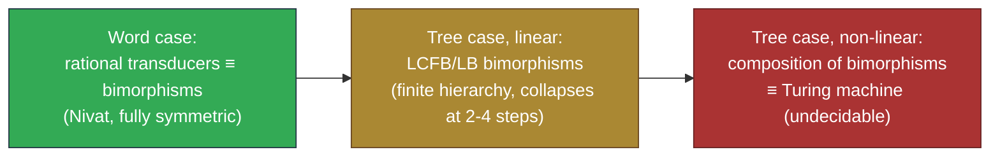

[[book-guidelines|↩ Back to guidelines]]

## Why a tree automaton isn't enough

Everything up through Chapter 5 answers yes/no questions about trees, or (for GTT/WSkS/GTSA) about relations *between* trees viewed as a single coded object. None of that machinery actually *produces* a new tree from an old one. But that's precisely what a compiler does at every pass: parse a program into a syntax tree, then repeatedly rewrite that tree into another tree — a desugared form, an attributed form, a lower-level form — until you can print out target code. **A tree transducer is a tree automaton with an output tape**: instead of accepting or rejecting, each transition also *emits* a piece of output tree, and running the transducer to completion assembles one output tree per accepted input tree. This chapter's whole arc is: the *word* case (finite-state string transducers) behaves beautifully — closure properties, a clean automaton/homomorphism duality (Nivat's bimorphism theorem) — and the reader's first instinct is that lifting this to trees should be routine. It isn't. Trees let you *copy* a subtree and then process the copies independently, and that one capability, combined with nondeterminism, is enough to break almost every closure property you'd want. This chapter is really a chapter about *why* that happens and which restrictions buy the properties back.

**If you're building a compiler**, don't read this as abstract automata theory: every one of your compiler's passes — desugaring, elaboration, monomorphization, lowering to some IR — *is* a tree transduction, and the questions this chapter asks (can I compose two passes into one? does determinism survive composition? is the set of well-formed outputs itself checkable by a plain tree automaton?) are questions you will ask about your own pass pipeline, usually the hard way, unless you've internalized why they're hard in general.

## The word case: the well-behaved baseline

A **rational transducer** $R = (Q, F, F', Q_i, Q_f, \Delta)$ is a finite word automaton where each transition also writes output: a rule $f(q) \to q'(m)$ means "in state $q$, reading input symbol $f$, go to $q'$ and emit the word $m$" (with $\epsilon$-rules allowed, so you can read nothing or emit nothing). The relation it induces, $T_R \subseteq F^* \times F'^*$, is a **rational transduction**. This is exactly a Mealy-machine-with-output, generalized so the output can be a whole word per step rather than one symbol.

Rational transductions have all the closure properties you'd hope for: closed under union (not intersection — Exercise 6.2's canonical counterexample pairs $(a^nb^p, a^n)$ with $(a^nb^p, a^p)$, and intersecting the two relations would let you check $n = p$, which a finite-state machine reading left-to-right genuinely cannot do), closed under composition, and — crucially — regular and context-free *languages* are preserved under transduction (translate a regular/CF language through a rational transducer, get back a regular/CF language). Equivalence of general rational transductions is undecidable (Exercise 6.3 reduces the Post Correspondence Problem to it), but *decidable* for deterministic ones (a pumping argument bounds how far two deterministic transducers' outputs can diverge before you can conclude they're inequivalent).

**The homomorphic view — Nivat's Bimorphism Theorem.** Here's the result that makes the word case genuinely illuminating rather than just "another automaton model." A **bimorphism** $B = (\Phi, L, \Psi)$ is a recognizable "control" language $L$ over some abstract alphabet, plus two homomorphisms $\Phi, \Psi$ that read the *same* abstract letter and independently produce the input word and the output word: $B = \{(\Phi(t), \Psi(t)) \mid t \in L\}$. Nivat's theorem (6.2.4) says: **rational transducers and bimorphisms define exactly the same class of relations**, in both directions, preserving $\epsilon$-freeness.

$$
L \ni t \quad \xrightarrow{\ \Phi\ } \quad \Phi(t) \in F^* \qquad\qquad L \ni t \quad \xrightarrow{\ \Psi\ } \quad \Psi(t) \in F'^*
$$

Read this as: there is a single, language-independent "control structure" $L$ — think of it as the sequence of internal decisions the transducer makes — and *both* the input and the output are just different homomorphic readings of that same control structure. $\Phi^{-1}$ is doing the job of a lexical analyzer (turning concrete input symbols into abstract control symbols), $\Psi$ is doing the job of a code generator (turning abstract control symbols into concrete output), and $L$ is the shared grammatical skeleton — exactly the shape of "one parse tree, two different pretty-printers" (the book's own example: one automaton $L$ generating both an English and a French rendering of the same assembly-language program, Figure 6.4). **This is the cleanest available intuition for what a transducer "is": not a machine that transforms input into output, but two projections of one underlying structure.**

```rust
// A rational transducer as a labeled-transition system with output.
struct Transducer<Q, F, Out> {
    initial: Vec<Q>,
    final_states: Vec<Q>,
    // f(q) -> q'(m): reading f in state q, go to q', emit m
    rules: Vec<(Option<F>, Q, Q, Vec<Out>)>,
}
```

**[[Automata-with-Constraints#What breaks|What breaks]] without the bimorphism view:** if you only ever think of a transducer as a machine, you're stuck reasoning about *simulations* every time you want to prove two transducers equivalent or compose two of them. The bimorphism view turns "are these two transducers equivalent" into "do $\Psi_1$ and $\Psi_2$ agree pointwise on the shared control language $L$" — a much more tractable, structural question. That reframing — replace an operational equivalence with a structural, language-based one — is a move you'll want again when reasoning about compiler-pass equivalence.

## From words to trees: a worked compiler example

Section 6.3's toy compiler is worth internalizing directly, because it's the cleanest possible illustration of the two fundamental tree-transducer shapes.

Take arithmetic expressions like `(a+b)×c`. First, a transducer $A$ turns a concrete syntactical parse tree (built by an LL(1) grammar, so it has extra structure like explicit $\epsilon$-markers for "no more multiplication here") into a clean **abstract tree** like $\times(+(a,b), c)$. $A$ works *frontier-to-root* — it reads its input's leaves first, and only decides what to output at a node once it has already produced output for all of that node's children. That's a **bottom-up tree transducer**.

Then a second transducer $R$ walks that abstract tree bottom-up and *decorates* it with register numbers — how many machine registers are needed to evaluate each subexpression (this is literally the "Sethi–Ullman" register-allocation computation, if you've ever implemented one). $R$'s rules look like:

$$
+(q_i(x), q_j(y)) \to q_i({+}_i(x,y)) \quad \text{if } i > j
$$

i.e. "if the left subtree needs $i$ registers and the right needs $j < i$, the whole expression still needs $i$ registers, and the root gets relabeled with that count." This is a **synthesized attribute** in the classic attribute-grammar sense: a value computed from a node's children and attached to that node, flowing *up*.

Finally, top-down transducers $T_1, T_2$ turn the decorated tree into actual instruction sequences (`LOAD`, `STORE`, `ADD`, ...) for two different target machines. These work *root-to-frontier*: a rule like

$$
q({+}_i(x,y)) \to \diamond(q(x), \mathrm{STORE}_i, q(y), \mathrm{ADD}_i, \mathrm{STORE}_i)
$$

says "before I even know what $x$ and $y$ expand into, I already know the *shape* of the output around them" — the state $q$ gets pushed down into the children, carrying along contextual information (here, the register number $i$) that the children's own processing depends on. That's an **inherited attribute**: information flowing *down* from parent to child, computed before the children are visited.

```rust
enum AbstractTree { Leaf(char), Bin(char, Box<AbstractTree>, Box<AbstractTree>) }

// Bottom-up: synthesize register count from children (Sethi-Ullman style).
fn registers_needed(t: &AbstractTree) -> u32 {
    match t {
        AbstractTree::Leaf(_) => 0,
        AbstractTree::Bin(_, l, r) => {
            let (rl, rr) = (registers_needed(l), registers_needed(r));
            if rl == rr { rl + 1 } else { rl.max(rr) }
        }
    }
}

// Top-down: emit code, *inheriting* a target register from the caller.
fn codegen(t: &AbstractTree, target_reg: u32) -> Vec<String> {
    match t {
        AbstractTree::Leaf(c) => vec![format!("LOAD {c}")],
        AbstractTree::Bin(op, l, r) => {
            let mut code = codegen(l, target_reg);
            code.push(format!("STORE {target_reg}"));
            code.extend(codegen(r, target_reg + 1)); // context pushed down
            code.push(format!("{op}{target_reg}"));
            code
        }
    }
}
```

**What breaks without this bottom-up/top-down distinction:** if you tried to write a single-pass transducer that both synthesizes register counts *and* emits code depending on them, you'd need to know a subtree's register count *before* visiting it (for code layout) while only being able to compute that count *from* visiting it (bottom-up). Splitting into two composed transducers — first a bottom-up decoration pass, then a top-down generation pass — is exactly how real multi-pass compilers avoid this chicken-and-egg problem, and Section 6.3's whole point is that **composition of transducers models succession of compiler passes**: if the relevant transducer classes are closed under composition, you get a genuine, checkable way to fuse passes and reduce compiler overhead — which is exactly what §6.4 investigates, and exactly where things get messy.

## Formal definitions: NUTT and NDTT

A **bottom-up tree transducer (NUTT)** $U = (Q, F, F', Q_f, \Delta)$ generalizes an NFTA's rules $f(q_1(x_1),\dots,q_n(x_n)) \to q(f(x_1,\dots,x_n))$ by letting the right-hand side be *any* term over the output alphabet and the bound variables: $f(q_1(x_1),\dots,q_n(x_n)) \to q(u)$ with $u \in T(F', X_n)$, plus optional $\epsilon$-rules $q(x_1) \to q'(u)$. Running $U$ bottom-up on a ground input term produces (possibly several, if nondeterministic) output terms; the induced relation is $U = \{(t,t') \mid t \to^*_U q(t'), q \in Q_f\}$.

A transducer is:
- **$\epsilon$-free** — no $\epsilon$-rules,
- **linear** — no variable appears twice in a right-hand side (so no implicit copying),
- **non-erasing** — every variable's subtree contributes *something* to the output (nothing silently vanishes),
- **complete** (non-deleting) — every input variable $x_i$ occurs at least once in $u$ (dual to non-erasing, from the input side — no input subtree is thrown away unused),
- **deterministic (DUTT)** — $\epsilon$-free with no two rules sharing a left-hand side.

A **top-down tree transducer (NDTT)** $D = (Q, F, F', Q_i, \Delta)$ is the mirror image: rules $q(f(x_1,\dots,x_n)) \to u[q_1(x_{i_1}),\dots,q_p(x_{i_p})]$ push states down into (possibly repeated, possibly reordered, possibly dropped) children.

Two toy transducers make the asymmetry concrete:

- $U_1$ (bottom-up, non-linear): on reading $f$, it can *nondeterministically* relabel the child as $f$ or $f'$, and once it reaches the top it *copies* the whole processed result: $f(q(x)) \to q'(g(x,x))$. This is **"Nprocess-and-copy"** — nondeterministic decisions happen first, then the (already-decided) result gets duplicated. On input $f(f(f(a)))$, $U_1$ can produce $g(ffa,ffa)$, $g(ff'a,ff'a)$, $g(f'fa,f'fa)$, $g(f'f'a,f'f'a)$ — *never* a mismatched pair like $g(ffa, f'f'a)$, because the two copies are literally the same already-processed subtree.
- $D_1$ (top-down, non-linear): $q(f(x)) \to g(q'(x), q'(x))$ *copies the unprocessed input first*, then each copy is independently, nondeterministically relabeled: $q'(f(x)) \to f(q'(x)) \mid f'(q'(x))$. This is **"copy-and-Nprocess"**. On the same input, $D_1$ *can* produce mismatched pairs like $g(ffa, f'f'a)$, because the two copies are processed completely independently.

That's the entire structural difference in one sentence: **bottom-up transducers decide-then-duplicate; top-down transducers duplicate-then-decide independently.** Once you see it that way, the Comparison Theorem stops being a surprising fact about automata and becomes an immediate consequence:

> **Theorem 6.4.3 (Comparison Theorem).** No top-down transducer is equivalent to $U_1$ or $U_2$; no bottom-up transducer is equivalent to $D_1$. Any *linear* top-down transducer is equivalent to a linear bottom-up one; in the linear-complete case the two classes coincide.

**This directly answers Key Question 1.** The two classes are structurally incomparable in general because they can express *opposite* copy/decide orderings that the other model simply cannot simulate: a bottom-up transducer cannot produce two independently-decided copies (once processed, a subterm is what it is — there's no way to "re-fork" a decision after the fact), and a top-down transducer cannot make a nondeterministic decision and only *then* duplicate the already-decided result (by the time it would want to copy, it has already committed to pushing a *single* state down each branch). **Linearity erases the distinction** precisely because linearity forbids copying altogether — with no duplication in play, "decide then copy" and "copy then decide" are vacuously the same operation (there's only ever one copy), so the mechanism that separates the two models simply isn't exercised.

## The infinite hierarchy, and why it collapses under restriction

Since neither NUTT nor NDTT is closed under composition (composing two nondeterministic-copying transducers can, in general, produce a transformation neither class can express directly), the natural question is whether *iterating* composition keeps generating genuinely new classes forever.

> **Theorem 6.4.4 (Hierarchy Theorem).** Composing NUTT yields a genuinely infinite hierarchy. Any composition of $n$ NUTT can be simulated by a composition of $n+1$ NDTT, and vice versa.

**This is Key Question 2's answer, and it's worth being precise about why it needs *both* ingredients.** Nondeterminism alone (with linearity kept) doesn't drive the hierarchy — Theorem 6.4.5 shows linear bottom-up transductions are already closed under composition, full stop, no hierarchy at all. Non-linearity alone (with determinism kept) doesn't either — deterministic bottom-up transductions are also closed under composition. It's specifically the *combination* — copying (which lets a subresult be duplicated) *plus* nondeterminism applied on either side of that duplication (which lets the duplicated copies diverge, or lets which-branch-gets-duplicated itself be a choice) — that composition can keep amplifying without bound, because each additional composed transducer gets to introduce a *fresh* round of copy-then-diverge (or diverge-then-copy) that the previous $n$ transducers hadn't yet committed to. **Practical compiler passes typically avoid triggering this** because real compiler passes are overwhelmingly deterministic (a pass either produces one definite lowering of a construct or it's a bug) and mostly linear-ish in the relevant sense (attribute decoration duplicates *values*, not open-ended nondeterministic choices) — Section 6.3's own passes ($A$, $R$, $T_1$) are exactly linear-deterministic or "just barely" non-linear in a controlled way ($T_2$), which is why composing a handful of real compiler passes is unremarkable in practice even though the *general* theory says composition can blow up arbitrarily.

> **Theorem 6.4.5 (Composition Theorem).** Linear bottom-up transductions are closed under composition. Deterministic bottom-up transductions are closed under composition. Any composition of deterministic top-down transductions equals a deterministic complete top-down transduction composed with one linear homomorphism.

This is your actual design guidance if you're building a multi-pass pipeline you want to reason about compositionally: **keep passes linear or deterministic (ideally both) and composition is provably safe; drop both and you have no such guarantee, in general.**

One structural fact carries over cleanly regardless of these complications:

> **Theorem 6.4.6 (Recognizability Theorem).** The domain of any tree transducer is a recognizable tree language. The image of a recognizable language under a *linear* transducer is recognizable.

So "which inputs does this pass actually handle" is always automaton-checkable — a genuinely useful invariant for a compiler pass: you can always build a plain tree automaton characterizing exactly the well-formed inputs a given pass will accept, regardless of how gnarly the pass's internal logic is.

**Complexity** follows the same "top-down is the hard direction" pattern seen throughout the book: bottom-up transducer emptiness is essentially tree-automaton emptiness (**PTIME-complete**), but top-down transducer emptiness is essentially *alternating* tree automaton emptiness (**DEXPTIME-complete**) — nondeterministic top-down copying is powerful enough to simulate alternation's conjunctive branching. Equivalence is undecidable in general but decidable for **$k$-valued** transducers (Theorem 6.4.7/6.4.8) — a transducer is $k$-valued if no input has more than $k$ distinct outputs, so deterministic transducers are just the $k=1$ case.

## Homomorphisms and bimorphisms: the symmetry that trees break

A **delabeling** is a linear, complete, symbol-to-symbol homomorphism — it can only rename labels and reorder subtrees, never duplicate or discard. This gives the tree analogue of Nivat's theorem, though weaker:

> **Theorem 6.5.1.** Bottom-up tree transductions $\equiv$ bimorphisms $(\Phi, L, \Psi)$ where $\Phi$ is specifically a delabeling.

**This answers Key Question 3.** Nivat's *word*-case theorem has a clean symmetry: the inverse of a rational transduction is itself a rational transduction (just swap the roles of $\Phi$ and $\Psi$), because homomorphisms on words are symmetric in expressive power. **That symmetry is exactly what's lost for trees**, and the reason is precisely non-linearity: a (bottom-up) tree transducer can *copy* an input subtree and process the copies independently ("process-and-copy"), but it can never *check* that two subtrees of its input are equal — testing subtree equality is exactly the kind of "constraint between siblings" that Chapter 1 showed ordinary tree automata can't do either (recall $\{f(t,t) \mid t \in T(F)\}$ isn't recognizable), and it's *why Chapter 4's constrained automata had to exist at all*. So going from a transducer to its inverse relation swaps "can copy, can't check equality" for "can check equality (since the inverse direction needs to verify the copies agree), can't copy" — a fundamentally different, non-symmetric pair of powers, not a mirror image of the same power. Composing two arbitrary bimorphisms (to try to recover full symmetry) turns out to be powerful enough to simulate a Turing machine — clearly hopeless as a decidable object.

Restricting to the *linear* case salvages a genuine, if intricate, structural result:

> **Theorem 6.5.2 (Tree Bimorphisms).** The class **LCFB** (linear, complete, $\epsilon$-free bimorphisms) satisfies $\mathrm{LCFB} \subset \mathrm{LCFB}^2 = \mathrm{LCFB}^3$ (composing twice already reaches the ceiling). The class **LB** (linear bimorphisms) satisfies $\mathrm{LB} \subset \mathrm{LB}^2 \subset \mathrm{LB}^3 \subset \mathrm{LB}^4 = \mathrm{LB}^5$.

So even in the well-behaved linear case, composition strictly grows the expressible class for a few steps before collapsing — a genuine, finite-but-nontrivial hierarchy, in between "no hierarchy at all" (deterministic/linear bottom-up transductions, Theorem 6.4.5) and "infinite hierarchy" (the fully general non-linear nondeterministic case, Theorem 6.4.4).



## Where this leads

Within the book, this chapter sits adjacent to Chapter 3's Ground Tree Transducers (GTT) — note the name isn't a coincidence: GTT are specifically the *pairs of automata sharing synchronization states* view of a *relation*, whereas this chapter's transducers are the *input-drives-output-construction* view of a *function-like* transformation; they're related but answer different questions (GTT is optimized for closure under composition/transitive closure as a *relation*, this chapter's transducers are optimized for actually *computing* an output tree). The [[Alternating-Tree-Automata|alternating tree automata]] of Chapter 7 will reappear here implicitly: top-down transducer emptiness reduces to *alternating* automaton emptiness, which is exactly why it's DEXPTIME-complete rather than PTIME-complete like the bottom-up case.

For your compiler project, this chapter is close to load-bearing rather than merely analogous. **The bottom-up/top-down, synthesized/inherited-attribute distinction *is* the distinction between inferring a type bottom-up from subexpressions (synthesis) and checking an expression against an expected type pushed down from context (checking)** in bidirectional typing — an inherited attribute flowing top-down into a subterm during codegen is structurally the same shape as a typing *context* $\Gamma$ (or an expected type, in bidirectional checking mode) being threaded down into a subexpression before it's elaborated, while a synthesized attribute flowing bottom-up is the same shape as a *synthesized* type flowing back up out of an elaborated subexpression. Concretely: if your elaborator's `infer` mode computes a type from an expression's structure (no external input needed beyond the expression itself), that's a bottom-up/synthesized-attribute pass; if your `check` mode takes an expected type as an argument before recursing into subexpressions, that's exactly a top-down/inherited-attribute pass, complete with the same reason the two aren't freely interchangeable (you can't always turn a checking judgment into an inference judgment, or vice versa, without extra machinery — the same asymmetry Theorem 6.4.3 formalizes for transducers). And the composition results here are the direct theoretical grounding for a very practical compiler-engineering question: *can I safely fuse two of my elaborator's passes into one without accidentally changing behavior* — the answer, per this chapter, is "yes, unconditionally, if both passes are linear or both are deterministic; not guaranteed otherwise," which is exactly the property you'd want to check before merging passes for performance.
