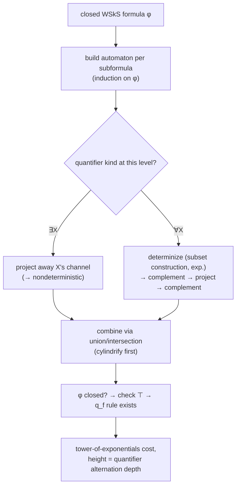

[[book-guidelines|↩ Back to guidelines]]

## Why put a logic on top of an automaton theory at all?

Chapter 1 gave you a machine — a bottom-up tree automaton — that recognizes sets of trees. Section 3.2 (covered in the companion article on [[Automata-on-Tuples-of-Trees|Automata on Tuples of Trees]]) extended that machine to accept *tuples* of trees, i.e. relations. Both of those are still, in spirit, just acceptors: you hand them an object, they say yes or no.

**WSkS** — Weak monadic Second-order logic of $k$ Successors — is the payoff for having built all that machinery: it's a *logic* whose formulas talk about finite sets of tree positions, and its two headline theorems say that this logic is exactly as expressive as tree automata, and therefore *decidable*. That's the real prize. You don't normally get to ask "is this first-order-ish statement about sets true?" and have a machine answer in bounded time — most logics with quantifiers over sets are undecidable or worse. WSkS survives because "sets of positions" turns out to be exactly what a tree automaton's *run* already tracks: which state a position ends up in. Once you see that a "run" is a specific way of coloring positions with a finite palette (states), and a formula-with-second-order-variables is *also* a specific way of coloring positions (with the sets those variables denote), the two notions almost translate themselves.

If your target project is a Rust verifier whose refinement types get checked against Horn-clause-flavored side conditions, this is worth sitting with: WSkS's decidability proof is the cleanest full worked example in the book of the pattern "logic formula → construct me an automaton whose language is exactly the formula's models → decidability of the logic reduces to emptiness of the automaton." That's precisely the shape of a decision procedure for a fragment of your specification language, and the complexity results here (spoiler: brutal) are the honest warning label on how far you can push that idea before it collapses under quantifier alternation.

## The syntax: what can WSkS even say?

**Terms.** Fix $k$. A WSkS *term* is built from the constant $\epsilon$ (the empty position), first-order variables $x, y, z, \dots$, and $k$ unary successor symbols $1, \dots, k$ written in **postfix** notation. So $x11$ means "apply successor-1 twice to $x$," and a term like $\epsilon\,2\,1\,1\,1$ (usually abbreviated $2111$, dropping the leading $\epsilon$) denotes a specific position string.

Under the intended interpretation, terms denote elements of $\{1,\dots,k\}^*$ — exactly the position strings you already know from Chapter 1's $\mathrm{Pos}(t)$. Equality $s=t$ and prefix order $s\le t$ are the atomic relations between them.

**Second-order variables.** Upper-case $X, Y, Z, \dots$ range over *finite* subsets of $\{1,\dots,k\}^*$. The membership atom $t \in X$ is the third atomic formula.

**Formulas.** Built from those three atom kinds with $\land, \lor, \neg, \Rightarrow, \Leftrightarrow$ and quantifiers $\exists x, \forall x$ (first-order — ranging over single positions) and $\exists X, \forall X$ (second-order — ranging over finite sets of positions). "Weak" refers to that finiteness restriction — full $S_kS$ (no "weak") allows infinite sets and needs automata on infinite trees, which the book deliberately steers around; the finite-set restriction is exactly what keeps you inside ordinary (bottom-up, finite-run) tree automata.

The book proves you can always boil this down to a **restricted syntax** with only $\lor, \neg, \exists X$ and atoms $X \subseteq Y$, $\mathrm{Sing}(X)$ (X is a singleton), $X = Yi$ (X and Y are singletons $\{s\}, \{t\}$ with $s = ti$), and $X = \epsilon$ — i.e., you can eliminate first-order variables entirely by treating "the singleton set $\{x\}$" as a stand-in for the variable $x$. This is a genuinely useful trick to internalize: **first-order quantification is just second-order quantification restricted to a definable subclass** (the singletons), so a system that only implements second-order machinery loses no first-order expressiveness. If you've ever wondered why some solvers treat "value" and "singleton set" interchangeably, this is the formal justification.

**[[Automata-with-Constraints#What breaks|What breaks]] without the restricted syntax:** if you tried to build the automaton-per-connective machinery directly on the full syntax, you'd need separate automaton constructions for `=`, `≤`, `∈` atoms *and* for both kinds of quantifiers *and* for six logical connectives — a combinatorial mess. Reducing to four atom shapes and three connectives means you only ever need to build automata for a handful of base cases and three inductive combinators (union, complement, projection). This is the same "minimal complete basis" instinct that makes you implement a term rewriter on $\{\land,\lnot\}$ instead of all of first-order logic's connectives.

## Coding a set of positions as a tree

Here's the pivot move that makes decidability provable. An assignment to $n$ free set variables $X_1,\dots,X_n$ (each a finite subset of $\{1,\dots,k\}^*$) gets encoded as a single finite tree over the alphabet $\{0,1,\bot\}^n$ — one "channel" per variable, so each tree label is an $n$-tuple of $\{0,1,\bot\}$ symbols, one bit per variable at that position:

$$
(S_1,\dots,S_n)^\sim(p) = \alpha_1 \cdots \alpha_n, \quad
\alpha_i = \begin{cases}
1 & p \in S_i \\
0 & p \notin S_i \text{ but some prefix-extension of } p \text{ is in } S_i \\
\bot & \text{otherwise}
\end{cases}
$$

The domain of this coded tree, $\mathrm{Pos}((S_1,\dots,S_n)^\sim)$, is the set of *prefixes* of all elements of all the $S_i$ — a finite prefix-closed set, so it's a genuine finite tree, and positions past that frontier are simply absent (not "labeled $\bot^n$"; there's no node there at all). The $0$-vs-$\bot$ distinction only matters at positions that are actually in the domain: $0$ says "not in $S_i$, but you're still on the path to something that is," $\bot$ says "not in $S_i$, and no descendant of yours is either." This is exactly what lets a bottom-up automaton "know" while walking through the tree whether it should still bother looking further down a branch — the $\bot$ channel is a built-in prefix-frontier marker, sparing the automaton from having to guess when a set's witnesses have "run out" along that path.

**What breaks without this coding:** if you tried to represent a subset of $\{1,\dots,k\}^*$ directly as "a tree with some nodes marked, others not," you'd need an *infinite* tree to leave room for all positions not in the set (since $\{1,\dots,k\}^*$ itself is infinite) — but tree automata in this book only work on *finite* trees. The prefix-closure trick is precisely what compresses a possibly-large but always-finite set into a finite tree: you keep exactly the "scaffolding" positions needed to reach every element, plus nothing else.

## From formula to automaton: the easy direction (Lemma 3.3.4)

**Claim:** if a set $L$ of tuples of finite subsets is WSkS-definable, then its image under the tree-coding, $\tilde L = \{(S_1,\dots,S_n)^\sim \mid (S_1,\dots,S_n)\in L\}$, is in $\mathrm{Rec}$ (recognizable by a tree automaton).

The proof is a structural induction on the defining formula $\varphi$, in restricted syntax, building one automaton $A_\psi$ per subformula $\psi$ such that $A_\psi$ accepts exactly the codings of assignments satisfying $\psi$.

- **Base cases.** For each atomic formula ($\mathrm{Sing}(X)$, $X\subseteq Y$, $X = Yi$, $X=\epsilon$) the book gives an explicit small automaton — literally a handful of states checking, at each position, that the labeling bits are locally consistent (e.g. $\mathrm{Sing}(X)$'s automaton just checks "exactly one position is labeled $1$ on the $X$-channel, and everything below and beside it is $\bot$").
- **Disjunction** $\varphi_1 \lor \varphi_2$: first *cylindrify* both automata up to the union of their free-variable sets (Proposition 3.2.12 — pad each automaton's alphabet with extra "don't care" channels for variables it doesn't mention), then take the union automaton (closed under union by Proposition 3.2.9, exactly Chapter 1's product-then-union closure argument).
- **Negation** $\neg\varphi_1$: complement the automaton for $\varphi_1$ (Theorem 1.3.1 — complete-DFTA complementation from Chapter 1).
- **Existential quantification** $\exists X.\varphi_1$: **project** away $X$'s channel from $A_{\varphi_1}$ (Proposition 3.2.12 again) — this is the automata-theoretic reading of "there exists a witness": nondeterministically guess the missing channel's bits.

**This is the mechanism behind the Key Question about how completeness "encodes an existential quantifier as guessing an accepting run."** Concretely: to decide whether $(S_1,\dots,S_m)$ satisfies some formula built with existential quantifiers over auxiliary sets $Y_{q_1},\dots,Y_{q_l}$ (one per automaton state — see Lemma 3.3.6 below for where these come from), the automaton-side of the equivalence doesn't get told which position lands in which $Y_{q_i}$. Projection is precisely nondeterministic "erase the extra channel and let any consistent labeling of the erased channel count as a witness." So *semantically* an accepting run of the resulting automaton **is** a satisfying assignment to the existentially-quantified state-partition variables — the automaton doesn't compute a run and then check a formula; guessing an accepting run **is** how the automaton "believes" the formula, because nondeterministic transition choices at each position are exactly free choices of which $Y_{q_i}$ that position belongs to. There's no separate "certificate checking" step glued on afterward — the automaton's nondeterminism *is* the existential quantifier, made operational.

## From automaton to formula: the converse (Lemma 3.3.6)

**Claim:** every relation $R$ in $\mathrm{Rec}$ is WSkS-definable.

This is where the "guessing a run" intuition gets made completely explicit, because the proof literally writes down the formula that says "there is an accepting run." Given automaton $A = (Q, F', Q_f, T)$ (here $F' = (F\cup\{\bot\})^n$, the padded alphabet from the coding of $n$-tuples of terms), the formula $\varphi_A$ introduces one existentially-quantified second-order variable $Y_{q_i}$ per state $q_i \in Q$:

$$
\exists Y_{q_1},\dots,\exists Y_{q_l}.\;
\mathrm{Term}(X, X_{f_1},\dots,X_{f_m})
\;\land\; \mathrm{Partition}(X, Y_{q_1},\dots,Y_{q_l})
\;\land\; \bigvee_{q \in Q_f} \epsilon \in Y_q
\;\land\; \forall x.\Bigl(\bigwedge_{f\in F'}\bigwedge_{q\in Q}(x\in X_f \land x\in Y_q) \Rightarrow \bigvee_{f(q_1,\dots,q_s)\to q\in T}\bigwedge_{i=1}^s x_i \in Y_{q_i}\Bigr)
$$

Read this as: "there's a way to partition the positions into groups $Y_{q_1},\dots,Y_{q_l}$ (one group per state) such that (a) the root's group is a final state, and (b) whenever a position labeled $f$ is in group $q$, its children's groups are consistent with some transition rule $f(q_1,\dots,q_s)\to q$." That's a run, spelled out as a logical formula about a partition. The proof of correctness is a direct two-way translation: a satisfying assignment to the $Y_{q_i}$'s gives you a run (soundness), and an actual accepting run of $A$ gives you the partition witnessing the formula (completeness) — which is exactly the direction the Key Question points at.

Combine Lemma 3.3.4 and 3.3.6: **definable = recognizable** (Theorem 3.3.7, the Thatcher–Wright correspondence), and as an immediate corollary:

> **Theorem 3.3.8.** WSkS is decidable.

The decision procedure for a closed formula $\varphi$ (no free variables) is: build the automaton $A_\varphi$ via Lemma 3.3.4's construction; its alphabet degenerates to a single constant symbol $\top$ (no free variables means nothing to encode per-position); $\varphi$ is valid iff there's a rule $\top \to q_f$ for some final $q_f$ — literally just check whether $A_\varphi$ accepts the one-node tree. Deciding an arbitrarily quantifier-heavy second-order statement has been reduced to checking one transition rule.

## The cost: a tower of exponentials, and it's not just an artifact of a bad proof

Here's the part worth taking seriously as an engineer, not just admiring as a theorem. Each quantifier alternation costs you a determinization:

- $\exists Y$ is a **projection**: turns your automaton nondeterministic, even if it was deterministic going in.
- $\forall X.\varphi$ is sugar for $\neg\exists X.\neg\varphi$, so eliminating a $\forall$ requires **complementing** — and Chapter 1's complementation construction requires a **complete deterministic** automaton. So every $\forall$ forces a determinization (subset construction — exponential blowup) right before the complement.

So a formula with $N$ quantifier alternations drives the automaton-size blowup through $N$ rounds of "project (blow up nondeterminism) → determinize (exponential) → complement (free once deterministic)." That's a **tower of exponentials of height $O(N)$** — not $2^{2^{\dots}}$ for a fixed depth, but a stack that itself grows with the formula's quantifier-alternation depth. And this isn't a weakness of *this particular* proof strategy: even restricting to $k=1$ (unary trees, i.e. plain strings — so you don't even get the extra automaton-theoretic machinery trees would need), deciding WSkS provably requires **non-elementary time** (Stockmeyer–Meyer, cited as [SM73]) — no decision procedure for the *logic itself*, regardless of algorithm, can avoid this. It's a genuine, tight lower bound on the problem, not a proof artifact.

**This is exactly the cautionary tale your CSP/CHC-kernel design needs to have internalized.** "Decidable" is not "practical." WSkS decidability via automata is the textbook example of a decision procedure that is theoretically clean and completely unusable at scale for any formula with real quantifier depth. This is precisely why practical SMT/CHC engines don't try to decide full quantified theories this way — they instead restrict to quantifier-free fragments plus targeted instantiation heuristics (E-matching, trigger-based instantiation), or use interpolation/abstraction (Craig interpolants, CEGAR) to avoid ever materializing the automaton for the whole formula. When you're designing your refinement-type checker's discharge strategy, "could I decide this via automata construction" and "should I" are very different questions — WSkS is the sharpest illustration in the whole book of that gap.

## A worked shape: how this plays out on an actual formula

The book's own example (§3.3.5) is instructive because it shows the mechanism isn't just abstract bookkeeping. Take the formula (free variables $X, Y$):

$$\forall x, y.\, (x\in X \land y\in Y) \Rightarrow \neg(x \ge y)$$

("every element of $X$ is strictly less than every element of $Y$" under the prefix order, roughly). Rewritten to expose the quantifier alternation: $\neg\exists X_1, Y_1.\, X_1\subseteq X \land Y_1\subseteq Y \land G(X_1,Y_1)$, where $G$ says $X_1, Y_1$ are singletons $x, y$ with $x \ge y$. You build a small automaton for $G$ directly (a handful of states tracking "have I seen a position where the $\ge$-relationship holds"), then *cylindrify* it up to include $X, Y$'s channels, *intersect* with automata for $X_1\subseteq X$ and $Y_1\subseteq Y$, *project* away $X_1, Y_1$ (the two existential quantifiers), and finally *complement* the whole thing for the outer negation. The book notes the intermediate automata are already large enough that displaying them takes a full page — for a formula that fits on one line. That blowup, happening after just *one* level of quantifier alternation, is the tower-of-exponentials phenomenon in miniature, not an asymptotic abstraction.

## Where this leads

Within the chapter: §3.3 sits between §3.2 (Automata on Tuples of Trees — the closure properties, especially cylindrification and projection, that this section's automaton constructions lean on directly) and §3.4 ([[Applications-of-Tree-Automata-to-Term-Rewriting|Applications of Tree Automata to Term Rewriting]] — sequentiality and rigid $E$-unification results that are stated as "decidable because WSkS-definable," i.e. this section's Theorem 3.3.8 is the black box those results call).

For your standing project: this is the canonical worked example of "logical decidability via automata construction," which is the theoretical ancestor of every automata-based approach to deciding fragments of your specification/refinement language — and, just as importantly, the canonical worked example of *why that approach alone doesn't scale*, which should shape how much weight you put on automata-construction versus instantiation/interpolation-based methods (SAT/SMT, CHC solving, Craig interpolation) when your CSP kernel needs to discharge quantified verification conditions. The "guess an accepting run = existential witness" idea, meanwhile, is a clean, fully-worked instance of a pattern — nondeterminism *as* existential quantification — that reappears (dressed differently) in proof search and in constraint-solving over structured/automaton-shaped domains.
