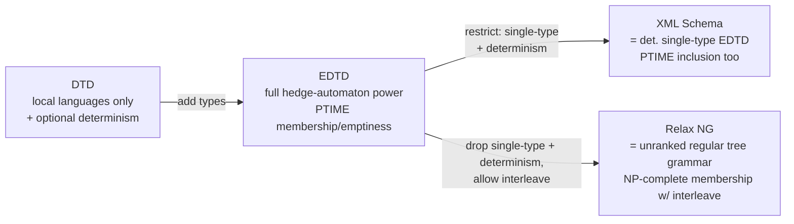

[[book-guidelines|↩ Back to guidelines]]

## From automata theory to a document format

Everything in this chapter up to this section has been about the theory of hedge automata: how to recognize sets of unranked trees, how to encode them into ranked trees, what their decision problems cost. §8.7 is the payoff — it shows that four real, deployed schema languages for XML (DTD, Extended DTD, XML Schema, Relax NG) are not ad-hoc inventions but points on a single, well-understood expressiveness ladder, each rung purchased by relaxing a restriction the previous rung imposed, and each restriction traceable to a specific automaton-theoretic property from earlier in the chapter (determinism, typing, locality). If you've internalized hedge automata as the reference model, this section reads less like "here are four XML dialects" and more like "here is what happens when you project the same automaton-theoretic knobs onto a concrete syntax and a concrete audience of document authors."

The running example is a conference program: `<conference>` containing `<track>`s, each containing `<session>`s with a `<chair>` and one-or-more `<talk>`s, each talk either *invited* (title + speaker) or *contributed* (title + authors), with optional `<break>`s between sessions. This is a genuinely nontrivial tree language — figuring out how much of it each formalism can express, and at what algorithmic cost, is exactly the content of this section.

Before diving into the specific formalisms, note the shape of the questions §8.5's decision problems take on here, since this reframing is what makes the theory *useful* rather than merely elegant:

- **Membership** (fixed schema) → "does this document conform to the schema in its header?"
- **Uniform membership** (schema also varies) → "validate this document against this schema."
- **Emptiness** → "is this schema description even satisfiable, or did I write a self-contradictory spec?" (also a subroutine for inclusion)
- **Inclusion** → "if I merge document archives valid under two different schemas, are all resulting documents still valid under some common schema?"

## Document Type Definitions: the local-language baseline

A **DTD** is essentially a context-free grammar with a regular expression — a *content model* — on the right-hand side of each rule, one rule per tag:

```
<!ELEMENT conference   (track+ | (session,break?)+)>
<!ELEMENT track        (session,break?)+>
<!ELEMENT session      (chair,talk+)>
<!ELEMENT talk         ((title,authors) | (title,speaker))>
```

Formally, $D = (\Sigma, s, \delta)$ with a start symbol $s$ and a mapping $\delta$ from each symbol to a regular expression over $\Sigma$ describing its children. The cleanest way to see what a DTD recognizes is to build the hedge automaton it *is*: let $Q_D = \Sigma$ (one state per tag, reusing the tag names as states!), $Q_{D,f} = \{s\}$, and

$$\Delta_D = \{\, a(\delta(a)) \to a \mid a \in \Sigma \,\}.$$

This is visibly a DFHA — one rule per symbol, so no ambiguity in which rule fires. $L(D) := L(A_D)$.

**[[Automata-with-Constraints#What breaks|What breaks]] without typing (the core limitation).** Because the automaton's states *are* the tag names, a DTD's rule for `talk` applies uniformly everywhere `talk` appears in a document — there's no way to say "a `talk` under an invited session must be title+speaker, but a `talk` under a contributed session must be title+authors" using a single `talk` rule. This is why DTDs generate exactly the **local languages**: membership of a tree $t$ can be decided by looking only at each node's immediate children (height-1 subpatterns), with zero memory of ancestor context. Local languages are a *strict* subclass of recognizable unranked-tree languages — the book gives a two-tree witness: $\{a(b(cd)), a'(b(dc))\}$ can't be a DTD language, because any DTD accepting both would also have to accept the "crossed" combination $a(b(dc))$, since the rule for `b`'s content can't see whether it's hanging under `a` or `a'`.

```rust
// A DTD is exactly this: one content-model regex per tag, no ambiguity about
// which rule applies at a node — the state you're in *is* the tag you're validating.
struct Dtd {
    start: String,
    content_model: HashMap<String, ContentModel>, // tag -> regex over child tags
}

enum ContentModel {
    Choice(Vec<ContentModel>),
    Seq(Vec<ContentModel>),
    Star(Box<ContentModel>),
    Plus(Box<ContentModel>),
    Optional(Box<ContentModel>),
    Symbol(String),
    Data, // #PCDATA
}
```

## Deterministic content models: the "no lookahead" requirement

The W3C spec for XML adds a real-world constraint on top of "regular expression": *"it is an error if the content model allows an element to match more than one occurrence of an element type."* Concretely: reading the content model left to right, symbol by symbol, you should never be unsure *which occurrence* of a symbol in the pattern a given input symbol corresponds to — no backtracking, no lookahead needed. This is formalized via **marking**: label the $i$-th occurrence (left to right) of symbol $a$ in the expression as $a_i$. A regular expression $e$ is **deterministic** (equivalently, **1-unambiguous**) if for all words $u,v,w$ and all marked symbols $x_i, y_j$ with $ux_iv, uy_jw \in L(e')$ (the marked language), $x_i \neq y_j$ implies $x \neq y$ — i.e., knowing the marked-language membership pins down the unmarked symbol uniquely from context, never two *different* marked occurrences of the *same* symbol competing for the same input position.

`ab+ac` (the marking $a_1b_1 + a_2c_1$) is **not** deterministic: on seeing the first `a` in an input like `ac`, you don't yet know if it's $a_1$ (heading toward `b`) or $a_2$ (heading toward `c`) — you need one symbol of lookahead. But the semantically equivalent `a(b+c)` **is** deterministic — there's only one `a` to match. This is exactly the same determinism concept as an LL(1) grammar or a DFA-without-backtracking that a programmer already has intuition for: *can I commit to a parse decision the instant I see the next token, with no need to backtrack or peek further ahead?*

**Why this is worth a real theorem, not just a footnote:** deterministic regular expressions translate to DFAs in polynomial time (Theorem 8.7.4), which in turn gives a polynomial-time DFHA(DFA) for the whole DTD — and hence **polynomial-time uniform membership, emptiness, and inclusion** for deterministic DTDs (Proposition 8.7.5), straight from §8.5's complexity results. Determinism isn't a stylistic nicety the W3C imposed for readability; it's the single restriction that moves every decision problem for the schema from "needs an NFA-style subset construction somewhere" to "already deterministic, check it directly." But it's not free: **not every regular language has a deterministic expression** (Theorem 8.7.6.1) — so requiring determinism genuinely shrinks what content models can say, though deciding *whether* a given DFA's language has one (and constructing it, in exponential time if so) is itself decidable in polynomial time (Theorem 8.7.6.2).

## Extended DTDs: recovering full expressiveness with types

The fix for DTD's core weakness (one rule per tag, no context-sensitivity) is to stop using tag names as automaton states directly, and instead let a tag carry a **type** — a tag/index pair $a^{(n)}$ drawn from an enlarged alphabet $\hat\Sigma = \{a^{(n)} \mid a \in \Sigma, n \in \mathbb{N}\}$. An **EDTD** is just a DTD over (a finite subset of) $\hat\Sigma$; a document $t$ over the *original* alphabet $\Sigma$ satisfies the EDTD if there's *some* way to assign types to $t$'s nodes such that the resulting $\hat\Sigma$-tree satisfies the underlying DTD.

Back to the conference example: introduce two types of `talk`, `talk⁽¹⁾` (invited: title+speaker) and `talk⁽²⁾` (contributed: title+authors), while `invSession`/`conSession` route to the appropriate type:

```
invSession  → chair talk⁽¹⁾
conSession  → chair (talk⁽²⁾)+
talk⁽¹⁾     → title speaker
talk⁽²⁾     → title authors
```

Now the *same tag* `talk` gets validated by *different* rules depending on which type it's assigned — and crucially, that assignment can depend on where in the tree the node sits (an `invSession`'s child gets forced to type 1). This is precisely how you smuggle "ancestor-dependent" behavior back into a DTD-shaped formalism: **the type is exactly a hedge-automaton state, made visible in the syntax.** Formally: a language $L$ where every tree has the same root label is recognizable **iff** it's EDTD-definable (Proposition 8.7.8) — EDTDs recover the *full* expressive power of hedge automata that plain DTDs lost. The conversion to an NFHA(NFA) is polynomial, so uniform membership and emptiness stay polynomial too (Proposition 8.7.9) — you buy back all the context-sensitivity DTDs were missing, without paying more than a polynomial cost for the two easy decision problems.

## XML Schema: single-type EDTDs plus one consistency rule

XML Schema is, structurally, an EDTD with a syntax built around named `complexType` declarations — the same `talk` tag can carry different types (`invTalk`, `conTalk`) in different contexts, exactly like an EDTD's `talk⁽¹⁾`/`talk⁽²⁾`. What XML Schema adds is a real-world constraint called **"Element Declarations Consistent"**: *elements with the same name appearing in the same content model must have the same type.* Concretely, this rules out a `<choice>` between `session` typed as `invSession` and `session` typed as `conSession` in the *same* content model position — you're not allowed to disambiguate by type alone at that point; the reader would need lookahead into the *type*, not just the tag, to know which rule applies, and XML Schema refuses to require that.

Formalized: an EDTD is **single-type** if no content-model regular expression on any right-hand side uses two different types $a^{(i)}, a^{(j)}$ of the same letter $a$. XML Schema $\equiv$ deterministic single-type EDTD (the determinism requirement is the same "Unique Particle Attribution" constraint discussed for DTDs, imposed again here).

This restriction buys something DTDs and unrestricted EDTDs don't have: **tractable inclusion.** For a deterministic single-type EDTD, you can complement in polynomial time (Theorem 8.7.10) — the single-type property lets you assign types to nodes of *any* tree top-down, deterministically, purely by looking at each node's parent's type and the deterministic content model there (falling back to a fresh unused type if the input doesn't match any expected type — the assignment is total even for trees *not* in the language, which is exactly what a complementation construction needs). That gives polynomial-time inclusion (Theorem 8.7.11) — recall from §8.5 that complementation is generally the expensive step in an inclusion algorithm; single-typing is precisely what keeps that step cheap here. (Whether an arbitrary EDTD is even *equivalent* to some single-type EDTD is EXPTIME-complete to decide, Theorem 8.7.12 — so single-typing is a real expressiveness cut, not a free syntactic rewrite.)

## Relax NG: giving up single-typing and determinism, paying with NP

Relax NG drops both remaining restrictions and is, structurally, just a **regular tree grammar for unranked trees** (Chapter 2's ranked-tree grammars, adapted straightforwardly by allowing regular expressions over children instead of a fixed tuple of nonterminal positions):

```
Conference  → conference(Track⁺ + Sessions)
Track       → track(Sessions)
Sessions    → ((InvSession+ConSession) (Break+ε))⁺
InvSession  → session(Chair InvTalk)
ConSession  → session(Chair ConTalk⁺)
```

Here `session` is used for *both* invited and contributed sessions with no type distinction required in the content model — exactly the pattern XML Schema's consistency rule forbids — and content models need not be deterministic at all. This is real expressive headroom, but it isn't free: Relax NG also exposes an `<interleave>` operator, corresponding to the shuffle operator $\shuffle$ from §8.5 (arbitrary interleavings of two children sequences, not just their concatenation in one fixed order). Recall from §8.5 (Theorem 8.5.6) that allowing shuffle in horizontal-language descriptions pushes uniform membership from PTIME up to **NP-complete** — so Relax NG's headline cost is precisely that interleaving raises validation from "linear in the document" (without interleave) to NP-hard (with it). Emptiness, reassuringly, stays polynomial even with interleaving (Theorem 8.5.8) — satisfiability of the schema itself doesn't get harder, only checking a *specific* document against it does.

## Where this leads: one hierarchy, four names



Read bottom-up in cost, top-down in restriction: **DTD** is the cheapest and most restrictive (local languages, states = tag names, no context); **EDTD** removes the locality restriction by making types explicit, recovering everything a hedge automaton can express at polynomial cost for the two easy problems; **XML Schema** re-restricts EDTDs (single-type + determinism) specifically to buy back tractable *inclusion*, which general EDTDs don't offer; **Relax NG** goes the other way from XML Schema — keeps EDTD's full expressiveness, adds interleaving on top — and pays for that added expressiveness with NP-hard membership. None of these are arbitrary design choices: each is a specific, nameable point on the expressiveness/tractability trade-off surface that Chapters 4, 5, and the rest of Chapter 8 (topic 12, on hedge automata proper) establish in the abstract. This section is the concrete, deployed instance of that trade-off, not a new theory — it's the same lesson (restricting expressiveness is what buys you decidable, cheap decision procedures) reappearing with W3C standards names attached instead of automaton-class names.

For the standing project: it's worth noting, lightly, that a schema language is functionally "a type system for trees" — DTD/EDTD/XML-Schema/Relax-NG's escalating precision about *which* children-shapes are legal under *which* ancestor context is a structural echo of a type system's escalating precision about which *values* are legal under which typing context, and single-type EDTD's restriction (no two types for the same tag in one content-model position) is the same "restrict to buy tractability" instinct that shows up in restricting general higher-order unification to Miller's pattern fragment, or general constrained tree automata (topic 8) down to reduction automata. The connection is real but shouldn't be overstated — this section's payoff is mostly in seeing tree-automata theory cash out as an actual W3C standard, which is a satisfying kind of "So *that's* what it was all for" moment in its own right.
