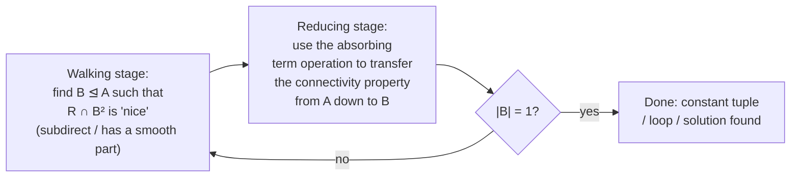

[[book-guidelines|↩ Back to guidelines]]

## Why absorption, and what breaks without it

[[The-Algebraic-Approach-to-CSP|The algebraic approach to CSP]] rests on one theorem you've likely already met in this book's earlier material: the complexity of $\mathrm{CSP}(\mathbf{A})$, for a fixed finite relational structure $\mathbf{A}=(A;R_1,\dots,R_k)$, depends only on the *clone* of polymorphisms $\mathrm{Pol}(\mathbf{A})$ — the set of all operations $f:A^n\to A$ that map $\mathbf{A}^n$ homomorphically into $\mathbf{A}$ (equivalently, that are compatible with every $R_i$). This is the Pol–Inv Galois connection. A second connection, Mod–Id, says that in fact only the *equational identities* satisfied by that clone matter (e.g. "does it have a Mal'tsev term," "does it have a near-unanimity term").

So the whole research program reduces to: **given an algebra of polymorphisms, what can you say about the shape of the relations it preserves, and can you turn that shape into an algorithm?**

Before absorption, the answer for any specific template was usually an ad hoc combinatorial argument, rebuilt from scratch. The chapter opens with exactly such an argument — worked out by hand — and then shows that the trick used inside it is a special case of a single reusable concept. That's the motivation: absorption is the thing that lets you stop re-deriving the same "walk along a connected component until you hit a wall" argument every time, and instead cite a lemma.

## The motivating example: $\mathbf{K}_3^c$, worked from scratch

Take the complete graph on three vertices with constants attached to each vertex:

$$\mathbf{K}_3^c = (\{0,1,2\};\, R,\, C_0,\, C_1,\, C_2), \qquad R=\{(x,y):x\ne y\},\quad C_i=\{i\}.$$

Claim: $\mathrm{Pol}(\mathbf{K}_3^c)$ contains nothing but the projections. Since a relation is pp-definable from $\mathbf{A}$ exactly when it's compatible with every polymorphism of $\mathbf{A}$, "only projections" means *every* relation on $\{0,1,2\}$ is pp-definable — the structure pp-interprets everything, so $\mathrm{CSP}(\mathbf{K}_3^c)$ is maximally hard (NP-complete, in fact this is essentially 3-COLORING with fixed colors pinned down).

The proof runs through three stages, each forced by the previous one:

1. **Singletons and pairs are forced closed.** Since $C_2=\{2\}$ is a relation, any polymorphism must send the all-2's tuple to 2 — so $\{2\}$ is a *subuniverse* (closed under all operations) of the polymorphism algebra. Same for $\{0\}$, $\{1\}$. A short pp-formula argument (the set of $R$-neighbors of $\{2\}$) then forces $\{0,1\}$ to be a subuniverse too — and symmetrically for $\{0,2\}$ and $\{1,2\}$.
2. **Unary and binary polymorphisms collapse to projections.** Unary ones are forced by step 1 to fix every point. Binary ones are pinned down by chasing adjacency in the "second power graph" of $R$ (the graph on $\{0,1,2\}^2$ where $(a,b)\sim(a',b')$ iff $a\ne a', b\ne b'$ pointwise via $R$): fixing where $(0,1)$ goes propagates around the triangle and forces the whole map to be a projection.
3. **Higher-arity polymorphisms decompose.** For an $n$-ary polymorphism $f$, define the *binary traces* $f_i(x,y) = f(x,\dots,x,y,x,\dots,x)$ (with $y$ in position $i$). Since the clone is closed under composition, each $f_i$ is itself a binary polymorphism — hence a projection by step 2. Two cases:
   - Some $f_i(x,y)=y$: this forces $f$ to behave like the first argument almost everywhere, and (unless it can be shown to compose into a genuine Mal'tsev operation, which contradicts $R$ not being rectangular — see §5 below) this collapses to a single projection.
   - Every $f_i(x,y)=x$ (so $f$ is a **near-unanimity**, or NU, operation: $f(y,x,\dots,x)=f(x,y,x,\dots,x)=\cdots=x$). Chasing a specific path through the power graph — alternating tuples that are "mostly 0's/1's with one exception" — produces a walk of *odd length* between two elements of $\{0,1\}$ that would have to alternate parity, a contradiction.

That last argument is the one to watch closely, because **it is exactly the special case that the chapter will generalize into absorption.** The key fact used was: the set $\{0,1\}$ tolerates $f$ making "one exception" — if all-but-one coordinates of a tuple lie in $\{0,1\}$, the result still lands in $\{0,1\}$. That "at most one coordinate allowed to escape" property is precisely absorption.

## Absorbing subalgebras

> **Definition 1 (Absorption).** A subalgebra $B \le \mathbf{A}$ is *absorbing* with respect to an $n$-ary term operation $f$ of $\mathbf{A}$ — written $B \trianglelefteq_f \mathbf{A}$, or $B \trianglelefteq \mathbf{A}$ when $f$ doesn't matter — if
> $$f(a_1,\dots,a_n) \in B \quad \text{whenever } |\{i : a_i \notin B\}| \le 1.$$

Read it operationally: $f$ is allowed to look at up to $n-1$ coordinates that are outside $B$, but as soon as it looks at $n-1$ coordinates *inside* $B$ (only one exception permitted), the output is guaranteed to fall back into $B$. This is a genuine generalization of near-unanimity: an NU operation makes *every singleton* absorbing (that's literally the NU identity, restated), and the converse holds too — if every singleton absorbs, the algebra has an NU term (the chapter proves this converse using the star composition, below).

Absorption is common even in small algebras. On a two-element domain, any operation that isn't affine over $\mathrm{GF}(2)$ yields the binary min, binary max, or the majority operation as a term — and correspondingly $\{0\}$, $\{1\}$, or both singletons absorb. This single fact is the entire reason Horn-SAT and 2-SAT admit polynomial algorithms: their clause structure is exactly "compatible with an absorbing singleton."

**What breaks without absorption as a formal notion:** you'd be stuck reproving the $\mathbf{K}_3^c$-style contradiction by hand, per template, per arity case. Absorption turns "tolerates one exception" into an object you can compose, propagate, and reason about generically — the rest of the chapter is a toolbox built on top of that one definition.

### Star composition: absorption is transitive and closes under intersection

If $B \trianglelefteq_f \mathbf{A}$ ($f$ arity $n$) and $C \trianglelefteq_g \mathbf{A}$ ($g$ arity $m$), define the **star composition**

$$(f \star g)(x_1,\dots,x_{nm}) = f\big(g(x_1,\dots,x_m),\, g(x_{m+1},\dots,x_{2m}),\, \dots,\, g(x_{nm-m+1},\dots,x_{nm})\big).$$

$f\star g$ witnesses *both* absorptions simultaneously in one operation, which is the technical device behind proving that "is an absorbing subuniverse of" is transitive, that intersections of absorbing subuniverses absorb, and — by composing witnesses from every singleton — that "every singleton absorbs" collapses down to a single genuine NU term.

```rust
// A minimal, concrete model: finite-domain absorption as a runtime check.
// This is the shape you'd want for a CSP kernel's polymorphism layer:
// operations are boxed closures over a finite domain, and "absorbing"
// is a predicate you can check (or, for symbolic domains, propagate).

type Elem = u32;

#[derive(Clone)]
struct Operation {
    arity: usize,
    apply: std::rc::Rc<dyn Fn(&[Elem]) -> Elem>,
}

fn is_absorbing(b: &std::collections::HashSet<Elem>, domain: &[Elem], f: &Operation) -> bool {
    // Brute-force check over all tuples with "at most one coordinate outside B".
    // In practice you'd restrict to a witnessing sample, but for small domains
    // (as in the K^c_3 example) full enumeration is exactly how you'd verify
    // Definition 1 mechanically.
    let n = f.arity;
    for exception_pos in 0..=n {
        // exception_pos == n means "no exceptions" (all coords in B)
        let outside_choices: Vec<&Elem> = if exception_pos == n {
            vec![]
        } else {
            domain.iter().filter(|a| !b.contains(a)).collect()
        };
        let in_b: Vec<Elem> = b.iter().cloned().collect();
        if exception_pos == n {
            let tuple: Vec<Elem> = vec![in_b[0]; n]; // any in-B assignment
            if !b.contains(&(f.apply)(&tuple)) { return false; }
            continue;
        }
        for &escaping in &outside_choices {
            let mut tuple = vec![in_b[0]; n];
            tuple[exception_pos] = *escaping;
            if !b.contains(&(f.apply)(&tuple)) { return false; }
        }
    }
    true
}

// Star composition, mirroring f ⋆ g from the text: witnesses two absorptions at once.
fn star(f: Operation, g: Operation) -> Operation {
    let n = f.arity;
    let m = g.arity;
    Operation {
        arity: n * m,
        apply: std::rc::Rc::new(move |xs: &[Elem]| {
            let chunks: Vec<Elem> = (0..n)
                .map(|i| (g.apply)(&xs[i * m..(i + 1) * m]))
                .collect();
            (f.apply)(&chunks)
        }),
    }
}
```

This is intentionally the *verification* direction (check a candidate operation), not the *search* direction (find one) — finding absorbing operations for an arbitrary template is itself part of the tractability question. But the check is exactly what you'd wire into a CSP kernel's preprocessing pass if you wanted to detect, e.g., that a domain has a Horn-SAT-style absorbing singleton before choosing a solving strategy.

## Propagating absorption: subpowers and the pp-definable closure

A **subpower** of $\mathbf{A}$ is a subuniverse of some power $\mathbf{A}^n$ — equivalently (when $\mathbf{A}=\mathrm{Pol}(\mathbf{A})$), a relation pp-definable from $\mathbf{A}$. The set of subpowers is closed under pp-definitions, and absorption has an analogous closure property:

> **Proposition 2 (Propagation of Absorption).** If $R \le \mathbf{A}^n$ is a subpower defined from subpowers $S_1,\dots,S_k$ by a pp-formula $\varphi$, and $S_i' \trianglelefteq S_i$ for each $i$, then the subpower defined by substituting each $S_i$ with $S_i'$ in $\varphi$ absorbs $R$.

The paradigm instance — and the one that closes the loop back to the $\mathbf{K}_3^c$ example — is *walking along a relation*: if $B \trianglelefteq \mathbf{A}$ and $R \le \mathbf{A}^2$, then the set of out-neighbors $C(y) \iff (\exists x)\, B(x)\wedge R(x,y)$ absorbs the set of all elements with an in-neighbor, $D(y)\iff(\exists x)\,R(x,y)$. If $R$ is subdirect (every element has an in-neighbor), $D=A$ and $C$ absorbs the whole algebra. This is literally what happened in the $\mathbf{K}_3^c$ proof: $\{2\}$ absorbed, and its $R$-neighborhood $\{0,1\}$ inherited absorption "for free" via this propagation rule, without a fresh combinatorial argument.

## Transferring connectivity

This is the chapter's central engine, and it's worth naming explicitly: **absorption transfers connectivity**. If a bigger structure is connected in some sense and a subuniverse absorbs it, the *restriction* to that subuniverse is still connected in the same sense. Every major proof in the chapter is two stages built on this idea:



### Linkedness (Proposition 3)

Regard $R \le A^2$ as a bipartite graph (left copy and right copy of $A$, edges given by pairs in $R$). $R$ is **linked** if this graph is connected. Proposition 3 says: if $R$ is subdirect and linked, and $A$ has a proper absorbing subalgebra, then there is a proper $B \le A$ such that $R \cap B^2$ is still subdirect and linked in $B$.

The proof is the template for everything that follows. Walking stage: iteratively step left-to-right and right-to-left along neighborhoods starting from a known absorbing set $B_0$, closing this stepping relation under composition, until you find $D$ such that every vertex of $A$ has an in-neighbor in $D$ — this makes the smooth part of $R\cap D^2$ (vertices lying on a directed cycle) nonempty, call it $B$. Reducing stage: given a link $a=a_0,a_1,\dots,a_{2k}=b$ between two elements of $B$, apply the witnessing term operation $f$ *coordinatewise, sliding across the link one position at a time* — each application stays inside $B$ by absorption, and concatenating the resulting short links stitches together a full link from $a$ to $b$ entirely inside $B$.

**Corollary 4** iterates this: if every non-singleton subalgebra of $A$ (including $A$ itself) has a proper absorbing subalgebra — true, e.g., whenever $A$ has an NU or semilattice term — then any subdirect linked $R \le A^2$ must eventually shrink to a single point, i.e., $R$ contains a constant pair. Algebras with a near-unanimity term automatically satisfy this hypothesis, which is the algebraic seed of the classical tractability result for NU templates.

### From graphs to CSP instances: arc consistency, Prague instances, and a genuinely new algorithm

The chapter's motivating puzzle: Feder and Vardi already knew majority polymorphisms (3-ary NU) give a working consistency algorithm — but their construction's complexity depends on the NU arity, so it doesn't give *one* algorithm for *all* NU-polymorphism templates. Absorption is used to build that uniform algorithm.

**Arc consistency.** An instance is arc consistent w.r.t. domains $\{P_x\}$ if every constraint relation is subdirect in the product of its variables' domains. The standard propagation loop:

```rust
// Faithful transcription of the AC algorithm in the text (§4.2.1):
// shrink domains and constraint relations to a fixed point.
use std::collections::HashSet;

struct Instance<D: Eq + std::hash::Hash + Clone> {
    domains: std::collections::HashMap<String, HashSet<D>>,
    // constraint: (scope variables, relation as a set of tuples)
    constraints: Vec<(Vec<String>, HashSet<Vec<D>>)>,
}

fn arc_consistency<D: Eq + std::hash::Hash + Clone>(inst: &mut Instance<D>) -> bool {
    loop {
        let mut changed = false;
        for (scope, rel) in &mut inst.constraints {
            // R' := R ∩ (P_x1 × ... × P_xn)
            rel.retain(|tuple| {
                scope.iter().zip(tuple).all(|(x, a)| inst.domains[x].contains(a))
            });
            // for each i: P_xi := P_xi ∩ proj_i(R')
            for (i, x) in scope.iter().enumerate() {
                let projected: HashSet<D> = rel.iter().map(|t| t[i].clone()).collect();
                let dom = inst.domains.get_mut(x).unwrap();
                let before = dom.len();
                dom.retain(|a| projected.contains(a));
                if dom.len() != before { changed = true; }
            }
        }
        if !changed { break; }
    }
    inst.domains.values().all(|d| !d.is_empty()) // false ⇒ refuted (unsatisfiable)
}
```

Arc consistency alone is far too weak: the template $(\{0,1\};\ne)$ (2-colorability) has a *majority* polymorphism yet the triangle instance $x\ne y\wedge y\ne z\wedge z\ne x$ sails through arc consistency untouched — every domain stays $\{0,1\}$, no contradiction is ever derived, even though the instance is unsatisfiable. So arc consistency (this "width-1" property) cannot be the consistency notion that absorption transfers uniformly across NU templates; something stronger and structurally cleverer is needed.

The chapter searches upward through consistency notions — **(2,3)-consistency** (path consistency: every edge in the *microstructure graph* extends to a triangle across any third variable), then **circle instances** (every closed *pattern* of variable-repetitions returns each domain element to itself), landing on:

> **Definition 9 (Prague instance).** A simplified instance is a Prague instance if it is arc consistent and, for every circle pattern $p$ at variable $x$ and every $a,b \in P_x$: whenever $a,b$ are connected by *some* pattern using only the variables of $p$, they are connected by $k \cdot p$ (some fixed power of $p$ itself).

Every (2,3)-consistent instance is automatically a Prague instance, but Prague instances form the *right* level of abstraction because — unlike (2,3)-consistency — the connectivity-transfer machinery of Proposition 3 generalizes to it *directly*, without extra tooling:

> **Proposition 10.** Take a simplified Prague instance where some $P_x$ has a proper absorbing subuniverse. Then there exist $P_x' \trianglelefteq P_x$ (at least one proper) defining a smaller Prague instance.

The proof follows the walking/reducing template exactly, with the extra bookkeeping of tracking *patterns* $p$ instead of raw graph edges — the reducing stage applies the absorbing term operation coordinatewise across a chain of pattern-realizations (the "staircase" picture in the source, sliding one coordinate at a time from an all-$a$ tuple to an all-$b$ tuple), each intermediate step landing in the new domain by absorption because only one coordinate is ever "outside" at a time.

**Corollary 11** closes the loop: if every non-singleton $P_x$ (including $P_x$ itself) has a proper absorbing subuniverse, a Prague instance always has a solution — repeated shrinking terminates in singleton domains. This gives the promised *single* polynomial-time algorithm ("check Prague-instance-ness and shrink") uniformly covering all templates with an NU term, a semilattice term, or products of such — no case analysis on the arity of the witnessing operation required.

## Structural characterizations: turning identities into shapes

Section 5 of the chapter runs a recurring pattern: an equational condition on the polymorphism algebra $\leftrightarrow$ a structural property every compatible relation must have. Each proof constructs a specific subpower of the **free algebra** on 2 (or 3) generators — the algebra whose elements are the term operations themselves, generated by the projections $\pi_1,\pi_2,\dots$ — and reads the needed identity directly off which tuples that subpower is forced to contain.

| Equational condition | Structural consequence | Result |
|---|---|---|
| Near-unanimity term (arity $k+1$) | Every subpower of every $\mathbf{B}\in V(\mathbf{A})$ is $k$-decomposable (determined by its $k$-ary projections) | Baker–Pixley (Theorem 12) |
| Mal'tsev term $f(x,x,y)=y=f(y,x,x)$ | Every binary $R \le \mathbf{B}^2$ is **rectangular** (a disjoint union of "biclique" products $B'\times C'$); equivalently congruences permute, $\alpha\circ\beta=\beta\circ\alpha$ | Theorem 13 |
| Jónsson terms (a finite chain of ternary identities, `‡`) | The connectivity-of-labeled-bipartite-graphs property that underlies congruence distributivity $\alpha\wedge(\beta\vee\gamma)=(\alpha\wedge\beta)\vee(\alpha\wedge\gamma)$ | Theorem 14 |
| Directed Jónsson terms | Strengthens Jónsson: *directed* labeled-loop reachability | §5.3.1 |

The Mal'tsev/rectangularity pair is exactly what ruled out one of the two cases in the $\mathbf{K}_3^c$ proof: since $R$ (the "$\ne$" relation) is *not* rectangular, no Mal'tsev term can exist, which is why the case "$f_i(x,y)=y$ for two different $i$'s" collapsed — that case would have produced a genuine Mal'tsev operation via $m(x,y,z)=f(x,z,y,y,\dots,y)$, contradicting non-rectangularity.

**Jónsson absorption.** The Jónsson-term identities have their own weakened, "absorption-flavored" version: $B$ *Jónsson absorbs* $A$ when there's a chain of terms satisfying the same identity pattern but with condition `‡` relaxed to $p_i(B,A,B)\subseteq B$ (only requiring the *boundary* behavior, not full closure). This weaker notion is strong enough to substitute for ordinary absorption in results like Proposition 10, and — because it's a weaker hypothesis to establish — it lets later theorems (like Bulatov's conservative-CSP dichotomy, below) go through in cases where full absorption wouldn't be available.

```lean
-- Lean is the natural home for these identity-chains: each equational
-- condition is a structure carrying the operation plus a proof obligation.
-- This mirrors how a kernel's `isDefEq`/unifier would need to *check* a
-- candidate term against such identities, not just state them.

structure MaltsevTerm (A : Type) where
  m : A → A → A → A
  left_id  : ∀ x y : A, m x x y = y
  right_id : ∀ x y : A, m y x x = y

structure NearUnanimity (A : Type) (n : ℕ) where
  f : (Fin n → A) → A
  -- f is NU: replacing any one coordinate with the "odd one out" still
  -- returns the majority value x. Encoded via a family of identities,
  -- one per position i replaced by y while the rest stay x.
  nu : ∀ (x y : A) (i : Fin n),
        f (fun j => if j = i then y else x) = x

-- Rectangularity as the *relational* payoff of a Mal'tsev term
-- (Theorem 13, direction 1 ⇒ 2): given (a,b), (a',b), (a',b') ∈ R,
-- m applied coordinatewise recovers (a, b') ∈ R.
example {A : Type} (mt : MaltsevTerm A) (R : A → A → Prop)
    (compat : ∀ a b a' b' c c' : A, R a b → R a' b → R a' b' →
              R (mt.m a a' a') (mt.m b b b')) :
    ∀ a b a' b' : A, R a b → R a' b → R a' b' → R a b' := by
  intro a b a' b' hab ha'b ha'b'
  have := compat a b a' b' a a' hab ha'b ha'b'
  simpa [mt.left_id] using this
```

## Taylor algebras: when is absorption *guaranteed*?

Section 6 answers the chapter's third promised virtue — "absorption is common" — precisely.

> **Theorem 15 (Taylor).** $V(\mathbf{A})$ contains no **G-set** (an idempotent algebra of $\ge 2$ elements all of whose operations are projections) if and only if $\mathbf{A}$ has a **Taylor term**: some term $t$ where, for *every* coordinate $i$, an identity of the form $t(\dots,x,\dots) = t(\dots,y,\dots)$ holds (with $x,y$ possibly repeated elsewhere) that forces coordinate $i$ to not matter alone.

Taylor algebras are the exact dividing line the whole dichotomy program is chasing: if $\mathrm{Pol}(\mathbf{A})$ is *not* Taylor, $\mathbf{A}$ pp-interprets a G-set-compatible structure, which pp-interprets *everything*, so $\mathrm{CSP}(\mathbf{A})$ is NP-complete. The (still-conjectural, at the time this chapter was written — later proved by Bulatov and Zhuk independently in 2017) dichotomy states the converse: Taylor $\Rightarrow$ tractable.

> **Theorem 16 (Absorption Theorem).** Let $A, B$ be Taylor algebras and $R \le A\times B$ subdirect and linked. Then $A$ or $B$ has a proper absorbing subalgebra, **or** $R = A\times B$.

This is the "absorption is common" promise made precise: a Taylor algebra with *no* absorption at all forces every subdirect linked relation on it to be the *full* product — an extremely strong structural collapse. The proof strategy: star-compose the Taylor identity into a *transitive* term operation (one that can move any element to any other, holding all-but-one coordinate fixed); use it to show a maximal "commonly-reachable" set $X$ absorbs; conclude $X=A$ (or symmetrically $Y=B$), which forces a nonempty "center" that itself absorbs, hence equals the whole algebra, hence $R$ is full.

Immediate payoff — **re-deriving the $\mathbf{K}_3^c$ hardness result in three lines** instead of the multi-page case analysis in §2: the inequality relation on $\mathbf{K}_3^c$ is subdirect and linked in $A^2$; if $\mathrm{Pol}(\mathbf{K}_3^c)$ were Taylor, the Absorption Theorem would force a proper absorbing subalgebra — but Proposition 3 already showed no such $B$ can make $R\cap B^2$ subdirect-and-linked (the triangle has no proper subgraph with this property), a contradiction. So $\mathrm{Pol}(\mathbf{K}_3^c)$ is *not* Taylor, hence $\mathrm{CSP}(\mathbf{K}_3^c)$ is NP-complete — the abstract machinery subsumes the from-scratch combinatorics.

### The Loop Lemma, Siggers terms, and cyclic terms

Relaxing the Absorption Theorem's hypotheses (Taylor instead of "already known to lack absorption"; *algebraic length 1* — a closed walk with one more forward than backward edge — instead of full linkedness) gives:

> **Theorem 18 (Loop Lemma).** If $A$ is Taylor and $R \le A^2$ is subdirect with algebraic length 1, then $R$ has a loop $(a,a)$.

This directly yields the CSP dichotomy for structures consisting of a single subdirect binary relation (smooth digraphs): either the core is a disjoint union of directed cycles (tractable), or it lacks a Taylor polymorphism and is NP-complete. The Loop Lemma is also the engine behind two surprising equational facts:

- **Siggers terms (Corollary 19).** Every Taylor algebra has a 4-ary term $s(x,y,z,x)=s(y,x,y,z)$ and a 6-ary term $s'(x,y,x,z,y,z)=s'(y,x,z,x,z,y)$. Proved by building a specific subdirect, algebraic-length-1 relation on the 3-generated free algebra and reading the loop straight off.
- **Cyclic terms (Theorem 20).** If $A$ is Taylor and $p$ is prime with $p > |A|$, then $A$ has a **cyclic** term of arity $p$: $t(x_1,\dots,x_p)=t(x_2,\dots,x_p,x_1)$.

Cyclic terms sharpen the whole picture into a clean, purely *relational* restatement — the version of the dichotomy conjecture you'd actually want to implement a decision procedure for:

> **Algebraic CSP Dichotomy Conjecture.** For a prime $p>|A|$: if every $p$-ary cyclic relation pp-definable from $\mathbf{A}$ contains a constant tuple, $\mathrm{CSP}(\mathbf{A})$ is tractable; otherwise NP-complete.

## Conservative CSPs: absorption shortens Bulatov's proof

**Conservative** structures contain all unary relations — equivalently, every subset of the domain is a subuniverse. Bulatov proved the dichotomy for this class (Theorem 21) with a long technical "local analysis" argument; absorption gives a materially shorter route:

1. From cyclic terms plus conservativity: $t(a,\dots,a,b)$ must equal $a$ or $b$ (conservativity forces the value into $\{a,b\}$), and it can't be $a$ — because that would make $\{a\}$ absorb $\{a,b\}$, contradicting **hereditary absorption-freeness** once you've reduced to that case (Theorem 36 below). So it equals $b$, and $m(x,y,z)=t(x,y,y,\dots,y,z)$ is a genuine Mal'tsev term.
2. A **Rectangularity theorem** for conservative algebras (Proposition 22): if $R \le P\times P'$ is subdirect and touches both a "diagonal-ish" region and an "off" region relative to minimal absorbing subalgebras $Q,Q'$, then $Q\times Q' \subseteq R$ — a direct corollary of the Absorption Theorem applied to minimal absorbing subalgebras.
3. Combine with Proposition 10's reduction machinery: repeatedly shrink a Prague instance down to minimal absorbing subuniverses until every domain is **hereditarily absorption free (HAF)** — no subalgebra has any proper absorbing subuniverse — at which point step 1 guarantees a Mal'tsev term everywhere, and the known polynomial Mal'tsev-constraint algorithm (Bulatov–Dalmau) finishes the job.

## The frontier: abelianness is the thing absorption can't see

The chapter closes by naming absorption's blind spot precisely.

> **Definition 34 (Abelian).** $A$ is abelian if for every term $t$, elements $a,b$, and tuples $\vec c,\vec d$: $t(a,\vec c)=t(a,\vec d) \implies t(b,\vec c)=t(b,\vec d)$ (equivalently, the diagonal $\{(a,a)\}$ is a congruence block of $A^2$).

> **Theorem 35.** If $A$ is abelian, no subalgebra of $A$ has a proper absorbing subalgebra.

Proof sketch: a singleton absorbing subuniverse $\{a\}$ would propagate (via Proposition 2, along the congruence witnessing abelianness) into an absorbing, non-linked subuniverse of a linked $A^2/\alpha$ — contradicting the linkedness-transfer machinery from Proposition 3 itself. So abelianness is *exactly* the obstruction that makes absorption vanish — algebras like $\mathrm{Pol}(\mathbb{Z}_p)$ (affine spaces over a prime field, the paradigm example of a template *not* solvable by any local consistency algorithm) are abelian, which is why the entire connectivity-transfer toolchain in this chapter goes silent on them. Interestingly, HAF-plus-Taylor collapses right back down to Mal'tsev (Theorem 36) — so "no absorption anywhere" and "has a Mal'tsev term" turn out to be the same phenomenon viewed from two directions, which is precisely the fact Bulatov's shortened proof exploits above.

Section 8.2 shows the naive generalization to higher-arity relations fails outright: a ternary "sum-to-zero mod 2" relation over $(\{0,1\};+)$ has full binary projections but *no* absorbing subalgebra at all (a direct byproduct of abelianness). Theorem 38 pins down that abelian quotients are the *only* thing that can defeat a higher-arity Absorption Theorem — every other case forces either absorption or a full product, exactly as in the binary case.

## Where this leads

For the CSP kernel this workbench is aimed at, this chapter isn't background reading — it's the soundness argument for the propagation layer you'd actually implement. Arc consistency, path/(2,3)-consistency, and Singleton Arc Consistency are the concrete algorithms; absorption (and its relaxed cousins, Jónsson and directed-Jónsson absorption) is *why* running them to a fixed point is guaranteed to either find a solution or correctly refute, for any template with a Taylor polymorphism that isn't secretly abelian. The Prague-instance machinery in particular (§4.2.3, Proposition 10) is a direct blueprint for a "shrink-until-singleton" domain-propagation loop — precisely the domain/lattice propagation your CSP kernel's `sat-smt-csp` goals call for, generalized past the finite-domain, non-linear-arithmetic-only case this book covers next (Chapter 3).

The Absorption Theorem and Loop Lemma are also the load-bearing lemmas for the *dichotomy itself* — the fact that every fixed-template CSP is either polynomial or NP-complete, with no intermediate complexity, which is exactly the guarantee you need before building a solver that assumes "either propagation finds it, or the instance is genuinely hard, never something in between." Bulatov's conservative-CSP result matters concretely if the kernel's domains ever include arbitrary unary predicates (range/type restrictions) on top of relational constraints — that's the conservative case by definition. And the abelian obstruction is worth remembering as a standing warning: if part of your constraint language turns out to encode linear algebra over a finite field, expect propagation-based methods to go quiet exactly where this chapter predicts they will, and reach for Gaussian-elimination-style algorithms instead.
