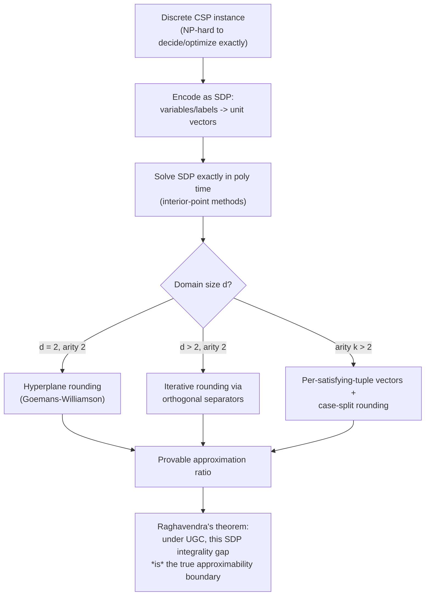

# Approximation Algorithms for CSP

[[book-guidelines|↩ Back to guidelines]]

## Why this chapter exists: what do you do when P ≠ NP but you still need an answer?

The other chapters in this book ask a binary question: is $\mathrm{CSP}(\Gamma)$ in P, or is it NP-complete? That question has a clean yes/no answer once you know the polymorphisms of $\Gamma$. But binary answers are useless in practice for the "no" case — if 3-SAT is NP-complete, you don't get to walk away from 3-SAT-shaped problems. You still have a scheduling instance, a MAX-CUT instance, a graph-partitioning instance sitting on your desk, and you still need *some* assignment. Approximation algorithms are the engineering answer to a complexity-theoretic dead end: instead of asking "can I always find the optimal assignment in poly time," ask "how close to optimal can I always get, and how do I prove that bound holds for *every* instance, not just the ones I tested on."

This chapter (Makarychev & Makarychev, pp. 287–325) is a technique survey, not a classification survey. Where Chapters 1–10 build one unifying theory (polymorphisms) that explains *all* of decision CSP complexity, this chapter's organizing idea is different and more modest: semidefinite programming (SDP) relaxation-and-rounding is the dominant hammer, and the chapter walks you through the hammer's design, one increment of difficulty at a time — Boolean 2-CSPs, then non-Boolean 2-CSPs, then arity-$k$ CSPs, then a completely general "universal" algorithm. The throughline that makes all of this legible is: **every approximation algorithm here has the same three-part anatomy** — encode the discrete problem as a relaxed continuous (SDP) problem, solve the continuous problem exactly (SDPs are poly-time solvable to arbitrary precision), then round the continuous solution back to a discrete one while losing as little value as possible. Everything interesting in this chapter is in the rounding step and in the accompanying proof that a *specific* random rounding procedure preserves *this much* value in expectation.

If you're building a CSP kernel that searches for counterexamples against type/refinement invariants (per this workbench's `sat-smt-csp` focus area), this chapter is not about your primary use case — your kernel wants exact SAT/SMT-style search for a concrete falsifying assignment, not a fractional guarantee. But it is directly relevant to a secondary concern that shows up in real verifiers: when your abstract-interpretation over-approximation is *too* imprecise and the underlying constraint problem is NP-hard even to decide (e.g. certain non-linear or combinatorial refinement obligations), an approximation algorithm with a *provable* guarantee is sometimes the only principled fallback between "exact solve" and "give up." The techniques here — relax to a continuous space, round with a controlled loss — are also the direct ancestor of LP/SDP relaxation techniques used in invariant synthesis and in the Lovász-Schrijver / SOS hierarchies that show up in advanced abstract interpretation. Even if you never implement an SDP solver, understanding *why* rounding is hard for non-Boolean domains will sharpen your intuition about why constraint propagation over rich abstract domains (DFA-shaped domains, in your CSP kernel's own design goal) is intrinsically harder than propagation over Boolean domains.

## Part 1 — Three objectives that are not the same problem

Before any algorithm, the chapter forces a distinction that's easy to blur: "approximating a CSP" is not one problem, it's (at least) three, and they have genuinely different, sometimes incomparable, guarantees. Fix a $k$-CSP: $n$ variables over a domain of size $d$, $m$ constraints of arity $\le k$. An instance is **$(1-\varepsilon)$-satisfiable** if the best assignment satisfies at least a $(1-\varepsilon)$ fraction of constraints.

1. **Maximization.** Find an assignment satisfying $\ge \alpha \cdot \mathrm{OPT}$ constraints, for a global constant $\alpha \le 1$ (an $\alpha$-approximation). This guarantee applies uniformly, even to instances that are barely satisfiable at all.
2. **Near-satisfiability.** Given that the instance is $(1-\varepsilon)$-satisfiable, satisfy a $1 - f(\varepsilon)$ fraction, where $f(\varepsilon) \to 0$ as $\varepsilon \to 0$ (and $f$ does *not* depend on $n$). This guarantee is vacuous for far-from-satisfiable instances but strong for near-satisfiable ones.
3. **Minimization.** Given $(1-\varepsilon)$-satisfiability, satisfy $\ge 1 - \alpha\varepsilon$ fraction, where $\alpha$ is allowed to grow with $n$ (this is a minimization-of-violations framing, and the approximation factor $\alpha$ multiplies the *violation* $\varepsilon$, not the whole instance).

**What breaks without this distinction:** the book's own example is Max-2-Lin(2) (Boolean, constraints of the form $x_i \oplus x_j = c$, a generalization of Max Cut). The three objectives give it a 0.87856-approximation, a $1 - O(\sqrt{\varepsilon})$-satisfaction guarantee, and an $O(\sqrt{\log n})$-approximation for minimization, respectively — three numbers that are not comparable and are not even measuring the same thing. If you only ever ask "what's the approximation ratio for Max Cut," you'll get an answer that's technically true but useless for the regime you actually care about (e.g. an instance that's 99.9% satisfiable, where objective (1)'s guarantee is worthless but objective (2)'s is exactly what you want). Note also: objectives (2) and (3) only make sense to study for CSPs that admit a poly-time exact algorithm *when fully satisfiable* — otherwise "how close to full satisfaction can I get" isn't a meaningful refinement question.

```rust
// A concrete way to hold these three guarantees apart in code: they are
// different *types* of claim about a solver, not different tuning knobs
// on the same claim.
enum ApproxGuarantee {
    /// Objective (1): holds for every instance, however unsatisfiable.
    Maximization { alpha: f64 },            // satisfies >= alpha * OPT
    /// Objective (2): only meaningful as epsilon -> 0.
    NearSatisfiability { f_of_eps: fn(f64) -> f64 }, // satisfies >= 1 - f(eps)
    /// Objective (3): alpha may grow with instance size n.
    Minimization { alpha_of_n: fn(usize) -> f64 },   // satisfies >= 1 - alpha(n)*eps
}
```

## Part 2 — The relaxation: turning a discrete assignment into a unit vector

### 2a. Boolean 2-CSPs: one vector per variable

The base case, illustrated on Max Cut, is the cleanest possible instance of the idea "replace a bit with a direction in space." Encode each Boolean variable $x_i$ as a unit vector $\bar u_i \in S^{n-1}$. Fix a reference unit vector $\bar v_0$. In the *intended* (integral) solution, $\bar u_i = \bar v_0$ if $x_i$ is true and $\bar u_i = -\bar v_0$ if $x_i$ is false — so "true" and "false" become "same direction" and "opposite direction." A constraint's contribution to the objective is then written purely in terms of inner products $\langle \bar u_i, \bar u_j\rangle$ and $\langle \bar u_i, \bar v_0\rangle$: for example the constraint $x_i \oplus x_j = 0$ contributes $\frac{1 + \langle \bar u_i, \bar u_j\rangle}{2}$, and $x_i \vee x_j$ contributes $\frac{3 + \langle \bar u_i + \bar u_j, \bar v_0\rangle - \langle \bar u_i, \bar u_j\rangle}{4}$.

Why is this a *relaxation*? Because the only constraint imposed on the $\bar u_i$ is $\|\bar u_i\|^2 = 1$ — nothing forces $\bar u_i$ to actually equal $\pm \bar v_0$. Any integral (discrete) solution can be encoded this way (so the relaxation's optimum is $\ge$ the discrete optimum — feasibility of the embedding), but the SDP's optimal solution is generally a "smeared-out" configuration of vectors that doesn't correspond to any real assignment. **What breaks without the relaxation being solvable in poly time**: the whole scheme only works because semidefinite programs — unlike the original discrete optimization — can be solved (to any desired precision) in polynomial time via interior-point / ellipsoid methods. The SDP's Gram matrix of inner products $\langle \bar u_i, \bar u_j\rangle$ is exactly the object an SDP solver optimizes over; you never need explicit vectors, only their pairwise dot products, which is why "$n$ points on a sphere" is tractable where "$n$ discrete labels" is not.

For Max Cut specifically, the SDP is:
$$
\max \; \frac{1}{4}\sum_{x_i \ne x_j} \|\bar u_i - \bar u_j\|^2 \quad \text{s.t.} \quad \|\bar u_i\|^2 = 1 \; \forall i.
$$

### 2b. Non-Boolean 2-CSPs: one vector per (variable, label) pair

The moment the domain size $d$ grows past 2, "one vector per variable" stops making sense — there's no longer a canonical "antipodal" encoding of $d > 2$ discrete outcomes on a line through the origin. The fix: introduce $d$ vectors $\bar u_{i1}, \dots, \bar u_{id}$ per variable $x_i$, one per possible label. In the intended solution, $\bar u_{ij} = \bar v_0$ if $x_i = j$, and $\bar u_{ij} = \bar 0$ otherwise. The SDP requires $\sum_j \bar u_{ij} = \bar v_0$, $\sum_j \|\bar u_{ij}\|^2 = 1$, and all $\bar u_{i1}, \dots, \bar u_{id}$ mutually orthogonal.

The probabilistic reading here is worth internalizing, because it's the conceptual bridge to everything that follows: interpret $\|\bar u_{ij}\|^2$ as the "SDP's belief" in the event $x_i = j$, and $\langle \bar u_{i_1 j_1}, \bar u_{i_2 j_2}\rangle$ as its belief in the joint event $x_{i_1} = j_1 \wedge x_{i_2} = j_2$. The orthogonality and sum-to-$\bar v_0$ constraints are then exactly "probabilities of mutually exclusive events for one variable sum to 1." The SDP relaxation is, in effect, optimizing over a *fractional*, pairwise-consistent probability distribution over assignments — without ever requiring that distribution to correspond to an actual joint distribution over all $n$ variables simultaneously (that would make the SDP as hard as the original problem). This is precisely the same idea as LP relaxations of CSPs that track only pairwise/local marginals rather than the full joint — if you've seen belief propagation or local-consistency algorithms elsewhere in this book (arc consistency, Prague instances), the SDP's constraints are the geometric analogue of enforcing pairwise local consistency, but over inner products instead of relational compatibility.

### 2c. Arity $k > 2$: one vector per (constraint, satisfying tuple)

Pushing to arity $k$, we add a further layer: for each constraint $\varphi(x_{i_1}, \dots, x_{i_k})$ and each *satisfying* tuple $(j_1, \dots, j_k)$ for it, introduce a vector $\bar v_{(i_1,j_1),\dots,(i_k,j_k)}$, intended to equal $\bar v_0$ exactly when the constraint is satisfied by that specific tuple, and $\bar 0$ otherwise. The objective sums $\|\bar v_{(i_1,j_1),\dots,(i_k,j_k)}\|^2$ over all such vectors. This vector is load-bearing precisely because the per-label vectors $\bar u_{ij}$ alone cannot express *joint* satisfaction of a $k$-ary constraint — pairwise inner products $\langle \bar u_{i_a j_a}, \bar u_{i_b j_b}\rangle$ only capture pairwise co-occurrence, but a constraint like Max-$k$-And needs "all $k$ literals simultaneously true," a genuinely $k$-wise statement that pairwise correlations underdetermine. This is the SDP-relaxation analogue of the classical fact that pairwise consistency does not imply global consistency for CSPs of arity $> 2$ — exactly the gap that drives the whole "$k$-consistency" hierarchy elsewhere in the algebraic-CSP literature.

## Part 3 — Rounding: the actual engine, in increasing difficulty

Solving the SDP only gets you a "smeared" fractional solution. Rounding is the randomized procedure that converts vectors back into a discrete assignment while provably losing only a bounded fraction of the SDP's value. The chapter's structure is a masterclass in "each domain step forces a genuinely different rounding technique," and this is the part worth understanding at the level of proof technique, not just result.

### 3a. Goemans–Williamson: hyperplane rounding for Max Cut

This is Theorem 1 of the chapter and the historical origin of the whole technique (1995). After solving the SDP and obtaining optimal vectors $\{\bar u_i\}$, pick a **uniformly random hyperplane through the origin**, splitting the unit sphere into two symmetric half-spaces $A$ and $\bar A$ (symmetric meaning $A = -\bar A$). Set $x_i = 1$ if $\bar u_i \in A$, else $0$.

**Why this rounding is the "right" one, not just *a* one:** the proof reduces entirely to a 2-dimensional geometric fact. For a constraint $x_i \ne x_j$, look at the plane through $\bar u_i$ and $\bar u_j$; the random hyperplane intersects that plane in a random line through the origin. The constraint is satisfied exactly when that random line passes *between* $\bar u_i$ and $\bar u_j$ (separating them into different half-spaces) — and the probability of that is exactly $\arccos\langle \bar u_i, \bar u_j\rangle / \pi$, the angle between the vectors divided by $\pi$. Compare this against the SDP's own contribution for that constraint, $\frac{1 - \langle \bar u_i, \bar u_j\rangle}{2}$:

$$
\Pr(x_i \ne x_j) = \frac{2\arccos\langle \bar u_i, \bar u_j\rangle}{\pi} \cdot \frac{1-\langle\bar u_i,\bar u_j\rangle}{2} \Big/ \frac{1-\langle\bar u_i,\bar u_j\rangle}{2} \ge \min_{x\in[-1,1]} \frac{2\arccos x}{\pi(1-x)} \equiv \alpha_{GW} \approx 0.87856.
$$

The minimum of that ratio function, taken pointwise over every possible angle, *is* the approximation factor — because expectation is linear, summing this per-constraint bound over all constraints gives $\mathbb E[\text{satisfied}] \ge \alpha_{GW} \cdot \mathrm{SDP} \ge \alpha_{GW} \cdot \mathrm{OPT}$. This "worst angle sets the global constant" pattern recurs in every SDP-rounding proof in the chapter — you never need to reason about the whole instance at once, only about the single worst pairwise geometric configuration a rounding scheme could face, because linearity of expectation lets you sum independent per-constraint bounds.

The same algorithm, re-analyzed via Taylor-expanding $\arccos$ near $x=1$ (using $\cos x \ge 1 - x^2/2$) instead of taking a global minimum, yields the *near-satisfiability* guarantee: given a $(1-\varepsilon)$-satisfiable instance, the same algorithm satisfies $1 - O(\sqrt\varepsilon)$ of the constraints — a genuinely different theorem from the same rounding procedure, obtained by analyzing the *local* behavior of the bound near the "almost satisfied" regime rather than its *global* minimum. This is the concrete illustration of why Part 1's three objectives are different theorems even when they share one algorithm.

```python
# Goemans–Williamson rounding, given SDP vectors already solved for.
# The geometry (not the code) is the content; this is illustrative only.
import numpy as np

def gw_round(vectors: dict[int, np.ndarray]) -> dict[int, int]:
    n_dims = next(iter(vectors.values())).shape[0]
    h = np.random.normal(size=n_dims)          # random hyperplane normal
    h /= np.linalg.norm(h)
    return {i: int(np.dot(u, h) >= 0) for i, u in vectors.items()}
```

### 3b. Max 2-SAT: two heuristics stitched into one rounding rule

Max Cut's rounding relies on the origin-symmetric structure of the "true/false" encoding. Max 2-SAT (constraints $z_i \vee z_j$) breaks that symmetry: a variable close to $\bar v_0$ should round to true with high probability regardless of what happens near the equator, and a variable near the equator (where $\langle \bar u_i, \bar v_0\rangle \approx 0$) carries no directional signal from $\bar v_0$ at all and should fall back to something like Goemans–Williamson.

The book states this as two heuristics that need reconciling:
- **Heuristic 1 (threshold rounding):** if $|\langle \bar u_i, \bar v_0\rangle|$ is large, round by the sign of $\langle \bar u_i, \bar v_0\rangle$.
- **Heuristic 2 (GW rounding):** if $\langle \bar u_i, \bar v_0\rangle$ is near 0, round via a random hyperplane instead, since the set $\{\bar u : \langle \bar u, \bar v_0\rangle = 0\}$ is itself a sphere with no distinguished direction, exactly the situation GW rounding handles.

Charikar, Makarychev & Makarychev's simpler (if not optimal) algorithm unifies both rules into one formula: round $x_i$ to $1$ iff $\langle \bar u_i, \bar v_0 + \sqrt{\varepsilon'} g\rangle > 0$ for a random Gaussian vector $g$, where $\varepsilon' = 1 - \mathrm{SDP}/m$ measures how far the SDP solution is from perfect. When $\bar u_i$ is close to $\pm \bar v_0$, the $\bar v_0$ term dominates (threshold rounding); when $\langle \bar u_i, \bar v_0\rangle \approx 0$, the Gaussian term dominates and this degenerates exactly into GW-style hyperplane rounding on the residual sphere. This gives $1 - O(\sqrt\varepsilon)$-satisfaction. **A subtlety the book flags explicitly and that's worth sitting with:** this algorithm can violate a constraint whose SDP contribution is *exactly* 1 — i.e., the SDP is "certain" the constraint is satisfiable, yet the randomized rounding can still fail it. Goemans–Williamson never has this property (SDP contribution 1 forces the vectors to be exactly antipodal, which the rounding always separates). This isn't a flaw specific to this algorithm — Guruswami and Lee showed that under UGC, *no* polynomial-time algorithm for Max 2-SAT with "hard constraints" (constraints that must never be violated) can distinguish $(1-\varepsilon)$-satisfiable from barely-satisfiable instances. This is a genuine expressiveness boundary, not an engineering gap.

### 3c. Non-Boolean 2-CSPs and Unique Games: iterative rounding via orthogonal separators

This is the chapter's technical centerpiece, and it's where the "one vector per label" encoding from Part 2b finally forces a fundamentally new rounding idea. With $d > 2$ orthogonal label-vectors per variable, there is *no* random subset $A$ of space such that "exactly one of $d$ mutually orthogonal vectors lands in $A$" holds reliably — unlike the $d=2$ antipodal case, where a random hyperplane trivially separates $\bar u$ from $-\bar u$. Naively applying subset-membership rounding to $d>2$ labels will sometimes assign a variable zero labels, sometimes more than one.

The fix is **iterative rounding**:
1. Sample a random subset $A$ (an *orthogonal separator*) such that any two orthogonal vectors both land in $A$ with probability at most $1/d^c$ (very small — orthogonal vectors are supposed to represent mutually exclusive events).
2. For each still-unassigned variable $x_i$: if exactly one of its label-vectors $\bar u_{ij}$ falls in $A$, assign $x_i = j$ and freeze it.
3. Repeat on the remaining unassigned variables, without disturbing frozen ones.

The chapter introduces this in the context of **Unique Games** — a 2-CSP where every constraint has the form $x_j = \pi_{ij}(x_i)$ for a permutation $\pi_{ij}$ (Definition 3). Unique Games matters far beyond its own statement: it is the namesake problem of the **Unique Games Conjecture (UGC)**, formally: for every $\varepsilon, \delta > 0$ there is a domain size $d$ such that distinguishing "$(1-\varepsilon)$-satisfiable" from "at most $\delta$-satisfiable" instances of Unique Games on domain $d$ is NP-hard (Definition 4). UGC's truth status is unresolved, but it has become the load-bearing hardness assumption for essentially all of the *optimal* hardness results in this chapter (Max Cut's 0.87856, Max 2-SAT's 0.94016, the entire Raghavendra framework in Part 4 below) — a pattern worth noting explicitly, since it means a large fraction of "we know this is optimal" claims in CSP approximation are conditional on an open conjecture, not on unconditional $P \ne NP$-style hardness.

**Why the iterative-rounding analysis is genuinely simpler than a one-shot analysis, and why that matters for engineering intuition:** the book's key move (Lemma 7) is that bounding the probability a constraint $\varphi(x_i, x_j)$ ends up satisfied reduces to bounding just two *conditional* probabilities, $\Pr(\bar u_{i_2 j_2} \in A \mid \bar u_{i_1 j_1} \in A)$ and its symmetric counterpart — you never have to reason about the joint spatial configuration of all $2d$ label-vectors for the pair of variables at once. This is a direct analogue of why constraint propagation algorithms restrict attention to pairwise arc-consistency rather than exhaustively reasoning about global consistency: locality of the analysis is what makes the proof (and by extension, the algorithm's correctness argument) tractable at all. The formal object doing this work, "orthogonal separators," is defined by three properties — a marginal probability property ($\Pr(\bar u \in S) = \alpha\|\bar u\|^2$), a near-orthogonal joint-probability property, and a distortion bound on $\Pr(\mathbb 1_S(\bar u) \ne \mathbb 1_S(\bar v))$ in terms of $\|\bar u - \bar v\|$ — and the chapter's Theorem 6 constructs one via Gaussian threshold sampling: fix a threshold $t$, sample a Gaussian vector $g$ and a uniform $r \in [0,1]$, return $S = \{\bar u : \langle \bar u, g\rangle \ge t\|\bar u\| \text{ and } \|\bar u\|^2 \ge r\}$. The resulting algorithm (Theorem 5) achieves a $1 - O(\sqrt{\varepsilon \log d})$-satisfaction guarantee for Unique Games given $(1-\varepsilon)$-satisfiability — and by UGC's own definition, if UGC is true, this is asymptotically optimal (no algorithm can do better, since the conjecture is precisely a hardness statement about Unique Games's near-satisfiable regime).

```rust
// The essential shape of iterative rounding, independent of the specific
// separator distribution. Note the invariant: once a variable is frozen,
// its label never changes across iterations — this is what lets the
// analysis treat each variable's "first successful round" independently.
enum Label<L> { Unassigned, Frozen(L) }

fn iterative_round<L: Copy + Eq>(
    variables: &mut [Label<L>],
    label_vectors: impl Fn(usize) -> Vec<(L, /* SDP vector */ Vec<f64>)>,
    mut sample_orthogonal_separator: impl FnMut() -> Box<dyn Fn(&[f64]) -> bool>,
    max_iters: usize,
) {
    for _ in 0..max_iters {
        if variables.iter().all(|v| matches!(v, Label::Frozen(_))) { break; }
        let in_separator = sample_orthogonal_separator();
        for (i, slot) in variables.iter_mut().enumerate() {
            if matches!(slot, Label::Frozen(_)) { continue; }
            let hits: Vec<L> = label_vectors(i).into_iter()
                .filter(|(_, vec)| in_separator(vec))
                .map(|(l, _)| l)
                .collect();
            if hits.len() == 1 { *slot = Label::Frozen(hits[0]); }
            // hits.len() == 0 or > 1: leave unassigned, retry next iteration.
        }
    }
}
```

### 3d. Arity $k > 2$: why the Boolean-Gaussian trick nearly fails, and what fixes it

For $k$-ary constraints, the book walks through a "basic" rounding scheme — pick a Gaussian $g$, set $x_i = \arg\max_j |\langle \bar u_{ij}, g\rangle|$ — and shows in detail *why the naive version is wrong* before showing the fix. The failure mode is illuminating: if the label-vectors $\bar u_{ij}$ for $j \ne 1$ (the "wrong" labels) have wildly different lengths — say a small fraction $\delta$ of them are anomalously long — the arg-max rounding will pick those long vectors disproportionately often, well beyond what their probability mass $\|\bar u_{ij}\|^2$ would justify. The book's estimate: in this degenerate case the probability of correctly satisfying the constraint degrades to roughly $1/d^{k/(c\delta)}$, far short of the target $\Omega(dk/d^k)$.

The fix (from Makarychev–Makarychev's own earlier paper) is a case split on vector length: if all "wrong" vectors for a variable have norm $\lesssim 1/d$, restrict the arg-max to only those small vectors (this recovers the clean analysis); if instead a variable's *correct*-label vector itself has large norm $\gtrsim 1/d$, use uniform random choice among the few large-norm labels instead of arg-max. Combining both regimes (formally, not just heuristically) yields the $\Omega(dk/d^k)$-approximation that stands as the best known bound for this regime ($k = \Omega(\log d)$) — and it is essentially optimal there under UGC. The pedagogical point: **rounding a higher-arity, non-Boolean SDP is not "the same trick scaled up"** — new failure modes appear (disproportionate vector lengths biasing the argmax) that have no analogue in the Boolean 2-CSP case, and the fix requires genuinely new case analysis, not just re-tuning constants.

## Part 4 — Beyond ad-hoc rounding: Raghavendra's universal theorem

Sections 2–5 of the chapter are all "here is a specific problem, here is a specific rounding scheme, here is its specific ratio." Section 6 changes register entirely: Raghavendra's theorem (2008) says that, *assuming UGC*, you never need a clever bespoke rounding scheme at all — **the standard SDP relaxation is always optimal**, for every constraint-satisfaction problem in a broad generalized class (arity-$k$ CSPs with a fixed finite predicate set $\Lambda$, predicates valued in $[-1,1]$ rather than just $\{0,1\}$).

Formally (Theorem 16): for every $\varepsilon > 0$ and every SDP value $s$, it's NP-hard (under UGC) to distinguish instances with $\mathrm{OPT} \ge s$ from instances with $\mathrm{OPT} \le \mathrm{gap}(s+\varepsilon)+\varepsilon$, where $\mathrm{gap}(s) = \inf\{\mathrm{OPT}(I) : \mathrm{SDP}(I) \ge s\}$ is literally the *worst-case ratio of true optimum to SDP value* over all instances whose SDP value is at least $s$ — i.e., the SDP's own integrality gap function, computed once and for all as a property of the constraint language, not of any particular instance. Raghavendra and Steurer then supply the matching algorithmic half (Theorem 17): a universal rounding algorithm that, given any instance with SDP value $\mathrm{SDP}$, actually *achieves* a solution of value $\ge \mathrm{gap}(\mathrm{SDP}-\varepsilon)-\varepsilon$ — matching the hardness bound up to the same $\varepsilon$. Put together: **the integrality gap of the canonical SDP relaxation is (under UGC) exactly the truth about a CSP's approximability**, full stop — there is provably no cleverer algorithm to look for, and there is an explicit algorithm realizing the gap. This reframes the entire earlier part of the chapter: every bespoke rounding scheme (Goemans-Williamson, the Max 2-SAT combination rule, orthogonal separators) can be read as a *constructive, often more efficient* instantiation of this one universal fact for a specific $\Lambda$.

**The catch, worked through carefully in the book, is that this universal guarantee only transfers cleanly to an $(\alpha-\varepsilon)$-*approximation* statement for maximization CSPs with nonnegative predicates** (Corollary 18) — because nonnegativity guarantees $\mathrm{OPT}$ is bounded away from 0 by the random-assignment baseline $\beta = \min_{\pi\in\Lambda}\mathbb E[\pi]$, which keeps the gap function's argument well-behaved. For minimization objectives, or for objective (2)/(3) framings, $\mathrm{OPT}$ can be arbitrarily close to 0 (most minimization CSPs — Min UnCut, Min 2CNF Deletion, Unique Games under objective (3) — in fact admit *no* constant-factor approximation under UGC at all), so Corollary 18's clean statement doesn't survive the translation. This is the same three-objectives distinction from Part 1 resurfacing at the theorem-statement level: a single beautiful universal result does not automatically dissolve the earlier taxonomy — it has to be re-proven, objective by objective, and it genuinely fails for two of the three.

The universal algorithm itself (Section 6.2–6.3, for 2-CSPs with nonnegative predicates) is worth knowing about even without full proof detail: its trick is to show that *any* SDP solution can be approximated by one using only a bounded number of distinct vectors (via a Johnson–Lindenstrauss dimension reduction, followed by an $\eta$-net snap), collapsing the instance to a small "sketch" instance with only $f(\varepsilon,d)$ distinct variables, which can then be solved *exactly* by brute force. This is a strikingly different algorithmic idea from all the earlier rounding schemes — instead of randomly rounding vectors to labels directly, it first *compresses* the space of vectors down to a constant-size palette, then solves the (now tiny) compressed problem exactly.

## Part 5 — Minimum Multiway Cut: the one LP in an SDP-dominated chapter

The chapter flags this explicitly: Minimum Multiway Cut is the sole exception where the best known techniques use **linear** rather than semidefinite programming. As a CSP, it's arity-2 over domain $D$ with equality constraints $x_i = x_j$ and unary "terminal" constraints $x_i = j$; minimize violations. Geometrically it's graph partitioning: given terminals $s_1,\dots,s_d$, partition $V$ into $P_1,\dots,P_d$ with $s_i \in P_i$, minimizing cut edges.

The Călinescu–Karloff–Rabani relaxation embeds each vertex $u$ as a point $\bar u$ in the simplex $\Delta = \{\bar x \in \mathbb R^d : \sum x_i = 1, x_i \ge 0\}$, pinning terminal $s_j$ to vertex $e_j$ of the simplex, and minimizing $\frac{1}{2}\sum_{(u,v)\in E}\|\bar u - \bar v\|_1$. The rounding procedure ("exponential clocks" via random radii and a random terminal ordering — grow balls $B_r(s_i)$ around terminals in a random order, assigning each unclaimed vertex to the first ball that reaches it) gives a clean $3/2$-approximation via a slick two-term probability decomposition (an edge is cut only if some terminal-ordering-index "settles" it while its two endpoints land on opposite sides of the ball boundary). This section is worth reading mainly as a *contrast case*: it demonstrates that "always reach for SDP" is a heuristic, not a law — sometimes an LP relaxation with a geometrically-motivated rounding scheme (embedding into a simplex rather than a sphere) is simpler and sufficient, and the chapter is honest that the more recent, better-ratio algorithms (down to 1.2965) are "significantly more involved" and require computer-assisted parameter tuning — i.e., the field has moved past what a survey chapter can fully explain by hand.

## Synthesis: where this fits and what it teaches your project



Structurally, this chapter is the approximability mirror of the decision-CSP dichotomy theorem that organizes the rest of the book: just as polymorphisms determine whether $\mathrm{CSP}(\Gamma)$ is exactly solvable, the SDP integrality gap (under UGC) determines how well it can be approximately solved — both are single algebraic/geometric invariants of the constraint language that fully control an entire complexity question. It's a satisfying echo, but also a genuine caution: Raghavendra's result is conditional on an open conjecture, in a way the algebraic dichotomy theorem is not.

For this workbench's compiler project, three connections are worth naming directly, tagged `sat-smt-csp`:

- **Relaxation-and-rounding as a general schema for intractable verification-condition solving.** When your CSP kernel encounters a genuinely NP-hard sub-obligation (non-linear arithmetic combined with combinatorial structure, say), "relax to a convex/continuous program, solve exactly, round with a provable loss bound" is a principled fallback strategy distinct from both brute-force search and unsound heuristics — it gives you a *quantified* worst-case guarantee rather than silence. The SDP hierarchy specifically (and its LP-relaxation cousins, Lovász-Schrijver / Sherali-Adams) is the direct mathematical relative of the "sound over-approximation" idea already central to your abstract-interpretation design goal — an SDP relaxation *is* an over-approximation of the feasible region, and the "integrality gap" is exactly the precision loss your abstract domain's Galois connection would also incur.
- **Locality of analysis as an engineering principle, not just a proof convenience.** The orthogonal-separator argument's central trick — reducing a global correctness question to a *pairwise conditional* probability bound — is the same design instinct behind arc-consistency and other local propagation methods in your CSP kernel: you get tractable analysis (and tractable algorithms) by deliberately restricting what any one propagation/rounding step is allowed to look at.
- **The domain-size jump ($d=2 \to d>2$) as a cautionary data point for your own DFA/automaton-shaped abstract domains.** The chapter's most concrete lesson is that going from Boolean to non-Boolean domains is not a "scale up the constant" change — it requires a structurally different algorithm (iterative rounding replacing single-shot hyperplane rounding) because the relevant combinatorics (no random subset selects exactly one of $d>2$ orthogonal vectors) genuinely changes. If your CSP kernel's domains include automata/DFA-shaped abstract values (per your stated design goals), expect analogous jumps in algorithmic complexity when moving from small finite domains to structured, larger ones — "it worked for Booleans" is not evidence it will work unchanged for richer domains.

**[[Absorption-Theory#Where this leads|Where this leads]] within the book:** the chapter is largely self-contained relative to the rest of the volume — it doesn't depend on the polymorphism machinery of Chapters 1–2, and nothing later in the book depends on it either (Chapter 12, [[Quantified-CSP|Quantified CSP]], returns to the decision-complexity thread). Its main external dependency is the Unique Games Conjecture itself, which recurs as a hardness assumption throughout the broader CSP-approximability literature (and is name-checked in this book's Chapter 7 on above-guarantee parameterization, in connection with ordering-CSP approximation resistance) — so if you go on to read about ordering CSPs or approximation resistance elsewhere in this volume, the UGC machinery introduced here (Definition 4, Raghavendra's Theorem 16) is the shared vocabulary.
