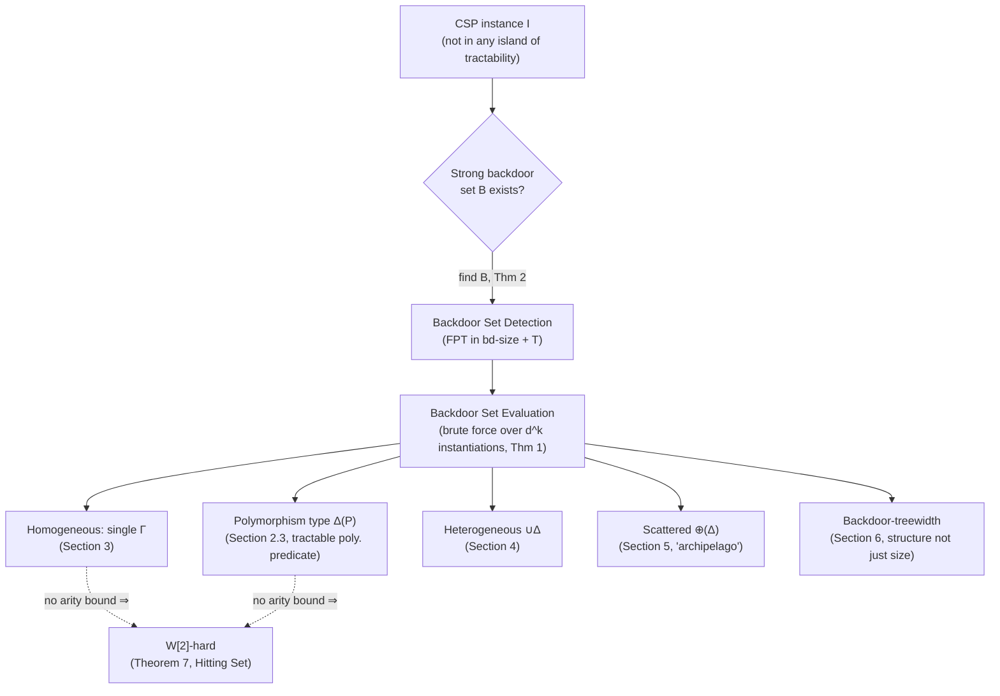

# Backdoor Sets and Fixed-Parameter Tractability

[[book-guidelines|↩ Back to guidelines]]

## 1. The problem: tractability is an island, not a continent

Every earlier chapter of this book is, in one way or another, about drawing a boundary: fix a constraint language $\Gamma$, and either $\mathrm{CSP}(\Gamma)$ is solvable in polynomial time or it's NP-complete (Schaefer's theorem for $|D|=2$, Bulatov's for $|D|=3$, and — conjecturally, per Feder–Vardi — for every finite domain). These are "islands of tractability": fixed, sharply-bounded regions of instance-space where a polynomial algorithm exists.

The trouble is what happens the moment your actual instance isn't *on* the island. A real CSP instance you're handed — say, from a program-verification query — usually isn't purely a 2-SAT instance, purely Horn, purely affine. It might be *almost* one of these, with a handful of variables or constraints that don't fit the pattern. Classical tractability theory has nothing to say about "almost": either the whole instance is in $\mathrm{CSP}(\Gamma)$, or the guarantee evaporates and you're back to worst-case NP-hardness.

Backdoor sets are the chapter's answer to "almost." The idea, due to Williams, Gomes, and Selman (originally for SAT), is disarmingly simple: instead of asking whether the *whole* instance sits inside a tractable class $H$, ask whether there's a *small* set of variables $B$ such that fixing those variables — trying all possible assignments to them — always (or sometimes) drops the *rest* of the instance into $H$. If such a $B$ exists and is small, you've found a way to reduce the hard instance to a bounded number of easy ones.

**What breaks without this idea:** without a distance measure to a tractable class, "close to tractable" is meaningless — you either match the pattern exactly or you're stuck doing brute-force search over the entire instance, which is exponential in $|I|$. Backdoor sets replace that "exponential in $|I|$" with "exponential in $|B|$ only," and $|B|$ can be tiny (constant, or logarithmic, or simply "small in practice") even when $|I|$ is huge. This is precisely the shape of *fixed-parameter tractability* (FPT), and the chapter's project is to work out exactly when this promise can be kept — both for *using* a backdoor set once you have one, and for *finding* one in the first place.

## 2. Strong and weak backdoor sets, formally

First, the book's precise vocabulary for CSP instances (Section 2.1), because the backdoor definitions are stated directly in these terms and the notation recurs throughout:

- A **constraint** of arity $\rho$ over a domain $D$ is a pair $C = (S, R)$ where $S = (x_1,\dots,x_\rho)$ is a sequence of variables and $R \subseteq D^\rho$ is the relation of allowed tuples. $\mathrm{var}(C) = \{x_1,\dots,x_\rho\}$ is the constraint's *scope*.
- A **CSP instance** $I$ is a finite set of constraints; it is *satisfiable* if some assignment $\alpha$ satisfies every constraint in $I$ simultaneously.
- Given an assignment $\alpha: X \to D$ and a constraint $C=(S,R)$, the **restriction** $C|_\alpha$ deletes every tuple of $R$ inconsistent with $\alpha$ on the variables in $X \cap S$, then drops those now-fixed coordinates. Applying this to every constraint of $I$ gives $I|_\alpha$ — the reduced instance with the backdoor variables "cut away." This is the single mechanical operation the whole chapter is built on: *instantiate a few variables, and look at what's left.*

With that in hand, let $H$ be any class of CSP instances (an island of tractability, or something more general — see §4 below).

> A set $B$ of variables of $I$ is a **strong $H$-backdoor set** if for *every* assignment $\alpha: B \to D$, the reduced instance $I|_\alpha \in H$.
>
> $B$ is a **weak $H$-backdoor set** if there is *at least one* assignment $\alpha: B \to D$ such that $I|_\alpha \in H$ *and* $I|_\alpha$ is satisfiable.

The difference matters operationally, not just definitionally. With a strong backdoor set of size $k$ over a domain of size $d$, you can decide satisfiability of $I$ outright: enumerate all $d^k$ instantiations of $B$, solve each reduced instance in $H$ (which is tractable by assumption), and $I$ is satisfiable iff at least one reduced instance is. Every branch is guaranteed to land in $H$, so this is a complete decision procedure.

With a *weak* backdoor set, you only know that *some* instantiation lands you in $H$ and is satisfiable — you don't know which one, and instantiations that don't land in $H$ tell you nothing (the instance might still be satisfiable via them, just not through the tractable machinery). So finding a satisfying assignment via a weak backdoor still forces you to try instantiations and test each reduced instance's membership in $H$ and satisfiability — you get a certificate of *satisfiability* efficiently once you succeed, but you cannot certify *unsatisfiability* this way, because a "no" answer from every reduced instance doesn't rule out a satisfying assignment through branches outside $H$. The chapter's technical results (and this article) focus almost entirely on *strong* backdoor sets, precisely because they give a full decision procedure, not just a one-sided search heuristic.

Either way, the total work is
$$
d^{k}\cdot p(|I|)
$$
where $p$ is the polynomial running time of the tractable algorithm for $H$. This is exponential — but only in $d$ and $k$, never in $|I|$. That specific shape is the technical meaning of **fixed-parameter tractable (FPT)**: a running time $f(k)\cdot |I|^{O(1)}$ for *some* computable $f$, however fast-growing, as opposed to $|I|^{f(k)}$ (where even the *degree* of the polynomial grows with $k$ — much worse for practical $k$ in the tens or hundreds). The book stresses this distinction is not cosmetic: $2^k \cdot n^3$ stays fast for $k=30, n=10^6$; $n^{30}$ never will.

## 3. Two separate questions, and why detection is the hard one

The backdoor approach factors into two independent subproblems:

```
Strong H-Backdoor Set Evaluation
  Input:  CSP instance I, a strong H-backdoor set B for I.
  Output: Is I satisfiable?

Strong H-Backdoor Set Detection
  Input:  CSP instance I, integer k.
  Output: A strong H-backdoor set of size ≤ k, or "none exists."
```

Evaluation is the "use it" half — and as shown above, it's essentially free once you know $B$: instantiate and solve. **Detection is the hard half.** You don't get handed a backdoor set; you have to search for one, and the naive search is $\binom{|\mathrm{var}(I)|}{k}$ candidate sets — polynomial in $|I|$ for fixed $k$, but with a horrendous exponent. The chapter's central technical contribution is showing, for a sequence of increasingly general base classes $H$, that detection can be made properly FPT: exponential *only* in $k$ (and sometimes a couple of other structural parameters, never in $|I|$).

The generic machinery (Section 2.5) that makes this work rests on two properties of $H$, parameterized by a set of auxiliary parameters $T \subseteq \{\texttt{arity}, \texttt{dom}, \texttt{bd-size}\}$:

- $H$ is **$T$-tractable** if there's an FPT algorithm (parameterized by $T$) solving every instance already known to be in $H$.
- $H$ is **$T$-detectable** if there's an FPT algorithm $A_H$ (parameterized by $T$) that, given $I$ and a candidate partial backdoor set $B$, either confirms $B$ is a strong $H$-backdoor set, or — crucially — returns a small "blame" set $Q$ of variables *disjoint from $B$*, with the guarantee that *every* strong $H$-backdoor set extending $B$ must contain at least one variable of $Q$.

**Theorem 1** (evaluation): $T$-tractability of $H$ gives FPT evaluation parameterized by $T \cup \{\texttt{dom}, \texttt{bd-size}\}$ — just the brute-force $d^{|B|}$ enumeration described above.

**Theorem 2** (detection): $T$-detectability of $H$ gives FPT *detection* parameterized by $T \cup \{\texttt{bd-size}\}$, via a branching algorithm: start with $B=\emptyset$; run $A_H$; if it confirms $B$ works, done; otherwise branch on each variable $q$ in the returned $Q$, recursing with $B \cup \{q\}$, until $|B|=k$. Because $Q$'s size is bounded purely as a function of $T$ (not of $|I|$), the branching factor is bounded, and the recursion depth is at most $k$ — so the total number of recursive calls, and hence the running time, is a function of $T \cup \{k\}$ times a polynomial, i.e. FPT.

This is the chapter's real engine. Every subsequent result in the chapter is "here's a base class $H$, here's why it's $T$-detectable (usually via an explicit $A_H$ and an explicit correctness argument for the $Q$-set), therefore Theorem 2 applies." Once you internalize this branching scheme, most of the chapter's theorems read as instantiations of the same template rather than independent proofs — which is exactly the payoff of a parameterized-complexity framework: the hard combinatorial work (constructing $A_H$ and proving the "blame set" property) is isolated per base class, while the search strategy that turns local detectability into global FPT-detection is proved *once*.

## 4. Homogeneous base classes: backdooring into a single language

The simplest case: $H = \mathrm{CSP}(\Gamma)$ for one fixed constraint language $\Gamma$ (Section 3). Here $H$ is $\emptyset$-tractable exactly when $\Gamma$ is *globally tractable* (there's a poly-time algorithm for $\mathrm{CSP}(\Gamma)$) — that's just Theorem 1 with $T=\emptyset$.

For detection, the book gives a clean, concrete $A_H$ (Lemma 3): given $B$, check every constraint $C=(S,R)$ of $I$ and every assignment $\alpha$ of $B \cap S$ — does $C|_\alpha$'s relation lie in $\Gamma$? If some constraint fails this test under some $\alpha$, that failing constraint's scope $S \setminus B$ *is* the blame set $Q$: any backdoor set extending $B$ but avoiding all of $S\setminus B$ would still be exposed to the same bad instantiation $\alpha$ on that same constraint, so it can't be a valid backdoor set. This gives

> **Theorem 4.** Strong $\mathrm{CSP}(\Gamma)$-Backdoor Set Detection is FPT parameterized by $\{\texttt{arity}, \texttt{bd-size}\}$, for every *efficiently recognizable* $\Gamma$ (i.e. membership testing is poly-time — automatic if $\Gamma$ is finite).

and, combining evaluation and detection:

> **Corollary 5/6.** CSP is FPT parameterized by $\{\texttt{arity}, \texttt{dom}, \texttt{bd-size}_H\}$ for any efficiently recognizable, globally tractable $\Gamma$ — collapsing to the single parameter $\texttt{bd-size}_H$ when $\Gamma$ is finite (a finite language has bounded arity and domain by construction, so those two parameters become fixed constants, not part of the input).

**What breaks without the arity bound.** It's tempting to hope the parameter list can be trimmed to just $\texttt{bd-size}$ — after all, "small backdoor set" is the intuitive notion of closeness. The chapter shows this hope is false in general, via a genuinely sharp reduction (Theorem 7): for *any* tractable, idempotent polymorphism $\varphi$ (recall from the Algebraic Approach chapter: $\varphi$ idempotent means $\varphi(d,\dots,d)=d$), detecting a strong $\mathrm{CSP}(\varphi)$-backdoor set is W[2]-hard parameterized by $\texttt{bd-size}$ alone — even over the Boolean domain, where you might expect things to be easiest.

The construction is worth walking through because it's a genuinely instructive reduction, not just a citation. It reduces from **Hitting Set** (given a universe $U$, a family $\mathcal F$ of subsets, and $k$: is there $H\subseteq U$, $|H|\le k$, meeting every set in $\mathcal F$? — a canonical W[2]-hard problem). The key gadget is a **Boolean barrier**: a small set $\lambda$ of Boolean tuples such that some sequence from $\lambda$, fed into $\varphi$ coordinatewise, produces a tuple *outside* $\lambda$ — witnessing that $\varphi$ doesn't preserve this particular tiny relation. Every tractable $\varphi$ *must* have such a barrier (otherwise every Boolean relation, hence every Boolean CSP instance, would be $\varphi$-closed and thus polynomial-time solvable for *all* of NP — contradiction unless $P=NP$), and its size is bounded purely by $\varphi$'s arity, independent of the CSP instance.

The reduction builds one constraint $R(F)$ per set $F\in\mathcal F$, whose scope includes both a fresh "output" gadget of variables *and* the variables $\{x_u : u \in F\}$; the constraint's relation is engineered so that a constraint is $\varphi$-closed if and only if enough of its rows have been removed, and removing rows happens precisely when $B$ hits $F$. A hitting set of size $k$ becomes a backdoor set of size $k$ and vice versa — the domain stays Boolean, only the *arity* of the constraints (tied to $|F|$) grows unboundedly across the family $\mathcal F$. This is exactly why arity can't be dropped as a parameter: unbounded arity is what lets the reduction smuggle in Hitting Set's combinatorics. A parallel result (**Theorem 19**) shows the same W[2]-hardness (parameterized by $\{\texttt{arity},\texttt{bd-size}\}$ this time — dropping *domain* now instead) for the concrete classes $\mathrm{MINMAX}$, $\mathrm{MAJ}$, $\mathrm{AFF}$, $\mathrm{MAL}$ even restricted to arity-2 instances, showing the hardness isn't an artifact of exotic operations — it hits the textbook tractable classes too.

## 5. Base classes defined by polymorphism *types*

A single $\Gamma$ is a narrow target. Section 2.3 generalizes to **base classes defined by polymorphism types** — instead of "closed under this one specific operation," ask for "closed under *some* operation of this *kind*." Formally, a **tractable polymorphism predicate** $P$ is a predicate on operations $\varphi$ satisfying three axioms:

- **N1** (bounded arity): some constant $c(P)$ bounds the arity of every $\varphi$ satisfying $P$, uniformly over all domains.
- **N2** (efficiently checkable): whether $P(\varphi)$ holds can be verified in polynomial time by testing $\varphi$ on all $|D|^{c(P)}$ tuples.
- **N3** (tractability guarantee): every $\varphi$ satisfying $P$ is a tractable polymorphism.

$\Delta(P)$ then denotes *all* constraint languages closed under *some* operation satisfying $P$ — a potentially infinite family of languages, unified by one algebraic signature. This is exactly how the classes $\mathrm{VAL}$ (constant polymorphism), $\mathrm{MINMAX}$, $\mathrm{MAJ}$ (majority), $\mathrm{AFF}$ (minority/affine), $\mathrm{MAL}$ (Mal'cev) — and, the chapter notes, much richer families like semilattice operations, $k$-ary near-unanimity operations, $k$-ary edge operations, and even "belongs to a tractable algebraic variety" — are captured.

The reason axiom N1 matters operationally: because arity is uniformly bounded, **there are only finitely many operations on a fixed finite domain $D$ satisfying $P$** — at most $d^{d^{c(P)}}$ of them (**Lemma 14**), and this whole finite set can be *computed* in time FPT in $|D|$. That single finiteness fact is what makes the rest of the section's machinery go through cleanly:

- **Lemma 15:** $\mathrm{CSP}(\Delta(P))$ is $\{\texttt{dom}\}$-tractable — compute all valid $\varphi$'s, test instance-closure under each (cheap, since N2 makes per-$\varphi$ testing poly-time), and if any succeeds, solve via N3's tractability guarantee.
- **Lemma 16 / Theorem 17:** $\mathrm{CSP}(\Delta(P))$ is $\{\texttt{arity},\texttt{dom},\texttt{bd-size}\}$-detectable, by essentially the same $A_H$ construction as the single-language case (§4), but run once per candidate $\varphi$ in the finite pool from Lemma 14.
- **Corollary 18:** CSP is FPT parameterized by $\{\texttt{arity},\texttt{dom},\texttt{bd-size}_{\mathrm{CSP}(\Delta(P))}\}$ for *any* tractable polymorphism predicate $P$ — a single theorem subsuming an infinite family of concrete tractable classes.

And the earlier hardness result (Theorem 7) shows none of the three parameters is droppable in general — since a predicate that holds for exactly one idempotent operation is trivially a valid tractable polymorphism predicate, the same W[2]-hardness against $\{\texttt{bd-size}, \texttt{dom}\}$ transfers immediately.

## 6. Heterogeneous and "archipelago" (scattered) base classes

Sections 4–6 push generality further in two distinct directions, and this is where the chapter's title metaphor really earns its keep.

**Heterogeneous classes.** Given a *set* $\Delta$ of tractable languages, let $\mathrm{CSP}(\Delta) = \bigcup_{\Gamma\in\Delta}\mathrm{CSP}(\Gamma)$: an instance qualifies if *some* language in the set covers it — different instantiations of the backdoor may land in *different* members of $\Delta$. The payoff is real: **Proposition 8** constructs, for every $n$, an instance with a strong $\mathrm{CSP}(\{\varphi_{\min},\varphi_{\max\!j}\})$-backdoor set of size *one*, while every strong backdoor set into *either* operation *alone* needs size $\ge n$. Concretely: half the constraints (the $\mathrm{MAJ}$-type ones) are closed under $\varphi_{\min}$ but not $\varphi_{\max\!j}$; the other half ($\mathrm{MIN}$-type) is closed under $\varphi_{\max\!j}$ but not $\varphi_{\min}$; a single shared variable $x$, when set to $0$, makes the whole instance $\varphi_{\min}$-closed, and when set to $1$, makes it $\varphi_{\max\!j}$-closed. Neither operation alone can absorb both halves — you need the *union*.

Detecting heterogeneous backdoors uses **Lemma 9**: if instantiating $B$ produces a reduced instance outside *every* language of $\Delta$, the blame set is the union, across all $\Gamma\in\Delta$, of the scope of some $\Gamma$-violating constraint — a direct generalization of the single-language argument. This yields FPT detection for any *finite* set $\Delta$ of finite languages (Theorem 12/Corollary 13), and — reusing the finiteness trick from §5 — for $\Delta(P)$ generated by a tractable polymorphism predicate too (already covered above, since $\Delta(P)$ is exactly a heterogeneous class in this sense).

**Scattered ("archipelago") classes.** The most structurally interesting generalization (Section 5): instead of requiring the *whole* reduced instance to fit one language, allow it to split into **variable-disjoint connected components**, each independently landing in *some* (possibly different) language of $\Delta$. Formally $\oplus(\Delta)$ collects instances $I$ where every connected component $I'$ lies in $\mathrm{CSP}(\Gamma)$ for some $\Gamma \in \Delta$. **Proposition 20** shows this buys *even more*: a backdoor set of size *zero* suffices for an instance where a heterogeneous backdoor needs size $\ge n$ — because once the MAJ-type and MIN-type constraints don't share any variable at all (unlike Proposition 8, where they all shared $x$), the instance is simply *already* a disjoint union of pieces individually closed under $\varphi_{\min}$ or $\varphi_{\max\!j}$; no instantiation is even needed.

This is genuinely the "archipelago" picture the chapter's related work implicitly evokes: rather than one continuous coastline of tractability, the instance may consist of many small tractable islands connected only through the backdoor variables — and the backdoor set's job is to be exactly the connective tissue holding the archipelago together.

Detecting scattered backdoor sets (**Theorem 22**) is substantially harder algorithmically than anything before it in the chapter — the book only sketches the machinery (full proof is off-loaded to the source papers), but the ingredients named are genuinely heavyweight parameterized-algorithms tools: **iterative compression** (grow the instance while compressing a slightly-too-large "old" solution into a target-sized one, rather than building the solution from scratch), a bespoke **inseparability**/separator argument extending graph-separator techniques to CSP, and a **pattern replacement** technique in the spirit of protrusion replacement combined with important-separator sequences. The result, though: FPT detection parameterized purely by backdoor size, for finite $\Delta$ closed under assignments (a natural technical condition — Lemma 21 — ensuring a partially-built backdoor set never gets invalidated as more variables are added to it).

**Backdoor-treewidth (Section 6).** The chapter's final generalization changes what "small" even means for a backdoor set. Take a strong backdoor set $X$ into a single language $\Gamma$, and build its **torso graph** $\mathrm{torso}_I(X)$: vertices are $X$; an edge connects $x,y\in X$ if they co-occur in some constraint's scope, *or* if they're both touched by constraints in the same connected component of $I - X$ (the instance with $X$ deleted). The **backdoor-treewidth** of $I$ w.r.t. $\Gamma$ is the minimum, over all strong $\mathrm{CSP}(\Gamma)$-backdoor sets $X$, of the treewidth of $\mathrm{torso}_I(X)$. This lets you exploit backdoor sets that are *large* in raw cardinality but have simple internal structure — the earlier machinery only ever cared about $|X|$, but a backdoor set of size 500 with torso-treewidth 3 is still algorithmically cheap via standard tree-decomposition dynamic programming, whereas the size-based bound $d^{500}$ would be hopeless. **Theorem 25/Corollary 26** establish FPT detection and solvability parameterized by backdoor-treewidth, for finite (#-)tractable $\Gamma$, via a new notion of "boundaried CSP instances" and a recursive-understanding-based replacement framework — again sketched rather than proved in full here, but the conceptual move (parameterize by *structure*, not just *size*, of the modulator) is the chapter's most forward-looking idea, and it's the one flagged in the Conclusion as the most promising direction for future work.

## 7. A note on scope: what this chapter does *not* cover

The book-guidelines' Topic List entry for this chapter lists "Above-guarantee parameterization" alongside backdoor sets. That's a mismatch worth flagging explicitly rather than silently papering over: above-guarantee parameterization (satisfy $\ge m/2 + k$ clauses of a MaxSAT instance, rather than $\ge k$ outright) is the subject of a *different* chapter in this volume — "Parameterized Constraint Satisfaction Problems: a Survey" (Chapter 7, pp. 179–203) — and Chapter 5's actual text (pp. 137–157, reproduced above in full) never mentions it. Backdoor-set size and "distance above a satisfiability guarantee" are two genuinely different parameterizations of CSP-adjacent problems that happen to share the FPT framing; conflating them would manufacture a connection the source material doesn't make. If above-guarantee parameterization is of interest, it deserves its own article grounded in Chapter 7's actual text.

## 8. Grounding the mechanism in code

### Rust: the generic detection algorithm

The branching algorithm behind Theorem 2 is short enough to write essentially verbatim. What it needs from a base class $H$ is exactly the $A_H$ oracle contract: check-or-blame.

```rust
use std::collections::HashSet;

type VarId = usize;

/// The A_H oracle contract (Section 2.5): given a partial backdoor set B,
/// either confirm it's a strong H-backdoor set, or return a nonempty
/// "blame" set Q disjoint from B such that every strong H-backdoor set
/// extending B must contain at least one variable of Q.
trait BackdoorOracle {
    fn check(&self, instance: &CspInstance, backdoor: &HashSet<VarId>) -> OracleVerdict;
}

enum OracleVerdict {
    IsBackdoorSet,
    Blame(Vec<VarId>), // Q from Theorem 2 / Lemma 3 / Lemma 9
}

/// Theorem 2's branching search: FPT in |T| ∪ {bd-size} whenever the
/// oracle's blame sets are bounded by a function of T alone.
fn detect_strong_backdoor<O: BackdoorOracle>(
    instance: &CspInstance,
    oracle: &O,
    k: usize,
) -> Option<HashSet<VarId>> {
    fn recurse<O: BackdoorOracle>(
        instance: &CspInstance,
        oracle: &O,
        backdoor: &mut HashSet<VarId>,
        budget: usize,
    ) -> bool {
        match oracle.check(instance, backdoor) {
            OracleVerdict::IsBackdoorSet => true,
            OracleVerdict::Blame(q) if budget == 0 => false,
            OracleVerdict::Blame(q) => q.into_iter().any(|var| {
                backdoor.insert(var);
                let found = recurse(instance, oracle, backdoor, budget - 1);
                if !found {
                    backdoor.remove(&var); // undo before trying the next branch
                }
                found
            }),
        }
    }
    let mut backdoor = HashSet::new();
    recurse(instance, oracle, &mut backdoor, k).then_some(backdoor)
}
```

The recursion depth is bounded by `k`; the branching factor per node is `|Q|`, which the *oracle's* design (Lemma 3's scope-based `Q`, or Lemma 9's union-of-scopes `Q`) guarantees is a function of the structural parameters (`arity`, `dom`, …) alone — never of `instance.len()`. That's the whole FPT argument, made mechanical: the exponential blowup lives entirely in the recursion tree's branching factor and depth, both parameter-bounded, while every node does polynomial work.

A concrete `BackdoorOracle` for the homogeneous case (§4, Lemma 3) checks each constraint against $\Gamma$-membership after restriction:

```rust
fn check_homogeneous(
    instance: &CspInstance,
    backdoor: &HashSet<VarId>,
    in_language: impl Fn(&Relation) -> bool, // efficient recognizer for Γ
) -> OracleVerdict {
    for constraint in &instance.constraints {
        let scoped_backdoor: Vec<VarId> = constraint
            .scope
            .iter()
            .copied()
            .filter(|v| backdoor.contains(v))
            .collect();
        for assignment in all_assignments(&scoped_backdoor, instance.domain_size) {
            let restricted = constraint.restrict(&assignment); // this is C|_α
            if !in_language(&restricted.relation) {
                // Blame set = scope(C) \ B, per Lemma 3's proof.
                let blame: Vec<VarId> = constraint
                    .scope
                    .iter()
                    .copied()
                    .filter(|v| !backdoor.contains(v))
                    .collect();
                return OracleVerdict::Blame(blame);
            }
        }
    }
    OracleVerdict::IsBackdoorSet
}
```

Note how directly this tracks the book's proof: the blame set isn't a heuristic — it's *provably correct*, because any backdoor set containing $B$ but missing every variable of `scope(C) \ B` would still expose the *same* constraint $C$ to the *same* bad assignment $\alpha$, by construction.

### Python: why arity, not just size, has to be paid for

A minimal illustration of Theorem 7's Hitting-Set-to-backdoor reduction shape — small enough to run by hand — makes the arity dependence concrete rather than abstract:

```python
# A toy "Boolean barrier": a relation R on 2 tuples such that applying
# phi = AND coordinatewise to (0,1) and (1,0) produces (0,0) ∉ R.
R = {(0, 1), (1, 0)}
def phi_and(a, b):
    return tuple(x & y for x, y in zip(a, b))

t1, t2 = (0, 1), (1, 0)
assert phi_and(t1, t2) not in R          # (0,0) is not in R: AND breaks R

# Every set F in the Hitting Set instance becomes one constraint whose
# relation contains |F| copies of R's rows, tagged by which u in F they
# "belong" to. Removing one row (by hitting u) is what collapses the
# relation down to size < |R|, at which point idempotence trivially
# makes it phi-closed (a singleton relation is always closed under an
# idempotent operation). This scaling with |F| is exactly the arity
# blowup the theorem needs -- no bound on arity, no reduction.
```

### Lean: stating the oracle contract as a type

This chapter's material is combinatorial search, not elaboration or unification — so, per the style guide's own rule, it's worth saying plainly rather than forcing a strained analogy: there is no natural correspondence here to `isDefEq` or metavariable resolution. Where Lean *is* useful is as a precise, checkable statement of the correctness invariant Theorem 2 relies on — the kind of thing you'd want your own CSP kernel's oracle trait to satisfy provably, not just empirically:

```lean
-- The correctness contract an A_H implementation must satisfy (Section 2.5):
-- if `check` reports a blame set Q, every strong H-backdoor set B' ⊇ B
-- of `instance` must intersect Q.
structure BackdoorOracleCorrect (H : CspInstance → Prop) where
  check : CspInstance → Finset VarId → Except (Finset VarId) Unit
  -- `Except.error Q` is the "blame" branch; `Except.ok ()` confirms B ∈ backdoors.
  sound : ∀ (I : CspInstance) (B Q : Finset VarId),
    check I B = Except.error Q →
    ∀ (B' : Finset VarId), B ⊆ B' → IsStrongBackdoor I H B' → ¬ Disjoint B' Q
```

Stated this way, `Theorem 2`'s branching search becomes a generic function polymorphic in any `BackdoorOracleCorrect H` — precisely mirroring the Rust `trait` above, but with the blame-set correctness property carried as a proof obligation rather than an implicit invariant. This is the same pattern your project's CSP kernel will eventually need for *any* search procedure whose pruning steps (not just backdoor detection — arc-consistency propagation, conflict-driven clause learning) must be trusted without re-verifying every run.

## 9. Where this leads



This chapter's material sits squarely in the `sat-smt-csp` focus area, and it bears directly on the CSP kernel envisioned for the compiler project: a kernel searching for concrete counterexamples that break refinement-type invariants is, in essence, running exactly the kind of search this chapter formalizes — trying to certify that a hard verification-condition instance is either satisfiable (a real bug) or provably not, by exploiting whatever small structural handle the instance actually has. The backdoor-set framework gives a principled answer to "how much of this instance is actually hard," which is a more useful diagnostic than a flat NP-hardness shrug when the kernel needs to decide whether to fall back to full search or to exploit a detected tractable substructure (e.g. an instance that's "almost" affine, or "almost" 2-SAT, after fixing a handful of integer-valued program variables).

More concretely, three connections are worth naming explicitly:

- **The `check`-or-`blame` oracle pattern (Section 2.5)** is a direct template for how a constraint-propagation engine should report failure: not just "unsatisfiable here," but "here is the minimal set of additional variables that any fix must touch" — precisely the shape of a *conflict clause* in CDCL-style SAT/SMT solving, and the shape a Craig-interpolation-based refinement step needs too.
- **Tractable polymorphism predicates (Section 2.3)** are the direct bridge from this chapter back to [[The-Algebraic-Approach-to-CSP|the Algebraic Approach to CSP]] chapter's clones and Galois connection: a backdoor target defined by "closed under some near-unanimity/Mal'cev/semilattice operation" is exactly leveraging the algebraic classification machinery from that chapter as a *search target*, not just a classification tool.
- **Backdoor-treewidth (Section 6)** connects to the same structural-tractability vocabulary (torso graphs, treewidth, tree decompositions) that shows up throughout static-analysis and model-checking work on control-flow and dependency graphs — a reminder that "small parameter" for FPT purposes doesn't have to mean small cardinality; it can mean simple shape.

The chapter's own Conclusion names exactly this kind of extension — backdoor sets into *structurally* defined base classes, and parameterizing by structural properties of the backdoor set itself rather than raw size — as the open direction. For a CSP kernel meant to support both bug-finding (concrete counterexamples) and abstract-interpretation-style soundness arguments, that's the more relevant frontier than the size-only results this chapter mostly proves.
