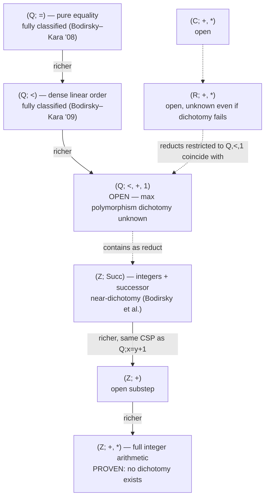
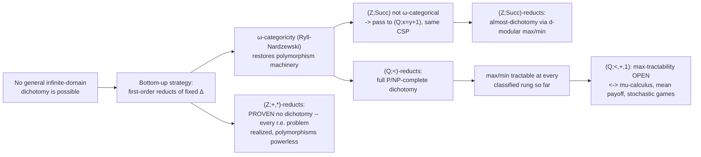

# CSP over Infinite and Numeric Domains

[[book-guidelines|↩ Back to guidelines]]

## Why this chapter exists: the classification machine hits an infinite wall

Everything the earlier chapters of this book build — the algebraic approach, polymorphism clones, [[Absorption-Theory|absorption theory]] — is aimed at one target: for every *finite*-domain constraint language $\Gamma$, decide whether $\mathrm{CSP}(\Gamma)$ is in P or NP-complete. That project now has a positive answer (the Feder–Vardi dichotomy, proved by Bulatov and Zhuk in 2017/2020). The proof works because finiteness of the domain is load-bearing at almost every step: polymorphism clones are searched by finite algorithms, "Taylor terms" are found by pigeonholing over a finite algebra, and absorption arguments repeatedly appeal to "finitely many subuniverses."

Take the domain away and the entire machine stalls before it starts. Chapter 3 opens with a blunt structural fact:

> When the template $\Gamma$ might have an infinite domain, there is no hope for a complete classification of the complexity of $\mathrm{CSP}(\Gamma)$ in general: every computational problem is equivalent (under polynomial-time Turing reductions) to a problem of the form $\mathrm{CSP}(\Gamma)$.

This is not a soft warning — it is a theorem (Bodirsky–Grohe, cited as [16]). If you're building a CSP kernel and you naively let your constraint templates range over arbitrary infinite domains, you have — provably — signed up to solve the halting problem as a special case. So the entire chapter is not "let's generalize the finite-domain theory," it's "given that a *general* theory is mathematically impossible, what's the largest *honest* piece of ground we can still classify?" The answer is a **bottom-up strategy**: fix one simple, well-understood infinite structure $\Delta$ (the rationals with their order, the integers with a successor relation, …), and classify only the CSPs of structures whose relations are *first-order definable* in $\Delta$. This buys back exactly the finiteness the machine needs — not finiteness of the domain, but finiteness of a *model-theoretic invariant* of the domain (the number of orbits of $k$-tuples), via a theorem of Ryll-Nardzewski. That single idea — $\omega$-categoricity as the infinite-domain surrogate for "the domain is finite" — is the spine of this whole chapter, and it's worth understanding deeply before any of the specific classification results make sense.

**What breaks without a bottom-up strategy:** if you try to classify "$\mathrm{CSP}(\Gamma)$ for arbitrary infinite $\Gamma$" directly, you are trying to characterize the boundary of a set (P vs. everything-else) that is known to be *all of computability theory* dressed up as CSP. There is no boundary to find, because the class of infinite-domain CSPs already contains every decision problem. The bottom-up strategy sidesteps this by restricting the *supply* of possible $\Gamma$'s to first-order reducts of one fixed $\Delta$ at a time — a genuinely smaller, structured universe where classification theorems are actually provable.

## 1. The formalism, generalized past finite domains

### 1.1 $\mathrm{CSP}(\Gamma)$ and primitive positive formulas

The definition of $\mathrm{CSP}(\Gamma)$ is unchanged from the finite-domain chapters, but now $\Gamma$ is a relational structure with finite *signature* $\tau$ (finitely many relation symbols) over a domain that can be infinite:

$$\mathrm{CSP}(\Gamma): \text{given a conjunction } R_1(\bar x_1) \wedge \cdots \wedge R_m(\bar x_m) \text{ of atomic } \tau\text{-formulas, is it satisfiable in } \Gamma?$$

The core analytical tool is unchanged too: **primitive positive (pp) formulas**,

$$\exists x_1,\dots,x_n\,(\psi_1 \wedge \cdots \wedge \psi_m),$$

conjunctions of atomic formulas (equality allowed) under existential quantification only — no negation, no disjunction, no universal quantifiers. The **Jeavons–Cohen–Gyssens lemma**, which underlies the entire algebraic approach, is stated and proved for infinite structures exactly as for finite ones:

> If $R$ is pp-definable over $\Gamma$, then $\mathrm{CSP}(\Gamma, R)$ (i.e., $\Gamma$ expanded by $R$) is log-space equivalent to $\mathrm{CSP}(\Gamma)$.

The proof idea transfers unchanged too: substitute $R$'s pp-definition wherever it's used in an instance, introducing fresh ("slack") variables for the existential quantifiers. If you've built a constraint-generation pass for a Hoare-logic verifier, this is exactly the operation you perform when you inline a derived predicate's definition into a verification condition — pp-definability is "this predicate doesn't add expressive power, it's just macro-expanded logic," and that's precisely why it preserves complexity.

### 1.2 Polymorphisms, unchanged in spirit

**Definition 2** (verbatim from the chapter). A function $f: B^k \to B$ *preserves* a relation $R \subseteq B^m$ if for all tuples $(a_1^1,\dots,a_1^m),\dots,(a_k^1,\dots,a_k^m) \in R$, we have

$$\big(f(a_1^1,\dots,a_k^1),\,\dots,\,f(a_1^m,\dots,a_k^m)\big) \in R.$$

$f$ is a *polymorphism* of $\Gamma$ if it preserves every relation of $\Gamma$ — equivalently, $f$ is a homomorphism $\Gamma^k \to \Gamma$. The key fact that makes polymorphisms useful for infinite structures too: **if $R$ is pp-definable in $\Gamma$, then every polymorphism of $\Gamma$ preserves $R$** (this direction requires no finiteness assumption whatsoever). The converse — "$R$ preserved by all polymorphisms of $\Gamma$ $\Rightarrow$ $R$ is pp-definable" — is the part that *does* need a finiteness-like condition, and that's exactly the gap $\omega$-categoricity is built to close (Section 3 below).

A Rust sketch of a polymorphism check — deliberately finite-domain, to make the boundary concrete:

```rust
use std::collections::HashSet;

/// A relation over a *finite sample* of the domain, represented extensionally.
/// This representation is only faithful when the domain (or the relevant
/// fragment of it) is finite — which is exactly the assumption that breaks
/// the moment Gamma's domain is Q, Z, R, or C.
type Tuple = Vec<i64>;
type Relation = HashSet<Tuple>;

/// f: B^k -> B, applied componentwise to k tuples from R, must land back in R.
fn preserves(f: impl Fn(&[i64]) -> i64, k: usize, relation: &Relation) -> bool {
    // For a genuine check we'd need all k-tuples of elements of R (a k-fold
    // Cartesian power) -- here we just illustrate the componentwise application
    // for one witnessing k-tuple of tuples drawn from `relation`.
    for combo in relation.iter().collect::<Vec<_>>().chunks(k) {
        if combo.len() < k { continue; }
        let arity = combo[0].len();
        let mut image = Vec::with_capacity(arity);
        for coord in 0..arity {
            let args: Vec<i64> = combo.iter().map(|t| t[coord]).collect();
            image.push(f(&args));
        }
        if !relation.contains(&image) {
            return false;
        }
    }
    true
}
```

This works because `Relation` is a `HashSet` — an *explicit list of tuples*. That representation is precisely what the chapter identifies as the first real infinite-domain wrinkle: how do you even *write down* a relation like $\{(x,y) \in \mathbb{Q}^2 : x < y\}$, which has infinitely many tuples?

### 1.3 Infinite signatures and the representation problem

This is a subtlety the finite-domain chapters never have to face, and it matters directly for a CSP kernel over numeric domains. The chapter distinguishes two separate sources of "infinity":

1. **Infinite domain** (e.g., $\mathbb{Q}$) — individual relations can't be listed as tuples.
2. **Infinite signature** — even over a fixed domain, a template might need infinitely many relation symbols, e.g. one symbol $R_{a_1,\dots,a_n,c}$ for every rational tuple of coefficients in a linear-programming instance.

The chapter lists four ways to represent relations symbolically, in increasing order of algorithmic usefulness:

1. **First-order definition** in a richer structure $\Delta$ — general but useless for complexity upper bounds: even checking whether a single quantifier-free formula's relation is *empty* can already be NP-hard.
2. **Quantifier-free DNF over $(\mathbb{Q};<)$** — usable because $(\mathbb{Q};<)$ has *quantifier elimination*.
3. **Quantifier-free DNF over $(\mathbb{Z};s)$** (successor) — same idea, with a sharp gotcha: whether an iterated successor term $s^n(x)$ is encoded in *unary* or *binary* changes tractability (see Definitions 38/40 later in the chapter — max-atoms is exactly this kind of trap).
4. **Quantifier-free DNF over $(\mathbb{Q};<,+)$ with binary-coded rational constants** — again licensed by quantifier elimination for this richer structure.

This is the practical lesson for a solver that will host linear/non-linear arithmetic constraints: **the encoding of the constraint language is not a free implementation choice — it is part of the complexity-theoretic statement.** "CSP over $(\mathbb{Q};<,+,1)$ is polynomial" is only true relative to a fixed, quantifier-elimination-backed symbolic representation of its relations; swap in an unrestricted first-order-definition representation and the same problem becomes NP-hard purely from the cost of *parsing* a constraint.

## 2. Three landmark templates: same shape, wildly different complexity

Before any classification theorem, the chapter grounds the reader in concrete examples that show domain choice can be complexity-*irrelevant* or complexity-*decisive*, seemingly at random. This is the phenomenon the rest of the chapter exists to explain systematically.

### 2.1 Hilbert's Tenth Problem as $\mathrm{CSP}(\mathbb{Z}; R_+, R_*, R_{=1})$

$$R_+ = \{(x,y,z) : x+y=z\}, \quad R_* = \{(x,y,z): x\cdot y = z\}, \quad R_{=1} = \{1\}.$$

Any polynomial Diophantine equation reduces to a conjunction of these three atomic relations by introducing one fresh variable per subterm. Matiyasevich (building on Davis–Putnam–Robinson) proved this problem is **undecidable** — not merely NP-hard, genuinely outside the recursive sets. This is the sharpest possible failure of tractability a CSP can exhibit, and it's achieved by a template with *three* relation symbols over the integers.

### 2.2 Linear programming feasibility as $\mathrm{CSP}(\mathbb{Q}; \le, R_+, R_{=1})$

Syntactically almost the same template (drop multiplication, add $\le$, move to $\mathbb{Q}$), but the resulting problem is **polynomial-time solvable** — this is Khachiyan's ellipsoid method, one of the landmark results of 20th-century algorithm design. The chapter's **Lemma 3** shows every linear inequality $a_1x_1+\cdots+a_kx_k \ge a_0$ (with $a_i \in \mathbb{Q}$ in binary) has a pp-definition over $(\mathbb{Q}; \le, R_+, R_{=1})$ of size polynomial in the input — which is exactly why "linear program feasibility" *is* $\mathrm{CSP}(\Gamma_{\text{lin}})$ and not merely reducible to it.

### 2.3 Domain sensitivity, made precise

The chapter states the phenomenon as a direct comparison:

- $(\mathbb{Q}; \le, R_+, R_{=1})$ and $(\mathbb{R}; \le, R_+, R_{=1})$ have **the same CSP** — swapping rationals for reals changes nothing, because the class of satisfiable linear systems is unaffected by which dense ordered field you interpret them in.
- $(\mathbb{Z}; R_+, R_*, R_{=1})$ vs. $(\mathbb{R}; R_+, R_*, R_{=1})$ vs. $(\mathbb{C}; R_+, R_*, R_{=1})$: **wildly different.** Over $\mathbb{Z}$ it's undecidable (Hilbert's 10th). Over $\mathbb{R}$ it's the *existential theory of the reals* — decidable, in PSPACE (Tarski / Canny). Over $\mathbb{C}$ it's even better-behaved computationally (conditionally in the Arthur–Merlin class, assuming GRH — Koiran's theorem).

The intuitive reason integers are so much harder than reals or complex numbers for polynomial constraints: $\mathbb{R}$ and $\mathbb{C}$ are algebraically well-behaved (real-closed / algebraically closed fields with quantifier elimination), so polynomial constraints over them stay within a "tame" geometric category (semialgebraic sets). $\mathbb{Z}$ has none of that structure — it's exactly rich enough to encode arbitrary Diophantine equations, and Diophantine equations can encode the halting problem.

### 2.4 Two tractable integer CSPs worth internalizing

- **Linear Diophantine systems** ($a_1x_1+\cdots+a_kx_k=a_0$ over $\mathbb{Z}$): solvable via the **Smith normal form** of the coefficient matrix — a classical linear-algebra algorithm that simultaneously diagonalizes a matrix over $\mathbb{Z}$ using row/column operations from $GL_n(\mathbb{Z})$.
- **Difference logic** ($x - y \le c$, $c \in \mathbb{Z}$): solvable via **shortest-path computation**. Each constraint $x - y \le c$ becomes a weighted edge $y \to x$ of weight $c$ in a graph; the system is satisfiable iff the graph has no negative-weight cycle, checkable by Bellman–Ford.

A minimal Python illustration of the difference-logic idea — small enough that Rust's ceremony would obscure the point, exactly the kind of "quick illustrative sketch" this book's style calls for:

```python
# Difference logic: x - y <= c  <=>  edge y -> x with weight c.
# Satisfiable iff the constraint graph has no negative-weight cycle.
import math

def difference_logic_satisfiable(n_vars, constraints):
    # constraints: list of (x, y, c) meaning x - y <= c
    INF = math.inf
    dist = [0] * n_vars  # add a virtual source with 0-weight edges to all vars
    for _ in range(n_vars):
        updated = False
        for (x, y, c) in constraints:
            if dist[y] + c < dist[x]:
                dist[x] = dist[y] + c
                updated = True
        if not updated:
            return True  # fixed point reached, no negative cycle
    # one more pass: if anything still improves, there's a negative cycle
    for (x, y, c) in constraints:
        if dist[y] + c < dist[x]:
            return False
    return True
```

This is not a toy: difference logic is exactly the fragment SMT solvers isolate as "QF_IDL" (quantifier-free integer difference logic), used pervasively for scheduling and timing constraints — precisely the kind of numeric sub-theory a CSP kernel backing a refinement-type checker will want a dedicated, non-Diophantine-complexity decision procedure for.

## 3. The bottom-up strategy: first-order reducts

**Definition (first-order reduct).** If $\Gamma$ and $\Delta$ share a domain, and every relation of $\Gamma$ has a first-order definition in $\Delta$ (equality allowed), $\Gamma$ is a *first-order reduct* of $\Delta$. Concretely: take the expansion of $\Delta$ by *all* first-order-definable relations, then keep only finitely many of them (a "reduct" in the classical sense — dropping relations).

This is the chapter's answer to "how do we get a classification theorem out of a class that provably has no general one?" Fix one base structure $\Delta$ that is rich enough to be interesting but poor enough to be tractable to analyze, and only ever ask about $\Gamma$'s that are simpler than $\Delta$ (first-order-definable in it). Since $\Delta$ is fixed once and for all, the class of first-order reducts of $\Delta$ is a genuinely bounded universe, even though it's infinite.



*Reading the diagram:* arrows point toward "more expressive base structure." Classification difficulty does not increase smoothly — $(\mathbb{Q};<)$ is fully solved, one small step up to $(\mathbb{Q};<,+,1)$ is already open, and $(\mathbb{Z};+,*)$ — the natural next rung after $(\mathbb{Z};\mathrm{Succ})$ — is *proven never to have a dichotomy at all*. The bottom-up strategy's promise is only ever "each rung is a well-posed question," not "each rung is answerable" or "difficulty increases gently."

Two rungs of this ladder are classified completely, and they anchor everything else in the chapter:

- **Reducts of the empty structure** $(\mathbb{Q}; \emptyset)$ (Bodirsky–Kára): a countably infinite structure with no relations at all still admits a P/NP-complete dichotomy for its reducts, governed by whether the automorphism group's polymorphisms include a constant or a binary injection (P) versus only injections-composed-with-projections (NP-complete).
- **Reducts of $(\mathbb{Q};<)$** (Bodirsky–Kára, the chapter's central classified case, Section 7 below): complete P/NP-complete dichotomy.

## 4. $\omega$-categoricity: the infinite-domain stand-in for finiteness

This is the chapter's deepest idea, and it's worth building up from first principles rather than starting from the definition.

### 4.1 What actually made the finite-domain algebraic approach work?

Go back to why polymorphisms characterize pp-definability for *finite* $\Gamma$. The (informative) direction of the correspondence — "if $R$ is preserved by every polymorphism of $\Gamma$, then $R$ is pp-definable in $\Gamma$" — is proved (in the finite-domain literature this book surveys elsewhere) via a compactness-style argument that ultimately bottoms out in *finitely searching* a finite structure's automorphisms, endomorphisms, and finitary term operations. Over an infinite domain, there's no finite search space of operations to exhaust — $\mathrm{Pol}(\Gamma)$ can be an enormous, even uncountable, set of functions $\Gamma^k \to \Gamma$.

What you need instead is not finiteness of the domain, but finiteness of *how many essentially different $k$-tuples there are*, for every $k$. That's exactly what $\omega$-categoricity gives you, via a purely model-theoretic characterization:

### 4.2 The Ryll-Nardzewski characterization

> A countably infinite structure $\Gamma$ is $\omega$-categorical if and only if its automorphism group $\mathrm{Aut}(\Gamma)$ has only finitely many **orbits of $k$-tuples**, for every $k \ge 1$.

An orbit of $k$-tuples is an equivalence class under the relation "$\bar a \sim \bar b$ iff some automorphism of $\Gamma$ maps $\bar a$ to $\bar b$ coordinatewise." "Finitely many orbits for every fixed $k$" is a genuine finiteness statement, even though the domain itself is infinite — think of it as "up to symmetry, there are only finitely many $k$-tuple *shapes*," which is exactly the combinatorial handle that lets Ramsey-type and compactness arguments from the finite-domain toolkit go through again.

$(\mathbb{Q};<)$ is the textbook example: any two strictly increasing $k$-tuples of rationals are related by an order-automorphism (a monotone bijection $\mathbb{Q}\to\mathbb{Q}$), so the orbits of $k$-tuples correspond exactly to the finitely many *strict linear orderings with possible ties* that $k$ elements can realize — finitely many patterns, independent of how large the domain is.

A Lean-style formalization of the statement (illustrative — this is a definition/proposition sketch to make the correspondence explicit, not a verified Mathlib excerpt):

```lean
-- A countable structure Γ (domain α) is ω-categorical iff, for every arity k,
-- the automorphism group's action on k-tuples has finitely many orbits.
-- This is literally "finitely many equivalence classes of Fin k → α under Aut(Γ)".

variable (α : Type) [Countable α]
variable (G : Type) [Group G] [MulAction G α]

def OmegaCategorical : Prop :=
  ∀ k : ℕ, Finite (MulAction.orbitRel.Quotient G (Fin k → α))

-- Ryll-Nardzewski (statement only): OmegaCategorical Γ ↔
--   Γ is the unique countable model (up to isomorphism) of its first-order theory.
```

If you've internalized definitional equality in a dependent type checker as "quotienting terms by a congruence," this is the same move one level up: $\omega$-categoricity is quotienting *tuples of the domain* by the automorphism group's action, and demanding the quotient be finite at every arity. The Ryll-Nardzewski theorem says this combinatorial finiteness condition is *equivalent* to a purely syntactic one (categoricity — one countable model up to isomorphism), which is what licenses treating "automorphism orbits" as an effective proxy for "the theory doesn't have too many models to reason about."

### 4.3 Why $(\mathbb{Z};\mathrm{Succ})$ fails, and the fix that saves the theory

$(\mathbb{Z};\mathrm{Succ})$, $\mathrm{Succ} = \{(x,y): x=y+1\}$, is presented as "one of the simplest structures over a numerical domain that is *not* $\omega$-categorical." Its automorphism group is generated by translations $x \mapsto x+k$ — which act transitively on single elements (one orbit of 1-tuples, fine), but on *pairs* $(x,y)$, the orbit of a pair is determined by $y - x \in \mathbb{Z}$, and that's a different orbit for every integer difference. Infinitely many orbits of pairs $\Rightarrow$ not $\omega$-categorical, by Ryll-Nardzewski directly.

**What breaks without the fix:** if you insist on working with $(\mathbb{Z};\mathrm{Succ})$ itself, the polymorphism-clone-vs-pp-definability correspondence simply doesn't hold, and the entire proof strategy that worked for $(\mathbb{Q};<)$ collapses — there might be relations preserved by every polymorphism that are nonetheless *not* pp-definable, so "check the polymorphisms" stops being a sound-and-complete test.

The chapter's fix is elegant: **replace the structure by a different one with the same CSP but richer model-theoretic properties.** Specifically, $(\mathbb{Z};\mathrm{Succ})$ has the *same CSP* as $(\mathbb{Q}; \{(x,y):x=y+1\})$ — same relation, but interpreted over the dense rationals instead of the discrete integers. This new structure *is* $\omega$-categorical (it has quantifier elimination and a well-understood automorphism group, in the same family as reducts of $(\mathbb{Q};<)$), so the polymorphism machinery becomes available again, even though the CSP being classified — as a computational problem — is unchanged. This is a genuinely subtle move: you are not approximating the problem, you are finding an isomorphic-in-complexity but structurally nicer *presentation* of it.

The resulting classification (Theorem 55, due to Bodirsky et al. [24]) is an *almost*-dichotomy: for every first-order reduct $\Gamma$ of $(\mathbb{Z};\mathrm{Succ})$, there is a structure $\Delta$ with the same CSP such that either (1) $\Delta$ is finite-domain (Feder–Vardi applies), (2) $\Delta$ is a reduct of $(\mathbb{Q};=)$ (fully classified), or (3) $\Delta$ is a reduct of $(\mathbb{Z};\mathrm{Succ})$ where $\mathrm{Succ}$ itself is pp-definable — and in that last case, a **$d$-modular max or min polymorphism** decides P vs. NP-complete outright.

## 5. Convexity and the midpoint polymorphism

Here is the chapter's cleanest example of a polymorphism doing exactly the job polymorphisms are supposed to do: turning a geometric property into an algebraic closure condition.

### 5.1 The correspondence

For **semilinear** relations $S \subseteq \mathbb{R}^n$ (finite Boolean combinations of linear inequalities with integer coefficients), the chapter states:

$$S \text{ is convex} \iff S \text{ is preserved by the midpoint operation } (x,y) \mapsto \frac{x+y}{2}.$$

**Why this is true, from first principles:** if $S$ is convex and $p, q \in S$, the entire segment $[p,q]$ lies in $S$ by definition of convexity — the midpoint is trivially in $S$. The converse direction is the interesting one and needs semilinearity, not just midpoint-closure: midpoint-closure alone only guarantees that a *dense* set of dyadic-rational points along $[p,q]$ lie in $S$ (repeatedly bisecting). Semilinearity — $S$ is a finite Boolean combination of half-spaces — then forces the *whole* segment to be in $S$, because a semilinear set can only have finitely many "holes" along any line, and a dense subset of a finite-holed line segment must be the whole segment.

This is a genuinely useful "what breaks without it" moment: **midpoint-closure alone (without semilinearity) does not imply convexity.** You need the syntactic tameness of the relation as well as the algebraic closure property — a lesson that generalizes: polymorphism-based characterizations of geometric properties over infinite domains routinely need a companion "the relation isn't too wild" side-condition (semilinear, semialgebraic, etc.) that has no analogue in the finite-domain theory, where every relation is automatically "tame" by virtue of being finite.

The same argument extends verbatim to **semialgebraic** relations (finite Boolean combinations of polynomial inequalities, Section 5's main object) — this is a real payoff of building the theory around "syntactically tame subsets of a nice geometric category" rather than around arbitrary relations.

### 5.2 A sharper, negative result: essential convexity has *no* polymorphism characterization

The chapter's real dichotomy result (**Theorem 7**, Bodirsky–Jonsson–von Oertzen) is not about plain convexity but **essential convexity** — $S$ is essentially convex if for every $a,b \in S$, the segment $[a,b]$ meets the complement $\bar S$ in only finitely many points (so $S$ is "convex up to finitely many holes"). This is the actual tractability boundary for semilinear expansions of linear programming:

$$\mathrm{CSP}(\mathbb{R}; R_{=1}, R_+, \le, R_1,\dots,R_n) \in \mathrm{P} \iff R_1,\dots,R_n \text{ essentially convex, else NP-complete.}$$

And then comes **Observation 10**, a genuinely striking negative result: *there is no function $f: \mathbb{R}^n \to \mathbb{R}$ such that a semilinear relation $S$ is essentially convex if and only if $f$ preserves $S$.* The proof is a clean injectivity argument: such an $f$ would have to be the identity on its diagonal (by preserving all singletons and the order relation, both essentially convex), and separately would have to be injective (by preserving the essentially-convex relation $x=y \Rightarrow u=v$) — but an injective function whose diagonal restriction is the identity on $\mathbb{R}$ must itself be a bijection $\mathbb{R}^n \to \mathbb{R}$, impossible for $n>1$.

This is the sharpest illustration in the whole chapter of a fact worth internalizing for any constraint-language design: **not every tractability boundary is a polymorphism boundary, even over a well-behaved geometric category.** The remedy the chapter offers is itself instructive — pass to a *non-Archimedean* extension of $\mathbb{Q}$ (the ordered vector space $\mathbb{Q}[\epsilon]$, with $\epsilon$ an infinitesimal smaller than every positive rational), where essential convexity of the standard structure *does* correspond exactly to preservation by an explicit binary operation. This is the same trick as Section 4.3's fix for $(\mathbb{Z};\mathrm{Succ})$ in a different costume: when a CSP-theoretic property resists a polymorphism characterization over the "obvious" structure, look for a richer or differently-saturated structure with the same CSP where the characterization becomes visible again.

## 6. Max and min as polymorphisms over ordered domains

### 6.1 The finite-domain baseline

Jeavons–Cooper's original theorem: if every relation of a finite structure $\Gamma$ (with a fixed total order on its domain) is preserved by $\max$, then $\mathrm{CSP}(\Gamma) \in \mathrm{P}$ — via plain **arc consistency**, run to a fixed point. The chapter is explicit that this is tight: adding *any* non-max-closed relation to the maximal max-closed language makes the CSP NP-complete (Theorem 35). Structurally, $\max$-closure is the special case of a **semilattice polymorphism** (idempotent, commutative, associative binary operation), and Jeavons–Cohen–Gyssens extend tractability to any finite-domain CSP with a semilattice polymorphism.

A pseudocode sketch of the arc-consistency procedure that makes Theorem 34 concrete (and quantitative — $O(c^2 t^2)$ for $c$ constraints each satisfied by at most $t$ tuples):

```rust
/// Arc consistency for a max-closed CSP: iteratively remove domain values
/// that have no supporting tuple in some constraint, until a fixed point.
/// Correctness for max-closed languages (Jeavons-Cooper): this one-sided
/// pruning test is not just sound, it's COMPLETE -- no search needed.
fn arc_consistency(
    domains: &mut Vec<Vec<i64>>,
    constraints: &[(usize, usize, Vec<(i64, i64)>)], // (var_i, var_j, allowed pairs)
) -> bool {
    let mut changed = true;
    while changed {
        changed = false;
        for &(i, j, ref allowed) in constraints {
            let before = domains[i].len();
            domains[i].retain(|&a| {
                domains[j].iter().any(|&b| allowed.contains(&(a, b)))
            });
            if domains[i].len() != before { changed = true; }
            if domains[i].is_empty() { return false; } // unsatisfiable
        }
    }
    true
}
```

### 6.2 Sampling: the bridge from finite to infinite

The chapter's method for lifting Theorem 34 to *infinite* templates is called **sampling** (Bodirsky–Macpherson–Thapper [21]): $\Gamma$ has a sampling procedure if, for every instance $I$, a finite substructure $\Gamma_I \subseteq \Gamma$ can be computed in polynomial time such that $I$ is satisfiable in $\Gamma$ iff it's satisfiable in $\Gamma_I$. If $\Gamma$ additionally has $\max$ as a polymorphism, arc consistency on $\Gamma_I$ decides the instance. This gives P for first-order reducts of $(\mathbb{Q};<)$ and of $(\mathbb{Z};\mathrm{Succ})$ with $\max$ as a polymorphism, and it's the mechanism behind two named results the chapter highlights:

- **Monotone TVPI integer programming** ($ax-by\ge c$): weakly polynomial (Hochbaum–Naor), but the chapter is careful to note this is **NP-complete**, not polynomial, for the *unbounded-coefficient* version (Lagarias) — max-closedness alone does not defeat integer-domain hardness when coefficients aren't bounded, a genuinely counterintuitive gap between finite-domain intuition (max-closed $\Rightarrow$ P, full stop) and the numeric-domain reality (max-closed $\Rightarrow$ only *weakly* polynomial, and can still be NP-complete for the integer analogue).
- **Max-atoms** ($\max(x,y)+c \ge z$): weakly polynomial (Bezem–Nieuwenhuis–Rodríguez-Carbonell), and additionally in $\mathrm{NP}\cap\mathrm{coNP}$ — via an exact equivalence with **mean payoff games**.

### 6.3 The open frontier: max as polymorphism over $(\mathbb{Q};<,+,1)$

This is one of the chapter's headline open problems, and it's worth internalizing precisely why it matters beyond CSP theory. Once the base structure is enriched from $(\mathbb{Q};<)$ to $(\mathbb{Q};<,+,1)$ (order plus addition plus the constant 1), it becomes **open** whether "$\max$ is a polymorphism" still implies polynomial-time tractability. The chapter connects a positive answer to this single open CSP question to solving several famous, seemingly unrelated open problems at once:

- **$\mu$-calculus model checking** (a core problem in verification/model-checking theory),
- **Mean payoff games** (two-player games where a token moves on a weighted graph and players optimize the long-run average edge weight, formalized via Theorem 44's memoryless-strategy result of Ehrenfeucht–Mycielski),
- **Simple stochastic games** (Condon's model, adding random moves).

All three are known to be in $\mathrm{NP}\cap\mathrm{coNP}$ but not known to be in P — exactly like max-atoms itself. This is described in the chapter as "presenting now exactly the same challenge as linear programming did before 1979," i.e., before Khachiyan's polynomial-time algorithm was found — an apt comparison, because the max-atoms/mean-payoff-games cluster is, structurally, the tropical-geometry analogue of linear programming (the "tropical semiring" replaces $(+,\times)$ with $(\max,+)$, and **Theorem 49** identifies the exact finite basis of relations — $\{x=1, x=-1, <, 2x\le y+z, x\le y \vee x\le z\}$ — that generates all max-closed, translation-invariant semilinear relations, giving tropically convex constraints as the honest generalization of linear program feasibility to this setting).

One especially sharp negative fact worth flagging: **max-atoms itself has no polymorphism characterization at all** — the class of semilinear relations preserved by *every* polymorphism of the max-atoms template is strictly larger than the max-atoms-definable relations; it's exactly the *tropically convex* relations (Bodirsky–Mamino). So the open question isn't even "does a known polymorphism condition suffice" — it's "is there a tractability argument at all," using tools well outside the polymorphism toolkit (the chapter's Theorem 52 gives an LP-duality-flavored primal/dual satisfiability alternative instead).

## 7. The proof that no dichotomy exists: reducts of $(\mathbb{Z};+,*)$

Section 9's result is the chapter's most conceptually important negative theorem, because it shows the bottom-up strategy's own promise ("first-order reducts of a fixed base structure give real dichotomy theorems") *fails* once the base structure is rich enough — and it fails at a rung that looks deceptively close to the tractable cases already covered.

### 7.1 The construction

The proof leans on the Davis–Matiyasevich–Putnam–Robinson theorem: **a subset of $\mathbb{Z}$ is recursively enumerable iff it has a pp-definition in $(\mathbb{Z};*,+,1)$.** Given that, the chapter proves:

> For every recursively enumerable problem $P$, there is a first-order reduct $\Gamma$ of $(\mathbb{Z};*,+,1)$ with finite relational signature such that $\mathrm{CSP}(\Gamma)$ is polynomial-time Turing-equivalent to $P$.

The construction (Theorem 57) is a genuinely elegant piece of encoding. It builds a four-relation structure $\Gamma = (\mathbb{Z}; S, D, L_0, N)$ where $S$ encodes "increment," $D$ encodes "double," $N$ picks out $0$, and $L_0$ encodes membership in (a shift of) the r.e. set $L$ coding $P$'s yes-instances — with a "sink" value $-1$ used to absorb variables not participating in the actual computation being encoded. Any CSP instance decomposes, via connected components of a simple constraint graph, into components that are either irrelevant (safely set to $-1$) or that pin down a *unique* integer value via a chain of increment/double constraints — solvable via the two-variables-per-inequality integer-programming algorithm from Section 4.2 — after which the oracle for $P$ is called exactly once per relevant variable.

The reduction runs in both directions: $P$ reduces to $\mathrm{CSP}(\Gamma)$ (encode any target number by repeated doubling/incrementing from 0, a construction that reuses Lemma 3's binary-efficient pp-definition idea), and $\mathrm{CSP}(\Gamma)$ reduces to $P$ (via the oracle algorithm above). Since $P$ ranges over *every* recursively enumerable problem, this single family of structures $\Gamma$ realizes every computability-theoretic difficulty level simultaneously — there is no "boundary" between P and NP-complete to draw, because the class already contains problems of every r.e. Turing degree.

### 7.2 Why the algebraic toolkit is powerless here, explicitly

The chapter ends this section with a sentence that is the real payoff for understanding *why* this negative result matters, not just *that* it holds:

> The universal-algebraic approach fails badly when it comes to analyzing the computational complexity of $\mathrm{CSP}(\Gamma)$ for the structure $\Gamma$ from the proof of Theorem 57: the semi-lattice operation $(x,y) \mapsto \max(x,y)$ preserves $\Gamma$ for all structures $\Gamma$ considered in the previous proof, and from that we cannot draw any consequences for the computational complexity of $\mathrm{CSP}(\Gamma)$.

This is the sharpest possible cautionary tale for a polymorphism-driven mental model: **having a "nice" polymorphism (even $\max$, the polymorphism responsible for most of this chapter's positive results) is not evidence of tractability once the base structure is unrestricted enough.** The reason the finite-domain and $(\mathbb{Q};<)$/$(\mathbb{Z};\mathrm{Succ})$ results work is not "max-closedness is intrinsically powerful" — it's that those base structures are simple enough that max-closedness, combined with sampling or quantifier elimination, actually pins down an algorithm. Once the base structure can simulate arbitrary Turing machines (as $(\mathbb{Z};+,*)$ can, via Diophantine encoding), no algebraic invariant of that weak a kind can possibly separate the tractable reducts from the undecidable ones, because *every* r.e. problem sits inside the same polymorphism-clone equivalence class.

## 8. Synthesis: what this chapter actually establishes

Putting the whole chapter's arc together:

1. **No general theory is possible** for infinite-domain CSP (Bodirsky–Grohe) — this isn't a gap in current knowledge, it's a theorem.
2. **The fix is bottom-up, not top-down**: fix a base structure $\Delta$, classify only its first-order reducts. This is a genuinely different kind of research program than the finite-domain dichotomy — instead of one theorem covering "all finite $\Gamma$," you get a family of theorems, one per choice of $\Delta$, of steadily increasing difficulty as $\Delta$ gets richer.
3. **$\omega$-categoricity (Ryll-Nardzewski)** is the load-bearing model-theoretic substitute for "the domain is finite," and it's why $(\mathbb{Q};<)$-reducts have a full dichotomy while $(\mathbb{Z};\mathrm{Succ})$-reducts need an extra reduction step (replace $\Gamma$ by a same-CSP, richer structure) to recover the algebraic machinery at all.
4. **Geometric tameness classes** (semilinear, semialgebraic) supply the "not too wild" side-condition that infinite-domain polymorphism arguments routinely need and finite-domain arguments get for free — and sometimes (essential convexity) no polymorphism characterization exists even with that side-condition, forcing a shift to non-Archimedean extensions.
5. **$\max$/$\min$** are the chapter's best-behaved infinite-domain polymorphisms, tractable at every classified rung, but the moment the base structure reaches $(\mathbb{Q};<,+,1)$, whether $\max$-closedness still implies tractability becomes equivalent in difficulty to some of the most stubborn open problems in algorithmic game theory.
6. **The ladder has a proven dead end**: reducts of $(\mathbb{Z};+,*)$ contain every recursively enumerable problem, and no polymorphism-based argument can possibly separate them — proof, not conjecture.



## Where this leads

This chapter is the most direct piece of theory in the whole book for a CSP kernel meant to reason about **integer and non-linear equations over refinement-typed programs** — it is, in effect, a map of exactly which numeric-domain fragments of your future solver's input language are safe (polynomial), which are known-hard, which are open research problems you should not accidentally depend on, and which are outright undecidable and must be excluded or over-approximated rather than solved exactly.

Concretely, for the `sat-smt-csp` focus area:

- **Difference logic and linear Diophantine systems** (Section 2.4) are the two integer-arithmetic fragments you get essentially "for free," with textbook polynomial algorithms (shortest paths; Smith normal form) — good defaults for the tractable core of an arithmetic constraint solver.
- **Hilbert's Tenth Problem's undecidability** is a hard boundary: a CSP kernel that allows unrestricted polynomial equality constraints over integers is not merely "hard," it is *provably impossible* to decide in general — this is the theoretical justification for why an abstract-interpretation-style over-approximation (rather than an exact decision procedure) is the only sound option once non-linear integer constraints are in scope, exactly the division of labor this book's own learning goals describe between the CSP kernel (proving bug *presence* via concrete counterexamples) and abstract interpretation (proving bug *absence* via sound over-approximation).
- **The essential-convexity non-polymorphism result** (Section 5.2) and the **max-atoms non-polymorphism result** (Section 6.3) are cautionary tales specifically about *trusting a polymorphism test as a tractability oracle* — directly relevant if the kernel's design leans on algebraic closure properties (as the earlier chapters' finite-domain machinery does) to decide which arithmetic sub-languages get a fast path.
- **The bottom-up methodology itself** — fix a base structure, classify its reducts, and expect the difficulty to jump sharply at some rung rather than increase smoothly — is a good design principle for the kernel's own arithmetic theory hierarchy: don't aim for "one algorithm handles all numeric constraints," aim for a tower of increasingly expressive, separately-justified decision procedures (difference logic, then linear arithmetic via LP/ILP, then restricted non-linear fragments), each with its own explicit tractability proof, exactly mirroring $(\mathbb{Q};<) \to (\mathbb{Q};<,+,1) \to (\mathbb{Z};\mathrm{Succ}) \to (\mathbb{Z};+,*)$.
- **Constraint generation and pp-definability** (Section 1.1) is literally the same operation as inlining a derived predicate into a verification condition — worth keeping in mind as one of this book's recurring `automated-reasoning` threads (constraint generation, Hoare logic) intersecting directly with `sat-smt-csp` machinery here.

The next chapter in this book ([[Hybrid-Tractability|Hybrid Tractability]]) picks up a related but orthogonal question — what happens when *neither* the language nor the domain alone explains tractability — and is worth reading as a complement once this chapter's language-only, numeric-domain classification picture is solid.
