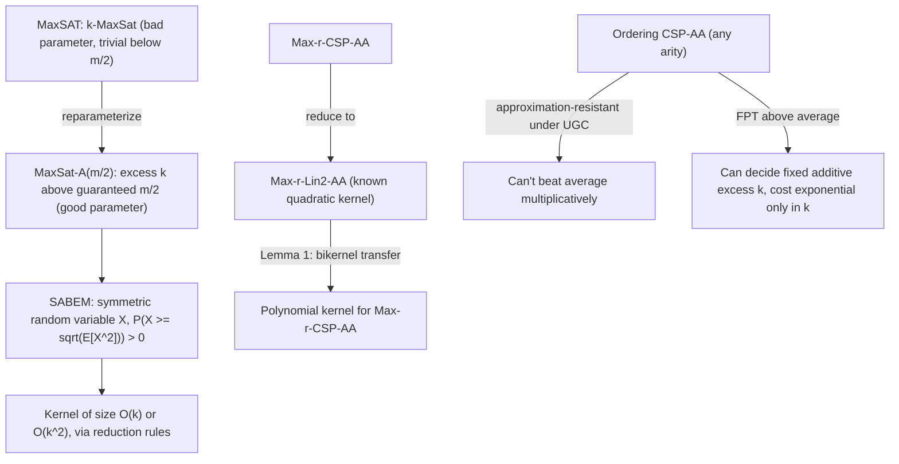

[[book-guidelines|↩ Back to guidelines]]

## The problem with the obvious parameter

Suppose you want to study MaxSAT — given a CNF formula $F$ with $m$ clauses, find a truth assignment satisfying as many clauses as possible — through the lens of parameterized complexity. The naive move is $k$-MaxSat: "is there an assignment satisfying at least $k$ clauses?", parameterized by $k$. This looks exactly like the standard recipe you'd use for, say, $k$-Vertex-Cover. But it fails immediately, and *why* it fails is the entire motivating insight of this chapter.

A trivial averaging argument shows that a uniformly random truth assignment satisfies each clause with probability at least $1/2$, so by linearity of expectation, *some* assignment satisfies at least $m/2$ clauses — for **every** formula, unconditionally. That means every instance of $k$-MaxSat with $k \le m/2$ is a trivial yes-instance. The problem only becomes interesting once $k > m/2$ — but by then $k$ is already a sizeable fraction of the input, and "fixed-parameter tractable in $f(k)$" gives you nothing useful, since $f(k)$ is astronomically large for the only $k$ values that matter.

**The fix reframes the parameter entirely: instead of measuring against zero, measure the excess above a *guaranteed* baseline.** Ask instead: is there an assignment satisfying at least $m/2 + k$ clauses, where $k$ (now possibly tiny — even $k=0$ is a nontrivial question in general families) is the parameter? This is **parameterization above a tight guarantee**. It's tight because there exist formulas — pairs of complementary unit clauses $(x), (\bar x)$ — where $m/2$ literally cannot be beaten; no assignment does better. So $m/2 + k$ for small $k$ asks a real question: can you beat the *provably worst-case-optimal* baseline, and if so by how much? This single reframing — swap the parameter from a raw target to an excess-over-guarantee — is the organizing idea behind essentially every result in this chapter, generalized across a family of "AA" problems (Max-$r$-CSP-AA, MaxLin2-AA, and Ordering-CSP-AA), plus a symmetric "below guarantee" flavor for minimization-style formulations.

If you've internalized fixed-parameter tractability (FPT) and kernelization from a "the parameter directly is the answer size" mental model (vertex cover of size $k$, feedback vertex set of size $k$), this chapter is a good corrective: **parameter choice is itself a design decision with a right and a wrong answer**, and getting it wrong doesn't just make the algorithm slower — it makes the whole question vacuous.

## The basic machinery: FPT, kernels, bikernels

A parameterized problem $\Pi$ is a set of pairs $(I,k)$ — instance plus parameter. $\Pi$ is **fixed-parameter tractable (FPT)** if it's decidable in time $O(f(k)\,|I|^c)$ for some function $f$ of $k$ alone and constant $c$ independent of both $k$ and $I$. The chapter's engineering payoff throughout is **kernelization**: a polynomial-time preprocessing step that reduces any instance $(I,k)$ to an equivalent instance $(I',k')$ with $|I'|$ bounded by some function of $k$ alone (a **kernel**) — this is the practical form in which "FPT" cashes out as an actual usable algorithm, since a small kernel means you can afford to brute-force the reduced instance.

```rust
// The shape every kernelization result in this chapter has:
// take an arbitrary instance, apply polynomial-time reduction
// rules until none apply, and bound the *residual* size purely
// in terms of k — never in terms of the original input size n or m.
fn kernelize(instance: Instance, k: usize) -> Option<(Instance, usize)> {
    let reduced = apply_reduction_rules_exhaustively(instance);
    // Correctness obligation: (instance, k) is a yes-instance
    // iff (reduced, k') is, for the returned k' <= k.
    // Size obligation: |reduced| = O(g(k)) for some function g,
    // independent of the original instance size.
    if reduced.size() <= bound(k) { Some((reduced, k)) } else { None }
}
```

A theorem worth internalizing on its own: **a decidable parameterized problem is FPT if and only if it admits a kernelization at all** (any computable bound $g(k)$, however huge). This means the entire research program the chapter surveys — proving *polynomial*-size kernels for specific AA problems — isn't chasing FPT-ness itself (that's often easy or already known); it's chasing the much sharper, practically-relevant claim that the kernel is small enough to be useful. This is the same distinction as "is this problem decidable" versus "is this problem decidable in a way I'd actually run" — FPT membership is the coarse-grained fact, polynomial kernel size is the fine-grained engineering fact.

The chapter also introduces **bikernelization**: instead of reducing $\Pi$ to itself, reduce $\Pi$ to a *different* (but related) parameterized problem $\Pi'$, as long as $\Pi'$'s nonparameterized version stays in NP and $\Pi$'s stays NP-complete. A polynomial-size bikernel implies a polynomial-size kernel (Lemma 1, due to Alon, Gutin, Kim, Szeider & Yeo). This lemma is the connective tissue that lets nearly every "harder" AA problem in this chapter (Max-$r$-CSP-AA, arbitrary Ordering CSPs) borrow its kernel from a "easier" or better-understood sibling problem (Max-$r$-Lin2-AA, 3-Linear-Ordering-AA) via a polynomial-time reduction, rather than needing a from-scratch combinatorial argument each time. This "reduce to a well-understood core problem, then transfer its kernel" pattern is directly analogous to the reduction-based reasoning you already use when relating CSP tractability across constraint languages via polymorphism containment (see [[The-Algebraic-Approach-to-CSP]]) — a different mechanism, but the same "borrow tractability through a structure-preserving reduction" shape.

## The core technical tool: the Strictly Above/Below Expectation Method (SABEM)

Almost every FPT-and-kernel result in this chapter reduces, eventually, to one probabilistic trick, formalized as **SABEM**. The starting observation: if $X$ is a **symmetric** random variable (i.e. $-X$ has the same distribution as $X$) with finite $\mathbb{E}[X^2]$, then

$$
\mathbb{P}\Bigl(X \ge \sqrt{\mathbb{E}[X^2]}\Bigr) > 0.
$$

Read this as: a symmetric random variable that "wiggles" (has nonzero variance) must, with positive probability, land at least $\sqrt{\mathrm{Var}(X)}$ above its mean of zero — which for these problems means: some assignment beats the average guarantee by a margin controlled by $\mathbb{E}[X^2]$, and if that margin is $\ge \kappa$ (the parameter), you're done; otherwise, you've bounded $\mathbb{E}[X^2]$ and hence the instance size in terms of $\kappa$ alone. This is the *entire* proof engine behind, e.g., the quadratic kernel for 2-Linear-Ordering-AA (Section 3's worked example): define $X(\alpha)$ as the signed deviation of a random ordering's weight from $W/2$, show it's symmetric, lower-bound $\mathbb{E}[X^2] \ge |A|/12$, and conclude either the instance is a yes-instance or $|A| = O(\kappa^2)$.

When the random variable isn't symmetric (the common case once you move past the simplest problems, e.g. Betweenness), the toolkit escalates to the **hypercontractive inequality** from Boolean-function analysis (harmonic analysis on the hypercube $\{-1,1\}^n$): for a degree-$r$ polynomial $f$ over $\{-1,1\}^n$ variables, $\mathbb{E}[f^4] \le 9^r\,\mathbb{E}[f^2]^2$. Combined with a fourth-moment inequality (Lemma 4: if $\mathbb{E}[X]=0$, $\mathbb{E}[X^2]=\sigma^2$, and $\mathbb{E}[X^4]\le c\,\sigma^4$, then $\mathbb{P}(X > \sigma/(2\sqrt c)) > 0$), this gives the same style of "beat the average with controllable probability" guarantee even when the naive symmetric-variable trick doesn't directly apply — this is exactly the machinery behind the Betweenness-AA kernel, where the ordering random variable isn't symmetric and has to be encoded through an auxiliary polynomial over $\{-1,1\}^{2n}$ variables instead.

**Why this matters beyond this one survey:** SABEM is a template for turning "the expected value of a combinatorial optimum is $X$" into "there's a concrete, findable solution beating $X$ by a controllable margin" — a probabilistic-existence argument converted into an algorithmic guarantee. This shows up all over combinatorial optimization (the probabilistic method more broadly), but the parameterized-complexity twist here — using the *tightness* of the averaging bound as the pivot for defining a meaningful parameter — is specific to this line of work.

## The results, organized by what they generalize

### Max-$r$-CSP-AA and its specializations

The general problem: $n$ Boolean variables, $m$ weighted Boolean formulas each touching at most $r$ variables (a fixed constant); find an assignment maximizing satisfied weight, parameterized by the excess $k$ over the average weight $A$ (found by uniform random assignment). Two important special cases:

- **Max-$r$-Lin2-AA** — every formula is a linear equation over $\mathbb{F}_2$ with $\le r$ variables. Has a **quadratic-size kernel**.
- **Max-$r$-Sat-AA** — every formula is a clause with $\le r$ literals. Obtained by reducing to Max-$r$-Lin2-AA and back, also yielding a quadratic kernel.

The polynomial-size kernel for the *fully general* Max-$r$-CSP-AA (Alon, Gutin, Kim, Szeider & Yeo) is a clean illustration of the bikernel-transfer pattern above: reduce Max-$r$-CSP-AA to Max-$r$-Lin2-AA, invoke the known quadratic kernel there, invoke Lemma 1 to transfer polynomial-kernel existence back — notably, the resulting *degree* of that polynomial is not pinned down; existence of a polynomial bound is proven without the proof telling you how good it is. This is a recurring, honest feature of the chapter: several results establish "FPT" or "polynomial kernel exists" without giving usable constants, and later papers (cited throughout) chip away at making the bounds concrete.

A worked instance showing why this machinery has combinatorial teeth beyond toy formulas: **MaxBisection** (partition a graph's vertices into two equal halves maximizing cut edges) embeds as a Max-$r$-CSP-AA instance *with a global cardinality constraint* ($\sum v_i = 0$, forcing balance). The chapter proves this constrained variant still has an $O(k^2)$ kernel, but the proof needs a *generalized* hypercontractive inequality — because the cardinality constraint makes the variables dependent (no longer i.i.d.), so the ordinary independence-based hypercontractive machinery doesn't directly apply, and the fix requires analyzing eigenvalues of large set-symmetric matrices instead. This is a good concrete example of "the elegant probabilistic argument breaks the moment you add a real-world side constraint, and fixing it requires strictly heavier machinery" — worth remembering if your own CSP kernel eventually needs to reason about problems with global constraints layered on local ones.

### MaxLin2: two parameterizations, two very different outcomes

MaxLin2 drops the arity bound $r$ entirely (equations can have arbitrarily many variables). Two natural parameterizations, above vs. below a guarantee, land in *opposite* complexity regimes — a sharp illustration that "above guarantee" isn't automatically the easy direction:

- **MaxLin2-AA** (above): shown FPT with a kernel of $O(k^2 \log k)$ variables (Crowston, Gutin, Jones, Raman & Yeo), resolving a previously open question. The proof analyzes a greedy marking algorithm over an *irreducible* system, using a notion of "$M$-sum-free" sets of equation-vectors in $\mathbb{F}_2^n$ to control how much excess weight a clever choice of equations can force.
- **MaxLin2-B** (below: satisfy weight $\ge W - k$): proved **W[1]-hard** — i.e. (under the standard FPT $\ne$ W[1] assumption) *not* FPT, even in the heavily restricted case where every equation has exactly 3 variables and every variable appears in exactly 3 equations. Only once you restrict further (at most 2 variables per equation) does tractability return.

The contrast is the chapter's clearest demonstration that "above" and "below" a guarantee are not symmetric notions computationally, even though they look like mirror images syntactically — a useful caution for your own project if you ever parameterize a verification-condition search "above" versus "below" some baseline satisfiability guarantee.

### MaxSAT: refining the m/2 bound, and where FPT stops

Beyond the headline MaxSAT-A($m/2$) result (an improved kernel: $4k$ variables, $\approx 4.47k$ clauses, via a sharper lower bound on $\mathrm{sat}(F)$ that accounts for cancelling unit-clause pairs), the chapter surveys two more refined directions:

- **$t$-satisfiable formulas** (every $t$ clauses simultaneously satisfiable) get *stronger* guaranteed lower bounds than $m/2$ — $\hat\varphi \cdot m$ for $t=2$ (where $\hat\varphi = (\sqrt5-1)/2 \approx 0.618$, the golden-ratio conjugate — note this is exactly the Lieberherr–Specker bound familiar from classical MaxSAT approximation, repurposed here as a parameterization baseline) and $\tfrac23 m$ for $t=3$, each yielding linear-in-variable kernels.
- **Max-$r(n)$-Sat-AA** — letting the "arity" $r$ grow with $n$ rather than staying constant — has a precise threshold, proved under the **Exponential Time Hypothesis (ETH)**: FPT for $r(n) \le \log\log n - \log\log\log n - \varphi(n)$, but *not* FPT (indeed para-NP-complete already at $r(n) = \lceil \log n\rceil$) once $r(n) \ge \log\log n + \varphi(n)$, for any unbounded increasing $\varphi$. This double-logarithmic threshold is a genuinely delicate fine line, and it's a good concrete example of ETH-based lower bounds giving you a *matching* upper/lower bound pair rather than just one side.
- **2-SAT-B($m$)** ("Almost 2-SAT": satisfy $\ge m-k$ clauses) is FPT via a $O(15^k \cdot k \cdot m^3)$ algorithm (later improved to $4^k(km)^{O(1)}$) — but a **deterministic polynomial kernel remains open**; only a randomized polynomial kernel is known. This is one of the chapter's two headline open problems (Section 8).

### Ordering CSPs above average

An Ordering CSP of arity $r$ asks for a linear ordering of variables maximizing satisfied constraints, each constraint a disjunction of "this triple/tuple must appear in this relative order" clauses. Concrete named instances: **Betweenness**, **Circular Ordering**, **Acyclic Subdigraph** (= 2-Linear-Ordering). All arity-3 nontrivial cases were classified as NP-hard (Gutin, van Iersel, Mnich & Yeo), and — the connection your `sat-smt-csp` focus area should flag as load-bearing — **all of these are approximation-resistant under the Unique Games Conjecture**: no polynomial algorithm can beat the trivial random-ordering baseline by any constant factor, assuming UGC. That's the approximation-hardness half of the story (see [[Approximation-Algorithms-for-CSP]] for the general UGC connection to CSP approximability).

The parameterized-complexity half is the surprising complementary fact: **the same problems that are approximation-resistant to beating the average are simultaneously FPT when parameterized by how much you beat the average.** This isn't a contradiction — approximation resistance says "you can't guarantee beating the average by more than $\epsilon\cdot|C|$ for any fixed $\epsilon>0$ in polynomial time (in the worst case, over *all* instances of a given size)"; FPT-above-average says "for any *fixed*, small excess $k$, you can decide whether *some* instance-specific ordering achieves that excess, in time exponential only in $k$." One statement is about the *hardness of guaranteeing a multiplicative approximation ratio*; the other is about the *tractability of a fixed additive excess, as a function purely of that excess*. This is a genuinely important distinction to internalize if you ever reason about approximation resistance and parameterized tractability for the same problem family — they answer different questions and can coexist without tension.

The chapter traces the resolution of a conjecture (Gutin, van Iersel, Mnich & Yeo) that *every* Ordering CSP-AA, of *every* arity, is FPT — eventually proved in full generality by Makarychev, Makarychev & Zhou using SABEM lifted to a continuous domain $[-1,1]$ (rather than discrete orderings) via the **Efron–Stein decomposition**, a generalization of Fourier analysis on the hypercube to arbitrary product probability spaces. This generalization also subsumes an LP-style relaxation of Ordering CSPs (linear inequality constraints with bounded support and bounded coefficients), showing the "above average is FPT" phenomenon is robust to a genuinely more expressive constraint language than pure orderings.

## Where this leads, and the compiler-project connection

This chapter's central methodological lesson — **choose the parameter relative to a provable structural guarantee, not relative to zero** — generalizes directly beyond MaxSAT/MaxLin2/Ordering-CSP. Any optimization problem embedded in your CSP kernel that has a cheap, universal lower (or upper) bound on achievable quality is a candidate for the same reframing: instead of asking "is there a solution of absolute quality $\ge k$" (often vacuous or intractable for the $k$ you actually care about), ask "is there a solution beating the provable baseline by $k$" — this is precisely the shape of question that turns an otherwise-hopeless parameter into a genuinely small, meaningful one.

More concretely, this connects to two of your Focus Areas at once. First, `sat-smt-csp`: the reduction discipline here — express a harder problem (Max-$r$-CSP-AA) via a well-understood core (Max-$r$-Lin2-AA), transfer a kernel via a bikernel lemma — is a template your CSP kernel's own solver-cooperation layer can reuse whenever a specialized sub-solver (say, a linear-arithmetic theory solver) has better-understood parameterized behavior than the general constraint language you're actually searching over. Second, and more speculatively but concretely: if your compiler's constraint solver ever needs to search not just for *a* satisfying assignment (CSP proper) but for the *best* counterexample under some cost measure — e.g., ranking candidate counterexamples by how badly they violate a soft invariant, rather than a strict yes/no violation — you are doing weighted/optimization CSP in exactly this chapter's sense, and the "parameterize above the guaranteed average" idea is directly the right lens for asking "how much better than a trivial random search can we certifiably do, and how expensive is finding out."



## Open problems left on the table

- **Almost-2SAT / 2-SAT-B($m$):** does it admit a *deterministic* polynomial-size kernel? Only randomized polynomial kernels are known.
- **MaxLin2-AA:** does it admit a polynomial-size kernel *in the number of constraints* (as opposed to the known polynomial bound on the number of *variables*)? Unresolved even in the direction of a conjectured answer.

Both are stated as the chapter's closing open questions, and both are specifically about tightening a *known* FPT/kernel-existence result into a genuinely small, concrete bound — reinforcing the chapter's overall thesis that the interesting research frontier in this area isn't "is it FPT" (often settled) but "how small can the kernel actually be made."
