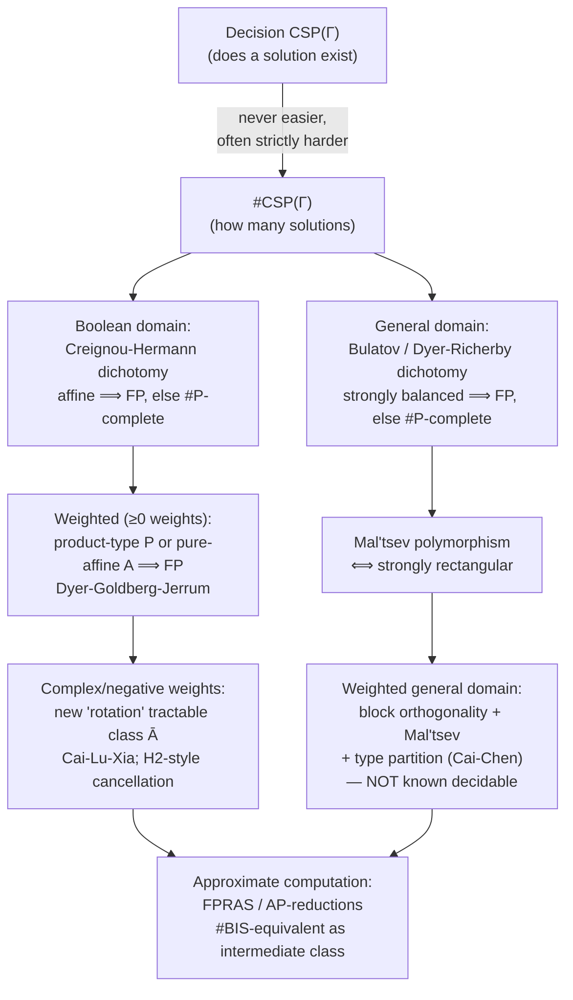

# Counting CSP

[[book-guidelines|↩ Back to guidelines]]

## Why "does a solution exist" and "how many solutions exist" are different questions

Take the simplest possible constraint language: a single binary relation $\mathrm{NAND} = \{(0,0),(0,1),(1,0)\}$ on $\{0,1\}$. Because NAND is symmetric, an instance of $\mathrm{CSP}(\{\mathrm{NAND}\})$ is just an undirected graph $G$ (variables = vertices, constraint scopes = edges), and a satisfying assignment is an independent set — you're allowed to set a vertex to 1 only if none of its neighbors are also 1. The decision problem "does $G$ have an independent set?" is trivial: the empty set is always independent, so every instance is a "yes" instance. There is nothing to compute.

Now ask instead: *how many* independent sets does $G$ have? Suddenly you're facing a #P-complete problem — one of the canonical hard counting problems in complexity theory. Worse, even *approximating* that count to within a small relative error is intractable unless $\mathrm{RP} = \mathrm{NP}$.

This is the first fact worth internalizing about counting CSP, written $\#\mathrm{CSP}(\Gamma)$: **counting is never easier than deciding, but it can be strictly harder — arbitrarily much harder, even when deciding is completely vacuous.** A decision procedure only has to certify that *some* branch of the search space succeeds; a counting procedure has to account for every branch, and the structure that makes "does one exist" easy (e.g., "yes, trivially") says nothing about how the space of solutions is shaped. This is exactly the gap a verifier's bug-finder cares about: a CSP kernel that reports "a counterexample exists" is answering the decision question; if you ever want to reason about *how many* ways a program can go wrong, or weight counterexamples by likelihood, you're in counting-CSP territory, and the complexity story changes completely.

Formally, $\#\mathrm{CSP}(\Gamma)$ for a finite relational language $\Gamma$ on domain $D$ takes an instance $(X, C)$ — variables $X$, constraints $C = \{(R_1, \mathbf{x}_1), \dots, (R_m, \mathbf{x}_m)\}$ pairing a relation $R_i \in \Gamma$ with a scope tuple $\mathbf{x}_i$ of variables — and asks for
$$
\#\{\sigma : X \to D \mid \forall i,\ \sigma(\mathbf{x}_i) \in R_i\}.
$$
This chapter (Mark Jerrum's survey, Chapter 8 of the volume) deliberately excludes **holants** — the more expressive "read-twice" framework where a variable is shared between at most two constraints rather than glued by an implicit equality relation of any arity (see [[Holant-Problems|Holant Problems]]). Counting CSP keeps ordinary CSP's implicit "every occurrence of a variable is the same variable" gluing; it only changes what you do with the set of satisfying assignments once you have it — sum over indicator functions rather than test for non-emptiness.

## The complexity class $\#\mathrm{P}$

**What breaks without it.** NP measures the difficulty of the *existence* question by counting certificates only up to "at least one." To measure "how many," you need a class that literally counts accepting computation paths. Decision-class machinery (Cook–Levin reductions, NP-completeness) doesn't transfer directly, because a many-one reduction that maps yes-instances to yes-instances can scramble the *count* of witnesses arbitrarily.

**Definition.** A function $f : \Sigma^* \to \mathbb{N}$ is in $\#\mathrm{P}$ if there is a nondeterministic Turing machine $M$ such that, for every input $x$, the number of accepting computation paths of $M$ on $x$ equals $f(x)$. Equivalently (the reading that matters for CSP): $f$ counts the number of polynomial-length certificates satisfying a polynomial-time-checkable predicate. $\#\mathrm{P}$ was introduced by Valiant, who also identified the first #P-complete problems (counting perfect matchings, i.e. the permanent).

Since a nondeterministic guess-and-check machine for $\#\mathrm{CSP}(\Gamma)$ just guesses an assignment $\sigma : X \to D$ and accepts iff it's satisfying, $\#\mathrm{CSP}(\Gamma) \in \#\mathrm{P}$ for every finite $\Gamma$, automatically. The interesting question is always whether it's also #P-hard.

**Hardness is via Turing reductions**, not many-one reductions: $f$ is #P-hard if every $g \in \#\mathrm{P}$ polynomial-time Turing-reduces to $f$ (you're allowed to query an $f$-oracle polynomially many times and do arbitrary polynomial-time postprocessing). $f$ is #P-complete if additionally $f \in \#\mathrm{P}$. This is a real weakening of many-one reducibility, and it matters: it's the flexibility that lets proofs "extract" a count of interest (say, the number of independent sets) from black-box access to a count of something more general.

**A subtlety that resurfaces constantly in this chapter:** once you allow real or complex-valued *weighted* counting CSPs (below), the output is not generally an integer, so $\#\mathrm{CSP}(F)$ for a weighted function set $F$ is no longer literally a member of $\#\mathrm{P}$. Restricting weights to a computationally tractable subfield (rational, algebraic, or polynomial-time computable reals) recovers membership in $\mathrm{FP}^{\#\mathrm{P}}$ — the class of functions computable in deterministic polynomial time given a $\#\mathrm{P}$-oracle — and #P-hardness (via Turing reductions) remains a meaningful, provable lower bound even though "#P-complete" no longer quite makes sense as a label.

```rust
// The shape of the nondeterministic-machine argument, made concrete.
// #CSP(Gamma) is trivially IN #P: "guess sigma, check it, count accepting guesses."
// This is the certificate-counting reading of #P specialized to CSP.
fn count_satisfying_assignments<D: Copy + Eq>(
    domain: &[D],
    vars: &[usize],
    constraints: &[(Vec<usize>, Box<dyn Fn(&[D]) -> bool>)],
) -> u64 {
    // Brute force = the "nondeterministic machine, summed over all branches" reading.
    // A real #P-hardness proof shows NO polynomial-time algorithm can shortcut this
    // sum in general -- not that this loop is how you'd actually run it.
    fn rec<D: Copy + Eq>(
        domain: &[D], vars: &[usize], assignment: &mut Vec<D>,
        constraints: &[(Vec<usize>, Box<dyn Fn(&[D]) -> bool>)],
    ) -> u64 {
        if assignment.len() == vars.len() {
            return constraints.iter().all(|(scope, rel)| {
                let tuple: Vec<D> = scope.iter().map(|&v| assignment[v]).collect();
                rel(&tuple)
            }) as u64;
        }
        domain.iter().map(|&d| {
            assignment.push(d);
            let n = rec(domain, vars, assignment, constraints);
            assignment.pop();
            n
        }).sum()
    }
    rec(domain, vars, &mut Vec::new(), constraints)
}
```

## The Creignou–Hermann affine dichotomy: why counting is so much more pessimistic than deciding

Schaefer's classical dichotomy for *decision* CSP over $\{0,1\}$ says $\mathrm{CSP}(\Gamma) \in \mathrm{P}$ whenever every relation in $\Gamma$ is **affine**, **bijunctive** (equivalent to a 2-CNF), **0-valid**, **1-valid**, **Horn**, or **dual-Horn** — six separate escape routes to tractability, any one of which suffices. Counting collapses this generosity almost entirely.

**Theorem 1 (Creignou–Hermann).** Let $\Gamma$ be a finite set of relations on $\{0,1\}$. If every relation in $\Gamma$ is affine, then $\#\mathrm{CSP}(\Gamma) \in \mathrm{FP}$; otherwise $\#\mathrm{CSP}(\Gamma)$ is #P-complete.

Here **affine** means: identify $\{0,1\}$ with the field $\mathbb{F}_2$, and call a relation $R \subseteq \{0,1\}^k$ affine if it is exactly the solution set of a system of linear equations over $\mathbb{F}_2$ (so $R$ is a coset of a linear subspace — geometrically a "flat"). Only this one condition survives as a counting-tractability criterion; bijunctive, 0-valid, 1-valid, Horn, and dual-Horn — each individually sufficient for decision-tractability — buy you nothing for counting.

**The IMP counterexample makes this concrete, not just abstract.** Let $\mathrm{IMP} = \{(0,0),(0,1),(1,1)\}$ (logical implication $x \le y$). IMP is simultaneously bijunctive, 0-valid, 1-valid, Horn, *and* dual-Horn — it satisfies every one of Schaefer's five non-affine tractability conditions at once. And yet $\#\mathrm{CSP}(\{\mathrm{IMP}\})$ is #P-complete. What is it actually counting? An IMP-constraint $x \le y$ is exactly a "this element is below that one" edge; a satisfying assignment to a system of IMP-constraints is precisely a **downward-closed set (downset/order ideal)** of the partial order generated by those edges — counting satisfying assignments to a conjunction of IMP-constraints is *exactly* the #P-complete problem of counting downsets (equivalently, antichains, equivalently order ideals) of a partial order. Decision was trivial here for the same reason it was trivial for NAND: a trivial downset (the empty set) always exists, but the shape of the *whole lattice of downsets* is what makes counting hard.

**Proof sketch, in the language you'll want for the implementation view.** If $\Gamma$ is affine, an instance's satisfying-assignment set is literally an affine subspace of $\mathbb{F}_2^X$ — you can find its dimension $d$ by ordinary linear algebra (Gaussian elimination over $\mathbb{F}_2$), and the count is simply $2^d$. This is the *entire* tractable case: solving a counting CSP reduces to solving a linear system and reading off a dimension.

If $\Gamma$ is *not* affine, the proof shows that one of $\mathrm{NAND}$, $\mathrm{OR} = \{(0,1),(1,0),(1,1)\}$, or $\mathrm{IMP}$ can be "gadget-implemented" (pp-defined, in the counting-aware sense discussed below) from relations in $\Gamma$, and each of $\#\mathrm{CSP}(\{\mathrm{NAND}\})$, $\#\mathrm{CSP}(\{\mathrm{OR}\})$, $\#\mathrm{CSP}(\{\mathrm{IMP}\})$ is independently #P-complete. So non-affine-ness is a single trapdoor into hardness, reachable from any non-affine language.

```lean
-- The one tractable case, stated the way a kernel author should internalize it:
-- an affine constraint system over F2 is nothing but a linear system;
-- counting solutions is "solve, then take 2^(nullity)."
-- This is literally Gaussian elimination -- no CSP-specific machinery needed
-- once you've recognized the language is affine.
def countAffineSolutions (numVars : Nat) (equations : List (List Nat × Bool))
    : Nat :=
  -- `equations : List (coefficient-support, rhs-bit)` over F2.
  -- After row-reducing, let `rank` be the number of independent equations
  -- (or `none` if the system is inconsistent, giving 0 solutions).
  match gaussianEliminateF2 numVars equations with
  | none => 0
  | some rank => 2 ^ (numVars - rank)
```

## Product-type and pure affine functions: the weighted extension

Statistical physics motivates going beyond 0/1-valued relations: interactions between atoms are rarely "hard" constraints, they're *weights*. So generalize $\Gamma$ (a set of relations) to $F$ (a set of functions $f : D^k \to R$ into a commutative semiring $R$ — typically $\mathbb{C}$, $\mathbb{R}$, or $\mathbb{R}_{\ge 0}$). An instance's output becomes the **partition-function sum**
$$
Z(X, C) = \sum_{\sigma : X \to D} \prod_{i=1}^m f_i(\sigma(\mathbf{x}_i)).
$$
This is a genuine common ancestor of several frameworks you already know from elsewhere in this book: setting $R = (\{0,1\}, \vee, \wedge)$ recovers classical decision CSP (existential quantification becomes disjunction/summation over the Boolean semiring); setting $R = (\mathbb{R}_{\ge 0}, \min, +)$ recovers [[Valued-CSP|Valued CSP]]'s cost-minimization objective (see the VCSP topic). Weighted counting CSP sits at the "sum-of-products over $(\mathbb{R}, +, \times)$" corner of this same design space.

For the non-negative-weighted Boolean case, Dyer, Goldberg, and Jerrum give the extended dichotomy. Two escape routes to tractability, jointly exhaustive:

- **Product type** ($\mathcal{P}$): functions expressible as a product of nullary functions, unary functions, binary equality functions $\mathrm{EQ}(x,y) = [x=y]$, and binary disequality functions. Intuitively, these are functions that *decompose completely* — no genuine multi-variable interaction beyond "these two must (or must not) agree."
- **Pure affine** ($\mathcal{A}$): take an affine relation, view it as a $\{0,1\}$-valued indicator function, then scale by a single non-negative constant $b$. So the support of a pure-affine function is exactly an affine subspace, and its nonzero values are all equal to $b$.

**Theorem (Dyer–Goldberg–Jerrum).** For $F$ a finite set of functions $\{0,1\}^k \to \mathbb{R}_{\ge 0}$: if $F \subseteq \mathcal{P}$ or $F \subseteq \mathcal{A}$, then $\#\mathrm{CSP}(F) \in \mathrm{FP}$; otherwise $\#\mathrm{CSP}(F)$ is #P-hard.

Notice the statement barely changed shape from the unweighted Theorem 1 — what changed is entirely in the *proof*, which now has to reason about weighted gadget constructions rather than pure relational ones. This pattern — "the dichotomy statement survives, the proof gets much harder" — repeats at every stage of weight-generalization in this chapter, right up until it doesn't (see the next section).

The **complex-weighted** case needs one more ingredient. Extend $\mathcal{A}$ to $\overline{\mathcal{A}}$: a function $f(x_1,\dots,x_k)$ is in $\overline{\mathcal{A}}$ if it's the product of a (complex-valued) pure affine function and a "rotation" $\omega(x_1,\dots,x_k)$ taking values among the fourth roots of unity, constructed via linear forms over $\mathbb{F}_2$: writing $\mathbf{x}' = (x_1,\dots,x_k,1)$, there are vectors $\mathbf{a}_1,\dots,\mathbf{a}_n$ such that $\omega(\mathbf{x}) = i^{L_1(\mathbf{x}') + \cdots + L_n(\mathbf{x}')}$, where each $L_j(\mathbf{x}')$ indicates whether $\mathbf{a}_j \cdot \mathbf{x}' = 1$ over $\mathbb{F}_2$, and the exponent sum is taken over $\mathbb{Z}_4$.

**Theorem 2 (Cai–Lu–Xia).** For $F$ a finite set of functions $\{0,1\}^k \to \mathbb{C}$: if $F \subseteq \overline{\mathcal{A}}$ or $F \subseteq \mathcal{P}$, then $\#\mathrm{CSP}(F) \in \mathrm{FP}$; otherwise $\#\mathrm{CSP}(F)$ is #P-hard.

This closes the Boolean-domain question completely: every finite weighted (complex-valued) Boolean counting CSP is classified. What's striking is how much *richer* the tractable class $\overline{\mathcal{A}}$ is than pure affine — that extra "rotation" factor is not a technicality, it's a genuinely new source of cancellation-driven tractability that only becomes visible once you allow complex (or, as we'll see, even just negative real) weights.

## Weighted CSP as partition functions: graph homomorphisms and spin models

A particularly important special case restricts the constraint language to a **single symmetric binary relation/function**, which lets you view an instance directly as an undirected graph. If $\Gamma = \{H\}$ for a fixed graph $H$ (possibly with loops), then $\#\mathrm{CSP}(\Gamma)$ on instance $G$ is exactly **counting graph homomorphisms** $G \to H$ — every $u,v$ adjacent in $G$ must map to an $H$-edge. This is $\#H\text{-}\mathrm{Col}$: think of $V(H)$ as a palette of colors, and an instance as asking "how many valid colorings does $G$ have, where the allowed adjacent-color pairs are exactly $H$'s edges?" It's the natural counting generalization of graph coloring the same way Boolean CSP generalizes SAT.

**Theorem 3 (Dyer–Greenhill).** If every connected component of $H$ is a reflexive complete graph or an irreflexive complete bipartite graph, then $\#H\text{-}\mathrm{Col} \in \mathrm{FP}$; otherwise it is #P-complete.

Add weights, and $H$ becomes an **interaction matrix** $A = (a_{ij})_{0 \le i,j < q}$, a symmetric non-negative-real matrix — exactly a *spin model* in statistical-mechanics language. The **partition function** is
$$
Z_A(G) = \sum_{\sigma : V(G) \to [q]} \prod_{\{u,v\} \in E(G)} a_{\sigma(u),\sigma(v)}.
$$
Two named examples that recur throughout the chapter:
$$
A^{\lambda}_{\mathrm{Ising}} = \begin{pmatrix} \lambda & 1 \\ 1 & \lambda \end{pmatrix}, \qquad
A_{\mathrm{BIS}} = \begin{pmatrix} 0 & 0 & 1 & 1 \\ 0 & 0 & 1 & 0 \\ 1 & 1 & 0 & 0 \\ 1 & 0 & 0 & 0 \end{pmatrix}.
$$
$A^{\lambda}_{\mathrm{Ising}}$ is the classical **Ising model** ($\lambda > 1$: ferromagnetic, adjacent-equal spins favored; $\lambda < 1$: antiferromagnetic). $A_{\mathrm{BIS}}$ generates the **independent-set (hard-core) model on bipartite graphs** — the interaction matrix version of the #BIS problem that becomes a recurring complexity landmark in the approximate-computation part of the chapter.

Bulatov and Grohe extend Theorem 3's dichotomy shape to non-negative-weighted $Z_A$: "reflexive complete graph" becomes "rank-1 interaction matrix," "irreflexive bipartite" becomes an adjacency-matrix block form $\begin{pmatrix}0 & B \\ B^\top & 0\end{pmatrix}$ built from a rank-1 $B$; the conclusion softens from "#P-complete" to "#P-hard" because the output need not be an integer. The sobering upshot: **every non-trivial spin system has a hard-to-compute partition function**, including both $A_{\mathrm{BIS}}$ and $A^{\lambda}_{\mathrm{Ising}}$ for $\lambda \ne 1$.

## Functional clones: the counting-world analogue of relational clones

Just as decision-CSP complexity is governed by *relational clones* (closure under pp-definitions — see [[The-Algebraic-Approach-to-CSP|The Algebraic Approach to CSP]]), counting-CSP complexity is governed by **functional clones**. A set $F$ of non-negative functions is a functional clone if it contains equality and is closed under: variable introduction, variable renaming, **product**, and **summation over a variable**. This is the exact counting-analogue of pp-definability: relational conjunction $\wedge$ becomes function multiplication $\times$, and existential quantification $\exists$ becomes summation $\sum$. A function $f$ is *pps-definable* over $F$ (the "s" is for "sum") if it's in the functional clone $\langle F \rangle_\#$ generated by $F$; if $\langle F\rangle_\# = \langle F'\rangle_\#$ then $\#\mathrm{CSP}(F)$ and $\#\mathrm{CSP}(F')$ have equivalent complexity — the same equivalence-preserving move that made the polymorphism-clone Galois connection so useful for decision CSP.

One structural fact is worth flagging because it will matter for anyone implementing a solver: **pps-definability, applied to a purely relational (0/1-valued) starting set, immediately produces genuinely weighted functions.** For example, with $D = \{0,1\}$,
$$
g(x,y) = \sum_{z \in \{0,1\}} \mathrm{IMP}(x,z)\,\mathrm{IMP}(z,y)
$$
gives $g(0,0) = g(1,1) = 1$, $g(1,0) = 0$, $g(0,1) = 2$ — an integer-weighted function you cannot express as a relation, generated purely by summing a product of relational indicator functions. This is the formal reason weighted counting CSP is not an optional add-on but a structurally forced generalization: even if your *problem* is stated entirely in relations, your *proof techniques* (gadget constructions via clone closure) will leave that world immediately.

The support map connects the two clone worlds precisely: for $f : D^k \to \mathbb{R}_{\ge 0}$, define $\mathrm{supp}\, f = \{x : f(x) > 0\}$; then $\mathrm{supp}\langle F \rangle_\# = \langle \mathrm{supp}\, F\rangle$ (relational clone generated by the supports). This lets Theorem 1's proof be redone entirely in clone language, using Post's lattice of Boolean relational clones — a nice sanity check that the "translate the proof into clones and Post's lattice" exercise the chapter suggests is genuinely mechanical, not hand-wavy.

## The general (non-Boolean-domain) dichotomy: strong balance and Mal'tsev

For general finite domains, the counting analogue of the Feder–Vardi conjecture has actually been **resolved** — a striking asymmetry with decision CSP, where the analogous conjecture (in its finite-domain algebraic form, discussed in [[The-Algebraic-Approach-to-CSP|The Algebraic Approach to CSP]]) took decades and is only now settled by very recent work outside this chapter's scope. Bulatov proved the counting dichotomy; Dyer and Richerby later gave a cleaner, decidable version.

The key structural notion is **strong balance**, built from **rectangularity**:

- A binary relation $B \subseteq A_1 \times A_2$ is **rectangular** if $(a,c), (a,d), (b,c) \in B \Rightarrow (b,d) \in B$ — i.e. $B$ is (a subset of) a "Cartesian product shape": $B$ is exactly $\pi_1(B) \times \pi_2(B)$ restricted correctly, no partial correlation between the two coordinates once you know both projections are hit. Geometrically: $B$ can't have an "L-shape" with a missing corner.
- An $n$-ary relation $R$ is rectangular if, for every way of splitting its $n$ coordinates into two blocks and viewing $R$ as a binary relation between the two resulting tuples, that binary relation is rectangular. $\Gamma$ is **strongly rectangular** if every relation in the relational clone $\langle\Gamma\rangle$ of arity $\ge 2$ is rectangular.
- A ternary relation $R \subseteq A_1 \times A_2 \times A_3$ is **balanced** if its "balance matrix" $M(x,y) = |\{z : (x,y,z) \in R\}|$ is a **rank-one block matrix** (block-diagonalizable, by row/column permutation, into blocks each of rank 1). $\Gamma$ is **strongly balanced** if every pp-definable ternary relation over $\Gamma$ is balanced.

**Theorem 4 (Bulatov; Dyer–Richerby).** If $\Gamma$ is strongly balanced, $\#\mathrm{CSP}(\Gamma) \in \mathrm{FP}$; otherwise $\#\mathrm{CSP}(\Gamma)$ is #P-complete. The dichotomy is decidable.

Strong balance implies strong rectangularity, but not conversely — rectangularity alone is enough to force #P-hardness in its absence (Bulatov–Dalmau), but tractability needs the stronger balance condition.

**The algebraic characterization, and why it's so clean.** A **Mal'tsev operation** is a ternary $\varphi : D^3 \to D$ with $\varphi(a,a,b) = \varphi(b,a,a) = b$ for all $a,b$ — a single, easy-to-state identity (it's the same Mal'tsev term that shows up governing congruence-permutability in universal algebra, and governing "linear-algebra-like" tractability throughout the algebraic-CSP literature). The theorem: **$\Gamma$ is strongly rectangular iff it has a Mal'tsev polymorphism.** This is a striking payoff: the entire, seemingly ad hoc "rectangularity" combinatorics collapses to a single equational condition, checkable via the standard polymorphism machinery, and moreover gives an efficient (NP) *test* for strong rectangularity — and hence, combined with more work, an NP procedure for deciding strong balance and thus the whole dichotomy.

**The algorithmic idea (frames).** A *frame* $F \subseteq R$ for a relation $R \subseteq D^n$ is a compact witness structure: (i) if $R$ has a tuple with $i$-th coordinate $a$, so does $F$; (ii) for $i > 1$, any set of values that's "$i$-equivalent" in $R$ (i.e. co-occurs as the $i$-th coordinate of tuples agreeing on coordinates $1..i-1$) is also $i$-equivalent in $F$. Every strongly rectangular relation has a frame of size only $n|D|$ — polynomial, not exponential in $n$. You build a frame incrementally, one constraint at a time, and — crucially — a frame is empty iff the relation it represents is empty, giving a poly-time *decision* algorithm for strongly rectangular $\Gamma$. For *counting* under the stronger strong-balance assumption, Dyer and Richerby extend this to a dynamic-programming recurrence over prefix-counting quantities $N_{i,j}(a)$ (roughly: "how many length-$i$ prefixes extend to some full tuple with $j$-th coordinate $a$"), computed incrementally using the rank-one block structure that strong balance guarantees.

This is directly the kind of "compact witness plus incremental maintenance" idea you'd want in a CSP kernel's propagation layer: a frame is a sound, polynomial-size summary of an exponentially large relation, closed under intersection with new constraints — conceptually adjacent to how a domain-propagation solver maintains a compact representation of "currently possible tuples" without materializing them.

The weighted generalization of Theorem 4 (Cai–Chen, building on Cai–Chen–Lu for non-negative weights) needs three conditions jointly — **block orthogonality**, **Mal'tsev**, and **type partition** — which together characterize tractability for complex-weighted $F$; failing any one gives #P-hardness. Unfortunately these conditions, unlike strong balance, are not currently known to be decidable — an open gap between "we have a complete classification" and "we can algorithmically tell which side of it an instance is on."

## Negative weights and parity of subgraphs: where new phenomena appear

Everything up to non-negative real weights extended the *statement* of each dichotomy smoothly (only the proofs got harder). **Negative weights are where the story genuinely changes**, and the chapter's worked example is small enough to fully internalize.

Define $H_2 : \{0,1\}^2 \to \mathbb{R}$ by $H_2(x,y) = -1$ if $x = y = 1$, and $H_2(x,y) = +1$ otherwise. Interpret an instance of $\#\mathrm{CSP}(\{H_2\})$ as a graph $G$ (vertices = variables, edges = scopes). An assignment $\sigma : V \to \{0,1\}$ picks out a vertex subset $U = \sigma^{-1}(1)$; the weight of that assignment is $(-1)^{e(U)}$ where $e(U)$ is the number of edges of the *induced subgraph* $G[U]$ (each edge inside $U$ contributes a factor $-1$, each edge touching $V \setminus U$ contributes $+1$). Summing over all $2^{|V|}$ subsets $U$:
$$
Z_{H_2}(G) = \sum_{U \subseteq V} (-1)^{e(G[U])} = \#\{U : e(G[U])\text{ even}\} - \#\{U : e(G[U])\text{ odd}\}.
$$
So $\#\mathrm{CSP}(\{H_2\})$ directly computes the *signed count* of induced subgraphs by edge-count parity — and since the total number of induced subgraphs $2^{|V|}$ is known, this signed count immediately yields the exact number of even-edge-count and odd-edge-count induced subgraphs separately.

**And this problem is tractable** — $\#\mathrm{CSP}(\{H_2\}) \in \mathrm{FP}$ — via a genuinely different technique than anything used for the non-negative case. Write the sum of $2^{|X|}$ terms, each $\pm 1$, as governed by the $\mathbb{F}_2$-quadratic form $Q(X) = \sum_{\{i,j\} \in S} x_i x_j$ (where $S$ is the edge/scope set): $Q(X) = 0$ exactly on the $+1$-contributing assignments, $Q(X) = 1$ on the $-1$-contributing ones. So the sum reduces to counting solutions of $Q(X) = 0$ — and **every quadratic form over $\mathbb{F}_2$ can be put into a canonical form by a linear change of variables**, from which the solution count is read off directly (a standard fact from the classification of quadratic forms over finite fields). The mechanism here — reduce to canonical form under a change of basis, then read off the answer — is structurally the same move as the affine-dichotomy proof's "reduce to a linear system, read off $2^d$," just one degree up: quadratic forms instead of linear ones.

**Why this matters beyond one cute example.** $H_2$ is the seed of an *infinite* family: other small matrices related to Hadamard matrices give further tractable partition functions on larger domains, extending the tractable landscape in ways invisible from the non-negative-weight world. But — and this is the genuinely new complication the chapter flags — **not every Hadamard matrix yields a tractable counting CSP, and not every tractable Boolean counting CSP comes from a Hadamard matrix.** The clean "rectangularity/Mal'tsev" story that closes the relational and non-negative-weighted cases does not close the arbitrary-real-weight case; Bulatov, Dyer, Goldberg, Jalsenius, and Richerby extend the Boolean dichotomy to arbitrary real weights, and Cai, Lu, and Xia extend it further to arbitrary complex weights (Theorem 2, above, is exactly that final statement) — but the characterization needed genuinely new machinery (the "rotation" factor $\omega$ built from $\mathbb{F}_2$-linear forms and fourth roots of unity) that has no analogue when weights are forced non-negative. Negative (and complex) weights create *cancellation*, and cancellation is a mechanism for tractability that simply does not exist when every term in the sum has the same sign — which is exactly why the algebraic story had to grow a genuinely new ingredient (block orthogonality, type partition) rather than just reusing rectangularity.

## From exact to approximate: a short bridge

The chapter's second half (approximate computation, not this topic's focus but worth situating) shows the exact-computation story sets up the approximate one directly: $\mathrm{FPRAS}$ (Fully Polynomial Randomized Approximation Scheme) is *the* notion of efficient approximation for counting problems (unlike optimization, which has a hierarchy of approximation qualities), and **Approximation-Preserving (AP-) reductions** classify hardness of approximation the way Turing reductions classify exact hardness. The chapter shows Boolean #CSP splits into exactly three approximability classes — tractable (affine), #BIS-equivalent (a conjectured-intermediate class typified by counting independent sets in bipartite graphs), and #SAT-equivalent (as hard to approximate as anything in #P) — governed by the *same* relational clones ($\mathrm{IL}_2$, $\mathrm{IM}_2$) that governed exact tractability, a nice illustration that the algebraic machinery built for exact classification keeps paying off once you change the question to approximation.

## Where this leads



Within the book, this chapter is the counting-world mirror of two others. It shares its opening framework (relations $\to$ functions into a commutative semiring, $\wedge/\exists \to \times/\sum$) with **Valued CSP** (Chapter 9 — see the note above that $R = (\mathbb{R}_{\ge0}, \min, +)$ recovers VCSP exactly), so the partition-function view of counting CSP and the cost-minimization view of VCSP are two specializations of one common template. It is explicitly the *less* expressive sibling of **Holant problems** (Chapter 6): everything statable as $\#\mathrm{CSP}(\Gamma)$ is statable as a Holant problem (via free equality of every arity), but not vice versa (e.g. the perfect-matching generating function needs Holant's "read-twice" freedom). And its algebraic machinery — pp-definability generalized to pps-definability, Mal'tsev polymorphisms as the tractability-defining equational condition — is a direct continuation of the Galois-connection methodology from **The Algebraic Approach to CSP** (Chapter 1), specialized and sharpened for the counting setting.

For the `sat-smt-csp` focus area specifically: this chapter is a sharp illustration of why a solver that only answers "SAT / UNSAT" and one that answers "how many models" are fundamentally different engineering problems, not just the same engine with a counter bolted on. A CSP kernel built to search for concrete counterexamples (proving bug *presence*, per this project's standing goals) only ever needs the decision question — which is exactly the regime where Schaefer's more generous dichotomy applies and many more constraint languages are tractable. The moment such a kernel is asked to *weight* counterexamples (e.g. "how many inputs falsify this precondition," relevant to probabilistic or statistical verification, or to ranking counterexamples by how "typical" they are) it inherits this chapter's much harsher landscape: the Creignou–Hermann collapse to "affine or bust" is a concrete warning that counting-flavored extensions of a constraint solver should not be assumed tractable just because the underlying decision problem is. The Mal'tsev-polymorphism characterization of strong rectangularity is also worth flagging as a genuinely reusable algorithmic idea independent of counting: the *frame* data structure — a polynomial-size, incrementally-maintained compact witness for an exponentially large relation — is a pattern directly relevant to domain-propagation design for the abstract-data-structure ("DFA-shaped") domains this project's CSP kernel is meant to support.
