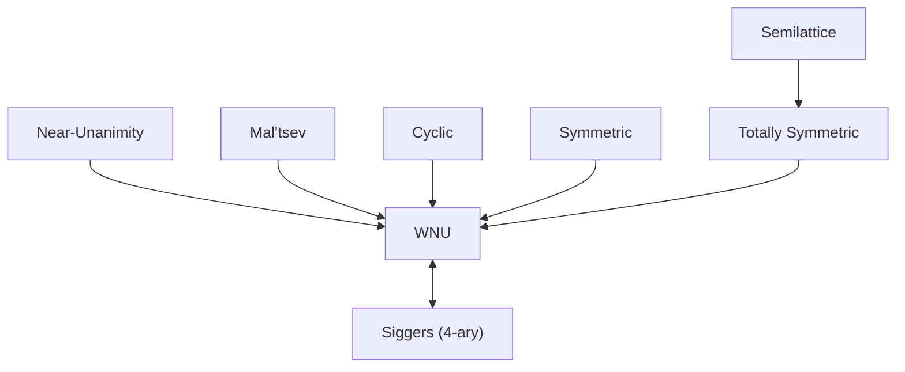

# Digraph CSP: Algebra Meets Graph Theory

[[book-guidelines|↩ Back to guidelines]]

## 1. Why digraphs at all?

If you want to test a general theory of CSP complexity, you need a family of templates that is simultaneously (a) simple enough to draw and enumerate by hand, (b) rich enough in natural subfamilies — posets, tournaments, trees, cycles — that you can localize where a dichotomy conjecture is hard to prove, and (c) expressive enough that *general* CSPs can be encoded inside it without cheating. Digraphs hit all three. A digraph is nothing but a set with a single binary relation — about as minimal a structure as exists — yet Larose opens the survey by pointing out (Theorem 11/12, §3.2) that **every** CSP over an arbitrary relational structure reduces, in a complexity- and polymorphism-preserving way, to a digraph CSP. So digraphs are not a toy special case; they are a universal test bed that happens to also be combinatorially tractable to reason about directly.

This is the chapter's organizing tension: a **graph-theoretic** description (which digraphs look like what) versus an **algebraic** description (which symmetry operations — polymorphisms — a digraph admits), and the running research program of proving these two descriptions coincide, subfamily by subfamily.

## 2. The core setup: CSP as digraph homomorphism

### 2.1 Relational structures and CSP(H)

A finite relational structure is $\mathbf{H} = \langle H; \theta_1, \dots, \theta_r\rangle$: a finite universe $H$ plus relations $\theta_i \subseteq H^{\rho_i}$ of arity $\rho_i$. A **digraph** is the degenerate case $r=1$, $\rho_1 = 2$: just a vertex set $H$ and an arc relation $\theta \subseteq H\times H$.

Given two structures $\mathbf{G}, \mathbf{H}$ of the same signature, a **homomorphism** $f:\mathbf{G}\to\mathbf{H}$ is a map on universes that preserves every relation: $(x_1,\dots,x_{\rho_i})\in\mu_i \Rightarrow (f(x_1),\dots,f(x_{\rho_i}))\in\theta_i$. For digraphs this is exactly "map vertices so that every arc lands on an arc" — the everyday notion of graph homomorphism (which specializes further to graph coloring when $\mathbf{H}$ is a complete graph).

$$
\mathrm{CSP}(\mathbf{H}) \;=\; \{\, \mathbf{G} : \exists\, f: \mathbf{G}\to\mathbf{H} \,\}
$$

is the decision problem: given $\mathbf{G}$, does a homomorphism to the fixed template $\mathbf{H}$ exist? This is the "canonical database" reading of CSP that recurs across the whole book, but here it is at its most literal — the instance *is* a digraph, the constraints *are* its arcs, and satisfying a CSP instance *is* finding a homomorphism.

If you are used to thinking of CSP instances as $(V, D, C)$ triples with named variables and named constraints, the homomorphism framing removes the naming entirely: $\mathbf{G}$'s vertices *are* the variables, $\mathbf{G}$'s arcs *are* the binary constraints, and $H$ *is* the (shared) domain. This works only because every constraint in a digraph CSP has the same arity and the same relation — which is exactly why digraph CSP is the clean minimal setting, and exactly why the Theorem 11/12 reduction (turning an arbitrary structure into an equivalent digraph) is non-trivial: it has to simulate arbitrary-arity, arbitrary-relation constraints using nothing but binary arcs.

A direct backtracking solver for $\mathrm{CSP}(\mathbf{H})$ is the most literal way to internalize the definition — this is a template your project's CSP kernel will eventually generalize far beyond binary/digraph constraints, but the search skeleton (assign, propagate, backtrack) is the same one you'll use for integer and non-linear domains later:

```rust
use std::collections::HashMap;

/// A digraph as an adjacency (arc) relation over vertex indices 0..n.
struct Digraph {
    n: usize,
    arcs: Vec<(usize, usize)>,
}

impl Digraph {
    fn has_arc(&self, u: usize, v: usize) -> bool {
        self.arcs.contains(&(u, v))
    }
}

/// Decide CSP(H): does a homomorphism G -> H exist?
/// This is plain chronological backtracking search over assignments
/// g_vertex -> h_vertex, checked against every arc of G as it's fixed.
fn homomorphism_exists(g: &Digraph, h: &Digraph) -> bool {
    let mut assignment: HashMap<usize, usize> = HashMap::new();
    search(g, h, 0, &mut assignment)
}

fn search(g: &Digraph, h: &Digraph, next: usize, assign: &mut HashMap<usize, usize>) -> bool {
    if next == g.n {
        return true; // every G-vertex assigned consistently
    }
    for candidate in 0..h.n {
        // Check consistency against every arc of G already fully assigned.
        let consistent = g.arcs.iter().all(|&(u, v)| {
            let u_img = if u == next { Some(candidate) } else { assign.get(&u).copied() };
            let v_img = if v == next { Some(candidate) } else { assign.get(&v).copied() };
            match (u_img, v_img) {
                (Some(fu), Some(fv)) => h.has_arc(fu, fv),
                _ => true, // not yet both assigned — nothing to check
            }
        });
        if consistent {
            assign.insert(next, candidate);
            if search(g, h, next + 1, assign) {
                return true;
            }
            assign.remove(&next);
        }
    }
    false
}
```

For a *fixed* template $\mathbf{H}$ this runs in time $O(|H|^{|G|})$ in the worst case — exponential in the size of the instance, which is exactly why the whole chapter is about finding conditions on $\mathbf{H}$ under which this brute search can be replaced by something polynomial.

### 2.2 Cores and homomorphic equivalence

Two structures $\mathbf{G}, \mathbf{H}$ are **homomorphically equivalent** if $\mathbf{G}\to\mathbf{H}$ and $\mathbf{H}\to\mathbf{G}$ both exist. $\mathbf{H}$ is a **core** if every self-homomorphism $\mathbf{H}\to\mathbf{H}$ is a bijection (equivalently, has no non-surjective "retraction" onto a proper substructure). The key structural fact — stated without much fanfare in the chapter but load-bearing for everything after it — is:

> Every finite relational structure is homomorphically equivalent to a core, and that core is unique up to isomorphism.

Since $\mathrm{CSP}(\mathbf{H}) = \mathrm{CSP}(\mathbf{H}')$ whenever $\mathbf{H}, \mathbf{H}'$ are homomorphically equivalent, **the core of $\mathbf{H}$ is the only part of $\mathbf{H}$ that matters for complexity** — you can always replace a template by its core without changing the decision problem at all. This is the digraph-CSP analogue of reducing a matrix to its minimal representative: the core strips out "redundant" vertices that some non-injective self-map can already reach.

A tiny worked example makes this concrete: the symmetric 6-cycle. Its core is a single edge (any 6-cycle collapses homomorphically onto a 2-vertex graph with one edge — this is just "is the graph bipartite?" in disguise), so $\mathrm{CSP}(\text{6-cycle})$ is exactly as hard as 2-coloring/bipartiteness testing — logspace-complete, per Theorem 13 below — even though the 6-cycle itself looks nothing like $K_2$.

```python
from itertools import permutations

def is_core(vertices, arcs):
    """Brute-force check: every self-homomorphism of (vertices, arcs) is a bijection."""
    n = len(vertices)
    arc_set = set(arcs)
    for perm_or_map in all_self_maps(n):
        if is_homomorphism(perm_or_map, arc_set) and not is_bijection(perm_or_map, n):
            return False  # found a non-injective self-homomorphism -> not a core
    return True

def all_self_maps(n):
    # every function {0..n-1} -> {0..n-1}, not just permutations
    from itertools import product
    for m in product(range(n), repeat=n):
        yield m

def is_homomorphism(m, arc_set):
    return all((m[u], m[v]) in arc_set for (u, v) in arc_set)

def is_bijection(m, n):
    return len(set(m)) == n
```

This brute-force check is exponential — real core-finding algorithms exploit exactly the polymorphism machinery of §4 below rather than enumerating all maps — but the definition is worth internalizing operationally before the algebra arrives.

## 3. Three flavors of digraph CSP

The chapter's central organizing move is Definition 2: augmenting the template $\mathbf{H}$ with extra *unary* relations, which changes what an instance is allowed to specify per-vertex.

| Variant | Extra unary relations on $\mathbf{H}$ | What an instance specifies | Common name(s) |
|---|---|---|---|
| $\mathrm{CSP}(\mathbf{H})$ | none | just the arcs of $\mathbf{G}$ | plain digraph homomorphism |
| $\mathrm{CSP}(\mathbf{H}^{+c})$ | every singleton $\{h\}$, $h\in H$ | arcs of $\mathbf{G}$ + some vertices pre-colored to a single fixed value | retraction problem, homomorphism extension, one-or-all list homomorphism |
| $\mathrm{CSP}(\mathbf{H}^{+l})$ | every non-empty subset $S\subseteq H$ | arcs of $\mathbf{G}$ + some vertices restricted to a candidate *list* $S$ | list homomorphism problem, conservative CSP |

The naming payoff here is genuinely important for anyone building a constraint solver: $\mathbf{H}^{+l}$ is *exactly* what a domain-propagation engine works with. Each vertex of the instance carries a current candidate list (its "domain"), and a solution is a choice function selecting one candidate per vertex, respecting both the arc constraints and each vertex's list. This is precisely arc-consistency's data structure — a mutable per-variable candidate set, pruned by binary constraint checks — one level below full search:

```rust
use std::collections::HashSet;

/// One step of arc consistency for a list-homomorphism instance:
/// for every arc (u, v) of G, remove any candidate for u that has
/// no supporting candidate for v under H's arc relation, and vice versa.
/// Iterate to a fixed point; if any list becomes empty, no solution exists.
fn ac3(
    g_arcs: &[(usize, usize)],
    h: &Digraph,
    domains: &mut Vec<HashSet<usize>>,
) -> bool {
    let mut changed = true;
    while changed {
        changed = false;
        for &(u, v) in g_arcs {
            let before_u = domains[u].len();
            domains[u].retain(|&a| domains[v].iter().any(|&b| h.has_arc(a, b)));
            if domains[u].len() != before_u {
                changed = true;
            }
            let before_v = domains[v].len();
            domains[v].retain(|&b| domains[u].iter().any(|&a| h.has_arc(a, b)));
            if domains[v].len() != before_v {
                changed = true;
            }
            if domains[u].is_empty() || domains[v].is_empty() {
                return false; // instance is unsatisfiable
            }
        }
    }
    true // arc-consistent, but not necessarily satisfiable — search may still be needed
}
```

The chapter's payoff — the whole algebraic apparatus of §4 onward — is precisely about characterizing *when this kind of local, polynomial-time propagation alone decides the problem* versus when it can only prune, leaving an NP-hard residual search. That is what "bounded width" and "width 1" will mean below.

Note also the closure fact stated right after Definition 2: **$\mathbf{H}^{+c}$ and $\mathbf{H}^{+l}$ are always cores**, regardless of whether $\mathbf{H}$ itself is. Adding all singleton (or all non-empty) unary relations kills every non-injective self-map, because a non-injective endomorphism would have to send some singleton-constrained vertex outside its own list. This means the "reduce to the core" simplification from §2.2 is *automatically* available for the retraction and list-homomorphism variants — you never have to separately check it.

## 4. Polymorphisms: the algebraic lens on digraphs

### 4.1 What a polymorphism is

A **polymorphism** of $\mathbf{H}$ of arity $k$ is a homomorphism $f: \mathbf{H}^k \to \mathbf{H}$, where $\mathbf{H}^k$ is the $k$-fold structure product (component-wise relations). Concretely for a digraph: $f$ is $k$-ary, and whenever $(x_1,y_1), \dots, (x_k,y_k)$ are all arcs of $H$, so is $(f(x_1,\dots,x_k), f(y_1,\dots,y_k))$. Applying $f$ "column-wise" to $k$ arcs always produces another arc — $f$ respects the arc relation the same way a homomorphism does, just from a higher power of $\mathbf{H}$ into $\mathbf{H}$ itself.

This is the same object that Chapter 1 introduces for general constraint languages; here it is specialized to a single binary relation, which is exactly why digraph polymorphisms tend to have cleaner combinatorial descriptions than general-structure ones.

Two universal qualifiers recur throughout:
- **idempotent**: $f(x,\dots,x) = x$ for all $x$;
- **conservative**: $f(x_1,\dots,x_n)\in\{x_1,\dots,x_n\}$ for all inputs (the output is always *one of* the inputs — a "tie-breaking rule," not a genuinely new value).

And crucially: **the polymorphisms of $\mathbf{H}^{+c}$ are exactly the idempotent polymorphisms of $\mathbf{H}$**, and **the polymorphisms of $\mathbf{H}^{+l}$ are exactly the conservative polymorphisms of $\mathbf{H}$**. This is why adding singleton constants forces idempotence (a polymorphism that didn't fix constants couldn't respect the pre-coloring) and why adding all lists forces full conservativeness (a polymorphism that ever produced a value outside its inputs could be forced outside some restrictive list).

### 4.2 The zoo of identities

All of these are stated as **linear identities**: universally-quantified equalities between two term expressions built from the operation symbol (no nesting), written $f(x_1,\dots,x_k)\approx g(y_1,\dots,y_n)$.

- **Semilattice**: associative, idempotent, commutative binary $f$ — think "meet" or "join" with no distinguished bottom/top.
- **Cyclic** (arity $k\ge2$): $f(x_1,\dots,x_k)\approx f(x_k,x_1,\dots,x_{k-1})$ — invariant under one cyclic rotation of its arguments.
- **Symmetric**: invariant under *every* permutation of arguments.
- **Totally symmetric (TS)**: $f(x_1,\dots,x_k)\approx f(y_1,\dots,y_k)$ whenever $\{x_1,\dots,x_k\}=\{y_1,\dots,y_k\}$ — depends only on the *set* of inputs, not their multiplicities or order. (Strictly stronger than symmetric.)
- **Near-unanimity (NU)**, arity $k\ge3$: $f(x,\dots,x,y,x,\dots,x)\approx x$ for the lone $y$ in any position — "the majority argument wins." The 3-ary case is called **majority**.
- **Weak near-unanimity (WNU)**: idempotent $f$ with $f(x,\dots,x,y,x,\dots,x)$ equal *across all positions of the lone $y$* (but not necessarily equal to $x$ itself, unlike NU).
- **Mal'tsev**: 3-ary $f(y,y,x)\approx f(x,y,y)\approx x$ — the operation that "cancels" a repeated middle argument, the signature of group-theoretic/affine structure.
- **Siggers**: 4-ary idempotent $f(a,r,e,a)\approx f(r,a,r,e)$ — a strange-looking identity whose importance is precisely that it's *equivalent* to admitting some WNU polymorphism (Proposition 3).

The chapter packages the known implications as one proposition (Proposition 3): a conservative semilattice polymorphism implies conservative idempotent TS polymorphisms of every arity; Siggers $\iff$ some WNU; and cyclic, symmetric, TS, NU, or Mal'tsev — if idempotent — each imply *some* WNU polymorphism (conservatively too, if the witness was conservative). Visually, these implications form a lattice of increasingly strong "symmetry" guarantees, with WNU/Siggers as the unifying minimal condition:



Formalizing one of these identities as an honest proposition — rather than an English sentence — is a useful exercise for a project whose elaborator will eventually need to state and check similar universally-quantified equational conditions (e.g. definitional-equality congruence rules). Lean's `Prop`-level equality is a direct match for a linear identity:

```lean
-- A k-ary operation on a type H, and the identities it might satisfy.
variable {H : Type} (f : Fin 3 → H → H → H → H)  -- k = 3 illustrated

-- Cyclic identity for a 3-ary operation: f(x,y,z) = f(z,x,y)
def IsCyclic (f : H → H → H → H) : Prop :=
  ∀ x y z : H, f x y z = f z x y

-- Mal'tsev identity: f(y,y,x) = x = f(x,y,y)
def IsMaltsev (f : H → H → H → H) : Prop :=
  ∀ x y : H, f y y x = x ∧ f x y y = x

-- Idempotence, the universal precondition for every "nice" polymorphism above
def IsIdempotent (f : H → H → H → H) : Prop :=
  ∀ x : H, f x x x = x
```

Reading a chapter theorem like "*H admits a conservative WNU polymorphism* $\Rightarrow$ *tractable*" through this lens, it is literally a statement of the shape "if this `Prop` is inhabited (a witness $f$ exists satisfying the identities), the decision problem is in P" — the same inhabitation-as-proof idea that drives the rest of your dependent-type-theory work, just applied to a combinatorial witness instead of a logical one.

## 5. Datalog, bounded width, and the three conjectures

### 5.1 Datalog as the "polynomial-time propagation" language

The chapter uses Datalog to make "solvable by local consistency" precise. A **Datalog program** is a finite set of rules

$$
T_0 :- T_1, \dots, T_n
$$

where each $T_i$ is an atomic formula over a fixed signature. $T_0$ is the *head*; $T_1,\dots,T_n$ is the *body*. Predicates appearing in some head are **intensional** (IDBs, the "derived" relations); predicates appearing only in bodies are **extensional** (EDBs, the input relations, i.e. $\mathbf{G}$'s own relations). One distinguished 0-ary IDB is the *goal* predicate; execution is a least-fixed-point computation over monotone rule applications, starting from "goal = false." By construction, a Datalog program recognizes a *homomorphism-closed* class of structures — and for CSP purposes, the program is set up to accept precisely the *non-instances* (the $\mathbf{G}$'s that do **not** map to $\mathbf{H}$), so "$\mathrm{CSP}(\mathbf{H})$ is definable in Datalog" is shorthand for this complement construction.

If you already work with Constrained Horn Clauses for verification-condition generation, this should look immediately familiar: a Datalog rule *is* a Horn clause, IDBs are exactly the recursively-defined predicates a CHC solver is trying to find a least model for, and "the program accepts $\mathbf{G}$ iff its goal predicate is derivable" is exactly the CHC solving question "is `false` (or the error predicate) reachable from the facts?" The chapter is, in effect, using bounded-width CSP theory to characterize *which* Horn-clause verification conditions have a polynomial-time, purely propagation-based refutation — no case-split search needed.

Three refinements matter:
- **linear** Datalog: at most one IDB occurrence per rule body (no branching recursion);
- **symmetric** linear Datalog: additionally closed under a "symmetric complement" operation on rules (swap which IDB is head vs. body-occurrence);
- **non-recursive** Datalog: bodies contain only EDBs (no recursion at all — this is exactly first-order definability, Theorem in [3]/[23]).

**Width 1** is the sharpest case: $\mathrm{CSP}(\mathbf{H})$ has width 1 if a Datalog program with only unary IDBs decides it — equivalently (a genuinely useful equivalence to know) $\mathbf{H}$ admits **set polymorphisms**, equivalently TS polymorphisms of every arity. This is the propagation regime where per-vertex candidate lists (exactly the `domains: Vec<HashSet<usize>>` from the Rust snippet in §3) alone, with no backtracking at all, already decide satisfiability.

The complexity ladder attached to Datalog definability:

$$
\text{non-recursive Datalog (first-order)} \;\subsetneq\; \text{symmetric linear Datalog (logspace)} \;\subsetneq\; \text{linear Datalog} \;\subsetneq\; \text{Datalog (bounded width, P)}
$$

and outside all of these lies NP-completeness (assuming P $\ne$ NP), with the striking structural fact that **there is no fixed-template CSP with complexity strictly between AC$^0$ and L** — Datalog definability, or its absence, is a genuine complexity gap detector, not a fuzzy heuristic.

### 5.2 Theorem 5 — the algebraic characterization of bounded width

$$
\mathrm{CSP}(\mathbf{H})\text{ has bounded width} \iff \exists N.\ \mathbf{H}\text{ admits }k\text{-ary WNU polymorphisms for all }k\ge N \iff \mathbf{H}\text{ admits idempotent } v, w \text{ satisfying a specific pair of 3-/4-ary majority-like identities.}
$$

This is the chapter's central algebra $\leftrightarrow$ propagation bridge: an *infinite family* of WNU witnesses (or, equivalently, two very specific low-arity witnesses $v,w$) is exactly what lets a fixed-point Datalog computation replace exponential search.

### 5.3 The three conjectures and their proven converses

$$
\begin{aligned}
\textbf{Conjecture 8: } &\mathbf{H}\text{ core.} \\
&\text{(1) WNU polymorphism} \;\Rightarrow\; \mathrm{CSP}(\mathbf{H})\text{ tractable (the algebraic dichotomy conjecture);} \\
&\text{(2) join-semidistributive} \;\Rightarrow\; \text{definable in linear Datalog (NL);} \\
&\text{(3) bounded width } \wedge\; n\text{-permutable} \;\Rightarrow\; \text{definable in symmetric Datalog (L).}
\end{aligned}
$$

What's already *proved* (Theorem 9) is the **converse direction of all three** — absence of the algebra implies hardness:

$$
\begin{aligned}
&\text{no WNU polymorphism} \;\Rightarrow\; \mathrm{CSP}(\mathbf{H})\text{ is NP-complete;} \\
&\text{not join-semidistributive} \;\Rightarrow\; \text{not linear-Datalog-definable, P-hard;} \\
&\text{not } n\text{-permutable for any } n \;\Rightarrow\; \text{not symmetric-Datalog-definable, NL-hard.}
\end{aligned}
$$

$n$-permutability generalizes the Mal'tsev condition (2-permutable $\equiv$ admits a Mal'tsev polymorphism) to a chain of $n{-}1$ ternary polymorphisms interpolating between $x$ and $y$. This "hardness is easy, tractability is the open conjecture" asymmetry is the CSP field's central research shape, and the rest of the chapter is a survey of exactly which digraph subfamilies have had *both* directions nailed down.

## 6. Structural results on plain $\mathrm{CSP}(\mathbf{H})$

Since a loopy digraph trivializes ($\mathrm{CSP}(\mathbf{H})$ always accepts via the constant map onto the loop), §4 of the chapter restricts to loopless $\mathbf{H}$.

- **Symmetric digraphs (undirected graphs), Theorem 13** (Hell–Nešetřil, reformulated algebraically): bipartite $\Rightarrow$ tractable; non-bipartite $\Rightarrow$ admits no WNU, hence NP-complete. This recovers graph 2-coloring vs. $k$-coloring ($k\ge3$) as the base case, and — combined with the core observation from §2.2 — explains why *every* non-trivial bipartite graph's CSP collapses to logspace-complete (its core is a single edge).
- **Oriented paths and cycles, Theorem 14** (Feder and others): oriented paths always admit conservative majority *and* semilattice polymorphisms (maximally tractable); unbalanced oriented cycles admit conservative majority; **balanced** oriented cycles are the genuinely hard case — reducible to bipartite Boolean CSPs, tractable-or-NP-complete but without a transparent polymorphism-level explanation in the known proof. The net/algebraic length of a cycle (forward arcs minus backward arcs around a fixed traversal) is exactly the invariant distinguishing balanced ($=0$) from unbalanced.
- **Oriented trees**: some have NP-complete CSP already at 33 vertices (the smallest known "triad" — a tree with a single degree-3 vertex). The dichotomy conjecture is verified for restricted *special* triads/polyads/oriented trees, and Bulín's conjecture is that every tractable oriented-tree CSP has bounded width — an explicitly open structural refinement.
- **Semi-complete and tournaments**: a semi-complete digraph has at least one arc between every pair of vertices (generalizing complete graphs and tournaments). Dichotomy is proved here, with the polymorphism behavior fully described; the notion extends to *locally* semi-complete digraphs (every vertex's in-/out-neighborhoods are themselves semi-complete), where the tractability/NP-completeness boundary turns out to coincide *exactly* with the boundary for the list-homomorphism variant on the same digraphs — a rare case where the plain and conservative problems provably align.
- **Smooth digraphs, Theorem 15** (Barto–Kozik–Niven, confirming a Bang-Jensen–Hell conjecture): a digraph with no sources or sinks (every vertex has in- and out-degree $\ge1$). Tractable exactly when every connected component of its core is a directed cycle (a "circle"); otherwise it admits no WNU and is NP-complete. This is a genuinely clean structural characterization, in the same spirit as bipartiteness for undirected graphs.

Note the recurring pattern: whenever a full dichotomy is proved for a subfamily, it comes packaged with *both* a graph-theoretic description of the tractable cases *and* a matching algebraic (WNU/majority/semilattice) certificate — the chapter's implicit thesis is that a "real" classification result should always deliver both readings simultaneously.

Also worth flagging: Kazda's result that every digraph admitting a Mal'tsev polymorphism *also* admits a majority polymorphism — a collapse that is specific to digraphs and does **not** hold for general relational structures. This is exactly the kind of "digraphs behave better than the general theory predicts" phenomenon that justifies studying them as a special case rather than just citing general CSP results.

## 7. $\mathrm{CSP}(\mathbf{H}^{+c})$: the retraction problem

Recall $\mathrm{CSP}(\mathbf{H}^{+c})$'s polymorphisms are the idempotent polymorphisms of $\mathbf{H}$, and $\mathbf{H}^{+c}$ is *always* a core (§2.2/§3), so this section is free to consider digraphs *with loops* — a genuinely larger space than §6's loopless restriction.

**Mixed digraphs** (tournaments with some loops added): Theorem 16 gives the WNU dichotomy directly. **Strongly bipartite digraphs** (every vertex a pure source or pure sink) show a sharp Datalog collapse (Theorem 17): admitting an NU polymorphism is *equivalent* to first-order definability — no intermediate complexity regime survives.

**Mixed undirected graphs** (pseudotrees — at most one cycle, loops allowed): Theorem 18 gives an explicit forbidden-substructure characterization (disconnected loop-set, an induced $\ge5$-cycle, a reflexive 4-cycle, or an irreflexive 3-cycle $\Rightarrow$ NP-complete; otherwise tractable), specialized further for mixed cycles in Theorem 19. For irreflexive bipartite graphs (Theorem 20), admitting an NU polymorphism implies symmetric-Datalog/logspace definability, and Willard's partial converse (verified for $k\le5$-permutability, with a 6-permutable counterexample already known) illustrates how close — but not identical — the algebraic and Datalog pictures can get.

**Reflexive digraphs** get the chapter's most developed subsection:
- **Intransitive** reflexive digraphs (girth $\ge4$; includes oriented trees and oriented cycles on $\ge4$ vertices), Theorem 21: WNU $\iff$ majority $\iff$ disjoint union of oriented trees, with the tractable case landing in linear Datalog.
- Reflexive trees go one step further, admitting a semilattice polymorphism and hence achieving **width 1** — the sharpest propagation regime.
- Theorem 22 (Barto), for connected reflexive digraphs generally: Gumm polymorphisms (the congruence-modularity witness, related to "few subpowers") $\iff$ NU polymorphism, with either implying idempotent TS polymorphisms of all arities and hence width 1.
- Theorem 23: first-order definability of $\mathrm{CSP}(\mathbf{H}^{+c})$ for connected reflexive digraphs is *exactly* "strongly connected and admits an NU polymorphism" — a two-condition graph-theoretic-plus-algebraic characterization with no gap between them.
- **Series-parallel posets** (N-free, i.e. not containing the specific 4-vertex "Z" digraph as an induced substructure — built from the one-element digraph via disjoint union and a directed "sum" operation), Theorem 24: WNU $\iff$ idempotent TS polymorphisms of all arities, giving width 1 when it holds, NP-complete otherwise.

## 8. $\mathrm{CSP}(\mathbf{H}^{+l})$: list homomorphism / conservative CSP

Recall this variant's polymorphisms are the *conservative* polymorphisms of $\mathbf{H}$ — this is the direct combinatorial analogue of a constraint solver whose propagation step must, at every point, return one of the currently-live candidate values (never invent a new one), exactly what §3's `ac3` sketch does.

- **Theorem 25** (Bulatov, the dichotomy for the conservative case): conservative WNU polymorphism $\Rightarrow$ tractable, otherwise NP-complete. This is a genuinely completed dichotomy (not merely a proved converse), making conservative CSP one of the few fully-settled corners of the general theory.
- **Theorem 26**: for structures with basic relations of arity $\le2$ (which includes all digraphs), a conservative WNU polymorphism upgrades all the way to **bounded width**, not just tractability — a strictly stronger guarantee than Bulatov's general theorem provides.
- **Theorem 27**, the "conservative collapse": for a digraph, admitting a conservative semilattice polymorphism, admitting conservative cyclic polymorphisms of *every* arity, admitting conservative symmetric polymorphisms of every arity, and admitting conservative TS polymorphisms of every arity (i.e. width 1) are all **equivalent**. Note the chapter flags this equivalence as *digraph-specific* — it fails for general relational structures — another instance of digraphs behaving better than the general theory. This is the sharpest single result in the chapter connecting the cyclic-polymorphism condition named in the topic list directly to a propagation-complexity guarantee: for digraphs, "some cyclic symmetry of every arity" is not just a sufficient condition for tractability but is *interchangeable* with the strongest form of local consistency.
- **Theorem 28** (logspace characterization via "circular N"): a digraph-specific combinatorial gadget — congruent walks $P,Q,R$ where $P$ "avoids" $Q$ and $R$ "protects" $Q$ from $P$ — such that *absence* of a circular N is equivalent to $k$-permutability for some $k$, which is equivalent to symmetric-Datalog (logspace) definability of $\mathrm{CSP}(\mathbf{H}^{+l})$; otherwise the problem is NL-hard.
- **Theorem 29** (first-order definability): characterized by absence of *separated arcs* (arcs $(x_1,y_1)$, $(x_2,y_2)$ with neither $(x_1,y_2)$ nor $(x_2,y_1)$ an arc) and absence of a *hindering bicycle* — again a purely combinatorial, checkable condition equivalent to the algebraic/complexity one.
- For undirected **graphs with loops**, tractability of the list-homomorphism problem coincides exactly with the **bi-arc graphs**, which coincide exactly with graphs admitting a conservative majority polymorphism; among these, the width-1 cases are precisely the bi-arc graphs with no loopless edge, equivalently those admitting a *binary* conservative WNU polymorphism.

Notice the shape common to Theorems 27–29: each takes a purely algebraic condition (some class of polymorphisms) and matches it to a purely combinatorial one (a forbidden local pattern in the digraph) and a purely complexity-theoretic one (a Datalog fragment / complexity class). That three-way match — algebra, combinatorics, complexity — recurring at every level of granularity is the chapter's real content; the individual theorems are almost interchangeable illustrations of the same underlying correspondence.

## 9. Open problems (§7 of the chapter)

Larose closes with ten explicitly open questions, several of which sharpen the general pattern above to specific gaps: whether tractable oriented-tree CSPs always have bounded width; the almost total absence of results on (conservative) cube/edge terms ("few subpowers") for digraphs; a graph-theoretic characterization of digraphs with a *conservative* NU polymorphism (the unconstrained-CSP-H case, Theorem 21, has one — the list-homomorphism analogue does not); which posets admit a semilattice polymorphism at all; and — a nice illustration that "small counterexamples are hard to find" is itself research-worthy — the existence of posets/reflexive digraphs whose retraction problem is tractable but *not* bounded-width, with only large known witnesses and open questions about minimal-size examples.

## Where this leads

Structurally, this chapter is the book's proof-of-concept chapter: every abstract machine introduced in Chapter 1 (pp-definitions, the Galois connection between polymorphisms and pp-definable relations, the Taylor/WNU tractability boundary, Datalog width) gets re-derived here in a setting concrete enough to draw on paper, and the payoff is a working catalogue of exactly which digraph subfamilies have complete two-sided (graph-theoretic $\leftrightarrow$ algebraic) classifications versus only one-sided hardness results. It sits alongside Chapter 2's [[Absorption-Theory|absorption theory]] (the dichotomy for sourceless/sinkless digraphs, Theorem 15 here, is one of absorption's headline applications) and directly informs the counting/valued/[[Quantified-CSP|quantified CSP]] chapters later in the book, all of which reuse the same polymorphism vocabulary on top of richer objective functions or quantifier structure.

For the `sat-smt-csp` focus area specifically, three things here are worth carrying forward directly into a CSP-kernel design:

1. **List-homomorphism *is* domain propagation.** $\mathbf{H}^{+l}$'s per-vertex candidate lists are literally the mutable domain sets a constraint propagator maintains; Theorem 27's collapse (conservative semilattice $\equiv$ width 1) tells you exactly when a purely propagation-based solver — no backtracking — is *provably* complete for a binary constraint language, which is the kind of soundness argument your kernel's arc-consistency layer will eventually need for non-Boolean, non-linear domains too.
2. **Datalog is Horn-clause solving in miniature.** The IDB/EDB, linear/symmetric/non-recursive hierarchy maps directly onto Constrained Horn Clause solving for verification conditions (§5.1) — "is this CSP definable in symmetric Datalog" is structurally the same question as "does this CHC system have a logspace/linear-Datalog refutation," making bounded-width theory a genuine source of technique for the abstract-interpretation side of your compiler, not just an analogy.
3. **The algebra-combinatorics-complexity three-way match (§8) is a template for soundness/completeness arguments.** Every time this chapter proves a purely local, checkable digraph condition equivalent to a global complexity guarantee, it's demonstrating the exact pattern you want for showing your abstract-interpretation lattice's propagation rules are *complete* for a given abstract domain — not merely sound. Cyclic and conservative polymorphisms, concretely, are the algebraic fingerprint of "this domain's propagation never needs to guess."
