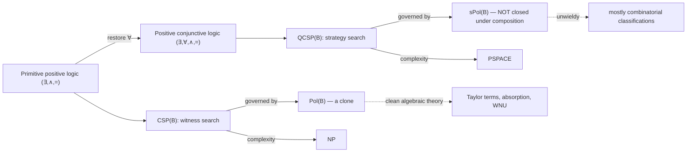

[[book-guidelines|↩ Back to guidelines]]

## Why put the quantifier back?

CSP, as the rest of this book treats it, is a *purely existential* question. A constraint language $\mathbf{B}$ (a relational structure — a domain plus some relations on it) is fixed, and $\mathrm{CSP}(\mathbf{B})$ asks: given a sentence $\varphi$ built from $\exists$, $\wedge$, and $=$ over $\mathbf{B}$'s relations — a **primitive positive (pp) sentence** — is $\varphi$ true on $\mathbf{B}$? Equivalently (and this is the reading you'll want if you've been thinking of CSP as "can I find a satisfying assignment"): can I find witnesses for all the existentially bound variables that make every constraint hold simultaneously?

But that's a fragment of first-order logic missing one whole quantifier. What happens if you restore $\forall$? You get **positive conjunctive logic** — $\exists,\forall,\wedge,=$ — and the corresponding decision problem, $\mathrm{QCSP}(\mathbf{B})$: given a positive conjunctive sentence $\varphi$, does $\mathbf{B}\models\varphi$? This is no longer "does *some* assignment work" — it's a genuine two-player game structure: "does there exist an assignment to the $\exists$-variables such that, *for every* assignment to the $\forall$-variables, the constraints hold?" (or with more alternations, arbitrarily nested).

This isn't cosmetic. Adding $\forall$ moves you from "witness search" to "strategy search," and that's exactly the jump from NP-flavored to PSPACE-flavored problems — think of the difference between SAT (does a satisfying assignment exist) and QBF (does a winning quantifier strategy exist), which is precisely the Boolean special case of this same move. The chapter's framing is deliberately deflating: QCSP is CSP's "dissolute younger brother" — logically clean to define, but algebraically messier to classify, and (unlike CSP, which shows up everywhere from scheduling to type inference) with comparatively few real applications outside the Boolean case, where it collapses to QBF. The reason this chapter — and this article — is still worth your attention is that QCSP is a **stress test** for the algebraic machinery you already trust from CSP. Watching that machinery bend (surjective operations aren't closed under composition, so QCSP's algebraic objects don't form the tidy clone structure CSP's do) tells you something real about *why* the CSP theory works as cleanly as it does.

## From existential to alternating quantifiers

### The setup: relational structures, not just predicates

The chapter uses the logical framing throughout, which is worth internalizing if you've mostly seen CSP presented combinatorially (variables/domains/constraint tables). A **constraint language** is a relational first-order structure $\mathbf{B}$ with domain $B$ (possibly with named constants). For an $m$-ary relation $R$ and a $k$-ary operation $f$ on $B$, $f$ **preserves** $R$ (equivalently $R$ is **invariant** under $f$, equivalently $f$ is a **polymorphism** of $R$) if applying $f$ coordinatewise to any $m$-ary tuple of rows in $R$ produces a row that is again in $R$:

$$
(x_1^1,\dots,x_1^m),\dots,(x_k^1,\dots,x_k^m)\in R \implies \bigl(f(x_1^1,\dots,x_k^1),\dots,f(x_1^m,\dots,x_k^m)\bigr)\in R.
$$

If you've internalized the Rust-trait style of thinking: a polymorphism is a symmetry the *entire relation* respects, the way a `PartialEq`-respecting function respects an equivalence class — except generalized to arbitrary arity and to whole tuples of arguments, not just pairs.

$\mathrm{Pol}(\mathbf{B})$, the set of all polymorphisms of $\mathbf{B}$, forms a **clone** — a set of operations closed under composition and containing all projections. This is exactly the object the rest of the book's algebraic-approach chapter builds its classification theory on top of.

### The two logics, side by side

| | Quantifiers | Logic name | Problem |
|---|---|---|---|
| CSP | $\exists,\wedge,=$ | primitive positive (pp) | $\mathrm{CSP}(\mathbf{B})$: does $\exists\bar x.\,\varphi(\bar x)$ hold on $\mathbf{B}$? |
| QCSP | $\exists,\forall,\wedge,=$ | positive conjunctive (the chapter's chosen name — also called positive Horn, quantified conjunctive-positive, "few," and others in the literature) | $\mathrm{QCSP}(\mathbf{B})$: does $\varphi$ hold on $\mathbf{B}$? |

Both are **right-hand restrictions** in the classical (non-uniform) sense: $\mathbf{B}$ is fixed as a parameter of the problem, and only $\varphi$ varies as input. (The fully general *uniform* QCSP takes the pair $(\varphi,\mathbf{B})$ as input; *left-hand* restrictions instead fix the shape of $\varphi$ and let $\mathbf{B}$ vary — this is the framework used later for parameterized-complexity results.)

A useful structural fact ties the two logics to a **hierarchy of alternation-bounded fragments**: a quantifier block is in $\Pi_{2k}$ if it starts with $\forall$ and alternates at most $2k-1$ times, and $\Pi_{2k}\text{-}\mathrm{CSP}(\mathbf{B})$ restricts QCSP's input to prenex sentences with that shape. This gives a graded ladder between CSP ($\Pi_0$, purely existential) and full QCSP:

$$
\mathrm{CSP}(\mathbf{B}) \;\preceq\; \Pi_2\text{-}\mathrm{CSP}(\mathbf{B}) \;\preceq\; \Pi_4\text{-}\mathrm{CSP}(\mathbf{B}) \;\preceq\; \cdots \;\preceq\; \mathrm{QCSP}(\mathbf{B}),
$$

landing, for finite $\mathbf{B}$, in complexity classes $\mathrm{NP} \subseteq \Pi_2^P \subseteq \Pi_4^P \subseteq \cdots \subseteq \mathrm{PSPACE}$ respectively. If you're used to the polynomial hierarchy from complexity theory, this is literally that hierarchy showing up as a knob you can turn on the *logic*, with CSP and full QCSP as its two endpoints.

**A concrete anchor (Rust-flavored):** think of $\mathrm{CSP}(\mathbf{B})$-checking as writing a backtracking search over one assignment — you're looking for *a* witness, so the algorithm is "does there exist a path through the search tree that satisfies every constraint." $\mathrm{QCSP}(\mathbf{B})$-checking is closer to writing a two-player adversarial game tree search (think: a minimax solver) — the existential player picks values, then the universal player (adversarially) picks values for their variables, and you're asking whether the existential player has a *winning strategy* regardless of what the universal player does. This is exactly why QCSP naturally lands in PSPACE rather than NP: a PSPACE algorithm can explore an exponential game tree in polynomial *space* (recursing and backtracking, never storing the whole tree), which is precisely what alternating-quantifier evaluation requires.

## Why surjective polymorphisms, and why that breaks the clean story

The single deepest technical point in this chapter is this: **CSP's complexity is governed by all polymorphisms, but QCSP's is governed only by the surjective ones — and that swap is what makes the algebra "unwieldy."**

Recall the CSP-side Galois correspondence (the load-bearing theorem behind the whole algebraic approach to CSP):

$$
\mathrm{Inv}(\mathrm{Pol}(\mathbf{B})) = \langle \mathbf{B}\rangle_{pp}.
$$

In words: the relations invariant under all of $\mathbf{B}$'s polymorphisms are *exactly* the relations pp-definable from $\mathbf{B}$. This is what lets you replace "reason about a syntactic logic fragment" with "reason about an algebraic clone" — a much more tractable object because clones have deep structure theory (Taylor terms, weak near-unanimity operations, and so on) that the rest of the book's classification results are built from.

QCSP has a parallel correspondence, but it needs a different, more restrictive notion of polymorphism — **surjective** polymorphisms, $s\mathrm{Pol}(\mathbf{B})$ (only operations $f$ that are onto):

$$
\mathrm{Inv}(s\mathrm{Pol}(\mathbf{B})) = \langle \mathbf{B}\rangle_{pc},
$$

where $\langle\mathbf{B}\rangle_{pc}$ is the class of relations definable in positive conjunctive logic. Why does adding $\forall$ force surjectivity into the picture? Intuitively: a $\forall$-quantified variable in $\varphi$ must range over *every* element of $B$, and closing a relation under a polymorphism model-checks correctly against that only if the polymorphism can actually *reach* every element as an output — a non-surjective operation would silently miss some universally-quantified cases. This is the formal cash value of "restoring $\forall$ costs you something": the object controlling complexity shrinks from *all* polymorphisms to only the *onto* ones.

Here's where it gets genuinely awkward, and where the chapter's "dissolute younger brother" framing earns its keep: **the composition of two surjective operations is still surjective, but the set of all surjective operations does *not* form a clone**, because the clone-generation process (closing a base set of operations under composition and adding projections) will in general introduce *non*-surjective operations. So $s\mathrm{Pol}(\mathbf{B})$ isn't a clone — it's a "surjective clone" (write $s(\langle A\rangle)$ for the surjective-restricted reduct of the clone generated by $A$), and that structural mismatch is exactly why algebraic tools built for clones (like the whole edifice of Taylor-term/absorption arguments elsewhere in this book) don't transfer cleanly, and why QCSP classifications have had to lean more heavily on ad hoc combinatorics than CSP classifications do.

One clean and useful side effect of the QCSP Galois correspondence, though: it can be shown that positive conjunctive definability on *finite* structures collapses to its $\Pi_2$ fragment — i.e. no matter how many quantifier alternations your sentence nominally has, on a finite domain it's equivalent to something with just one alternation. This tells you the expressive power QCSP adds over CSP, on finite structures, is bounded in a very specific sense, even though its *complexity* (PSPACE vs. NP) is not.

**Reduction consequence, mirroring the CSP case:** whenever $\mathrm{Pol}(\mathbf{B})\subseteq\mathrm{Pol}(\mathbf{B}')$ there's a logspace reduction $\mathrm{CSP}(\mathbf{B}')\le_{\log}\mathrm{CSP}(\mathbf{B})$; analogously, $s\mathrm{Pol}(\mathbf{B})\subseteq s\mathrm{Pol}(\mathbf{B}')$ gives $\mathrm{QCSP}(\mathbf{B}')\le_{\log}\mathrm{QCSP}(\mathbf{B})$. Fewer polymorphisms (a "smaller" symmetry group) means a *harder* problem — the polymorphisms are literally what an algorithm can exploit.

```rust
// A polymorphism as a Rust trait bound, informally:
// f: B^k -> B is a polymorphism of relation R if applying it
// row-wise to any k tuples already in R stays in R.
trait Polymorphism<const K: usize, B> {
    fn apply(&self, args: [B; K]) -> B;
}

// Surjectivity is an extra property layered on top — not
// something the trait signature alone can express or enforce;
// this is the crux of why sPol(B) resists being a clean, closed
// algebraic object the way Pol(B) (a clone) is.
trait Surjective<const K: usize, B> {
    // for every b: B, some input tuple maps to it
}
```

## Where the classifications actually land

The chapter surveys three research fronts. You don't need to hold every named result in your head, but the *shape* of what's known is worth internalizing, since it's a recurring pattern across this whole book: partial classifications, dichotomy/trichotomy theorems on restricted classes, and a still-open general conjecture.

### Classical complexity (Section 4)

- Schaefer's 1978 dichotomy for Boolean CSP (six tractable cases: 0-valid, 1-valid, Horn, dual-Horn, bijunctive, affine — matched to constant, constant, min, max, majority, and Mal'tsev polymorphisms respectively) has a QCSP analogue Schaefer himself stated but didn't prove; it took until later work to nail down the PSPACE-hard cases without constants.
- The first genuine algebraic **trichotomy** for QCSP (P / NP-complete / PSPACE-complete) came for constraint languages containing all graphs of permutations on a domain: tractability again tracks majority or Mal'tsev polymorphisms, the same operations that show up in the Boolean case.
- For **2-semilattice** operations $r$ (associative-ish, commutative, idempotent binary operations), a genuinely QCSP-specific phenomenon appears: complexity depends on the number of strongly connected minimal components in an auxiliary graph derived from $r$ — one component means P, more than one means co-NP-hard. For plain **semilattices** $s$, it's cleaner: $\mathrm{QCSP}(\mathrm{Inv}(s))$ is in P if $s$ has a unit element, else PSPACE-complete.
- A run of combinatorial (rather than purely algebraic) classifications covers partially reflexive forests, cycles, and semicomplete digraphs — small structural graph classes where the tractability boundary can be pinned down concretely (e.g. **loop-connectedness** — is the subgraph induced by self-loops connected? — is sufficient but not necessary for tractability). These are a good illustration of the chapter's honest self-assessment: they're combinatorially satisfying but "do not necessarily shed much light on how one might argue for complexity classifications in general."
- **Bounded alternation** ($\Pi_{2k}\text{-CSP}$) opens up a *third* complexity regime that pure CSP and pure QCSP don't have: NP-complete, co-NP-complete, *and* $\Pi_{2k}^P$-complete are all witnessed, versus just NP-complete/PSPACE-complete for full QCSP.
- **Counting quantifiers** $\exists^{\ge j}$ ("there exist at least $j$ elements such that...") generalize both $\exists$ ($j=1$) and $\forall$ ($j=|B|$) into a continuum, with a matching algebraic notion of **expanding polymorphisms** ($j$-expanding: applying $f$ to $k$ sets each of size $\ge j$ yields an output set of size $\ge j$) generalizing both $\mathrm{Pol}$ and $s\mathrm{Pol}$.
- **Infinite domains** are comparatively immature: the equality-language case (definable in $(\mathbb{Q};=)$) gets a clean L/NP-complete/co-NP-hard trichotomy governed by "negative" vs. "positive" language shape; temporal languages (definable in $(\mathbb{Q};<)$) are the current major research front, with a five-way classification (L, NL-complete, P-complete, NP-complete, PSPACE-complete) for the *positive* fragment.

### Parameterized complexity (Section 5)

Since $\mathrm{QCSP}(\mathbf{B})$ is exactly the model-checking problem for positive conjunctive logic on the singleton class $\{\mathbf{B}\}$, the whole parameterized model-checking literature bears directly on it. The load-bearing structural notion here is **graphical closure** and its associated width measures (**bounded thickness**, and its positive-conjunctive-logic specialization **elimination width**) — these play the same organizing role treewidth plays for classical CSP tractability (bounded treewidth $\Rightarrow$ tractable model-checking), but generalized to a parameter that also has to account for the graph-substitution symmetries a sentence's atoms can undergo.

### Proof theory (Section 6)

Just as SAT's canonical proof system is Resolution, and QBF's is Q-Resolution, QCSP gets its own bespoke proof system (due to Hubie Chen) that overcomes two limitations Q-Resolution inherits from being Boolean-only and prenex-only. Its associated width notion, **Q-width** (elimination width plus the maximum relation arity), yields a clean polynomial-time algorithm for QCSP instances of bounded Q-width — a genuine unification of an algorithmic tractability result and the proof-theoretic machinery that certifies it, in the same spirit as resolution width bounding SAT proof length.

## Where this leads, and the compiler-project connection

This chapter is a case study in the same load-bearing move that shows up throughout your Focus Areas in **`automated-reasoning`** and **`sat-smt-csp`**: a decision procedure's complexity is controlled by *which symmetries its underlying structure admits* — the polymorphisms/clone story here is the QCSP-specific instance of the same idea that governs SAT's resolution width, CHC solvability, and CEGAR loop termination elsewhere in your reading list. The specific lesson QCSP teaches that plain CSP doesn't: **quantifier alternation is not free**, and the algebraic object that tracks a symmetry class ($\mathrm{Pol}$ vs. $s\mathrm{Pol}$) has to shrink to stay sound once you add a quantifier that must range over an entire domain rather than just witness-search it. That's directly relevant to your compiler's CSP kernel: if you ever need your solver to answer "does *every* input satisfy this invariant" rather than "does *some* concrete counterexample exist" — i.e. verifying an invariant rather than searching for a violation — you are, whether you name it or not, moving from CSP-shaped search into QCSP-shaped strategy synthesis, and should expect the jump in worst-case complexity (NP $\to$ PSPACE) that this chapter shows is not an artifact of a bad encoding, but structural.

More concretely: your stated design pairs an abstract interpreter (proving bug *absence* via over-approximation) with a CSP kernel (proving bug *presence* via concrete counterexample search). The over-approximation side is implicitly a $\forall$-quantified claim ("for all reachable states, the invariant holds") — which is exactly QCSP's shape — while the counterexample side is $\exists$-quantified CSP proper. Recognizing that the two halves of your architecture sit on opposite sides of the same quantifier-alternation boundary this chapter formalizes is a useful frame: it explains, in principle, why invariant *verification* is intrinsically harder than counterexample *search*, independent of which specific algorithms you implement for each.



## Notable open questions the chapter leaves live

- Whether a full complexity classification for QCSP is achievable at all in the near term — Schaefer's original Feder–Vardi-style dichotomy conjecture for CSP is itself only resolved on restricted domain sizes and structural classes, and any QCSP classification would have to *embed* a full CSP classification (since $\mathrm{CSP}(\mathbf{B})$ and $\mathrm{QCSP}(\mathbf{B}\uplus\mathbf{1})$ are polynomially equivalent for all $\mathbf{B}$).
- Whether the notion of a "Q-core" (the QCSP analogue of the CSP notion of a core, needed to justify assuming idempotent polymorphisms without loss of generality) is even well-defined up to uniqueness — unlike the CSP core, which is a clean, well-behaved canonical form.
- The specific open complexity of $\mathrm{QCSP}(\mathbb{Q}; x{=}y\to y{=}z)$: known co-NP-hard, unknown whether it's PSPACE-complete — resolving it either completes a clean trichotomy for temporal QCSP, or forces a messier tetrachotomy.

This is a chapter to return to less for its individual named results and more as a worked example of what happens to a well-understood classification theory (CSP's algebraic approach) when you push one of its founding assumptions (existential-only quantification) in the most natural possible direction.
