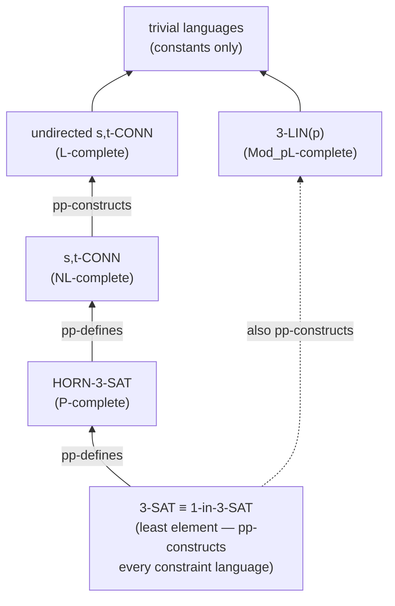
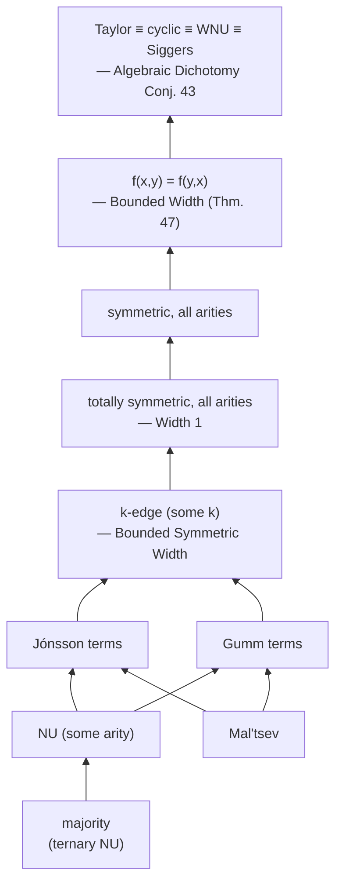

# The Algebraic Approach to CSP

> [[book-guidelines|↩ Back to guidelines]]

## Why CSP needs a "fixed language" at all

The Constraint Satisfaction Problem, in its most naked form, is almost too general to say anything about. Give me *any* NP problem and I can dress it up as "find an assignment of values to variables that satisfies a list of relational constraints." That generality is exactly why CSP is useful as a *framework* — 3-SAT, graph coloring, database query evaluation, and systems of linear equations over a finite field are all literally the same computational shape — but it's also why "the complexity of CSP" isn't a meaningful question until you pin something down. Decide *nothing* about which relations are allowed, and you've just restated "is P = NP" in fancier clothing.

The move the chapter makes — and the move that the entire thirty-year research program surveyed in this book grows out of — is to fix the *menu* of allowed constraint relations in advance, and then ask about the complexity of the resulting family of instances. Formally:

$$\mathrm{CSP}(\mathcal{D}) = \{\, P = (V, D, C) \mid \text{every constraint relation used in } C \text{ belongs to a fixed finite set } \mathcal{D} \text{ of relations on domain } D \,\}$$

An *instance* $P = (V, D, C)$ consists of a finite set of variables $V$, a finite domain $D$, and a list of constraints, each a pair $(x, R)$ of a scope (tuple of variables) and a relation $R \subseteq D^n$ that scope must land in. An assignment $f : V \to D$ *solves* $P$ if $f(x) \in R$ for every constraint. What changes as you range over different fixed $\mathcal{D}$ is not the *shape* of the problem — it's always "does a satisfying assignment exist" — but its *computational content*. Some $\mathcal{D}$ give you an NP-complete problem (3-SAT); others collapse all the way down to L-complete ($s,t$-connectivity in undirected graphs). The entire question the algebraic approach answers is: **what property of $\mathcal{D}$ decides which of these two extremes — and everything in between — you land in?**

The answer, spoiler included right in the chapter title, is *polymorphisms*: higher-arity symmetries of the constraint language. Before that answer makes sense, though, you need the vocabulary for comparing languages — because the real technical achievement isn't computing the complexity of one language at a time, it's building a *reduction calculus* powerful enough that "the complexity of $\mathrm{CSP}(\mathcal{D})$" becomes a well-behaved algebraic invariant of $\mathcal{D}$.

## CSP over a fixed language, worked

A **constraint language** $\mathcal{D}$ is just a finite set of relations sharing a common finite domain $D$. Equivalently — and this equivalence matters, because it's the bridge to database theory and to logic — you can view $\mathcal{D}$ as a *relational structure* $(D; R_1, R_2, \dots)$, and $\mathrm{CSP}(\mathcal{D})$ becomes exactly the problem of deciding whether a Boolean conjunctive query over that structure is true, or (equivalently again) whether a given structure $\mathbf{G}$ admits a *homomorphism* into $\mathbf{D}$. All three framings — constraints, conjunctive queries, homomorphisms — describe the same computational object, and the chapter moves fluidly between them because each suggests different tools (relational algebra for the query view, graph-theoretic intuition for the homomorphism view).

The chapter grounds this with a run of worked examples, each a *specific* $\mathrm{CSP}(\mathcal{D})$ with a *known* complexity:

| Problem | $\mathcal{D}$ | Complexity |
|---|---|---|
| 3-SAT | $\{S_{ijk} : i,j,k \in \{0,1\}\}$, $S_{ijk} = \{0,1\}^3 \setminus \{(i,j,k)\}$ | NP-complete |
| 1-in-3-SAT | $\{(0,0,1),(0,1,0),(1,0,0)\}$ | NP-complete |
| HORN-3-SAT | clauses with $\le 1$ positive literal, plus constants | P-complete |
| $k$-COLORING | $\{\neq_k\}$ (binary disequality on $k$ colors) | NP-complete, $k \ge 3$; L-complete for $k=2$ |
| $H$-COLORING | $\{E(H)\}$ for a fixed digraph $H$ | varies (this is the digraph-homomorphism problem) |
| 3-LIN($p$) | affine subspaces of $\mathrm{GF}(p)^3$ of codimension 1 | $\mathrm{Mod}_pL$-complete |
| $s,t$-connectivity | $\{C_0, C_1, I\}$ where $I = \{(0,0),(0,1),(1,1)\}$ | NL-complete (directed) / L-complete (undirected) |

**What breaks without fixing the language:** if you let $\mathcal{D}$ vary per-instance, or allow it to be infinite without restriction, you lose the ability to say anything at all — the "complexity of CSP" becomes the complexity of *every* problem, since (as Chapter 3 of this book shows for infinite domains) essentially every computational problem is polynomial-time equivalent to *some* $\mathrm{CSP}(\Gamma)$. Fixing $\mathcal{D}$ finite is what turns "CSP" from a tautological restatement of computability theory into a genuine classification problem with a hope of a clean answer.

That hope has a name. Feder and Vardi's 1998 paper conjectured:

> **Conjecture (Feder–Vardi Dichotomy).** For every finite constraint language $\mathcal{D}$, $\mathrm{CSP}(\mathcal{D})$ is either in P or NP-complete.

This is a strong claim — Ladner's theorem guarantees that if $\mathrm{P} \ne \mathrm{NP}$, there are problems in NP that are neither in P nor NP-complete, so *some* restricted family of NP problems must fail to have this property, or the theorem would be vacuous for all of NP. Feder and Vardi were betting that fixed-language CSP is exactly the "natural" boundary where this failure doesn't happen — a bet that was eventually proven correct (independently, in 2017, by Bulatov and by Zhuk — after this survey was written, which is worth flagging: the chapter you're reading treats it as a live conjecture, because at publication time it still was one).

## Comparing languages: pp-definitions, interpretations, constructions

Here's the structural problem the chapter solves next. Knowing the complexity of individual named CSPs (3-SAT, HORN-3-SAT, …) is a finite list of facts. What you actually want is a *reduction calculus*: a way to say "language $\mathcal{D}$ is at least as hard as language $\mathcal{E}$" that (a) is provable directly from the relations in $\mathcal{D}$ and $\mathcal{E}$, without having to invent a bespoke gadget reduction every time, and (b) composes, so you can build a partial order on languages by hardness.

**What breaks without this:** without a systematic reduction notion, every hardness/tractability proof is a one-off combinatorial argument, and there's no way to organize the space of all constraint languages — you'd be proving Schaefer's theorem (the dichotomy for 2-element domains) and the Hell–Nešetřil theorem (for single symmetric binary relations) as two isolated facts with no visible common structure, which is in fact exactly the situation *before* the algebraic connection was found.

The fix is **primitive positive (pp-) definability**, generalized in two steps to **pp-interpretability** and then **pp-constructibility**:

$$\text{pp-definition} \;\subseteq\; \text{pp-interpretation} \;\subseteq\; \text{pp-construction}$$

**pp-definition.** $\mathcal{D}$ *pp-defines* $\mathcal{E}$ (same domain) if every relation of $\mathcal{E}$ can be written as
$$R(\bar x) \iff \exists \bar y \; \bigwedge_i \alpha_i(\bar x, \bar y)$$
where each $\alpha_i$ is an atomic formula using only relations of $\mathcal{D}$ and equality — no negation, no disjunction, no universal quantifier. Operationally: you build a CSP($\mathcal{D}$) *gadget* instance, designate some of its variables as the "interface," and the relation you get by projecting the gadget's solution set onto the interface variables is exactly $R$. This is the formal version of a reduction gadget, and the theorem is exactly what you'd hope:

> **Theorem.** If $\mathcal{D}$ pp-defines $\mathcal{E}$, then $\mathrm{CSP}(\mathcal{E})$ reduces to $\mathrm{CSP}(\mathcal{D})$.

Worked example from the chapter: $\mathcal{D}_{3SAT}$ pp-defines $\mathcal{D}_{HornSAT}$ (the constants $C_0(x) \equiv S_{111}(x,x,x)$, $C_1(x) \equiv S_{000}(x,x,x)$ fall right out), which in turn pp-defines $\mathcal{D}_{STCON}$ via $I(x,y) \iff \exists z\,(C_1(z) \land S_{110}(z,x,y))$.

**pp-interpretation.** Same idea, but you no longer require the two languages to share a domain. Instead you pp-define (from $\mathcal{D}$) a set $F \subseteq D^n$ that will *represent* $E$ (the domain of $\mathcal{E}$) under a surjection $f : F \twoheadrightarrow E$, and you pp-define the $f$-preimage of equality and of every relation of $\mathcal{E}$. Think of it as coordinatizing $\mathcal{E}$'s elements as $n$-tuples over $D$, modulo some pp-definable equivalence. The special case $F = D^n$, $f = \mathrm{id}$ is called a **pp-power**.

**pp-construction.** The most general notion: a chain
$$\mathcal{D} = \mathcal{C}_1, \mathcal{C}_2, \dots, \mathcal{C}_k = \mathcal{E}$$
where each step is a pp-interpretation, a homomorphic equivalence (a pair of structure-preserving maps both ways — weaker than isomorphism, it just says the two languages have "the same" CSP up to relabeling), or a **singleton expansion** of a **core** (adding all the singleton unary relations $C_a = \{a\}$ to a language whose only endomorphisms are bijections — this doesn't make the CSP harder, because you can pp-define "being an endomorphism" and self-reduce). Remarkably, this whole chain collapses:

> **Theorem.** $\mathcal{D}$ pp-constructs $\mathcal{E}$ iff $\mathcal{E}$ is homomorphically equivalent to a pp-power of $\mathcal{D}$.

Each layer buys you a corresponding reduction theorem ($\mathrm{CSP}(\mathcal{E}) \le \mathrm{CSP}(\mathcal{D})$), so pp-constructibility is the *coarsest* (most permissive) of the three, giving the widest possible reduction relation while still being provably sound.

### The pp-constructibility poset

Because pp-constructibility is reflexive and transitive, identifying mutually-pp-constructing languages gives a genuine **partial order**: $\mathcal{D} \le \mathcal{E}$ iff $\mathcal{D}$ pp-constructs $\mathcal{E}$, and "higher means easier" (Corollary: if $\mathcal{D} \le \mathcal{E}$ then $\mathrm{CSP}(\mathcal{E})$ reduces to $\mathrm{CSP}(\mathcal{D})$, i.e. $\mathcal{E}$'s problem is no harder than $\mathcal{D}$'s). The language of 3-SAT sits at the **bottom** — it has no nontrivial polymorphisms at all (see below), which turns out to mean it pp-defines *every* relation on its domain, and from there pp-*constructs every constraint language whatsoever*. This is what "3-SAT is maximally hard" means made precise: it isn't just one hard problem, it's the least element of the entire hardness order.



This poset structure is the whole reason the survey bothers to prove three nested notions of reduction rather than just one: pp-definition alone can't compare languages on different domains (you couldn't relate a Boolean SAT language to a 3-coloring language over $\{0,1,2\}$ using pp-definition alone), but pp-construction can, which is what lets Example 18 in the chapter show 3-SAT pp-constructs (via the singleton expansion of the core of) 3-COLORING, establishing that $k$-COLORING for $k \ge 3$ sits at the same hardness floor as 3-SAT.

With the ordering in hand, Bulatov–Jeavons–Krokhin's conjecture becomes a precise statement about *position in the poset*:

> **Conjecture (Tractability Conjecture, BJK).** If $\mathcal{D}$ does not pp-construct the language of 3-SAT, then $\mathrm{CSP}(\mathcal{D})$ is solvable in polynomial time.

Combined with the (easy) observation that pp-constructing 3-SAT's language *does* give NP-hardness, this is an equivalent, algebraically-flavored restatement of the Feder–Vardi Dichotomy Conjecture — and it's the form the rest of the chapter, and much of the book, actually works with.

## Polymorphisms: symmetries that classify

Here is the pivot the whole chapter is building toward. Reductions let you *compare* languages, but they don't yet tell you *why* some languages are easy. The answer is that hardness comes from a lack of symmetry — but the symmetries that matter for CSP aren't the ones you'd first reach for (automorphisms, i.e. unary self-maps preserving structure). They're *higher-arity* symmetries: operations that combine several solutions into a new one.

**Definition.** An $n$-ary operation $f : D^n \to D$ is a **polymorphism** of a $k$-ary relation $R \subseteq D^k$ (equivalently, $R$ is *invariant under* $f$) if applying $f$ coordinate-wise to any $n$ tuples drawn from $R$ always lands back in $R$. Concretely: arrange $n$ rows of $R$ into an $n \times k$ matrix; apply $f$ to each of the $k$ columns; the resulting $k$-tuple must be in $R$ again.

$f$ is a polymorphism of a whole language $\mathcal{D}$ if it's a polymorphism of every relation in $\mathcal{D}$. A **unary** polymorphism is exactly an endomorphism — so polymorphisms literally generalize the classical notion of symmetry to arbitrary arity.

**What breaks without going beyond unary symmetries:** automorphism groups are far too coarse an invariant to separate P from NP-complete instances of CSP — Schaefer's dichotomy for two-element domains, for instance, cannot be derived from unary symmetry alone, because most of the tractable 2-element languages (Horn-SAT, 2-SAT, affine/XOR-SAT) have *trivial* automorphism groups but rich higher-arity polymorphisms.

**Worked examples from the chapter, made concrete:**

- **2-SAT** is preserved by the **majority** operation $\mathrm{maj}(x,y,z)$, the value appearing at least twice among its arguments. *Any* binary relation on $\{0,1\}$ is compatible with majority — this is a one-line pigeonhole check — which is exactly why every 2-SAT instance's solution set is closed under taking majorities of any three solutions, letting you combine solutions locally without re-checking constraints.
- **HORN-3-SAT** is preserved by $\min(x,y)$: given two satisfying assignments, their coordinate-wise minimum also satisfies every Horn clause (a Horn clause fails only if you're forced from all-false to true on the positive literal, and $\min$ never increases a value).
- **3-LIN($p$)** is preserved by the affine combination $f(x,y,z) = x - y + z \bmod p$: three solutions to a system of linear equations combine, via this Mal'tsev-shaped operation, into a fourth solution — this is literally why Gaussian elimination works, viewed algebraically.
- **3-SAT itself has no polymorphisms other than the trivial projections** $\pi_i^n(a_1,\dots,a_n) = a_i$. This absence is the algebraic fingerprint of "no way to combine solutions" — and, as noted above, it's *why* 3-SAT sits at the bottom of the pp-constructibility poset.

### The clone, and the Galois connection

The set of *all* polymorphisms of $\mathcal{D}$, written $\overline{\mathcal{D}}$, always contains the projections and is closed under composition — these two closure properties define a **clone**. $\overline{\mathcal{D}}$ is called the *clone of polymorphisms* of $\mathcal{D}$.

This is where the algebraic machine actually turns on. Polymorphism and invariance form a textbook **Galois connection** between the lattice of relations (ordered by "richer language" via pp-definability) and the lattice of clones (ordered by inclusion):

$$\mathcal{D} \text{ pp-defines } \mathcal{E} \quad \Longleftrightarrow \quad \overline{\mathcal{D}} \subseteq \overline{\mathcal{E}}$$

Read this carefully — the direction matters and is slightly counter-intuitive at first: a *richer* language (one that pp-defines more) has *fewer* polymorphisms (a smaller clone), because adding relations to pp-define from only adds constraints an operation must satisfy to remain compatible. The proof of the forward direction is a direct unwinding of definitions; the reverse — "if $R$ is compatible with every polymorphism of $\mathcal{D}$, then $R$ is pp-definable from $\mathcal{D}$" — is the genuinely deep half, and it's constructive: you pp-define the ($|D|^k$-ary!) relation of *all* $k$-ary polymorphisms of $\mathcal{D}$ directly from $\mathcal{D}$ (no existential quantifiers needed — you're just conjoining "this operation is compatible with every relation in $\mathcal{D}$"), then existentially quantify away the coordinates you don't need. The resulting pp-formula can be astronomically long (the chapter's own worked example for a 4-tuple relation over 3 colors needs $3^4 = 81$ variables), and deciding whether a pp-definition exists at all is co-NEXPTIME-hard — but its *existence*, whenever $\overline{\mathcal{D}} \subseteq \overline{\mathcal{E}}$ holds, is unconditional.

**The payoff, stated plainly:** the computational complexity of $\mathrm{CSP}(\mathcal{D})$ depends on $\mathcal{D}$ *only through its clone of polymorphisms* $\overline{\mathcal{D}}$. Two wildly different-looking languages with the same clone have the same complexity, up to logspace reduction. This is the theorem that licenses everything downstream: instead of classifying constraint languages (an unbounded combinatorial space of relations), you classify *clones* — an algebraic object with well-developed theory going back decades before anyone connected it to computational complexity.

## From relations to identities: the Taylor/WNU/cyclic/Siggers convergence

Clones are still unwieldy objects — infinite, generally. The chapter's next move sharpens the invariant further, from "which clone" down to "which *identities* the clone's operations satisfy" — specifically **height-1 identities**: equations between term expressions where *each side has at most one occurrence of an operation symbol* (so you can compare across different clones — a height-1 identity is really a template, not tied to one specific algebra).

> **Theorem.** $\mathcal{D}$ pp-constructs $\mathcal{E}$ iff there is an **h1 clone homomorphism** $\overline{\mathcal{D}} \to \overline{\mathcal{E}}$ — a map preserving arities and height-1 identities (but not necessarily anything stronger, like associativity).

Consequently: **the complexity of $\mathrm{CSP}(\mathcal{D})$, up to logspace reduction, depends only on which finite systems of height-1 identities are satisfied by operations in $\overline{\mathcal{D}}$.** This converts a *negative* description of a tractability class ("$\mathcal{D}$ doesn't pp-construct these forbidden languages") into a *positive* one ("$\mathcal{D}$'s clone has operations satisfying these identities") — provided you can actually find manageable identities that characterize the class you care about. That discovery is the headline achievement being surveyed.

Here's the one that matters most. A **Taylor operation** is a $k$-ary operation $f$ such that, for every coordinate $i$, some identity of the shape
$$f(z_{i,1},\dots,z_{i,i-1},x,z_{i,i+1},\dots,z_{i,k}) = f(z'_{i,1},\dots,z'_{i,i-1},y,z'_{i,i+1},\dots,z'_{i,k})$$
holds, with each $z_{i,j}, z'_{i,j} \in \{x,y\}$. Read this as: "for each coordinate, there's *some* way of setting all the other coordinates to $x$'s and $y$'s that makes $f$ provably not depend on that coordinate alone" — precisely the weakest possible height-1 obstruction to $f$ being a projection.

> **Theorem.** $\mathcal{D}$ does not pp-construct the language of 3-SAT $\iff$ $\mathcal{D}$ has a Taylor polymorphism of some arity.

Since "does not pp-construct 3-SAT" is exactly the tractable side of the Tractability Conjecture, this pins the entire conjectured P/NP-complete boundary to a single algebraic condition. And here is the genuinely striking part of the chapter — the convergence the third Key Question in the guidelines is really asking about. Three other, superficially unrelated conditions turn out to be *exactly equivalent* to having a Taylor polymorphism:

- **Weak near-unanimity (WNU):** a $k$-ary $f$ with $f(y,x,\dots,x) = f(x,y,x,\dots,x) = \dots = f(x,\dots,x,y)$.
- **Cyclic:** a $k$-ary $f$ with $f(x_1,\dots,x_k) = f(x_2,\dots,x_k,x_1)$.
- **Siggers:** a single 4-ary $f$ with $f(y,x,y,z) = f(x,y,z,x)$ (mnemonic, due to Ryan O'Donnell: $f(r,a,r,e) = f(a,r,e,a)$).

> **Theorem.** For every $\mathcal{D}$: has Taylor $\iff$ has WNU $\iff$ has cyclic $\iff$ has Siggers.

This lets the Tractability Conjecture be restated as the **Algebraic Dichotomy Conjecture**: *if $\mathcal{D}$ has a Taylor (equiv. WNU, cyclic, Siggers) polymorphism, $\mathrm{CSP}(\mathcal{D})$ is in P; otherwise it's NP-complete.* Informally: *a nontrivial higher-dimensional symmetry gives you a nontrivial way to combine solutions, and that's exactly what tractability requires.*

A trap worth naming, because the chapter names it explicitly: this is *not* the same as "NP-complete iff every polymorphism is a projection." Example 44 in the chapter constructs a 3-element-domain language whose clone has *lots* of non-projection polymorphisms, yet is still NP-complete — because none of those extra operations satisfy any height-1 identity a projection doesn't already satisfy (they're built by patching a projection together with an operation on a 2-element sub-part). Height-1 identities, not "existence of any nontrivial operation," are the load-bearing invariant.

### The taxonomy of stronger identities

The chapter closes Section 4 by placing Taylor/WNU/cyclic/Siggers at the *weakest* end of a whole taxonomy of stronger linear identities that universal algebraists had already been studying for decades before the CSP connection was found — majority (ternary near-unanimity), Mal'tsev ($f(x,x,y)=f(y,x,x)=y$), Jónsson and Gumm terms (used to characterize congruence-distributive varieties), and $k$-edge operations. Each stronger condition characterizes a *smaller*, more specific tractable subclass (bounded width, bounded linear width, bounded symmetric width — corresponding to NL and L membership via local-consistency algorithms), and the proof strategy across the whole research program is: prove the positive result for the strong, well-understood identities first, then relax toward the weak Taylor boundary.



*(Arrows point from stronger to weaker conditions — "upward" in the book's own Figure 1. Every constraint language with the lower condition's polymorphisms also has the upper condition's, by composing with projections; the reverse implications are the actual open/hard mathematics.)*

## Grounding: what the algebra buys an implementer

### Rust — polymorphism-checking as a primitive in a CSP kernel

The single most implementable idea in this chapter, for a CSP solver kernel, is that **checking whether a candidate operation is a polymorphism of a relation is a finite, brute-force-checkable property** — which is exactly the kind of structural fact a solver can exploit to prune search or choose a specialized algorithm. Here's the definitional check made literal:

```rust
use itertools::Itertools;
use std::collections::HashSet;

type Elem = u8;
type Tuple = Vec<Elem>;

/// A finite relation: an explicit set of k-ary tuples over a domain.
struct Relation {
    arity: usize,
    tuples: HashSet<Tuple>,
}

/// Checks whether `f` (an n-ary operation) is a polymorphism of `rel`:
/// applying f coordinate-wise to any n rows drawn from `rel` (with
/// repetition allowed) must land back in `rel`.
fn is_polymorphism(f: &dyn Fn(&[Elem]) -> Elem, n: usize, rel: &Relation) -> bool {
    let rows: Vec<&Tuple> = rel.tuples.iter().collect();
    for matrix in std::iter::repeat(rows.iter()).take(n).multi_cartesian_product() {
        let mut image = Vec::with_capacity(rel.arity);
        for col in 0..rel.arity {
            let column: Vec<Elem> = matrix.iter().map(|row| row[col]).collect();
            image.push(f(&column));
        }
        if !rel.tuples.contains(&image) {
            return false;
        }
    }
    true
}

/// The majority operation on {0,1}: the value repeated at least twice.
fn majority(args: &[Elem]) -> Elem {
    let ones = args.iter().filter(|&&x| x == 1).count();
    if ones * 2 >= args.len() { 1 } else { 0 }
}

/// A cyclic-operation check: does f(x1,...,xk) = f(x2,...,xk,x1) hold on this domain?
fn is_cyclic(f: &dyn Fn(&[Elem]) -> Elem, domain: &[Elem], k: usize) -> bool {
    std::iter::repeat(domain.iter())
        .take(k)
        .multi_cartesian_product()
        .all(|args: Vec<&Elem>| {
            let xs: Vec<Elem> = args.iter().map(|&&x| x).collect();
            let mut rotated = xs.clone();
            rotated.rotate_left(1);
            f(&xs) == f(&rotated)
        })
}
```

This is not just a toy: it's exactly the shape of routine the chapter's Theorem 32 relies on abstractly (searching the clone of a language for operations obeying a target identity system), and it's the natural place where a Rust CSP kernel would hook in a **language-classification pass** before dispatching to a specialized algorithm — e.g., detect a $\min$-closed (submodular-flavored) language and route to a dedicated propagator, rather than falling back to generic backtracking. For your refinement-type verifier's counterexample search, this is the mechanism by which "this sub-language of constraints is tractable" gets turned into an actual dispatch decision rather than a hand-wavy heuristic.

### Lean — the Galois connection, made literal

The Pol–Inv correspondence is *exactly* a textbook Galois connection between two partially ordered sets — languages ordered by pp-definability (reversed) and clones ordered by inclusion — and Lean's type system lets you state that shape directly rather than by analogy:

```lean
structure Relation (D : Type) (k : ℕ) where
  tuples : Finset (Fin k → D)

-- An n-ary operation f is a polymorphism of R if applying f coordinate-wise
-- to any n rows of R (as columns of an n × k matrix) stays in R.
def IsPolymorphism {D : Type} [DecidableEq D] {n k : ℕ}
    (f : (Fin n → D) → D) (R : Relation D k) : Prop :=
  ∀ rows : Fin n → Fin k → D,
    (∀ i, rows i ∈ R.tuples) →
    (fun j => f (fun i => rows i j)) ∈ R.tuples

-- Pol(𝒟): the clone of all operations (of any arity) compatible with every
-- relation in a language 𝒟.
def Pol {D : Type} [DecidableEq D] (lang : List (Σ k, Relation D k)) :
    Set (Σ n, (Fin n → D) → D) :=
  { p | ∀ r ∈ lang, IsPolymorphism p.2 r.2 }

-- The Galois connection's defining anti-monotonicity: a richer language
-- (more relations, or relations implying more of the pp-defined closure)
-- can only have a smaller (or equal) clone of polymorphisms.
theorem pol_antitone {D : Type} [DecidableEq D]
    (D1 D2 : List (Σ k, Relation D k)) (h : ∀ r ∈ D2, r ∈ D1) :
    Pol D1 ⊆ Pol D2 := by
  intro p hp r hr
  exact hp r (h r hr)
```

`pol_antitone` is the trivial half of the Galois connection — richer language, smaller (or equal) clone — stated as an actual, checkable Lean proof rather than prose. The *hard* half (every relation invariant under $\overline{\mathcal{D}}$ is pp-definable from $\mathcal{D}$) is where the real mathematical content lives, and it is exactly the kind of "closure operator has a section" statement that shows up again when you formalize definitional equality or elaboration: `Pol` and `Inv` here play the same structural role that a type-checker's context-closure and a unifier's most-general-unifier operator play elsewhere — both are Galois-connection pairs between a syntactic side (formulas/terms) and a semantic/algebraic side (clones/substitutions).

### Python — a five-line sanity check

For quick exploratory work (e.g. hunting for whether a small relation has a Siggers polymorphism before committing to a Rust implementation), brute force over a tiny domain is often the fastest way to build intuition:

```python
from itertools import product

def has_siggers(domain, is_compatible):
    """Search for f: D^4 -> D satisfying f(y,x,y,z) = f(x,y,z,x)
    that is compatible with every relation `is_compatible` checks."""
    n = len(domain)
    for values in product(domain, repeat=n**4):
        f = dict(zip(product(domain, repeat=4), values))
        if all(f[(y, x, y, z)] == f[(x, y, z, x)]
               for x in domain for y in domain for z in domain):
            if is_compatible(f):
                return f
    return None
```

This is exponential and only useful for toy domains ($|D| \le 3$, say) — but it's a genuinely useful first move when you want to check "does this small counterexample-search sub-language even admit a Siggers polymorphism" before reasoning about it abstractly, exactly mirroring how the chapter itself treats small worked examples ($\mathcal{D}_{3COLOR}$, the 3-vertex digraph $H$) as the way to build intuition before the general theorems.

## Where this leads

This chapter is the load-bearing floor for the entire rest of the book. Every later survey in the volume either **specializes** this machinery (Chapter 2's [[Absorption-Theory|Absorption Theory]] refines *how* Taylor/cyclic polymorphisms are found and used; Chapter 10's [[Digraph-CSP|Digraph CSP]] applies the identity taxonomy to a concrete, drawable test bed) or **generalizes** it (Chapter 8's [[Valued-CSP|Valued CSP]] replaces polymorphisms with *fractional* polymorphisms for optimization; Chapter 11's [[Quantified-CSP|Quantified CSP]] swaps the Pol–Inv Galois connection for a second one built on *surjective* polymorphisms, which is why QCSP's algebra is "less clean" — surjections aren't closed under composition the way all operations are). The pp-constructibility poset, the Galois connection, and the Taylor/WNU/cyclic/Siggers equivalence are the shared vocabulary every subsequent chapter assumes you already have.

For the compiler/verifier project this vault is ultimately in service of (tagged `sat-smt-csp`, with a secondary pull on `automated-reasoning`): the Pol–Inv Galois connection here is a direct structural cousin of the unification-side Galois connections your elaborator will need — both are instances of "a closure operator on a syntactic side corresponds exactly to a closure operator on a semantic side, and the interesting content is proving the correspondence is tight." More concretely and more urgently: the height-1-identity classification is the theoretical justification for *why* a CSP kernel doing counterexample search should first classify the algebraic shape of the constraint sub-language it's facing (Taylor? bounded-width? Mal'tsev-shaped, hence solvable by Gaussian-elimination-style propagation?) rather than treating every constraint problem as generic backtracking search — the polymorphism structure is precisely the "structural tractability" signal (per this book's own Focus-Area framing) that should drive dispatch between a fast structural solver and a general-purpose one when your abstract interpreter hands off a counterexample-search obligation to the CSP kernel.
