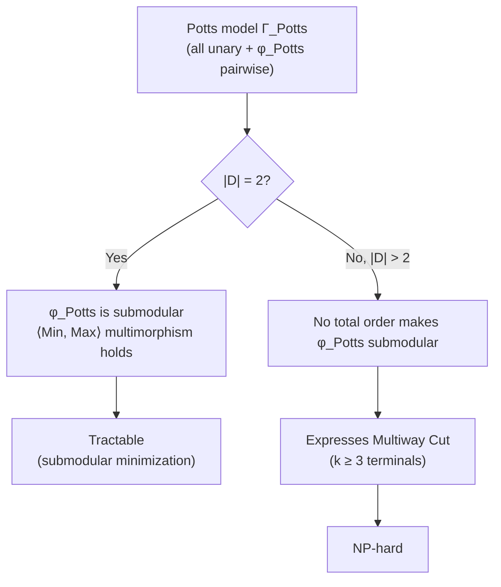

# Valued CSP: Cost Functions, Fractional Polymorphisms, and the Optimization Dichotomy

## Why decision CSP is not enough

Classical CSP asks a yes/no question: does an assignment exist that satisfies every constraint? That framing is perfect for puzzles like Sudoku or graph coloring, where "satisfiable or not" is the whole story. But most real problems are not that clean. A vision system trying to label every pixel with a depth value doesn't just want a *feasible* labeling — it wants the labeling that best matches the observed image, trading off local evidence against smoothness. A scheduler doesn't just want a valid roster — it wants the cheapest one. In these settings, "satisfiable" is almost the wrong question: many labelings are technically fine, and the entire problem is about which one is *best*.

The Valued CSP (VCSP) framework, surveyed in this chapter by Krokhin and Živný, generalizes CSP to handle exactly this. Instead of relations (tuples that are either "in" or "out"), it uses **cost functions**: numbers, not booleans. Whether a candidate solution is "in" or "out" becomes a special case (cost 0 versus cost $\infty$) of a much richer question — *how much does this cost, and can we minimize it?*

**What breaks without this generalization:** without cost functions, you cannot even *state* combinatorial optimization problems like Min-Cut, Max-Cut, or Markov Random Field energy minimization as CSP instances — you'd need an entirely separate theoretical toolkit for each one, forfeiting the payoff of the algebraic approach (the idea, central to this whole book, that the complexity of a problem class is fully determined by a set of symmetry operations called polymorphisms). VCSP recovers a single unified toolkit that covers both feasibility and optimization, and — as we'll see — even mixtures of the two within one instance.

## 1. Cost functions and the VCSP objective

### The formal setup

Fix a finite domain $D$ (the set of possible "labels" a variable can take) and let $\overline{\mathbb{Q}} = \mathbb{Q} \cup \{\infty\}$ be the rationals extended with positive infinity.

A **cost function** is a map $\varphi : D^m \to \overline{\mathbb{Q}}$. Here $m$ is the *arity* of the function — the number of variables it looks at simultaneously. A **valued constraint** is an expression $\varphi(\mathbf{x})$ where $\mathbf{x} \in V^m$ is a tuple of variables (the *scope*) and $\varphi$ is a cost function.

A **VCSP instance** on variables $V = \{x_1, \dots, x_n\}$ is an objective

$$
\Phi(x_1, \dots, x_n) = \sum_{i=1}^{q} \varphi_i(\mathbf{x}_i),
$$

and the goal is to find a labeling of $V$ (an assignment of each variable to some $d \in D$) that **minimizes** $\Phi$. Each valued constraint contributes its cost independently, and the total cost is just the sum. This additive structure is what makes the framework tractable to analyze — you can reason locally about each constraint's contribution.

The crucial move is what $\infty$ means: **an infinite cost encodes infeasibility**. If any constraint assigns $\infty$ to a candidate labeling, that labeling is disqualified entirely, no matter how good the rest of the assignment is. This single convention is what lets VCSP unify feasibility and optimization into one number-crunching framework instead of two separate mechanisms.

### Feasibility versus optimization: the three regimes

The book explicitly identifies three regimes an instance can fall into, distinguished by which values its cost functions actually use:

1. **Finite-valued instances**: every constraint function only ever outputs finite numbers. Then *every* assignment is feasible — there's nothing to reject, only to compare. The problem reduces to pure optimization.
2. **Crisp instances**: every constraint function takes exactly two values — one finite value (possibly per-constraint) and $\infty$. Then all feasible assignments are equally good; the only question is existence. This is exactly classical CSP in disguise (the book calls such $\{0,\infty\}$-valued cost functions "crisp").
3. **General-valued instances**: neither of the above — costs mix finite gradations *and* hard infeasibility. This is the genuinely new case VCSP is built for, and the chapter's title phrase "general-valued" specifically flags it.

Rust makes this trichotomy concrete as a type-level distinction, which is worth internalizing because it's exactly the shape you'd want in a solver's internal representation:

```rust
use std::cmp::Ordering;

/// A cost in the extended rationals: either a finite rational cost,
/// or "infeasible" (the VCSP encoding of `∞`).
#[derive(Clone, Copy, Debug, PartialEq)]
enum Cost {
    Finite(f64), // in a real solver: exact rational, not f64
    Infeasible,
}

impl Cost {
    fn add(self, other: Cost) -> Cost {
        match (self, other) {
            (Cost::Finite(a), Cost::Finite(b)) => Cost::Finite(a + b),
            _ => Cost::Infeasible, // ∞ + anything = ∞
        }
    }

    fn le(self, other: Cost) -> bool {
        match (self, other) {
            (Cost::Finite(a), Cost::Finite(b)) => a <= b,
            (Cost::Finite(_), Cost::Infeasible) => true,
            (Cost::Infeasible, Cost::Finite(_)) => false,
            (Cost::Infeasible, Cost::Infeasible) => true,
        }
    }
}

/// A cost function of arity m over domain D = 0..domain_size,
/// represented explicitly as a table (as in Definition 1).
struct CostFunction {
    arity: usize,
    domain_size: usize,
    table: Vec<Cost>, // indexed by the tuple, base-`domain_size`
}

impl CostFunction {
    fn eval(&self, tuple: &[usize]) -> Cost {
        let mut idx = 0;
        for &v in tuple {
            idx = idx * self.domain_size + v;
        }
        self.table[idx]
    }

    /// Is this cost function finite-valued (pure optimization),
    /// crisp (pure feasibility, i.e. a plain CSP relation), or mixed?
    fn regime(&self) -> &'static str {
        let has_finite = self.table.iter().any(|c| matches!(c, Cost::Finite(_)));
        let has_infinite = self.table.iter().any(|c| matches!(c, Cost::Infeasible));
        match (has_finite, has_infinite) {
            (true, false) => "finite-valued (pure optimization)",
            (false, true) => "trivial (always infeasible)",
            (true, true) => "general-valued (mixed)",
            (false, false) => "empty",
        }
    }
}
```

Note that even the "crisp" case isn't quite binary-valued in general — a crisp constraint's *finite* value can differ from one constraint to another (the book's Definition emphasizes "one finite value, possibly specific to the constraint, and $\infty$"), which is exactly what lets crisp VCSP subsume weighted-Max-CSP style problems, not just plain 0/1 CSP.

### Worked examples from the book

The chapter grounds all of this in a sequence of concrete `Example`s that are worth walking through, because each shows a different way of choosing $D$ and the language $\Gamma$ (a set of cost functions) to encode a well-known problem as $\mathrm{VCSP}(\Gamma)$:

- **1-in-3-SAT** ($\Gamma_{1\text{-}in\text{-}3}$): $D = \{0,1\}$, a single ternary cost function $\varphi_{1\text{-}in\text{-}3}(x,y,z) = 0$ if exactly one of $x,y,z$ is 1, else $\infty$. This is a *crisp* language — pure feasibility — and it turns out to be the single canonical source of NP-hardness for the whole theory (more on this below).
- **Max-$k$-Cut** ($\Gamma_{xor}$): $\varphi_{xor}(x,y) = 1$ if $x=y$, else $0$. Minimizing the sum over all edges of a graph is exactly minimizing the number of monochromatic edges in a $k$-coloring, i.e. Max-Cut when $|D|=2$.
- **The Potts model** ($\Gamma_{Potts}$): all unary cost functions, plus $\varphi_{Potts}(x,y) = 0$ if $x=y$, else $1$ — same shape as $\varphi_{xor}$, but now with arbitrary per-label unary costs (an "external field" in the physics sense) mixed in. Domain size turns out to be the tractability hinge here — see the dedicated section below.
- **$(s,t)$-Min-Cut** ($\Gamma_{cut}$): $D=\{0,1\}$; unary functions $\eta_d^c(x) = c$ if $x \ne d$, else $0$ (forcing a variable toward label $d$ at cost $c$ if violated), plus a directed edge-weight function $\varphi_{cut}^w(x,y) = w$ iff $x=0, y=1$. Pinning $\eta_0^\infty(s)$ and $\eta_1^\infty(t)$ forces $s$ on the source side and $t$ on the sink side; minimizing the sum over edges recovers exactly the weighted min-cut objective. This is a genuinely *general-valued* instance: infinite unary costs for feasibility, finite binary costs for optimization, in the same objective.
- **Minimum Vertex Cover**: $D=\{0,1\}$, $\varphi_{vc}(x,y)=\infty$ iff $x=y=0$ (an edge can't have both endpoints excluded), combined with a unit unary cost $\eta_1^0$ per included vertex — again mixing hard feasibility constraints with an optimization objective, and shown NP-hard.

A Lean sketch clarifies the *type* discipline here — this is a case where Lean's structure-first mentality is genuinely the most literal translation of the book's formalism, because the book is doing definitional bookkeeping (what is a cost function, what is an instance, what does minimization mean) before any algorithm:

```lean
-- ℚ∞ stands in for the book's Q̄ = ℚ ∪ {∞}
def CostFn (D : Type) (m : ℕ) := (Fin m → D) → WithTop ℚ

structure VCSPInstance (D : Type) where
  numVars : ℕ
  numConstraints : ℕ
  arity : Fin numConstraints → ℕ
  scope : (i : Fin numConstraints) → Fin (arity i) → Fin numVars
  cost : (i : Fin numConstraints) → CostFn D (arity i)

def objective {D : Type} (I : VCSPInstance D) (assign : Fin I.numVars → D) : WithTop ℚ :=
  Finset.univ.sum (fun i : Fin I.numConstraints =>
    I.cost i (fun j => assign (I.scope i j)))

-- A labelling is feasible iff its objective value is finite.
def feasible {D : Type} (I : VCSPInstance D) (assign : Fin I.numVars → D) : Prop :=
  objective I assign ≠ ⊤
```

### Definition of tractability, and why "finite subsets" matters

A **valued constraint language** $\Gamma \subseteq \Phi_D$ is just a set of cost functions (potentially infinite, e.g. "all submodular functions over $D$"). The chapter defines $\Gamma$ **tractable** if $\mathrm{VCSP}(\Gamma')$ is polynomial-time solvable for *every finite subset* $\Gamma' \subseteq \Gamma$, and **NP-hard** if $\mathrm{VCSP}(\Gamma')$ is NP-hard for *some* finite $\Gamma' \subseteq \Gamma$.

This "quantify over finite subsets" move looks like a technicality, but it's load-bearing: it makes tractability a property that doesn't depend on *how* the cost functions are represented. If $\Gamma$ is presented as explicit lookup tables, tractability in terms of table size makes sense directly. But if $\Gamma$ is presented as an *oracle* — a black box you can query for $\varphi(\mathbf{x})$ but never see the whole table of (Section 7, "The Oracle Model", covered briefly below) — you can't even write down "the size of $\Gamma$." Quantifying over all finite subsets sidesteps this: whichever representation you use, each individual query only ever touches finitely many cost functions, so the finite-subset definition governs both models uniformly. This is precisely one of the chapter's own **Key Questions** — why does defining tractability via finite subsets make the classification independent of explicit-vs-oracle representation? — and the answer is this uniformity argument.

## 2. Polymorphisms generalize to fractional polymorphisms

### What a crisp polymorphism can't express

Recall from Chapter 1 of this book (see [[The-Algebraic-Approach-to-CSP|The Algebraic Approach to CSP]]) that a relation $R$ has polymorphism $f$ if applying $f$ coordinatewise to any $k$ tuples of $R$ always lands back in $R$. This is a *hard* closure condition: either $f$ preserves $R$ perfectly, or it doesn't count as a polymorphism at all.

Cost functions can't be preserved this cleanly, because they carry *magnitudes*, not just membership. Suppose $f$ maps three feasible tuples $x_1, x_2, x_3$ to a new tuple $x' = f(x_1,x_2,x_3)$. For crisp relations, all that matters is whether $x'$ is in $R$. For a genuine cost function $\varphi$, you additionally want to know: is $\varphi(x')$ *no worse* (in expectation) than the tuples it was built from? A single deterministic operation is too blunt an instrument to guarantee this in general — the tractable structure of VCSPs turns out to come from *distributions* over operations, not single operations.

**This is the key conceptual jump of the chapter.** Instead of one operation $f$ that must always work, we allow a *randomized combination* of several candidate operations, and only require that the combination doesn't make things worse *on average*.

### Fractional polymorphisms, formally

Definition 17 first restates ordinary polymorphism via **feasibility relations**: for a cost function $\varphi : D^m \to \overline{\mathbb{Q}}$, let $\mathrm{Feas}(\varphi) = \{x \in D^m \mid \varphi(x) \text{ is finite}\}$. An operation $f$ is a polymorphism of $\varphi$ if it preserves $\mathrm{Feas}(\varphi)$ — this is exactly ordinary CSP polymorphism applied to the "where is this finite" relation, and it governs the *feasibility* half of a cost function's behavior.

Then Definition 18 (**Fractional Polymorphism**) is the genuinely new object. A $k$-ary fractional polymorphism of $\varphi$ is a probability distribution $\omega$ over $\mathrm{Pol}^{(k)}(\varphi)$ (the $k$-ary polymorphisms of $\mathrm{Feas}(\varphi)$) such that, for every $x_1, \dots, x_k \in \mathrm{Feas}(\varphi)$:

$$
\mathbb{E}_{f \sim \omega}\big[\varphi(f(x_1,\dots,x_k))\big] \;\le\; \mathrm{avg}\{\varphi(x_1), \dots, \varphi(x_k)\}.
$$

Read this in words: **draw a random operation $f$ from the distribution $\omega$, apply it coordinatewise to $k$ known-feasible tuples, and the expected cost of the result is never worse than the average cost of the inputs.** This is a genuinely probabilistic/averaging statement, not a worst-case guarantee for every single $f$ — which is exactly what makes it flexible enough to capture structures like submodularity that no single deterministic polymorphism can express.

**What breaks without the "fractional" relaxation:** consider submodularity (Example 19, detailed below). The inequality $h(S\cap T) + h(S \cup T) \le h(S) + h(T)$ genuinely requires *combining* the Min and Max operations — half the "weight" on each — no single deterministic operation captures it. Restricting to ordinary (non-fractional) polymorphisms would make the entire theory of submodular optimization invisible to the algebraic framework. Fractional polymorphisms exist precisely to recover this.

**Multimorphisms** are the important special case where $\omega(f) = \ell/k$ for natural numbers $\ell$ — i.e., a rational-weighted combination that can be written as an unweighted $k$-tuple $\langle f_1, \dots, f_k\rangle$ (each operation repeated according to its weight). The inequality then simplifies to a clean finite sum:

$$
\sum_{i=1}^{k} \varphi(f_i(x_1,\dots,x_k)) \;\le\; \sum_{i=1}^{k} \varphi(x_i).
$$

This is the form used in almost every worked tractability example in the chapter, because it avoids probability-distribution bookkeeping while keeping the averaging idea.

A Rust sketch of *checking* whether a candidate multimorphism inequality holds for a given cost function — this is the kind of thing a VCSP tractability-verifier would actually run:

```rust
/// Checks whether the multimorphism inequality holds for a candidate
/// pair of binary operations <f1, f2> against a binary cost function φ,
/// over all feasible pairs of feasible tuples (brute force, small domains).
fn check_binary_multimorphism(
    phi: &CostFunction,
    f1: impl Fn(usize, usize) -> usize,
    f2: impl Fn(usize, usize) -> usize,
) -> bool {
    let d = phi.domain_size;
    for x1 in 0..d {
        for y1 in 0..d {
            for x2 in 0..d {
                for y2 in 0..d {
                    let lhs = phi.eval(&[x1, y1]);
                    let lhs2 = phi.eval(&[x2, y2]);
                    if matches!(lhs, Cost::Infeasible) || matches!(lhs2, Cost::Infeasible) {
                        continue; // inequality (4) only constrains feasible tuples
                    }
                    let rhs1 = phi.eval(&[f1(x1, x2), f1(y1, y2)]);
                    let rhs2 = phi.eval(&[f2(x1, x2), f2(y1, y2)]);
                    let sum_rhs = rhs1.add(rhs2);
                    let sum_lhs = lhs.add(lhs2);
                    if !sum_rhs.le(sum_lhs) {
                        return false; // ⟨f1, f2⟩ φ(f_i(x)) ≤ Σ φ(x_i) violated
                    }
                }
            }
        }
    }
    true
}
```

## 3. Submodularity: the paradigm example

### The idea before the symbols

Think of $h$ as a "cost of a set" function — e.g. the cost of building a network connecting a set $S$ of nodes. Intuitively, adding a new element to a *small* set should help (or hurt) more than adding it to a *large* set that already contains related elements — diminishing returns. Submodularity formalizes exactly this "diminishing returns" intuition, and it shows up everywhere: cuts in graphs, matroid rank functions, entropy. It is often described as the discrete analogue of convexity, and — crucially for this chapter — it is one of the few classes of functions known to be *efficiently minimizable* despite having exponentially many candidate sets to search over.

### Formal definition and its VCSP translation

A set function $h$ on subsets of a finite set $V$ is **submodular** if for all $S, T \subseteq V$:

$$
h(S \cap T) + h(S \cup T) \;\le\; h(S) + h(T).
$$

Setting $D = \{0,1\}$, identify subsets of $V$ with their characteristic vectors, so $h$ becomes a $|V|$-ary cost function $\varphi$. Intersection/union of sets correspond exactly to coordinatewise $\mathrm{Min}/\mathrm{Max}$ on the characteristic vectors — so submodularity of $h$ is *exactly* the statement:

$$
\varphi(\mathrm{Min}(x_1,x_2)) + \varphi(\mathrm{Max}(x_1,x_2)) \;\le\; \varphi(x_1) + \varphi(x_2),
$$

i.e., $\varphi$ admits $\langle \mathrm{Min}, \mathrm{Max} \rangle$ as a (binary) multimorphism with weight $\frac12$ each. **This is the reveal**: submodularity, a concept from combinatorial optimization with its own long independent history, turns out to be *literally identical* to a specific fractional polymorphism condition in the VCSP algebraic framework. That's the payoff of building the fractional-polymorphism machinery in the first place — it swallows submodularity as one instance rather than needing separate theory.

The chapter generalizes this multiple ways worth knowing by name, because each recurs in the classification theorems later:

- **Generalized submodularity** (Example 20): $D$ a finite lattice, $\Gamma_{sub}$ = all cost functions admitting $\langle \vee, \wedge\rangle$ (join/meet) as a multimorphism. Tractable when $D$ is a *chain* (totally ordered), via the standard submodular-minimization algorithm.
- **Bisubmodularity / $k$-submodularity** (Example 23): functions on *pairs* of disjoint subsets, using modified $\mathrm{Min}_0/\mathrm{Max}_0$ operations that special-case the "both nonzero and unequal" case to $0$. Related to delta-matroid rank functions.
- **Skew bisubmodularity** (Example 24): a *fractional* (genuinely weighted, non-multimorphism) polymorphism $\omega(\mathrm{Min}_0) = \tfrac12$, $\omega(\mathrm{Max}_0)=\tfrac{\alpha}{2}$, $\omega(\mathrm{Max}_1) = \tfrac{1-\alpha}{2}$ — this is the first place in the chapter where the *fractional* generality (as opposed to multimorphism's rational-multiple generality) is essential, since $\alpha$ ranges continuously and each value gives a genuinely distinct tractable class.
- **Symmetric tournament pairs** (Example 25): commutative, conservative ($f(x,y)\in\{x,y\}$) binary operations paired with their "duals." Shown tractable by reduction to submodular minimization.

Here's a small Python illustration of checking ordinary (non-fractional) submodularity directly on a set function, useful as a sanity check before reasoning about the multimorphism abstraction:

```python
from itertools import combinations

def is_submodular(h, universe):
    """h: frozenset -> float; universe: iterable of elements."""
    subsets = [frozenset(c) for r in range(len(universe) + 1)
               for c in combinations(universe, r)]
    for S in subsets:
        for T in subsets:
            lhs = h(S & T) + h(S | T)
            rhs = h(S) + h(T)
            if lhs > rhs + 1e-9:
                return False, (S, T)
    return True, None

# cut function of a 2-node graph with one edge of weight 3 is submodular
def cut_value(S):
    edges = [(0, 1, 3.0)]
    return sum(w for (u, v, w) in edges if (u in S) != (v in S))

print(is_submodular(cut_value, [0, 1]))  # (True, None)
```

## 4. The Potts model and multiway cut: why domain size is the hinge

The Potts model is the chapter's sharpest illustration of a recurring theme in algebraic CSP theory: **binary-domain tractability results often do not generalize to larger domains, and the failure is not a minor technical gap — it's a genuine complexity jump.**

Recall $\Gamma_{Potts}$ contains all unary cost functions plus $\varphi_{Potts}(x,y) = [x\ne y]$ (an "everything-equal-is-free, everything-different-costs-1" pairwise potential — precisely the statistical-mechanics Potts model with an external field, and the standard pairwise smoothness term in Markov Random Field models for computer vision).

- **For $|D| = 2$:** $\varphi_{Potts}$ *is* submodular (a direct instance of Example 19's $\langle \mathrm{Min},\mathrm{Max}\rangle$ construction — check: $\varphi_{Potts}(0,0)+\varphi_{Potts}(1,1) = 0 \le \varphi_{Potts}(0,1)+\varphi_{Potts}(1,0) = 2$, and the multimorphism inequality holds). So $\Gamma_{Potts}$ is **tractable** in the Boolean case, by the submodular-minimization machinery.
- **For $|D| > 2$:** $\Gamma_{Potts}$ is **NP-hard**, because it can express the *multiway cut* problem (partition a graph's vertices into $k$ groups, each group containing one of $k$ fixed terminals, minimizing the total weight of edges crossing between groups) — a problem known to be NP-hard for $k \ge 3$.

**What breaks going from $|D|=2$ to $|D|>2$:** the reason the Boolean submodularity trick fails to generalize is structural, not incidental. Submodularity as defined via $\langle \mathrm{Min}, \mathrm{Max}\rangle$ fundamentally needs a *total order* on the domain to make $\mathrm{Min}/\mathrm{Max}$ meaningful — Example 20 shows the generalization requires $D$ to be a *lattice*, and tractability (via Theorem 50's algorithm) needs it to specifically be a *chain*. But for the Potts model with $|D| > 2$, there is no natural total order on the labels that makes $\varphi_{Potts}$ submodular with respect to it — the "all different labels cost the same" symmetry of the Potts potential is fundamentally incompatible with any linear order distinguishing the labels. Once that structural crutch is gone, the problem falls back to genuine combinatorial hardness (multiway cut), and no other tractability mechanism in the chapter's toolkit rescues it.

This example is exactly what the chapter's own Key Question 2 is pointing at: why does Potts tractability depend so sharply on domain size, and what does that reveal about binary-domain algebraic structure failing to generalize? The mermaid diagram below makes the collapse visually explicit:



By contrast, $(s,t)$-Min-Cut ($\Gamma_{cut}$, Example 9) stays tractable *regardless of graph size*, because it's the genuinely binary ($|D|=2$, two terminals) special case — it reduces directly to the classical max-flow/min-cut algorithm in $O(n^3)$ time. Multiway cut is the natural generalization to $k>2$ terminals, and it's exactly this generalization that becomes NP-hard — mirroring the Potts model's domain-size cliff precisely, because they're describing the same underlying phenomenon from two directions (Potts model tractability boundary = multiway cut hardness boundary).

## 5. Weighted polymorphisms and the general algebraic theory

Section 4 of the chapter develops the machinery needed to make "fractional polymorphism" into a full algebraic theory with a Galois connection, mirroring what Chapter 1 did for ordinary polymorphisms and pp-definability.

### Expressibility and weighted relational clones

A cost function $\varphi$ is **expressible** over $\Gamma$ if it can be obtained by taking a VCSP instance over $\Gamma$, treating some of its variables as "existential" (auxiliary), and minimizing over just those — i.e. $\varphi(\mathbf{y}) = \min_{\mathbf{x}} \Phi(\mathbf{x}, \mathbf{y})$ for some $\Phi \in \mathrm{VCSP}(\Gamma)$. This is the VCSP analogue of pp-definability: instead of existentially quantifying a conjunction of relations, you're existentially *minimizing over* a sum of cost functions.

A **weighted relational clone** is a language closed under: containing equality and the empty relation, expressibility, scaling by non-negative rationals, adding rational constants, and two special operators — $\mathrm{Feas}$ (extract the feasibility relation) and $\mathrm{Opt}$ (extract the *optimality* relation, $\mathrm{Opt}(\varphi) = \{x \in \mathrm{Feas}(\varphi) : \varphi(x) \le \varphi(y)\ \forall y\}$, i.e. the tuples achieving the minimum cost).

**Theorem 35** (the VCSP analogue of Theorem 32's Galois-connection tractability transfer from Chapter 1): $\Gamma$ is tractable if $\mathrm{wRelClone}(\Gamma)$ is tractable, and NP-hard if $\mathrm{wRelClone}(\Gamma)$ is NP-hard. This is the theorem that licenses "expressibility" proofs throughout the chapter — Example 34 shows explicitly how to *express* $\varphi_{1\text{-}in\text{-}3}$ from $\{\varphi_{xor}, u_1\}$ using exactly this Opt-of-a-minimization trick, which becomes the seed of the entire hardness classification (since $\varphi_{1\text{-}in\text{-}3}$ is the canonical NP-hard witness).

### Weighted clones

On the operations side, a **weighting** $\omega$ of arity $k$ is a rational-valued function on $k$-ary operations such that $\omega(f) < 0$ is allowed *only* for projections, and weights sum to zero. This sign convention is the weighted-clone analogue of "fractional polymorphisms are probability distributions (non-negative, summing to 1)" — moving the right-hand side of the fractional-polymorphism inequality to the left turns it into exactly this signed-sum form (the Remark after Theorem 44 spells out the mechanical translation between the two).

A **weighted polymorphism** of $\varphi$ is a weighting $\omega$ with $\mathrm{supp}(\omega) \subseteq \mathrm{Pol}(\varphi)$ satisfying $\sum_f \omega(f)\varphi(f(x_1,\dots,x_k)) \le 0$ for all feasible $x_1,\dots,x_k$ — the same averaging inequality as before, just written with signed weights instead of a probability distribution and an explicit comparison term.

The **Galois Connection for Valued Constraint Languages** (Theorem 44) then states, for finite $D$: $\mathrm{Imp}(\mathrm{wPol}(\Gamma)) = \mathrm{wRelClone}(\Gamma)$ and $\mathrm{wPol}(\mathrm{Imp}(W)) = \mathrm{wClone}(W)$ — an exact mirror of the ordinary CSP Galois connection between relations and polymorphisms, but between cost-function languages and weighted clones. The practical upshot (Theorem 47): if $\mathrm{wPol}(\Gamma) \subseteq \mathrm{wPol}(\Gamma')$ then $\mathrm{VCSP}(\Gamma')$ reduces to $\mathrm{VCSP}(\Gamma)$ — complexity is again entirely governed by the algebra of weighted polymorphisms, exactly as it was for crisp CSP.

The chapter is candid that fractional and weighted polymorphisms are "effectively the same things, just written differently" — fractional polymorphisms are more natural for *algorithmic* arguments (Sections 5–6, since you can directly reason about which operations combine which solutions), while weighted polymorphisms are more natural for *building the algebraic theory* (Galois connections, weighted clones, weighted varieties) because their linear-algebraic (signed, summing-to-zero) structure composes more cleanly under superposition.

### Rigid cores: cutting the domain down to essentials

Just as ordinary CSP reduces WLOG to *cores* (structures where every self-homomorphism is a bijection), VCSP reduces WLOG to **rigid cores** — languages $\Gamma$ where the *only* unary operation in $\mathrm{supp}(\Gamma)$ is the identity. Theorem 46 shows every $\Gamma$ has a polynomial-time-equivalent rigid core $\Gamma'$, obtained by restricting to the range of a minimum-image unary support operation and adding "must-equal-$d$" unary functions $u_d$. Rigid cores are exactly the languages whose support-clone operations are all **idempotent** ($f(x,\dots,x)=x$) — and idempotent algebras are dramatically better-behaved for the deep structural theorems that follow.

## 6. Algorithms: how tractability actually gets exploited

The chapter identifies essentially three algorithmic techniques that account for *every* known tractable VCSP, which is itself a striking empirical observation about the field:

1. **Local consistency / bounded relational width** (crisp languages only): repeatedly discard locally-inconsistent tuples between pairs of constraints sharing few variables. Theorem 48 characterizes exactly when this works: $\mathrm{Pol}(\Gamma)$ must contain **weak near-unanimity (WNU)** operations of all but finitely many arities — $k$-ary idempotent $f$ satisfying $f(y,x,\dots,x) = f(x,y,x,\dots,x) = \dots = f(x,\dots,x,y)$.
2. **Few subpowers**: maintaining a small representation of the solution set as constraints are added incrementally (a generalization of Gaussian elimination). Applicable exactly when $\mathrm{Pol}(\Gamma)$ contains an **edge operation** (Theorem 49).
3. **Linear-programming relaxation (BLP / Sherali-Adams)**: the genuinely VCSP-native technique, and the one this chapter develops in most depth.

### The Basic LP Relaxation (BLP)

Every VCSP instance has a natural 0/1 integer LP formulation ((9a)–(9d) in the text): binary indicator variables $\mu_x(a)$ ("$x$ is labeled $a$") and $\lambda_i(s)$ ("constraint $i$'s scope takes tuple $s$"), tied together by marginalization constraints. Relaxing the 0/1 constraint to the real interval $[0,1]$ gives the **BLP** — an efficiently solvable linear program whose optimum is always a *lower bound* on the true VCSP optimum. When that lower bound is *tight* (equal to the true optimum) for every instance of $\Gamma$, we say "BLP solves $\Gamma$."

**Theorem 50 (Power of BLP)** is the chapter's algorithmic centerpiece: BLP solves $\Gamma$ if and only if, for every $k\ge2$, $\Gamma$ admits a $k$-ary **symmetric** fractional polymorphism (support invariant under permuting arguments) — and equivalently, iff $\Gamma$ admits some fractional polymorphism whose support *generates* (via composition) a symmetric $k$-ary operation for every $k$. The practically useful corollary: any binary fractional polymorphism whose support contains a **semilattice operation** (associative, commutative, idempotent) automatically generates symmetric operations of every arity — so it suffices to find *one* semilattice-supporting binary fractional polymorphism. This single condition retroactively explains the tractability of essentially every example built so far: (generalized) submodularity, bisubmodularity, $k$-submodularity, symmetric tournament pairs, and skew bisubmodularity all satisfy it, hence are all BLP-solvable.

Some tractable languages are *not* BLP-solvable, though — crisp 2-SAT, and 3-Lin-$k$ (linear equations mod $k$) — showing BLP alone doesn't capture all of tractability. This motivates a strictly stronger relaxation:

### Sherali–Adams and beyond

The **Sherali–Adams hierarchy** parameterizes progressively tighter LP relaxations by consistency parameters $(\kappa,\ell)$ (how many variables' worth of joint consistency to enforce). "**Valued relational width $(\kappa,\ell)$**" is the VCSP analogue of bounded relational width; Theorem 53 characterizes it algebraically as: for every $k\ge3$, $\mathrm{supp}(\Gamma)$ contains a (not-necessarily-idempotent) WNU operation — literally the same identity that characterized *crisp* bounded-width tractability (Theorem 48), just without requiring idempotence. This condition, notably, also characterizes *robust approximability* of CSPs elsewhere in the literature — a nice unplanned convergence the chapter flags explicitly. Crisp 2-SAT and certain tournament-pair languages are solved by Sherali-Adams but not BLP; the survey notes that even Sherali-Adams (and, per a cited later result, even Lasserre semidefinite relaxations at any linear level) cannot solve languages lacking bounded valued relational width — a genuine limitation, not just an artifact of these particular algorithms.

## 7. The classification story: Taylor operations and the two dichotomy conjectures

### 1-in-3-SAT as the universal hardness witness

Here's the chapter's most striking structural claim: **essentially all known VCSP hardness traces back to a single problem, 1-in-3-SAT.** A **Taylor operation** is a $k$-ary idempotent operation satisfying at least one identity of the specific "weakest non-projection" shape (11) in the text — these identities are, by construction, exactly strong enough to rule out $f$ being a pure projection, and no weaker.

**Theorem 54**, for crisp rigid-core $\Gamma$: either $\mathrm{Pol}(\Gamma)$ contains a Taylor operation, or $\mathrm{wRelClone}(\Gamma)$ contains a crisp function whose optimality relation is literally a relabeled copy of $\varphi_{1\text{-}in\text{-}3}$. Combined with Theorem 35, absence of a Taylor operation $\Rightarrow$ NP-hard. Taylor having a polymorphism turns out to be equivalent (for rigid cores) to several other well-known conditions cited from Chapter 1: WNU polymorphisms of some arity, **cyclic polymorphisms** ($f(x_1,\dots,x_k) = f(x_2,\dots,x_k,x_1)$), and the 6-ary or 4-ary **Siggers polymorphisms**. This is the same tractability boundary Chapter 1 introduced, now re-derived from the VCSP hardness argument rather than assumed.

This gives the **Algebraic CSP Dichotomy Conjecture** (Conjecture 55, originally due to Bulatov–Jeavons–Krokhin): a crisp rigid core $\Gamma$ is tractable iff it has a Taylor polymorphism, NP-hard otherwise. The hardness direction is *proved* (Theorem 54); the tractability direction is the open conjecture — confirmed for $|D|\le3$ and for languages containing all unary crisp functions, but open in general.

### Extending to genuinely valued languages

The chapter's headline new result is extending this cleanly to *general-valued* $\Gamma$. Define a fractional operation $\omega$ **cyclic** if every operation in its support is cyclic. Lemma 56 shows: for a rigid core $\Gamma$, having a Taylor operation in the support clone is equivalent to admitting a cyclic fractional polymorphism of *some* arity $\ge2$, equivalent to admitting one at *every* prime arity $p > |D|$.

**Theorem 57**: if $\mathrm{supp}(\Gamma)$ (rigid core) has no Taylor operation, $\Gamma$ is NP-hard — the direct VCSP generalization of Theorem 54. This gives the **Algebraic VCSP Dichotomy Conjecture** (Conjecture 58, due to Kozik–Ochremiak, attributed to Barto, restated here via cyclic fractional polymorphisms): a rigid-core $\Gamma$ is tractable iff it has a cyclic fractional polymorphism of arity $\ge2$.

And here's the payoff the chapter is proudest of: **Theorem 59** shows that *if* the crisp classification (Conjecture 55) is ever resolved, the general-valued classification (Conjecture 58) follows for free — because a rigid-core $\Gamma$ is tractable exactly when (1) it has a cyclic fractional polymorphism *and* (2) its feasibility part $\mathrm{Feas}(\Gamma)$ (viewed as an ordinary crisp CSP) is tractable. Condition (2) becomes automatic if Conjecture 55 holds (since condition 1 already forces crisp tractability of the feasibility relations too). **This is a genuinely striking mathematical fact**: complexity classification for optimization-with-infeasibility reduces entirely to complexity classification for feasibility alone, plus a purely algebraic (cyclic-fractional-polymorphism) check that is *polynomial-time decidable* — checking for a cyclic fractional polymorphism at a fixed prime arity $p>|D|$ amounts to linear-program feasibility over a domain of fixed size, hence poly-time. The chapter notes two surprises about the proof of Theorem 59 worth flagging: the resulting algorithm treats feasibility-checking as a total black box, and the proof itself doesn't need the heavy structural universal algebra used to prove Theorem 57.

Tighter, fully-resolved special cases exist and are worth knowing by name because they're genuinely complete dichotomies (not conjectures): **Theorem 60** for finite-valued languages (tractable iff a binary symmetric fractional polymorphism exists — no need to separately check feasibility, since finite-valued means everything is trivially feasible); **Theorem 61**, the complete Boolean-domain classification via eight named multimorphisms (constants, Min/Max pairs, majority/minority triples); **Theorem 62** for languages with all unary $\{0,1\}$-valued costs (conservative multimorphism condition); and **Theorem 63** for languages that can express an *injective* unary cost function (bounded valued relational width or NP-hard — no gap in between).

## 8. The oracle model, briefly

Section 7 steps back from explicit-table representations to consider **value oracles** — you can query $\varphi(\mathbf{x})$ but never see the whole cost function. A tractability result there needs to bound the number of oracle *queries* polynomially, not just running time. Submodular function minimization in this model has a long independent history in combinatorial optimization (fastest known: $O(n^3\log^2 n \cdot \mathrm{EO})$), and the chapter notes a genuinely open gap: some submodular languages (like $\Gamma_{cut}$, via reduction to max-flow) are solved *faster* than the general oracle bound, but not all submodular functions are expressible over $\Gamma_{cut}$ — so it's open whether "sums of bounded-arity submodular functions" (the VCSP setting) is intrinsically easier than general oracle-model submodular minimization.

## Where this leads

This chapter is the optimization mirror of the decision-CSP dichotomy machinery from [[The-Algebraic-Approach-to-CSP|The Algebraic Approach to CSP]] — same Galois-connection strategy (relations/cost-functions on one side, polymorphisms/weighted-polymorphisms on the other), same Taylor/cyclic/Siggers algebraic vocabulary marking the tractability boundary, but now built on *fractional* combinations of operations rather than single deterministic ones. The chapter's central structural theorem (Theorem 59) makes VCSP classification formally *depend on* crisp CSP classification, so the still-open Feder–Vardi/Bulatov–Jeavons–Krokhin dichotomy conjecture from Chapter 1 is simultaneously the last open piece of this chapter's story too. Submodular minimization, as the paradigm tractable case, also threads forward into [[Hybrid-Tractability|Hybrid Tractability]] (even $\Delta$-matroids generalize bisubmodularity) and connects to [[CSP-over-Infinite-and-Numeric-Domains|CSP over Infinite and Numeric Domains]], where Max/Min-as-polymorphism questions over ordered infinite domains remain open in ways that directly echo this chapter's finite-domain results.

For the `sat-smt-csp` focus area specifically: the constraint-generation and constraint-solving machinery here is precisely what a CEGAR-style refinement loop or an optimizing SMT backend (e.g. MaxSMT, OMT) would need under the hood — the objective $\Phi = \sum_i \varphi_i(\mathbf{x}_i)$ is the same additive-cost shape used by weighted MaxSAT solvers, and the crisp/finite-valued/general-valued trichotomy is exactly the distinction between plain feasibility solving, pure optimization, and the "soft + hard constraints" mode that real-world MaxSMT engines expose to users. The BLP/Sherali-Adams relaxation hierarchy is also directly the same LP-relaxation-and-rounding idea that appears in [[Approximation Algorithms for CSP]]'s SDP relaxations (a natural adjacent read), just specialized to the exact-optimization regime rather than the approximation regime.

---
[[book-guidelines|↩ Back to guidelines]]
