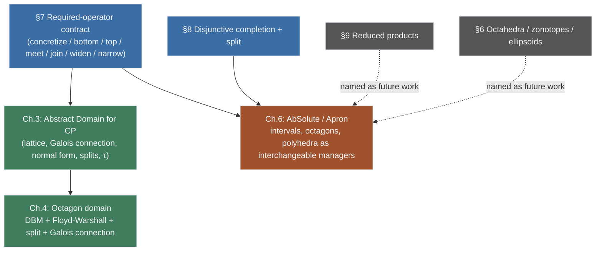

[[book-guidelines|↩ Back to guidelines]]

# Abstract Domains in Abstract Interpretation

## 1. Why you can't just pick "the" abstract domain

Suppose you want to prove, automatically, that a program never divides by zero, never indexes an array out of bounds, and never overflows an integer. The brute-force way is to compute the *concrete semantics*: the actual set of values every variable can take at every program point, for every possible execution. That set is, in general, infinite (loops, unbounded inputs) and computing it exactly is undecidable. Abstract Interpretation's answer is to compute something *smaller and coarser* — an over-approximation — that is still sound: if the over-approximation says "no division by zero is possible," that's a real guarantee, even though the over-approximation may also contain some spurious impossible states.

The question that immediately follows is: coarser *how*? An over-approximation has to be represented by *something* — a data structure, a finite object a computer can store and manipulate — and the shape of that data structure is exactly what determines two things that are in permanent tension:

- **Precision**: how tightly the representation hugs the true (concrete) set of reachable values.
- **Cost**: how expensive it is to store that representation and to compute with it (intersections, unions, and the transfer functions that simulate each program instruction).

There is no single representation that is simultaneously maximally precise and cheap for every program. A representation that can only describe independent per-variable ranges is fast but blind to correlations between variables (e.g., "$y$ is always twice $x$"). A representation that can describe *any* convex region is far more precise but pays for that expressiveness with worse asymptotic complexity, and sometimes with the loss of nice algebraic properties (as you'll see with polyhedra below). This is exactly the tradeoff the book's Figure 2.4 makes vivid: the same set of points, drawn once with intervals, once with octagons, once with polyhedra, gets visibly tighter as the shape gets richer — and correspondingly more expensive to compute.

**What breaks without a taxonomy.** If you design an analyzer (or a CSP kernel doing abstract-interpretation-style invariant generation) around a single hard-coded domain — say, "everything is a box" — you inherit that domain's blind spot permanently. Every invariant your kernel can ever report is a Cartesian product of per-variable ranges, so any bug or verification condition that depends on a *relationship* between variables (`x < y`, `a + b <= capacity`) is either invisible to the analysis or has to be smuggled in through some other mechanism entirely. Because no one domain wins on both axes, Abstract Interpretation doesn't standardize on one; it standardizes on a *taxonomy* of domain families, each occupying a different point on the precision/cost curve, plus a common interface (a fixed contract of operators, §7) that lets an analyzer treat any of them uniformly, and combinators (disjunctive completion, §8; reduced products, §9) that let you get more precision by combining cheap domains rather than reaching immediately for an expensive one. That is the content of this article — the vocabulary of "what an abstract domain is and which species exist" that the rest of the book (and its own contributions, the octagon domain for Constraint Programming and [[The-AbSolute-Solver|the AbSolute solver]]) builds directly on top of.

```mermaid
flowchart LR
    subgraph NR["Non-relational — O(n) cost"]
        I["Intervals / Boxes<br/>per-variable ranges only"]
    end
    subgraph WR["Weakly relational — restricted pairs/subsets"]
        Z["Zone domain<br/>v1 - v2 <= c"]
        O["Octagon domain<br/>±v1 ± v2 <= c"]
        H["Octahedra<br/>Σ ±vi <= c, arbitrary subset"]
    end
    subgraph REL["Relational — full expressiveness, O(n^2)/O(n^3)+ cost"]
        P["Polyhedra<br/>arbitrary linear inequalities"]
        E["Ellipsoids<br/>quadratic forms"]
        ZT["Zonotopes<br/>affine images of a box"]
    end
    I -->|"add pairwise correlation"| Z
    Z -->|"symmetrize signs"| O
    O -->|"generalize pair to subset"| H
    H -->|"drop the shape restriction"| P
    I -.->|"add affine generators"| ZT
    P -->|"specialize to quadratic"| E

    style I fill:#3b6ea5,stroke:#dbe4ee,color:#f5f7fa
    style Z fill:#3f7d5c,stroke:#dbe4ee,color:#f5f7fa
    style O fill:#3f7d5c,stroke:#dbe4ee,color:#f5f7fa
    style H fill:#3f7d5c,stroke:#dbe4ee,color:#f5f7fa
    style P fill:#a0522d,stroke:#dbe4ee,color:#f5f7fa
    style E fill:#a0522d,stroke:#dbe4ee,color:#f5f7fa
    style ZT fill:#a0522d,stroke:#dbe4ee,color:#f5f7fa
```



Read the arrows as "buys more relational expressiveness, at more cost" — not a formal subtyping order (a zonotope isn't literally contained in a polyhedron the way an octagon is, though it happens to be one geometrically too). The three colored clusters are exactly the book's three families.

## 2. The three families: non-relational, relational, weakly relational

The book groups numerical abstract domains into three categories, ordered by *expressiveness* — informally, "how complex a relationship between variables can this domain's elements describe":

> "These various representations are grouped according to their expressiveness. The more expressible properties by an abstract domain are complex, the more it will be accurate... This precision usually comes at a cost in terms of computation time."

**Non-relational domains.** Properties are expressed on a *single variable at a time*. To describe a program state with several variables, you take a Cartesian product of per-variable descriptions — there is structurally no way to represent a relationship *between* two variables. This is the least expressive, cheapest family. The canonical example is the **intervals** abstract domain (§3 below).

**Relational domains.** These can express arbitrary relationships between (potentially many) variables. They are the most expressive and most precise family, and there is a large diversity of them — the **polyhedra** domain (linear relationships) and the **ellipsoids** domain (second-degree polynomial relationships) are the book's two named examples. Precision here is bought at real computational cost, and sometimes at the cost of losing nice properties a non-relational domain has for free (see the polyhedra discussion below).

**Weakly relational domains.** Introduced by Miné in 2004, these sit deliberately between the other two: they can express *some* relationships between variables, but not arbitrary ones — only relationships of a fixed, restricted syntactic shape. This buys back a lot of the computational tractability of non-relational domains while still capturing pairwise correlations that intervals miss entirely. The book's examples are the **zone** domain (constraints of the shape $v_1 - v_2 \le c$) and the **octagon** domain (constraints of the shape $\pm v_1 \pm v_2 \le c$) — the latter is important enough that the book devotes an entire later chapter to adapting it for Constraint Programming.

**What breaks without the middle tier.** If your only choices were "cheap and blind" (intervals) or "expensive and general" (polyhedra), any analysis with a tight time or memory budget — think a search node in a CSP kernel evaluated thousands of times per second — would be forced to either miss relational bugs or pay full relational cost on every node, most of which don't need it. Weakly relational domains exist precisely to serve the overwhelming majority of real invariants, which involve only pairs of variables, at close to non-relational cost.

The book's own Figure 2.4 pins this down with a single running example: the same set of points in the plane, over-approximated first by an interval box, then by an octagon, then by a polyhedron. Each successive shape is a strict refinement of the previous one — the octagon fits inside the interval box, the polyhedron fits inside the octagon — illustrating concretely that "more expressible relations $\Rightarrow$ more accurate." Here is a self-contained reconstruction of that comparison, using an ellipse as the true (unknown) reachable set — the shape none of the three domains can represent exactly:

<svg viewBox="0 0 720 260" xmlns="http://www.w3.org/2000/svg" font-family="sans-serif">
  <rect x="0" y="0" width="720" height="260" fill="#12161c"/>
  <!-- panel 1: interval box -->
  <g transform="translate(20,20)">
    <text x="100" y="14" fill="#dbe4ee" font-size="14" text-anchor="middle">Intervals (box)</text>
    <rect x="10" y="30" width="180" height="180" fill="none" stroke="#3b6ea5" stroke-width="3"/>
    <ellipse cx="100" cy="120" rx="80" ry="45" fill="#e8b04b" fill-opacity="0.55" stroke="#e8b04b" stroke-width="2"/>
  </g>
  <!-- panel 2: octagon -->
  <g transform="translate(270,20)">
    <text x="100" y="14" fill="#dbe4ee" font-size="14" text-anchor="middle">Octagon</text>
    <polygon points="60,30 140,30 190,80 190,170 140,220 60,220 10,170 10,80"
             fill="none" stroke="#3f7d5c" stroke-width="3"/>
    <ellipse cx="100" cy="125" rx="80" ry="45" fill="#e8b04b" fill-opacity="0.55" stroke="#e8b04b" stroke-width="2"/>
  </g>
  <!-- panel 3: polyhedron -->
  <g transform="translate(520,20)">
    <text x="100" y="14" fill="#dbe4ee" font-size="14" text-anchor="middle">Polyhedron (8-gon)</text>
    <polygon points="70,30 130,30 175,60 190,110 175,165 130,200 70,200 25,165 10,110 25,60"
             fill="none" stroke="#a0522d" stroke-width="3"/>
    <ellipse cx="100" cy="115" rx="80" ry="45" fill="#e8b04b" fill-opacity="0.55" stroke="#e8b04b" stroke-width="2"/>
  </g>
  <text x="360" y="248" fill="#9aa7b4" font-size="12" text-anchor="middle">
    Orange = true (unrepresentable) reachable set. Each outline strictly tightens the previous one, at rising cost.
  </text>
</svg>

A quick mental model, in code, of *why* non-relational is cheap and relational is expensive: a non-relational domain's meet/join/transfer functions operate independently, per coordinate, so the cost is linear in the number of variables. A relational domain's operators have to consider (in the worst case) every pair or every linear combination of variables, so the cost grows quadratically, cubically, or worse.

```python
# Non-relational (intervals): each variable is independent -> O(n) work
class IntervalBox:
    def __init__(self, bounds: dict[str, tuple[float, float]]):
        self.bounds = bounds  # var -> (lo, hi), no cross-variable info at all

    def meet(self, other: "IntervalBox") -> "IntervalBox":
        # per-variable, embarrassingly parallel
        return IntervalBox({
            v: (max(self.bounds[v][0], other.bounds[v][0]),
                min(self.bounds[v][1], other.bounds[v][1]))
            for v in self.bounds
        })

# Relational (polyhedron, sketched): every constraint can mix every variable -> far costlier
class Polyhedron:
    def __init__(self, constraints: list[tuple[dict[str, float], float]]):
        # each constraint: (coeffs, bound), meaning sum(coeffs[v]*v) <= bound
        self.constraints = constraints  # arbitrary linear combinations allowed

    def meet(self, other: "Polyhedron") -> "Polyhedron":
        return Polyhedron(self.constraints + other.constraints)  # cheap to state,
        # but keeping this in a *usable normal form* (vertices/rays, minimal
        # constraint set) is where the real cost hides
```

## 3. The intervals abstract domain

Intervals are the oldest and best-known non-relational domain (Cousot & Cousot, 1976). Each variable $v_i$ is represented independently by an interval $[a_i, b_i]$ of possible values, and an $n$-variable state is the Cartesian product $I_1 \times \cdots \times I_n$ — exactly a "box" in $n$-dimensional space. Concretely, this is the same object the book calls $\mathbb{I}_n$ elsewhere in the chapter, and it is shown to form a complete lattice (Example 2.1.4): for two boxes $I = I_1 \times \cdots \times I_n$ and $I' = I_1' \times \cdots \times I_n'$,

$$
I \cap I' = [\max(\underline{I_1},\underline{I_1'}), \min(\overline{I_1},\overline{I_1'})] \times \cdots, \qquad
I \cup I' = [\min(\underline{I_1},\underline{I_1'}), \max(\overline{I_1},\overline{I_1'})] \times \cdots
$$

(taking the greatest-lower-bound — "glb," the tightest common over-approximation — pointwise per coordinate as the intersection, and the least-upper-bound — "lub," the tightest enclosing shape — pointwise as the union). Meet and join are computed independently on each axis — this is precisely the "$O(n)$, no cross-variable term" cost profile from §2. Because the domain is finite for machine-representable bounds, this lattice is a *complete* lattice — every subset, not just every pair, has both a glb and a lub.

Intervals are also where the book gives its cleanest worked example of a Galois connection (Example 2.1.5, itself built on Definition 2.1.3): real-bounded intervals $\mathbb{J}_n$ are not machine-representable, so an analyzer works instead with floating-point-bounded intervals $\mathbb{I}_n$, and the map between the two (round outward to get a sound floating-point box from a real one; the trivial inclusion the other way) is a genuine abstraction/concretization pair $\mathbb{J}_n \substack{\gamma_I \\ \longleftrightarrow \\ \alpha_I} \mathbb{I}_n$. Concretely, a Galois connection between posets $D_1$ and $D_2$ is a pair of monotonic maps $\alpha : D_1 \to D_2$ (abstraction, "coarsen a concrete fact into the abstract domain") and $\gamma : D_2 \to D_1$ (concretization, "read an abstract element back out as the concrete set it stands for") satisfying $\alpha(X_1) \sqsubseteq X_2 \iff X_1 \sqsubseteq \gamma(X_2)$ — informally, $\alpha$ and $\gamma$ are adjoint: rounding up and reading back never lose soundness, and $\alpha$ always picks the *tightest* sound abstraction available.

**What breaks without intervals as the baseline.** Every other domain in this article is judged relative to intervals: their cost, their precision gain, and (as you'll see in §4) whether they even *have* a Galois connection at all, are all stated as "compared to what a box would give you." The unavoidable cost of the family itself: because each variable is tracked in isolation, intervals are structurally blind to correlation. The set $\{(x, y) : y = x\}$ is only representable as a box by the smallest enclosing square — which contains a great many spurious points not on the line. If your invariant-generation kernel only ever emits interval facts, it can never report (or use, for further propagation) a fact as simple as "the loop counter never exceeds the buffer length," if that's phrased as a relation between two variables rather than a bound on one. This is exactly the gap relational and weakly relational domains exist to close.

```rust
// Interval box: one lo/hi pair per variable, no cross terms.
#[derive(Clone)]
struct IntervalBox {
    bounds: std::collections::HashMap<String, (f64, f64)>,
}

impl IntervalBox {
    fn meet(&self, other: &IntervalBox) -> IntervalBox {
        let mut bounds = std::collections::HashMap::new();
        for (v, &(lo, hi)) in &self.bounds {
            let (olo, ohi) = other.bounds[v];
            bounds.insert(v.clone(), (lo.max(olo), hi.min(ohi)));
        }
        IntervalBox { bounds }
    }
}
```

## 4. The polyhedra abstract domain

Polyhedra (Cousot & Cousot, 1978) are the flagship relational domain: an element is the solution set of a *finite conjunction of linear inequalities* over the variables, i.e. a convex polyhedron in $\mathbb{R}^n$. Because arbitrary linear combinations of variables are allowed, polyhedra can capture genuinely relational facts — "$x + y \le 10$", "$2x - 3y \ge z$" — that no non-relational or weakly relational domain can state directly.

This expressiveness comes with a structural surprise the book flags explicitly (Remark 2.1.5): **the polyhedra domain has no abstraction function, and therefore no Galois connection.** The reason is geometric, not an implementation gap. Take a circle: it can be over-approximated by a polyhedron with 4 sides, or 8, or 1000 — the more sides, the tighter the fit, and there is no single *tightest* polyhedral approximation, because for any candidate polyhedron there is always a tangent line you could add to shave a bit more off. The book's Figure 2.2 shows exactly this — a sequence of increasingly-many-sided polyhedra all legitimately approximating the same circle, with no smallest one among them (the middle panel of the SVG above is doing the same job for the octagon-vs-polyhedron comparison, but the *polyhedron itself* is not unique the way the box and octagon of fixed shape are). Without a best abstraction there is no total, well-defined function $\alpha$, hence no Galois connection — one of the required operators (§7) is simply *absent* for this domain, and the book records that polyhedra also lack a narrowing operator.

**What breaks without the double-description trick.** Implementation-wise, the book notes that "modern implementations generally follow the double description" — tracking a polyhedron simultaneously by its constraints (an intersection of half-spaces, the "H-representation") *and* its generators (vertices and rays, the "V-representation"), because some operations are cheap in one and expensive in the other: meet (intersection) is a one-line union of constraint sets in H-representation but requires re-deriving vertices from scratch; join (union) is a convex hull, trivial to *state* in V-representation but expensive to compute from constraints alone. If you commit to only one representation, either your meet or your join becomes asymptotically much worse than it needs to be — the engineering cost of this domain lives almost entirely in keeping both representations in sync.

```python
# Sketch: why the "double description" exists — some ops are natural in
# constraint form, others in vertex/ray (generator) form.
class Polyhedron:
    def __init__(self, constraints, vertices, rays):
        self.constraints = constraints   # H-representation: intersection of half-spaces
        self.vertices, self.rays = vertices, rays  # V-representation: convex hull + cone

    def meet(self, other: "Polyhedron") -> "Polyhedron":
        # trivial in H-representation: just union the constraint sets
        return Polyhedron(self.constraints + other.constraints, vertices=None, rays=None)

    def join(self, other: "Polyhedron") -> "Polyhedron":
        # trivial in V-representation: convex hull of the two generator sets
        # (computing it from constraints alone is far more expensive)
        raise NotImplementedError("convex hull of vertices/rays")
```

## 5. The ellipsoids abstract domain

Ellipsoids (Feret, 2004) push relational expressiveness a level higher: an element captures a **second-degree polynomial** relationship among the variables — the solution set of a quadratic form, geometrically an ellipsoid in $\mathbb{R}^n$. Where polyhedra can only state that a *linear combination* of variables stays bounded, ellipsoids can state that a *quadratic* combination does — useful, for instance, for the kind of state one gets from linear-filter or control-loop computations (sums of squares of oscillating quantities), which a polyhedron can only enclose with a much looser bounding box.

The book positions ellipsoids as the relational-family sibling of polyhedra rather than developing their operator theory in depth — this is genuinely a case where the source is thin, so I'll say so plainly rather than manufacture formalism the book doesn't give: it names ellipsoids, alongside octahedra and zonotopes, as domains outside the scope of the book's own contributions but relevant to its long-term perspectives (§7's closing quote: "linear problems should be solved using polyhedra and second degree polynomials with ellipsoids" — Chapter 7, p. 131). The essential point to carry forward is *shape of invariant, not mechanics*: an ellipsoid buys curvature — a tight fit around genuinely quadratic behavior — at a cost that is, unsurprisingly, higher again than polyhedra's, since checking containment or intersecting two quadratic forms is intrinsically harder than intersecting two sets of linear half-spaces.

**What breaks without a quadratic-shaped domain.** Any invariant of the form "the sum of squared errors stays bounded" (a Lyapunov-style stability property, or a numeric-precision bound) gets over-approximated by a polyhedron as a much looser polygonal region — you keep soundness, but you lose exactly the fact you wanted to prove tight enough to be useful. This is a real, not hypothetical, gap: it's the reason the book flags ellipsoids by name rather than omitting them.

## 6. The octahedra and zonotopes abstract domains

Two further named families round out the taxonomy, both mentioned by the book as domains beyond octagons/polyhedra/ellipsoids that widen the design space without needing full general relationality:

- **Octahedra** (Clarisó, 2004) generalize the octagon idea from *pairs* of variables to arbitrary-size subsets: rather than being restricted to constraints of the shape $\pm v_i \pm v_j \le c$ (two variables at a time), an octahedron allows constraints on sums of signed variables drawn from a larger subset, $\sum_i \pm v_i \le c$. This is strictly more expressive than octagons (it can capture three-or-more-way correlations octagons cannot) at a cost that again grows with how large a subset of variables you allow into a single constraint.

- **Zonotopes** are the image of a box under a linear map: instead of storing $n$ independent per-variable ranges, a zonotope stores a *center* plus a set of *generator vectors*, and its shape is the Minkowski sum of the line segments spanned by those generators. Geometrically this is a (possibly very flat) centrally-symmetric polytope; it is popular for expressing *linear correlations introduced by an affine transformation* (e.g., how floating-point rounding error propagates through a sequence of affine operations) far more cheaply than a general polyhedron would, because zonotope operations reuse simple vector arithmetic on the generators rather than general linear programming.

Again, honestly: the book itself treats these two as names on a map rather than domains it develops — they appear explicitly in its list of "abstract domains capturing other properties" (Chapter 2, p. 37) and again in its own medium-term perspectives ("we should study the many existing abstract domains in Abstract Interpretation, such as the interval polyhedra, polyhedra, zonotopes or ellipsoids, as part of Constraint Programming" — Chapter 7, p. 131). The point to take away for this taxonomy is structural, not a claim the book proves: octahedra and zonotopes are further points on the same precision/cost curve, each choosing a different restricted "shape of invariant" (bounded-size signed sums; linear images of a box) to get more relational power than octagons without paying the full cost of unrestricted polyhedra.

## 7. Required operators: the contract every abstract domain must satisfy

Whatever the family, the book is explicit that an abstract domain is not just "a set of shapes" — it is a computable set $D^\sharp$ equipped with a partial order $\sqsubseteq$ (read: "is at most as precise/large as"), together with a fixed list of operators that must (with a few named, principled exceptions) be implemented for the domain to be usable inside an analyzer:

- A **concretization function** $\gamma : D^\sharp \to D^\flat$ ("read an abstract element back out as a concrete set"), and — if it exists — an **abstraction function** $\alpha : D^\flat \to D^\sharp$ ("coarsen a concrete set into the tightest abstract element that covers it"), together forming a Galois connection $D^\flat \substack{\gamma \\ \longleftrightarrow \\ \alpha} D^\sharp$.
- A **least element** $\bot^\sharp$ (bottom, "no information / unreachable") and a **greatest element** $\top^\sharp$ (top, "no constraint at all"), such that $\gamma(\bot^\sharp) = \emptyset$ and $\gamma(\top^\sharp) = V$ (the whole concrete universe, $D^\flat = \mathcal{P}(V)$).
- Efficient algorithms for the **transfer functions** — the abstract counterpart of each concrete program operation (an abstract "add," an abstract "assign," an abstract "branch test") — this is what lets the analyzer actually simulate a program step without ever touching the concrete semantics.
- Efficient algorithms for **meet** $\sqcap^\sharp$ (abstract intersection — "combine two facts, keeping what both agree on") and **join** $\sqcup^\sharp$ (abstract union — "combine two facts, keeping what either allows").
- An efficient algorithm for a **widening** $\nabla^\sharp$, if $D^\sharp$ has an infinite increasing chain (needed to force termination of fixpoint iteration — without it, iterating a loop's abstract semantics might never stabilize).
- An efficient algorithm for a **narrowing** $\triangle^\sharp$, if it exists and $D^\sharp$ has an infinite decreasing chain (used to refine the over-approximation widening produced, clawing back some of the precision widening sacrificed for termination).

The book is careful to flag that this list is a *default expectation*, not a hard universal law: "there may be no abstraction function and no narrowing operator, and, although relatively rare, there can be no join." Polyhedra is the running counterexample already discussed — no abstraction function (hence no Galois connection, §4) and no narrowing operator — and the book still treats it as a legitimate, first-class abstract domain. The operators are useful when present (abstraction gives you a canonical representative for a concrete set; narrowing lets you claw back precision after widening) but their absence doesn't disqualify a domain, it just removes tools from what an analyzer can do with it.

**What breaks without treating this as a fixed contract.** If every domain implementation exposes a slightly different API — one calls it `intersect`, another `refine`, a third bakes the widening logic directly into its fixpoint loop — then generic analysis code (a fixpoint solver, a CP propagation loop, a reduced-product combinator) has to be rewritten per domain, and swapping domains for a given analysis becomes a rewrite rather than a configuration change. This "fixed interface, pluggable implementation" shape is exactly what a `trait`, an abstract base class, or a `structure` is for in modern languages — each abstract domain is a different implementation of the same contract, and generic analysis code can be written once against the interface.

```rust
// The operator contract as a Rust trait. `Concrete` stands in for D-flat
// (the concrete universe, e.g. sets of program states); each domain
// implementation supplies its own D-sharp.
trait AbstractDomain {
    type Concrete;

    fn concretize(&self) -> Self::Concrete;               // gamma, always required
    fn bottom() -> Self;                                    // gamma(bottom) = empty set
    fn top() -> Self;                                       // gamma(top) = whole universe
    fn meet(&self, other: &Self) -> Self;                   // required
    fn join(&self, other: &Self) -> Self;                   // required (rare exceptions)
    // fn abstract(c: &Self::Concrete) -> Self;             // alpha -- may not exist!
    // fn narrow(&self, other: &Self) -> Self;               // triangle -- may not exist!
}

// Domains that DO have a full Galois connection can say so with a
// separate, stricter trait -- polyhedra would implement AbstractDomain
// but NOT this one.
trait GaloisConnected: AbstractDomain {
    fn abstract_from(c: &Self::Concrete) -> Self;
}

trait Widenable: AbstractDomain {
    fn widen(&self, other: &Self) -> Self;   // needed only for infinite increasing chains
}

trait Narrowable: AbstractDomain {
    fn narrow(&self, other: &Self) -> Self;  // needed only for infinite decreasing chains,
                                              // and only if it exists at all
}
```

```python
from abc import ABC, abstractmethod

class AbstractDomain(ABC):
    """The required-operator contract. Note meet/join/bottom/top/gamma
    are the load-bearing methods; alpha and narrow are deliberately
    NOT declared abstract here, because the book records real domains
    (polyhedra) that lack them."""

    @abstractmethod
    def concretize(self):
        """gamma: D-sharp -> D-flat"""

    @classmethod
    @abstractmethod
    def bottom(cls):
        """gamma(bottom) == empty set"""

    @classmethod
    @abstractmethod
    def top(cls):
        """gamma(top) == whole universe V"""

    @abstractmethod
    def meet(self, other):
        ...

    @abstractmethod
    def join(self, other):
        ...

    # Optional, domain-dependent:
    def abstract_from(self, concrete):
        raise NotImplementedError("no Galois connection for this domain")

    def widen(self, other):
        raise NotImplementedError("only needed on infinite increasing chains")

    def narrow(self, other):
        raise NotImplementedError("narrowing may not exist for this domain")
```

The book's operator list is a set of *methods*, informally stated; it doesn't insist those methods be *lawful* (e.g. that meet actually computes a greatest lower bound of the concretizations, or that $\gamma$ is monotonic). That's precisely the gap a proof assistant closes, and it's why Lean is the more literal translation of this section's intent than Rust is: in Lean, the same idea is naturally a `structure` bundling the operations plus the proof obligations that make them lawful.

```lean
structure AbstractDomain (Concrete : Type) (Order : Concrete → Concrete → Prop) where
  Abs : Type
  le      : Abs → Abs → Prop
  gamma   : Abs → Set Concrete                  -- concretization, always required
  bot     : Abs
  top     : Abs
  bot_correct : gamma bot = ∅
  top_correct : gamma top = Set.univ
  meet    : Abs → Abs → Abs                      -- required
  join    : Abs → Abs → Abs                      -- required (rare exceptions)
  meet_sound : ∀ a b, gamma (meet a b) ⊆ gamma a ∩ gamma b
  join_sound : ∀ a b, gamma a ∪ gamma b ⊆ gamma (join a b)
  -- abstraction and narrowing are intentionally *not* fields here:
  -- a domain like polyhedra instantiates this structure without them.

-- A stricter extension for domains that DO admit a Galois connection:
structure GaloisConnected (Concrete : Type) extends AbstractDomain Concrete (· = ·) where
  alpha : Set Concrete → Abs
  galois_property : ∀ (c : Set Concrete) (a : Abs), alpha c ≤ a ↔ c ⊆ gamma a
```

Writing it this way makes precise, *checkable*, exactly which pieces are mandatory (concretization, bottom, top, meet, join, transfer functions, and — if you add `meet_sound`/`join_sound` as fields the way `GaloisConnected` adds `galois_property` — the laws they must satisfy) versus conditional on the domain's lattice structure (widening only if there's an infinite ascending chain; narrowing only if there's an infinite descending chain and the operator is definable at all). A `structure` with unproven law-fields is exactly a typeclass contract with obligations, the same role `isLawfulX` classes play in Lean's own standard library.

## 8. Disjunctive completion: precision by allowing several elements at once

A single element of a convex domain — one interval box, one octagon, one polyhedron — is, by construction, always convex. But the set you actually want to over-approximate is frequently *not* convex or not a single simple shape: think of the union "$x \le 1$ or $x \ge 5$", which no single interval, octagon, or polyhedron can capture without also including the gap in between. The generic fix, independent of which base domain you're using, is the **disjunctive completion**: instead of representing a set by one abstract element, represent it by a *finite set of pairwise-incomparable* abstract elements, read disjunctively (their union).

Formally (the book's Definition 6.1.4, stated for a general abstract domain $D^\sharp$):

$$
E^\sharp = \mathcal{P}_{\text{finite}}(D^\sharp) = \{X^\sharp \subseteq D^\sharp \mid \forall B^\sharp, C^\sharp \in X^\sharp,\ B^\sharp \not\sqsubseteq C^\sharp\}
$$

i.e., $E^\sharp$'s elements are finite *antichains* in $D^\sharp$ — no element of the collection is redundantly contained in another. A worked example from the book (Example 6.1.7): in the lattice of integer boxes ordered by inclusion, $\{[1,2]\times[1,2],\ [1,2]\times[3,7]\}$ is a valid disjunctive completion, since neither box contains the other.

To compare two such collections, the book equips $E^\sharp$ with the **Smyth order**:

$$
X^\sharp \sqsubseteq_E^\sharp Y^\sharp \iff \forall B^\sharp \in X^\sharp,\ \exists C^\sharp \in Y^\sharp,\ B^\sharp \sqsubseteq C^\sharp
$$

— read: every piece on the left is covered by some piece on the right. This is precisely the order you need to make "refine a coarse covering into a finer one" a monotone operation, which is what lets you build a splitting operator (cut one element into several smaller, still-sound pieces) as a principled map $D^\sharp \to E^\sharp$, and iterate it to reach arbitrary precision.

The book then formalizes exactly that map (Definition 6.1.5, Chapter 6): a **split operator** $\oplus : D^\sharp \to E^\sharp$ must satisfy, for every $e \in D^\sharp$:

1. $|\oplus(e)|$ is finite (only finitely many pieces),
2. $\forall e_i \in \oplus(e),\ e_i \sqsubseteq e$ (every piece is at least as precise as the original — no piece invents new, unsound information), and
3. $\gamma(e) = \bigcup \{\gamma(e_i) \mid e_i \in \oplus(e)\}$ (the pieces' concretizations exactly cover the original's concretization — no solutions are lost by splitting).

Because condition 2 gives $\oplus(e) \sqsubseteq_E^\sharp \{e\}$ and condition 3 shows $\oplus$ is an abstraction of the identity, $\oplus$ can be applied at *any point* during a solving process without ever compromising soundness — which is exactly why it is safe to use as the workhorse of a branch-and-bound search. The book instantiates this single definition across every domain it treats: discrete-variable instantiation on a set domain, discrete-variable instantiation on an integer-box domain, midpoint bisection on a real box, cutting along a binary unit expression on an octagon (rounding the midpoint $h$ in floating point, "in any direction," and still remaining sound), and bisecting between farthest-apart vertices on a polyhedron (computed via the Simplex algorithm). Each is the same abstract shape — finite, contracting, exact — specialized to what "cut in half" means for that domain's representation.

**What breaks without disjunctive completion.** Without it, a solver stuck with one convex piece per state can only ever *narrow* a single shape; it has no way to represent "the answer is over here, or over there, but provably not in between" without either losing that information (falling back to the convex hull, which reintroduces the gap) or switching to an intrinsically richer — and more expensive — convex domain. Disjunctive completion buys that expressiveness back generically, for *any* base domain, by paying for precision with the *number of pieces* in the collection rather than with a costlier per-piece representation. This is also, mechanically, what makes branch-and-bound search over an abstract domain even possible: a "branch" is a split, and the search tree is literally the tree of disjunctive completions produced by repeated splitting.

```python
# A disjunctive completion is a finite antichain of abstract elements,
# read as their union. Refining it (splitting one piece) is how you
# trade "more pieces" for "tighter approximation" without changing
# which base domain you're using.
class DisjunctiveCompletion:
    def __init__(self, pieces: list["IntervalBox"]):
        self.pieces = pieces  # invariant: pairwise incomparable under inclusion

    def refine(self, index: int, split_fn) -> "DisjunctiveCompletion":
        # split_fn: IntervalBox -> list[IntervalBox], e.g. cut in half along
        # the widest dimension. Soundness requires gamma(piece) ==
        # union(gamma(p) for p in split_fn(piece)) -- no solutions lost
        # (this is exactly condition 3 of Definition 6.1.5).
        new_pieces = self.pieces[:index] + split_fn(self.pieces[index]) + self.pieces[index+1:]
        return DisjunctiveCompletion(new_pieces)

    def smyth_leq(self, other: "DisjunctiveCompletion") -> bool:
        # every piece of self must be included in some piece of other
        return all(
            any(is_included(b, c) for c in other.pieces)
            for b in self.pieces
        )
```

A `Split` operator belongs in the Rust trait contract from §7 as a natural extension:

```rust
trait Splittable: AbstractDomain {
    // returns finitely many pieces, each <= self, whose union covers self exactly
    fn split(&self) -> Vec<Self> where Self: Sized;
}
```

## 9. Reduced products and domain combination

The other generic combinator the book names is the **reduced product**: rather than choosing a single domain and living with its blind spots, run two (or more) abstract domains *side by side* on the same analysis, and let each one communicate what it has learned back to the others, so that information one domain can express but another can't still gets used to sharpen every domain in the combination. The book states this at the level of intent rather than developing the formal machinery of the reduced product itself, but the intent is precise and reappears twice: once as a design principle among the "generic operators [that] can be used to build new domains from existing abstract domains such as disjunctive completion, reduced products and partitioning" (Chapter 2, p. 37), and again as a concrete forward-looking recommendation in Chapter 7's perspectives:

> "The reduced product is used to communicate to abstract domains the information gathered during the analysis from other abstract domains... each problem should be automatically solved in the abstract domains which best fit it... linear problems should be solved using polyhedra and second degree polynomials with ellipsoids."

The intuition: intervals are cheap but relation-blind; polyhedra are relational but expensive and lack a Galois connection; ellipsoids capture quadratic facts neither of the others can state. Running them together and "reducing" (propagating deductions from one representation into the others whenever a fact expressible in domain A would also sharpen domain B) lets an analysis get relational precision only where it's actually needed, rather than paying the relational domain's cost everywhere uniformly. This is the same "combine cheap pieces instead of reaching for one expensive universal domain" idea as disjunctive completion, but combining *different domains in parallel* (reduced product) rather than *many elements of the same domain in sequence* (disjunctive completion).

**What breaks without reduced products.** A static analyzer (or CSP kernel) that must commit to a single domain for the whole analysis is stuck choosing between "cheap everywhere, blind to some invariants" and "expensive everywhere, most of it wasted." The book explicitly names this as an open perspective for its own solver, AbSolute — "For mixed domains, the current method can be improved by defining and implementing reduced products between reals and integer domains" (Chapter 7, p. 132) — precisely because AbSolute, at the time of writing, ran one domain at a time rather than combining them.

```python
# Sketch of the reduced-product idea, not a full implementation:
# each component domain narrows the others using facts it alone can see.
class ReducedProduct:
    def __init__(self, interval_box, polyhedron):
        self.interval_box = interval_box
        self.polyhedron = polyhedron

    def reduce(self) -> "ReducedProduct":
        # e.g. polyhedron knows x + y <= 10 and x in [8, 20];
        # that lets us tighten y's interval to [-10, 2] --
        # information intervals alone could never derive.
        tightened_intervals = self.polyhedron.project_bounds(self.interval_box)
        # and conversely, tight intervals can prune polyhedron facets
        tightened_poly = self.interval_box.constrain(self.polyhedron)
        return ReducedProduct(tightened_intervals, tightened_poly)
```

## 10. Synthesis: this is the vocabulary the rest of the book assumes

Every later part of the book is a direct instantiation of the taxonomy and contract developed here:

- **Chapter 3** formalizes "abstract domain *for Constraint Programming*" as a 5-tuple (complete lattice, Galois connection, computer-representable normal form, splitting operators, monotonic size function $\tau$) — a CP-specific specialization of exactly the "concretization/abstraction + order + operators" contract from §7, with the splitting operator playing the role disjunctive completion's antichain-refinement plays here in §8.
- **Chapter 4** introduces the **octagon** domain concretely for CP — a specific weakly relational family member from §2, worked out in full: a difference-bound-matrix representation, a Floyd–Warshall-based closure, a splitting operator, and a genuine Galois connection to boxes, i.e., every operator in the §7 contract instantiated for one real domain.
- **Chapter 6**'s **AbSolute** solver is literally built on Apron, an abstract-domain support library implementing exactly this family structure (intervals, octagons, polyhedra as interchangeable "managers" behind a uniform API), and its own disjunctive-completion-and-split machinery (Definitions 6.1.4–6.1.7, quoted in §8 above) is the formal generalization of what this article introduced informally.
- The book's **medium- and long-term perspectives** (Chapter 7) are explicitly a wish list of *further* domain-family members from this same taxonomy — interval polyhedra, zonotopes, ellipsoids — waiting to be given CP-specific consistencies and splitting operators, plus reduced products between AbSolute's integer and real domains.



In short: non-relational / relational / weakly-relational, the required-operator contract, disjunctive completion, and reduced products are not background trivia — they are the exact conceptual toolkit that the rest of the book spends its remaining chapters applying, specializing, and extending into Constraint Programming.

## Where this leads

This article is the trait contract your CSP kernel's domain implementations will actually need to satisfy, not an abstract analogy for it. Concretely:

- **The required-operators list (§7) is your `AbstractDomain` trait, literally.** Every domain your invariant-generation kernel supports — plain integer/real ranges, octagon-style pairwise constraints, and eventually the "complex domains represented like automata grammars (DFA)" your learning goals call out — needs to answer to the same `concretize`/`bottom`/`top`/`meet`/`join` core, with `widen`/`narrow` and an `abstract_from` marker trait applied only where the domain's lattice structure actually supports them (a DFA-shaped domain over strings, for instance, is exactly the kind of domain where you should expect to ask honestly, the way the book does for polyhedra, whether a canonical abstraction and a narrowing operator even exist).
- **The domain-family taxonomy (§2) is a selection heuristic, not trivia.** When your CSP kernel needs to decide which domain to attach to which class of invariant, this is the precision/cost menu it's choosing from: non-relational for per-variable bounds checks (cheap, run everywhere), weakly relational (octagon/octahedra-style) for the common case of pairwise or small-group linear correlations relevant to array-bound and overflow proofs, and full relational (polyhedra) reserved for genuinely multi-variable linear invariants where the cost is justified — exactly the kind of domain-selection-per-problem the book itself recommends in the reduced-product quote in §9.
- **Disjunctive completion (§8) is the formal backbone of domain propagation and branch-and-bound in your CSP kernel.** Its three-condition split operator (finite, contracting, exact) is precisely the soundness contract a domain-propagation method needs to satisfy whenever it splits a domain to refine a search node — this is the mechanism, not a metaphor, behind "domain propagation methods" and "abstract lattices" named directly in your learning goals.
- **Reduced products (§9) are how you combine multiple abstract domains within one analysis**, which is exactly the standing thread in your learning goals about combining domain propagation across integer, non-linear, and structured (automata-shaped) domains simultaneously rather than committing to one domain per analysis.
- Downstream in the book, this vocabulary is what makes the **octagon domain** (Chapter 4) and **AbSolute/Apron** (Chapter 6) legible as worked instances rather than one-off tricks — read those next as concrete implementations of the §7 contract, and the **Galois connection / lattice foundations** (§2.1.1–2.1.2, covered more fully in a companion article on [[Abstract-Interpretation-Foundations|Abstract Interpretation Foundations]]) as the algebraic bedrock this taxonomy sits on.

---

[[book-guidelines|↩ Back to guidelines]]
