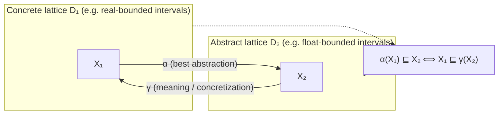
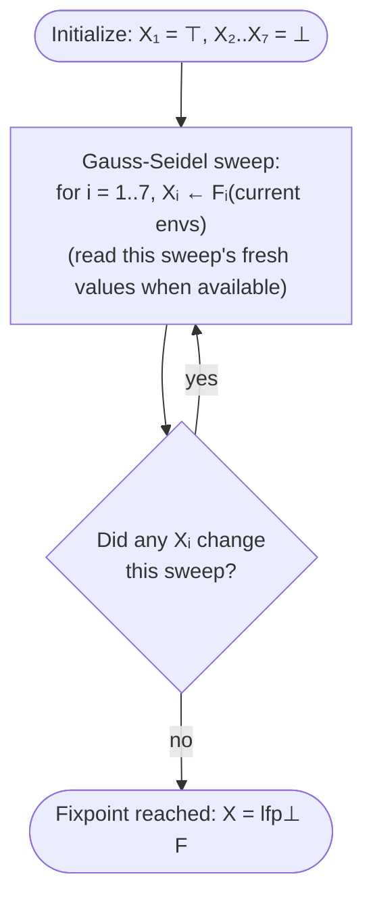
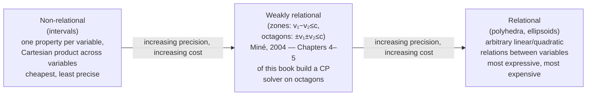

# Abstract Interpretation Foundations

[[book-guidelines|↩ Back to guidelines]]

## Why any of this machinery is needed at all

The book opens (Example 2.1.1) with a five-line program:

```text
1: real x, y
2: x ← 2
3: y ← 5
4: y ← y * (x - 2)
5: y ← x / y
```

Trace it by hand — a *backtrace*, one row per line, columns for each variable's value — and line 5 divides by zero (`y` is `0` after line 4). On a five-line program you just *run it* and watch. But real software runs to hundreds of thousands of lines, executes on inputs you cannot enumerate, and has failed catastrophically from exactly this class of error slipping through: the 1996 loss of Ariane 5 to an integer overflow, the 1991 Patriot missile rounding-error failure that cost 28 lives. You cannot "run every execution" of such a program to check it's safe — the number of paths is generally infinite — and by **Rice's theorem**, any non-trivial semantic property of a program stated purely on its inputs/outputs (does it ever divide by zero? overflow?) is undecidable in general. No algorithm decides it exactly, for every program, in finite time.

So **Abstract Interpretation** (Cousot & Cousot, 1976) makes a deliberate trade. Call the *true* set of values a program's variables can take at each program point its **concrete semantics** (computing it exactly is undecidable in general, per Rice). Abstract Interpretation instead computes a **sound over-approximation**: a superset, guaranteed to contain every value that can really occur, produced by a terminating algorithm. If that superset already satisfies your safety specification ("the divisor is never 0"), you have *proven* the real program safe — a subset of a set satisfying a property also satisfies it. If the over-approximation *fails* the specification, you've learned nothing for certain (it may be a false alarm from lost precision), but you have a sound place to start refining.

**What breaks without this trade.** Without deliberately over-approximating, a static analyzer has exactly two options, both bad: either it tries to compute the exact concrete semantics and hits undecidability (it may simply never terminate on some programs), or it under-approximates (checks only some reachable states, e.g. by testing/fuzzing) and can then miss real bugs — which is unacceptable when the target is "prove the absence of a division by zero on an Airbus fly-by-wire computer," not "probably fine." Over-approximation is the only option that keeps both properties analyzers need simultaneously: termination and soundness.

This one design decision is why the whole apparatus below exists:

- A mathematical language for "sets of possible values ordered by precision" and "the best approximation of X" — **posets and lattices**.
- A principled way to move between the exact world and the approximate one — a **Galois connection** ($\alpha$/$\gamma$).
- A notion of what each line of code *does* to a set of states — a **transfer function** $\{|C|\}$.
- Since loops execute an unbounded number of times, "the possible values at this program point" is the solution of a recursive equation — a **fixpoint**, computed by an **iteration strategy** (Jacobi/Gauss-Seidel).
- Because that iteration might not terminate in finite time on an infinite lattice, a **widening** operator $\triangledown^\sharp$ that forces termination by extrapolating.
- Because widening is deliberately imprecise, a **narrowing** operator $\triangle^\sharp$ afterward to claw back precision.
- And because composing several approximate operators is itself lossy, sometimes **local iteration** with a **lower closure operator** to squeeze out extra precision cheaply.

Everything below is the book's own formalization of these ingredients (Chapter 2, §2.1, pp. 21–39), each grounded with Lean as the primary formal echo (this material *is* order theory and fixpoint theory — Lean's `Mathlib.Order` hierarchy states it almost verbatim), Rust as the primary implementation target, and Python for quick sketches.

---

## 1. Posets and lattices: the shape of "more/less precise"

**Definition 2.1.1 (Poset).** A relation $\sqsubseteq$ ("is at least as precise as," or, concretely, "is a subset of") on a non-empty set $D$ is a *partial order* if it is reflexive ($X \sqsubseteq X$), antisymmetric ($X \sqsubseteq Y \wedge Y \sqsubseteq X \Rightarrow X = Y$), and transitive ($X \sqsubseteq Y \wedge Y \sqsubseteq Z \Rightarrow X \sqsubseteq Z$). $(D, \sqsubseteq)$ is a *partially ordered set* (poset). If they exist, $\bot$ ("bottom") denotes the least element, $\top$ ("top") the greatest.

**Definition 2.1.2 (Lattice).** $(D, \sqsubseteq, \sqcup, \sqcap)$ is a *lattice* if every pair $\{a,b\}$ has a least upper bound $a \sqcup b$ (the *join*, read "a or b, most precisely") and a greatest lower bound $a \sqcap b$ (the *meet*, read "a and b, most precisely"). It is *complete* if this holds for **every** subset, not just pairs (a complete lattice always has both $\bot$ and $\top$). Every finite lattice is automatically complete (Remark 2.1.2) — with finitely many elements, iterating meet/join over any subset always bottoms out.

The book's own worked examples (Figure 2.1, reproduced below as a Hasse diagram — a drawing where an edge going up means "is above, in the order"): the powerset $(\mathcal{P}(\{1,2,3\}), \subseteq, \cup, \cap)$ is a complete lattice with $\bot=\emptyset$, $\top=\{1,2,3\}$, and e.g. $\{1,2\} \sqcap \{1,3\} = \{1\}$, $\{1,2\}\sqcup\{1,3\}=\{1,2,3\}$; the divisors of 60 under divisibility form a complete lattice where meet/join are gcd/lcm (e.g. $3 \sqcap 4 = 1$, $3\sqcup4=12$). Removing the bottom element $\{\emptyset\}$ from the powerset diagram destroys the lattice property (the pair $\{\{1,2\},\{1,3\}\}$ now has no least upper bound) — but removing any element that is neither $\bot$ nor $\top$ leaves a lattice, since the missing element was never load-bearing as a bound for anything else (Example 2.1.3, panels (c)/(d)).

Crucially, $(\mathbb{I}^n, \subseteq, \cup, \cap)$ — Cartesian products of $n$ interval domain elements (each a real interval delimited by two floating-point numbers), ordered by inclusion — is also a complete lattice (Example 2.1.4), with meet/join computed componentwise as intersection/hull of each coordinate's interval. *This* is the lattice every numerical abstract domain in the rest of the book is built to generalize.

<svg viewBox="0 0 620 260" xmlns="http://www.w3.org/2000/svg" font-family="ui-monospace, monospace" font-size="14">
  <style>
    .node { fill: #f4f4f4; stroke: #6b6b6b; stroke-width: 1.5; }
    .edge { stroke: #8a8a8a; stroke-width: 1.5; }
    .lbl { fill: #222222; }
  </style>
  <!-- edges -->
  <line class="edge" x1="310" y1="40"  x2="120" y2="110"/>
  <line class="edge" x1="310" y1="40"  x2="310" y2="110"/>
  <line class="edge" x1="310" y1="40"  x2="500" y2="110"/>
  <line class="edge" x1="120" y1="110" x2="180" y2="190"/>
  <line class="edge" x1="120" y1="110" x2="310" y2="190"/>
  <line class="edge" x1="310" y1="110" x2="180" y2="190"/>
  <line class="edge" x1="310" y1="110" x2="440" y2="190"/>
  <line class="edge" x1="500" y1="110" x2="310" y2="190"/>
  <line class="edge" x1="500" y1="110" x2="440" y2="190"/>
  <!-- nodes -->
  <circle class="node" cx="310" cy="40"  r="8"/>
  <circle class="node" cx="120" cy="110" r="8"/>
  <circle class="node" cx="310" cy="110" r="8"/>
  <circle class="node" cx="500" cy="110" r="8"/>
  <circle class="node" cx="180" cy="190" r="8"/>
  <circle class="node" cx="310" cy="190" r="8"/>
  <circle class="node" cx="440" cy="190" r="8"/>
  <!-- labels -->
  <text class="lbl" x="330" y="35">⊤ = {1,2,3}</text>
  <text class="lbl" x="30"  y="105">{1,2}</text>
  <text class="lbl" x="320" y="95">{1,3}</text>
  <text class="lbl" x="510" y="105">{2,3}</text>
  <text class="lbl" x="70"  y="215">{1}</text>
  <text class="lbl" x="320" y="230">{2}</text>
  <text class="lbl" x="450" y="215">{3}</text>
  <text class="lbl" x="255" y="255">⊥ = ∅</text>
  <line class="edge" x1="180" y1="190" x2="310" y2="240"/>
  <line class="edge" x1="310" y1="190" x2="310" y2="240"/>
  <line class="edge" x1="440" y1="190" x2="310" y2="240"/>
  <circle class="node" cx="310" cy="240" r="8"/>
</svg>

*Hasse diagram of $(\mathcal{P}(\{1,2,3\}), \subseteq)$: going up an edge means "is a superset of." $\{1,2\}\sqcap\{1,3\}$ is their lowest common ancestor going down, $\{1\}$; $\{1,2\}\sqcup\{1,3\}$ is their lowest common ancestor going up, $\top$.*

**What breaks without a complete lattice, specifically.** Fixpoint computation (§5 below) needs the Knaster–Tarski guarantee that a least fixpoint *exists* for any monotone function — that guarantee is a theorem *about* complete lattices, not posets in general. If your abstract domain isn't even a lattice (meets/joins don't always exist), "the best over-approximation of these two sets" can be ill-defined, and an analyzer has no principled way to merge information at a control-flow join point (e.g. after an `if`/`else`).

**Grounding.**

*Lean* — mathlib already axiomatizes exactly this hierarchy (`Preorder` → `PartialOrder` → `Lattice` → `CompleteLattice`), so Definitions 2.1.1–2.1.2 are literally mathlib's `Lattice` and `CompleteLattice` classes. Stating the interval-hull lattice directly:

```lean
structure Interval where
  lo : ℝ
  hi : ℝ

def Interval.le (a b : Interval) : Prop := b.lo ≤ a.lo ∧ a.hi ≤ b.hi  -- ⊆ as ⊑

instance : Lattice Interval where
  le := Interval.le
  sup a b := ⟨min a.lo b.lo, max a.hi b.hi⟩   -- ⊔, the convex hull
  inf a b := ⟨max a.lo b.lo, min a.hi b.hi⟩   -- ⊓, the intersection
  -- proof obligations: le_sup_left, sup_le, inf_le_left, le_inf, …
```

*Rust* — a lattice as a trait, with the interval domain as the simplest instance:

```rust
trait Lattice: PartialOrd + Sized {
    fn join(&self, other: &Self) -> Self; // ⊔ : least upper bound
    fn meet(&self, other: &Self) -> Self; // ⊓ : greatest lower bound
}

#[derive(Clone, Copy, Debug, PartialEq)]
enum Interval { Bottom, Range(f64, f64) } // ⊥ is the empty interval

impl Lattice for Interval {
    fn join(&self, other: &Self) -> Self { // union-hull, the lub in ⊆
        match (self, other) {
            (Interval::Bottom, x) | (x, Interval::Bottom) => *x,
            (Interval::Range(a, b), Interval::Range(c, d)) =>
                Interval::Range(a.min(*c), b.max(*d)),
        }
    }
    fn meet(&self, other: &Self) -> Self { // intersection, the glb
        match (self, other) {
            (Interval::Range(a, b), Interval::Range(c, d))
                if a.max(*c) <= b.min(*d) =>
                Interval::Range(a.max(*c), b.min(*d)),
            _ => Interval::Bottom,
        }
    }
}
```

*Python* — same lattice as a dataclass, for quick prototyping:

```python
from dataclasses import dataclass
from math import inf

@dataclass(frozen=True)
class Interval:
    lo: float = inf   # Interval() == ⊥, the empty interval
    hi: float = -inf

    def join(self, other):   # ⊔ : convex hull
        if self.lo > self.hi: return other
        if other.lo > other.hi: return self
        return Interval(min(self.lo, other.lo), max(self.hi, other.hi))

    def meet(self, other):   # ⊓ : intersection
        lo, hi = max(self.lo, other.lo), min(self.hi, other.hi)
        return Interval(lo, hi) if lo <= hi else Interval()
```

---

## 2. Galois connections: the bridge between exact and approximate

Once you have two lattices — the concrete world $D_1$ and an abstract representation $D_2$ — you need a *principled, precision-preserving-as-much-as-possible* way to move between them.

**Definition 2.1.3 (Galois Connection).** Given posets $D_1, D_2$, a Galois connection is a pair of monotone maps, abstraction $\alpha : D_1 \to D_2$ and concretization $\gamma : D_2 \to D_1$, such that

$$\forall X_1 \in D_1,\, X_2 \in D_2,\quad \alpha(X_1) \sqsubseteq X_2 \iff X_1 \sqsubseteq \gamma(X_2)$$

written $D_1 \xrightleftharpoons[\alpha]{\gamma} D_2$: "$X_1$'s best abstraction is already at least as precise as $X_2$" exactly when "$X_1$ is already contained in what $X_2$ concretely denotes." Two consequences fall out immediately (Remarks 2.1.3–2.1.4): $\alpha$ and $\gamma$ are both monotone, and $(\alpha \circ \gamma)(X_2) \sqsubseteq X_2$ while $X_1 \sqsubseteq (\gamma \circ \alpha)(X_1)$ — abstracting-then-concretizing never claims more than $X_2$ already covers, and concretizing-then-abstracting never under-covers $X_1$. $X_2$ is then called a *correct approximation* of $X_1$.

**Worked example (2.1.5).** Real-bounded intervals $\mathbb{J}$ versus floating-point-bounded intervals $\mathbb{I}$: $\alpha_{\mathbb{I}}$ rounds each real bound outward to the nearest representable float, $\gamma_{\mathbb{I}}$ is the trivial inclusion (a float is also a real). This is the Galois connection silently used every time a numeric solver represents real intervals with machine floats.

**Not every abstract domain has one** (Remark 2.1.5). The polyhedra domain has *no* abstraction function: infinitely many polyhedra can tangent-approximate a circle from outside with no single *best* one (Figure 2.2 shows three distinct polyhedral approximations of the same circle) — so $\alpha$ is not well-defined, hence no Galois connection, even though $\gamma$ (a polyhedron denotes a concrete point set) still exists.



**What breaks without a Galois connection.** Without one, "translate a concrete property into the abstract domain" has no canonical, provably-best answer — you can hand-pick *some* abstraction, but you lose the adjunction law that lets you prove soundness compositionally (§3 below leans on it directly: soundness of every abstract transfer function is *derived* from the Galois connection, not proved from scratch each time). This is exactly the situation the polyhedra domain is in: it still works as an abstract domain, but every soundness argument about it has to be made by hand, per-operator, because there's no $\alpha$ to hang a general argument on.

**Grounding.**

*Lean* — mathlib's `Order.GaloisConnection` is defined with *exactly* the book's biconditional, so Definition 2.1.3 is literally:

```lean
import Mathlib.Order.GaloisConnection

def gc (α : D₁ → D₂) (γ : D₂ → D₁) : Prop :=
  GaloisConnection α γ
-- unfolds to: ∀ x y, α x ≤ y ↔ x ≤ γ y
```

This is worth dwelling on if you're building a bidirectional elaborator: a Galois connection *is* an adjunction between posets-as-categories, the same shape as the adjunction between a left and right adjoint functor. Bidirectional typing's inference/checking split (§ synthesis below) is not identical to this, but the "move information across a boundary while preserving a provable correctness property in both directions" pattern is the same load-bearing idea.

*Rust* — trait pair capturing $\alpha$/$\gamma$ for the real-interval-to-float-interval example:

```rust
trait GaloisConnection<Concrete, Abstract> {
    fn alpha(c: &Concrete) -> Abstract;  // best abstraction
    fn gamma(a: &Abstract) -> Concrete;  // meaning of the abstraction
}

struct RealToFloatIntervals;
impl GaloisConnection<(f64, f64), Interval> for RealToFloatIntervals {
    fn alpha((lo, hi): &(f64, f64)) -> Interval {
        // round outward: floor lo, ceil hi, so gamma(alpha(c)) ⊇ c
        Interval::Range(lo.floor(), hi.ceil())
    }
    fn gamma(a: &Interval) -> (f64, f64) {
        match a { Interval::Range(a, b) => (*a, *b), Interval::Bottom => (f64::NAN, f64::NAN) }
    }
}
```

*Python* — the soundness check $\alpha(X_1) \sqsubseteq X_2 \iff X_1 \sqsubseteq \gamma(X_2)$ made executable, a good property-based test for any $\alpha$/$\gamma$ pair:

```python
def is_galois_connection(alpha, gamma, xs1, xs2, leq1, leq2):
    return all(
        leq2(alpha(x1), x2) == leq1(x1, gamma(x2))
        for x1 in xs1 for x2 in xs2
    )
```

---

## 3. Concrete versus abstract semantics: $D^\flat$ and $D^\sharp$

The book fixes notation used for the rest of the text: $D^\flat$ for the **concrete domain** — the values variables can actually take, $D^\flat = \mathcal{P}(V)$ for a value set $V$ — and $D^\sharp$ for the **abstract domain**, related by $D^\flat \xrightleftharpoons[\alpha]{\gamma} D^\sharp$ when the connection exists.

Given a concrete function $f^\flat$ on $D^\flat$ (e.g., "the states reachable after this instruction"), its abstract counterpart $f^\sharp$ on $D^\sharp$ must be **sound**:

$$\forall X^\sharp \in D^\sharp,\quad (\alpha \circ f^\flat \circ \gamma)(X^\sharp) \sqsubseteq f^\sharp(X^\sharp)$$

a direct consequence of Remark 2.1.4's Galois-connection facts. $f^\sharp$ is **optimal** exactly when equality holds: $\alpha \circ f^\flat \circ \gamma = f^\sharp$. Optimal means the abstract computation loses no more precision than the abstraction itself already imposes; sound-but-not-optimal is common and unavoidable when computing $f^\sharp$ efficiently.

**What breaks without the soundness inequality.** Drop it, and "abstract interpretation" degenerates into an unverified heuristic — an $f^\sharp$ that merely *looks* like a reasonable stand-in for $f^\flat$, with no guarantee the states it reports actually cover every real behavior. The entire "prove absence of runtime errors" claim rests on this one inequality holding for every transfer function in the analyzer; get it wrong for even one instruction (a classic bug: an off-by-one in interval rounding) and every downstream proof is silently unsound, which is the worst possible failure mode for a tool whose entire purpose is to be trusted more than testing.

**Grounding.**

*Lean* — soundness stated as a real theorem obligation attached to a transfer function definition — this is precisely the shape of the per-instruction soundness lemma you'd discharge for a CSP kernel's abstract domain propagators:

```lean
theorem f_abstract_sound (f_concrete : Set V → Set V) (f_abstract : D♯ → D♯)
    (α : Set V → D♯) (γ : D♯ → Set V) (h : GaloisConnection α γ) (x : D♯) :
    α (f_concrete (γ x)) ≤ f_abstract x := by
  sorry -- proof obligation discharged per-domain, per-instruction
```

*Rust* — the contract every abstract-interpretation library actually enforces (Rust's type system can't check the mathematical inequality itself, so it lives as an obligation plus a property test):

```rust
trait AbstractFn<Concrete, Abstract> {
    /// Must satisfy: alpha(f_concrete(gamma(x))) ⊑ f_abstract(x)  (soundness)
    fn f_abstract(x: &Abstract) -> Abstract;
}
```

*Python* — a soundness fuzz-test harness, the practical way most analyzer test suites actually validate $f^\sharp$:

```python
def check_soundness(f_concrete, f_abstract, gamma, alpha, leq, abstract_samples):
    for xa in abstract_samples:
        lhs = alpha(f_concrete(gamma(xa)))
        assert leq(lhs, f_abstract(xa)), "f_abstract is unsound!"
```

---

## 4. Transfer functions: giving each instruction a meaning on sets of states

**Definition 2.1.4 (Transfer Function).** For a line of code $C$, the transfer function $F : \mathcal{P}(D) \to \mathcal{P}(D)$, written $\{|C|\}$, maps a set of environments to the set of environments reachable after executing $C$. Assignments $\{|x \leftarrow \mathit{expr}|\}$ (Example 2.1.6) update only $x$'s possible values; boolean tests $\{|x \le 0|\}$ (Example 2.1.7) *filter* the environment set to those satisfying the test. All transfer functions are assumed monotone (Remark 2.1.6) — a larger input state set never produces a smaller output state set.

**What breaks without monotonicity.** Every later piece of machinery quietly assumes it. Knaster–Tarski's fixpoint guarantee (§5) requires a monotone function on a complete lattice; Jacobi/Gauss-Seidel iteration is only guaranteed to converge *upward* toward the least fixpoint if each step can't un-cover ground already covered; and widening's correctness argument (§6) assumes the sequence of approximations is only ever growing in the relevant sense. A non-monotone transfer function can make the whole iteration oscillate or converge to something that isn't actually a fixpoint above $\bot$.

**Grounding.** This is precisely what an abstract interpreter's "instruction visitor" does — the compiler-pass shape this section is building toward.

*Rust*:

```rust
#[derive(Clone)]
struct Env { x: Interval, y: Interval }

fn transfer_assign_x(env: &Env, rhs: Interval) -> Env {
    Env { x: rhs, y: env.y } // {|x ← expr|}
}
fn transfer_test_le(env: &Env, bound: f64) -> Env {
    // {|x ≤ bound|}: filter x's interval, y untouched
    let filtered = env.x.meet(&Interval::Range(f64::NEG_INFINITY, bound));
    Env { x: filtered, y: env.y }
}
```

*Lean* — a transfer function is just a monotone endofunction on the abstract domain, which mathlib expresses with `Monotone`:

```lean
def transferAssign (rhs : D♯) : Env♯ → Env♯ := fun e => { e with x := rhs }

theorem transferAssign_monotone (rhs : D♯) : Monotone (transferAssign rhs) := by
  intro e₁ e₂ h; simp [transferAssign]; exact ⟨h.2, le_refl rhs⟩
```

*Python*:

```python
def transfer_assign(env, var, value: Interval):
    return {**env, var: value}            # {|x ← expr|}

def transfer_test_leq(env, var, bound):
    return {**env, var: env[var].meet(Interval(-inf, bound))}  # {|x ≤ bound|}
```

---

## 5. Fixpoints and iterative computation: giving loops a meaning

**Definition 2.1.5 (Fixpoint).** $X$ is a fixpoint of $F$ if $F(X)=X$; $\mathrm{lfp}_X F$ / $\mathrm{gfp}_X F$ denote the least/greatest fixpoint of $F$ above/below $X$ respectively, unique when $F$ is monotone (Remark 2.1.7 — this is the Knaster–Tarski theorem's uniqueness clause, though the book doesn't name it explicitly).

A program is a *composition* of its instructions' transfer functions, and analyzing it — proving it correct — reduces to computing $\mathrm{lfp}_\bot F$ for $F$ the composed transfer function on the complete lattice $D$. Loops make this recursive: the environment set at the loop head depends on itself through the loop body, so it must be computed by **iteration**, starting from $\bot$ and repeatedly applying $F$ until nothing changes — a value that stops changing, and whose dependencies have also stopped changing, has reached its fixpoint and its transfer function stops being reapplied.

**Jacobi vs. Gauss-Seidel (§2.1.2.4).** With environment sets $X_1,\dots,X_n$ (one per program point) and per-point transfer functions $F_i$, at iteration $j$:

$$\textbf{Jacobi: } X_i^j = F_i(X_1^{j-1},\dots,X_n^{j-1}) \qquad \textbf{Gauss-Seidel: } X_i^j = F_i(X_1^j,\dots,X_{i-1}^j, X_i^{j-1}, X_{i+1}^{j-1},\dots,X_n^{j-1})$$

Jacobi uses only *last iteration's* values everywhere; Gauss-Seidel reuses values already recomputed *this* iteration as soon as they're available — the way you'd naturally implement a worklist that processes program points in a fixed order and always reads the freshest value in hand — and typically converges in fewer sweeps for the same reason Gauss-Seidel outperforms Jacobi in numerical linear algebra: information propagates within a single pass instead of waiting a full round-trip. The book uses Gauss-Seidel throughout.

**Worked example (2.1.8).** The loop `x←0; y←x; while x<10 { y←2x; x←x+1 }` sets up seven named environment-set variables $X_1,\ldots,X_7$ (one per program point, plus $X_4'$ for "loop condition true"), each initialized to $\bot=\emptyset$ except $X_1=\top$. Applying all transfer functions repeatedly with Gauss-Seidel, it takes **twelve** sweeps to reach the fixpoint

$$X_7 = \{x=10,\ y\in[0,18]\}$$

— correctly proving $y \le 18$ always, even though at loop exit $y$ is in fact always exactly $18$ (an inherent, sound loss of precision from the interval abstraction: intervals can't express "$y = 2(x-1)$," only a bounding box).



**What breaks without an iteration strategy.** A loop's semantics is defined *implicitly*, as the solution to a self-referential equation ($X_4$ depends on $X_6$, which depends on $X_5$, which depends on $X_4'$, which depends on $X_4$). Without a concrete iteration procedure, "the states reachable inside this loop" is not something you can *compute* — it's a specification, not an algorithm. Fixpoint iteration is what turns the specification into something a compiler pass can actually execute and terminate on (modulo §6's caveat about infinite lattices).

**Grounding.**

*Lean* — the Knaster–Tarski theorem, the mathematical bedrock making $\mathrm{lfp}_\bot F$ well-defined for monotone $F$ on a complete lattice, is already in mathlib as `OrderHom.lfp`. This is worth internalizing precisely: it is the *same* theorem that justifies "the smallest set of derivable judgments closed under a set of typing/inference rules" — i.e., inductively-defined typing judgments and CSP invariant generation are both instances of computing $\mathrm{lfp}_\bot F$ for a monotone $F$ on a complete lattice, just with $F$ built from typing rules in one case and from transfer functions in the other:

```lean
import Mathlib.Order.FixedPoints

-- Given a monotone F on a complete lattice, its least fixpoint above ⊥:
example (F : D →o D) : D := OrderHom.lfp F
-- `OrderHom.lfp_le_fixed`, `OrderHom.le_lfp` give exactly Def. 2.1.5's characterization.
```

*Rust* — a Gauss-Seidel worklist fixpoint solver skeleton:

```rust
fn solve_gauss_seidel(mut envs: Vec<Interval>, transfer: impl Fn(usize, &[Interval]) -> Interval) {
    loop {
        let mut changed = false;
        for i in 0..envs.len() {
            let new_val = transfer(i, &envs); // reads already-updated envs[0..i]
            if new_val != envs[i] { envs[i] = new_val; changed = true; }
        }
        if !changed { break; } // fixpoint reached
    }
}
```

*Python* — same idea, plus the Jacobi variant for contrast:

```python
def gauss_seidel(envs, transfer, n_points):
    while True:
        changed = False
        for i in range(n_points):
            new_val = transfer(i, envs)          # sees this sweep's updates
            if new_val != envs[i]:
                envs[i], changed = new_val, True
        if not changed:
            return envs                            # fixpoint

def jacobi(envs, transfer, n_points):
    while True:
        new_envs = [transfer(i, envs) for i in range(n_points)]  # all from last sweep
        if new_envs == envs:
            return envs
        envs = new_envs
```

---

## 6. Widening: forcing termination when the lattice is infinite

Interval analysis on integers/reals sits on a lattice with **infinite increasing chains** ($[0,1] \sqsubset [0,2] \sqsubset [0,3] \sqsubset \cdots$), so naive Gauss-Seidel iteration on a loop whose bound depends on a large or symbolic constant may simply never stabilize in reasonable time — or, on a genuinely unbounded loop, never at all. Widening is the fix.

**Definition 2.1.6 (Widening).** A binary operator $\triangledown^\sharp : D^\sharp \times D^\sharp \to D^\sharp$ ("nabla," the widening operator) is a widening if:

1. $\forall X^\sharp, Y^\sharp,\ (X^\sharp \triangledown^\sharp Y^\sharp) \sqsupseteq X^\sharp, Y^\sharp$ — it's an upper bound, so applying it only ever grows the approximation, and
2. for any chain $(X_i^\sharp)_{i\in\mathbb N}$, the chain $Y_0^\sharp = X_0^\sharp,\ Y_{i+1}^\sharp = Y_i^\sharp \triangledown^\sharp X_{i+1}^\sharp$ stabilizes after finitely many steps.

The book's canonical interval widening extrapolates a bound to $\pm\infty$ the moment it detects growth between iterations:

$$[a,b] \,\triangledown^\sharp\, [c,d] = \big[\,a \text{ if } a\le c \text{ else } -\infty,\ \ b \text{ if } b \ge d \text{ else } +\infty\,\big]$$

**Worked example (2.1.9).** Re-running the twelve-sweep loop from §5 with widening applied at the loop head ($X_4 \leftarrow X_4 \triangledown^\sharp (X_3 \cup X_6)$) reaches a fixpoint in **four** iterations instead of twelve, at the cost of precision: $x \in [10,+\infty)$, $y \in [0,+\infty)$ instead of the tight $x=10$, $y \in [0,18]$. Remark 2.1.11 makes the real payoff explicit: this iteration count is *independent of the program's constants* — replace the loop bound 10 with 1000 and the widened analysis still converges in the same handful of steps, while the un-widened analysis would take proportionally longer (and diverge outright on an unbounded loop). Correctness is preserved as long as the widening operator and transfer functions are themselves correct (Remark 2.1.9): if the widened result satisfies the specification, the program is proven safe; if it doesn't, nothing is concluded either way (Remark 2.1.10) — it may just be a widening-induced false alarm, not a real bug.

**What breaks without widening.** On any abstract domain with an infinite increasing chain (which includes every unbounded-numeric domain: intervals, octagons, polyhedra), plain fixpoint iteration is not guaranteed to terminate at all. This isn't a performance nuisance — it's the difference between "the analyzer eventually answers" and "the analyzer may hang forever on a perfectly ordinary loop." Widening is the *only* mandatory ingredient in this whole toolkit in the strict sense that soundness survives without narrowing or local iteration, but not without widening on an infinite lattice.

**Grounding.**

*Lean* — widening is not a purely order-theoretic notion (it depends on the *history* of the chain, not just current/target values), so mathlib has no single canonical class for it; the honest formalization states the two defining properties directly as a structure, mirroring Definition 2.1.6 verbatim — this is close to the shape a termination argument for the CSP kernel's abstract-domain propagation loop would need to take, if that loop is to be proven to terminate rather than merely observed to in practice:

```lean
structure Widening (D : Type) [Lattice D] where
  op : D → D → D
  ge_left  : ∀ x y, x ≤ op x y
  ge_right : ∀ x y, y ≤ op x y
  terminates : ∀ (X : ℕ → D), ∃ K, ∀ k ≥ K,
    (Nat.rec (X 0) (fun i Y => op Y (X (i+1))) k : D)
      = (Nat.rec (X 0) (fun i Y => op Y (X (i+1))) K : D)
```

*Rust*:

```rust
fn widen(prev: Interval, curr: Interval) -> Interval {
    match (prev, curr) {
        (Interval::Range(a, b), Interval::Range(c, d)) => Interval::Range(
            if a <= c { a } else { f64::NEG_INFINITY },
            if b >= d { b } else { f64::INFINITY },
        ),
        (Interval::Bottom, x) => x,
        (x, Interval::Bottom) => x,
    }
}
```

*Python* — the widened loop-head update from Example 2.1.9, `X4 = X4.widen(X3.join(X6))`:

```python
def widen(prev: Interval, curr: Interval) -> Interval:
    if prev.lo > prev.hi: return curr
    if curr.lo > curr.hi: return prev
    lo = prev.lo if prev.lo <= curr.lo else -inf
    hi = prev.hi if prev.hi >= curr.hi else inf
    return Interval(lo, hi)
```

---

## 7. Narrowing: refining a widened over-approximation

Widening buys termination by deliberately jumping to $\pm\infty$; narrowing is the (optional) second pass that claws precision back.

**Definition 2.1.7 (Narrowing).** $\triangle^\sharp : D^\sharp \times D^\sharp \to D^\sharp$ ("delta," the narrowing operator) is a narrowing if:

1. $\forall X^\sharp, Y^\sharp,\ (X^\sharp \sqcap^\sharp Y^\sharp) \sqsubseteq (X^\sharp \triangle^\sharp Y^\sharp) \sqsubseteq X^\sharp$ — it only shrinks toward, never past, the meet, and
2. any such chain stabilizes in finitely many steps.

The book's interval narrowing only tightens bounds that are currently infinite:

$$[a,b]\,\triangle^\sharp\,[c,d] = \big[\,c \text{ if } a=-\infty \text{ else } a,\ \ d \text{ if } b=+\infty \text{ else } b\,\big]$$

**Worked example (2.1.10).** Continuing the running example, one narrowing pass takes the widened result $x\in[0,+\infty), y\in[0,+\infty)$ straight to $x\in[0,10], y\in[0,18]$ — the *exact* answer obtained without widening at all, but reached in six total iterations rather than twelve.

The book's Figure 2.3 draws this as a single picture: increasing (Jacobi/Gauss-Seidel) iterations climb from $\bot$ toward $\mathrm{lfp}$; widening $\triangledown^\sharp$ overshoots *above* it (possibly as far as $\mathrm{gfp}$); narrowing $\triangle^\sharp$ then descends back down while staying above $\mathrm{lfp}$ the whole time.

<svg viewBox="0 0 560 320" xmlns="http://www.w3.org/2000/svg" font-family="ui-monospace, monospace" font-size="14">
  <style>
    .axis { stroke: #6b6b6b; stroke-width: 1.5; }
    .lvl  { stroke: #9a9a9a; stroke-width: 1; stroke-dasharray: 4 3; }
    .up   { stroke: #3f7dc9; stroke-width: 2.5; fill: none; }
    .wid  { stroke: #c9772f; stroke-width: 2.5; fill: none; }
    .nar  { stroke: #3f9d5c; stroke-width: 2.5; fill: none; }
    .lbl  { fill: #222222; }
    .pt   { fill: #222222; }
  </style>
  <!-- lattice column -->
  <line class="axis" x1="60" y1="300" x2="60" y2="20"/>
  <text class="lbl" x="20" y="305">⊥</text>
  <text class="lbl" x="20" y="25">⊤</text>
  <line class="lvl" x1="60" y1="120" x2="540" y2="120"/>
  <text class="lbl" x="470" y="115">lfp</text>
  <line class="lvl" x1="60" y1="60" x2="540" y2="60"/>
  <text class="lbl" x="470" y="55">gfp</text>

  <!-- increasing iterations: bottom to just below lfp -->
  <path class="up" d="M 80 290 L 150 230 L 220 170 L 280 135"/>
  <circle class="pt" cx="80" cy="290" r="4"/>
  <circle class="pt" cx="150" cy="230" r="4"/>
  <circle class="pt" cx="220" cy="170" r="4"/>
  <circle class="pt" cx="280" cy="135" r="4"/>
  <text class="lbl" x="90" y="255">Gauss-Seidel</text>
  <text class="lbl" x="90" y="272">iterations (↑)</text>

  <!-- widening jump above lfp -->
  <path class="wid" d="M 280 135 L 360 85"/>
  <circle class="pt" cx="360" cy="85" r="4"/>
  <text class="lbl" x="330" y="70">∇♯ (widen)</text>

  <!-- narrowing descent back toward lfp -->
  <path class="nar" d="M 360 85 L 440 108 L 500 118"/>
  <circle class="pt" cx="440" cy="108" r="4"/>
  <circle class="pt" cx="500" cy="118" r="4"/>
  <text class="lbl" x="400" y="150">△♯ (narrow, ↓, stays above lfp)</text>
</svg>

Narrowing gets far less research attention than widening for three reasons the book gives explicitly: (1) narrowing is never *required* for soundness — only widening is, since only widening guarantees termination on infinite chains; (2) plain decreasing iteration *without* a dedicated narrowing operator (just re-applying ordinary transfer functions after the widened fixpoint) is often enough to recover most of the lost precision, and this is bounded and terminates trivially; (3) some major domains, notably polyhedra, have no narrowing operator at all — and when neither trick suffices, you need something structurally different, like Granger's local iterations (§8).

**What breaks without narrowing (or its cheap substitute).** Nothing breaks *soundness-wise* — this is the point of reason (1) above. What you lose is precision: without clawing back some of widening's deliberate overshoot, every widened loop reports the crudest possible bounds ($y \ge 0$ instead of $y \le 18$), and a real analyzer built this way would drown in false alarms on ordinary bounded loops, defeating the purpose of a *usable* verification tool even though it remains a technically sound one.

**Grounding.**

*Lean*:

```lean
structure Narrowing (D : Type) [Lattice D] where
  op : D → D → D
  between : ∀ x y, x ⊓ y ≤ op x y ∧ op x y ≤ x
  terminates : ∀ (X : ℕ → D), ∃ K, ∀ k ≥ K,
    (Nat.rec (X 0) (fun i Y => op Y (X (i+1))) k : D)
      = (Nat.rec (X 0) (fun i Y => op Y (X (i+1))) K : D)
```

*Rust*:

```rust
fn narrow(prev: Interval, curr: Interval) -> Interval {
    match (prev, curr) {
        (Interval::Range(a, b), Interval::Range(c, d)) => Interval::Range(
            if a == f64::NEG_INFINITY { c } else { a },
            if b == f64::INFINITY { d } else { b },
        ),
        _ => Interval::Bottom,
    }
}
```

*Python*:

```python
def narrow(prev: Interval, curr: Interval) -> Interval:
    lo = curr.lo if prev.lo == -inf else prev.lo
    hi = curr.hi if prev.hi == inf  else prev.hi
    return Interval(lo, hi)
```

---

## 8. Local iterations and lower closure operators: precision without full narrowing

Sometimes imprecision doesn't come from an infinite chain (widening's problem) but from the abstract transfer function itself being non-optimal: $F^\sharp \sqsupseteq (\alpha \circ F^\flat \circ \gamma)$ but not equal. A classic case is a conjunction of tests $C_1 \wedge \cdots \wedge C_p$ modeled abstractly as $\rho_1^\sharp \circ \cdots \circ \rho_p^\sharp$: even if every individual $\rho_i^\sharp$ is optimal, their *composition* generally is not, because each test is evaluated against a fixed pre-image rather than against what the *other* tests have already narrowed it to.

**Definition 2.1.8 (Lower Closure Operator).** $\rho : D \to D$ is a lower closure operator if it is (1) monotone, (2) reductive ($\rho(X) \sqsubseteq X$ — it never grows the set), and (3) idempotent ($\rho \circ \rho = \rho$ — applying it twice is the same as once). Equivalently, $\rho(X) = \mathrm{gfp}_X \rho$: it's the *greatest* fixpoint below $X$.

**Granger's local iterations (1992).** Given a correct abstraction $\rho^\sharp$ of some concrete $\rho^\flat$, repeatedly narrow — $Y_0^\sharp = X^\sharp$, $Y_{i+1}^\sharp = Y_i^\sharp \triangle^\sharp \rho^\sharp(Y_i^\sharp)$ — and the limit $Y_\delta^\sharp$ is a sound abstraction of $(\rho^\flat \circ \gamma)(X^\sharp)$, often *strictly* more precise than the single-shot $\rho^\sharp(X^\sharp)$, even without $\rho^\sharp$ itself being optimal. Concretely: instead of applying $\rho_1^\sharp, \dots, \rho_p^\sharp$ once each in sequence, you loop back over all of them repeatedly, letting each pass's tightening feed the next, until nothing shrinks any further. Local iterations may be applied at any point in the analysis, not only right after a widening.

This is exactly what constraint propagation loops do — a connection the book flags explicitly (and which its own Chapter 6 develops into a bounded-iteration consistency procedure). If you're building a CSP kernel: this is your propagation loop's formal justification. "Run all the constraint propagators repeatedly until nothing tightens the domain further" is, precisely, computing $\mathrm{gfp}_X$ of the composed propagators as lower closure operators — the propagation loop terminates *and* is sound for exactly the reasons a lower closure operator's reductivity and idempotence guarantee, not by accident.

**What breaks without local iteration.** You're stuck applying $\rho_1^\sharp \circ \cdots \circ \rho_p^\sharp$ exactly once, in a fixed order, and accepting whatever precision loss that single pass leaves on the table — even when a second pass, now benefiting from what the first pass already tightened, would provably shrink the result further at essentially the cost of one more application. This is the formal reason a naive "apply each constraint once" solver is systematically weaker than one with a propagation fixpoint loop, independent of how good any individual propagator is.

**Grounding.**

*Lean* — a lower closure operator is precisely what mathlib calls a `ClosureOperator` on the order-dual, or can be stated directly:

```lean
structure LowerClosureOperator (D : Type) [PartialOrder D] where
  ρ : D → D
  monotone  : Monotone ρ
  reductive : ∀ x, ρ x ≤ x
  idempotent : ∀ x, ρ (ρ x) = ρ x

theorem rho_eq_gfp (D : Type) [CompleteLattice D] (c : LowerClosureOperator D) (x : D) :
    c.ρ x = sSup {y | y ≤ x ∧ c.ρ y = y} := by sorry -- gfp_x ρ characterization
```

*Rust*:

```rust
fn is_lower_closure<D: PartialOrd + Clone + Eq>(rho: impl Fn(&D) -> D, x: D, y: D) -> bool {
    let rx = rho(&x);
    rx <= x                          // reductive
        && rho(&rx) == rx            // idempotent
        && (x <= y) == (rho(&x) <= rho(&y)) // monotone (spot-check)
}

fn local_iterate(mut y: Interval, rho: impl Fn(&Interval) -> Interval, narrow: impl Fn(Interval, Interval) -> Interval) -> Interval {
    loop {
        let next = narrow(y, rho(&y));
        if next == y { return y; } // gfp reached
        y = next;
    }
}
```

*Python* — running two constraints' propagators repeatedly until neither shrinks the domain further (precisely the CP propagation-loop pattern the book connects this to):

```python
def local_iterate(y: Interval, propagators: list, narrow) -> Interval:
    while True:
        next_y = y
        for rho in propagators:          # rho reductive, monotone, idempotent
            next_y = narrow(next_y, rho(next_y))
        if next_y == y:
            return y                     # greatest fixpoint below the start
        y = next_y
```

---

## 9. Abstract domain families and the operator checklist

The book closes §2.1 by classifying abstract domains along an **expressiveness/cost** axis, since a widening/narrowing/lower-closure toolkit is only as useful as the domain it operates on:



- **Non-relational** domains express properties of *one variable at a time*, combined via a Cartesian product across variables. The archetype is the **intervals** domain.
- **Relational** domains express arbitrary relationships between variables: **polyhedra** (linear inequalities, but no Galois connection, as shown in §2) and **ellipsoids** (quadratic relationships). Most expressive, most expensive.
- **Weakly relational** domains (Miné, 2004) trade some relational power for tractable cost: the **zone** domain ($v_1 - v_2 \le c$) and the **octagon** domain ($\pm v_1 \pm v_2 \le c$) — the very domain Chapters 4–5 of this book build a full CP solver on. For a fixed point set, intervals draw an axis-aligned box, octagons cut the box's corners at $45°$, and polyhedra can hug the point set arbitrarily tightly (Figure 2.4) — precision strictly increases left to right, at increasing computational cost.

Every abstract domain, to be usable, must supply this checklist (mirrored almost verbatim in Chapter 3 as the "Abstract Domain for Constraint Programming" 5-tuple):

1. a concretization $\gamma$ (and, if it exists, $\alpha$ forming a Galois connection with $D^\flat$);
2. $\bot^\sharp$, $\top^\sharp$ with $\gamma(\bot^\sharp)=\emptyset$, $\gamma(\top^\sharp)=V$;
3. efficient transfer-function algorithms;
4. efficient meet $\sqcap^\sharp$ / join $\sqcup^\sharp$;
5. an efficient widening $\triangledown^\sharp$, if $D^\sharp$ has an infinite increasing chain;
6. a narrowing $\triangle^\sharp$, if one exists and is needed.

Not every item is guaranteed to exist (polyhedra: no $\alpha$, no narrowing), but where they do, they're what makes an abstract domain into a usable static-analysis building block — and, per §2.1.1, what lets tools like **Astrée** prove the absence of runtime errors in Airbus A340/A380 fly-by-wire software, **Polyspace** verify Ariane 502 and nuclear-facility control code, and **Coverity** check the Mars Curiosity rover and LHC control software.

**What breaks without this checklist being complete for a given domain.** A domain missing item 5 (widening) on an infinite lattice cannot be used for loop analysis at all without borrowing a widening from elsewhere — it simply can't guarantee termination. A domain missing item 1's $\alpha$ (like polyhedra) can still be used, but every "translate a concrete fact into this domain" step becomes a bespoke, unverified heuristic rather than a provably-optimal operation, which is exactly the tradeoff a CSP kernel choosing between interval/octagon/polyhedra propagation has to weigh explicitly.

**Grounding.** The three-domain hierarchy as a trait/protocol/typeclass — the actual interface every abstract-domain implementation (Apron, in the book's own Chapter 6) exposes:

*Lean* — the full requirement list as one typeclass, cleanly separating what's mandatory from what's optional exactly as the book does:

```lean
class AbstractDomain (D : Type) extends Lattice D where
  bot' : D
  top' : D
  widen : D → D → D
  narrow : Option (D → D → D)   -- `none` for domains like polyhedra
```

*Rust*:

```rust
trait AbstractDomain: Lattice + Clone {
    fn bottom() -> Self;
    fn top() -> Self;
    fn widen(&self, other: &Self) -> Self;
    fn narrow(&self, other: &Self) -> Option<Self> { None } // may not exist
}
// Interval : non-relational. Octagon, Polyhedron : (weakly) relational — same trait,
// different cost/precision, exactly Figure 2.4's spectrum.
```

*Python*:

```python
from abc import ABC, abstractmethod

class AbstractDomain(ABC):
    @abstractmethod
    def join(self, other): ...
    @abstractmethod
    def meet(self, other): ...
    @abstractmethod
    def widen(self, other): ...
    def narrow(self, other):   # optional — polyhedra override this to raise NotImplementedError
        raise NotImplementedError
```

---

## Where this leads

This section is the AI half of Chapter 2's "State of the Art" — the counterpart to §2.2's survey of Constraint Programming (CSPs, consistency, propagation, search). §2.3 draws out the punchline the rest of the book exploits: CP's consistency notions (GAC, bound-consistency, hull-consistency) are, structurally, instances of the same lattice-and-fixpoint machinery just built here, and CP's propagation loop is a form of narrowing/local-iteration — but CP works on *finite* lattices with *strictly decreasing* (never-widened) approximations and *explicit*, user-chosen precision, whereas AI works on generally *infinite* lattices, tolerates approximations that can *increase* via widening, and has *implicit* precision baked into the choice of abstract domain.

Everything defined here is reused directly, not just by analogy, later in this book:

- **Chapter 3** formalizes "Abstract Domain for Constraint Programming" as a 5-tuple — complete lattice, Galois connection, computable normal form, splitting operators, size function — a direct generalization of §9's operator checklist, and recasts CP's consistency notions as instances of a single $E$-consistency pattern built on §1's poset/lattice apparatus.
- **Chapters 4–5** instantiate an actual weakly relational domain — **octagons** — equipping it with exactly the Galois connection, splitting operator, and precision function this section says any abstract domain needs, using §1's closed-under-intersection lattice structure to prove octagons form a complete lattice.
- **Chapter 6** runs the whole framework in reverse: CP solving itself is recast as computing a **greatest fixpoint** of a composition of **lower closure operators** (§8's Definition 2.1.8, applied directly to CP propagators), built on **Apron**'s abstract domains using exactly the Galois-connection and transfer-function machinery of §§2–4; its bounded 3-iteration consistency loop is a direct application of Granger's local-iteration result.
- **Chapter 7**'s long-term research direction — connecting CP's *under*-approximations to AI's *widening* theory — proposes an extension of exactly the widening/narrowing pair developed in §§6–7 here, applied to a side of the lattice (under-approximation) the book itself does not fully develop.

For the standing project this vault is built around: this section is the theoretical bedrock of the planned CSP kernel's abstract-interpretation half. Galois connections and the lattice/domain-propagation apparatus of §§1–2 are exactly the machinery a domain-propagation-based invariant generator needs to move between concrete program semantics and whatever abstract domain (intervals, octagons, or a DFA-shaped abstract domain for structured data) the kernel chooses; §5's fixpoint computation is the same Knaster–Tarski machinery that will justify both "the least fixpoint of a typing-judgment derivation system" in the elaborator and "the least fixpoint of the invariant-generation transfer functions" in the CSP kernel — one shared mathematical tool doing two jobs; and §6's widening is precisely what lets that CSP kernel's bug-absence proofs (over-approximating reachable states, as opposed to the kernel's separate role of finding concrete counterexamples) terminate on loops whose bounds aren't known statically, which is the ordinary case for real program invariant generation.
