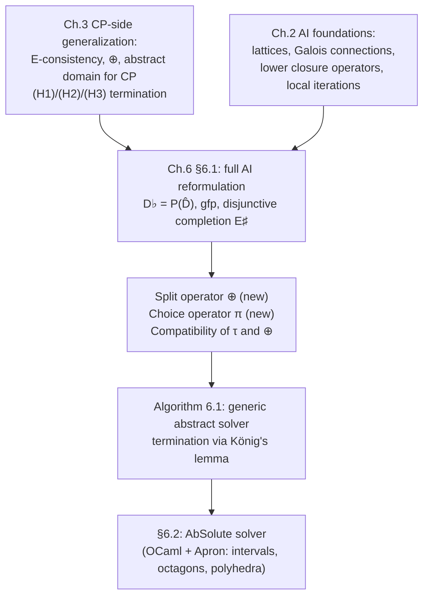

# Abstract Interpretation Reformulation of Constraint Programming

[[book-guidelines|↩ Back to guidelines]]

## Why bother reformulating CP inside AI at all?

Chapters 4–5 of the book went one direction: take a domain shape from Abstract
Interpretation (octagons) and bolt it onto Constraint Programming, producing a
faster solver for continuous problems. That direction hits a wall the moment
you want *mixed* problems — some variables integer, some real. CP solvers are
built around one representation (a box, a Cartesian product of finite sets)
baked in at the type level of the implementation. There is no CP-native notion
of "a domain that doesn't care whether its coordinates are `i64` or `f64`."

Abstract Interpretation, on the other hand, was *never* married to a single
representation — intervals, octagons, polyhedra, and zonotopes coexist as
interchangeable instances of one interface (an abstract domain: a lattice, a
Galois connection, a set of transfer functions). If you could express CP
solving itself in that vocabulary, you'd inherit AI's representation-agnosticism
for free, and a mixed integer/real solver would fall out as "just pick a mixed
abstract domain," not a bespoke integration.

That's the move Chapter 6 makes. It doesn't invent new mathematics — it takes
CP's existing machinery (domains, consistency, splitting, the solve loop) and
shows each piece is *already* an instance of an AI concept, plus exactly two
genuinely new operators (split and choice) that AI never needed because AI
never had to *search*.

If you're building a verifier: this is precisely the pattern your CSP kernel
will use to unify "prove no counterexample exists" (over-approximate, AI-style)
with "find a concrete counterexample" (search, CP-style) inside one lattice
discipline instead of two disconnected engines.

## Step 0: the concrete semantics of "solving a CSP"

Before recasting anything as *abstract*, the book pins down what the *concrete*
object even is. In ordinary CP terms, solving a CSP means computing the set of
tuples satisfying a conjunction of constraints. In AI terms:

- The concrete domain is $D^\flat = \mathcal{P}(\hat D)$ — the powerset of the
  full search space $\hat D = \hat D_1 \times \cdots \times \hat D_n$, ordered
  by inclusion.
- Each constraint $C_i$ has an associated propagator $\rho_i^\flat : \mathcal
  P(\hat D) \to \mathcal P(\hat D)$, which is exactly a **lower closure
  operator** in the AI sense (monotonic, reductive — it only removes points —
  and idempotent).
- The solution set is $S = \rho^\flat(\hat D)$ where $\rho^\flat = \rho_1^\flat
  \circ \cdots \circ \rho_p^\flat$.

And here is the punchline that makes the rest of the chapter possible:

$$S = \mathrm{gfp}_{\hat D}\, \rho^\flat$$

**Solving is computing a greatest fixpoint.** Not "solving is *like* computing
a fixpoint" — literally the same operation AI performs when it iterates
transfer functions to a fixpoint to analyze a program. This single equation is
what licenses reusing all of AI's fixpoint-iteration theory (Chapter 2's
Jacobi/Gauss-Seidel schemes, Granger's local iterations) for CP propagation
with zero new proof obligations.

**What breaks without this framing:** without identifying the solution set as
a fixpoint of closure operators, propagator composition order, idempotence,
and "does propagating twice ever help" all have to be re-derived and
re-justified per-solver. Once you know propagators are lower closure operators
composed toward a gfp, all of that comes for free from lattice theory:
composition of monotone reductive maps is monotone and reductive, so the
process is guaranteed to converge downward regardless of which order you apply
constraints in.

```rust
// The concrete semantics, made literal. `Space` is P(D̂): a subset
// of the search space, represented however you like (a predicate,
// a set of tuples, whatever — the point is it's a lattice element).
trait ClosureOperator<Space> {
    /// ρ(X) ⊆ X : monotonic, reductive, idempotent.
    fn apply(&self, x: Space) -> Space;
}

// A CSP's concrete solving process is just: fold all propagators,
// starting from the whole space, until nothing shrinks anymore.
fn solve_concrete<S: PartialEq + Clone>(
    initial: S,
    propagators: &[Box<dyn ClosureOperator<S>>],
) -> S {
    let mut cur = initial;
    loop {
        let next = propagators.iter().fold(cur.clone(), |x, p| p.apply(x));
        if next == cur { return next; } // reached gfp
        cur = next;
    }
}
```

## Step 1: CP's own domain representations *are* abstract domains

Once the concrete semantics is fixed as $(D^\flat, \subseteq)$, the book
re-derives every CP domain representation you already know as an instance of
$(D^\sharp, \sqsubseteq^\sharp, \bot^\sharp, \sqcup^\sharp)$ — a base set with
a partial order, a bottom, and joins:

| CP notion | AI abstract domain | Galois connection |
|---|---|---|
| Integer Cartesian product $S^\sharp$ | product of subsets of each $\hat D_i$ | $\gamma_a(S_1,\ldots,S_n) = S_1\times\cdots\times S_n$ |
| Integer box $I^\sharp$ | product of integer intervals $\llbracket a_i,b_i\rrbracket$ | $\gamma_b$ analogous, with $\alpha_b$ taking componentwise min/max |
| Box $B^\sharp$ | product of real intervals $[a_i,b_i]$ | $\gamma_h$ analogous, floating-point rounded |
| Octagon $O^\sharp$ | function from binary unit expressions $\pm v_i \pm v_j$ to a float upper bound | Definition 4.3.2, reused verbatim |
| Polyhedron $P^\sharp$ | linear constraints / generators (double description) | **no** Galois connection — no canonical $\alpha$ exists |
| Mixed box $M^\sharp$ | integer intervals on some coordinates, real intervals on the rest | $\gamma_m$, componentwise per variable kind |

Each of these also carries a **monotonic size function** $\tau : D^\sharp \to
\mathbb R_{\geq 0}$ with $\tau(e)=0 \iff e=\emptyset$ — not part of classical
AI's abstract-domain interface at all, but essential here: it's how the solver
will later measure "have I refined this element enough to stop." For a box,
$\tau_h$ is just the length of its largest dimension; for an integer box,
$\tau_b$ is that length *plus one*, so that a singleton (a fully-instantiated
solution) reads $\tau = 1$ uniformly across representations.

Notice the polyhedron row: **no Galois connection**. This matters because it
tells you the abstraction relationship $D^\flat \leftrightarrows D^\sharp$
that AI usually assumes for free is not universal — some useful abstract
domains only support operating in one representation (constraints, or
generators) without a canonical "best abstraction" map back from concrete
sets. The chapter's framework has to (and does) work without assuming a
Galois connection exists everywhere; the consistency and split operators are
defined representation-locally instead.

The deep point of this table, stated explicitly in the text: which
non-relational domain you "get" — generalized arc-consistency, bound-
consistency, or hull-consistency — is entirely determined by *which abstract
domain you plugged in*, not by anything special about CP's propagation
algorithm. GAC = $S^\sharp$-consistency. BC = $I^\sharp$-consistency. HC =
$B^\sharp$-consistency. Three "different" classical CP consistency notions
collapse into one operation parametrized by a domain choice.

```rust
// The shared interface every CP domain representation now implements.
// This is literally an abstract-domain trait.
trait AbstractDomain: PartialOrd + Clone {
    fn bottom() -> Self;          // ⊥]
    fn join(&self, other: &Self) -> Self; // ⊔]
    fn size(&self) -> f64;        // τ, the termination-measuring size function
    fn is_empty(&self) -> bool;   // τ(e) = 0
}

// GAC, BC, HC are not three algorithms — they are the SAME consistency
// operator instantiated on three different `AbstractDomain` impls.
struct IntegerCartesianProduct { /* S] : per-variable finite sets */ }
struct IntegerBox              { /* I] : per-variable integer intervals */ }
struct Box                     { /* B] : per-variable float intervals */ }
```

## Step 2: propagation *is* Granger's local iterations, in AI's own name

Given a Galois connection $D^\flat \overset{\gamma}{\underset{\alpha}{\leftrightarrows}} D^\sharp$,
the **perfect propagator** — the theoretically ideal consistency operator for
all constraints together — is just:

$$\alpha \circ \rho^\flat \circ \gamma$$

concretize, run the exact concrete semantics, re-abstract. Solvers can't
usually compute this exactly (running exact concrete semantics on possibly
infinite $\hat D$ is the whole reason abstraction exists), so they approximate
it algorithmically: apply each constraint's propagator $\rho_i^\sharp$ in turn
until a fixpoint, or until a budget runs out.

The book flags this as *literally* Granger's local iterations from AI —
already-published technique for analyzing conjunctions of tests by iterating
per-test abstract transfer functions to a fixpoint, with a trivial narrowing
(just: stop after an iteration cap) substituting for full convergence. It
further notes that the standard CP propagator HC4-Revise (forward-backward
evaluation over an expression tree, Chapter 2) is *the same algorithm* as
AI's forward-backward abstract test transfer functions on non-relational
domains — independently discovered in both communities.

**What this buys you concretely:** you no longer need a separate correctness
argument for "why does propagating each constraint repeatedly converge to
something sound." It's a corollary of local-iteration theory for lower closure
operators, proved once in AI and inherited for free.

## Step 3: disjunctive completion — CP's search tree, named properly

A single abstract element (one box, one octagon) can only ever represent a
*convex-ish, connected* region. But a solver's frontier of unexplored regions
— or its accumulated set of solution-boxes — is a *disjunction* of such
elements. AI has a name for exactly this structure: **disjunctive
completion**.

**Definition 6.1.4 (Disjunctive Completion).** Given a base abstract domain
$D^\sharp$, the disjunctive completion is
$$E^\sharp = \mathcal P_{\text{finite}}(D^\sharp)$$
restricted to sets whose elements are pairwise *incomparable* (no element is
below another): $E^\sharp = \{X^\sharp \subseteq D^\sharp \mid \forall B^\sharp, C^\sharp \in X^\sharp,\ B^\sharp \not\sqsubseteq^\sharp C^\sharp\}$.

This set is ordered by the **Smyth order**:
$$X^\sharp \sqsubseteq_E^\sharp Y^\sharp \iff \forall B^\sharp \in X^\sharp,\ \exists C^\sharp \in Y^\sharp,\ B^\sharp \sqsubseteq^\sharp C^\sharp$$

— "every piece of $X^\sharp$ fits inside some piece of $Y^\sharp$." This is
precisely CP's "the search frontier is a set of boxes, and refining a box
into two smaller ones is still an over-approximation of the same solution
set" intuition, given a formal partial order so that "did the frontier
actually shrink" becomes a checkable inequality rather than a hand-wave.

**What breaks without this:** without a formal order on *sets* of abstract
elements, you can't state — let alone prove — that a solving loop's
accumulated frontier is monotonically decreasing. You'd be relying on
"obviously the search tree gets smaller" as an informal argument. The Smyth
order turns that into Proposition territory (used directly in the termination
proof of Step 5).

```python
# Smyth order check: is every element of xs covered by some element of ys?
def smyth_leq(xs, ys, sqsubseteq):
    return all(any(sqsubseteq(b, c) for c in ys) for b in xs)
```

## Step 4: the split operator — the piece AI never needed

This is the chapter's genuinely novel contribution to AI theory, not just a
renaming exercise. Classical AI has widening (to force convergence upward on
loops) and narrowing (to refine after widening), but it never needed an
operator that takes *one* abstract element and produces *several* smaller
ones — because AI never searches. When AI analyzes a branch (an `if`), it
creates two elements, analyzes each branch separately, then rejoins them with
$\sqcup^\sharp$ before continuing. CP, by contrast, must actively *decide to
subdivide* a domain to make progress, and must keep every piece open for
further exploration rather than immediately rejoining them.

**Definition 6.1.5 (Split Operator).** A split operator is $\oplus : D^\sharp
\to E^\sharp$ such that for all $e \in D^\sharp$:

1. $|\oplus(e)|$ is finite (finitely many pieces),
2. $\forall e_i \in \oplus(e),\ e_i \sqsubseteq^\sharp e$ (every piece is
   smaller — contracting),
3. $\gamma(e) = \bigcup \{\gamma(e_i) \mid e_i \in \oplus(e)\}$ (the pieces'
   concretizations exactly cover the original — nothing lost, nothing
   invented).

Condition 3 is the load-bearing one: it says $\oplus$ is *an abstraction of
the identity function*. Split changes representation, not meaning — so it can
be inserted anywhere in the solving loop without touching soundness. This is
the formal counterpart of Chapter 3's earlier, CP-flavored Definition 3.2.3 —
the book explicitly notes Definition 6.1.5 is "the abstract domains version"
of that earlier one; the concept was already present when CP was still being
generalized on its own terms in Chapter 3, and Chapter 6 simply re-derives it
inside the AI vocabulary.

Every familiar CP splitting strategy is now just an *instance*:

- **Instantiation** on a discrete domain: $\oplus_a(X^\sharp) = \{(S_1,
  \ldots, x, \ldots, S_n) \mid x \in S_i\}$ — one child per value.
- **Interval bisection** on a box: $\oplus_h(X^\sharp)$ cuts $I_i = [a,b]$
  into $[a,h]$ and $[h,b]$ at the midpoint.
- **Octagon split** $\oplus_o$: cuts along a binary unit expression $\alpha
  v_i + \beta v_j$ at its midpoint $h$, producing two half-octagons.
- **Polyhedron split** $\oplus_p$: bisects along a linear expression at a
  Simplex-computed midpoint between the expression's min and max over the
  polyhedron.
- **Mixed-box split** $\oplus_m$: instantiates if the chosen coordinate is
  discrete, bisects if continuous — literally dispatching on variable kind.

```rust
// A split operator is finite, contracting, and exact-under-γ by contract.
// Rust's type system can only encode the shape, not the soundness proof —
// but the shape alone is worth pinning down, because it's what a compiler-
// pass style "refine one CSP node into several children" function must satisfy.
trait SplitOperator<D: AbstractDomain> {
    /// ⊕(e): finite, each child ⊑] e, and their γ's union covers γ(e).
    fn split(&self, e: &D) -> Vec<D>;
}

struct Bisect; // ⊕_h : cut the widest dimension at its midpoint
impl SplitOperator<Box_> for Bisect {
    fn split(&self, e: &Box_) -> Vec<Box_> {
        let (i, (a, b)) = e.widest_dimension();
        let h = (a + b) / 2.0;
        vec![e.with_dim(i, a, h), e.with_dim(i, h, b)]
    }
}
```

## Step 5: the choice operator — deciding *which* piece to work on next

Splitting produces a set; something has to pick *one* element out of that set
to keep refining, subject to it still being "big enough" to be worth
refining.

**Definition 6.1.6 (Choice Operator).** For fixed precision $r \in
\mathbb R_{>0}$, a choice operator is $\pi : E^\sharp \to D^\sharp$ such that
for all $X^\sharp \in E^\sharp$: (1) $\pi(X^\sharp) \in X^\sharp$, and (2)
$(\tau \circ \pi)(X^\sharp) > r$.

In plain terms: $\pi$ is a "pop from the frontier, but only elements still
above precision $r$" selector — dequeue-largest, dequeue-oldest (FIFO), or
any other strategy you like, as long as it never returns something already
small enough to be treated as a leaf.

## Step 6: why any of this terminates — compatibility of $\tau$ and $\oplus$

Here is the crux the whole chapter has been building toward: **why does
repeatedly splitting, reducing, and choosing ever stop?** Nothing so far
guarantees it — you could imagine a pathological split operator that keeps
producing infinitely many "smaller" pieces without their size ever dropping
below $r$.

**Definition 6.1.7 (Compatibility of $\tau$ and $\oplus$).** $\tau : D^\sharp
\to \mathbb R_+$ and $\oplus : D^\sharp \to E^\sharp$ are compatible iff for
*any* reductive operator $\rho^\sharp$ (a consistency/propagation step) and
*any* family of choice operators $\pi_i$:

$$\forall e \in D^\sharp,\ \forall r \in \mathbb R_{>0},\ \exists K \text{ such that } \forall j \geq K,\ (\tau \circ \pi_j \circ \oplus \circ \rho^\sharp \circ \cdots \circ \pi_1 \circ \oplus \circ \rho^\sharp)(e) \leq r$$

In words: iterating "propagate, split, choose" long enough eventually drives
the size measure below any target precision $r$, no matter which reductive
propagator or which choice strategy you plug in. The book verifies this holds
for every splitting operator it defined ($\oplus_a, \oplus_b, \oplus_h,
\oplus_o, \oplus_p, \oplus_m$) paired with its corresponding size function
($\tau_a, \tau_b, \tau_h, \tau_o, \tau_p, \tau_m$) — this is exactly why each
row of the table in Step 1 was equipped with its own $\tau$ in the first
place: $\tau$ isn't decoration, it's the certificate that makes termination
provable per-domain.

**Remark 6.1.2** ties this back to the search-tree picture from Chapter 2:
the solving process is a search tree where each branch is a sequence of
reduce/choose/split steps, and Definition 6.1.7 is exactly the statement
"every branch of this tree is finite."

## Step 7: the generic abstract solving algorithm, and its termination proof

Everything above assembles into **Algorithm 6.1**:

```text
sols ← ∅                         // accumulated abstract solutions, in E]
toExplore ← ∅                    // frontier, in E]
push ⊤] into toExplore           // start from the whole search space

while toExplore ≠ ∅:
    e ← pop(toExplore)           // choice operator π picks the next element
    e ← ρ](e)                    // apply consistency (a reductive operator)
    if e ≠ ∅:
        if τ(e) ≤ r or isSol(e): // small enough, or provably all-solutions
            sols ← sols ∪ {e}
        else:
            push ⊕(e) into toExplore   // split operator ⊕ refines
```

This is a direct generalization of Chapter 3's Algorithm 3.1 (the "unified
solving" algorithm defined purely in CP terms, over an abstract domain $E$
satisfying hypotheses (H1) closure under intersection, (H2) no infinite
decreasing chain, (H3) $r \in \tau(E^f)$). Chapter 6 replaces that
CP-flavored $E$ with the AI-native disjunctive-completion domain $D^\sharp$,
and replaces (H1)–(H3) with the single compatibility condition of Definition
6.1.7 — a strictly more general and more clearly-motivated termination
argument, phrased entirely in AI vocabulary (reductive operators, choice
operators, disjunctive completions) rather than CP-specific ones (arc-
consistency-style closure, decreasing chains stated over generic $E$).

**Proposition 6.1.1 (Termination).** If $\tau$ and $\oplus$ are compatible,
Algorithm 6.1 terminates.

*Proof sketch, and why it works:* Suppose the search tree were infinite. Its
width at every level is finite (split operator condition 1: $|\oplus(e)|$
finite). A finitely-branching infinite tree must, by **König's lemma**, contain
an infinite path. But an infinite path is exactly an infinite sequence
$\pi_j \circ \oplus \circ \rho^\sharp \circ \cdots$ whose $\tau$-value, by
Definition 6.1.7, must eventually drop to $\leq r$ — contradiction, since a
node with $\tau(e) \leq r$ is a leaf (it goes to `sols`, not back onto the
frontier). So no infinite path exists; the tree is finite; the algorithm
terminates.

This is a genuinely elegant proof structure worth internalizing on its own:
**"finite branching + no-infinite-descent along any branch ⟹ finite tree"**
is König's lemma doing essentially all of the work, once the split operator's
finiteness condition and the $\tau$/$\oplus$ compatibility condition are in
place as the two premises it needs.

**Proposition 6.1.2 (Correctness).** At every iteration, $\bigcup\{\gamma(x)
\mid x \in \mathtt{toExplore} \cup \mathtt{sols}\}$ over-approximates the true
solution set — because $\rho^\sharp$ abstracts the concrete propagator
semantics and $\oplus$ abstracts the identity (condition 3 of Definition
6.1.5 again doing the work). At termination, `sols` contains only elements
that are exact solutions or are below precision $r$. Setting $r=1$ in the
discrete case recovers an *exact* solution set, not merely an
over-approximation — because $\tau(e) = 1$ for a discrete domain forces every
variable to be a singleton.

Two honest differences from classical AI the chapter flags explicitly, worth
holding onto: (1) AI never needs $\oplus$ — disjunctions arise only at
control-flow joins and get rejoined via $\sqcup^\sharp$ immediately, whereas
CP's disjunctions must persist and keep growing across the whole search; (2)
AI's iteration strategy is comparatively simple (a narrowing after widening),
while CP's frontier data structure and splitting strategy are far more
elaborate — real solvers (e.g. AC-5-style incremental propagation, where only
constraints touched by the last domain change get re-queued) go well beyond
what Algorithm 6.1 shows, which is deliberately the generic skeleton, not the
efficient implementation.

## Where this leads



Chapter 6's reformulation is the book's second and final synthesis move — the
mirror image of Chapters 4–5, which imported an AI domain (octagons) *into*
CP. Here, CP's whole solving *process* is exported *into* AI, so that any
domain Apron already implements (interval, octagon, polyhedron) — including
ones mixing integer and real variables — becomes usable by the same generic
Algorithm 6.1 without CP-specific engineering per domain. That's exactly what
§6.2's AbSolute solver cashes in on next.

For the standing project: this chapter *is* the template for unifying your
planned CSP kernel with the abstract-interpretation side of the verifier. The
split/choice/compatibility machinery here is precisely the discipline needed
to make a CEGAR-style loop — over-approximate with an abstract domain to try
to *prove* an invariant, and when that fails, split/search to try to *find* a
concrete counterexample — live inside one lattice-theoretic framework instead
of stitching together two ad hoc engines. The correctness argument
($\rho^\sharp$ abstracting concrete semantics, $\oplus$ abstracting identity)
is also the right shape for proving your own invariant-generation passes
sound: any operation you add to the loop only needs to satisfy "abstracts the
identity" or "is a reductive abstraction of the concrete semantics" to slot in
without re-deriving termination or soundness from scratch. And the
$\tau/\oplus$ compatibility condition is a reusable pattern for *any* future
search-plus-abstraction procedure you build (e.g. refining Horn-clause
candidate invariants, or narrowing metavariable constraint sets during
elaboration) — König's lemma plus a monotone progress measure is a cheap,
general way to get a termination proof once the two ingredients are in place.
