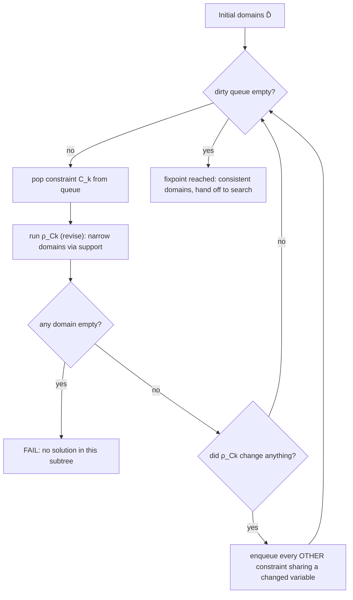

[[book-guidelines|↩ Back to guidelines]]

# Consistency and Propagation in Constraint Programming

## 1. The problem: search alone doesn't scale

A CSP is variables $v_1,\dots,v_n$ each ranging over a domain $D_i \subseteq \hat D_i$, plus constraints $C_1,\dots,C_p$ restricting which joint assignments are allowed. Solving means finding points of $D_1\times\cdots\times D_n$ that satisfy every constraint. The brute-force move — enumerate the Cartesian product, test each tuple against each constraint — is correct and completely impractical: the space is $\prod_i |D_i|$, exponential in the variable count. Ten integer variables with a thousand values each is $10^{30}$ tuples. For continuous variables it's worse — you can't enumerate the reals at all.

The move that makes CP tractable is to attack the domains, not the tuples, *before* you branch on anything: for each constraint, ask "which values in each variable's domain could possibly participate in *some* solution to this one constraint, given what the other variables' domains currently look like?" Any value that provably cannot is deleted — no branching, no risk, no guessing. That deletion process, iterated across all constraints until nothing more can be removed, is **propagation**. The property a domain state has when a propagator has done everything it can for a given constraint is **consistency**.

This is the CP analogue of narrowing an abstract value toward the concrete semantics without ever losing a concrete state — which is exactly the abstract-interpretation move the learning-goals thread "Galois Connection, abstract lattices and domain propagation methods" is pointing at. Hold that thought; it becomes precise in §7.

## 2. Support: the one idea everything else is built from

The book is disciplined about this: instead of defining GAC, BC, and HC as three unrelated things, it defines a single primitive — **support** — and then GAC, BC, and HC all fall out as "support, checked against three different domain representations."

> **Definition 2.2.6 (Support).** Let $v_1,\dots,v_n$ be variables on finite discrete domains $D_1,\dots,D_n$, $D_i \subseteq \hat D_i$, and $C$ a constraint. The value $x_i \in D_i$ **has a support** iff for every $j \neq i$, there exists $x_j \in D_j$ such that $C(x_1,\dots,x_n)$ is true.

In words: $x_i$ has a support if you can pick *some* witness for every other variable, from its *current* domain, such that all together they satisfy $C$. It doesn't need to extend to a solution of the whole CSP — just of this one constraint, against the domains as they stand right now. If $x_i$ has no support, no full solution can ever use $x_i$ for this variable — deleting it is sound: no completeness is lost, because nothing that could have been part of a solution disappears.

Every consistency notion in this article is a quantifier restatement of "check support, on a specific representation of the domain":

- **GAC**: check support for *every point* of the domain (domain kept as a set).
- **BC**: check support for *only the two bounds* of the domain (domain kept as an interval).
- **HC**: check support for the *box* as a geometric object (domain kept as a floating-point interval, and "support" becomes "smallest enclosing box of the constraint's solution set").

### What breaks without a shared support primitive

If you instead define GAC, BC, and HC as three independent ad-hoc procedures (which is how a lot of CP tutorials present them), you lose the thing that makes the whole family provably sound: every one of them is "delete iff no witness exists," so every one of them can never delete an actual solution. Losing sight of that shared soundness argument is how people end up writing propagators that quietly delete valid tuples — a bug that won't show up as a crash, it shows up as your solver returning "unsatisfiable" on a satisfiable problem, silently and without any signal that something is wrong.

## 3. Generalized arc-consistency (GAC): support checked pointwise

> **Definition 2.2.7 (Generalized Arc-Consistency).** Domains $D_1,\dots,D_n$ are GAC for $C$ iff $\forall i, \forall x \in D_i$, $x$ has a support.

**Worked example (carried through the whole article).** $v_1, v_2$ on $D_1 = D_2 = \{-1,0,1,2,3,4\}$, constraint $v_1 = 2v_2 + 2$. The GAC domains are $D_1 = \{0,2,4\}$, $D_2 = \{-1,0,1\}$. $v_1 = -1$ has no witness $v_2$ with $2v_2+2=-1$ in an integer domain, so it's deleted; $v_1=1$ likewise. Once $v_2 \geq 2$, $v_1 \geq 6$, out of range — so $2,3,4$ get deleted from $D_2$ too.

GAC is the *strongest* of the three consistencies covered here — it deletes the most inconsistent values, keeping only points that are individually witnessed. That strength has a cost: **binary** constraints are $O(d^2)$ worst case ($d$ = largest domain size), but for constraints of arity $> 2$, deciding GAC is **NP-complete**, even restricted to linear constraints. This is why real solvers reach for constraint-specific algorithms (e.g. dedicated `alldifferent` propagators) rather than a generic support-search whenever they can.

### GAC as a Rust propagator

The natural Rust shape for "a thing that narrows a domain" is a closure or trait object over a mutable domain representation:

```rust
use std::collections::BTreeSet;

/// A finite integer domain kept as an explicit point set — the representation GAC needs.
type PointDomain = BTreeSet<i64>;

/// A propagator narrows domains in place and reports whether it changed anything,
/// or that it proved the domain empty (failure).
trait Propagator {
    fn revise(&self, domains: &mut [PointDomain]) -> PropResult;
}

#[derive(PartialEq, Eq, Debug)]
enum PropResult { Unchanged, Narrowed, Failed }

/// GAC-revise for a binary constraint C(x1, x2), by brute support search —
/// this is literally "Definition 2.2.6, computed."
struct Gac2<F: Fn(i64, i64) -> bool> {
    var_a: usize,
    var_b: usize,
    holds: F,
}

impl<F: Fn(i64, i64) -> bool> Propagator for Gac2<F> {
    fn revise(&self, domains: &mut [PointDomain]) -> PropResult {
        let mut changed = false;
        let snapshot_b = domains[self.var_b].clone();
        domains[self.var_a].retain(|&a| {
            let has_support = snapshot_b.iter().any(|&b| (self.holds)(a, b));
            changed |= !has_support;
            has_support
        });
        let snapshot_a = domains[self.var_a].clone();
        domains[self.var_b].retain(|&b| {
            let has_support = snapshot_a.iter().any(|&a| (self.holds)(a, b));
            changed |= !has_support;
            has_support
        });
        if domains[self.var_a].is_empty() || domains[self.var_b].is_empty() {
            PropResult::Failed
        } else if changed {
            PropResult::Narrowed
        } else {
            PropResult::Unchanged
        }
    }
}
```

`holds` is exactly $C$ from the definition; `retain` with the support existence check is exactly "delete $x_i$ iff it has no support." This is $O(d^2)$ per call, matching the book's stated complexity — every retained point on one side is checked against every point on the other.

## 4. Bound-consistency (BC): support checked at the bounds only

> **Definition 2.2.8 (Bound Consistency).** $D_1,\dots,D_n$ are BC for $C$ iff $\forall i$, $D_i$ is an integer interval $\llbracket a_i,b_i \rrbracket$, and both $a_i$ and $b_i$ have a support.

BC is strictly weaker than GAC: it only insists the two endpoints are witnessed, saying nothing about the interior. In the running example, $D_1 = \llbracket -1,4 \rrbracket$, $D_2 = \llbracket -1,4 \rrbracket$, constraint $v_1 = 2v_2+2$: the BC domains are $D_1 = \llbracket 0,4 \rrbracket$, $D_2 = \llbracket -1,1 \rrbracket$. Compare to GAC's $D_1=\{0,2,4\}$: BC's $D_1$ keeps $1$ and $3$, which have no support at all — BC can't see that, because it never checks interior points, only $a_1=0$ and $b_1=4$.

Why trade strength for this? **Representation**. An interval is two numbers; a point set is $O(d)$ numbers. For large domains (and especially for domains that started as ranges, like `0..999`), BC is far cheaper to store and to update, at the cost of retaining some values GAC would have thrown away. This is the same "precision vs. cost" trade you already know from abstract interpretation: intervals over-approximate compared to a set-of-points domain, but they're constant-size and cheap to join/widen.

Complexity: still $O(d^2)$ worst case for a binary constraint by the book's argument (each endpoint check still searches for a witness across the other domain), but *deciding* bound-consistency in general is NP-hard — it inherits the hardness of GAC's arity-$>2$ case, and specialized algorithms exist for global constraints like `alldifferent` and `gcc`.

### What breaks without distinguishing GAC from BC

If your propagator library only ever offers GAC-style point-set propagation, every domain becomes a `BTreeSet`/hash set no matter how large — memory blows up on wide ranges (a domain of `0..1_000_000` as an explicit set is a million-entry structure updated on every propagation round), and GAC's own worst-case NP-completeness for non-binary constraints becomes a real wall on realistic problems, not just a theoretical one. Conversely, if you only offer BC, you silently accept extra non-solutions in the domain (like $1,3$ above) that a search phase now has to branch over needlessly. Real solvers expose both and let the constraint choose — `alldifferent` typically wants GAC-strength reasoning, a simple linear inequality is happy with BC.

## 5. Hull-consistency (HC): support checked geometrically, for continuous domains

Real variables aren't computer-representable exactly, so their domains are floating-point-bounded intervals from the start, and "support" has to mean something spatial rather than pointwise.

> **Definition 2.2.9 (Hull-Consistency).** Domains $D_1,\dots,D_n \in \mathbb{I}$ (intervals) are HC for $C$ iff $D_1 \times \cdots \times D_n$ is the *smallest box with floating-point bounds* containing the solutions of $C$ within $D_1\times\cdots\times D_n$.

Worked example: $D_1=D_2=[-1,4]$, $C: v_1 = 2v_2+2$. HC gives $D_1=[0,4]$, $D_2=[-1,1]$ — the tightest enclosing box of the line segment $\{(2t+2,t) : t\in[-1,1]\}$ inside the original box.

Note the shift in what "consistent" *means* here: it's not "every point has a witness" (uncountably many points, no such check is even computable in general) — it's "this box is the least fixed box (w.r.t. $\subseteq$) containing the solution set." That's a **closure operator** move: HC picks out the smallest element, in the lattice of boxes ordered by inclusion, that still contains everything you're required to keep. This generalization is made explicit later in the book (Chapter 3, §3.2.1) as **$E$-consistency**: for any family $E$ of subsets of $\hat D$ closed under intersection, the $E$-consistent domain for constraint $C$ is the least element of $E$ containing $S_C$, and GAC/BC/HC are recovered as $E$ being the point-sets, the integer-boxes, and the boxes, respectively (three propositions in that section prove exactly this equivalence). That's the formal shape a Lean development would want: parametrize consistency by an abstract domain $E$ once, get the three named consistencies as instances for free.

```lean
-- HC (and by the E-consistency generalization, GAC and BC too) as
-- "least element of a closure-under-intersection family containing the solutions."
structure ClosedFamily (Univ : Type) where
  Contains : Set Univ → Prop
  closed_under_inter : ∀ A B, Contains A → Contains B → Contains (A ∩ B)

def isEConsistent {Univ : Type} (E : ClosedFamily Univ)
    (D solutions : Set Univ) : Prop :=
  E.Contains D ∧ solutions ⊆ D ∧
  ∀ D', E.Contains D' → solutions ⊆ D' → D ⊆ D'
```

`isEConsistent` says exactly what Definitions 2.2.7–2.2.9 say in each of their three cases: $D$ is in the family, contains all solutions, and is the *smallest* such element. This is a lower-closure-operator statement — $D = \bigcap \{D' \in E : S \subseteq D'\}$ — the same shape as an abstract-interpretation Galois-connection best-approximation, just instantiated at the "solution set of one constraint" concrete domain instead of "reachable states of a program."

## 6. HC4-Revise: computing hull-consistency mechanically

Definitions 2.2.7–2.2.9 tell you *what* a consistent state looks like; they don't tell you how to compute it. For HC, the 1999 Benhamou et al. algorithm **HC4-Revise** answers that: represent the constraint as its **syntax tree**, tag every node with an interval, and sweep the tree twice — once outward-in with interval arithmetic (forward pass), once inward-out propagating the constraint's own required output back down (backward pass). It runs in $O(e)$, linear in the number of unary/binary operators in the constraint — a dramatic improvement over generic search, at the cost of being only an *approximation* of true HC when a variable occurs more than once in the tree (the multiple-occurrence problem, common to all interval-arithmetic methods).

### Interval arithmetic (the forward pass's arithmetic)

For $I_1=[a_1,b_1], I_2=[a_2,b_2]$:

$$I_1+I_2=[a_1+a_2,\ b_1+b_2] \qquad I_1-I_2=[a_1-b_2,\ b_1-a_2]$$
$$I_1\times I_2=[\min(a_1a_2,a_1b_2,b_1a_2,b_1b_2),\ \max(a_1a_2,a_1b_2,b_1a_2,b_1b_2)]$$

Division and squaring need case splits on whether $0$ lies inside the interval — the book gives the full case analysis; the shape to remember is that interval arithmetic overapproximates: it answers **true** (box is all solutions), **false** (box has none), or **maybe** (mixed) for a constraint evaluated over a box, which is a strictly weaker oracle than pointwise boolean evaluation.

### Worked example, traced through both passes

Constraint $v_1 = 2v_2+2$, $D_1=D_2=[-1,4]$, syntax tree `= (v1, + (× (2, v2), 2))`.

**Forward pass** (leaves → root, plain interval arithmetic, ignoring the constraint's own semantics):

- `×` node: $2 \times [-1,4] = [-2,8]$
- `+` node: $[-2,8] + [2,2] = [0,10]$
- `=` node (root): because the top-level relation is equality, the root's tag is the *intersection* of its two children's intervals — $v_1$'s tag $[-1,4]$ intersected with the RHS tag $[0,10]$, giving $[0,4]$.

**Backward pass** (root → leaves, pushing the root's tightened value back down through each operator's *inverse*):

- Root broadcasts $[0,4]$ down both children: $v_1 \leftarrow [-1,4]\cap[0,4]=[0,4]$; the `+` node is told its value must lie in $[0,4]$.
- `+` node, knowing output $\in [0,4]$ and one input is the constant $[2,2]$: inverse of $+$ is $-$, so the `×` node's value is narrowed to $[0,4]-[2,2]=[-2,2]$ (intersected with its forward tag $[-2,8]$, staying $[-2,2]$).
- `×` node, knowing output $\in[-2,2]$ and one input is the constant $2$: inverse of $\times$ is $/$, so $v_2 \leftarrow [-2,2]/2 = [-1,1]$ (intersected with the original $[-1,4]$, staying $[-1,1]$).

Result: $D_1=[0,4]$, $D_2=[-1,1]$ — matching the definitional answer from §5, computed mechanically instead of by inspection.

![[backward_pass.svg]]

### HC4-Revise as real Rust

The forward/backward tree sweep translates directly into a recursive-descent evaluator over an expression AST, which is exactly the shape a compiler's constant-folding or range-analysis pass already has:

```rust
#[derive(Clone, Copy, Debug)]
struct Interval { lo: f64, hi: f64 }

impl Interval {
    fn intersect(self, other: Interval) -> Option<Interval> {
        let lo = self.lo.max(other.lo);
        let hi = self.hi.min(other.hi);
        if lo <= hi { Some(Interval { lo, hi }) } else { None }
    }
    fn add(self, o: Interval) -> Interval { Interval { lo: self.lo + o.lo, hi: self.hi + o.hi } }
    fn sub(self, o: Interval) -> Interval { Interval { lo: self.lo - o.hi, hi: self.hi - o.lo } }
    fn mul(self, o: Interval) -> Interval {
        let cands = [self.lo * o.lo, self.lo * o.hi, self.hi * o.lo, self.hi * o.hi];
        Interval {
            lo: cands.iter().cloned().fold(f64::INFINITY, f64::min),
            hi: cands.iter().cloned().fold(f64::NEG_INFINITY, f64::max),
        }
    }
}

/// The constraint's syntax tree — variables are leaves carrying their slot index
/// into the domain array; every internal node is a unary/binary operator.
enum Expr {
    Var(usize),
    Const(f64),
    Add(Box<Expr>, Box<Expr>),
    Mul(Box<Expr>, Box<Expr>),
}

/// Forward pass: evaluate every node's interval bottom-up, recording each
/// node's tag so the backward pass can narrow against it. Returns the tagged tree.
enum Tagged {
    Var(usize, Interval),
    Const(f64, Interval),
    Add(Box<Tagged>, Box<Tagged>, Interval),
    Mul(Box<Tagged>, Box<Tagged>, Interval),
}

fn forward(e: &Expr, domains: &[Interval]) -> Tagged {
    match e {
        Expr::Var(i) => Tagged::Var(*i, domains[*i]),
        Expr::Const(c) => Tagged::Const(*c, Interval { lo: *c, hi: *c }),
        Expr::Add(l, r) => {
            let (lt, rt) = (forward(l, domains), forward(r, domains));
            let tag = tag_of(&lt).add(tag_of(&rt));
            Tagged::Add(Box::new(lt), Box::new(rt), tag)
        }
        Expr::Mul(l, r) => {
            let (lt, rt) = (forward(l, domains), forward(r, domains));
            let tag = tag_of(&lt).mul(tag_of(&rt));
            Tagged::Mul(Box::new(lt), Box::new(rt), tag)
        }
    }
}

fn tag_of(t: &Tagged) -> Interval {
    match t {
        Tagged::Var(_, i) | Tagged::Const(_, i) => *i,
        Tagged::Add(_, _, i) | Tagged::Mul(_, _, i) => *i,
    }
}

/// Backward pass: given the interval this subtree is now required to lie in
/// (`required`), narrow the node's own tag, then push a narrowed requirement
/// down to each child using the *inverse* operator — and write results into `domains`.
fn backward(t: &Tagged, required: Interval, domains: &mut [Interval]) -> Option<()> {
    match t {
        Tagged::Var(i, own) => {
            let narrowed = own.intersect(required)?;
            domains[*i] = narrowed;
            Some(())
        }
        Tagged::Const(_, own) => { own.intersect(required)?; Some(()) }
        Tagged::Add(l, r, own) => {
            let narrowed = own.intersect(required)?;
            // x + y = narrowed  =>  x in narrowed - y, y in narrowed - x
            let lr = narrowed.sub(tag_of(r));
            let rr = narrowed.sub(tag_of(l));
            backward(l, lr, domains)?;
            backward(r, rr, domains)
        }
        Tagged::Mul(l, r, own) => {
            let narrowed = own.intersect(required)?;
            // only handling the "one side is a nonzero constant" case here —
            // the book's full division rule (§2.2.1.2) covers 0 in the interval
            let lr = div_interval(narrowed, tag_of(r)).unwrap_or(tag_of(l));
            let rr = div_interval(narrowed, tag_of(l)).unwrap_or(tag_of(r));
            backward(l, lr, domains)?;
            backward(r, rr, domains)
        }
    }
}

fn div_interval(num: Interval, den: Interval) -> Option<Interval> {
    if den.lo > 0.0 || den.hi < 0.0 {
        let cands = [num.lo / den.lo, num.lo / den.hi, num.hi / den.lo, num.hi / den.hi];
        Some(Interval {
            lo: cands.iter().cloned().fold(f64::INFINITY, f64::min),
            hi: cands.iter().cloned().fold(f64::NEG_INFINITY, f64::max),
        })
    } else {
        None // 0 in denominator interval — book's full case split needed here
    }
}

/// HC4-Revise for an equality constraint lhs = rhs: forward both sides,
/// intersect at the root, then backward-narrow both subtrees against that root.
fn hc4_revise_eq(lhs: &Expr, rhs: &Expr, domains: &mut [Interval]) -> Option<()> {
    let (lt, rt) = (forward(lhs, domains), forward(rhs, domains));
    let root = tag_of(&lt).intersect(tag_of(&rt))?;
    backward(&lt, root, domains)?;
    backward(&rt, root, domains)
}
```

Run `hc4_revise_eq` on the worked example ($v_1 = 2v_2+2$, i.e. `Add(Mul(Const(2), Var(1)), Const(2))` against `Var(0)`, with `domains = [Interval{lo:-1,hi:4}, Interval{lo:-1,hi:4}]`) and it reproduces $D_1=[0,4]$, $D_2=[-1,1]$ — the same numbers as the hand trace above, but now it's a template: this `Expr`/`Tagged`/forward/backward shape is exactly what a refinement-type constraint solver's numeric propagator would look like, generalized from `Add`/`Mul` to whatever operators the constraint language supports (comparisons, `mod`, array-index arithmetic).

### What breaks without the two-pass structure

A one-pass, forward-only evaluator can tell you the constraint is *maybe* satisfiable (interval arithmetic), but it can't narrow anything — it has no way to push the requirement "this must equal $[0,4]$" back down into the leaves, so $v_2$'s domain never shrinks past whatever it started as. You'd have a constraint checker, not a propagator. The backward pass, using each operator's algebraic inverse, is what turns "evaluate a formula over intervals" into "solve a formula over intervals" — which is the entire point.

## 7. Propagators and the propagation loop as a fixpoint computation

For one constraint $C$, the algorithm that takes domains and removes the C-inconsistent values is a **propagator**, $\rho_C$. HC4-Revise is a propagator for HC; the `Gac2::revise` code in §3 is a propagator for GAC. Propagators usually return an *over-approximation* of the true consistent domains (exactly the HC4-Revise multiple-occurrence caveat from §6) — computing the exact consistent set can be NP-hard, so propagators trade precision for tractable runtime, same as any abstract-interpretation transfer function.

With several constraints, you don't run each propagator once — you run them **repeatedly until nothing changes**: the **propagation loop**.

```rust
trait Propagator2 {
    /// Narrow `domains` in place. Returns which variable slots it actually changed.
    fn revise(&self, domains: &mut [Interval]) -> Option<Vec<usize>>; // None = failure (empty domain)
}

fn propagation_loop(props: &[(Box<dyn Propagator2>, Vec<usize>)], domains: &mut [Interval]) -> bool {
    // props[k] = (propagator, the variable slots it reads/writes)
    let mut dirty: std::collections::HashSet<usize> = (0..props.len()).collect();
    while let Some(&k) = dirty.iter().next() {
        dirty.remove(&k);
        let (prop, _scope) = &props[k];
        match prop.revise(domains) {
            None => return false, // failure: some domain went empty
            Some(changed_vars) if !changed_vars.is_empty() => {
                // re-enqueue every OTHER propagator that touches a variable we just changed
                for (j, (_, scope)) in props.iter().enumerate() {
                    if j != k && scope.iter().any(|v| changed_vars.contains(v)) {
                        dirty.insert(j);
                    }
                }
            }
            _ => {}
        }
    }
    true
}
```

This is the "wake list" strategy the book mentions as the one generally used in practice, versus the naive "re-run everything every round." The `dirty` set is exactly a worklist algorithm — the same shape as a dataflow-analysis fixpoint solver.

**Why the loop terminates and lands at a unique answer, regardless of order.** The domain representations from §§3–5 (point sets, integer boxes, boxes) each form a **finite, complete lattice under inclusion**. Every propagator only ever *shrinks* domains (it's a **monotone decreasing** map: $\rho_C(D) \subseteq D$) and is sound (it never removes a solution). A finite descending chain in a finite lattice must stabilize — so the loop terminates. And because propagation is computing the *greatest lower bound* of a set of individually-sound reductions, the order of application doesn't affect the final fixpoint (proved by Apt in 1999 and by Benhamou in 1996) — only how many iterations it takes to get there.



This is the same fixpoint machinery that the book later names explicitly in Chapter 6 as an instance of **Granger's local iterations**, and identifies HC4-Revise as computing a **forward-backward abstract transfer function** — i.e. propagation *is* abstract interpretation's chaotic/local iteration strategy for computing a lattice fixpoint, just specialized to "one constraint's transfer function at a time" instead of "one program point's transfer function at a time." A propagator is a **lower closure operator** on the domain lattice ($\rho_C$ monotone, reductive, and idempotent on its own image at the fixpoint) — precisely the operator shape a Galois-connection best-abstraction argument produces. This is the load-bearing connection for the standing project's CSP kernel: the domain/lattice propagation machinery you need for handling integer and non-linear equations *is* this loop, and a lower-closure-operator propagator is the right shape to unify it later with abstract-interpretation-style invariant tightening over the same lattice — same fixpoint engine, different transfer functions.

```lean
-- The propagation loop as computing the greatest fixpoint of a monotone,
-- reductive family of propagators on a complete lattice of domains.
structure Propagator (D : Type) [CompleteLattice D] where
  apply : D → D
  reductive : ∀ d, apply d ≤ d          -- never adds values back
  monotone  : ∀ d d', d ≤ d' → apply d ≤ apply d'
  sound     : True                       -- (never deletes an actual solution — external property)

-- Iterating any finite family of such propagators to a fixpoint, in any order,
-- lands on the same greatest lower bound — this is Apt/Benhamou's order-independence result.
```

### What breaks without iterating to a fixpoint

If you run every propagator exactly once instead of looping, you only get *local* consistency for each constraint *in isolation* — you miss all the value that comes from one constraint's narrowing exposing new deletions for a different constraint. In the running example this doesn't show because there's only one constraint, but with two constraints sharing a variable (say $v_1 = 2v_2+2$ and $v_2 = v_3 - 1$), narrowing $v_2$'s domain from the first constraint has to be fed into the second before you can narrow $v_3$ — a single pass over each constraint misses that entirely, and you're left with domains that look "checked" but are provably not the smallest sound over-approximation reachable by propagation. Worse: without termination via the finite-lattice argument, a naive "keep looping while something changes" over a non-lattice-shaped domain representation could genuinely fail to terminate — which is exactly why the book is careful to establish that point-sets, integer-boxes, and boxes are all finite complete lattices before it lets you loop at all.

## 8. The AC family: the same definition, forty years of algorithm engineering

Every algorithm below computes the *same specification* — GAC (or its binary special case, arc-consistency, AC) — the differences are entirely in the data structures used to avoid redundant support checks.

| Algorithm | Year | Time complexity | Memory | Idea |
|---|---|---|---|---|
| AC1 [Mackworth 1977] | 1977 | $O(d^3np)$ | — | naive: re-check every constraint, every variable, every value's support, repeatedly |
| AC3 [Mackworth 1977] | 1977 | $O(pd^3)$ | $O(p)$ | worklist: only re-propagate constraints touching a changed variable (this is exactly the `dirty` set in §7) |
| GAC3 [Mackworth 1977] | 1977 | $O(pk^3d^{k+1})$ | $O(pk)$ | AC3 generalized off binary constraints, $k$ = max constraint arity |
| AC4 [Mohr–Henderson 1986] | 1986 | $O(pd^2)$ | $O(pd^2)$ | optimal worst-case time: maintains explicit support counters instead of re-searching |
| GAC4 [Mohr–Masini 1988] | 1988 | $O(pkd^k)$ | — | AC4 generalized off binary constraints |
| AC5, AC6, AC7, AC2001, AC3.2, … | 1992–2003 | varies | varies | practical refinements — reduce constant factors and average-case memory while keeping AC4's worst-case optimality |

The throughline: **AC1 → AC3** is "stop re-checking constraints nothing has changed for" (a worklist), the exact idea in the Rust `dirty` set. **AC3 → AC4** is "stop re-deriving support from scratch — cache *how many* supports each value currently has, and only re-search when that counter hits zero." That single move — turning a search into an incrementally-maintained counter — is why AC4/GAC4 hit the worst-case-optimal bound: you pay for discovering each (value, support) pair once, not once per propagation round. Everything from AC5 onward is variations on making that bookkeeping cheaper in the common case without giving up AC4's worst-case guarantee.

Bound-consistency has seen comparatively little of this treatment — fewer competing definitions get algorithm families built around them, though dedicated algorithms exist for specific global constraints (`alldifferent`, `gcc`). For continuous domains, the analogous lineage is HC3 (1995) → HC4 (1999, the algorithm detailed in §6) → Mohc (2010–2012, which exploits a constraint's monotonicity in each variable to narrow further than plain interval arithmetic can).

### What breaks without the AC3-style worklist

Run AC1 (or the naive "re-run all propagators every round" strategy) on a CSP with hundreds of constraints and you re-derive support for constraints whose relevant variables haven't moved since the last check — wasted work that's asymptotically worse ($O(d^3np)$ vs. $O(pd^3)$: an extra factor of roughly $n$, the variable count, for no benefit) and that gets *worse*, not better, as the problem grows, because every round touches every constraint regardless of relevance. This is precisely why the Rust propagation loop in §7 uses a dirty set rather than a flat `for prop in props { prop.revise(...) }` loop repeated to fixpoint — that flat loop *is* AC1's mistake, generalized to arbitrary constraints.

## 9. Complexity, summarized

- **GAC** on a binary constraint: $O(d^2)$ per revise call (brute support search); deciding GAC for arity $>2$ constraints is NP-complete, even for linear constraints.
- **BC**: $O(d^2)$ worst case per revise call by the same argument (only two witnesses per side instead of $d$, but each witness search still costs $O(d)$); deciding BC in general is NP-hard.
- **HC** via **HC4-Revise**: $O(e)$, linear in the number of operators in the constraint's syntax tree — dramatically cheaper than GAC/BC precisely because it never enumerates points, only propagates two interval sweeps.
- **AC family** (binary GAC, i.e. classic arc-consistency), with $p$ constraints, $n$ variables, $d$ = largest domain, $k$ = max arity: AC1 $O(d^3np)$, AC3 $O(pd^3)$, GAC3 $O(pk^3d^{k+1})$, AC4/GAC4 worst-case optimal at $O(pd^2)$ / $O(pkd^k)$.

The consistent pattern: **stronger consistency = more pruning = more expensive to compute**, and the fifty years of algorithm work (AC1 through Mohc) is entirely about pushing the *constant factors and average case* down toward the theoretical floor without weakening what's actually being computed — the specification (Definitions 2.2.6–2.2.9) never changes; only the implementation does. That separation — spec first, algorithm second, both provably related — is worth internalizing directly for the elaborator/CSP-kernel project: get the support/consistency definitions right and provably sound first, then optimize the revise implementation without ever having to re-litigate correctness.

## Where this leads

Chapter 3's $E$-consistency (§3.2.1, sketched in §5 above) is the formal unification of everything here: GAC, BC, and HC become three instances of one closure-operator definition parametrized by which subset-family $E$ you approximate in, which is also the move Chapter 5 reuses to define octagonal consistency (Oct-consistency = intersection of hull-consistent boxes across every rotated basis) and which Chapter 6 names outright as the meeting point with abstract interpretation — propagation as Granger's local iterations, HC4-Revise as a forward-backward abstract transfer function, and a propagator as a lower closure operator on a lattice. For the standing project, this section *is* the mechanism: the propagation loop (§7) is the fixpoint engine your CSP kernel needs for domain/lattice propagation over integer and non-linear equations, HC4-Revise's tree-structured forward/backward evaluation (§6) is a direct template for implementing numeric constraint propagators over refinement-type predicates, and the lower-closure-operator reading of a propagator is the seam where that same fixpoint engine can later be reused for abstract-interpretation-style invariant tightening — one engine, two transfer-function vocabularies. The companion article on exploration and search picks up exactly where this one stops: once the propagation loop reaches a fixpoint and no more values can be soundly deleted, if the domains aren't all singletons yet, search takes over by making a choice and calling propagation again.
