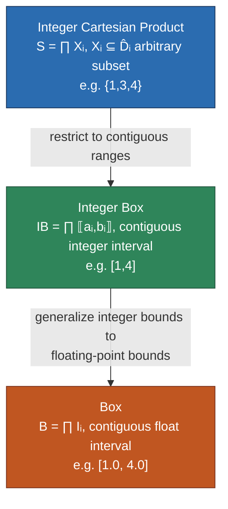
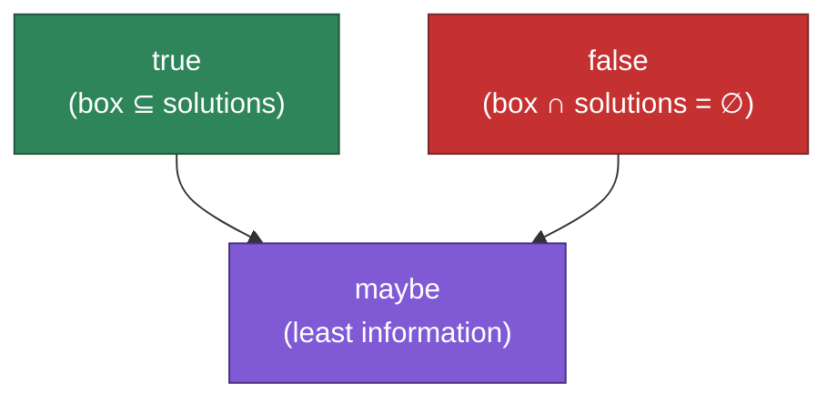

# Constraint Satisfaction Problem Foundations

[[book-guidelines|↩ Back to guidelines]]

## Why this layer exists

Every solver you will ever build — a SAT solver, an SMT solver, a CP kernel, an abstract interpreter — needs an answer to one question before it can do anything else: *what is a candidate assignment, and how is a "maybe correct" one represented in memory?* Constraint Programming's answer is the Constraint Satisfaction Problem (CSP). It is deliberately unglamorous — no fixpoints, no Galois connections yet, just variables, domains and constraints — but everything downstream (propagation, consistency, search, and eventually the whole abstract-domain unification the rest of the book is about) is built on the representation choices made here. Get the domain representation and the evaluation semantics wrong, and every later algorithm inherits the bug.

For your own project, this section matters for a very concrete reason: **interval arithmetic with outward rounding is the actual mechanism your Rust CSP kernel will use for sound numeric reasoning over non-linear equations.** This isn't background theory you can skim — it's the arithmetic layer your propagators will call on every node of the constraint tree.

## The CSP, formally

Pelleau's Definition 2.2.1, paraphrased with names attached:

> A **constraint satisfaction problem** (CSP) is a triple of:
> - variables $v_1, \dots, v_n$,
> - domains $\hat D_1, \dots, \hat D_n$ (the set of possible values for each $v_i$),
> - constraints $C_1, \dots, C_p$, each a relation over some subset of the variables.

The **search space** is the Cartesian product $\hat D = \hat D_1 \times \cdots \times \hat D_n$. A problem is **discrete** if $\hat D \subseteq \mathbb{Z}^n$, **continuous** if $\hat D \subseteq \mathbb{R}^n$ — and always bounded, in either case. The **solution set** is

$$
S = \{(s_1,\dots,s_n) \in \hat D \mid \forall i \in [1,p],\ C_i(s_1,\dots,s_n)\}.
$$

For a single constraint $C$, $S_C$ is the analogous per-constraint solution set. That's the whole definition — no cleverness yet. The cleverness is entirely in how you *represent* $\hat D$ and how you *evaluate* $C_i$ against an approximation of it, which is what the rest of this article is about.

### Grounding: the formal definition in Lean

This is exactly the kind of formalism where writing it down in a proof assistant clarifies more than English prose does, because Lean forces you to be honest about what depends on what:

```lean
structure CSP (n p : Nat) (α : Type) [LE α] where
  domain      : Fin n → Set α                 -- D̂ᵢ
  constraints : Fin p → (Fin n → α) → Prop    -- Cⱼ, a relation over an assignment

def CSP.searchSpace {n p α} [LE α] (csp : CSP n p α) : Set (Fin n → α) :=
  { assign | ∀ i, assign i ∈ csp.domain i }

def CSP.solutions {n p α} [LE α] (csp : CSP n p α) : Set (Fin n → α) :=
  { assign | assign ∈ csp.searchSpace ∧ ∀ j, csp.constraints j assign }
```

`CSP.solutions` here is literally $S$ from the book: an assignment that lives in every $\hat D_i$ *and* satisfies every $C_j$. Nothing about this definition mentions how $\hat D_i$ is stored — that's the whole point of the "domain representation" question in the next section, and it's exactly the kind of separation-of-concerns your elaborator's constraint generation should preserve: the *specification* of a domain and its *representation* are different things, and conflating them early is how solvers end up brittle.

### Grounding: the CSP as a Rust struct

The Rust version makes the same separation explicit via a trait, so the representation is a type parameter, not a hardcoded choice:

```rust
trait Domain: Clone {
    type Value;
    fn contains(&self, v: &Self::Value) -> bool;
}

struct Csp<D: Domain> {
    domains: Vec<D>,
    // A constraint over a subset of variable indices, evaluated against
    // whatever "approximate assignment" the domain representation permits.
    constraints: Vec<Box<dyn Fn(&[D::Value]) -> bool>>,
}
```

This `Domain` trait is where §2.2.1.1's three representations will each become a distinct `impl`.

**What breaks without this separation:** if you hardcode "a domain is a `Vec<i64>`" into your solver's core loop, you cannot later add real-valued or non-Cartesian domains (octagons, polyhedra — Chapters 4–6 of this book) without rewriting the loop. The CSP definition's abstraction over *what a domain is* is precisely what lets the book later swap Cartesian boxes for octagons while reusing the same solving algorithm. Your project's dual CSP/AI architecture needs this same seam.

## Discrete vs. continuous domains, and why it isn't cosmetic

$\hat D \subseteq \mathbb{Z}^n$ (discrete) or $\hat D \subseteq \mathbb{R}^n$ (continuous) looks like a superficial type annotation, but it forces a fork in almost everything downstream:

- **Discrete domains are computer-representable exactly.** $\mathbb{Z}$ (bounded) has finitely many elements, so a domain can, in principle, be stored as an explicit finite set.
- **Continuous domains are not.** $\mathbb{R}$ is uncountable; no domain representation can store "all reals in $[0,2]$" as a set of points. The book is blunt about this: *"it is impossible to enumerate the real numbers between 0 and 1."* Continuous domains must be represented by *bounds*, not enumeration — and bounds are themselves floating-point numbers, which are also not exact for most reals. Two layers of approximation stack up before you even get to writing a constraint.

This is why the book's title topic — pulling in Abstract Interpretation's abstract domains — exists at all: CP, historically, only had one representation trick for continuous variables (floating-point boxes), and this section is where that limitation first shows up formally.

## Domain representations: three shapes, one lattice structure

Section 2.2.1.1 defines three domain representations, each strictly targeting a different variable-type/precision tradeoff. All three form a **finite lattice under inclusion** — meaning any pair of elements has a well-defined meet (greatest lower bound) and join (least upper bound), which is exactly the algebraic structure that will let propagation later be phrased as "compute a fixpoint" instead of an ad hoc iterative procedure.

**Definition 2.2.2 (Integer Cartesian Product).** For discrete finite domains $\hat D_1,\dots,\hat D_n$, an integer Cartesian product is any

$$
S = \prod_i X_i, \qquad X_i \subseteq \hat D_i.
$$

Each $X_i$ is an arbitrary *subset* — not necessarily contiguous. This is the most expressive of the three: `{1, 3, 4}` is a perfectly legal per-variable domain.

**Definition 2.2.3 (Integer Box).** Same setting, but each $X_i$ is restricted to an *interval of integers*:

$$
IB = \Big\{\prod_i \llbracket a_i, b_i \rrbracket \ \Big|\ \forall i,\ \llbracket a_i, b_i\rrbracket \subseteq \hat D_i,\ a_i \le b_i \Big\} \cup \{\emptyset\}.
$$

`{1, 3, 4}` is no longer representable; only contiguous ranges like `[1,4]` are. You've traded expressiveness for a $O(1)$-space, $O(1)$-comparison representation (two bounds per variable instead of an arbitrary set).

**Definition 2.2.4 (Box).** For continuous (bounded, real) domains, the same contiguity restriction, but now over floating-point-bounded intervals:

$$
B = \Big\{\prod_i I_i \ \Big|\ \forall i,\ I_i \in \mathbb{I},\ I_i \subseteq \hat D_i\Big\} \cup \{\emptyset\},
$$

where $\mathbb{I}$ is the set of intervals with floating-point bounds. This is forced, not chosen: reals aren't computer-representable at all, so there is no analogue of the "arbitrary subset" or "integer interval" representations for them — floating bounds are the only game in town.

Notice the progression: Cartesian product (arbitrary sets) $\to$ integer box (contiguous integer ranges) $\to$ box (contiguous float ranges). Each step trades representational power for a cheaper, more uniform data structure, and each is the natural domain type for CP's two variable kinds.



**What breaks without picking the right one:** use an integer Cartesian product where a box would do, and every operation costs $O(|\hat D_i|)$ per variable instead of $O(1)$ — you're back to explicit enumeration, defeating the whole point of CP. Use a box where a Cartesian product is required (e.g. `alldifferent`-style constraints that punch holes in a domain), and you *lose precision you could have kept* — the representation itself becomes the bottleneck on how tight your propagation can get. This is a decision your CSP kernel has to make per constraint family, not once globally.

### Grounding: domain representations as a Rust enum

```rust
#[derive(Clone)]
enum IntDomain {
    /// Integer Cartesian product component: arbitrary finite subset.
    Set(BTreeSet<i64>),
    /// Integer box component: contiguous range.
    Range { lo: i64, hi: i64 },
}

impl IntDomain {
    fn contains(&self, v: i64) -> bool {
        match self {
            IntDomain::Set(s) => s.contains(&v),
            IntDomain::Range { lo, hi } => *lo <= v && v <= *hi,
        }
    }
}

/// A box over continuous, floating-point-bounded intervals — Definition 2.2.4.
#[derive(Clone, Copy, Debug)]
struct Interval {
    lo: f64,
    hi: f64,
}
```

`IntDomain` is a sum type precisely because the book treats "arbitrary set" and "contiguous range" as genuinely different representations with different costs — an `enum` (or, better, separate types unified behind the `Domain` trait from before) captures that the choice is a real design decision, not an implementation detail to paper over.

## Constraint evaluation: two, then three, truth values

For discrete variables, evaluation is boolean, full stop (Example 2.2.2): given a full instantiation, $C(x_1,\dots,x_n)$ is `true` or `false`. Nothing subtle here — it's ordinary predicate evaluation.

For continuous variables it isn't, because you never get to evaluate $C$ at a *point* — you only ever have a *box* (an over-approximation of "the variable's true value, whatever it is"). So the book introduces a third answer:

> - **true**, if the box contains only solutions,
> - **false**, if the box contains no solutions at all,
> - **maybe**, when you cannot determine either way — the box contains both solutions and non-solutions.

This three-valued logic isn't a modeling flourish; it's *forced* by the fact that you're evaluating a predicate against a set (the box), not against an element. Example 2.2.3 walks through all three outcomes with $D_1 = D_2 = [0,2]$:

- $C_1: v_1+v_2 \le 6$ — evaluate $[0,2]+[0,2] = [0,4]$, and $[0,4] \le 6$ holds for every point, so **true**.
- $C_2: v_1-v_2 \ge 4$ — evaluate $[0,2]-[0,2] = [-2,2]$, and $[-2,2]\ge 4$ holds for *no* point, so **false**.
- $C_3: v_1-v_2 = 0$ — evaluate $[-2,2]$; it straddles $0$, so some assignments in the box satisfy the constraint and others don't: **maybe**.

**What breaks without the third value:** collapsing `maybe` into `false` makes your solver *unsound* on continuous domains — it will discard boxes that actually contain solutions, silently dropping counterexamples your CSP kernel exists to find. Collapsing `maybe` into `true` makes it *incomplete* in the opposite sense — it will accept as "proven" a region that may contain non-solutions, which is exactly the failure mode that would make an abstract-interpretation-based verifier unsound. The three-valued answer is what lets a solver *say when it doesn't know*, instead of guessing — and "say when it doesn't know" is the entire reason `maybe` exists as a return value rather than an error.

### Grounding: three-valued evaluation as a Lean inductive type

This is a textbook fit for a proof-assistant encoding, because Lean's kernel already has strict opinions about what counts as "decided" versus "undetermined," and a ternary logic makes that distinction a first-class value instead of an implicit control-flow branch:

```lean
inductive Bool3 where
  | tt : Bool3     -- box contains only solutions
  | ff : Bool3     -- box contains no solutions
  | maybe : Bool3  -- box contains both

/-- Interval-arithmetic evaluation of a constraint against a box. -/
def evalConstraint (c : Constraint) (box : Fin n → Interval) : Bool3 :=
  let approx := evalInterval c.expr box   -- interval-arithmetic evaluation, see below
  if approx.subsetOfSatisfying c.rel then Bool3.tt
  else if approx.disjointFromSatisfying c.rel then Bool3.ff
  else Bool3.maybe
```

The interesting fact to notice, and it's worth internalizing precisely because it will recur constantly in your compiler's verification-condition checker: `Bool3.tt` and `Bool3.ff` are each *sound and complete* answers (they're exact conclusions about the whole box), while `Bool3.maybe` is neither — it's an honest admission of insufficient precision, not a third kind of truth. Below is the induced information lattice — `maybe` is the top (least informative) element, `tt` and `ff` are incomparable bottom elements (each fully informative but mutually exclusive):



### Grounding: a Python sketch, for the shape of the dispatch only

```python
def eval_constraint(rel, lo, hi):  # rel: e.g. lambda x: x <= 6, applied to the whole interval
    if rel(hi) and rel(lo):     # every point in [lo, hi] satisfies rel
        return "true"
    if not rel(hi) and not rel(lo):  # crude illustrative check, real code needs interval semantics
        return "false"
    return "maybe"
```

This Python sketch is intentionally too crude to use as-is (real interval-vs-relation checks need the interval-arithmetic machinery below, not scalar checks at the endpoints) — it exists only to show the three-way dispatch shape before the real arithmetic gets involved.

## Interval arithmetic: the actual mechanism

Interval arithmetic (Moore, 1966) is what makes `evalConstraint` computable at all: it defines how to evaluate arithmetic operators directly on intervals rather than on points, so that "replace each variable by its domain and evaluate the constraint" (exactly what Example 2.2.3 does by hand) becomes an algorithm instead of a proof technique.

Let $I_1 = [a_1,b_1]$, $I_2=[a_2,b_2]$. The book's rules (recovered from the rasterized page — the plain-text extraction mangles the rounding-bar notation):

$$
I_1 + I_2 = [\underline{a_1+a_2},\ \overline{b_1+b_2}]
$$
$$
I_1 - I_2 = [\underline{a_1-b_2},\ \overline{b_1-a_2}]
$$
$$
I_1 \times I_2 = \big[\min(\underline{a_1a_2},\underline{a_1b_2},\underline{b_1a_2},\underline{b_1b_2}),\ \max(\overline{a_1a_2},\overline{a_1b_2},\overline{b_1a_2},\overline{b_1b_2})\big]
$$
$$
I_1 / I_2 = I_1 \times [1/a_2,\ 1/b_2] \quad \text{if } 0\notin I_2
$$
$$
I_1^2 =
\begin{cases}
[\min(\underline{a_1^2},\underline{b_1^2}),\ \max(\overline{a_1^2},\overline{b_1^2})] & \text{if } 0 \notin I_1 \\
[0,\ \max(\overline{a_1^2},\overline{b_1^2})] & \text{otherwise}
\end{cases}
$$

Read $\underline{x}$ as "round $x$ *down* to the nearest representable float" and $\overline{x}$ as "round $x$ *up*." This is **outward rounding**: every lower bound is rounded toward $-\infty$, every upper bound toward $+\infty$, so the computed interval is *never smaller* than the true mathematical result. It costs you a sliver of precision on every operation — but that sliver is exactly what buys you soundness on hardware that cannot represent most real numbers exactly.

**What breaks without outward rounding:** if you round bounds the "obvious" nearest-float way, floating-point rounding can silently *shrink* a computed interval below the true range, and you'll compute `true` or `false` for a constraint when the honest answer was `maybe` — a soundness bug that is essentially invisible in testing because it only shows up near interval boundaries. This is the single most common way naive interval-arithmetic implementations become unsound.

### Grounding: `Interval` in Rust, with checked outward-rounded operations

```rust
#[derive(Clone, Copy, Debug, PartialEq)]
struct Interval {
    lo: f64,
    hi: f64,
}

impl Interval {
    fn new(lo: f64, hi: f64) -> Self {
        debug_assert!(lo <= hi);
        Interval { lo, hi }
    }

    fn point(x: f64) -> Self {
        Interval { lo: x, hi: x }
    }

    fn contains(&self, x: f64) -> bool {
        self.lo <= x && x <= self.hi
    }

    fn contains_zero(&self) -> bool {
        self.contains(0.0)
    }

    /// Round `x` toward -infinity to the nearest representable f64 that is
    /// <= the mathematically exact result. `f64::next_down` walks one ULP
    /// toward -inf; combined with computing in the *lower* rounding-mode
    /// direction this gives sound outward rounding without hardware FPU
    /// rounding-mode control (which Rust does not expose portably).
    #[inline]
    fn round_down(x: f64) -> f64 {
        if x.is_nan() { return f64::NEG_INFINITY; }
        x.next_down()
    }

    #[inline]
    fn round_up(x: f64) -> f64 {
        if x.is_nan() { return f64::INFINITY; }
        x.next_up()
    }

    fn add(self, other: Interval) -> Interval {
        Interval {
            lo: Self::round_down(self.lo + other.lo),
            hi: Self::round_up(self.hi + other.hi),
        }
    }

    fn sub(self, other: Interval) -> Interval {
        Interval {
            lo: Self::round_down(self.lo - other.hi),
            hi: Self::round_up(self.hi - other.lo),
        }
    }

    fn mul(self, other: Interval) -> Interval {
        let (a1, b1) = (self.lo, self.hi);
        let (a2, b2) = (other.lo, other.hi);
        let candidates = [a1 * a2, a1 * b2, b1 * a2, b1 * b2];
        let lo = candidates.iter().copied().fold(f64::INFINITY, |m, c| m.min(Self::round_down(c)));
        let hi = candidates.iter().copied().fold(f64::NEG_INFINITY, |m, c| m.max(Self::round_up(c)));
        Interval { lo, hi }
    }

    /// I1 / I2, defined only when 0 ∉ I2 — division by an interval that
    /// straddles zero has no sound single-interval result (0 ∈ I2 means
    /// "maybe dividing by zero," which propagation must reject or split on).
    fn div(self, other: Interval) -> Option<Interval> {
        if other.contains_zero() {
            return None;
        }
        let recip = Interval {
            lo: Self::round_down(1.0 / other.hi),
            hi: Self::round_up(1.0 / other.lo),
        };
        Some(self.mul(recip))
    }

    /// I1^2 — squares an interval, handling the sign-straddling case
    /// (0 ∈ I1) per Definition of I1^2 above: the result must still be
    /// a *sound* enclosure, so when the sign is unknown the minimum
    /// achievable square is 0, not min(a^2, b^2).
    fn square(self) -> Interval {
        let a2 = self.lo * self.lo;
        let b2 = self.hi * self.hi;
        if !self.contains_zero() {
            Interval {
                lo: Self::round_down(a2.min(b2)),
                hi: Self::round_up(a2.max(b2)),
            }
        } else {
            Interval {
                lo: 0.0,
                hi: Self::round_up(a2.max(b2)),
            }
        }
    }
}
```

A few things worth being deliberate about, because they are exactly the tradeoffs your kernel will have to make explicitly rather than by accident:

- `f64::next_up` / `f64::next_down` (stabilized in recent Rust) give you the nearest representable float strictly above/below a value — that's outward rounding in its simplest correct form. An alternative used by production interval libraries (MPFI, Boost.Interval) is to actually flip the hardware FPU rounding mode around each operation, which is faster but unsafe/unportable in Rust without `unsafe` and platform-specific intrinsics; `next_up`/`next_down` trades a small performance cost for memory safety and portability, which is almost always the right call for a verifier's trusted core.
- `div` returns `Option<Interval>`, not an interval, because $0 \in I_2$ genuinely has no sound single-interval answer — the book's formula only defines the operation when $0 \notin I_2$. A propagator hitting this case needs to either report `maybe` (can't safely divide) or split the domain to separate the zero-containing sub-box, which is a design decision your propagation loop has to make explicitly, not something the arithmetic layer can paper over.
- `square` cannot just take `min(a²,b²)` unconditionally: if $I_1 = [-1, 2]$, the true minimum of $x^2$ over that range is $0$ (at $x=0$), not $\min(1,4)=1$. Getting this wrong is exactly the kind of subtle unsoundness bug interval arithmetic exists to prevent, and it's why the book gives `square` its own case split instead of deriving it from `mul` generically.

### Grounding: the same evaluation, as Lean judgment-shaped notation

Since your project treats interval evaluation as feeding directly into a Hoare-style verification-condition checker, it's worth writing the soundness property Lean would actually need to prove about this arithmetic — not just the code, the *theorem*:

```lean
/-- Soundness of interval addition: every real sum of points drawn from
    the operand intervals lies in the result interval. This is the
    property `Interval::add` above must satisfy for the kernel to trust it. -/
theorem interval_add_sound (I1 I2 : Interval) (x1 x2 : ℝ)
    (h1 : I1.contains x1) (h2 : I2.contains x2) :
    (I1.add I2).contains (x1 + x2) := by
  sorry -- proof obligation on the *rounding mode*, not the arithmetic
```

This is the theorem that would sit in your trusted computing base if the interval arithmetic itself is treated as an axiom (fast, unverified) versus a proof obligation (slow, verified) — precisely the soundness/trusted-kernel tradeoff the next section formalizes.

## Soundness and completeness of approximations

Since exact solution sets are usually neither enumerable (large discrete case) nor representable (continuous case), Definition 2.2.5 defines what it means for a *representable* approximation to still be trustworthy:

> An approximation $D_1 \times \cdots \times D_n$ (with $D_i \subseteq \hat D_i$) is:
> - **complete** if $S \subseteq D_1\times\cdots\times D_n$ — no solution is lost,
> - **sound** if $D_1\times\cdots\times D_n \subseteq S$ — every element returned really is a solution.

These are independent properties, and it is worth being precise about which one your verifier needs where:

- **Soundness** = "everything I report is real." A sound-but-incomplete approximation might miss solutions, but it never lies about the ones it reports.
- **Completeness** = "I haven't thrown anything away." A complete-but-unsound approximation reports the full solution set plus possibly some false positives.

On finite discrete domains, both are achievable simultaneously — you can compute the exact solution set (expensive, but possible). On continuous domains this is generally impossible (reals aren't representable), so a solver has to give one up:

- Give up **soundness**: return boxes that may contain non-solutions. This is called **over-approximation** ("outer approximation"), and it's the common case — most of the time you want "all the real answers, plus possibly some noise you'll filter later," not "a subset you're 100% sure about."
- Give up **completeness**: return only boxes fully contained in the solution set. This is **under-approximation** ("inner approximation"), used when every returned box must be *guaranteed* correct even if you miss some — e.g. certifying that a surgical robot arm's motion envelope stays inside a safe region, where a false negative (missing a safe configuration) is tolerable but a false positive (claiming an unsafe configuration is safe) is not.

### Remark 2.2.1 — a genuine terminology trap between AI and CP

The book flags this explicitly, and it is worth repeating verbatim because it is exactly the kind of naming collision that will bite you the moment you build a solver that mixes both fields:

> *The notions of correctness and completeness are different in Abstract Interpretation and Constraint Programming. To avoid ambiguity, we use the term over-approximation for a CP-complete AI-sound approximation, and under-approximation for an AI-complete CP-sound approximation.*

Unpacked: in AI, "sound" conventionally means *the abstraction never misses a real program behavior* — i.e. an AI-sound analysis is CP's notion of *complete* ($S \subseteq D$). In CP, "sound" means *every returned candidate really is a solution* — i.e. CP-sound is AI's notion of... well, not quite "complete," but the two fields' base intuitions for "sound" point in opposite directions relative to $S \subseteq D$ vs. $D \subseteq S$. The book resolves the ambiguity by standardizing on **over-/under-approximation** as the vocabulary that means the same thing regardless of which community is talking, and that's the terminology worth adopting in your own project rather than "sound"/"complete" alone, precisely because you're building a system that straddles both fields.

**What breaks without this distinction:** if your verifier's documentation (or worse, its code comments) says "sound" without specifying *which* community's sense is meant, a reviewer trained in the other field will misread your correctness claims — and in a trusted-kernel/proof-certificate architecture, an ambiguous soundness claim is not a minor documentation issue, it's a hole in the argument that the kernel can be trusted at all.

## Over-approximation and under-approximation — the CSP/AI duality that is central to your architecture

This is the point where the chapter's terminology stops being pedantic and becomes the load-bearing design principle for a dual-use CSP+AI verifier, so it's worth stating plainly:

- **Abstract Interpretation over-approximates program semantics to prove the *absence* of bugs.** If the over-approximated (AI-sound / CP-complete) set of reachable states never touches a "bad" state, you have a proof — no false negatives are possible, because the approximation only ever adds extra states, never drops real ones.
- **Constraint Programming, run as a search for concrete assignments, efficiently proves the *presence* of bugs by finding actual counterexamples.** A CSP solver searching for a satisfying assignment that violates an invariant either finds a concrete witness (a genuine bug, provably real, no false positives) or reports no witness exists within the search bound.

These are the *same underlying approximation machinery* — domains, intervals, soundness/completeness — pointed in opposite directions for opposite purposes. Over-approximation (CP-complete/AI-sound) is what your abstract-interpretation pass uses to establish invariants; concrete/under-approximating search (CP-sound) is what your CSP kernel uses to falsify them. A verifier that only has the AI half can prove "no bug found" but can't hand you a reproducible counterexample; a verifier that only has the CSP half can hand you counterexamples but can't prove their absence when search comes up empty on an unbounded domain. Building both into one architecture — as your standing project does — is precisely what lets you say "proved safe" *and* "here's the concrete input that breaks it" out of the same domain-representation and interval-arithmetic substrate this article covers. The interval arithmetic above, and the outward-rounding discipline in particular, is what keeps both directions honest: over-approximation needs outward-rounded bounds to stay sound, and under-approximation (when you build it later, per the book's own long-term-perspectives chapter) will need the *inward*-rounded dual of the same machinery.

## Where this leads

This section is the floor everything else in the book stands on. §2.2.2 (Propagation — consistency, support, HC4-Revise) is defined entirely in terms of removing values from *these* domain representations; the unified "abstract domain for Constraint Programming" of Chapter 3 is a direct generalization of the lattice structure introduced here (integer Cartesian product / integer box / box become three instances of one abstract framework); and the octagon domain of Chapters 4–5 is best understood as *"what happens if you relax the box representation's Cartesian-only constraint while keeping everything else — consistency, splitting, soundness — intact."* For your project specifically: the `Interval` type and its outward-rounding discipline built here are the literal arithmetic core your CSP kernel's constraint evaluator will call on every propagation step over non-linear equations, and the CSP-vs-AI over-/under-approximation duality established in this section is the theoretical justification for why your compiler needs both a CSP kernel and an abstract-interpretation pass rather than just one or the other.
