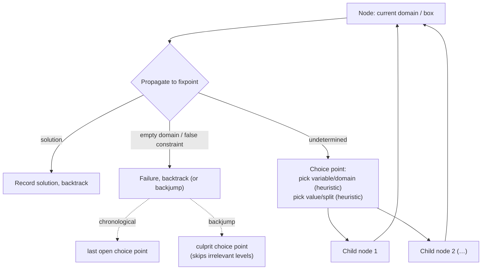

# Exploration and Search in Constraint Programming

[[book-guidelines|↩ Back to guidelines]]

## Why propagation alone isn't enough

Propagation (Hull-consistency, GAC, HC4-Revise — whatever consistency notion you're maintaining) is a *reduction* operation: it takes a domain and shrinks it by removing values that can be proven, right now, not to belong to any solution. But proving a value inconsistent is a very different task from proving a value *is* part of a solution. Propagation can chew a domain down to almost nothing and still leave you with, say, a box containing $10^6$ candidate points, none of which have been individually ruled in or out. At that point you've squeezed all the free information out of the constraints — further propagation converges to a fixpoint and stops moving. If you want an actual answer, you have to *guess*.

This is the second half of every CP solving loop, and it's what the book calls **exploration**: making a hypothesis about part of the problem, checking whether propagation under that hypothesis still leaves something consistent, and — critically — being able to take the hypothesis back and try another one when it doesn't pan out. The book states this plainly:

> "Generally, the propagation is not sufficient to find the solutions. During the second step of the resolution process, assumptions about the variables values are made." (§2.2.3)

For integer variables the hypothesis is concrete: assign a variable a value. For real variables you can't enumerate values (there are uncountably many in any nonempty interval), so the hypothesis is coarser: split the domain into two smaller sub-boxes and commit to exploring one of them first. Either way, you've just created a **choice point**.

What breaks without this mechanism is completeness: a CP solver that only propagates and never branches can get stuck reporting "maybe" forever on a domain that's actually solvable, because propagation alone cannot distinguish "no solution exists" from "I haven't looked hard enough." Branching is what turns "maybe" into a sequence of exhaustively covered "yes" or "no" sub-cases.

## Choice points and the search tree

A choice point is a node in resolution where the solver commits to a hypothesis it may later have to undo. Chaining choice points together produces a **search tree**: each node is a choice point, and each outgoing arc is either a variable instantiation (discrete case) or a domain split (continuous case).

The book's running example (Example 2.2.8) is a Boolean CSP: variables $v_1, v_2, v_3$ with $D_1 = D_2 = D_3 = \{0,1\}$ and the single constraint $v_1 \land \lnot v_2 \land v_3$.

```
                                   D
                        v1 = 0            v1 = 1
                            1              2
                                 v2 = 0            v2 = 1
                                    3               4
                        v3 = 0            v3 = 1
                            5              6
```

Resolution starts at the root $D = D_1 \times D_2 \times D_3$. First hypothesis: $v_1 = 0$ (node 1). The constraint immediately evaluates to false — this branch is dead. The solver backs up to the root and tries the other value, $v_1 = 1$ (node 2), and continues descending. Every leaf is labeled either a failure (red cross, a constraint is violated or a domain went empty) or a solution (green tick). The search tree is *exhaustive*: as long as the branching at each node covers every remaining possibility (here, $\{v_i = 0\} \cup \{v_i = 1\}$ is all of $D_i$), no solution can be lost by branching — only found faster or slower.

This is the general resolution scheme (§2.2.4): the solver alternates between a **reduction phase** (propagate to fixpoint) and a **choice phase** (branch), at every node, until one of three outcomes occurs:
1. a solution is found — record it;
2. no solution is possible here — some domain is empty or some constraint is provably false;
3. neither — the node is undetermined, so branch again.

In cases 1 and 2 the node is *closed*; the solver must return to an earlier open choice point and try the alternative it hadn't yet explored. That return step is what the next section formalizes.

### Grounding: the search tree as a recursive procedure

The tree in the diagram above is not a data structure the book's solver builds up front and then walks — it's implicit in the call stack of a recursive (or explicitly stack-based) procedure. That's the cleanest way to see it in code.

**Rust** — the natural way to express "propagate, then branch, then recurse, and prune on failure" is a recursive function returning whether a solution was found, mutating a shared store of solutions:

```rust
#[derive(Clone)]
struct Domains(Vec<Vec<i32>>); // one candidate-value list per variable

enum Status { Solution, Failure, Undetermined }

fn propagate(d: &mut Domains, constraints: &[Constraint]) -> Status {
    // repeatedly remove inconsistent values until fixpoint (GAC/HC-Revise, etc.)
    // returns Solution if every domain is a singleton and all constraints hold,
    // Failure if some domain went empty or a constraint is violated,
    // Undetermined otherwise.
    todo!()
}

fn choose_variable(d: &Domains) -> usize {
    // exploration-strategy hook — see the heuristics section below
    (0..d.0.len()).min_by_key(|&i| d.0[i].len()).unwrap()
}

fn explore(mut d: Domains, constraints: &[Constraint], sols: &mut Vec<Domains>) {
    match propagate(&mut d, constraints) {
        Status::Solution => { sols.push(d); }         // record and backtrack
        Status::Failure => { /* dead branch: backtrack */ }
        Status::Undetermined => {
            let i = choose_variable(&d);
            for value in d.0[i].clone() {              // one branch per remaining value
                let mut child = d.clone();
                child.0[i] = vec![value];               // this is the choice point
                explore(child, constraints, sols);       // recurse into the branch
            }
        }
    }
}
```

Every recursive call is a node of the search tree; returning from it *is* backtracking. The `for value in ...` loop is exactly Algorithm 2.1's `width[j]` counter walking through the domain of the chosen variable — the book's iterative version threads that state through explicit arrays (`op[]`, `width[]`) instead of the call stack, because it's written for a language without first-class recursion in mind, but the tree it walks is identical.

**Python**, for a quick illustrative sketch of the same shape without Rust's ownership ceremony:

```python
def explore(domains, constraints, sols):
    status, domains = propagate(domains, constraints)
    if status == "solution":
        sols.append(domains)
        return
    if status == "failure":
        return
    i = min(range(len(domains)), key=lambda k: len(domains[k]))
    for value in list(domains[i]):
        child = domains.copy()
        child[i] = [value]
        explore(child, constraints, sols)
```

**Lean**, where the search tree is worth making an actual *type* rather than an implicit control-flow shape — this is the same skeleton you'll reach for when you build proof search or tactic backtracking, which is structurally the same problem (try a rule, recurse into subgoals, backtrack on failure):

```lean
inductive SearchTree (α : Type) where
  | leaf   : α → SearchTree α        -- a solution
  | fail   : SearchTree α             -- a closed, unsuccessful branch
  | branch : List (SearchTree α) → SearchTree α  -- a choice point, one child per hypothesis

def explore (step : Domains → Except Domains (List Domains))
    : Domains → SearchTree Domains
  | d =>
    match step d with
    | .error sol   => .leaf sol          -- propagate reached a solution
    | .ok []       => .fail              -- propagate emptied a domain
    | .ok children => .branch (children.map (explore step))
```

Making the tree a first-class inductive value (rather than folding it into control flow) is exactly what lets you later prove things about it — e.g. that every leaf corresponds to a point in the original domain, which is the shape of the completeness argument the book invokes informally in §2.2.4 ("the resolution stops when ... the search space has been fully explored").

## Backtracking and backjumping

When a node closes (solution or failure), the solver must resume at some *earlier* choice point that still has unexplored alternatives. The book distinguishes two disciplines for choosing which one:

- **Backtracking**: always return to the *last* choice point made (the most recent branch on the current path) and try its next untried alternative. This is what Algorithm 2.1's inner `while` loop does explicitly:

  ```
  while j ≥ 0 and width[j] ≥ |D_op[j]| do
      width[j] ← 0
      j--
  end while
  ```

  It walks back up the depth counter `j` one level at a time, resetting each fully-exhausted level's width counter, until it finds a level with an untried value left (or falls off the tree, `j < 0`, meaning search is complete).

- **Backjumping** [DEC 90]: instead of always retreating exactly one level, jump directly to "the most likely point of choice responsible for the failure" — skipping over choice points that had nothing to do with why this branch failed. The book notes several techniques for identifying that point, based on dependency analysis between variables (which variables actually co-occur in the constraint that failed) or on learning accumulated during search.

Backjumping strictly dominates plain backtracking in the worst case for exactly the reason first-fail (below) matters: a large subtree can be dead for a reason that was already fixed several levels up. Concretely — suppose $v_1$'s current value makes some constraint over $\{v_1, v_7\}$ unsatisfiable, but between choosing $v_1$ and discovering the conflict the solver has also branched on $v_2, \dots, v_6$, none of which appear in that constraint at all. Plain chronological backtracking will dutifully retry every combination of $v_2 \dots v_6$ before it ever reconsiders $v_1$ — wasted work, because none of those choices could ever have fixed the failure. Backjumping uses the dependency structure of the failing constraint to skip straight back to $v_1$, pruning all of that dead exploration in one step. What backjumping costs you is bookkeeping: you need to track *why* each failure happened (which constraint, which variables) to know how far back is justified — chronological backtracking needs none of that.

```rust
// Chronological backtracking is implicit in plain recursion — returning from
// `explore` IS backtracking to the caller's choice point.
// Backjumping requires carrying failure provenance back up explicitly:
enum ExploreResult {
    Solution,
    Failed { culprit_vars: HashSet<usize> }, // which variables the failing constraint touched
}

fn explore_bj(d: Domains, cs: &[Constraint], depth_vars: &[usize]) -> ExploreResult {
    match propagate(&mut d.clone(), cs) {
        Status::Failure => {
            let culprits = constraints_violated(&d, cs)
                .iter().flat_map(|c| c.vars()).collect();
            return ExploreResult::Failed { culprit_vars: culprits };
        }
        // ... branch, and on a child's Failed result, only keep exploring
        // sibling values at THIS level if this level's variable is in culprit_vars;
        // otherwise propagate the Failed result straight up past this level too.
        _ => todo!()
    }
}
```

## Variable choice heuristics

Once you know a node is undetermined, two decisions remain: *which* variable to branch on, and *which* value (or sub-domain) to try first. Both choices dramatically affect how much of the tree gets cut on failure, without changing correctness — this is the sense in which heuristics are a performance concern layered on top of a fixed, sound algorithm.

**First-fail** (Haralick & Elliott, 1979 [HAR 79]) is, per the book, "maybe" the best known: choose the variable with the *smallest* current domain. The book quotes the heuristic's own slogan:

> "To succeed, try first where you are most likely to fail." — Haralick & Elliott

The reasoning is a direct consequence of the search-tree shape: branching on a variable with $k$ remaining values fans out into $k$ children. If that variable is going to cause a failure somewhere in the subtree anyway, better to pay the fan-out cost with a *small* $k$ than a large one — you reach the failure (and prune the corresponding subtree) faster, cutting more dead search per unit of work. The book's Figures 2.6–2.7 make this concrete: two search trees of equal total area, one branching on large domains first and one using first-fail; whenever a failure occurs, the subtree cut by first-fail is larger, because the branching factor at the point of failure was smaller.

This generalizes past "just look at domain size":

- **dom+deg** [BRÉ 79]: choose the variable maximizing $\mathrm{dom} + \mathrm{deg}$ — combining small remaining domain with high constraint-degree (how many constraints mention the variable). A variable in many constraints is more likely to be the one whose instantiation triggers a cascade of propagation, so it's worth prioritizing even if its domain isn't the very smallest.
- **dom/deg** [BES 96]: same intuition, expressed as a ratio $\mathrm{dom}/\mathrm{deg}$ to instantiate — the variable minimizing this ratio is preferred (small domain *relative to* how constrained it is).
- **dom/wdeg** [BOU 04]: replaces the static constraint-degree with a *learned, weighted* degree. Every constraint starts with weight $w = 1$; each time a constraint is the actual cause of a failure during search, its weight is incremented. The variable chosen is the one minimizing $\mathrm{dom}/\mathrm{wdeg}$, where $\mathrm{wdeg}$ sums the weights of the constraints touching that variable. The heuristic is adaptive: it learns, over the course of solving one instance, which constraints are actually hard to satisfy on *this* problem, and biases future branching toward variables entangled in those constraints — instantiate them early, so if they're going to cause a failure, that failure (and the resulting prune) happens as high in the tree as possible.

All three later heuristics are refinements of the same underlying goal as first-fail: maximize the size of the subtree you get to discard per unit of branching work, using progressively richer information (domain size alone → domain size and static structure → domain size and *learned, problem-specific* structure).

### Value choice heuristics

Once a variable is chosen, the order in which its candidate values are tried also matters — for *satisfaction* problems it changes how fast you hit a solution (rather than how much you prune on failure, since eventually every value gets tried if none up to that point works and you need all solutions). The book lists several:

- maximize the number of solutions the choice is estimated to leave possible [DEC 87, KAS 04];
- **promise** [GIN 90]: maximize the *product* of remaining domain sizes across all variables after the assignment;
- **min-conflicts** [FRO 95]: maximize the *sum* of remaining domain sizes.

These differ in how they aggregate "how much search space survives this value choice" — product vs. sum — but share the goal of picking the value that leaves the most room for the rest of the assignment to succeed, i.e. gambling on the branch statistically likeliest to reach a solution first.

## Domain-splitting heuristics for continuous variables

Real-valued variables can't be branched on by value enumeration — there's no next value. Instead, a domain is generally cut into two smaller sub-domains, typically in half. The book lists three strategies for *which* dimension to cut, echoing the variable-choice question above but now about geometry instead of cardinality:

- **largest-first** [RAT 94]: split the widest remaining domain. This shrinks the largest domain fastest, directly attacking whichever variable is contributing the most volume to the current box.
- **round-robin**: cycle through the domains in a fixed order, one after another, guaranteeing every variable eventually gets split rather than always deferring to whichever is currently widest.
- **Max-smear** [HAN 92, KEA 96]: split the domain that maximizes the *smear* of the constraints' Jacobian matrix — the matrix of partial derivatives of each constraint with respect to each variable. Concretely, this picks the variable with the steepest slope in the constraints: the one whose small change in value produces the largest change in the constraint's output over the current box, and hence contributes most to the box's current over-approximation error. Splitting it shrinks the sub-boxes' inconsistent region fastest, because it targets the variable that propagation is currently least able to pin down precisely.

Largest-first is purely geometric (only looks at domain widths), while Max-smear is *constraint-aware* in the same spirit as dom/wdeg is variable-choice-aware: it uses information about how the constraints actually behave, not just the raw shape of the current domain.

### Grounding: domain splitting in code

```rust
struct Box(Vec<(f64, f64)>); // one (lo, hi) interval per variable

fn largest_first_split(b: &Box) -> usize {
    (0..b.0.len())
        .max_by(|&i, &j| {
            let wi = b.0[i].1 - b.0[i].0;
            let wj = b.0[j].1 - b.0[j].0;
            wi.partial_cmp(&wj).unwrap()
        })
        .unwrap()
}

fn split(b: &Box, dim: usize) -> (Box, Box) {
    let (lo, hi) = b.0[dim];
    let mid = lo + (hi - lo) / 2.0;
    let mut left = Box(b.0.clone());  left.0[dim]  = (lo, mid);
    let mut right = Box(b.0.clone()); right.0[dim] = (mid, hi);
    (left, right)
}
```

Max-smear needs the Jacobian, so it's necessarily constraint-set-specific — for a constraint $c$ differentiable in variable $v_i$ over box $b$, the smear term is (informally) $\left|\frac{\partial c}{\partial v_i}\right| \cdot \mathrm{width}(b_i)$, and the heuristic splits the $v_i$ maximizing the largest such term across all constraints.

## Discrete versus continuous resolution schemes

The book is explicit that these aren't two configurations of one algorithm — the whole resolution scheme differs by variable type, and in practice solvers specialize:

| | Discrete solvers | Continuous solvers |
|---|---|---|
| Branch = | instantiate a variable to a value | split a domain into two boxes |
| Consistency used | generalized arc-consistency (GAC) | hull-consistency (HC) |
| Termination | all values enumerated / all solutions listed | boxes reach a target accuracy or contain only solutions |
| Example solvers (book, §2.2.6) | GeCode, GnuProlog, Jacop, Comet, Eclipse, Minion | Declic, Numerica, RealPaver, Ibex |
| Both | Prolog IV, Choco 3.0 | |

This is also visible directly in Algorithm 2.1 versus Algorithm 2.2 above: the discrete algorithm maintains explicit depth/width counters and a stack-like traversal because it is *enumerating* a discrete branching factor per level; the continuous algorithm instead maintains a `toExplore` queue of boxes and always produces exactly two children per split — the tree shape is binary and driven by geometric bisection rather than domain enumeration. Both algorithms share the same alternation of propagate-then-branch and the same two termination conditions (all solutions found, or the search space is provably exhausted), and both admit a variant that stops at the first solution rather than enumerating all of them — the difference is entirely in what "branch" means for the variable type in play.

## Solving mixed discrete-continuous problems

A problem with both integer and real variables doesn't fit either scheme cleanly, so historically CP has patched around the mismatch rather than solving it natively — this gap is exactly what motivates the rest of the book (unifying representations via abstract domains). The book lists the ad hoc workarounds available with a classical (non-unified) solver:

1. **Discretize the reals, use a discrete solver.** A real variable with a chosen step size gets replaced by a finite list of candidate values (Example 2.2.9: $x \in [0, 0.5]$ with step $0.1$ becomes $\{0, 0.1, 0.2, 0.3, 0.4, 0.5\}$). This is used in Choco 2.0. The tradeoff is direct: a coarse step keeps the domain small but risks *losing solutions* that fall between grid points (the solver becomes sound — a returned assignment really is a solution — but no longer *complete*, i.e. it may miss solutions); a fine step avoids losing solutions but blows up the combinatorics, defeating the purpose of discretizing in the first place.

2. **Add integrity constraints, use a continuous solver.** New constraints pin certain variables to be integers, and during propagation their domain bounds are rounded to the nearest integer in the appropriate direction. Used in RealPaver. This requires bound-consistency for the integer-constrained variables specifically and is incompatible with using generalized arc-consistency on them.

3. **Add discrete or mixed global constraints** [BER 09, CHA 09b] to a continuous solver, letting each variable be handled by machinery suited to its actual type within the same model. This is the most faithful of the three but is inherently ad hoc: it demands bespoke global constraints and a bespoke consistency notion be engineered for each new problem shape, rather than offering one general-purpose mechanism.

None of the three gives you a uniform treatment: each is a workaround bolted onto a solver that was fundamentally designed for one variable type. That's precisely the gap the book's abstract-domain program (Chapters 3, 4–5, and 6) is aimed at closing — not by inventing a fourth patch, but by making the domain representation itself a parameter of a single generic solving algorithm, so that "discrete" and "continuous" (and eventually "mixed" and "octagonal") all fall out as instances of one scheme rather than separate special cases.

## Synthesis: exploration as the other half of the CP loop



Exploration is the mechanism that turns "propagation has stalled" into forward progress: it converts an under-determined domain into an exhaustive, sound partition of hypotheses, each of which re-enters the propagation loop. Everything covered here — choice points, backtracking/backjumping, and the whole zoo of variable/value/split heuristics — is the concrete, classical baseline that the rest of the book systematically generalizes:

- **Chapter 5** specializes this exact scheme to the octagon domain: Oct-Split and its siblings (LargestFirst, LargestCanFirst, LargestOctFirst) are domain-splitting heuristics in exactly the sense of largest-first/round-robin/Max-smear here, just adapted to a representation with rotated bases instead of axis-aligned boxes.
- **Chapter 6**'s abstract solver (AbSolute) reifies the choice-point step itself as a first-class operator — the *choice operator* $\pi$ — and the branching step as a *split operator*, both defined abstractly enough to work uniformly over intervals, octagons, or polyhedra. What's a hand-written `for value in domain` loop or box-bisection here becomes a domain-parametric operator there; this article is the concrete instance that generalization is built to subsume.

**[[Abstract-Domains-in-Abstract-Interpretation#Where this leads|Where this leads]] (learning-goals note):** this is the direct ancestor of the CSP kernel described in your compiler project — "searching for counterfacts that could break the type invariants" is precisely this exploration loop, run over refinement-type domains instead of Boolean or interval CSPs: propagate (constraint/type inference), branch on an under-determined choice (a metavariable's possible instantiations, or a splittable numeric domain), backtrack or backjump on failure. The variable/value heuristics here (first-fail, dom/wdeg) map directly onto "which metavariable or which refinement constraint to resolve first" in a bidirectional elaborator's constraint-solving phase, and backjumping's use of failure provenance (which constraint caused the conflict) is the same shape of information a CEGAR loop or a proof-search procedure needs to decide which prior choice to revisit — the search tree in this article and the "try a rule, recurse into subgoals, backtrack" shape of tactic-based proof search in Lean are, structurally, the same object.
