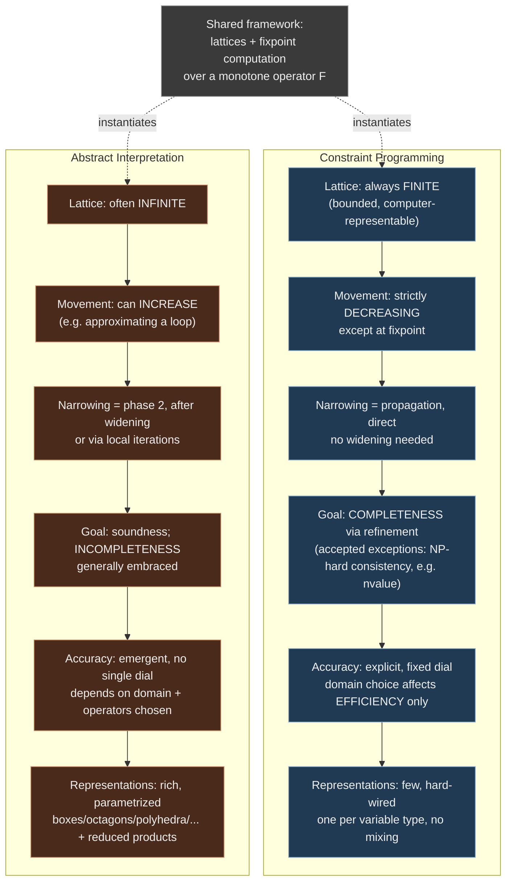

# Links Between Abstract Interpretation and Constraint Programming

## Why this section exists

By the time the book reaches §2.3, it has already given you two separate technical vocabularies: Chapter 2.1 built up Abstract Interpretation (AI) — Galois connections, transfer functions, widening/narrowing, fixpoints over usually-infinite lattices — and earlier material built up Constraint Satisfaction Problems (CSP) and Constraint Programming (CP) — domains, consistency, propagation, search over finite representable state spaces. Read separately, these look like two different fields that happen to share some words ("domain," "propagation," "fixpoint"). §2.3 is the book stopping to say, explicitly: no, they are the same mathematical animal wearing two different costumes, and the differences that remain are not decoration — they are principled design choices with real consequences for what each technique is *for*.

This is not a throwaway transitional section. If you're building a compiler that houses both a CP kernel (for finding counterexamples) and AI-based invariant generation (for proving their absence), as the standing project behind this vault does, this is the chapter where the book tells you, in its own words, exactly why that architecture makes sense — and exactly where the seams are. Read it that way: not as a literature-review aside, but as the book's own justification for a dual-verifier design.

## The shared skeleton: lattices and fixpoints

Both fields compute the same kind of object: an over-approximation of a set that is too expensive or too large to compute exactly.

- In CP, that set is the *solution set* of a constraint system — the tuples of variable assignments satisfying every constraint.
- In AI, that set is the *reachable states* (or some property of them) of a program — what actually happens when you run it.

Both attack this with the same two-part machinery:

1. A **lattice** ordered by "how much information does this abstract value carry" — more concrete/precise elements below, more abstract/coarser elements above (or vice versa, depending on convention; the book uses "narrower is smaller").
2. A **fixpoint computation**: iterate an operator (constraint propagation in CP; the abstract transfer function in AI) until the abstract value stops changing, or until you decide to stop early and accept an over-approximation.

Concretely, both give you a monotone operator $F$ on a lattice $(L, \sqsubseteq)$ and iterate $x_{n+1} = F(x_n)$ from some starting point, hoping to land on or above the least fixpoint $\mathrm{lfp}(F)$. That's it — that is the shared framework. Everything else in this section is about what each field does *differently* with that same skeleton, and why.

### Making the shared skeleton concrete: one iteration loop, two interpretations

The cleanest way to see this isn't more prose — it's the same generic fixpoint driver, instantiated twice: once as a toy CP propagator over interval domains, once as a toy AI dataflow analysis. The *loop structure is identical*; only what `F` computes differs.

```rust
// The shared skeleton: iterate a monotone operator to (an over-approximation of) lfp(F).
// Works for both a CP propagation loop and an AI dataflow fixpoint.
trait Lattice: PartialEq + Clone {
    fn join(&self, other: &Self) -> Self;      // upper bound (⊔)
    fn is_bottom(&self) -> bool;
}

fn fixpoint_iterate<L: Lattice>(
    start: L,
    step: impl Fn(&L) -> L,       // the monotone operator F
    max_iters: usize,             // CP: irrelevant if truly complete; AI: forces widening after this
) -> L {
    let mut current = start;
    for _ in 0..max_iters {
        let next = step(&current);
        if next == current {
            return current; // reached a fixpoint exactly
        }
        current = next;
    }
    current // gave up early — an accepted over-approximation, not the true lfp
}
```

Now the two instantiations:

```rust
// --- CP instantiation: interval-domain propagation for x = y + 1, x in [0,10], y in [0,10] ---
#[derive(Clone, PartialEq, Debug)]
struct IntervalDomains { x: (i64, i64), y: (i64, i64) }

impl Lattice for IntervalDomains {
    fn join(&self, other: &Self) -> Self {
        IntervalDomains {
            x: (self.x.0.min(other.x.0), self.x.1.max(other.x.1)),
            y: (self.y.0.min(other.y.0), self.y.1.max(other.y.1)),
        }
    }
    fn is_bottom(&self) -> bool { self.x.0 > self.x.1 || self.y.0 > self.y.1 }
}

fn propagate_step(d: &IntervalDomains) -> IntervalDomains {
    // x = y + 1  =>  x in [y.lo+1, y.hi+1], y in [x.lo-1, x.hi-1]
    let x_lo = d.x.0.max(d.y.0 + 1);
    let x_hi = d.x.1.min(d.y.1 + 1);
    let y_lo = d.y.0.max(d.x.0 - 1);
    let y_hi = d.y.1.min(d.x.1 - 1);
    IntervalDomains { x: (x_lo, x_hi), y: (y_lo, y_hi) }
}
// Every call to propagate_step only ever SHRINKS the domain (x_lo can only grow, x_hi
// can only shrink). This is CP's "strictly decreasing, except at the fixpoint" character.

// --- AI instantiation: dataflow "possible values reaching this program point" for a loop ---
#[derive(Clone, PartialEq, Debug)]
struct IntervalAbstractState { counter: (i64, i64) }  // an interval abstracting reachable ints

impl Lattice for IntervalAbstractState {
    fn join(&self, other: &Self) -> Self {
        IntervalAbstractState {
            counter: (self.counter.0.min(other.counter.0), self.counter.1.max(other.counter.1)),
        }
    }
    fn is_bottom(&self) -> bool { self.counter.0 > self.counter.1 }
}

fn dataflow_step(s: &IntervalAbstractState) -> IntervalAbstractState {
    // models: while (true) { counter = counter + 1 }
    // naive join of "before the loop" with "after one more iteration" GROWS the interval.
    s.join(&IntervalAbstractState { counter: (s.counter.0, s.counter.1 + 1) })
}
// dataflow_step is monotonically INCREASING and never converges on its own for an
// unbounded loop — this is exactly why AI needs a widening operator to force termination,
// something CP's shrinking propagation never needs.
```

The point of writing it out this way: the *driver* (`fixpoint_iterate`) doesn't know or care whether it's shrinking a CP domain or growing an AI abstract state. That's the "same theoretical framework" claim made literal instead of asserted. The direction of movement — and what you do when it doesn't naturally stop — is where the two fields diverge, covered next.

In Lean, the shared skeleton is even more naked, because Lean's own type of monotone-function-plus-fixpoint is exactly this lattice-theoretic object, not an approximation of it:

```lean
-- A monotone operator on a complete lattice, and (informally) its least fixpoint.
-- This is the same object Tarski's fixpoint theorem is about, and the same object
-- both CP propagation and AI's transfer functions instantiate.
variable {L : Type*} [CompleteLattice L]

def Monotone' (F : L → L) : Prop := ∀ a b, a ≤ b → F a ≤ F b

-- Tarski: a monotone F on a complete lattice has a least fixpoint, characterized as
-- the infimum of everything F maps below itself.
-- (mathlib: `OrderHom.lfp`, `OrderHom.lfp_le`, `OrderHom.map_lfp` give exactly this.)
example (F : L →o L) : F (OrderHom.lfp F) = OrderHom.lfp F :=
  OrderHom.map_lfp F
```

If your compiler's trusted kernel ever needs to *prove* (not just compute) that a propagation loop or an analysis pass actually reaches a fixpoint that is sound with respect to the concrete semantics, this is the theorem you're leaning on — `OrderHom.lfp` and `map_lfp` are not toy analogies, they are the formal object the book is gesturing at informally.

**What breaks without this shared framework.** If you didn't recognize CP propagation and AI dataflow analysis as instances of the same fixpoint theory, you'd be tempted to design two unrelated engines with duplicated (and probably inconsistently-reasoned-about) termination and soundness arguments. Concretely, for the reader's compiler: if the CSP kernel and the AI-based invariant generator are built on genuinely different mathematical foundations, you cannot cleanly compose them — you'd have no principled way to say "domain propagation in the CSP kernel narrows the same abstract state that the AI pass just widened," because you'd have no shared notion of what a "state" or "narrows" even means across the two subsystems. Recognizing the shared lattice/fixpoint skeleton is what licenses treating the CSP kernel and the AI invariant generator as *two policies over one framework* rather than two unrelated black boxes glued together at the edges.

## Consistency as narrowing

Here's the book's central identification, stated plainly: **consistency and propagation in CP are a form of narrowing on abstract domains.** Both narrowing (in AI) and propagation (in CP) *reduce* an abstract domain while staying above the true fixpoint — i.e., they never throw away a solution, they only discard elements you can prove aren't part of it.

The book is careful about where narrowing sits in each field's workflow, and this is a distinction worth holding onto precisely, because it's easy to conflate them if you only remember "narrowing shrinks things":

- **In AI**, narrowing is a *second phase*. You first widen (deliberately jump to a coarser, safely-above-the-fixpoint approximation, to force termination on what might be an infinite lattice), and only then narrow back down toward the true fixpoint, or you narrow during "local iterations" — a technique for regaining precision within a single abstract-interpretation step. Narrowing exists as a countermeasure to a problem AI itself creates (widening's imprecision).
- **In CP**, there is no widening step to counteract — domains only ever shrink. Propagation *is* the narrowing, full stop, applied directly and monotonically from the initial (already finite, already bounded) domain toward the fixpoint.

And in both cases — this is the point the book flags with real emphasis — **it is allowed not to reach the fixpoint.** The worked example the book gives is the global constraint `nvalue` (constraining the number of distinct values taken by a set of variables): computing full consistency for `nvalue` is NP-hard [BES 04], so real CP solvers deliberately settle for an over-approximation of the consistent domain even though the underlying problem is discrete and, in principle, exactly characterizable. This matters because it undercuts a naive intuition that "CP is exact, AI is approximate" — CP tolerates incompleteness too, for exactly the reason AI usually does: tractability.

```rust
// Two narrowing policies over the same trait — same operation, different discipline.
trait AbstractDomain: Clone + PartialEq {
    fn meet(&self, other: &Self) -> Self;   // intersect information (narrows)
    fn is_bottom(&self) -> bool;
}

// CP-style: propagate to a fixpoint, or bail out with a sound over-approximation
// when doing so is provably intractable (nvalue-style).
fn cp_propagate<D: AbstractDomain>(
    mut d: D,
    step: impl Fn(&D) -> D,
    tractable_fixpoint: bool,
) -> D {
    if !tractable_fixpoint {
        return step(&d); // one safe narrowing pass; NOT full consistency, and that's accepted
    }
    loop {
        let next = step(&d);
        if next == d { return d; }
        d = next;
    }
}

// AI-style: widen first (to force termination on a possibly-infinite lattice),
// then narrow back for precision.
fn ai_widen_then_narrow<D: AbstractDomain>(
    d0: D,
    widen: impl Fn(&D, &D) -> D,
    step: impl Fn(&D) -> D,
    narrow_iters: usize,
) -> D {
    let mut d = d0;
    // widening phase (details elided — the point is this phase exists at all)
    loop {
        let next = widen(&d, &step(&d));
        if next == d { break; }
        d = next;
    }
    // narrowing phase: claw back precision, but only a bounded number of times
    for _ in 0..narrow_iters {
        let next = step(&d);
        if next == d { break; }
        d = next;
    }
    d
}
```

**What breaks without this distinction.** If you built a CP propagator that borrowed AI's two-phase widen-then-narrow discipline wholesale, you'd be solving a problem CP domains don't have (unbounded lattices) at the cost of a problem CP domains do have and must not compromise on: propagation must never *increase* a domain, only shrink it, because the whole soundness argument for "the answer we return is a superset of the true solution set" depends on monotone shrinkage from a bounded starting point. Conversely, if an AI pass tried to skip widening and just "propagate to a fixpoint" the way CP does, it would simply not terminate on the many real analyses whose natural lattice (e.g., all possible integer intervals) is infinite — this is precisely why the loop-counter example above needs a widening operator and the interval-propagation example doesn't.

**Connection to the standing project.** This is the mechanism underneath the CSP-kernel / AI-invariant-generation duality: the CSP kernel's domain propagation *is* a narrowing discipline (always shrinking, always sound, no widening needed because its lattices are finite by construction), while the AI pass generating candidate invariants needs the full widen/narrow cycle because it operates over potentially unbounded program state spaces. Both processes converge — one way or another — toward the same kind of object (a safe over-approximation of what's reachable/satisfiable), which is exactly why it's coherent to let the AI pass hand candidate invariants to the CSP kernel to falsify: they are both narrowing operators on the same kind of lattice, just running with different tolerances for termination guarantees.

## The completeness philosophy gap

This is the sharpest conceptual fork in the whole section, and the book states it in one sentence: **"Constraint Programming aims at completeness by improving solutions using refinement, while Abstract Interpretation generally embraces incompleteness."**

Unpack what "refinement" buys CP: since CP's lattices are finite (built from bounded initial domains over computer-representable integers or floats — never the abstractly-infinite lattices AI typically uses), a CP solver can, in principle, always keep refining — splitting domains, backtracking, trying the next choice point — until it reaches either a proven solution or a proven absence of one. Completeness is *reachable in the limit*, even if expensive. AI, working over lattices that are frequently infinite (think: the lattice of all possible sets of reachable integer values, or all possible relations between program variables), has no such luxury — there is no finite refinement procedure guaranteed to terminate with the exact answer, so AI's entire design philosophy accepts imprecision as the price of termination and tractability, and builds its correctness guarantee around *soundness* (never claim something is safe when it isn't) rather than *completeness* (never miss a proof that something is safe).

The book connects this to a second, related asymmetry: CP treats accuracy as an *explicit, configurable dial* for continuous domains — you choose your abstract domain's representation, but that choice changes solving *efficiency*, not correctness precision, which stays fixed and known. AI, by contrast, has no such dial: precision is an *emergent property* of which abstract domain, which transfer functions, and which widening/narrowing operators you happened to pick — there's no single knob, and improving precision generally means either restarting the analysis with refined domains [CLA 03], hand-modifying the analyzer [BER 10], or adding local iterations [GRA 92].

```lean
-- The precision/completeness distinction stated as two different correctness contracts.
-- Soundness ("never say safe when it's unsafe") is what BOTH fields guarantee.
-- Completeness ("never miss a real solution/proof") is what CP can promise via refinement
-- and AI generally cannot promise at all.

def Sound (concrete : α → Prop) (abstract_check : α → Bool) : Prop :=
  ∀ a, abstract_check a = false → ¬ concrete a
  -- "if the checker says false, it really is false" — never a false negative on unsafety

def Complete (concrete : α → Prop) (abstract_check : α → Bool) : Prop :=
  ∀ a, concrete a → abstract_check a = true
  -- "every real solution is found" — CP asymptotically aims for this via refinement;
  -- AI structurally gives it up in exchange for termination on infinite lattices
```

**What breaks without holding this gap precisely.** This is the connection to the trusted-computing-base concern the standing project cares about most directly. If the reader's compiler let AI-style incompleteness leak into the parts of the pipeline that are supposed to be *trusted* — say, the kernel that checks a submitted proof certificate — that kernel would silently start accepting unsound conclusions dressed up as "just an approximation," and the entire proof-certificate architecture collapses: a trusted kernel's whole job is to be complete-*and*-sound over the narrow language of certificates it checks, not to embrace AI's tolerance for "good enough." Conversely, if the CSP kernel searching for counterexamples insisted on AI-grade completeness guarantees everywhere (e.g., demanding full consistency on every global constraint, `nvalue` included), it would hit exactly the NP-hardness wall the book flags and simply not scale. The architecturally correct split — and the one the book is implicitly arguing for by laying out this gap — is: let AI-style incompleteness live in invariant *generation* (candidate invariants are proposals, allowed to be wrong or too coarse), and demand CP/kernel-style completeness (or at least decidable, checkable soundness) at the *trusted* boundary where a certificate is finally accepted or rejected. Which subsystem gets which discipline is not a style choice — it's forced by whether false negatives there are merely inefficient or actually unsound.

## Domain-representation richness

The book's third axis of comparison is about representational vocabulary, and here the asymmetry runs the *other* direction from the completeness gap: AI is generically parametrized by its choice of abstract domain — the analysis machinery (transfer functions, widening, narrowing) is written once, against an abstract-domain interface, and then instantiated with boxes, octagons, polyhedra, ellipsoids, zonotopes, or whatever else fits the precision/cost tradeoff you want, and — notably — a single analyzer can mix representations across different variables or combine domains via reduced products. CP, by contrast, has historically offered only a small, fixed menu: essentially one representation per variable type (Cartesian integer boxes for discrete variables, interval boxes for continuous ones), hard-wired into the solver rather than exposed as a swappable parameter. The book is explicit that, as of its writing, **there is no CP solver for which the domain representation is itself a parameter**, and correspondingly no solver natively mixing domain shapes the way AI's reduced products do.

This is, not coincidentally, exactly the gap the rest of the book (Chapters 3 onward, per the guidelines index — octagon-based CP solving, and eventually the unified abstract-domain solving algorithm) exists to close: import AI's parametrized-domain machinery into CP so a solver's domain representation becomes a genuine design choice rather than a hard-wired assumption.

**What breaks without this richness on the AI side, and without fixing it on the CP side.** An AI analyzer without swappable, combinable abstract domains couldn't scale to real programs — different variables and different program regions need different precision/cost tradeoffs (a loop counter might be fine as an interval; two variables in a tight numeric relationship need an octagon or polyhedron to avoid useless imprecision), and reduced products exist precisely to let an analyzer get "the best of both" cheaply. On the CP side, a solver stuck with only Cartesian boxes cannot efficiently express or propagate relational information between variables (e.g., "$x - y \le 5$" as a first-class domain fact rather than something rediscovered by search) — which is exactly the limitation that motivates bringing octagon-like relational abstract domains into a CP solver, the book's own next move.

**Connection to the standing project.** This is the "abstract lattices and domain propagation methods" thread named directly in the learning-goals file. A CSP kernel that wants to handle abstract data structures as complex domains (automata/DFA-shaped domains, as the project's goals describe) is, in this book's terms, asking CP to behave like AI: parametrize the solver over its domain representation instead of hard-wiring one. The book's whole later program — octagon-based CP, then the fully unified abstract solving algorithm — is a worked existence proof that this generalization is possible and tractable, which is directly relevant evidence for whether the reader's own CSP kernel design (propagation over automaton/grammar-shaped domains, not just integer/real boxes) is a reasonable ambition or a research-grade undertaking. Given this book's own trajectory, it's the latter — but a tractable one, with a documented path.

## Comparison structure at a glance



## The thin thread: satisfiability solving

Honestly, this is the weakest-supported subtopic in the source — worth saying plainly rather than dressing it up. The book gives it a single short paragraph (book.txt lines ~2212–2226), and it functions as a pointer to related work rather than a developed argument. Here's exactly what it says:

- Program verification via satisfiability solvers (SAT and SMT) has advanced significantly, with applications like the model checker CBMC [KRO 14].
- D'Silva et al. [D'S 12] have proposed expressing SAT algorithms *in the language of Abstract Interpretation itself* — using fixpoints and abstractions to describe what a SAT solver's unit-propagation-and-decision loop is actually doing. The book flags this as "a promising way to cross-pollinate" the two research areas — i.e., a third data point (alongside CP and AI themselves) that the lattice/fixpoint framework is genuinely general enough to describe solving algorithms that weren't designed with it in mind.
- The book then draws one real distinction and stops: CP and SAT/SMT solving are similar as processes, but the *models* differ. SAT/SMT solving is built natively around Boolean variables, with algorithms specialized to that representation; CP combines constraints over arbitrary variable types, trading some efficiency for that expressiveness.

That's the entire treatment. No worked example, no discussion of CDCL as a fixpoint computation, no mention of DPLL, no engagement with SMT theory combination (Nelson-Oppen or otherwise), nothing about CEGAR, and nothing about Horn clauses (CHCs) despite those being exactly the frame in which SAT/SMT and CP/AI most naturally meet for program verification.

This matters for the standing project specifically, because SAT, SMT, CHCs, and CEGAR are all named as explicit threads to keep surfacing across this vault's books. This chapter is where the source book gestures at that connection and then moves on — it is not where you'll find the actual mechanism. The D'Silva et al. reference is a legitimate lead worth chasing outside this book if you want the real content (their paper works out unit propagation, decision, and backtracking in SAT solvers as instances of abstract-interpretation-style fixpoint iteration over a lattice of partial Boolean assignments) — but don't expect this chapter, or this book more broadly, to develop CEGAR- or CHC-style reasoning; that material will have to come from elsewhere in the vault or from outside it. Flagging that gap here is more useful than inventing content this book doesn't contain to paper over it.

## Where this leads

This synthesis is the hinge the rest of the book turns on: Chapter 3 goes one direction — importing a specific AI abstract domain (the octagon) directly into a CP solver, built concretely on Ibex — and later chapters go the other direction, re-expressing CP's entire solving process (domains, consistency, search) in AI's own vocabulary, culminating in the unified E-consistency framework and the AbSolute prototype solver. Every distinction drawn here (finite vs. infinite lattices, decreasing vs. possibly-increasing approximations, refinement-to-completeness vs. accepted incompleteness, sparse vs. rich domain representations) reappears as a design decision the rest of the book has to make explicitly when it builds that unification — so treat this section as the checklist against which to read everything that follows.

---
[[book-guidelines|↩ Back to guidelines]]
