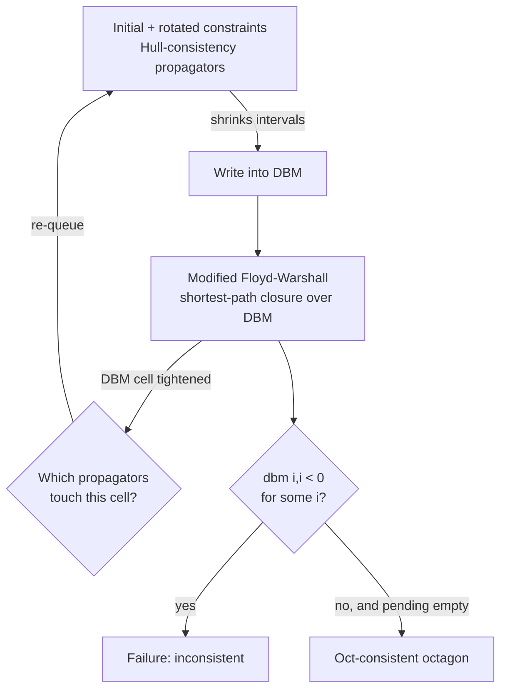

[[book-guidelines|↩ Back to guidelines]]

# Octagonal Constraint Solving

Chapter 4 gave you a static object: the octagon, a set of points satisfying constraints of the shape $\pm v_i \pm v_j \le c$, equipped with a lattice structure, a splitting operator $\oplus_o$, a precision function $\tau_o$, and a Galois connection to boxes. That's an abstract domain in the Chapter 3 sense — but an abstract domain by itself doesn't solve anything. You still need three things a plain box solver already has: a way to turn *your actual problem* into an object living in the domain, a consistency notion that tells you when you've extracted everything the constraints imply, and a propagation loop that reaches that consistency without blowing up. Chapter 5 supplies exactly those three things for octagons, then reports what happens when you actually run the result on benchmarks.

This matters beyond octagons specifically. It's the template for *any* relational abstract domain used as a solving engine rather than just an analysis engine — the same three gaps (encoding, consistency, propagation) reappear verbatim for polyhedra, zonotopes, or a custom domain you design for a refinement-type checker's counterexample search. Read this chapter as a worked instance of "how do I turn a lattice with a Galois connection into something that actually prunes a search tree."

## 1. From a CSP to an octagonal CSP

### 1.1 The problem: a box solver can't see correlations

A classical continuous solver stores each variable's domain as an independent interval $\hat D_i$ and propagates constraint-by-constraint, shrinking one axis at a time. If two variables are tightly correlated — say the true solution set lies along the diagonal $v_1 = v_2$ — a box can only ever bound $v_1$ and $v_2$ *separately*. It has no coordinate that directly represents "the difference $v_1 - v_2$ is small," so it wastes propagation cycles re-discovering that correlation from scratch on every axis-aligned cut, and its final over-approximation has slack in the diagonal direction no matter how much it splits. This is precisely the "staircase effect" the book's Figure 5.4 shows for interval solving near a diagonal solution boundary.

The octagon domain has axes for the correlations too — but only as a static algebraic object. To *use* an octagon as a solver you need to manufacture those extra axes as actual first-class variables of an enlarged problem, propagate constraints on them, and still recover an answer about the original variables. That's what Section 5.1 does.

### 1.2 Rotated variables and rotated constraints

Fix a pair of indices $i,j$. The $(i,j)$-rotated basis $B_\alpha^{i,j}$ (Chapter 4, Definition 4.2.3, with $\alpha = \pi/4$ throughout) replaces axes $i,j$ by two new axes obtained by rotating the plane $45°$:

$$v_i^{i,j} = \cos(\alpha)v_i - \sin(\alpha)v_j, \qquad v_j^{i,j} = \sin(\alpha)v_i + \cos(\alpha)v_j$$

These are genuinely new variables — the book calls them *rotated variables* — living alongside the original $v_i, v_j$, redundantly encoding the same information from a rotated viewpoint. Because they're redundant, any constraint that mentions $v_i$ or $v_j$ can be re-expressed in terms of $v_i^{i,j}, v_j^{i,j}$ by pure substitution:

> **Definition 5.1.1 (Rotated constraint).** Given a constraint $C$ on $(v_1,\dots,v_n)$, the $(i,j)$-rotated constraint $C^{i,j}$ is obtained by replacing every occurrence of $v_i$ by $\cos(\alpha)v_i^{i,j} - \sin(\alpha)v_j^{i,j}$ and every occurrence of $v_j$ by $\sin(\alpha)v_i^{i,j} + \cos(\alpha)v_j^{i,j}$.

**Worked example (the book's own).** Let $C \equiv 2v_1 + v_2 \le 3$. Substituting with $\alpha = \pi/4$ ($\sin = \cos = 1/\sqrt2$):

$$C^{1,2} \equiv 2\left(\tfrac{1}{\sqrt2}v_1^{1,2} - \tfrac{1}{\sqrt2}v_2^{1,2}\right) + \left(\tfrac{1}{\sqrt2}v_1^{1,2} + \tfrac{1}{\sqrt2}v_2^{1,2}\right) \le 3
\;\Longrightarrow\; 3v_1^{1,2} - v_2^{1,2} \le 3\sqrt2$$

Notice this is *still linear* in the new variables — a rotation of a half-plane is a half-plane. That's exactly why octagonal constraints stay tractable: rotation never leaves the class of constraints the domain can represent exactly.

**What breaks without this step.** If you tried to skip constructing $C^{i,j}$ and instead propagated $C$ directly against a box living in the rotated basis, the propagator would have no idea the rotated box's coordinates are supposed to be consistent with $C$ at all — the constraint and the domain would be speaking different coordinate systems. The rotated constraint is what lets the *same kind of propagator* (Hull-consistency on a box) operate in every basis.

### 1.3 Assembling the full octagonal CSP

Given a CSP with variables $(v_1,\dots,v_n)$, domains $(\hat D_1,\dots,\hat D_n)$ and constraints $(C_1,\dots,C_p)$, the **octagonal CSP** consists of:

- the original variables, constraints, and domains, unchanged;
- the rotated variables $v_i^{i,j}, v_j^{i,j}$ for every pair $i<j$ — renumbered $v_{n+1}, \dots, v_{n^2}$ in the book's flattened indexing (there are $n(n-1)/2$ rotated pairs, doubled, so on the order of $n^2$ total variables);
- the rotated constraints $C_k^{i,j}$ for every original constraint $C_k$ and every pair $(i,j)$ — up to $p\left(\frac{n(n-1)}{2}+1\right)$ constraints, counting the untouched original ones;
- a single **difference bound matrix** (DBM), the Chapter 4 representation, storing *all* the rotated domains uniformly. It's initialized to $\hat D_i$'s bounds on the cells $(2i-1,2i)$ and $(2i,2i-1)$, and $+\infty$ everywhere else — i.e. "no information yet" about any correlation.

The whole construction is only useful if solving the bigger, uglier problem gives you back exactly the answer to the original one. The book proves this:

> **Proposition 5.1.1.** The solution set of the original CSP equals the solution set of the octagonal CSP, restricted to $(v_1,\dots,v_n)$.

The proof is genuinely two separate directions, and the asymmetry is worth noticing:
- **Octagonal solution ⟹ solution** is immediate — if $s$ satisfies all the rotated constraints, in particular it satisfies the un-rotated $C_1,\dots,C_p$ (those are still present, untouched).
- **Solution ⟹ octagonal solution** requires *constructing* witnessing values $s_i^{i,j} = \cos(\alpha)s_i + \sin(\alpha)s_j$, $s_j^{i,j} = -\sin(\alpha)s_i + \cos(\alpha)s_j$ for the new variables, then checking they land inside a domain that hasn't been constrained yet (it's still $+\infty$) — which is trivially true because rotation is invertible and the DBM's initial state imposes no bound on off-diagonal cells.

This proof shape is one you'll see again and again if you build a compiler pass that introduces auxiliary variables (SSA temporaries, CPS continuation parameters, elaboration metavariables): a *conservative extension* argument — every model of the small theory extends to a model of the big one, and every model of the big one restricts back down. It's the same discipline needed to argue a metavariable-introducing elaboration step doesn't change what's provable.

```rust
/// A CSP constraint over the *original* variable indices 0..n.
/// Kept abstract here — in a real solver this would be an expression AST.
#[derive(Clone)]
struct Constraint {
    // e.g. an AST node like `2*v[0] + v[1] <= 3`
    expr: Expr,
}

/// Builds the octagonal CSP: original vars/constraints untouched, plus
/// one rotated variable pair and one rotated constraint set per (i,j).
struct OctagonalCsp {
    n: usize,                       // original variable count
    original: Vec<Constraint>,
    rotated: Vec<((usize, usize), Vec<Constraint>)>, // per (i,j): C_1^{i,j}..C_p^{i,j}
    dbm: Dbm,                       // 2n x 2n, see section 2.2 below
}

impl OctagonalCsp {
    fn build(n: usize, domains: &[Interval], constraints: &[Constraint]) -> Self {
        let mut rotated = Vec::new();
        for i in 0..n {
            for j in (i + 1)..n {
                let cs = constraints
                    .iter()
                    .map(|c| rotate_constraint(c, i, j)) // Definition 5.1.1 substitution
                    .collect();
                rotated.push(((i, j), cs));
            }
        }
        let dbm = Dbm::init_from_domains(n, domains); // +inf off-diagonal, per section 1.3
        OctagonalCsp { n, original: constraints.to_vec(), rotated, dbm }
    }
}
```

## 2. Oct-consistency and the combined propagation scheme

### 2.1 What "consistent" means for an octagon

For boxes, Hull-consistency picks the *smallest box* containing all solutions of a constraint. The octagon analogue is the obvious generalization, and the book proves it exists and is unique using the same lattice argument as Chapter 3's general $E$-consistency (octagons are closed under intersection and form a complete lattice — Chapter 4's Propositions 4.1's remark and 4.4.1):

> **Proposition 5.2.1.** For a constraint $C$ (or sequence $(C_1,\dots,C_p)$) with solution set $S_C$, there is a unique smallest octagon $O$ with $S_C \subseteq O$. $O$ is called **Oct-consistent** for $C$.

The genuinely useful fact is the one that lets you *compute* it without inventing a bespoke octagon-shaped propagator:

> **Proposition 5.2.2.** Let $C^{i,j}$ be the $(i,j)$-rotated constraint and $B$, $B_{i,j}$ the Hull-consistent boxes for $C$ and $C^{i,j}$ respectively. The Oct-consistent octagon for $C$ is $B \cap \bigcap_{i,j} B_{i,j}$.

In words: **Oct-consistency is just ordinary Hull-consistency, computed independently in every basis, and then intersected.** You never need a propagator that natively understands octagons — you reuse whatever Hull-consistency propagator you already have (HC4-Revise, interval arithmetic, whatever), run it once per basis, and let the intersection of boxes representation (Chapter 4, Proposition 4.2.1) do the work of gluing the results into one octagon. This is the same move Chapter 3 made abstractly — factor a hard consistency notion into "reuse an easy one, many times, plus a combination step" — now instantiated concretely.

### 2.2 Why intersecting isn't enough on its own: the DBM feedback loop

Running Hull-consistency once per basis and intersecting gives you *a* consistent-looking octagon, but the bases don't automatically inform each other. Tightening the canonical box changes what the rotated boxes *should* look like, and vice versa — that correlation only becomes visible through the difference bound matrix's shortest-path structure (the modified Floyd-Warshall algorithm from Chapter 4, Algorithm 4.1). So the real scheme has to interleave two propagation mechanisms:

1. **Propagator layer** — the Hull-consistency propagators $\rho_{C_1},\dots,\rho_{C_p},\rho_{C_1^{1,2}},\dots$ for the initial and rotated constraints, which read/write interval bounds.
2. **Closure layer** — the modified Floyd-Warshall pass over the DBM, which is the *optimal* way to propagate purely octagonal ($\pm v_i \pm v_j \le c$) constraints against each other (shortest paths in the constraint graph = tightest implied bounds).

```rust
/// Pseudocode transliteration of Algorithm 5.1: interleave Hull-consistency
/// propagation with the modified Floyd-Warshall closure of the DBM.
fn propagate(csp: &mut OctagonalCsp) -> Result<(), Failure> {
    let mut pending: HashSet<PropagatorId> = csp.all_propagator_ids(); // initial + rotated

    while !pending.is_empty() {
        // --- initial + rotated constraint propagation ---
        for id in pending.drain() {
            csp.apply_propagator(id)?; // shrinks interval bounds, writes back into dbm
        }

        // --- octagonal constraint propagation: modified Floyd-Warshall ---
        let n = csp.n;
        for k in 0..n {
            for i in 0..2 * n {
                for j in 0..2 * n {
                    let m = csp.dbm.relax_through(i, j, k); // the four-term min, Algorithm 5.1
                    if m < csp.dbm.get(i, j) {
                        csp.dbm.set(i, j, m);
                        pending.extend(csp.propagators_touching_basis(i, j));
                    }
                }
            }
            csp.dbm.tighten_transitive_pairs(); // the second nested i,j loop in Algorithm 5.1
        }

        if csp.dbm.has_negative_diagonal() {
            return Err(Failure); // dbm[i][i] < 0 ⟺ inconsistent
        }
        csp.dbm.zero_diagonal();
    }
    Ok(())
}
```

The two layers feed each other: a propagator shrinking a rotated interval updates DBM cells, which the Floyd-Warshall relaxation then propagates transitively to *other* bases via shortest paths, which in turn wakes up *those* bases' propagators, and so on until nothing changes. Because every propagator is monotone and idempotent-at-fixpoint (a lower closure operator, in Chapter 6's later vocabulary), the order of application doesn't affect the final fixpoint — only the number of iterations to reach it (Proposition 3.2.5, reused directly). Correctness (Proposition 5.2.3) then follows almost by definition: the loop only terminates once *no* propagator or Floyd-Warshall step can shrink anything, which is exactly the fixpoint characterization of Oct-consistency from 5.2.2.



**Complexity.** One Floyd-Warshall pass is $O(n^3)$; in the worst case every round re-queues all $p\left(\frac{n(n-1)}{2}+1\right)$ propagators, giving total complexity $O(n^3 + pn^2)$ for the combined scheme (Section 5.2.2). That extra $pn^2$ term over plain interval propagation is the price of relational precision — Section 5.4's experiments are about whether that price is worth paying.

## 3. Choosing what to split: variable heuristics

Consistency alone doesn't solve a continuous CSP — you still search, splitting a domain in two until every remaining box (or here, octagon) is either a solution up to precision $r$ or provably empty. In an octagonal CSP the *choice of what to split* is richer than in a box solver, because there are $n^2$ candidate variables (original **and** rotated) instead of just $n$, and cutting different variables cuts the geometric octagon along different lines. Let $V' = (v_1,\dots,v_n,v_{n+1},\dots,v_{n^2})$ be the flattened set of all variables (original, then all rotated ones).

| Heuristic | Candidate set | Rule |
|---|---|---|
| **LargestFirst (LF)** | all of $V'$ | $\arg\max_{i \in [1,n^2]} (\overline{D_i} - \underline{D_i})$ |
| **LargestCanFirst (LCF)** | canonical vars only, $[1,n]$ | $\arg\max_{i \in [1,n]} (\overline{D_i} - \underline{D_i})$ |
| **LargestOctFirst (LOF)** | rotated vars only, $[n+1,n^2]$ | $\arg\max_{i \in [n+1,n^2]} (\overline{D_i} - \underline{D_i})$ |
| **Oct-Split (OS)** | all bases, then worst var in the chosen basis | $\arg\max_{i,j} \min\left(\max_k (\overline{D_k^{i,j}} - \underline{D_k^{i,j}})\right)$, i.e. reuses the octagonal precision $\tau_o$ from Definition 4.3.2 |

LF, LCF, LOF are the naive "biggest domain wins" strategy applied to three different candidate pools. **Oct-Split is qualitatively different**: instead of asking "which single variable is worst," it first asks "which *basis* is tightest overall" (the one realizing $\tau_o$'s minimum), and only then picks the worst variable *within* that basis. It directly chases the same quantity that determines when the search is allowed to stop — the octagonal precision function — so cuts made by OS are guaranteed to make progress toward the actual termination criterion, not just toward *some* domain shrinking.

The book's own figure (5.3) makes the failure mode of the naive heuristics concrete: given an octagon that happens to be exactly the box in the rotated basis (tight there, loose in canonical coordinates), LF and LCF will cut the *loose* canonical-basis domain because it's numerically the largest — even though that cut barely constrains the octagon's actual shape, since the real information lives in the rotated basis. OS is the only one guaranteed to cut where the shape is actually informative.

**Experimental verdict (Table 5.4):** LF is consistently the worst; LOF often makes things *worse* than LCF (some rotated bases carry little real information, so restricting the choice there is actively counterproductive); LCF is solid because the canonical basis is upstream of every rotated basis (any tightening there propagates outward through Floyd-Warshall to everything); OS wins most often and is what the book uses for the rest of its experiments.

```rust
enum VarHeuristic { LargestFirst, LargestCanFirst, LargestOctFirst, OctSplit }

fn pick_variable(csp: &OctagonalCsp, heuristic: VarHeuristic) -> VarId {
    match heuristic {
        VarHeuristic::LargestFirst =>
            csp.all_vars().max_by(|v| csp.domain_width(*v)).unwrap(),
        VarHeuristic::LargestCanFirst =>
            csp.canonical_vars().max_by(|v| csp.domain_width(*v)).unwrap(),
        VarHeuristic::LargestOctFirst =>
            csp.rotated_vars().max_by(|v| csp.domain_width(*v)).unwrap(),
        VarHeuristic::OctSplit => {
            // pick the tightest basis (min over bases of the max width in that basis),
            // then the worst variable within it — this is exactly tau_o's definition.
            let (i, j) = csp.bases()
                .min_by_key(|(i, j)| csp.max_width_in_basis(*i, *j))
                .unwrap();
            csp.worst_var_in_basis(i, j)
        }
    }
}
```

## 4. Choosing which bases to generate: octagonalization heuristics

A full octagon requires generating all $n(n+1)/2$ bases — quadratic blowup that gets expensive fast. Chapter 4 introduced *partial octagons* (restricting bases to index subsets $J,K$) as the escape valve; Section 5.3.2 supplies four concrete strategies for choosing which bases actually earn their keep, all decided **once**, symbolically, at octagon-construction time (unlike an earlier approach in the literature that rebalances the basis set after every split — the book deliberately trades adaptivity for a cheap, one-shot decision).

- **ConstraintBased (CB).** Generate $B_\alpha^{i,j}$ only if $v_i$ and $v_j$ co-occur in some constraint. Cheap syntactic filter; in the worst case (a dense constraint graph) it degenerates to the full octagon.
- **Random (R).** Pick one basis uniformly at random. A deliberately weak baseline to calibrate the others against.
- **StrongestLink (SL).** Generate only the single basis $(i,j)$ whose variables co-occur in the *most* constraints. Worked example from the book: given $v_1+v_2+v_1v_2\le3$, $\cos(v_1)+v_3\le10$, $v_1\times v_3\ge1$ — the pair $(v_1,v_3)$ appears in two constraints, $(v_1,v_2)$ in only one, so $B_\alpha^{1,3}$ is generated.
- **Promising (P).** Favor bases where the constraints match a *promising scheme*: patterns $\pm v_i \pm v_j$ or $\pm v_i \times v_j$, which simplify unusually cleanly under $\pi/4$ rotation. For instance $v_1+v_2$ becomes exactly $2a\,v_1^{1,2}$ (a single term, $a=\cos(\pi/4)$) instead of a messy expansion, and $v_1\times v_2$ collapses to $a^2\big((v_1^{1,2})^2-(v_2^{1,2})^2\big)$ — no cross term at all. The motivation is that HC4-style propagation degrades sharply on constraints with multiple occurrences of the same variable, and rotation tends to *introduce* those occurrences (Section 5.1's substitution duplicates variables); a promising pattern is one where rotation happens not to make that worse.

**The counter-intuitive experimental result (Section 5.4.4):** the book's authors expected Promising to win, since it was designed exactly to control the multiple-occurrence problem that hurts HC4. Instead **StrongestLink was the best octagonalization heuristic across the benchmark**, and the authors' own diagnosis is instructive: what actually drives solving speed isn't how cleanly a single constraint simplifies algebraically, but *how many rotated constraints end up propagating information into a basis at all*. StrongestLink's basis, chosen for maximal constraint co-occurrence, tends to have more rotated constraints acting on it — more chances for the Floyd-Warshall/propagator feedback loop (Section 2.2) to actually tighten something — even if any one of those constraints is algebraically uglier post-rotation. Precision from *volume of propagating information* beat precision from *per-constraint algebraic niceness*. That's a genuinely useful lesson for designing any heuristic that ranks "which extra structure to materialize" in a solver: favor what maximizes propagation connectivity, not what looks cleanest symbolically.

```python
# Quick illustrative sketch (not load-bearing) of StrongestLink scoring —
# the actual solver implements this over a real constraint AST, not strings.
def strongest_link_basis(n, constraints):
    link_count = {(i, j): 0 for i in range(n) for j in range(i + 1, n)}
    for c in constraints:
        vars_in_c = c.variables()  # set of variable indices appearing in c
        for i in vars_in_c:
            for j in vars_in_c:
                if i < j:
                    link_count[(i, j)] += 1
    return max(link_count, key=link_count.get)
```

## 5. Experimental comparison: octagons versus intervals

The prototype was built on **Ibex** (a C++ interval-constraint library) using its HC4-Revise propagator, with the octagons stored as DBMs and rotated constraints pre-simplified via Mathematica's `Simplify` (necessary because HC4 is sensitive to the multiple occurrences that rotation introduces — otherwise propagation on rotated constraints would be very weak). Benchmarks come from the Coconut suite, with a fixed 3-hour timeout and precision $r=0.01$ (first experiment) or $r=0.001$ (the rest).

Three results stand out, and together they form the chapter's central paradox:

1. **First solution: octagons usually win.** Because octagons are strictly more precise (closer to the true solution boundary — no staircase effect), the search reaches *a* solution faster on most benchmarks (Table 5.1).
2. **All solutions: octagons can lose, sometimes badly.** On problems with many repeated variable occurrences in the original constraints (`brent-10`, `pramanik`, `trigo1`), those repetitions get *multiplied* by the rotation substitution, degrading HC4 propagation on the rotated constraints enough that enumerating every solution takes longer overall than plain intervals — despite each individual octagon being a better local approximation.
3. **Node counts tell the deeper story (Table 5.2–5.3).** The number of octagons created during search is usually smaller than the number of boxes an interval solver needs (more precision ⟹ fewer splits needed) — but each octagon costs more to compute (the $O(n^3+pn^2)$ propagation scheme vs. plain interval propagation). The paradox is a **time-per-node vs. number-of-nodes trade-off**: octagons buy fewer, better nodes at a higher price per node, and whether that trade pays off depends on how expensive rotation makes propagation for *that specific problem's* constraint shapes.

The book's own diagnosis generalizes past this one experiment: relational precision is not free, and its cost is driven by how badly your propagator degrades on the syntactic form the relational transformation produces (here, multiple occurrences from rotation) — a concern that will resurface identically for polyhedra, zonotopes, or any other domain whose "make the constraints relational" step introduces algebraic redundancy.

## Where this leads

Structurally, this chapter is the payoff of the whole "abstract domain for CP" apparatus built in Chapters 3–4: given a lattice, a Galois connection, a splitting operator, and a precision function, you get a full solver almost mechanically — construct the extended problem (5.1), define consistency via a lattice fixpoint argument (5.2.1), compute it by decomposing into Hull-consistency-per-basis plus a closure step (5.2.2), and drive the search with heuristics tuned to the domain's own precision function (5.3). Chapter 6 later performs exactly this move again, more abstractly, generalizing "splitting operator" and "consistency" from the octagon-specific case here into the AI-native `Split Operator` and `Choice Operator` used by AbSolute over Apron.

For the CSP-kernel piece of your compiler project, this chapter is close to a direct blueprint. A relational abstract domain used for **counterexample search** (finding concrete violating assignments to break a claimed invariant) faces exactly the tension in Section 5: relational precision (fewer, tighter search nodes) traded against propagation cost per node (more expensive consistency computation, degraded propagator quality on redundantly-encoded relational constraints). If your CSP kernel is meant to complement abstract-interpretation-based invariant generation — proving *absence* of bugs by over-approximation while the CSP proves *presence* by concrete search — this chapter is a worked example of the "make the over-approximation relational without losing tractable propagation" problem in miniature, DBM/Floyd-Warshall included (the same shortest-path machinery underlies difference-constraint fragments of many SMT theories, e.g. difference logic). The StrongestLink-beats-Promising result is also a transferable design lesson for your own octagonalization-style choices (e.g. which pairs of program variables to track relationally in an invariant-generation pass): prefer whatever maximizes how much propagating information actually flows through the extra structure, not what looks algebraically cleanest in isolation.

```lean
-- A Lean-style skeleton of Proposition 5.1.1's soundness/completeness shape.
-- This is the same conservative-extension pattern needed to justify any
-- metavariable- or auxiliary-variable-introducing elaboration/compiler step:
-- the extended system must prove exactly the solutions of the original one,
-- no more, no less.

structure Csp (n : Nat) where
  domains    : Fin n → Interval
  constraints : List (Expr (Fin n))

def solutionSet {n : Nat} (P : Csp n) : Set (Fin n → ℝ) :=
  { s | (∀ i, s i ∈ P.domains i) ∧ ∀ c ∈ P.constraints, c.holds s }

-- octagonalize adds rotated variables/constraints and an all-⊤ DBM, per 1.3
def octagonalize {n : Nat} (P : Csp n) : Csp (n * n) := sorry

theorem octagonal_csp_equiv {n : Nat} (P : Csp n) :
    solutionSet P =
    (solutionSet (octagonalize P)).image (Prod.fst ∘ Fin.castLE (by omega)) := by
  sorry -- exactly the two-direction proof from Proposition 5.1.1
```
