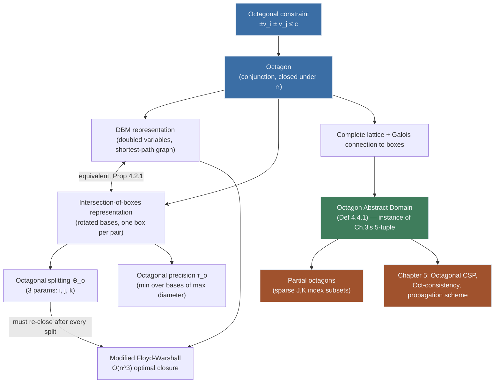

[[book-guidelines|↩ Back to guidelines]]

# [[The-Octagon-Abstract-Domain|The Octagon Abstract Domain]]

## 1. What boxes can't say

A box abstraction — the interval product $[a_1,b_1]\times\cdots\times[a_n,b_n]$ that ordinary interval-arithmetic solvers use — treats every variable as independent. Each coordinate gets its own range, and nothing in the representation can express a *relationship* between two variables. That's not a stylistic limitation; it's the representation's ceiling. If your constraint set implies $v_1 < v_2$, a box can never tighten around that fact — it can only shrink $v_1$'s and $v_2$'s ranges separately, and the box you get back is the smallest axis-aligned rectangle that contains the true (possibly triangular, possibly diagonal) solution region. The gap between the box and the real region is pure slack: wasted precision that later inflates search trees, because propagation keeps re-deriving the same weak bound.

**What breaks without relational information.** Concretely: consider $v_1 - v_2 \le 2.5$ together with $v_2 - v_1 \le 2$ and simple bounds on each variable. A box representation stores four numbers (two per variable) and is blind to the diagonal constraints entirely until they get re-processed by a constraint propagator — and even then, the *box* it produces is just the tightest rectangle enclosing the diagonal-cut region, silently including corner points that violate the diagonal constraints. If you're building a CSP kernel meant to search for counterexamples that break an invariant, this matters twice over: false negatives (a real counterexample sits in the box's corner, so search wastes time there) and false positives when the box is used to *prove* an invariant (the box over-approximates more than it needs to, so a real proof obligation looks unprovable when it wasn't).

Antoine Miné's answer, imported here from Abstract Interpretation into Constraint Programming, is the **octagon domain**: keep the cheap, structured feel of a box, but let each element additionally constrain *pairs* of variables along the two diagonal directions. This is exactly the "weakly relational" compromise on the precision/cost spectrum: strictly more expressive than intervals, strictly cheaper than general polyhedra (which need $O(2^n)$-ish vertex/facet representations and no Galois connection at all).

## 2. Octagonal constraints and their geometric shape

**Definition 4.1.1 (Octagonal constraint).** Given two variables $v_i, v_j$, an octagonal constraint is any constraint of the form

$$\pm v_i \pm v_j \le c, \qquad c \in \mathbb{R}$$

Note the degenerate case $i = j$: taking $v_i \equiv v_j$ collapses the constraint to $\pm v_i \le c/2$ (or $\pm 2v_i \le c$), so ordinary interval bounds ($v_i \ge a$, $v_i \le b$) are just octagonal constraints in disguise (Remark 4.1.1). Every box is already an octagon — this fact is what later gives you a Galois connection back to boxes for free.

**Definition 4.1.2 (Octagon).** An octagon is the set of points in $\mathbb{R}^n$ satisfying a *conjunction* of octagonal constraints.

Geometrically, in $\mathbb{R}^2$, each octagonal constraint is a half-plane bounded by a line that's either axis-parallel ($i=j$) or at $45°$ to the axes ($i\ne j$, since $\pm v_i \pm v_j = c$ has slope $\pm 1$). Intersecting enough of these half-planes around a bounded region gives you a convex polygon whose sides only ever point in one of four directions — up to eight sides in 2D, hence "octagon" — though the book is explicit that its technical sense is broader than the geometric one: a "octagon" in this book's sense can have *fewer* than eight sides (a plain box, or a triangle cut by one diagonal), and in $\mathbb{R}^n$ it has at most $2n^2$ faces (the maximum number of non-redundant octagonal constraints on $n$ variables). Two octagonal constraints with the same left-hand side ($\pm v_i \pm v_j$) are *redundant*; only the tighter one (smaller $c$) survives (Remark 4.1.2) — this is exactly what "closed" or "canonical form" will mean once we get to the matrix representation.

Not every polygon with axis/diagonal sides qualifies, though: Figure 4.2(b) in the book shows a non-convex polygon (excluded — a conjunction of half-planes is always convex) and two mathematical octagons whose sides aren't all axis/diagonal-aligned (excluded by definition). The set of octagons, in this book's technical sense, is exactly "convex polytope cut only by axis-parallel and diagonal hyperplanes" — nothing more, nothing less.

```rust
// The definitional shape of an octagonal constraint: a signed pair of
// variable indices, a signed pair of coefficients (each ±1), and a bound.
#[derive(Clone, Copy, Debug)]
struct OctConstraint {
    i: usize, sign_i: i8,   // sign_i ∈ {+1, -1}
    j: usize, sign_j: i8,   // j == i is the degenerate "interval" case
    c: f64,
}
// An octagon is just a conjunction (Vec) of these, kept non-redundant by
// collapsing entries that share (i, sign_i, j, sign_j) to the smaller `c`.
type Octagon = Vec<OctConstraint>;
```

## 3. Closure of octagons under intersection

This is the property that makes octagons usable as an abstract-interpretation lattice element at all: **octagons are closed under intersection, but not under union.**

**Remark 4.1.4.** For $O = \{\pm v_i \pm v_j \le c\}$ and $O' = \{\pm v_i \pm v_j \le c'\}$,

$$O \cap O' = \{\pm v_i \pm v_j \le \min(c, c')\}$$

— intersection is just per-constraint-shape meet, taking the tighter bound pointwise. This falls straight out of "same left-hand side, smaller right-hand side wins," from Remark 4.1.2.

**Remark 4.1.5.** Octagons are *not* closed under union — the union of two octagon-shaped regions is generally not itself expressible as a single conjunction of octagonal constraints (think of two disjoint diamonds: no octagon contains exactly their union). But you can compute the *smallest enclosing octagon*:

$$O \cup O' \;\rightsquigarrow\; \{\pm v_i \pm v_j \le \max(c, c')\}$$

This asymmetry — meet is exact, join is only a sound over-approximation — is completely standard for abstract domains (compare: interval union is also only an over-approximation, unless the intervals overlap or touch) and is exactly what's needed to prove octagons form a *complete lattice* later (§7 below, Proposition 4.4.1): a poset with intersection as glb and (over-approximated) union as lub, ordered by set inclusion.

**What this buys you, mechanically:** it means propagation can freely intersect octagons coming from different constraints (each constraint tightens some subset of the $\pm v_i \pm v_j$ bounds) and the result is *still an octagon* — you never leave the representation. That closure property is precisely what a CHC/abstract-interpretation-style invariant generator needs: intersecting the effect of every edge in a control-flow graph must stay inside the domain, or the whole fixpoint computation has nowhere to live.

## 4. The difference bound matrix representation

A conjunction of octagonal constraints is a set of inequalities — not, by itself, a canonical or directly computer-manipulable object (as we just saw, several different-looking conjunctions can denote the same octagon). The book's first representation, the **difference bound matrix (DBM)**, originally due to Menasche & Berthomieu (1983) and reused by Miné, fixes this by rewriting every octagonal constraint as a *difference constraint* on doubled variables.

**Definition 4.2.1 (Difference constraint).** $w - w' \le c$, for variables $w, w'$ and $c \in \mathbb{F}$ (floating-point, in the CP setting — octagons are restricted to floating-point bounds for computer representability, exactly as intervals are).

**The doubling trick.** For each original variable $v_i$, introduce two new variables:

$$w_{2i-1} = v_i \qquad w_{2i} = -v_i$$

("positive form" and "negative form" of $v_i$.) Now every octagonal constraint $\pm v_i \pm v_j \le c$ rewrites as one or two difference constraints on the $w$'s — for example $v_i + v_j \le c$ becomes $w_{2i-1} - w_{2j} \le c$ *and* $w_{2j-1} - w_{2i} \le c$ (these are the same fact stated from each variable's perspective). This is the crucial move: **a difference constraint $w - w' \le c$ is exactly a weighted edge $w' \to w$ of weight $c$ in a graph**, and a *conjunction* of difference constraints is exactly a weighted directed graph on $2n$ nodes. Miné's insight (imported wholesale here) is that this makes the entire machinery of shortest-path algorithms available for free.

**Definition 4.2.2 (Difference bound matrix).** The DBM for an octagon is the $2n \times 2n$ matrix $M$ where entry $M[i,j]$ (row $i$, column $j$) is the constant $c$ from the difference constraint $w_j - w_i \le c$ — i.e., $M[i,j]$ is literally the edge weight from node $i$ to node $j$ in the constraint graph. (Absent constraints get weight $+\infty$.)

This is not a canonical representation as-is: multiple DBMs can denote the same octagon (a slack entry that's implied by a shorter path through other entries can be replaced by anything $\ge$ the tight value without changing the solution set). Getting a canonical, *tightest* DBM is exactly a **shortest-path closure** problem on the constraint graph — which is where Floyd-Warshall comes in.

```rust
// A DBM is literally a weighted adjacency matrix over 2n "signed" nodes:
// node 2i-1 = +v_i, node 2i = -v_i (1-indexed in the book; 0-indexed here).
struct Dbm {
    n: usize,             // number of original variables
    m: Vec<Vec<f64>>,     // 2n x 2n, m[i][j] = weight of edge j -> i
                           // (i.e. the constant c in w_j - w_i <= c)
}
impl Dbm {
    fn new(n: usize) -> Self {
        let sz = 2 * n;
        let mut m = vec![vec![f64::INFINITY; sz]; sz];
        for i in 0..sz { m[i][i] = 0.0; }
        Dbm { n, m }
    }
}
```

## 5. The modified Floyd-Warshall algorithm for octagons

Ordinary Floyd-Warshall computes all-pairs shortest paths in $O(n^3)$ by relaxing through each intermediate node $k$ in turn: $d[i][j] \leftarrow \min(d[i][j],\, d[i][k]+d[k][j])$. Applied naively to the $2n \times 2n$ DBM graph, that already gives a valid closure. **Algorithm 4.1** modifies it to exploit a fact plain shortest-paths doesn't know: $w_{2i-1}$ and $w_{2i}$ are not independent nodes — they are $+v_i$ and $-v_i$, so a path that goes "through $v_i$" can also legally flip sign and come back through $-v_i$. Concretely, alongside the four ordinary relaxations through node $2k$ and $2k-1$, the algorithm adds paths that route through *both* representatives of $v_k$ in sequence:

$$d[i][j] \leftarrow \min\Big(d[i][j],\; d[i][2k]+d[2k][j],\; d[i][2k{-}1]+d[2k{-}1][j],$$
$$d[i][2k{-}1]+d[2k{-}1][2k]+d[2k][j],\; d[i][2k]+d[2k][2k{-}1]+d[2k{-}1][j]\Big)$$

After the $k$-loop, a second pass (the part the book flags as "added to the original version") propagates the sign-symmetry constraint one more time globally: for each $i,j$, letting $i'$ be $i$'s sign-flipped partner and $j'$ be $j$'s,

$$d[i][j] \leftarrow \min\big(d[i][j],\; d[i][i'] + d[j'][j]\big)$$

Finally, a sanity/emptiness check: after closure, every diagonal entry $d[i][i]$ must be $\ge 0$ (it represents $v_i - v_i \le c$; if the tightest such bound is negative, the octagon is provably empty — no value of $v_i$ can satisfy $v_i - v_i < 0$ — and the algorithm signals an error/failure). Otherwise the diagonal is reset to exactly $0$.

Total complexity stays $O(n^3)$ — same asymptotic class as unmodified Floyd-Warshall — because the sign-symmetry pass is a constant-factor addition per $(i,j,k)$ triple, not an extra loop nest. Two independently published variants of this algorithm ([BAG 09] and Pelleau's own) achieve the same complexity.

**What breaks without the modified pass:** running plain Floyd-Warshall on the doubled graph gets you a shortest-path closure that's *consistent as a graph*, but it can still miss tightenings that only become visible once you remember $w_{2i-1} = -w_{2i}$ — e.g., a bound derived from a path through $+v_i$ should also propagate to constraints stated in terms of $-v_i$, which plain shortest-paths has no reason to do since it treats $w_{2i-1}$ and $w_{2i}$ as unrelated nodes. The extra pass is exactly what recovers full octagonal (not just graph-theoretic) closure — and it's the same phenomenon your CSP kernel's DBM-based reasoner needs to get right if it fuses interval and difference-constraint reasoning for refinement-type range checks.

```rust
fn floyd_warshall_octagonal(dbm: &mut Dbm) -> Result<(), ()> {
    let sz = 2 * dbm.n;
    for k in 0..dbm.n {
        let (a, b) = (2 * k, 2 * k + 1); // 0-indexed: "2k" and "2k-1" from the book
        for i in 0..sz {
            for j in 0..sz {
                let via_direct = dbm.m[i][a].min(f64::INFINITY) + dbm.m[a][j];
                let candidates = [
                    dbm.m[i][j],
                    dbm.m[i][a] + dbm.m[a][j],
                    dbm.m[i][b] + dbm.m[b][j],
                    dbm.m[i][b] + dbm.m[b][a] + dbm.m[a][j],
                    dbm.m[i][a] + dbm.m[a][b] + dbm.m[b][j],
                ];
                dbm.m[i][j] = candidates.into_iter().fold(f64::INFINITY, f64::min);
                let _ = via_direct; // illustrative only
            }
        }
        // sign-symmetry propagation pass
        for i in 0..sz {
            for j in 0..sz {
                let ip = if i % 2 == 0 { i + 1 } else { i - 1 };
                let jp = if j % 2 == 0 { j + 1 } else { j - 1 };
                dbm.m[i][j] = dbm.m[i][j].min(dbm.m[i][ip] + dbm.m[jp][j]);
            }
        }
    }
    for i in 0..sz {
        if dbm.m[i][i] < 0.0 { return Err(()); } // empty octagon
        dbm.m[i][i] = 0.0;
    }
    Ok(())
}
```

## 6. The intersection of boxes representation

The DBM is compact and closure-friendly, but not the most natural shape for Constraint-Programming-style consistency (which wants to talk about per-variable *domains*, i.e. intervals, that propagators can tighten). Pelleau's second representation — her own contribution, not inherited from Miné — recasts an octagon as an **intersection of boxes living in different rotated coordinate systems**.

In $\mathbb{R}^2$, this is concrete: any octagon is exactly the intersection of one ordinary axis-aligned box *and* one box in the basis rotated by $\pi/4$ (Figure 4.5). The rotated box's two "axes" are the two diagonal directions $v_1+v_2$ and $v_2-v_1$ (up to normalization) — so a diagonal octagonal constraint like $v_1 - v_2 \le 2.5$ becomes, after rotation, an ordinary *interval bound* on the rotated coordinate. This is the entire trick: octagons look relational in the canonical basis, but they are non-relational (boxes!) once you rotate into the right basis — one rotated basis per *pair* of variables.

**Definition 4.2.3 (Rotated basis).** For canonical basis $B=(u_1,\dots,u_n)$ of $\mathbb{F}^n$ and $\alpha = \pi/4$, the $(i,j)$-rotated basis $B_\alpha^{i,j}$ replaces $u_i, u_j$ with their rotated images $(\cos\alpha\, u_i + \sin\alpha\, u_j)$ and $(-\sin\alpha\, u_i + \cos\alpha\, u_j)$, leaving every other basis vector unchanged. A variable $v_k$'s coordinate in this basis is written $v_k^{i,j}$; by convention $B_\alpha^{i,i}$ denotes the canonical basis itself.

For each unordered pair $i \ne j$, the DBM entries corresponding to that pair pick out a box $B^{i,j}_O$ in that rotated basis:

$$I_k = \Big[-\tfrac12 M[2k{-}1,2k],\ \tfrac12 M[2k,2k{-}1]\Big] \quad (k \ne i,j; \text{ ordinary per-variable bound})$$
$$I_i^{i,j} = \Big[-\tfrac{1}{\sqrt2} M[2j{-}1,2i],\ \tfrac{1}{\sqrt2} M[2j,2i{-}1]\Big], \qquad I_j^{i,j} = \Big[-\tfrac{1}{\sqrt2} M[2j{-}1,2i{-}1],\ \tfrac{1}{\sqrt2} M[2j,2i]\Big]$$

**Proposition 4.2.1.** $O = \bigcap_{i,j \in \{1,\dots,n\}} B^{i,j}_O$ — the octagon equals the intersection of *all* these pairwise-rotated boxes (plus the canonical one). The proof is short: $v_i^{i,j} = \frac{v_i+v_j}{\sqrt2}$ and $v_j^{i,j} = \frac{v_j-v_i}{\sqrt2}$ by construction, so membership in $B_O^{i,j}$ is *exactly* satisfying the octagonal constraints on $v_i, v_j$ — the rotated box is nothing but that pair's constraints, restated as an interval.

For $n$ variables there are $\binom{n}{2} = n(n-1)/2$ off-diagonal rotated bases plus the canonical one — so this representation is equivalent to, but genuinely a different *view* of, the same $O(n^2)$-sized DBM: "one box per pair of variables" instead of "one matrix cell per ordered pair of signed variables." Converting between the two costs only a multiplication/division with appropriate rounding — cheap, but not free, which is why the book keeps both representations around and picks whichever is more convenient per operation (DBM for closure, boxes for splitting and consistency).

```rust
// The intersection-of-boxes view: one interval per rotated basis (i, j),
// stored as (lo, hi) pairs, mirroring the DBM but shaped for propagators
// that expect per-basis interval domains.
struct RotatedBoxes {
    canonical: Vec<(f64, f64)>,               // I_1 .. I_n
    rotated: std::collections::HashMap<(usize, usize), (f64, f64, f64, f64)>,
    // (i, j) -> (I_i^{i,j}.lo, I_i^{i,j}.hi, I_j^{i,j}.lo, I_j^{i,j}.hi)
}
```

## 7. Rotated bases and rotated variables

The rotated basis (Definition 4.2.3, above) is worth isolating as its own idea because it recurs everywhere in the rest of the chapter and the next one: instead of treating "octagon" as one exotic shape, treat it as **many boxes, each in its own coordinate system, all sharing the same underlying variables.** Every pair $(i,j)$ gets its own pair of *rotated variables* $v_i^{i,j}, v_j^{i,j}$ — new names for the same points, just viewed diagonally. This is the representation-level embodiment of "weakly relational": you never manipulate a general linear inequality; you only ever manipulate an axis-aligned box, but in up to $n(n-1)/2 + 1$ different bases simultaneously, and consistency between the bases is what recovers relational precision.

Two consequences worth flagging explicitly (both will matter directly in Chapter 5, which this article's guidelines note as its immediate continuation):

- **Correlation tracking.** A per-basis box, on its own, is exactly as blind as a plain box — but *because the same original variables reappear, rotated, in every basis*, tightening one basis's box and re-propagating (via Floyd-Warshall) tightens the others. That's the mechanism by which relational information moves through the representation.
- **Cost.** Generating every rotated basis for $n$ variables produces $n(n+1)/2$ bases total (Definition 4.4.1's remark) — turning an $n$-variable CSP into something that behaves, dimension-wise, like an $n^2$-variable problem. This quadratic blow-up is the direct motivation for partial octagons (§9 below).

```rust
// Rotated coordinates for the pair (i, j), α = π/4:
// v_i^{i,j} =  cos(α) v_i + sin(α) v_j  =  (v_i + v_j) / sqrt(2)
// v_j^{i,j} = -sin(α) v_i + cos(α) v_j  =  (v_j - v_i) / sqrt(2)
fn to_rotated(vi: f64, vj: f64) -> (f64, f64) {
    let s = std::f64::consts::FRAC_1_SQRT_2;
    ((vi + vj) * s, (vj - vi) * s)
}
```

## 8. The octagonal splitting operator

Recall from Chapter 3's unified framework (`[[Unified-Abstract-Domains-for-Constraint-Programming]]`, if that article exists, or the guidelines' Topic 7) that every abstract domain for CP needs a *splitting operator*: something to cut a non-solution element into smaller sub-elements when consistency alone can't shrink it further, satisfying finiteness, coverage (no lost solutions), non-emptiness, and non-triviality.

**Definition 4.3.1 (Octagonal splitting operator).** Given octagon $O$ as an intersection of boxes $I_1,\dots,I_n, I_1^{1,2},\dots,I_n^{n-1,n}$, and a chosen interval $I_k^{i,j} = [a,b]$ (in *any* basis — canonical or rotated), the split $\oplus_o(O)$ produces two subdomains, identical to $O$ except that $I_k^{i,j}$ is replaced by $[a,h]$ in one and $[h,b]$ in the other, with $h = \frac{a+b}{2}$ (rounded in $\mathbb{F}$).

This is the ordinary bisection-split you already know from interval solvers — with one twist that's easy to miss: **the split has three parameters ($i,j,k$), not one.** An interval solver only ever chooses *which variable* to cut. An octagonal solver additionally chooses *which basis* to cut in — canonical, or one of the $n(n-1)/2$ rotated ones. Splitting $v_1$ in the canonical basis and splitting the diagonal variable $v_1^{1,2}$ produce geometrically different cuts of the same region (Figure 4.6: a canonical-basis cut is a vertical/horizontal line; a rotated-basis cut is diagonal).

**What breaks if you stop here:** cutting one basis's box does nothing to the *other* bases' boxes — they still describe the pre-split region, so the intersection (the actual octagon) is momentarily inconsistent across bases. The book is explicit that a split must be *immediately followed by a Floyd-Warshall re-propagation* to push the tightened bound through the DBM and re-derive tightened bounds in every other basis. Skipping this step doesn't just lose precision — it can leave the representation in a state that doesn't correspond to any single octagon at all, since "intersection of these specific boxes" is only guaranteed equal to the true octagon when the DBM is closed (Proposition 4.2.1 assumed a closed $O$). This is a genuinely new procedural requirement relative to interval splitting, which needs no such repair step — worth remembering if you ever implement a DBM-backed range/refinement checker that supports case-splitting.

```python
def octagon_split(boxes, basis, var, h=None):
    """boxes: dict[(basis_key, var)] -> (lo, hi). basis_key: 'canon' or (i, j).
    Returns two new box-dicts, split at h (midpoint by default),
    followed (by the caller) by a Floyd-Warshall re-closure."""
    lo, hi = boxes[(basis, var)]
    h = h if h is not None else (lo + hi) / 2
    left, right = dict(boxes), dict(boxes)
    left[(basis, var)] = (lo, h)
    right[(basis, var)] = (h, hi)
    return left, right  # caller MUST re-run modified Floyd-Warshall on both
```

## 9. The octagonal precision function

A CP solving loop needs to know when to *stop* splitting — the standard stopping rule is "domain size below precision threshold $r$." For a plain box, "size" is unambiguous: the width of the widest interval. For an octagon this naive definition is actively misleading, because it ignores the correlated (rotated) boxes entirely: an octagon can have a tiny canonical box (so it *looks* solved by the naive measure) while a rotated box for some pair still spans a huge range — meaning the solver would stop early, having failed to resolve real correlated uncertainty between two variables (Figure 4.7 shows exactly this: the canonical $I_1$ is small, but $I_1^{1,2}$ is still wide).

**Definition 4.3.2 (Octagonal precision).**

$$\tau_o(O) = \min_{i,j \in \{1,\dots,n\}}\ \max_{k \in \{1,\dots,n\}} \big(\overline{I_k^{i,j}} - \underline{I_k^{i,j}}\big)$$

Read inside-out: for a *fixed* rotated basis $(i,j)$, take the width of its *widest* interval component (that basis's own worst-case diameter — mirroring the usual box-precision definition, but per-basis). Then take the *minimum* over all bases. Why minimum, not maximum? Because you want the *tightest* available witness of "how far can any point in $O$ be from a real solution" — and Proposition 4.3.1 shows that any *one* Hull-consistent basis already bounds that distance, so you're free to report the best (smallest) such bound rather than a pessimistic worst-case one.

**Proposition 4.3.1** (precision as a distance guarantee): if $O$ over-approximates solution set $S$ and contains at least one true solution, and $r = \tau_o(O)$, then every point $x \in O$ is within (coordinate-wise) distance $r$ of some solution $s \in S$. The proof picks the basis $(i,j)$ realizing the minimum in $\tau_o$'s definition; that basis's box $B_O^{i,j}$ is Hull-consistent (hence contains $S$ exactly, by construction of Hull-consistency) and has diameter $r$ in every coordinate — so any point and any solution, both living in that box, are at most $r$ apart per-coordinate.

This is the precision function's real payoff, and it's exactly the semantic guarantee your invariant-generation over-approximations need to be *useful*, not just sound: "sound but arbitrarily loose" over-approximations are worthless for reporting a tight counterexample region; $\tau_o$ gives you a *certified* closeness bound, derived from whichever correlated view of the region is tightest — for free, because octagons already track those correlated views.

```rust
fn octagonal_precision(boxes: &RotatedBoxes) -> f64 {
    // min over all (i,j) bases of (max diameter within that basis's box set)
    boxes.rotated.values()
        .map(|&(lo_i, hi_i, lo_j, hi_j)| (hi_i - lo_i).max(hi_j - lo_j))
        .fold(f64::INFINITY, f64::min)
}
```

## 10. Octagons as a complete abstract domain, and the intervals Galois connection

Chapter 3 defined "abstract domain for Constraint Programming" as a 5-tuple: a complete lattice, a Galois connection to the search space, a computer-representable normal form, a family of splitting operators, and a monotonic size function. Chapter 4's final section (4.4) discharges every remaining obligation to make octagons a legitimate instance:

- **Complete lattice (Proposition 4.4.1).** Any two octagons $O, O'$ have both a lub (§3's over-approximated union) and a glb (§3's exact intersection); hence any finite set has both, so $O$ (the set of octagons) is a complete lattice under inclusion.
- **Galois connection to boxes (Proposition 4.4.2).** $\alpha_o: O \to B$ discards every non-degenerate ($i \ne j$) octagonal constraint, keeping only the pure interval bounds $\pm v_i \le c$ — literally "forget every diagonal fact, keep the box." $\gamma_o: B \to O$ is the inclusion (a box already *is* an octagon, per §2). This is the formal counterpart of what §1 argued informally: boxes are octagons with no relational information, so there's a canonical (and here, *exact* on the concretization side) way to move between the two domains.

**Definition 4.4.1 (Octagon abstract domain).** The tuple: the complete lattice $O$; the Galois connection $O \rightleftarrows B$; the intersection-of-boxes representation; the octagonal splitting operator $\oplus_o$; the octagonal precision function $\tau_o$. This closes the loop with Chapter 3's abstract framework — octagons are now, formally, a drop-in domain for the unified CP solving algorithm, on equal footing with plain interval boxes.

## 11. Partial octagons

Definition 4.4.1 as stated is expensive: generating *every* rotated basis for $n$ variables costs $n(n+1)/2$ bases (§7), so a solver naively instantiating the full octagon domain pays quadratic blow-up in problem size regardless of whether most variable pairs are actually related by any constraint. Most real CSPs are sparse — only a few pairs of variables genuinely interact — so most of those rotated bases carry no information and are pure overhead.

**Definition 4.4.2 (Partial octagon).** Given index sets $J, K \subseteq \{1,\dots,n\}$, a partial octagon is the set of points satisfying $\{\pm v_i \pm v_j \le c \mid i \in J,\, j \in K\} \cup \{\pm v_i \pm v_i \le c \mid i \in \{1,\dots,n\}\}$ — i.e., keep *all* the ordinary per-variable bounds, but only generate diagonal constraints (and hence rotated bases) for the chosen index subsets, not every pair.

Setting $J = K = \{1,\dots,n\}$ recovers full octagons exactly (Definition 4.1.2) — partial octagons strictly generalize octagons, and the book notes (without belaboring the proof) that every property established for full octagons — closure, lattice structure, Galois connection, splitting, precision — carries over unchanged, because nothing in those arguments actually used "every pair," only "a fixed, finite set of octagonal-constraint shapes." So the partial-octagon set is itself the base set for a valid abstract domain.

The tradeoff this navigates is exactly expressiveness vs. cost: pick $J, K$ too small and you're back to plain-box blindness on the pairs you dropped; pick them too large and you're back to the $n(n+1)/2$ blow-up. *Which* pairs to include is a heuristic decision — the book defers the actual heuristics (ConstraintBased, Random, StrongestLink, Promising) to Chapter 5, since a sensible choice needs to look at the actual constraint graph of the CSP being solved, not just the octagon domain in the abstract.

```rust
// A partial octagon only generates rotated bases for pairs in J × K,
// instead of every pair in {1..n}^2 — the sparse analogue of RotatedBoxes.
struct PartialOctagon {
    canonical: Vec<(f64, f64)>,
    rotated: std::collections::HashMap<(usize, usize), (f64, f64, f64, f64)>,
    // populated only for (i, j) with i in J, j in K
}
```

## Where this leads



Within the book, this chapter is entirely load-bearing for Chapter 5 ("Octagonal Solving," pp. 91–110): the DBM and modified Floyd-Warshall become the propagation engine, the rotated-basis machinery gets reused to build an "octagonal CSP" with rotated variables and rotated constraints, and Oct-consistency is defined directly in terms of Hull-consistency on every rotated box (Proposition 5.2.2, an immediate corollary of Proposition 4.2.1 above). The octagon domain is also the book's running proof-of-concept that Chapter 3's abstract framework (`Topic 7`) is not vacuous — it recovers a genuinely new, useful CP solver as one instance among others.

For the compiler/elaborator project this vault is tracking: the DBM-plus-modified-Floyd-Warshall pattern is the textbook mechanism for **difference-constraint reasoning** in an abstract-interpretation-based invariant generator — precisely the shape you'd want for a lightweight relational domain sitting between plain interval abstraction and full polyhedra when generating loop invariants or checking refinement-type range obligations (`x < y`, `i <= len`) that a non-relational domain would miss entirely. The rotated-basis idea — "the same variables, re-expressed in a different coordinate system, so a relational fact becomes a non-relational one" — is also a useful intuition to keep on hand for constraint generation more generally: normalizing a relational obligation into a shape where existing (non-relational) machinery applies is a recurring move, structurally similar to how a unification problem is sometimes simplified by a change of representation before pattern-unification's syntactic checks can apply.
