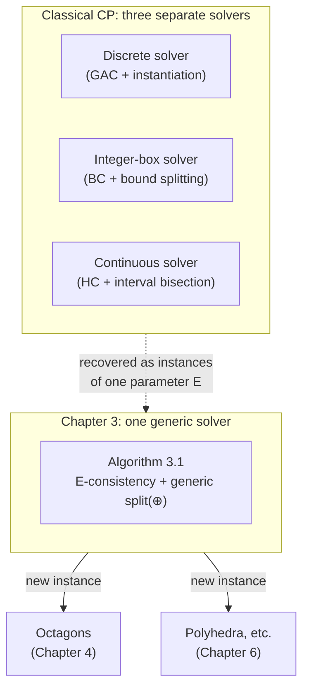
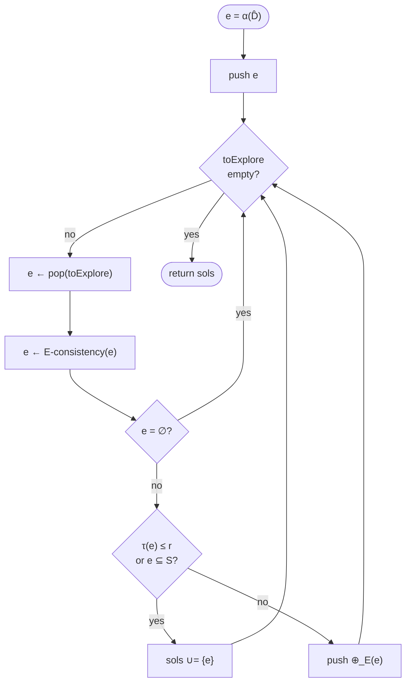

# Unified Abstract Domains for Constraint Programming

[[book-guidelines|↩ Back to guidelines]]

## The problem this chapter solves

Every Constraint Programming solver you've ever used is secretly three solvers wearing the same trenchcoat. If your variables are discrete, propagation computes *generalized arc-consistency* (GAC) and splitting means "pick a variable, pick a value, branch." If your variables are continuous, propagation computes *hull-consistency* (HC) and splitting means "bisect an interval at its midpoint." If you mix integer and real variables, you don't get a third solver — you get duct tape: discretize the reals, or relax the integers, or bolt two solvers together and hope they agree at the boundary.

The book's diagnosis (§3.1): these aren't three different algorithms. They're one algorithm — *alternate propagation and exploration until you've covered the solution set* — instantiated three times over three different, hard-coded choices of **domain representation**. GAC is what "consistency" means when your representation is a Cartesian product of finite integer sets. Bound-consistency is what it means for integer boxes. Hull-consistency is what it means for real boxes. The representation was never separated from the algorithm, so every time someone wants a new representation (say, octagons, or polyhedra — anything non-Cartesian, anything that can express a relation *between* two variables like $v_1 - v_2 \le 3$ instead of just a bound on each), they have to redefine "consistency" and "splitting" from scratch for that shape, ad hoc.

Abstract Interpretation (AI) had already solved a structurally identical problem for program analysis: instead of hard-coding "the domain is intervals" into an analyzer, AI defines an **abstract domain** as a first-class parameter — a lattice plus a Galois connection plus some required operators — and the analysis algorithm is written once, generically, over that parameter. Chapter 3's move is to import exactly this idea into CP: define consistency, splitting, and "abstract domain" as representation-independent notions, then write *one* solving algorithm parametrized by whichever abstract domain you plug in. GAC, BC, and HC don't disappear — they become three proofs that three specific choices of parameter recover the classical solvers as special cases of the general one.



## 1. E-consistency: what "consistent" means, stripped of any particular representation

**What breaks without it.** GAC, BC, and HC are each defined separately, in terms of the specific representation they operate on ("a Cartesian product $D_1 \times \cdots \times D_n$ is GAC iff every value in every $D_i$ has support..."). If you invented a fourth representation tomorrow — say, one where domains are octagons — you'd have no definition of "octagon-consistent" to reach for. You'd have to invent one from scratch, and nothing would connect it back to the pattern the other three share, or guarantee it *is* the right generalization rather than an ad hoc lookalike.

**The definition.** Fix $\hat D$, the initial search space (the full domain before any propagation), and let $E \subseteq \mathcal{P}(\hat D)$ be a chosen family of subsets of it — this is the representation: $E$ = Cartesian products of finite integer sets gives you the classical discrete case, $E$ = boxes gives you the classical continuous case, $E$ = octagons would give you something new. Order $E$ by inclusion $\subseteq$. The book restricts attention to $E$ **closed under intersection** — write $E^f = E \setminus \{\emptyset\}$ for the nonempty elements.

> **Definition 3.2.1 (E-Consistency).** For a constraint $C$ with solution set $S_C$, an element $e \in E$ is *$E$-consistent* for $C$ iff it is the least element of
> $$ C_C^E = \{e' \in E \mid S_C \subseteq e'\} $$

In words: among every representable element that safely contains all solutions of $C$, $E$-consistency picks the *tightest* one representable in $E$. That's it — that's the whole idea GAC, BC, and HC were each independently reinventing.

**Why the intersection-closure hypothesis matters — and where it breaks.** If $E$ isn't closed under intersection, $C_C^E$ can fail to have a least element at all, so "the" $E$-consistent element may not exist or may not be unique (Proposition 3.2.4 needs closure under *infinite* intersection to guarantee a unique least element; Remark 3.2.1 gives the concrete counterexample). The book's own example: let $C$ be a circle and $E$ the set of convex polyhedra. There is no smallest polyhedron containing a disk — you can always find another polyhedron with one more face that fits tighter, with no limit. Polyhedra are not closed under intersection of *infinitely many* polyhedra in this sense, so "the polyhedron-consistent element for a circle" is simply undefined. This is precisely why Chapter 6's treatment of the polyhedron domain has to work around the missing Galois connection rather than getting one for free — the gap traces straight back to this closure condition.

**Recovering the classical consistencies.** The book proves three propositions, each with the same two-directional proof shape (representation-consistent $\Rightarrow$ classical-consistent, and back):

- **Proposition 3.2.1**: $S$ = Cartesian products of finite integer sets $\Rightarrow$ $S$-consistency *is* GAC.
- **Proposition 3.2.2**: $IB$ = integer boxes $\Rightarrow$ $IB$-consistency *is* bound-consistency.
- **Proposition 3.2.3**: $B$ = (floating-point) boxes $\Rightarrow$ $B$-consistency *is* hull-consistency.

Each proof has the identical skeleton: (soundness direction) if $D$ is classically-consistent but some smaller $D'$ in the same family still contained all solutions, exhibit a solution point in $D \setminus D'$ that would be lost — contradiction; (completeness direction) if $D$ is $E$-consistent, show directly that it satisfies the classical per-variable/per-bound support condition. This is the generic pattern to internalize, not just the three instances: *a consistency notion is characterized by "least element of a family containing the solutions," and proving a classical algorithm computes that consistency reduces to proving no strictly smaller family member also contains all solutions.*

**Extending to conjunctions of constraints** (Definition 3.2.2) is the obvious lift: $E$-consistency for $C_1 \wedge \cdots \wedge C_p$ is the least element of $E$ containing $S_{C_1 \wedge \cdots \wedge C_p}$. Proposition 3.2.5 shows that, when $E$ is closed under intersection, the set of all $C^E_{C_{i_1} \wedge \cdots \wedge C_{i_k}}$ over subsets of constraints forms a lattice under inclusion, with the full conjunction's consistent element as its least element — and, crucially, this justifies the standard implementation trick: **run each constraint's own propagator repeatedly, in any order, to a fixpoint, and you reach the consistent element for the whole conjunction.** Order-independence of propagator scheduling isn't a lucky implementation detail; it's a theorem about this lattice.

**Rust grounding.** The family $E$ and the operation "smallest element of $E$ above the solutions" is exactly a **meet-semilattice interface** — think of it as a trait every representation must implement, with $E$-consistency as one required method:

```rust
trait Domain: PartialOrd + Sized {
    /// Bottom element (no solutions / empty domain).
    fn empty() -> Self;
    /// Greatest lower bound — requires E closed under intersection.
    fn meet(&self, other: &Self) -> Self;
    /// The E-consistent element for a single constraint's local propagation.
    /// Implementations for CartesianInt, IntBox, Box each recover
    /// GAC, BC, HC respectively — this is Propositions 3.2.1-3.2.3.
    fn propagate(&self, constraint: &Constraint) -> Self;
}

// Fixpoint loop is representation-agnostic: any order converges
// (Proposition 3.2.5) to the same least fixpoint.
fn to_fixpoint<D: Domain>(mut e: D, constraints: &[Constraint]) -> D {
    loop {
        let before = e.clone();
        for c in constraints {
            e = e.propagate(c);
            if e == D::empty() { return e; }
        }
        if e == before { return e; }
    }
}
```
The elegance here — and this is worth pausing on — is that `to_fixpoint` never mentions GAC, BC, or HC by name. It is *the* propagation loop, period; the classical algorithms are just what falls out when `Domain` is implemented for particular types.

## 2. The generic splitting operator: how to cut a domain without losing solutions

**What breaks without it.** Once you've propagated to the consistent element, if it's not yet a solution (or small enough to accept as one), you must explore — cut the remaining space and recurse. Discrete solvers instantiate a variable to one value at a time; continuous solvers bisect an interval. These look unrelated on the surface (finite enumeration vs. geometric bisection), and if you invent a new representation you again have no template for what a *correct* splitting operator even has to guarantee.

**The definition.** For a poset $(E, \subseteq)$:

> **Definition 3.2.3 (Splitting Operator).** $\oplus : E \to \mathcal{P}(E)$ such that for all $e \in E$, with $\oplus(e) = \{e_1, \ldots, e_k\}$:
> 1. **Finiteness**: $|\oplus(e)|$ is finite.
> 2. **Coverage**: $\bigcup_{i \in \llbracket 1,k \rrbracket} e_i = e$.
> 3. **Non-emptiness**: $\forall i,\; e \neq \emptyset \Rightarrow e_i \neq \emptyset$.
> 4. **Non-triviality**: $\exists i,\; e_i = e \implies e$ is already a least element of $E^f$.

Each condition guards a distinct failure mode, and it's worth naming all four explicitly because the book states them almost telegraphically:

| Condition | Guards against |
|---|---|
| 1. Finiteness | Non-termination — an infinitely-wide search tree can never be exhausted. |
| 2. Coverage | Lost solutions — if the pieces don't cover $e$, a solution living in the gap silently disappears. |
| 3. Non-emptiness | Wasted work — an empty branch is dead weight in the search tree with nothing to gain from exploring it (and is explicitly forbidden, not merely discouraged). |
| 4. Non-triviality | Non-progress — the only way a split piece is allowed to equal the whole is if $e$ was already unsplittable (a least/atomic element of $E^f$); otherwise splitting must strictly shrink every piece (Remark 3.2.2: $\forall i,\ e_i \subsetneq e$), which is exactly what termination arguments later need. |

Note condition 2 explicitly does **not** require $\oplus(e)$ to be a *partition* — pieces may overlap. This is deliberate (Remark 3.2.3): floating-point interval splitting needs it, because the midpoint $h = \frac{a+b}{2}$ rounded to a representable float may need to belong to both halves to avoid rounding a solution out of existence.

**Recovering the classical splitters as instances:**
- **Discrete instantiation** (Example 3.2.2): $\oplus_{\mathbb N}(d) = \bigcup_{v \in d}\{v\}$ — literally "split into one singleton per remaining value." Lifted to $n$ variables via $\oplus_{\mathbb{N}^n,i} = \mathrm{Id}^{i-1} \times \oplus_{\mathbb N} \times \mathrm{Id}^{n-i-1}$: split only along coordinate $i$, leave the rest untouched.
- **Continuous bisection** (Example 3.2.3): $\oplus_I(I) = \{I^\ell, I^a\}$, two (possibly overlapping, to handle float rounding) subintervals covering $I$; terminates when $a, b$ are consecutive floats — this is why floating-point interval solvers *must* bottom out rather than bisect forever.
- **Box splitting** (Example 3.2.4): pick a coordinate $I_i$ (commonly the widest one, $\arg\max_i (\overline{I_i} - \underline{I_i})$), split only that coordinate via $\oplus_I$.

Both the discrete and continuous splitters are visibly the *same shape*: pick a coordinate, apply a coordinate-local split, hold everything else fixed via $\mathrm{Id}$. That shared shape is exactly what condition-checking against Definition 3.2.3 makes precise and portable to a genuinely new domain — Chapter 4's octagonal splitting operator is a nontrivial instance of the same four conditions, cutting along a rotated axis rather than a coordinate axis.

**Rust grounding — this is a natural `enum`/typestate fit:**
```rust
trait Splittable: Domain {
    /// Must satisfy: finite, covers self, no empty pieces (unless self
    /// was already empty), and strictly shrinks unless self is atomic.
    fn split(&self) -> Vec<Self>;
}

impl Splittable for IntCartesian {
    fn split(&self) -> Vec<Self> {
        // pick a variable i with |D_i| > 1, branch on one value at a time
        let i = self.first_undetermined_var().expect("atomic: no split");
        self.domains[i].iter().map(|v| self.fix(i, v)).collect()
    }
}

impl Splittable for Box {
    fn split(&self) -> Vec<Self> {
        let i = self.widest_dim();
        let (lo, hi) = self.dims[i].bisect(); // may overlap at the float midpoint
        vec![self.with_dim(i, lo), self.with_dim(i, hi)]
    }
}
```
The trait bound documents the four conditions as a contract a reviewer can check per-`impl`, exactly the way one would document safety invariants on an `unsafe` method.

## 3. Formal definition of an abstract domain for Constraint Programming

Having generalized *consistency* and *splitting*, the book packages what a representation needs to supply, as a whole, to be pluggable into the generic solver:

> **Definition 3.2.4 (Abstract Domain for CP).** An abstract domain is:
> - a complete lattice $E$,
> - a concretization $\gamma : E \to D$ and abstraction $\alpha : D \to E$ forming a **Galois connection** between $E$ and the search space,
> - a computer-representable **normal form**,
> - a sequence of **splitting operators** for $E$,
> - a monotonic **size function** $\tau : E \to \mathbb{R}^+$ with $\tau(e) = 0 \iff e = \emptyset$.

Read each field as answering one implementation question: *How do I compare an abstract element to the concrete search space?* (Galois connection.) *How do I know two representations of "the same" element are recognized as equal?* (normal form — without it, an implementation could loop forever churning between equivalent-but-syntactically-distinct representations.) *How do I cut it when it's still too coarse?* (splitting operators — plural, because a domain may support more than one strategy, as octagons will in Chapter 4.) *How do I know when to stop?* ($\tau$ — a numeric proxy for "how imprecise is this element," used purely as a termination knob, not as a semantic property of the domain itself.)

Two things are pointedly **not** required: the domain need not be Cartesian (this is the whole point — it's what lets octagons and polyhedra in later), and **propagators are deliberately excluded** from this tuple. The book's reasoning: a propagator depends jointly on the constraint's syntactic shape *and* the domain's geometry, so it can't be pinned down generically the way meet/join/split/$\tau$ can — it has to stay ad hoc, supplied per (domain, constraint-language) pair rather than per domain alone. This is a modeling choice worth sitting with: the framework unifies *domains*, not *propagation*, which is precisely why Chapter 6 later needs a separate theory (lower closure operators, Granger's local iterations) to say something general about propagators themselves.

The book playfully demonstrates the definition's genuine representation-independence with a "Shadok" abstract domain (an arbitrary, non-Cartesian blob shape used purely as a proof that *nothing* about Definition 3.2.4 assumes convexity, axis-alignment, or any geometric structure at all — any computer-representable, intersection-closed lattice with a splitting operator and a size function qualifies).

**Lean grounding.** This 5-tuple is naturally a `structure` bundling a lattice instance with extra fields — the shape should look immediately familiar if you've seen how Mathlib bundles algebraic structures (a `Lattice` typeclass plus extra data), or how an elaborator's metavariable-context object bundles "the thing itself" with "the extra machinery needed to make it usable":

```lean
structure CPAbstractDomain (D : Type) where
  E : Type
  latticeE : CompleteLattice E
  γ : E → Set D
  α : Set D → E
  galois : GaloisConnection α γ           -- α ⊣ γ, adjunction between (E,⊆) and (Set D,⊆)
  normalForm : E → E                      -- idempotent: normalForm (normalForm e) = normalForm e
  splits : List (E → List E)              -- each satisfies the four split-operator laws
  τ : E → ℝ
  τ_nonneg : ∀ e, 0 ≤ τ e
  τ_zero_iff_empty : ∀ e, τ e = 0 ↔ E = ∅   -- schematic; real form indexes over a bottom element
```
The Galois connection field is the load-bearing one for your elaborator work: `α ⊣ γ` here plays exactly the role that "abstraction/concretization of a metavariable's constraint set" would play in a unification-based elaborator — $\alpha$ compresses a concrete search space down to the tightest representable abstraction, $\gamma$ reads it back out as a (possibly larger, safely over-approximating) concrete set. Anywhere you see "soundness" claimed for an abstract computation, it cashes out as $S_C \subseteq \gamma(\alpha(S_C))$ — full concretization is only ever an over-approximation, never a loss.

## 4. The unified abstract solving algorithm

With consistency, splitting, and the domain tuple all pinned down, the solving loop is startlingly short — it is, almost verbatim, the continuous CP solving loop from Chapter 2 with "box" replaced everywhere by "abstract domain element":

```text
Algorithm 3.1 — Solving with abstract domains
  sols ← ∅                          # accumulated abstract solutions
  toExplore ← ∅                     # queue/stack of elements to explore
  e ← α(D̂)                          # abstract the initial search space
  push e onto toExplore
  while toExplore ≠ ∅:
      e ← pop(toExplore)
      e ← E-consistency(e)          # propagate to the E-consistent element
      if e ≠ ∅:
          if τ(e) ≤ r or e ⊆ S:     # accept: below precision, or provably all-solutions
              sols ← sols ∪ {e}
          else:
              choose a splitting operator ⊕_E
              push ⊕_E(e) onto toExplore
  return sols
```

Read it as three phases repeating: **propagate** (shrink via $E$-consistency — cheap, deterministic, no branching), **test** (are we done — either fully solved, $e \subseteq S$, or precise enough to stop, $\tau(e) \le r$?), **split** (branch, and recurse on each piece). This is exactly the propagate/branch loop every CP solver already runs; the only thing that changed is that $E$, $\oplus_E$, $\tau$, and $r$ are now *parameters* rather than baked-in choices.



**Python sketch**, to see the loop with none of Rust's trait ceremony in the way (illustrative only — not load-bearing):
```python
def solve(alpha, D_hat, propagate, split, tau, r, is_subset_of_solutions):
    to_explore = [alpha(D_hat)]
    sols = []
    while to_explore:
        e = to_explore.pop()
        e = propagate(e)          # E-consistency
        if e is EMPTY:
            continue
        if tau(e) <= r or is_subset_of_solutions(e):
            sols.append(e)
        else:
            to_explore.extend(split(e))
    return sols
```

## 5. Termination and completeness: why this is more than a rephrasing

**What breaks without the hypotheses.** A generic loop over an arbitrary lattice $E$ could easily fail to terminate (infinite descending chains of ever-tighter elements that never bottom out or hit the acceptance test) or could silently drop solutions if consistency or splitting themselves were unsound. The book isolates exactly three hypotheses that rule this out, and proves both properties from them:

> **Proposition 3.3.1.** If (H1) $E$ is closed under intersection, (H2) $E$ has no infinite decreasing chain, and (H3) $r \in \tau(E^f)$ (the chosen precision threshold is an actually-achievable value of $\tau$), then Algorithm 3.1 **terminates** and is **complete** (no solution is ever lost).

**Termination proof sketch** (contrapositive/König's-lemma style): condition 1 of the splitting operator already bounds the *width* of the search tree at each node (finitely many children). So if the whole tree were infinite, it must have an infinite *branch* (König's lemma, used implicitly here — made explicit as Proposition 6.1.1 in Chapter 6's later restatement). Along that branch, elements strictly decrease by Remark 3.2.2 as long as no node is already atomic. By (H2), no infinite strictly-decreasing chain exists, so the branch must stabilize at some $e_K = e_{K+1} = \cdots$. Three cases at stabilization: $e_K = \emptyset$ (dead branch, terminates), $e_K$ passes the acceptance test (terminates as a solution), or $e_K$ would need to be split again *without* changing — but that contradicts the definition of $K$ as the stabilization point. Every branch terminates; the tree is finitely wide at every level; hence the whole search terminates.

**Completeness** is comparatively immediate: $E$-consistency never removes a true solution (Definition 3.2.1's $C_C^E$ ranges only over elements that *contain* $S_C$), and splitting's coverage condition (2) never drops a piece of the current element. Compose two solution-preserving operations, get a solution-preserving algorithm.

**Why (H3) matters in practice, and the precision/cost tradeoff it names**: if $r$ isn't an actual attainable value of $\tau$ on some element of $E^f$, the "$\tau(e) \le r$" test may never fire, and — worse, in the integer case — the solver may spin without ever recognizing that it has already found everything, because $\tau$ jumps over $r$ without landing on it. The book is candid about the practical trade this hypothesis sits on top of: pick $r$ too large and your returned "solutions" are coarse boxes swallowing many non-solution points (soundness holds, but usefulness erodes); pick $r$ too small and solving can take arbitrarily long — and for integer Cartesian products specifically, too small a threshold can mean solutions are *never found* because $\tau$'s achievable values skip past it entirely. This single knob is the generic solver's whole tunable interface for the classic soundness/precision/cost triangle.

## 6. Recovering classical CP solvers as instances

The payoff: three worked examples (3.3.1–3.3.3) instantiate $(E, \oplus_E, \tau)$ and verify (H1)/(H2) hold, recovering exactly the three classical solvers as special cases of the one generic algorithm — with no new proof machinery needed per instance, only the closure/chain checks:

| Instance | $E$ | Splitting op | $\tau$ | Stopping rule | Recovers |
|---|---|---|---|---|---|
| 3.3.1 | $S$ (Cartesian finite int. sets) | $\oplus_{\mathbb N^n,i}$ | $\max_i \lvert X_i \rvert$ | $r = 1$ (all vars singleton) | Discrete solver / GAC |
| 3.3.2 | $IB$ (integer boxes) | $\oplus_{\mathbb N^n,i}$ | $\max_i (b_i - a_i)$ | $r = 1$ | Integer-box solver / BC |
| 3.3.3 | $B$ (real boxes) | $\oplus_{B,i}$ | $\max_i (\overline{I_i} - \underline{I_i})$ | $\tau_B \le r$ | Continuous solver / HC |

Each row is a strict instantiation of Definition 3.2.4's tuple, and each satisfies (H1)/(H2) essentially by construction (finite Cartesian families are trivially intersection-closed and have no infinite strictly-decreasing chain since cardinalities/widths are bounded below). The discrete and integer-box rows both use $r=1$ because "done" there means "every variable is a singleton" — $\tau=1$ exactly captures "at least one variable still has $\ge 2$ candidates." The continuous row instead needs a genuine numeric tolerance $r$, because real intervals never bottom out at a canonical "size 1."

The chapter's own closing line makes the punchline explicit: these three rows are not the interesting part of the framework — they're the *sanity check* that it swallows what already existed. The interesting part is that Definition 3.2.4 places no requirement that $E$ be Cartesian at all, which is exactly the door Chapter 4 walks through with octagons ($\pm v_i \pm v_j \le c$, genuinely relational, not a per-variable box) and Chapter 6 walks through more generally with polyhedra, closing the loop back to Abstract Interpretation's own domain zoo.

## Where this leads

This chapter is the load-bearing hinge of the whole book: Chapter 4's octagon domain is a from-scratch verification that a non-Cartesian shape can supply all five fields of Definition 3.2.4 (complete lattice, Galois connection to boxes, DBM normal form, a splitting operator satisfying the four laws, and a relation-aware precision function $\tau_o$); Chapter 5 builds a concrete solver on top of it; Chapter 6 goes the other direction and shows CP-as-a-whole is itself an instance of Abstract Interpretation, reusing this chapter's Galois-connection and fixpoint vocabulary to justify AbSolute's design. If you take nothing else from this chapter, take the pattern: *generalize "smallest safe over-approximation in a chosen representable family" once, as a Galois-connection-mediated abstraction, and every "consistency" you've ever heard of becomes a proof obligation about one specific family, not a separate algorithm.*

For the elaborator/CSP-kernel project this vault is building toward, this chapter is close to a direct blueprint. Your planned CSP kernel needs exactly this separation: a domain-representation trait (boxes for numeric refinement predicates, DFA/automaton shapes for structural/string constraints, whatever else your invariant-generation needs), a generic propagate-to-fixpoint loop that never mentions the representation by name (§1's `to_fixpoint`), and a generic split/branch loop bounded by the same four laws (§2) regardless of whether you're branching on an integer value or bisecting a numeric interval or refining an automaton state partition. The Galois connection in Definition 3.2.4 is the same abstraction/concretization discipline your abstract-interpretation-based invariant generator will need for soundness arguments about over-approximating reachable states — and Proposition 3.3.1's three termination hypotheses (closure under intersection, no infinite descending chain, an attainable precision threshold) are precisely the checklist you'll need to re-verify by hand every time you add a new abstract domain to that kernel, exactly as the book does for octagons in the very next chapter.
