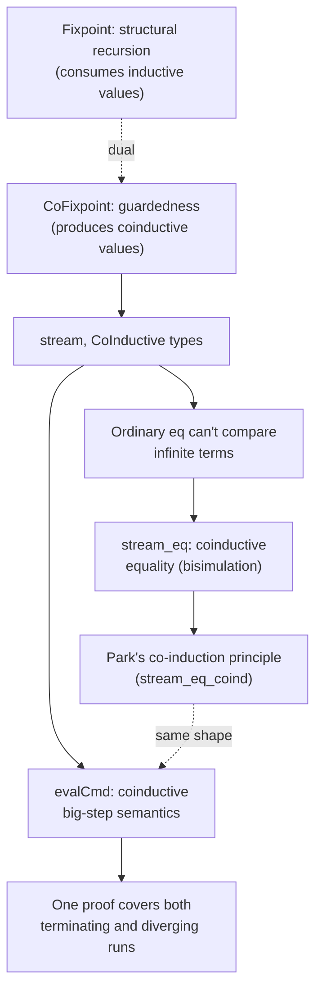

[[book-guidelines|↩ Back to guidelines]]

## What breaks if you just add Haskell-style laziness to Coq?

Haskell programmers build infinite data structures constantly — infinite lists, streams of events, whatever — because every definition in Haskell is implicitly lazy, so "define this value in terms of itself" just works as long as any *finite prefix* of the result can eventually be forced. Coq cannot get away with this casually, and the reason is the same one that forces `Fixpoint` into structural recursion: **Curry–Howard**. In Coq, proofs *are* programs. If Coq let you write unrestricted self-referential definitions the way Haskell does, you could write

```coq
Fixpoint bad (u : unit) : P := bad u.
```

for an arbitrary proposition `P`, and `bad tt` would type-check as a "proof" of `P` — for *any* `P`, including `False`. That single admission would make CIC inconsistent: every proposition becomes provable, and the entire certification enterprise collapses. There's also a more mundane algorithmic cost: tactics like `reflexivity` rely on computation terminating so they can decide term equivalence by just running both sides. Unrestricted recursion reintroduces the halting problem into that decision procedure.

So Coq needs a *disciplined* way to admit infinite data — one that keeps termination-by-construction for ordinary recursive functions while still letting you build (and reason about) things like infinite streams. **Co-[[Inductive-Types|inductive types]]** are that mechanism, and — crucially for how you should read this chapter — they are the *dual* of inductive types in a precise, structural sense: everywhere an inductive type restricts *consumption* (how a `Fixpoint` may recurse on an argument), a co-inductive type restricts *production* (what a `CoFixpoint` may do with its own result).

## Streams: co-recursion instead of recursion

A stream (infinite list) is declared almost exactly like `list`, with one keyword swapped:

```coq
Section stream.
  Variable A : Type.
  CoInductive stream : Type :=
  | Cons : A -> stream -> stream.
End stream.
```

No `Nil` — that's deliberate; leaving it out forces every stream to be genuinely infinite. But you cannot *build* a stream value by ordinary constructor application (that only ever produces finite terms). Building one requires a **`CoFixpoint`** — the production-side dual of `Fixpoint`:

```coq
CoFixpoint zeroes : stream nat := Cons 0 zeroes.
```

This is self-referential in exactly the way that would be an infinite loop as an ordinary `Fixpoint`, but as a `CoFixpoint` it means something different: "the value `zeroes` unfolds, on demand, to `Cons 0 zeroes`" — an equation with a well-defined *infinite* solution, not a runaway computation. You can force any finite prefix of it:

```coq
Fixpoint approx A (s : stream A) (n : nat) : list A :=
  match n with
  | O => nil
  | S n' => match s with Cons h t => h :: approx t n' end
  end.

Eval simpl in approx zeroes 10.
(* = 0 :: 0 :: 0 :: 0 :: 0 :: 0 :: 0 :: 0 :: 0 :: 0 :: nil *)
```

**Grounding (Rust):** the closest everyday analogue is `Iterator` — an `impl Iterator<Item = u32>` that always yields another value on `.next()` without ever terminating is your `stream`; `.take(10).collect()` is exactly `approx s 10`. Rust's borrow checker doesn't enforce *productivity* the way Coq's guardedness condition does (below) — you *can* write an infinite `loop {}` inside an iterator's `next()` and Rust will happily compile it, deferring the failure to runtime hang. Coq refuses to accept the analogous definition at all, at compile time — this is the sharpest difference between "infinite data as a convenience" (Rust, Haskell) and "infinite data as something a proof assistant can reason about soundly" (Coq).

## The guardedness condition: the dual of structural recursion

`Fixpoint` requires every recursive call to be on a *structurally smaller* argument. The dual restriction for `CoFixpoint`, called the **guardedness condition**, requires every co-recursive call to be a **direct argument to a constructor** — nested only inside further constructor calls, `fun`, or `match`, never inside an arbitrary function call.

The simplest violation:

```coq
CoFixpoint looper : stream nat := looper.
(* Error: unguarded recursive call in "looper" *)
```

Coq is right to reject this: if `looper` were accepted, `approx looper 1` would loop forever trying to force even the first element, and the resulting proof-theoretic hole (via Curry–Howard, below) would make co-inductive *proofs* of any proposition possible too. `map` is fine (the recursive call sits directly inside a `Cons`):

```coq
CoFixpoint map (s : stream A) : stream B :=
  match s with Cons h t => Cons (f h) (map t) end.
```

but `filter` is *impossible* to write co-recursively at all — if the predicate rejects every remaining element, there's no way to ever produce a head, so no guarded definition can exist for it.

The subtler cases show the condition is genuinely syntactic, not semantic. This looks intuitively fine — a "stuttering" map defined via `interleave` — but Coq rejects it:

```coq
CoFixpoint map' (s : stream A) : stream B :=
  match s with
  | Cons h t => interleave (Cons (f h) (map' t)) (Cons (f h) (map' t))
  end.
(* Error: unguarded recursive call *)
```

Inlining `interleave`'s definition reveals why: the recursive `map' t` calls end up nested two levels inside `Cons`, not as a *direct* argument — the guardedness checker doesn't look through arbitrary function calls to see that the result is "morally" productive. Coq does perform the check *after* some computational simplification (so trivial identity-wrapping doesn't break guardedness), but a call like `tl (Cons 0 bad)` — which reduces to `bad` itself, an outright infinite loop once inlined — is correctly caught as equivalent to `looper`.

The deeper concept underneath the syntactic rule is **productivity**: a definition is productive if its output can be forced to *any* finite approximation level in finite time. The guardedness condition is a conservative, purely syntactic *sufficient* test for productivity — genuinely productive definitions can still be rejected (as `map'` was, despite denoting a perfectly well-defined transformation), because a more permissive semantic productivity check would be undecidable or at least dangerously easy to get wrong, risking exactly the inconsistency the whole mechanism exists to prevent. This is the same "err toward a simple, checkable syntactic criterion over a powerful, error-prone one" design philosophy you saw with strict positivity for `Inductive` types.

## Why equality of streams needs its own machinery

Two different definitions of "the stream of all ones":

```coq
CoFixpoint ones : stream nat := Cons 1 ones.
Definition ones' := map S zeroes.
```

`Theorem ones_eq : ones = ones'.` is **unprovable** with ordinary `eq` — Coq's `eq` is a fundamentally *finite, syntactic* notion, and there's no finite sequence of reduction steps that identifies these two infinite terms. What you need is a *co-inductive proposition*:

```coq
CoInductive stream_eq : stream A -> stream A -> Prop :=
| Stream_eq : forall h t1 t2,
    stream_eq t1 t2 -> stream_eq (Cons h t1) (Cons h t2).
```

Two streams are `stream_eq` exactly when their heads agree (checked by ordinary finite equality) and their tails are — recursively, permissively — `stream_eq`. This is not "prove all the finitely many facts about the stream"; it's a proof structure that is itself allowed to be infinite, subject to the same guardedness discipline as data.

That discipline bites immediately. The natural first attempt —

```coq
Theorem ones_eq : stream_eq ones ones'.
  cofix ones_eq.
  assumption.
Qed.
(* Error: unguarded recursive call in "ones_eq" *)
```

— looks like a free win (the goal after `cofix` is syntactically identical to the hypothesis just introduced!) but is rejected for exactly the same reason `looper` was: via Curry–Howard, a proof *is* a program, and this "proof" would be a self-referential program with no guardedness — accepting it would let you "prove" any co-inductive theorem by immediate self-reference. `Guarded` is the command that lets you check this mid-proof, before you find out the hard way at `Qed`.

**The `frob` trick.** The actual fix is one of the chapter's more memorable ideas — an identity-looking function that does real work:

```coq
Definition frob A (s : stream A) : stream A :=
  match s with Cons h t => Cons h t end.

Theorem frob_eq : forall A (s : stream A), s = frob s.
  destruct s; reflexivity.
Qed.
```

`frob` looks like it does nothing — and denotationally it *is* the identity — but operationally, wrapping a stream in a `match` forces one step of unfolding. Why does this matter? Because of the **dual reduction rule**: a `Fixpoint` only unfolds once the top-level structure of its *recursive argument* is known (otherwise it would unfold forever); dually, a `CoFixpoint` only unfolds once it is the *discriminee of a match* (otherwise the whole point of laziness — not forcing more than needed — would be defeated, and infinite unfolding could happen during simplification). `rewrite (frob_eq ones)` inserts exactly the `match` needed to trigger that one step of `CoFixpoint` reduction, exposing the `Cons` structure so `simpl` and `constructor` can proceed. This is a direct proof-engineering consequence of the guardedness/laziness discipline, not an arbitrary trick.

## Bisimulation and Park's co-induction principle

Manually invoking `frob` every time is unsatisfying and doesn't scale. The chapter derives a genuine **co-induction principle** — the dual of an ordinary induction principle — to eliminate hand-crafted guardedness games. An induction principle is parameterized over a predicate describing what you're proving as a function of an already-known inductive fact; dually, a **co-induction principle** is parameterized over a relation $R$ that, if it satisfies two closure conditions, is *guaranteed* to imply `stream_eq` for any pair it relates:

```coq
Section stream_eq_coind.
  Variable A : Type.
  Variable R : stream A -> stream A -> Prop.
  Hypothesis Cons_case_hd : forall s1 s2, R s1 s2 -> hd s1 = hd s2.
  Hypothesis Cons_case_tl : forall s1 s2, R s1 s2 -> R (tl s1) (tl s2).

  Theorem stream_eq_coind : forall s1 s2, R s1 s2 -> stream_eq s1 s2.
  (* proved once, by cofix + destruct, guarded via hd/tl instead of frob *)
End stream_eq_coind.
```

The relation $R$ here is exactly a **bisimulation**: a relation on streams that (a) forces equal heads and (b) is *hereditary* — passes its own "R-ness" down to the tails. This is Park's principle (as introduced by Giménez), and it is the coinductive-equality analogue of how ordinary structural induction lets you factor out a recurring proof shape into a reusable lemma. Once `stream_eq_coind` exists, proving `ones = ones'` reduces to *choosing* an $R$ (here, the smallest one: pairs literally equal to `(ones, ones')`) and discharging two side conditions with ordinary tactics like `crush` — no more manual `frob` bookkeeping. The chapter goes further and derives *specialized* principles (`stream_eq_loop` for the common "both streams are their own tails" pattern; `stream_eq_onequant` for goals with a single leading universal quantifier) purely to make the choice of $R$ implicit, culminating in fully automated `induction`-style proofs (`apply stream_eq_onequant; crush; eauto`) for genuinely nontrivial equalities like two different factorial-stream implementations agreeing.

**One sharp warning the chapter is explicit about:** ordinary automation (`auto`, `crush`) can *find* an "unguarded" cofix proof exactly the way it found the bad `ones_eq` attempt above — automation doesn't know about the extra guardedness discipline, so it will happily hand you an invalid proof term that only fails later at `Qed`/`Guarded`. This is a genuine pitfall specific to coinductive proof — always run `Guarded` (or trust `Qed`'s own check) rather than assuming `crush`'s "success" is final.

**Grounding (Lean):** Lean has its own coinductive-type story (built on top of well-founded/guarded recursion machinery in the kernel), and Lean's `Coinductive` support and bisimulation-based equality proofs for structures like `Stream'` follow the identical logical shape — a relation closed under "heads agree, tails stay related" is exactly a bisimulation in Lean too, and Lean's `corec`/`Stream'.corec` plays the same role as `CoFixpoint`. If you're familiar with process calculi or labeled transition systems, this is the *same* bisimulation you'd use to prove two automata or two infinite-state systems behaviorally equivalent — Chlipala's stream equality is the simplest possible instance of a much more general idea in concurrency theory and program equivalence.

## Modeling non-termination itself, co-inductively

The chapter's payoff example ties this directly to **operational semantics**. Define a tiny imperative language (`Assign`, `Seq`, `While`) and ask: what relation should describe "this command evaluates from this state to that state"? An *inductive* big-step relation cannot express non-termination at all — every derivation is necessarily a finite tree, so a genuinely looping `While` program simply has no derivation, and you cannot distinguish "loops forever" from "crashes" or state anything about it.

A **co-inductive big-step semantics** fixes this cleanly: relate a non-terminating execution to *every* possible final state (the co-inductive analogue of "vacuously true" for an infinite object), while a terminating execution is still related to exactly the one correct final state:

```coq
CoInductive evalCmd : vars -> cmd -> vars -> Prop :=
| EvalAssign : forall vs v e, evalCmd vs (Assign v e) (set vs v (evalExp vs e))
| EvalSeq    : forall vs1 vs2 vs3 c1 c2,
    evalCmd vs1 c1 vs2 -> evalCmd vs2 c2 vs3 -> evalCmd vs1 (Seq c1 c2) vs3
| EvalWhileFalse : forall vs e c, evalExp vs e = 0 -> evalCmd vs (While e c) vs
| EvalWhileTrue  : forall vs1 vs2 vs3 e c, evalExp vs1 e <> 0 ->
    evalCmd vs1 c vs2 -> evalCmd vs2 (While e c) vs3 -> evalCmd vs1 (While e c) vs3.
```

Following the same "derive a co-induction principle before you need it" discipline as for `stream_eq`, the chapter builds `evalCmd_coind` and uses it to prove a genuinely useful, realistic theorem: a trivial "$0 + e \rightsquigarrow e$" peephole optimizer (`optExp`/`optCmd`) preserves the *exact* execution behavior of every program — terminating or not — under this semantics, in both directions (`optCmd_correct1`/`optCmd_correct2`). This is a direct, worked instance of the connection this vault's project cares about most: **co-inductive operational semantics is what lets one soundness proof uniformly cover both terminating and diverging executions**, which is exactly the property you need if a verifier's soundness argument must not silently assume termination.

## Where this leads



Coinductive types resurface directly in Chapter 7 ("[[Techniques-for-General-Recursion|Techniques for General Recursion]]"), where one of the surveyed non-termination monads (`comp`, Megacz's proposal) is itself built from a co-inductive type, subject to the same guardedness discipline explored here. More broadly, this chapter is the cleanest illustration in the whole book of "inductive and coinductive reasoning are exact duals" — a fact you'll want on hand whenever you're deciding whether a specification calls for a *terminating* proof obligation (induction) or a *productive* one (co-induction): a compiler's soundness proof over terminating executions is induction; a soundness proof that must also cover looping programs, as with `evalCmd`, is coinduction. For a verifier whose soundness argument needs to hold even for non-terminating target programs (a realistic requirement once you support arbitrary loops or recursion), this chapter's `evalCmd` pattern — co-inductive big-step semantics plus a derived co-induction principle — is the direct template to reuse, connecting to `operational semantics` in the Type Theory focus area's required conceptual connections.
