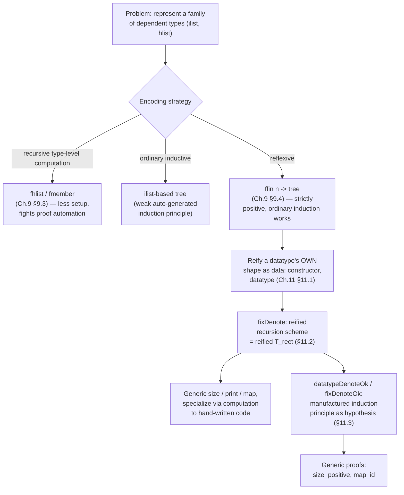

[[book-guidelines|↩ Back to guidelines]]

## What problem is generic programming actually solving here?

Haskell's `deriving` clause and ML's parametric modules both give you *some* code reuse across types, but both stop at ad-hoc code generation or type-parameterization — neither lets you write one function whose body genuinely inspects "what constructors does this type have, and what shape does each one take" and computes accordingly. Chlipala's claim, and the payoff of this chapter, is that CIC's own expressive power is enough to do this *without any special compiler support*: you write an ordinary Coq datatype whose values *represent* other datatypes, and then write ordinary Coq functions that pattern-match on that representation. No macros, no `deriving`, no external code generator — the "generic function" is just a regular dependently typed function, and Coq's own reduction rules specialize it to the exact code you'd have written by hand for each concrete type.

This matters for more than pretty-printing. It's a genuine instance of *metaprogramming inside the object language*: the book takes a type's own structure and reifies it as first-class data, then writes programs that consume that data. That is exactly the move an elaborator makes when it needs to reason about a type's shape generically — deriving equality decision procedures, generating an eliminator, or generating a serializer, all without special-casing the type. If you are building a meta-programming elaborator, this chapter is worth reading as a worked example of "represent structure as data, write generic code against the representation, get concrete code for free via computation" — the same discipline that would let your elaborator auto-derive an eliminator or auto-generate a well-formedness checker for an arbitrary user-declared type.

## Getting there: two failed attempts, then reflexive encoding (§9.3–9.4)

Before Chapter 11's clean reification story, Chapter 9 works through a decision that has to be made *before* generic programming becomes possible at all: how do you represent a family of dependent data structures (length-indexed lists, heterogeneous lists) in the first place? There are three strategies on the table, and their tradeoffs directly motivate Chapter 11's choice.

**Recursive type-level computation.** Instead of a separate inductive family `ilist : nat -> Set` indexed by length, define the type *by recursion on the index*:

```coq
Fixpoint fhlist (ls : list A) : Type :=
  match ls with
    | nil => unit
    | x :: ls' => B x × fhlist ls'
  end%type.

Fixpoint fmember (ls : list A) : Type :=
  match ls with
    | nil => Empty_set
    | x :: ls' => (x = elm) + fmember ls'
  end%type.
```

`fhlist` computes the *type itself* by recursion — an empty list of types denotes `unit`, and a cons denotes a product. `fmember` is the recursively-computed analogue of "is a member of this list," represented as a sum type: either a proof that the head equals the searched-for element, or a proof of membership further down the tail. This buys you *automatically inferred* match annotations — no fancy `in`/`return`/`as` clauses needed — because the type family's shape is transparent to `Fixpoint`'s own unfolding.

The catch surfaces immediately in `fhget`, the lookup function: a naive definition fails to type-check because `fst mls` isn't known to have the right type in the `inl` branch. The fix is to pattern-match on the equality proof itself:

```coq
| inl pf => match pf with
              | eq_refl => fst mls
            end
```

This works because of how `eq` is actually defined — `Inductive eq (A : Type) (x : A) : A -> Prop := eq_refl : x = x`. In a proposition `x = y`, `x` is a *parameter* and `y` is a regular index; the type of `eq_refl` forces `y` to be `x`. So *inside* a match on an `eq_refl` proof, occurrences of `y` in the surrounding context get replaced by `x` for typing purposes — the type-checker literally learns the equality by destructuring the proof. (This idiom recurs constantly in dependently typed Coq code and is worth internalizing now — you will meet it again, formalized in depth, in "[[Reasoning-About-Equality-Proofs|Reasoning About Equality Proofs]].")

**The cost of recursive types**, per §9.5's own closing comparison: they need less initial implementation effort than ordinary inductive families, but they interact poorly with proof automation — `simpl` (and by extension `crush`) can be "overzealous," unfolding a recursively-defined type in unhelpful ways, and the recursive definition only applies when a value's *skeleton* is fully determined by its index (works for lists, fails for e.g. arbitrary trees whose shape isn't index-determined).

**Ordinary [[Inductive-Types|inductive types]]**, by contrast, are "the most pleasant to work with" once helper lemmas exist, because Coq's tactic support is specialized for them — but that specialization has to be earned by writing those helper lemmas and match annotations by hand first.

**The reflexive-encoding escape hatch.** Suppose you want a tree type with variable-arity nodes — each `Node` carries some number `n` of children. The obvious encoding uses `ilist` (an ordinary indexed inductive list):

```coq
Inductive tree : Set :=
| Leaf : A -> tree
| Node : forall n, ilist tree n -> tree.
```

This type-checks, but its auto-generated induction principle is *useless* — for the `Node` case it supplies no inductive hypothesis at all, the same weak-induction-principle problem Chapter 3 raised for nested inductive types. Trying the recursive-type-level-computation alternative (`filist` instead of `ilist`) doesn't even type-check:

```
Error: Non strictly positive occurrence of "tree" in
 "forall n : nat, filist tree n -> tree"
```

— because `filist` was defined by recursion, Coq's strict-positivity checker can't see through it the way it can see through a genuine nested inductive type. The fix is a third strategy: **represent the children not as a list, but as a function from a bounded index type to children**:

```coq
Inductive tree : Set :=
| Leaf : A -> tree
| Node : forall n, (ffin n -> tree) -> tree.
```

A `Node`'s `n` children are `ffin n -> tree` — isomorphic in content to an `ilist` of length `n`, but represented reflexively (as a function) rather than inductively (as a list of cons-cells). With this change, `sum`/`inc`-style recursive functions over trees, and their correctness proofs (`sum_inc : forall t, sum (inc t) >= sum t`), go through by *ordinary structural induction* — no custom induction principle needed, because the type is genuinely, strictly-positively inductive again. As a bonus, some operations (like `inc`) become *direct* implementations with no auxiliary helper function at all — reflexive encodings often admit non-recursive implementations of operations that a plain inductive encoding would force through a recursive helper.

**Grounding (Rust):** none of Rust's three analogues line up perfectly, which is itself instructive. An `enum Tree<A> { Leaf(A), Node(Vec<Tree<A>>) }` is the direct `ilist`-style analogue — dynamically-sized, no length tracked in the type. A fixed-arity `Node([Box<Tree<A>>; N])` with a const generic gets you compile-time-known arity, closer to `ilist`'s dependent length, but still nothing like "the children are a total function from a finite index set," because Rust has no type-level computation flexible enough to reify "structural recursion on an index" the way `filist` does. This is a case where the *reason* Coq needs the reflexive trick — the strict-positivity checker rejecting `filist`-inside-`tree` — has literally no Rust counterpart, because Rust's `enum`s don't have a strict-positivity discipline to violate in the first place; the analogous soundness concern in Rust would show up as an infinite-size type error instead, a different failure mode entirely.

## Reifying datatypes as data (§11.1)

Chapter 11 makes the generic-programming idea explicit and clean. The core move: define an ordinary Coq inductive type whose values *are syntactic representations of other datatypes' shapes*.

```coq
Record constructor : Type := Con {
  nonrecursive : Type;
  recursive : nat
}.
Definition datatype := list constructor.
```

A `constructor` bundles a type `nonrecursive` (tupling together all of a constructor's non-recursive argument types — `unit` for none, `A × B` for two, etc.) with a count `recursive` of same-type recursive arguments. A `datatype` is just a list of these. Concretely:

```coq
Definition Empty_set_dt : datatype := nil.
Definition unit_dt : datatype := Con unit 0 :: nil.
Definition bool_dt : datatype := Con unit 0 :: Con unit 0 :: nil.
Definition nat_dt : datatype := Con unit 0 :: Con unit 1 :: nil.
Definition list_dt (A : Type) : datatype := Con unit 0 :: Con A 1 :: nil.
Definition tree_dt (A : Type) : datatype := Con A 0 :: Con unit 2 :: nil.
```

Read `nat_dt` as literally spelling out `nat`'s two constructors: `O` (no non-recursive data, 0 recursive arguments) and `S` (no non-recursive data, 1 recursive argument). Type parameters aren't supported directly in the `datatype` syntax, so they're handled "at the meta level" — `list_dt` and `tree_dt` are ordinary Coq *functions* from a type `A` to a `datatype`, one level up from the object-level representation itself.

A representation alone is just data — nothing yet connects `nat_dt` to the real `nat`. That connection is **evidence**, itself represented as a heterogeneous list (recall `hlist` from Chapter 9's §9.2):

```coq
Definition constructorDenote (c : constructor) :=
  nonrecursive c -> ilist T (recursive c) -> T.
Definition datatypeDenote := hlist constructorDenote.
```

`constructorDenote c` says: a real implementation of the constructor `c` is a function taking its non-recursive payload plus a length-indexed list (`ilist`, from Chapter 8) of already-produced recursive results, and producing a `T`. `datatypeDenote` collects one such function per constructor, as an `hlist` — because different constructors generally have *different* non-recursive-argument types, an ordinary homogeneous list can't hold them all; this is precisely why Chapter 8/9's `hlist` machinery is a prerequisite here, not incidental. A `datatypeDenote T nat_dt` value is thus a length-2 heterogeneous list whose first entry builds `O`s and whose second builds `S`s — a first-class, inspectable stand-in for "the constructors of `nat`."

## Recursion schemes as reified induction principles (§11.2)

The payoff: a generic recursor. `T_rect` — the induction/recursion principle Coq auto-generates for every `Inductive T` — is exactly the shape this section reifies as ordinary data instead of a kernel-baked eliminator:

```coq
Definition fixDenote (T : Type) (dt : datatype) :=
  forall (R : Type), datatypeDenote R dt -> (T -> R).
```

Read this as: "given a return type `R`, and one function-case per constructor (each producing an `R` instead of the original `T`, i.e. `datatypeDenote R dt` rather than `datatypeDenote T dt`), produce a function `T -> R`." This is a first-class value playing the role of a fold/catamorphism, generic across the represented datatype.

Concretely, a *generic size function* — count how many constructors were used to build a value — is written once, entirely independent of which datatype it's later specialized to:

```coq
Definition size T dt (fx : fixDenote T dt) : T -> nat :=
  fx nat (hmake (B := constructorDenote nat) (fun _ _ r => foldr plus 1 r) dt).
```

`hmake` (a "map alternative that goes from a regular list to an `hlist`") builds one identical case — "sum the recursive results, add 1 for the current constructor" — for *every* constructor, regardless of the concrete datatype. What makes this genuinely generic-*for-free*, rather than just polymorphic, is what happens when you specialize and evaluate: `Eval compute in size nat_fix` normalizes, via CIC's ordinary reduction rules, to *exactly* the hand-written recursive size function for `nat` — no residual machinery, no hidden indirection layer left over. The same holds for `size bool_fix`, `size list_fix`, `size tree_fix`: each specializes down to precisely the function you'd have written directly. This is the deepest sense in which "we need no special language support" (the chapter's opening claim) is true: type-level Haskell tricks or Rust derive-macros produce generic code as a *compile-time textual expansion*; here, the genericity survives as an ordinary runtime/proof-time value, and specialization is just computation, checkable and re-derivable by the same kernel that checks everything else.

The same pattern (`hmap` instead of `hmake`, since now you're transforming an *existing* per-constructor structure rather than building one from scratch) yields a generic pretty-printer (§11.2.1) and a generic `map` (§11.2.2) — the latter specializing, for `nat`, to a function where `map_nat S n` computes `2n + 1`, because the "apply `S` to every level, including the base `O`" mapping touches every constructor application in a `nat`'s unary representation, not just its "leaves."

**Grounding (Rust):** `#[derive(Debug)]` is the closest everyday analogue, but the comparison is instructive precisely because of where it breaks down. A `derive` macro runs at *compile time*, over syntax, and expands to *new, separately-typechecked source code* per type — the genericity is a metaprogram, gone by the time you have a binary. Coq's `fixDenote`-based `size` is a genuine *value* of type `forall T dt, fixDenote T dt -> T -> nat` that exists at once, generically, and is only *reduced* — never re-typechecked from scratch — when specialized to a concrete `dt`. If you ported this idea to a Rust-hosted verifier, the honest translation isn't a proc macro; it's closer to a trait object or a generic function parameterized over a runtime descriptor of a type's shape (a `TypeDescriptor` value passed as data), because the whole point here is that the "generic recursion scheme" is itself first-class data your other code can inspect, compose, and prove properties about — which a macro-expanded `impl` block cannot be.

**Grounding (Lean):** this is structurally the same move Lean's kernel makes when it auto-generates `T.rec`/`T.recOn` for every inductive `T` — the difference is only *where* the generic eliminator lives. Lean's kernel bakes `T.rec` in as a privileged, compiler-generated primitive per inductive declaration; CPDT's `fixDenote` reifies the *same idea* — "one case per constructor, parameterized over a return type" — as ordinary user-level data that you construct, inspect, and reuse across types, rather than something the kernel manufactures once per declaration. If you were writing an elaborator that needs to *synthesize* eliminators generically (e.g., deriving a decision procedure or a serializer for an arbitrary user datatype without hardcoding per-type logic), this chapter's `datatype`/`fixDenote` pair is close to a minimal viable design for "a generic representation of inductive structure your metaprogram can fold over," worth citing by name against Lean's own `Lean.Meta.mkRecursorInfo`-style reflection.

## Generic proofs about generic programs (§11.3)

The genuinely new possibility a *proof assistant* adds on top of ordinary generic programming: you can prove theorems that hold of *every* instantiation of a generic function, at once, rather than re-proving the same fact per concrete type. But this requires supplying, alongside the `datatype`/`fixDenote` evidence, a **well-formedness condition** asserting that the evidence really behaves the way an inductive definition should:

```coq
Definition datatypeDenoteOk :=
  forall P : T -> Prop,
    (forall c (m : member c dt) (x : nonrecursive c) (r : ilist T (recursive c)),
      (forall i : fin (recursive c), P (get r i))
      -> P ((hget dd m) x r))
    -> forall v, P v.
```

Read this carefully: it says exactly "the ordinary induction principle holds, with respect to the constructors as reified in `dd`" — quantify over which constructor (`m`), over its arguments (`x`, `r`), assume the property holds of every recursive sub-result (`get r i`), conclude it for the constructor application, and (the outer conclusion) get it for all `v : T`. This is literally *manufacturing an induction principle as a hypothesis*, because ordinary `induction` doesn't know `T` is inductive — from Coq's perspective, `T` is just some type, and `dd`/`fx` are just some functions over it. The companion condition, `fixDenoteOk`, asserts the recursion scheme itself computes correctly on every constructor application (its left/right sides are exactly the equation a hand-written `Fixpoint` would satisfy by definitional unfolding, but here it has to be supplied as an explicit hypothesis since `fx` isn't literally defined by structural recursion on `T`).

Given these two well-formedness witnesses, `size_positive` (every generic size is `> 0`) is proved not by `induction` but by `pattern v; apply dok` — using `datatypeDenoteOk` *as* the induction principle, after `pattern` massages the goal into the exact shape `dok`'s conclusion expects (plain `apply dok` fails outright with a unification error, because matching requires more than first-order unification). More strikingly, `map_id` (generic `map` applied to the identity is the identity) needs *two* nested inductions: the outer one from `dok` over the value of type `T`, and — after `f_equal` reduces the goal to an equality of `hlist`s of recursive results — an *inner* structural induction over the heterogeneous list `r` itself, since the outer induction hypothesis only says something about the constructor's own recursive-call results, not about the tuple bookkeeping that assembles them.

This double-layered proof structure is a direct, hands-on preview of a pattern that recurs constantly once you're proving properties of anything built from heterogeneous lists (Chapter 9's `hlist`, Chapter 17's typed environments): the "outer" structural fact and the "per-recursive-slot" fact often need separate inductive arguments, because one induction principle only ever tells you about one syntactic layer.

## Where this leads



This chapter is the closest thing in the whole book to a rehearsal for building a meta-programming elaborator that reasons *about* types rather than just *within* them: reifying structure as data, writing generic folds over the reified structure, and proving theorems about the generic folds by manufacturing the induction principle the reification is standing in for. When your own compiler needs to auto-derive an eliminator, a well-formedness checker, or a decidable-equality instance for an arbitrary user-declared refinement type, this `datatype`/`fixDenote`/`datatypeDenoteOk` triple is a concrete design to study — and the recursive-vs-ordinary-vs-reflexive encoding tradeoff from Chapter 9 §9.5 is the thing to reach for whenever a nested or variable-arity structure fights the strict-positivity checker the way the naive `tree` type did here.
