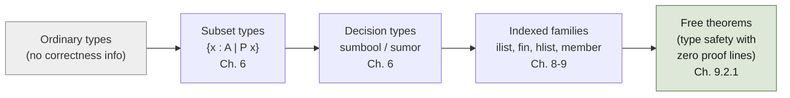

[[book-guidelines|↩ Back to guidelines]]

## The spectrum: how far can a type carry a proof obligation?

This is the widest-ranging topic in the book because it *is* the book's central engineering thesis, run end to end across three chapters: **the more information you push into a type, the less you have to prove by hand.** The three chapters trace a single spectrum, from "barely dependent" to "fully dependent":



At the left end, a type says nothing about correctness — you write the program, then write a separate proof about it ("classical program verification," as Chlipala calls it). At the right end, the type *is* the specification, tight enough that a well-typed inhabitant is automatically correct — a "free theorem" in the sense that you get it from the type checker, at zero proof-writing cost. Everything in this article is about the mechanisms that move you rightward along that spectrum, and — critically for anyone building a refinement-type checker — about exactly where each mechanism's expressive power runs out.

## Subset types: pairing a value with a proof (Chapter 6)

Start with the natural-number predecessor function. The standard-library version, `pred 0 = 0`, is a hack — there's no principled answer for the predecessor of zero, so it just picks one. The dependent-types fix is to **refuse to accept the vacuous input in the first place**:

```
Definition pred_strong1 (n : nat) : n > 0 -> nat :=
  match n with
    | O => fun pf : 0 > 0 => match zgtz pf with end
    | S n' => fun _ => n'
  end.
```

Here `n > 0 -> nat` is a **dependent function type**: the type of the *second* argument (a proof) doesn't depend on anything interesting, but the point is that the function's very type now statically rules out calling it on 0 — you cannot even *construct* a call unless you first produce a proof that `n > 0`. The `O` branch is unreachable by construction, dispatched by deriving `False` from a proof of `0 > 0` and eliminating it.

This immediately surfaces the chapter's first hard mechanical lesson: Coq's `match` **does not propagate scope information into already-bound variables**. Binding the proof argument eagerly and then trying to use it inside a `match` on `n` fails to type-check — the type checker has no way to know, inside the `O` branch, that the ambient proof specializes to `0 > 0`. The fix is to *delay* binding the proof past the match, so a `return` annotation can express the dependency: `match n return n > 0 -> nat with ...`. This is the earliest appearance of a theme that recurs constantly in dependently typed Coq: **you can only make a match's result type depend on the discriminee — never directly refine the type of an already-scoped free variable.** (The "convoy pattern," below, is the general workaround.)

The standard-library packaging of "value plus proof about it" is the **subset type**, `sig`:

```coq
Inductive sig (A : Type) (P : A -> Prop) : Type :=
  exist : forall x : A, P x -> sig P.
Notation "{ x : A | P }" := sig (fun x : A => P).
```

`sig` is the **Curry–Howard twin of `ex`** (the existential quantifier) — same shape, different universe. `ex` lives in `Prop` and gets erased entirely on extraction; `sig` lives in `Type` and its *value component* survives extraction (the proof component is still erased — Coq's proof-erasure optimization even collapses the resulting single-field record entirely, so `{n : nat | n > 0} -> nat` extracts to literally the same OCaml as an untyped `nat -> nat`). This is the concrete mechanism behind the book's opening claim from "[[The-Coq-Proof-Assistant-and-Certified-Programming|The Coq Proof Assistant and Certified Programming]]": *dependent types let you write certified programs without writing anything that looks like a proof* — the proof is there in the source, but it costs nothing at runtime and, with the right tooling, not much to write either.

Building values of subset types by hand (`exist ...`) is verbose, so the chapter introduces **`refine`**: pass a partially-complete term with `_` holes, and each hole Coq can't infer becomes a proof obligation:

```coq
Definition pred_strong4 : forall n : nat, n > 0 -> {m : nat | n = S m}.
  refine (fun n =>
    match n with
      | O => fun _ => False_rec _ _
      | S n' => fun _ => exist _ n' _
    end); crush.
Defined.
```

Note **`Defined`, not `Qed`**. This is a hard rule that recurs throughout dependently typed programming: `Qed` marks a definition *opaque* (its internals are hidden and can never be unfolded/computed with again); `Defined` marks it *transparent*. Since `pred_strong4` is a *function* meant to be run, not just a theorem meant to be cited, it must stay unfoldable — `Qed`-ing it would make it permanently stuck, uncomputable. This distinction resurfaces later (Chapter 7's `Fix` combinator requires the same discipline) and is one of the sharpest edges a newcomer hits: proofs *of propositions* are usually fine as `Qed`; proofs *that are also programs* must be `Defined`.

Layering notations on top (`!` for the absurd case, `[e]` for `exist e _`) collapses the whole thing to code that reads almost like an ML program with an unusually precise type signature — this is the payoff the chapter is building toward: *dependent types cost almost nothing in code volume once the surrounding notation infrastructure exists.*

## Decidability as a type: `sumbool` and `sumor`

Not every fact worth encoding is a "does the input satisfy P" question with only one interesting outcome — sometimes you need to *distinguish* two propositions, and know structurally which one held. `sumbool` is exactly a decision procedure's return type:

```coq
Inductive sumbool (A B : Prop) : Set := left : A -> {A}+{B} | right : B -> {A}+{B}.
```

A function of type `forall n m, {n = m} + {n <> m}` is a **certified equality decision procedure**: whichever branch it returns, that branch carries a proof. Coq generalizes `if` to work on *any* two-constructor inductive type, so `sumbool`-returning functions slot directly into ordinary-looking conditional code (`if eq_nat_dec x y then ... else ...`), while the proof of whichever case fired is available inside that branch — this is what makes `sumbool`-based code compose as fluently as plain booleans while remaining fully verified. `decide equality` automates the common case of proving decidable equality outright.

`sumor` extends the same idea to a function that might simply fail rather than choose between two live options: `A + {B}` (`inleft`/`inright`) pairs "a real answer of type A" with "a proof that no answer exists." This lets a *maximally expressive* possibly-failing predecessor be typed as `forall n, {m : nat | n = S m} + {n = 0}` — the type itself states there is no other way the function could fail. Compare this to the weaker `maybe` type (`Unknown`/`Found`, a `sig` variant permitting failure with *no obligation to prove failure was actually necessary*) — `maybe` lets an implementation cheat by always returning `Unknown`; `sumor` doesn't.

**Monadic notations** (`x <- e1 ; e2` for `maybe`, `x <-- e1 ; e2` for `sumor`) are the icing: they let you *compose* richly typed, possibly-failing computations without manually re-deriving the case analysis at every step — directly the "Maybe monad" idiom from Haskell, here carrying live correctness proofs through every bind. The chapter closes with a certified type checker (`typeCheck : forall e, {{t | hasType e t}}`, upgraded to a `sumor` version once a determinism lemma `hasType_det` proves an expression has at most one type) — a working demonstration that *the type checker's own correctness proof is just its type signature*.

**Grounding (Rust):** `sig`/`{x:A|P}` is exactly a Rust smart-constructor pattern taken to its logical conclusion — `NonZeroU32` *is* a degenerate subset type (base type `u32` refined by "not equal to 0"), except Rust's version has no user-extensible predicate language: you get the handful of refinements the standard library shipped, not `{x : A | P}` for arbitrary `P`. `sumbool`/`sumor` map onto `Result<T, ProofOfFailure>` where the error variant is itself a witness, not just a tag — the Rust idiom of "parse, don't validate" (returning a richer type from a fallible constructor rather than a bare bool) is the informal cousin of what `sumor` does formally.

## Indexed families: when the index carries real information (Chapters 8–9)

Subset types refine a type by *attaching* a predicate; **indexed [[Inductive-Types|inductive types]]** go further and let the index *itself* determine the type's shape at each point — the length-indexed list `ilist`, the standard motivating example:

```coq
Inductive ilist (A : Set) : nat -> Set :=
| Nil  : ilist A O
| Cons : forall n, A -> ilist A n -> ilist A (S n).
```

The type of `ilist A n` is different for every `n`; `Nil`'s type is `ilist A O`, and `Cons` bumps the index. This is real dependent typing — the length index can be a genuinely runtime-computed number, not a compile-time-only annotation ("breaking the phase distinction" between compile time and run time, in the book's phrase — the same phrase used to distinguish true dependent types from stratified type systems that merely *look* dependent but erase cleanly).

The `fin n` type family (isomorphic to `{m : nat | m < n}`, but built as its own indexed inductive type rather than as a subset type) gives you a **statically bounded index**:

```coq
Inductive fin : nat -> Set :=
| First : forall n, fin (S n)
| Next  : forall n, fin n -> fin (S n).
```

A `get : ilist A n -> fin n -> A` function is then *impossible to call out of bounds* — there is no value of `fin 0`, so calling `get` on an empty list simply doesn't type-check. This is the payoff promised back in "The Coq Proof Assistant and Certified Programming": *array-bounds safety pushed fully into the type system.*

### The one rule of dependent pattern matching

Getting `get` to actually type-check is where Chapter 8's real content lives, and it's worth internalizing as a *mechanical, non-mysterious* procedure (the book is emphatic about this — "the point of this section is to cut off [the idea that Coq performs open-ended magic] right now!"). A dependent match has the shape

```
match E as y in (T x1 ... xn) return U with
  | C z1 ... zm => B
  | ...
end
```

and the rule is exactly this: **the expected type of each case body `B` is `U` with `y` replaced by the case's constructor pattern and each `xi` replaced by what that pattern forces it to be.** `in` binds names for the *indices* of the discriminee's type (not its parameters — those must be `_`), `as` binds a name for the discriminee's value, and `return` states the result type in terms of both. That's the entire rule; no other refinement mechanism exists — in particular, **there is no way to refine the type of a free variable already in scope from inside a match on something else.** Every technique in the rest of the chapter (and the book) is a way of encoding indirect refinement in terms of just these three annotations.

The direct symptom of hitting this rule's edge: `get n (ls : ilist A n)` needs to case on *both* `ls` and the `fin n` index together, but `in` clauses only allow **variables**, never arbitrary terms like `pred n'` in argument position of an already-partially-matched type — a restriction tied directly to the **undecidability of higher-order unification** (a `pred n'`-shaped index position would require solving a higher-order unification problem in general to check the match). This is why the workaround exists.

### The convoy pattern

The **convoy pattern** is the book's general recipe for the case above: since you can't directly refine a second variable's type from inside a match on the first, you instead make the match's *result type* a function type over that second variable, so a `return` clause can state the needed relationship, and then immediately apply the whole match to the "old" version of that variable:

```coq
match idx in fin n' return (fin (pred n') -> A) -> A with
  | First    => fun _ => x
  | Next idx' => fun get_ls' => get_ls' idx'
end (get ls')
```

The subtlety that catches people the first time: `get ls'` (a *partial application*, not `ls'` alone) has to be what's convoy-bound, because otherwise the *termination checker* — not the type checker — loses track of the fact that the recursive call's implicit structural argument is genuinely getting smaller through the local binding. Type-checking and termination-checking are different passes with different blind spots, and the convoy pattern has to satisfy both simultaneously.

The convoy pattern reappears, more elaborately, in the **dependently typed red-black tree** development (`rbtree : color -> nat -> Set`, indexed by root color and black-depth so that red-black balance is a type-level invariant, not a separately-proved property): the `balance1`/`balance2` rebalancing functions convoy-bind *entire subtrees* whose color is not yet known, threading the connection between sibling subtrees through nested `match ... in ... return (rbtree c2 n -> {c : color & rbtree c (S n)})` expressions. The tree's balance is then a "for free" theorem — the `depth_min`/`depth_max`/`balanced` lemmas establish it, but only because the *type itself* already made an unbalanced tree unconstructible; the lemmas are about *quantitative* bounds, not about ruling out an entire invariant-violating universe of trees the type already excludes.

**Grounding (Rust → Lean):** Rust's `enum` can express `ilist`-style length-indexing only through const generics for *compile-time-known* lengths (`[T; N]`), and cannot do dependent pattern matching at all — there is no Rust construct where a `match` arm's *result type* depends on which arm fired. This is precisely the gap between Rust's parametric-but-non-dependent generics and Coq's genuine `Π`-types. Lean, by contrast, has the identical `motive`-based dependent-match machinery — Lean's `match` desugars to applications of a recursor with an explicit `motive` argument that plays exactly the role of the book's `return` clause, and Lean's own `Fin n` type is the direct descendant of `fin n` here (constructors `Fin.mk`/pattern matching over `⟨val, isLt⟩` instead of `First`/`Next`, but the same "index guarantees boundedness" idea). If you're building a refinement-type elaborator, this "one rule" *is* the algorithm your dependent-match/motive-inference code has to implement — get the substitution-into-the-return-clause step wrong and you get exactly the class of "cannot unify" errors the book spends several pages teaching the reader to read past.

## Heterogeneous lists and type safety "for free"

`hlist`, from Chapter 9, generalizes `ilist` one step further: instead of indexing by a *length*, index by a **type-level list describing each element's type**:

```coq
Inductive hlist (A : Type) (B : A -> Type) : list A -> Type :=
| HNil  : hlist B nil
| HCons : forall x ls, B x -> hlist B ls -> hlist B (x :: ls).
```

and a matching selector family, `member`, that (unlike ordinary list-membership, a `Prop`) lives in `Type` so it can be *computationally decomposed*, not just cited as evidence:

```coq
Inductive member (A : Type) (elm : A) : list A -> Type :=
| HFirst : forall ls, member elm (elm :: ls)
| HNext  : forall x ls, member elm ls -> member elm (x :: ls).
```

The payoff is the chapter's single most important demonstration: a **simply typed lambda calculus interpreter with zero proof obligations.** Expressions are indexed directly by their type and their free-variable-type context (`exp ts t`), variables are represented as `member t ts` values (a de Bruijn index *typed* by which entry of the context it refers to), and the whole interpreter is:

```coq
Fixpoint expDenote ts t (e : exp ts t) : hlist typeDenote ts -> typeDenote t :=
  match e with
    | Const     => fun _ => tt
    | Var mem   => fun s => hget s mem
    | App e1 e2 => fun s => (expDenote e1 s) (expDenote e2 s)
    | Abs e'    => fun s => fun x => expDenote e' (HCons x s)
  end.
```

No substitution lemma. No type-safety theorem. No progress/preservation proof. **Type safety, termination, and every other CIC metatheorem apply automatically**, because the interpreter is a well-typed CIC term and CIC already has those properties (strong normalization, from "The Coq Proof Assistant and Certified Programming"). This is the strongest form of "dependent types eliminate proof obligations" in the whole book: the correctness argument isn't *shortened* by dependent types here, it's **inherited wholesale from the metatheory of the host logic** — a deep embedding of an object language whose typing discipline is expressed entirely as index structure, rather than as a separately-stated-and-proved relation.

## Recursive vs. reflexive vs. ordinary inductive: three ways to build the same structure

Chapter 9 closes (§9.3–9.5) by showing that `ilist`/`fin`/`hlist`/`member` are not the *only* way to get this functionality — you can instead define the same structures by **recursion on the index** (type-level computation, prefixed `f` — `filist`, `ffin`, `fhlist`, `fmember`), collapsing to `unit`/products/`Empty_set`/sums at each step rather than declaring new constructors. This needs far less setup (`get`/`hget` need only one dependent match, often auto-inferred) but interacts worse with proof automation — `simpl` can be "overzealous" simplifying recursive-type-based code in ways that make subsequent tactics fail to find the shape they expect, and this style only applies when the index *fully determines* the value's skeleton.

A third option, **reflexive (function-indexed) encodings**, represents "children" as a *function* from a bounded index type to subtrees rather than as an inductive or recursive list — useful specifically when the natural inductive or recursive encoding would fail Coq's **strict positivity requirement** (from "Inductive Types") because it needs to nest a nested inductive type in a way that isn't structurally obvious to the positivity checker. Reflexive encodings are rarer and can produce less readable code, but they sidestep the weak-auto-generated-induction-principle problem that plagues naively nested inductive types, and sometimes admit genuinely simpler direct implementations.

The takeaway for a compiler/elaborator project: **there is no single canonical way to represent an indexed data structure** — ordinary inductive types integrate best with existing tactics and are the default; recursive (type-computation) encodings trade automation-friendliness for less boilerplate; reflexive encodings are a specialized escape hatch for positivity trouble. A refinement-type checker's internal AST representation will face exactly this choice for any type-indexed intermediate representation (e.g., a well-typed-by-construction core IR), and the right answer depends on which downstream operations (proof search vs. raw computation vs. induction) need to be ergonomic.

## The regular-expression matcher and universe-size mechanics

Chapter 8 closes with a certified regex matcher whose main lesson is not about pattern matching but about **`Set` vs. `Type`**, previewing "[[Universes-and-Axioms|Universes and Axioms]]": a first attempt at

```coq
Inductive regexp : (string -> Prop) -> Set := ...
```

is rejected — `Coq error: Large non-propositional inductive types must be in Type` — because a constructor argument (`string -> Prop`) itself has type `Type`, making this a **"large" inductive type**, and large inductive types are barred from `Set` specifically because allowing them there leads to contradictions when combined with certain classical-logic axioms. The fix is mechanical (move `regexp` into `Type`), but the *reason* is a first hint of the universe-stratification discipline that "Universes and Axioms" develops fully — a preview worth flagging now because it shows the "just move it to Type" fix is not cosmetic, it's tracking a real soundness boundary.

## Where this leads

This topic is the load-bearing prerequisite for both major Focus Areas this vault is tracking. For **type-theory**: `sig`, `sumbool`/`sumor`, and indexed families (`ilist`/`fin`/`hlist`/`member`) are the direct ancestors of a refinement-type surface language's core representation choices — a Σ-type in the elaborator's internal term language is exactly `sig` generalized past `Prop`-valued predicates, and the "one rule of dependent pattern matching" is precisely the motive-inference algorithm a bidirectional type checker's `match`/`case` elaboration has to implement, whether or not it's phrased that way. For **automated-reasoning**: `sumbool`/`sumor`-returning decision procedures composed via `refine` and monadic notations are a worked example of proof-producing (certifying) code — a certified type checker `typeCheck : forall e, {{t | hasType e t}}` is a miniature version of exactly the kind of proof-carrying-code architecture a verification toolchain's constraint-checking core needs to produce. The convoy pattern specifically is worth remembering by name: any elaborator maintaining invariants across sibling subterms whose types are mutually constrained (e.g., unifying the domain type of one metavariable against the range type of another) will hit the same "can't refine a second variable's type from a match on the first" wall this pattern exists to route around.
