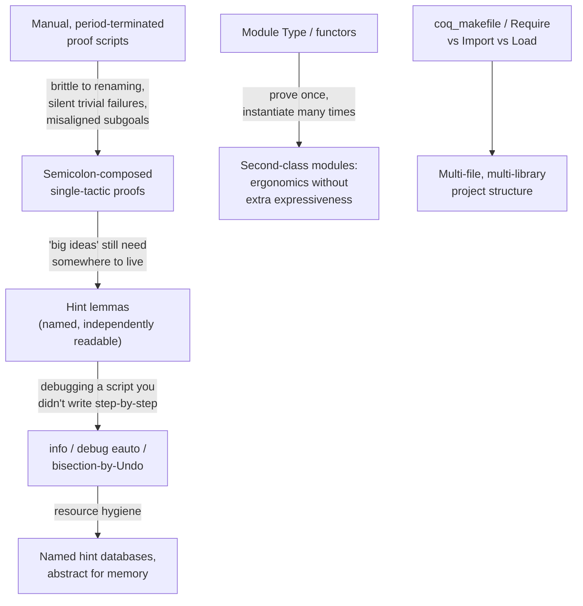

[[book-guidelines|↩ Back to guidelines]]

## Why does a proof-scripting style even matter?

Every earlier chapter in this book showed you *how* to build a proof or a piece of automation. This chapter asks a different question: once you have hundreds or thousands of such proofs, what keeps the development from collapsing under its own weight? The answer Chlipala gives is not a new proof technique — it's an argument about *what proof scripts are for*, and it reframes almost everything from the preceding chapters as tools for managing a software-engineering problem, not just a logic problem.

## Ltac anti-patterns: why "readable line by line" is the wrong metric

Start from a genuinely manual proof, using a toy language of arithmetic expressions (`Const`/`Plus`) with an interpreter `eval` and a constant-scaling transform `times`:

```
Theorem eval_times : ∀ k e, eval (times k e) = k × eval e.
  induction e.
  trivial.
  simpl.
  rewrite IHe1.
  rewrite IHe2.
  rewrite mult_plus_distr_l.
  trivial.
Qed.
```

This looks like a perfectly normal, line-by-line, human-readable proof — the kind every Coq tutorial starts with. But it is fragile in a very specific way: it names automatically generated hypotheses (`IHe1`, `IHe2`) explicitly. Rename the induction variable from `e` to `x`, and Coq renames the hypotheses to `IHx1`/`IHx2` — the proof breaks on a purely cosmetic change to the theorem statement, with an error that has nothing to do with the actual mathematical content.

The first fix — intro patterns (`induction e as [ | ? IHe1 ? IHe2 ]`) — lets you *pin* the hypothesis names explicitly. This helps with renaming, but introduces a subtler and much worse failure mode. Watch what happens when `times` picks up a bug (`Const n ⇒ Const (1 + k × n)`, off by an additive constant):

```
induction e as [ | ? IHe1 ? IHe2 ].
trivial.       (* succeeds — but silently, on the WRONG goal *)
simpl.
rewrite IHe1.  (* Error: IHe1 not found *)
```

The problem isn't the bug in `times` — it's that `trivial` **never fails**. It had been closing the base case by reflexivity; once the bug makes that equality false, `trivial` just... does nothing, leaves the false goal in place, and lets tactic execution fall through into the *next* case's tactics, which now apply to the wrong subgoal entirely. Chlipala's diagnosis cuts to the heart of the problem: **the syntax of a tactic invocation does not tell you how many subgoals it produces.** A period-terminated sequence of tactics is implicitly assuming a fixed case structure that nothing enforces, and any change to a lemma's shape — even adding one new hypothesis to something you `apply` — can silently misalign every tactic downstream of that point. Indentation conventions and case-marker tactics used purely as documentation don't fix this; they only paper over the same underlying lack of structure. Chlipala's blunt heuristic: *"if you find yourself caring about indentation in a proof script, it is a sign that the script is structured poorly."*

The fix that actually works is **single-tactic, semicolon-composed proofs**:

```
Theorem eval_times : ∀ k e, eval (times k e) = k × eval e.
  induction e; [ trivial | simpl; rewrite IHe1; rewrite IHe2; rewrite mult_plus_distr_l; trivial ].
Qed.
```

Now no tactic can ever land on the wrong subgoal — the semicolon combinator threads each branch's tactic to exactly the subgoal it was written for, structurally, not by convention. And it survives real change better than either manual style: adding a `Mult` constructor to `exp` breaks the two-case bracket pattern loudly and immediately (`Error: Expects a disjunctive pattern with 3 branches`) rather than silently misapplying tactics — but the *real* payoff appears once you stop hand-writing the bracket structure at all and lean on real automation:

```
Hint Rewrite mult_plus_distr_l.
Theorem eval_times : ∀ k e, eval (times k e) = k × eval e.
  induction e; crush.
Qed.
```

This version doesn't even need to change when `Mult` is added — `crush` handles the new case automatically as long as the relevant fact is registered as a hint. **This is the book's central, hard-truth claim: one person's step-by-step manual proof script is almost always inscrutable to everyone else, so a fully automated proof that anyone can rerun is more valuable than a "readable" one that only its author actually understands.**

## Where do the big ideas go, then?

If `induction e; crush` conveys nothing about *why* a theorem is true, doesn't that throw away exactly the pedagogical value proofs are supposed to have? Chlipala's answer: **any idea standard automation can find on its own was never a big idea — the real big ideas should live in the lemmas you register as hints, not in the tactic script.**

The `reassoc` example makes this concrete. A `crush`-driven proof of `reassoc_correct` gets almost all the way there, but stalls on one leftover subgoal:

```
IHe2 : eval e3 × eval e4 = eval e2
============================
eval e1 × eval e3 × eval e4 = eval e1 × eval e2
```

You *could* close this by hand with `rewrite ← IHe2; crush`, folded straight into the proof script. But separating out the actual insight as its own named lemma is more maintainable:

```
Lemma rewr : ∀ a b c d, b × c = d → a × b × c = a × d.
  crush.
Qed.
Hint Resolve rewr.
```

Once `rewr` is a hint, the same `induction e; crush; match goal with ... end` script closes completely, and the *lemma statement itself* — not a fragment of buried tactic code — is what documents the mathematical content of that step. In the limit, a large induction might need one hint lemma per hard case; each such lemma is independently readable (a lemma statement carries its whole proof context, whereas understanding a fragment of a monolithic manual script requires stepping through the whole thing interactively to reconstruct what's even in scope).

This is explicitly contrasted with **declarative proof style** (associated with Isar): a style that stays maximally explicit about subgoal structure and local naming, optimized for line-by-line human readability, treating custom automation as out of scope for the proof language itself. Chlipala's rebuttal is not that declarative style is wrong, but that it trades away exactly the property he cares about most: an adaptive Ltac script, once written, keeps working *across many future versions of the theorem statement*, where a declarative script has to be manually rewritten each time the goal's shape changes.

There's a sharper theoretical point buried in this comparison too: *why is it reasonable to fully automate proof search but not program synthesis?* Because **proof correctness has a trivial, exhaustive checking criterion** — a proof either proves the stated theorem or it doesn't, full stop — whereas a program's specification is essentially never exhaustive (performance, resource use, and a hundred other properties are typically left unstated). Automatic proof search only has to satisfy one crisp target; automatic program synthesis has to guess at an open-ended, usually-incomplete one. This is a genuinely different tractability argument from anything about proof-assistant engineering per se — it's about what makes a search problem well-posed in the first place.

## Debugging automation you didn't write step-by-step

Fully automated proofs buy you resilience to future changes, at the cost of losing the ability to just "step through" a script to see what broke. The chapter's toolkit for recovering that visibility:

- **Grow automation incrementally, from manual scaffolding.** The `cfold_correct` case study shows the actual workflow: start with `induction e; crush`, notice by hand which sub-expressions need `dep destruct`, generalize that into a `repeat match goal with ... end` tactic, watch it get stuck on a subgoal it doesn't yet handle, extend the `match` with one more pattern, repeat until it closes the whole proof — then fold the finished tactic back into the top of the script. This is genuinely how the book's polished one-liners get built; they are not written in one shot.
- **`Debug On`** steps through tactic execution, but Chlipala is candid that its stopping points are often unintuitive and its output too verbose to be practically useful for most users.
- **`info`** (as of the book's writing, broken in the then-current Coq release, but conceptually central) shows the *primitive* tactic trace an automation invocation actually executed — e.g. revealing that a `Hint Rewrite`-registered lemma called `confounder` fired somewhere deep inside a `crush` call and mutated the goal into an unprovable form. The debugging method is bisection: split the automated tactic into chunks, `Undo`/replay each chunk manually, and narrow down which sub-step introduced the bad rewrite — then apply `info` again *to that specific sub-step* to see the exact rewrite rule involved.
- **`debug eauto`** diagnoses *performance* regressions, not just incorrect results. Adding one seemingly-harmless hypothesis (`H3 : ∀ x y, x = y → f x = f y`) alongside an existing `Hint Resolve trans_eq` blows a proof's search time up by ~20× (0.07s → 1.26s in the book's own timing) — because `eauto`'s depth-first search now finds a path that spends its whole depth budget applying `H3` and then unsuccessfully chaining transitivity/reflexivity/symmetry to try to close an actually-unprovable subgoal. `debug eauto` prints the full search tree, showing depth-annotated branches (`depth=6 apply H3`, `depth=4 eapply trans_eq`, ...) that `info` alone (which shows only the successful path) cannot reveal, since the wasted exploration never appears in the winning trace.
- **`Require Import` silently imports hint databases**, not just definitions — a library you pull in can quietly change what `auto`/`eauto`/`autorewrite` do elsewhere in your development. The fix is hygiene, not tooling: put hints in **named databases** (as in Chapter 13) so they're only consulted when explicitly requested.
- **`abstract`** addresses a different resource axis — memory, not time or correctness. Coq tactics build *thunks* (suspended proof-term-producing closures) rather than eager proof terms, deferring proof-term construction until `Qed`; a long automated script can accumulate enormous unevaluated thunks. `induction x; abstract crush` forces each case's thunk early, as its own standalone lemma, cutting peak memory — with the restriction that `abstract` only applies to subgoals that are *fully* solved with no leftover unification variables.

## Modules and functors: proving a theorem once, for every instance

Coq's module system (modeled directly on ML/OCaml) lets you formalize algebraic genericity the way ML programmers formalize implementation genericity. A `Module Type` is a signature; here's a group:

```
Module Type GROUP.
  Parameter G : Set.
  Parameter f : G → G → G.
  Parameter id : G.
  Parameter i : G → G.
  Axiom assoc : ∀ a b c, f (f a b) c = f a (f b c).
  Axiom ident : ∀ a, f id a = a.
  Axiom inverse : ∀ a, f (i a) a = id.
End GROUP.
```

A **functor** — a function from modules to modules — proves generic theorems once, against an arbitrary `M : GROUP`:

```
Module GroupProofs (M : GROUP) : GROUP_THEOREMS with Module M := M.
  ...
  Theorem ident' : ∀ a, f a id = a. ... Qed.
  Theorem unique_ident : ∀ id', (∀ a, f id' a = a) → id' = id. ... Qed.
End GroupProofs.
```

Instantiate `GroupProofs` against a concrete `Int` module (integers under `+`), and `Module IntProofs := GroupProofs(Int)` hands you fully specialized, integer-specific theorems for free — no re-proof required. The `with Module M := M` clause and the choice between **opaque ascription** (`:`, hides implementation, the default here) and **transparent ascription** (`<:`, checks compatibility without hiding) control exactly how much of a module's internals leak through its signature — get this wrong and you end up with an output module that only proves theorems about "some unknown group," which is useless.

The book is explicit about a subtlety that trips people coming from ML: Coq's opaque ascription has consequences ML's doesn't, because in Coq, unlike ML, a module member's *definition* (not just its type) can matter for later type-checking and proof — hiding a definition can hide information genuinely needed downstream, not merely an implementation detail.

The most conceptually important claim in this section: **Coq modules add no expressiveness over dependent record types** — anything a module does, a suitably dependent record could do too. What modules add is *ergonomics*, purely because they're deliberately **second-class**: module values must be fully determined statically (you cannot compute a module value inside an ordinary function body, parameterized by a runtime argument). That restriction is what lets Coq offer module-specific conveniences — subtyping, wholesale importation of a module's fields — that an isomorphic dependent-record encoding could never support cleanly, precisely because records remain first-class, ordinary run-time values.

**Grounding (Rust):** the functor/signature pattern maps loosely onto a Rust trait plus a generic function bounded by it — `fn group_theorems<G: Group>() -> ...` is the functor; `impl Group for i64` is the module instantiation. But the analogy has a real limit worth being explicit about: a Rust trait does double duty as both a *data-abstraction* mechanism and a mechanism for *runtime ad-hoc polymorphism* (dynamic dispatch via `dyn Trait`, monomorphization otherwise) — Coq modules are never used for anything runtime at all; they exist purely as a compile-time, second-class namespacing and genericity discipline, closer in spirit to C++ template instantiation or ML functors than to a trait object. If you're designing a similar generic-proof-library layer for your own compiler/prover (the workbench's Rust-based verification project), the module/functor split here is a reminder that "generic over an algebraic structure" and "runtime polymorphic dispatch" are separable concerns that Coq deliberately keeps apart — you don't need trait-object machinery just to prove one theorem generically over many instances.

## Build processes: the mundane infrastructure of a large development

Multi-file Coq projects use `coq_makefile` to generate a real Makefile from a module list, associating a directory with a *logical* module path (`-R . Lib` makes files in the current directory addressable as `Lib.A`, `Lib.B`, etc.). Three distinct commands do different jobs that are easy to conflate:

- **`Require`** — loads a compiled `.vo` file into memory (finds and checks the artifact exists), without touching the current namespace.
- **`Import`** — brings a loaded module's top-level names into unqualified scope; works even for local modules with no `.vo` file.
- **`Load`** — verbatim textual insertion of a file's contents (closer to a C `#include`), generally discouraged since it reruns proof scripts and couples code to a specific directory layout.

`Require Import Lib.A` is simply the common combination of the first two. An umbrella file (`Lib.v` containing `Require Export Lib.A Lib.B Lib.C.`) lets client code pull in an entire multi-file library with a single `Require Import Lib.` — the same pattern as a Rust crate's `lib.rs` re-exporting its modules, or a Python package's `__init__.py` flattening a namespace for its consumers. A `_CoqProject` file, plus per-directory editor configuration (`.dir-locals.el` for Proof General), centralizes the project-specific compiler flags (`-R` mappings) so contributors don't hand-maintain them per file.

## Where this leads



This chapter doesn't introduce new logical machinery so much as it retroactively justifies the style used throughout the entire rest of the book — every `crush`-heavy, single-tactic proof you've seen since Chapter 2 was quietly making the argument this chapter finally states outright. Structurally it also closes a loop: Chapter 13's named hint databases and Chapter 14's `match goal` search patterns are exactly the tools this chapter tells you *when and why* to reach for (hint hygiene against `Require Import` pollution; incrementally-grown `match goal` tactics as the actual methodology for building the `t`/`t'`/`t''` sequence in the `cfold_correct` case study).

For the reader's own compiler/prover project (`automated-reasoning`), this chapter is less about a specific mechanism to port and more about a warning: any nontrivial verification toolchain accumulates exactly this class of problem — brittle scripts coupled to incidental structure, hint-set interactions that silently degrade either correctness or performance, and a real need for module-like boundaries around reusable lemma libraries. The concrete lesson worth carrying forward is Chlipala's debugging discipline itself — bisect an automated failure by replaying tactic chunks manually, and treat unexplained performance regressions (not just incorrect results) as a first-class automation bug — since a hand-built resolution/tactic engine will face precisely the "which hint caused this blowup" problem the `trans_eq` example walks through.
