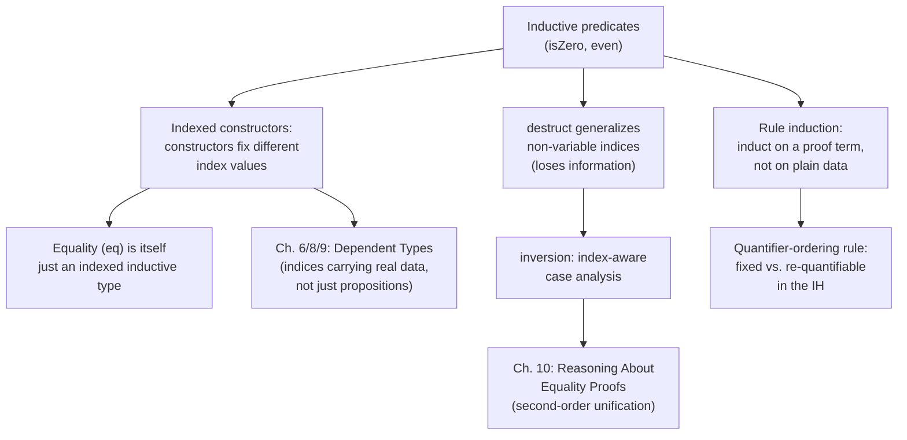

[[book-guidelines|↩ Back to guidelines]]

## Predicates are just another inductive type — so what changes?

Chapters 3 and 4 already established that `Inductive` builds both data (`nat`, `list`) and propositional connectives (`and`, `or`, `ex`). This section pushes that unification one step further: it uses the *exact same mechanism* to build **judgments** — predicates that look like the inference-rule systems you'd see in a programming-languages or logic textbook, written as inductive Coq types instead of on paper. That's a genuinely different use of `Inductive` than anything before it, and it comes with its own sharp edges, which is why the book devotes an entire section to the pitfalls before showing the technique pay off.

Consider the simplest possible judgment:

```coq
Inductive isZero : nat -> Prop :=
| IsZero : isZero 0.
```

Read `IsZero` as a natural-deduction inference rule with nothing above the line and `isZero 0` below it — a zero-premise rule. What's new here isn't the syntax, it's the *index*: `isZero : nat -> Prop` takes a value argument, and different constructors are free to fix that argument to different values (here, just `0`, via the single constructor). Contrast this with a parameterized type like `list A`, where the parameter `A` must appear uniformly in *every* constructor's range. An indexed inductive predicate lets each constructor commit to a specific index value — which is precisely what makes `isZero` provable only when its argument really is `0`, and nowhere else.

**Grounding (Rust):** this is the difference between a generic type `Vec<T>` (parameter `T` fixed once, shared everywhere) and an enum whose variants each pin a *different* concrete instantiation of an otherwise-shared index — Rust has no native equivalent (its enums can't be indexed by a value the way `isZero` is indexed by a `nat`), which is exactly the expressive gap dependent types close. This gap is the through-line of the whole book: "[[Dependent-Types-for-Program-Correctness|Dependent Types for Program Correctness]]" (Chapter 6/8/9) is what happens when you lean on this same indexing mechanism to build *data*, not just propositions.

## Equality is not primitive — it's this same mechanism, one level up

Once you see that an indexed inductive predicate can encode "this argument must equal a fixed value," a natural question follows: could *equality itself* be built this way, instead of being a logic primitive? Coq's answer is yes, and it's one of the most consequential design decisions in the whole system:

```coq
Print eq.
(* Inductive eq (A : Type) (x : A) : A -> Prop := eq_refl : x = x *)
```

`eq` takes a *parameter* `x` (fixed across the single constructor) and an *unnamed index* of the same type — the thing being compared against `x`. Read the constructor's type carefully: `eq_refl : x = x` only type-checks when both sides are the *same* term, so the only proof `eq` ever admits is reflexivity applied to *syntactically identical* terms. This is often summarized as "equality is the least reflexive relation" — the smallest relation containing reflexivity, closed under nothing else. Every equality-manipulating tactic you've already used — `reflexivity`, `rewrite` — is implemented in terms of this one inductive definition; there is no separate, privileged notion of equality living outside the `Inductive` mechanism.

This detail matters enormously later in the book (Chapter 10, "[[Reasoning-About-Equality-Proofs|Reasoning About Equality Proofs]]"): because equality is *data* — a genuine inductive type with a constructor — you can pattern-match on proofs of equality, substitute using them programmatically, and run into all the same case-analysis subtleties that ordinary inductive data invites. The "second-order unification" headaches of dependent pattern matching on equality proofs are a direct consequence of this section's `eq_refl` definition, not an unrelated later complication.

## The central pitfall: `destruct` throws away index information

Here is where judgments genuinely differ from ordinary data in practice, not just in theory. Try to prove that `isZero 1` is impossible:

```coq
Theorem isZero_contra : isZero 1 -> False.
  destruct 1.
(* ============================
     False                        <- the hypothesis just vanished! *)
```

`destruct` (and `induction`) have a documented restriction: when applied to a hypothesis whose *index* is not already a bare free variable — here the index is the literal `1`, not a variable — Coq first generalizes that index to a fresh variable *before* doing case analysis. That generalization is exactly what erases the crucial fact "this index is `1`, and `1 ≠ 0`" — the one fact the whole proof depends on. You're left worse off than before you started.

Why does Coq behave this way rather than being "smart" about it? Because the general problem — "figure out which cases are actually possible given the concrete index" — is a form of *logically complete case analysis* that is undecidable in Coq's logic in general. Rather than attempt an incomplete heuristic silently, Coq gives you a predictable (if occasionally surprising) default, and hands you a dedicated tool for the cases where index-aware case analysis is what you actually want:

```coq
Theorem isZero_contra : isZero 1 -> False.
  inversion 1.
Qed.
```

**`inversion`** is `destruct`'s index-aware sibling: it performs case analysis while additionally exploiting the structure of the index, and here it immediately spots that `isZero 1` requires `1 = 0` and closes the goal by contradiction — corresponding exactly to the "inversion" concept from natural-deduction proof theory (given a conclusion, work backward to see which rule could have produced it, and what constraints that implies).

The pitfall gets worse before `inversion` rescues you. Watch what `destruct` does to a *goal* that happens to mention numerals matching the discriminee:

```coq
Theorem isZero_contra' : isZero 1 -> 2 + 2 = 5.
  destruct 1.
(* ============================
     1 + 1 = 4                     <- huh? *)
```

Internally, `destruct` replaced the literal `1` with a fresh variable *everywhere it occurs syntactically* — including inside the unary representations of `2`, `4`, `5` built out of successive `S` applications sharing that same numeral structure — then specialized the induction principle's motive `P` to `fun n => S n + S n = S (S (S (S n)))` and substituted `n := 0` in the one resulting case. The visible effect is that every number in the goal silently *decremented*. Nothing is "wrong" here in the sense of a bug; this is `destruct` doing exactly what its type-theoretic contract says (specializing an induction principle's motive), but the result is deeply counterintuitive if you don't understand `isZero_ind`'s actual type:

```coq
Check isZero_ind.
(* isZero_ind : forall P : nat -> Prop, P 0 -> forall n : nat, isZero n -> P n *)
```

The diagnostic to internalize: **a "strange transmutation" in a goal after `destruct` is a reliable signal that `inversion` was the tactic you needed.**

**Grounding (Lean):** Lean's `cases` tactic on a hypothesis with a non-variable index has the same generalize-then-split behavior, and Lean's `rcases`/`omega`-adjacent tooling exists partly to sidestep the same footgun. When Lean users reach for `subst` before `cases`, or use `cases h with | ...` patterns that keep index equalities as explicit hypotheses instead of eagerly substituting, they're solving exactly the problem this section identifies — the fix in both systems is to *keep the index-equality information around explicitly* rather than let generalization erase it. This is the same lesson the workbench's "judgment forms and typing rules, as the shared ancestor of a type checker and a proof checker" thread points at directly: whatever inversion-style reasoning you build for a typing judgment in your own verifier, it will hit this exact tension between "generalize for induction" and "keep enough information to rule out impossible cases."

## Recursive predicates and rule induction

The same machinery scales to recursively-defined judgments:

```coq
Inductive even : nat -> Prop :=
| EvenO : even O
| EvenSS : forall n, even n -> even (S (S n)).
```

Two inference rules: a zero-premise base case, and a rule taking `even n` above the line to `even (S (S n))` below. `Hint Constructors even.` registers both constructors so `auto` can chain them automatically instead of you writing `constructor; constructor; constructor` by hand — the first taste of the automation infrastructure ("[[Proof-Automation-by-Logic-Programming|Proof Automation by Logic Programming]]," Chapter 13) that recurs throughout the book. `inversion` continues to do useful, if occasionally "overzealous," work here too — inverting `even 3` introduces an unused fresh variable and an equality hypothesis about it (bookkeeping the tactic needs to remain sound on more complex definitions, even when it looks superfluous on a simple one).

The real payoff is **rule induction**: instead of inducting on the *structure of a plain data argument* (`induction n`), you induct on the *structure of a proof* of the predicate itself (`induction 1`, referring to the first unnamed hypothesis). Attempting `even_plus` (`even n -> even m -> even (n + m)`) by ordinary `induction n` gets stuck: the goal ends up mentioning a variable `n0` introduced by inverting the hypothesis, which doesn't match the induction hypothesis's `n`. Switching to `induction 1` — inducting on the structure of the `even n` *proof* rather than on `n` as raw data — makes the two cases (`EvenO`, `EvenSS`) line up exactly with what the goal needs at each step. Chlipala's framing is important: **rule induction is not a separate mechanism from "normal" induction** — because a judgment is defined by the same `Inductive` machinery as any datatype, inducting on a proof of that judgment *is* structural induction, just over proof terms instead of over `nat` or `list` terms. This is the same fundamental unity that Curry–Howard already established (proofs are terms), now cashed out as a *proof technique*, not just a slogan.

## The quantifier-ordering rule — the section's sharpest and most transferable lesson

The final, and arguably most important, pitfall concerns *where* a variable sits relative to the thing you're inducting on. Consider proving `forall n, even (S (n + n)) -> False` two different ways:

**Working version** — prove a more general lemma first, with the extra variable `n` quantified *after* the induction target `n'`:

```coq
Lemma even_contra' : forall n', even n' -> forall n, n' = S (n + n) -> False.
  induction 1; crush; ...
```

**Broken version** — move all quantifiers to the front, so `n` comes *before* the induction target:

```coq
Lemma even_contra'' : forall n' n, even n' -> n' = S (n + n) -> False.
  induction 1; crush; ...
(* stuck: IHeven : S (n + n) = S (S (S (n + n))) -> False   -- trivially true, useless *)
```

The rule that explains the difference, stated exactly as the book gives it:

> Quantified variables and hypotheses that appear **before** the induction object in the theorem statement stay **fixed** throughout the inductive proof. Variables and hypotheses that are quantified **after** the induction object may be **varied explicitly** in later uses of the inductive hypothesis.

In the broken version, `n` is fixed to one specific (unknown) value for the *entire* proof — so the inductive hypothesis `IHeven` can only ever talk about that same fixed `n`, which is useless once the recursive case needs to reason about a *different* value. In the working version, `n` is re-quantified fresh inside the inductive hypothesis itself, so each recursive step gets to pick whatever `n` it actually needs. This is not a quirk to memorize by rote — it's a direct consequence of how `induction` builds and specializes the underlying induction principle (the same `T_ind`-style motive-specialization mechanism visible in `isZero_ind` above), and Chlipala is explicit that Coq deliberately *doesn't* try to auto-detect and reorder this for you: doing so would make induction hypotheses unpredictably more complex, and could silently break automation that depended on the simpler form.

**Grounding (Rust/Lean):** there's a genuine parallel here to how generalizing a recursive function's accumulator parameter changes what invariant an inductive proof about it can express — a classic "prove the general lemma, specialize at the end" pattern familiar from strengthening loop invariants in verified Rust code (`kani`/`prusti`-style proofs) or from Lean's own frequent need to `generalize` a subterm before `induction` for the same reason. Whenever a Lean or Coq induction "gets stuck with a trivially-true, useless IH," the fix is almost always exactly this: re-examine the theorem statement's quantifier order relative to the induction target, and re-generalize.

## Where this leads



This section is the direct ancestor of two much larger later chapters: the `eq`-as-inductive-type observation is the seed of everything in "Reasoning About Equality Proofs" (heterogeneous equality, UIP, axiom K), and the `isZero`/indexed-constructor pattern is the propositional preview of "Dependent Types for Program Correctness," where the same indexing trick is applied to *data* (length-indexed lists, `fin n`) rather than to `Prop`.

For the elaborator/verifier project this vault is oriented around: this is the section that makes explicit the "judgment forms and typing rules are the shared ancestor of a type checker and a proof checker" connection the workbench goals flag as a recurring thread — `isZero`/`even` *are*, formally, natural-deduction judgments, encoded exactly the way a typing relation (`hasType e t`) or an operational-semantics relation would be. And the `destruct`-vs-`inversion` distinction is not a Coq quirk to shrug off — it's the concrete shape of a problem any inversion-based reasoning engine over a typing judgment (or any hand-rolled `match`-based unifier doing case analysis on typed terms) will have to solve: *how do you perform case analysis on a proof/derivation without silently erasing the index information the case analysis needed in the first place?* That's a design question for your own kernel's inversion lemmas, not just an artifact of Coq's tactic engine.
