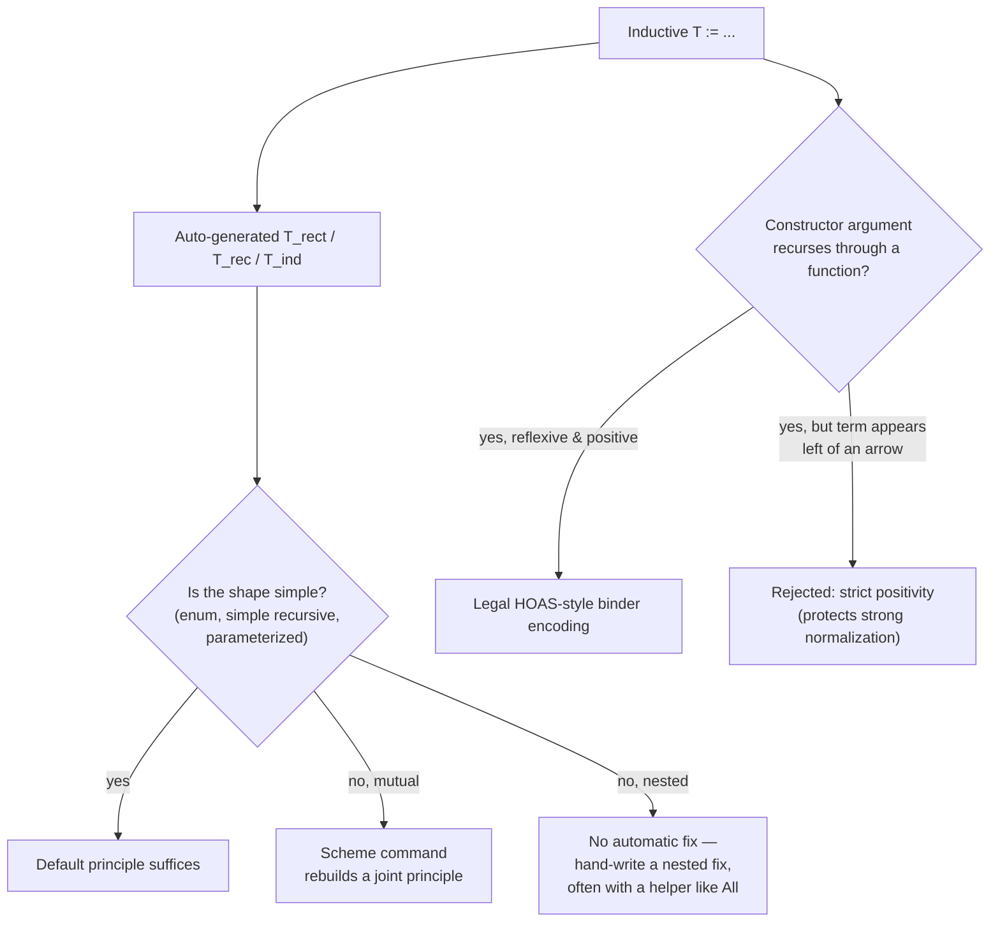

[[book-guidelines|↩ Back to guidelines]]

## What problem does "inductive type" actually solve?

Coq's `Inductive` command looks, at first glance, like a slightly fancier version of Haskell `data` or ML `datatype`. It isn't — it's a single mechanism that simultaneously defines a *type of values you can compute with* and, automatically, a *principle for proving things about every value of that type*. The reason this matters: in Coq, proofs are terms of the same language as programs (Curry–Howard), so if `Inductive` only gave you data constructors and no induction principle, you would have data but no way to reason about *all* its inhabitants. Every `Inductive T` command silently also produces `T_ind` (and its more general cousins `T_rec`/`T_rect`, discussed below) — a theorem-generator for "prove property $P$ of every value of $T$ by handling each constructor case."

This article works through the taxonomy of inductive definitions the book builds up — enumerations, recursive types, parameterized/polymorphic types, mutually inductive types, reflexive types, and nested inductive types — and, in each case, what happens to the automatically generated induction principle as the definitions get more structurally interesting. The throughline: **the more expressive the type family, the more likely the auto-generated principle is too weak, forcing you to construct one by hand** — which is itself an instructive exercise, because it demystifies what "induction" *is* in Coq: not a primitive, but an ordinary recursive function.

## Enumerations: the simplest possible case

The simplest possible inductive type has zero constructor arguments and (usually) more than one constructor:

```
Inductive bool : Set :=
| true
| false.
```

Its induction principle is exactly what you'd write down informally: `bool_ind : ∀ P : bool → Prop, P true → P false → ∀ b : bool, P b` — prove $P$ for both cases, get $P$ for everything. For non-recursive types like this, `destruct` (pure case analysis) and `induction` (case analysis *plus* an inductive hypothesis per recursive argument) behave identically, since there's no recursive argument to generate a hypothesis about.

Two even simpler types are worth singling out because they *are* the propositions `True` and `False` under Curry–Howard, just renamed:

```
Inductive unit : Set := tt.
Inductive Empty_set : Set := .
```

`unit` — one constructor, no arguments — is definitionally `True` with `Set` swapped for `Prop` and `tt` swapped for `I`. `Empty_set` — zero constructors — is `False`. This is worth sitting with: the "type with no values" is not a special case bolted onto the language; it's an ordinary inductive definition that happens to have no constructors, and its induction principle (`∀ P, ∀ e : Empty_set, P e` — anything holds of every element, vacuously) is exactly the elimination rule for `False`. `destruct 1` on a hypothesis of type `Empty_set` closes any goal, because there was never a value to construct.

**Grounding (Rust):** `bool`'s induction principle is the Coq analogue of Rust's exhaustive `match` — the compiler enforces that you handle every variant, which is a *degenerate, non-recursive* form of the same completeness guarantee `bool_ind` states as a theorem. `Empty_set` is Rust's uninhabited `enum Never {}` (or the stable `!` never type) — a value of it lets you produce a value of any type at all (`match never {}` needs no arms), exactly mirroring `Empty_set_ind`'s "anything follows."

## Recursive types: where induction becomes genuinely inductive

`nat` is the first type worth the name "inductive," because one constructor recurses:

```
Inductive nat : Set :=
| O : nat
| S : nat → nat.
```

Now `nat_ind : ∀ P : nat → Prop, P O → (∀ n, P n → P (S n)) → ∀ n, P n` has real content: the second premise is an honest inductive step, assuming $P$ of the smaller value to prove $P$ of the larger one. Proving `plus n O = n` by `induction n` versus `plus O n = n` by pure computation (`reflexivity`, since `plus` recurses on its *first* argument) is the book's demonstration that **induction is required exactly when the recursive structure of the goal doesn't align with a definition's own recursion pattern** — a theme that recurs throughout the book (it's the same reason compiler-correctness proofs, mentioned in the very first chapter, need strengthened lemmas).

Constructor injectivity matters too: since `S` takes an argument, knowing `S n = S m` doesn't *automatically* give you `n = m` — you need `injection` (extracts equalities of constructor arguments from an equality of same-constructor values) or the more powerful `congruence` (a complete decision procedure for equality plus uninterpreted functions, subsuming both `injection` and `discriminate`). List and tree types (`nat_list`, `nat_btree`) follow the identical pattern: each constructor with a recursive argument produces an induction-hypothesis slot in the generated principle.

**Grounding (Rust):** `nat` is `enum Nat { Zero, Succ(Box<Nat>) }` — heap-indirected because Rust needs a statically known size, a wrinkle Coq's inductive types don't have to think about at the surface syntax level (though the kernel does something analogous internally). The inductive step in `nat_ind` corresponds to structural recursion over that same shape: a Rust function matching on `Succ(inner)` and recursing on `inner` is doing, at the value level, exactly what `nat_ind`'s second premise does at the proof level.

## Parameterized types: where the parameter disappears from the induction step

```
Inductive list (T : Set) : Set :=
| Nil : list T
| Cons : T → list T → list T.
```

Polymorphism over `T` works as in Haskell/ML, with one Coq-specific subtlety worth noticing in the generated principle:

```
list_ind : ∀ (T : Set) (P : list T → Prop),
  P (Nil T) →
  (∀ (t : T) (l : list T), P l → P (Cons t l)) →
  ∀ l : list T, P l
```

`T` is universally quantified once, up front — it does **not** get re-quantified inside the inductive case, even though every other constructor argument does. This is the general rule for *parameters* (shared unchanged across every constructor, as opposed to *indices*, which can vary — a distinction that becomes load-bearing again much later, in [[Universes-and-Axioms|Universes and Axioms]], where parameters and indices generate different universe constraints). The `Section`/`Variable T : Set` idiom is purely a notational convenience for factoring a shared parameter out of a block of definitions — it desugars to exactly the explicit-parameter form after `End`.

## Mutually inductive types: when the default induction principle silently loses its hypothesis

```
Inductive even_list : Set :=
| ENil : even_list
| ECons : nat → odd_list → even_list
with odd_list : Set :=
| OCons : nat → even_list → odd_list.
```

Try to prove a length/append correctness theorem here by plain `induction`, and you hit a wall: the auto-generated `even_list_ind` provides **no inductive hypothesis at all** for the `ECons` case, because Coq's default generation only produces a *non-mutual* principle per type — it doesn't know to thread an assumption about `odd_list` through. Attempting to fix this with a second nested induction just recurses forever, alternating between the two types with no base case reached.

The fix is the `Scheme` command:

```
Scheme even_list_mut := Induction for even_list Sort Prop
with odd_list_mut := Induction for odd_list Sort Prop.
```

This generates the two-predicate principle you actually need — `even_list_mut : ∀ (P : even_list → Prop) (P0 : odd_list → Prop), ... → ∀ e, P e` — with cross-referencing hypotheses in both directions. Crucially, the plain `induction` tactic won't apply this for you automatically; you have to invoke it via `apply` (`apply (even_list_mut pred1 pred2); crush`), which is itself instructive: it reveals that `induction` was never magic, just bookkeeping around `apply`.

**Why this matters architecturally:** this is the first of three cases in the chapter (mutual types, reflexive types, nested types) where the *definition* mechanism outruns the *automatically generated reasoning principle* for it. Each case is solved the same way — supply a hand-built or `Scheme`-derived principle with the right shape of universally-quantified predicates and hypotheses — which sets up §3.7's punchline: none of this is primitive machinery, it's ordinary recursive Gallina code you could (and, for nested types, must) write yourself.

## Reflexive types and the strict positivity wall

A **reflexive type** has a constructor taking a *function* returning the same type being defined — the natural way to encode variable binding without inventing a separate notion of "variable name":

```
Inductive formula : Set :=
| Eq : nat → nat → formula
| And : formula → formula → formula
| Forall : (nat → formula) → formula.
```

`Forall (fun x ⇒ Eq x x)` encodes $\forall x, x = x$ with no explicit variable-naming machinery — Coq's own function space does the binding work. This technique is called **higher-order abstract syntax (HOAS)**, and it's genuinely useful (the induction principle for `formula` even permits assuming $P$ holds for *every application* of the recursive function argument, which the metatheory has verified is sound).

But push HOAS one step further — try to encode the untyped lambda calculus, the textbook HOAS use case — and Coq refuses:

```
Inductive term : Set :=
| App : term → term → term
| Abs : (term → term) → term.
Error: Non strictly positive occurrence of "term" in "(term -> term) -> term"
```

**The strict positivity requirement**: the type being defined may never appear to the *left* of an arrow inside a constructor argument's type. `term → term` as an argument type puts `term` to the left of that inner arrow, which is exactly what's rejected. (`App`'s two plain `term` arguments are fine — they're not to the left of any arrow themselves.)

This is not pedantry — it's the thing standing between Coq and inconsistency. If the rejected definition were accepted, you could write:

```
Definition uhoh (t : term) : term :=
  match t with
  | Abs f => f t
  | _ => t
  end.
```

and `uhoh (Abs uhoh)` diverges — an infinite loop with no explicit recursive function in sight. In OCaml or Haskell that's merely surprising; in Coq, where programs and proofs share one language, a non-terminating term of any type would let you "prove" any proposition whatsoever (recall from the very first chapter: strong normalization — every proof term terminates — is exactly the property standing between CIC and this exact disaster). Strict positivity is the syntactic guard that keeps that door shut. (A workable substitute for full HOAS — parametric HOAS, PHOAS — is developed later, in Chapter 17.)

**Grounding (Lean):** Lean enforces the identical restriction for the identical reason — Lean's `inductive` command rejects non-strictly-positive occurrences to protect the same strong-normalization/consistency guarantee, since Lean's kernel is also a proof-term checker in the Curry–Howard tradition. If you are building an elaborator or kernel with your own inductive-type mechanism, this is a non-negotiable well-formedness check that must run *before* accepting a type declaration — get it wrong, and your whole system's soundness argument collapses on a single bad recursive-binder encoding.

## The interlude on induction principles: demystifying `T_ind`

Here the book pulls back the curtain entirely. `nat_ind` isn't primitive — it's defined in terms of a more general `nat_rect`, whose motive `P : nat → Type` (rather than `Prop`) reveals `Type` as a common supertype unifying the "proving" (`Prop`) and "programming" (`Set`) universes (the universe hierarchy itself is Chapter 12's subject). And `nat_rect` itself is not a built-in either — it's an ordinary recursive Gallina function:

```
nat_rect =
fun (P : nat → Type) (f : P O) (f0 : ∀ n, P n → P (S n)) ⇒
  fix F (n : nat) : P n :=
    match n as n0 return (P n0) with
    | O => f
    | S n0 => f0 n0 (F n0)
    end
```

`fix` is Gallina's anonymous-recursive-function keyword (`fun` with recursion); the `as`/`return` annotations on `match` are a **dependently typed pattern match** — the result *type* of the match depends on the value being matched, which is exactly why type inference here is undecidable in general (a fact provable by reduction from higher-order unification) and why explicit annotations are so often unavoidable. You can reconstruct `nat_ind` yourself, section-by-section, using `Variable`/`Hypothesis`/`Fixpoint` — and when you do, the definition you get is syntactically identical (up to `Prop` vs. `Type`) to what Coq generated automatically. Induction is not magic; it's recursion with a specific shape, wrapped for convenience.

**Grounding (Lean):** this `T_rec`/`T_ind` split is precisely Lean's `T.rec` (the primitive recursor every `inductive` declaration generates, living at the kernel level) versus derived eliminators built on top of it. When you write `induction n` in Lean tactic mode, you are invoking `Nat.rec` under the hood in exactly the way `induction n` in Coq invokes `nat_rect`/`nat_ind` — seeing the Coq version spelled out by hand is the most direct way to understand what Lean's `rec` is actually doing when its tactic-mode sugar isn't shown to you.

## Nested inductive types: when even `Scheme` won't save you

Push one step further than mutual recursion: define a tree using an *already-defined* parameterized type as the recursive slot:

```
Inductive nat_tree : Set :=
| NNode' : nat → list nat_tree → nat_tree.
```

This is a **nested inductive type** — `nat_tree` appears as an argument to `list`, not as a "bare" recursive occurrence. Coq accepts it by conceptually treating it as if `nat_tree` were defined mutually with a `nat_tree`-specialized copy of `list` (and it still enforces positivity through that expansion — swap in a type family that used its parameter contravariantly and the definition would be rejected). But — unlike the mutual case — **there is no `Scheme` command that fixes the resulting too-weak induction principle.** You must build the replacement by hand.

The auto-generated `nat_tree_ind` gives you no hypothesis at all about the list of children:

```
nat_tree_ind : ∀ P, (∀ (n : nat) (l : list nat_tree), P (NNode' n l)) → ∀ n, P n
```

The fix requires two ingredients. First, a generic "holds of every list element" predicate (the book's own `All`, deliberately duplicating the standard library's `Forall` for pedagogical purposes):

```
Fixpoint All (T : Set) (P : T → Prop) (ls : list T) : Prop :=
  match ls with
  | Nil => True
  | Cons h t => P h ∧ All P t
  end.
```

Second, a hand-written induction principle whose recursive structure must be **nested**, not just mutual — a naive attempt with two mutually-recursive `Fixpoint`s is rejected by Coq's termination checker (the recursive call's "principal argument" isn't structurally smaller in the way the checker expects), and the working version instead nests an anonymous `fix` for the list traversal *literally inside* the tree traversal:

```
Fixpoint nat_tree_ind' (tr : nat_tree) : P tr :=
  match tr with
  | NNode' n ls =>
      NNode'_case n ls
        ((fix list_nat_tree_ind (ls : list nat_tree) : All P ls :=
            match ls with
            | Nil => I
            | Cons tr' rest => conj (nat_tree_ind' tr') (list_nat_tree_ind rest)
            end) ls)
  end.
```

Using it requires telling the `induction` tactic explicitly which principle to use (`induction tr1 using nat_tree_ind'; crush`) — the tactic has no way to guess a non-default principle on its own. The chapter closes this thread by showing how to fold the residual manual step (a `destruct` on the list argument) into a `Hint Extern` — not because it shortens the proof, but because it makes the proof *self-documenting*: the hint states, in one line, exactly which variable gets case-analyzed and why, rather than leaving a reader to reconstruct that from an auto-generated variable name.

## Manual proofs about constructors: what `discriminate`/`injection` are actually doing

Finally, the chapter closes by hand-deriving the two tactics used constantly up to this point, `discriminate` and `injection`, as a way of demonstrating that Coq's *core* proof-checking vocabulary is genuinely minimal — everything else is derived. Proving `true ≠ false` manually needs a purpose-built discriminating function:

```
Definition toProp (b : bool) := if b then True else False.
```

then `red` (unfold negation into an implication), `intro H`, `change (toProp false)` (swap the goal for something computationally equal), `rewrite ← H`, `simpl`, `trivial` — five explicit steps standing in for what `discriminate` does in one. Injectivity of `S` similarly reduces to a manual use of `pred`: `change (pred (S n) = pred (S m)); rewrite H; reflexivity`. The lesson isn't "always write proofs this way" (`discriminate`/`congruence` remain the right tools day-to-day) — it's that these tactics are not opaque kernel magic; they are Ltac-automatable instances of ordinary Gallina reasoning, which is exactly the kind of transparency the de Bruijn criterion (from the opening chapter) promises you.

## Where this leads



This chapter is the load-bearing prerequisite for nearly everything downstream. Chapter 4's inductive *predicates* (judgments, `even`, `isZero`) are the exact same `Inductive` mechanism applied to `Prop` instead of `Set` — same constructors, same generated principles, same positivity restriction. Chapter 8's indexed families (`ilist`, `fin n`) push parameters into genuine dependent indices, which is where the parameter/index distinction from §3.4 starts to bite in earnest. And the nested-type machinery here — building a custom induction principle by hand when the automatic one is too weak — recurs almost verbatim in Chapter 9's discussion of reflexive-vs-recursive-vs-ordinary encodings for dependent data structures.

For the elaborator/kernel project this vault is oriented around (`type-theory`): strict positivity is exactly the well-formedness check your own inductive-type declarations must run before accepting a definition — it's the difference between "my type theory is consistent" and "my type theory can prove `False`." And the §3.7 demonstration that `T_ind` is *derived*, not primitive, is the right mental model for how your own kernel should treat induction/recursion principles: generate them mechanically from a validated, strictly-positive constructor signature, rather than special-casing them as kernel primitives.
