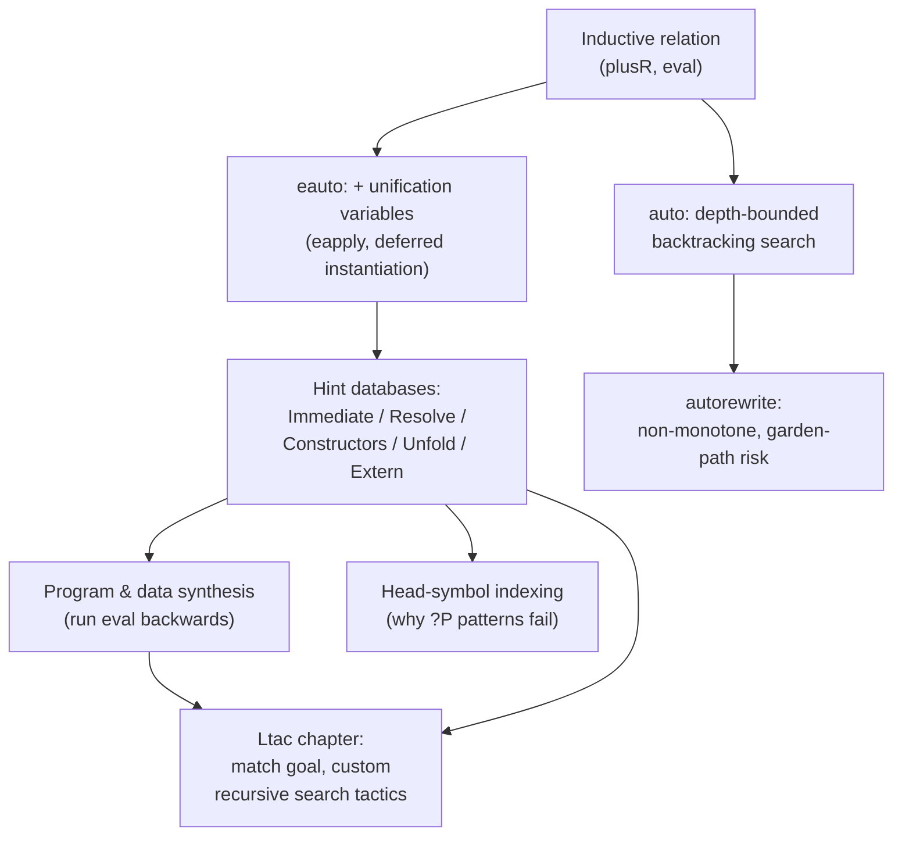

[[book-guidelines|↩ Back to guidelines]]

## Why treat proof search as logic programming?

Curry–Howard tells us proving is "just" programming — a proof term is a program, a theorem is its type. But the pragmatics diverge sharply from ordinary programming, and the divergence is what makes automated proof search *tractable* where automated programming in general is not. When you write a normal function, you care about a specific extensional behavior: this input must produce exactly this output, and any other output is a bug. A proof, by contrast, has no such extensional content beyond its type — **any** proof term of the right type is exactly as good as any other. This collapses the search problem: instead of hunting for the *one* program that behaves correctly, you're hunting for *any* term that type-checks, which is precisely the shape of problem logic programming languages like Prolog are built to solve.

This is the load-bearing idea behind `auto`/`eauto` and everything downstream of them in Coq's proof-automation story: **proof search is best understood as running a logic program**, where a proof is a resolution derivation, backtracking recovers from wrong turns, and unification discovers unknown values along the way. If you're building a theorem prover with an embedded clause/resolution engine, this chapter is close to a worked specification of what that engine needs to do.

## Relational vs. functional definitions — the same fact, two styles

Coq's standard `plus` is a `fix`, functional-programming style: you feed it two `nat`s, it computes a third.

```
plus =
fix plus (n m : nat) : nat := match n with
                                 | 0   => m
                                 | S p => S (plus p m)
                               end
```

The book immediately re-presents the same fact as a logic-programming-style **inductive relation**:

```
Inductive plusR : nat -> nat -> nat -> Prop :=
| PlusO : forall m, plusR O m m
| PlusS : forall n m r, plusR n m r
   -> plusR (S n) m (S r).
```

`plusR n m r` holds exactly when `plus n m = r` — this correspondence is provable in both directions (`plus_plusR`, `plusR_plus`) by straightforward induction. But the two encodings are not equivalent in what they let you *do*: a function has a fixed direction, disjoint sets of inputs and outputs — you supply `n` and `m`, you get `r`, and that's the only mode `plus` supports. A relation has no privileged direction at all. `plusR` can just as easily be asked "which `r` satisfies `plusR 4 3 r`" as "which `x` satisfies `plusR x 3 7`" — the same three-place fact, searched from any of its three positions. This asymmetry — functions run one way, relations run *any* way — is the entire reason this chapter exists, and it directly explains why later sections can "run a semantics backwards" to synthesize a program.

**Grounding:** this is precisely the difference between a Rust function `fn eval(e: &Expr, env: &Env) -> i64` (one fixed mode: term and environment in, value out) and a Prolog-style predicate `eval(Env, Expr, Value)` (any argument can be the unknown one, and the engine searches for values satisfying the relation). If your compiler's constraint-generation phase emits Horn-clause-shaped relations between program states rather than committing early to a fixed evaluation direction, you get exactly this flexibility — the same relation can check a candidate answer, compute a forward answer, or search backward for an answer, all through the identical clause set.

## `auto`: exhaustive, depth-bounded proof-tree search

Manually proving `plusR 4 3 7` by hand looks like blind trial and error: try `apply PlusO`, get a unification failure, backtrack, try `apply PlusS`, recurse. Chlipala's simple-minded manual process — pattern-match a proof step, fail, backtrack, retry — is *exactly* what `auto` automates once `PlusO`/`PlusS` are registered as hints via `Hint Constructors plusR`:

```
Example four_plus_three' : plusR 4 3 7.
  auto.
Qed.
```

The proof term this produces, `PlusS (PlusS (PlusS (PlusS (PlusO 3))))`, is a literal witness of the derivation tree `auto` found by trying candidate constructors at each node and backtracking on failure.

Crucially, `auto` is **depth-bounded**, not fully exhaustive: even a single candidate rule can generate an infinite space of proof trees (nothing stops `auto` from trying `PlusS` forever), so `auto` takes a maximum depth parameter, defaulting to **5**. `plusR 5 3 8` needs a derivation of depth 6, so plain `auto` fails and `auto 6` succeeds. `info auto n` (or the friendlier `info_auto` in some Coq versions) shows you exactly which sequence of constructor applications it found — indispensable for understanding *why* an automated proof worked, since the term itself carries no comments.

## Backtracking and unification — the two mechanisms, made concrete

The book isolates these with a deliberately "silly" example: proving `exists x, x + 3 = 7`. A naive user picks `x := 0` via `apply ex_intro with 0`, then fails to close the goal by `reflexivity` (`0 + 3 ≠ 7` isn't definitionally true) — a dead end requiring **backtracking** to the choice point and retrying with `x := 4`. This is unification-free trial and error: you're guessing concrete values and discarding failures.

Switching to the relational formulation replaces guessing with genuine **unification**. `eapply ex_intro` (note: `eapply`, not `apply`) doesn't guess a witness — it introduces a **placeholder unification variable** `?70` standing in for the still-unknown `x`, leaving the goal `plusR ?70 3 7`. Applying `PlusS` repeatedly refines this metavariable through `?70 → S ?71 → S (S ?72) → ...` as each constructor application peels off one layer, until `PlusO` finally pins down the last variable to a concrete value — the witness `4` falls out of the *derivation itself* rather than being supplied up front.

This is the crucial mechanical distinction underlying `apply` vs. `eapply`: `apply` insists all metavariables in a rule be resolved immediately; `eapply` (and correspondingly `eauto` vs. plain `auto`) is willing to leave some unresolved, deferring their instantiation to later steps in the search. This is more powerful (you don't need to guess witnesses up front) but also more expensive — deferred unification variables multiply the space of things that must eventually cohere, which is exactly why `eauto`-style search "can uncover many more potential proof trees and hence take much longer to run" than plain `auto`, and why the book keeps the two tactics separate rather than unifying them into one default.

**Mechanism, stated generally (the SLD-resolution correspondence):** this is precisely what Prolog's SLD-resolution does. A Prolog goal `?- plusR(X, 3, 7)` is resolved against a clause database — here, the two Horn clauses `plusR(0, M, M).` and `plusR(s(N), M, s(R)) :- plusR(N, M, R).` — by unifying the goal against a clause head, generating fresh subgoals from the body (with unification variables threading the not-yet-determined arguments), and recursing; failure at any point triggers backtracking to the last choice point to try an alternative clause or an alternative unifier. `auto`/`eauto`'s hint database plays the role of the Prolog clause database; the depth bound plays the role of a resolution-depth cutoff (Prolog itself is usually depth-unbounded and relies on termination of the underlying program, but bounded-depth iterative deepening is a completely standard variant); and the distinguishing feature of `eauto` — carrying unresolved unification variables across resolution steps — is exactly what lets Prolog-style search return *bindings* for the original query variables, not just a yes/no answer.

```rust
// A minimal sketch of what a depth-bounded, backtracking hint search looks like structurally.
// Each "hint" tries to make progress on a Goal, possibly emitting new subgoals.
enum SearchResult { Solved(Proof), Failed }

fn search(goal: &Goal, hints: &[Hint], depth: u32) -> SearchResult {
    if depth == 0 { return SearchResult::Failed; }
    for hint in hints {
        if let Some(subgoals) = hint.try_apply(goal) {
            // Try to discharge every subgoal the hint produced; on ANY failure,
            // backtrack — fall through the loop and try the next hint (or next
            // unifier candidate, in a fuller implementation).
            if let Some(sub_proofs) = subgoals.iter()
                .map(|g| match search(g, hints, depth - 1) {
                    SearchResult::Solved(p) => Some(p),
                    SearchResult::Failed => None,
                })
                .collect::<Option<Vec<_>>>()
            {
                return SearchResult::Solved(hint.assemble(sub_proofs));
            }
        }
    }
    SearchResult::Failed
}
```

The real `eauto` is considerably richer (it interleaves unification-variable instantiation across the whole tree, not just per-subgoal, and hint databases are indexed by head symbol for efficiency — see below) but this loop is the right mental skeleton: try each candidate, recurse into its obligations, backtrack the entire attempt on any failure. In Lean, `simp` and (via the `aesop` tactic in Mathlib-adjacent tooling) more general backtracking search play a structurally similar role to `auto`/`eauto`+hint-databases — a curated, extensible rule set tried automatically, with `aesop` in particular built explicitly around best-first backtracking search over registered lemmas, the closest Lean analogue of a Coq hint database.

## Hint databases and hint kinds — the extensibility mechanism

Because Ltac (Coq's tactic language) has no notion of a mutable global variable shared cleanly across separately-loaded files, hint databases solve a real engineering problem: how do you let `crush` (defined once, in one file) automatically pick up new domain-specific facts registered later, in a completely different file, without either file needing to know about the other? The answer is that `crush` is *defined in terms of* `auto`, and `auto` consults a **default hint database** that any subsequently-loaded file can extend. This is the mechanism that lets a general-purpose automation tactic stay useful as a project's domain grows — the tactic's code never changes; the database it draws on does.

The full hint taxonomy, each registrable in the default database or a named one via `Hint ... : dbname`:

- **`Hint Immediate lemma`** — try solving the current goal *immediately* by applying `lemma`, discharging any of its own hypotheses in a single additional step each. No further nested search.
- **`Hint Resolve lemma`** — like `Immediate`, but the lemma's hypotheses become fresh subgoals subject to full nested proof search, not just a single step. This is the hint form used when a fact has real premises that themselves need searching (`plusS : n + m = r -> S n + m = S r` is registered this way).
- **`Hint Constructors T`** — shorthand for `Resolve` applied to *every* constructor of inductive type `T` at once (this is how `plusR`'s two constructors both became candidate steps from one command).
- **`Hint Unfold ident`** — try unfolding `ident` when it's the head symbol of the goal.
- **`Hint Extern n pattern => tactic`** — the fully general, primitive form that the other four all reduce to: match `pattern` against the goal (binding any unification variables the pattern introduces), and on a match, run an arbitrary Ltac `tactic`. The numeric priority `n` orders otherwise-tied hints (lower tried first), which materially affects search time since a cheap hint tried before an expensive one prunes the tree faster.

The `bool_neq : true <> false` example is instructive precisely because it shows `Hint Extern`'s reach beyond the other four forms: there's no non-circular Coq lemma to `Resolve` with (any specific fact "restates the theorem we mean to prove"), but `congruence` — Coq's built-in decision procedure for equality, uninterpreted functions, and constructor disjointness — solves it directly, so `Hint Extern 1 (_ <> _) => congruence.` teaches `auto` to reach for `congruence` whenever the goal shape is a disequality. A further example teaches `auto` to exploit a hypothesis of shape `forall x, P x /\ Q x` via an embedded `match goal` extracting `proj1 (H X)` — genuine Ltac logic, not a lemma at all, running as a search step.

**The static-head-symbol restriction — why it exists, and what it reveals about the implementation.** Attempting to generalize the `forall_and`-style hint to *all* predicates `P` (`Hint Extern 1 (?P ?X) => ...`) fails with `User error: Bound head variable`. The reason is architectural, not incidental: **Coq's hint databases are implemented as tables mapping a statically-known head symbol to the list of tactics to try for goals with that head** — an indexing structure, not a flat list scanned linearly. A pattern whose own head is itself a unification variable (`?P`) can't be placed in such a table, because there's no fixed key to index it under. This is worth internalizing if you're building your own clause-indexed resolution engine: efficient Prolog implementations use essentially the same trick (first-argument indexing, or indexing by the principal functor of the goal) to avoid a linear scan of the entire clause database on every resolution step, and it imposes the identical restriction — you can't efficiently index a clause whose head is itself unbound.

## Program synthesis — running a relation backwards

Section 13.2's list-length examples (finding a `list nat` of length 2, then one whose sum is a target value) are already mildly surprising — using `eauto` to synthesize *data* satisfying constraints, not just to prove a proposition about pre-existing data. But Section 13.3 pushes further: synthesizing a *program*.

Given an expression language `exp` (`Const`/`Var`/`Plus`) and its relational semantics `eval (var : nat) : exp -> nat -> Prop`, `eauto` can find an `e : exp` such that `forall var, eval var e (var + 7)` — literally constructing the syntax tree `Plus Var (Const 7)` by running the semantics relation *backwards*, treating the expression itself as the position to unify rather than the final value. This is the deepest payoff of casting semantics as a relation instead of a function: an interpreter `eval : exp -> nat -> nat` can only ever go from syntax to value; the relational `eval` can be searched from *any* argument position, including the syntax position itself.

Two staging tricks make this tractable and are worth internalizing as general techniques for any resolution-based synthesis engine you build:

1. **Staged lemma variants to route unification.** A direct hint from `EvalPlus` only fires when the goal's result is *already* expressed as a syntactic addition. The book instead proves `EvalPlus' : eval var e1 n1 -> eval var e2 n2 -> n1 + n2 = n -> eval var (Plus e1 e2) n` — pushing the "does this actually equal `n`" check into a *separate*, later premise. This lets `eauto` freely choose `n1`/`n2` (via unification variables) during the structural matching phase, deferring the arithmetic check to a phase where it can be discharged by a different, specialized procedure.
2. **Delegating a whole sub-theory to `Hint Extern` plus a decision procedure.** `Hint Extern 1 (_ = _) => abstract omega.` hands every arising equality goal to `omega` (Presburger arithmetic's decision procedure), rather than trying to cover arithmetic facts with a growing pile of individually `Resolve`d lemmas. `abstract` additionally packages each discharged goal as its own opaque lemma in the final proof term, keeping the term small and legible instead of inlining a full `omega` certificate at every use site.

This two-part pattern — relational specification plus staged lemmas that route unification, backed by targeted decision procedures for the sub-theories that resolution search handles poorly — is close to a template for a hybrid CSP/theorem-prover architecture: let clause-based search handle structural/combinatorial choices (which constructor, which syntax tree), and hand off numeric or theory-specific subgoals to a specialized solver (arithmetic, congruence closure) rather than trying to make the general-purpose resolution engine itself understand arithmetic.

## Rewrite hints: a genuinely different hazard profile

`Hint Rewrite` and `autorewrite` extend `auto`'s hint-consultation idea to term *rewriting* rather than goal *discharge* — `crush` itself is built partly on `autorewrite`. But the book is emphatic that rewrite hints have a **fundamentally different risk profile** from resolution hints, and the distinction matters for anyone designing a hint/rule system of their own:

- **`auto`/`eauto` are monotone**: a new hint can only ever make search *slower* (more branches to try) — it can never turn a previously-succeeding proof into a failing one, because `auto` either fully solves a goal or leaves it completely unchanged. Adding hints is safe in the sense that it cannot break existing proofs (`eauto` is a partial exception: new hints can change *which* proof is found, and that different proof can leave different unification-variable bindings elsewhere in a larger proof state — a subtler but real caveat).
- **`autorewrite` is *not* monotone**: a rewrite can *transform* a goal into a shape from which the previously-applicable rule no longer applies, without having solved anything — a "garden path." The book's example: given `f (f x) = f x` and `f x = g x` both as rewrite hints, `autorewrite` on `f (f (f x)) = f x` eagerly applies the `f = g` rule everywhere, rewriting the goal into `g (g (g x)) = g x` — a dead end, because the `f_f` fact needed to close it no longer mentions any `f` to rewrite. Since `autorewrite` changed the goal *without* discharging it, the damage is done and unrecoverable within that call.

The fix generalizes past this specific example: **attach a side-condition-discharging tactic to a conditional rewrite hint** via `Hint Rewrite lemma using tac` — the rewrite only fires when `tac` can close every premise the rewrite rule carries (e.g., a hypothesis-guarded equality `forall x, P x -> f x = g x` only rewrites when `tac` proves `P x` for the specific `x` in play), which prevents exactly the kind of context-blind, unconditionally-applied rewrite that produces garden paths.

## Where this leads



This chapter is the direct predecessor of "[[The-Ltac-Tactic-Language|The Ltac Tactic Language]]": everything here — `Hint Extern`'s embedded `match goal`, the backtracking-on-failure semantics, staged lemmas to route unification — is `auto`/`eauto` used as a *black box* automation strategy; the Ltac chapter opens the box and shows you how to write custom search procedures with the same backtracking discipline by hand, when the built-in hint mechanism isn't expressive enough. It's also the direct predecessor of "[[Proof-by-Reflection|Proof by Reflection]]," which is best understood as an alternative way to get a decision procedure — reify the goal as data and *compute* the answer — precisely for the cases where resolution-style search (this chapter's whole approach) produces proof terms that blow up superlinearly with goal size.

For the `automated-reasoning` and `sat-smt-csp` threads this vault is built around: this chapter is close to a specification document for a hand-rolled resolution/clause engine — SLD-resolution as the search discipline, first-argument/head-symbol indexing as the efficiency mechanism, staged lemma variants as the technique for keeping unification well-behaved when synthesizing structure rather than just verifying it, and the explicit monotone-vs-non-monotone hint distinction as a design question your own rule system will have to answer (do new rules only ever help, or can they actively derail a previously working derivation?). The `omega`/`ring`-via-`Hint Extern` pattern is also a direct template for how a general-purpose resolution engine should hand off theory-specific subgoals (linear arithmetic, ring equalities) to specialized decision procedures rather than trying to cover them with ordinary clauses — exactly the SMT-style "theory solver behind a SAT-level search" architecture this vault's `sat-smt-csp` focus area is oriented toward.
