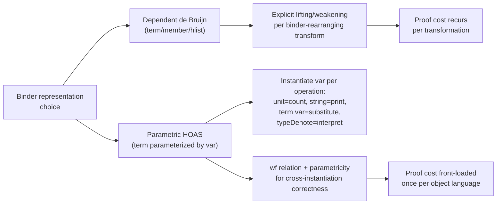

[[book-guidelines|↩ Back to guidelines]]

## The choice you can't avoid: how do you represent a binder?

Every formalization of a programming language runs into the same wall almost immediately: representing *binding*. A term like $\lambda x.\, x + x$ has a variable $x$ that is introduced by the $\lambda$ and used twice inside its scope — and any encoding of this fact as a Coq (or Rust, or Lean) data structure has to decide, once and for all, what "the same variable" *means* as a piece of data. Get this decision wrong, or merely unlucky, and every later theorem about the language pays a bookkeeping tax, forever.

Chlipala is explicit that this is not a solved problem — "the pragmatic questions in this domain are far from settled and remain as important open research problems" — and this capstone chapter is deliberately a case study, not a tutorial on The One True Encoding. It picks two representations, works the *same* three program transformations (identity, constant-folding, let-removal) through both, and lets you watch where each one buys ease and where it charges a bill. This is also the chapter where every earlier technique in the book gets exercised together on a real task: dependent types for correctness (`hlist`/`member` from Chapter 8/9), Ltac automation (the custom `crush`-extension `pl` built at the top of the chapter), and equality reasoning (function extensionality, met back in Chapter 12, needed to compare functions built from different `Abs` bodies). If you're designing your own compiler's or elaborator's internal AST representation, this chapter *is* the design-decision menu.

## Encoding 1: dependent de Bruijn indices

The first approach revisits the `term`/`member`/`hlist` machinery from "[[Dependent-Types-for-Program-Correctness|Dependent Types for Program Correctness]]" (Chapter 9) and puts it to real use. A term is a value of a type family indexed by *both* a typing context (a `list type` recording which free variables are in scope and at what type) and the term's own result type:

```coq
Inductive term : list type -> type -> Type :=
| Var  : forall G t, member t G -> term G t
| Const: forall G, nat -> term G Nat
| Plus : forall G, term G Nat -> term G Nat -> term G Nat
| Abs  : forall G dom ran, term (dom :: G) ran -> term G (Func dom ran)
| App  : forall G dom ran, term G (Func dom ran) -> term G dom -> term G ran
| Let  : forall G t1 t2, term G t1 -> term (t1 :: G) t2 -> term G t2.
```

A variable is a `member t G` value — the same dependent "proof that `t` occurs in `G`" type from Chapter 9, standing in for what would otherwise be a bare natural-number de Bruijn index (`0` = nearest enclosing binder, `1` = next one out, etc.). The crucial payoff of doing this *dependently* rather than with raw `nat`s: a `member t G` value can only ever refer to a variable that actually exists in `G` at type `t`. There is no out-of-scope index to construct, so `termDenote` — the interpreter into actual Coq values, using an `hlist typeDenote G` environment — never has a "what if the index is out of bounds" case to write or prove absent. The type system erases that failure mode entirely.

**Grounding (Rust):** a typical Rust AST would represent a bound variable as `enum Var { Bound(usize) }` against a `Vec<Type>` context, and "is this index in range" becomes a runtime invariant you either check with a panic/`Option`, or simply trust and hope. Coq's `member t G` is the type-level version of that invariant: an out-of-range index isn't a value your code has to reject, it's a term that doesn't type-check in the first place. If you're building a refinement-typed or dependently-typed compiler in Rust, this is exactly the gap a `Fin`-style bounded-index newtype (as seen in the "Dependent Types for Program Correctness" article) is meant to close — you're trading a runtime check for a type-level guarantee, at the cost of needing the richer type machinery to state it.

Transformations that don't touch binding structure are easy here. `ident` (a no-op identity pass) and `cfold` (constant folding, using a helper `dep_destruct` to case-split on a dependently typed subterm) both have straightforward `induction e; pl` proofs, where `pl` is a small Ltac extension of `crush` built specifically for this chapter (it additionally tries `f_equal` and functional extensionality — `extensionality x` — to close goals of the shape `(fun x => ...) = (fun y => ...)`, which recur constantly once you're comparing functions built by different transformation traces).

### The hard part: removing `let`, and why it needs lifting

Substituting `e1` for `x` inside `let x = e1 in e2` sounds trivial, but the de Bruijn representation makes it genuinely fiddly, and this is the chapter's central demonstration of *why* de Bruijn indices are called a **first-order** representation: they encode variable identity *explicitly*, as data, and any transformation that rearranges the binding structure has to explicitly rewrite that data along with it.

The concrete problem: to remove a `let`, you substitute a term `e1` — valid in context `G'` — into a position that, syntactically, sits inside a *larger* context (one with more bound variables in scope, from any `Abs` or `Let` nodes between the substitution site and where `e1` was found). Moving a term from a smaller context into a larger one, without changing its meaning, is exactly what **lifting** (also called weakening, echoing the weakening structural rule for typing judgments in a natural-deduction presentation) is for.

Lifting decomposes into several helper functions, each threading an index `n` marking *where* in the context the new variable is being inserted:

- `insertAt t G n` — splices type `t` into list `G` at position `n`.
- `liftVar` — the corresponding operation on `member` values: an existing variable's *index itself* has to shift up by one whenever the newly inserted variable sits at or below its position.
- `lift'` — extends `liftVar` to whole terms, recursing through `Abs`/`Let` and bumping the insertion index `n` by one every time it steps under a binder (since inside an `Abs`, "position 0 in the new, bigger context" now means something different than it did outside).

Only after all of this machinery exists can `unlet` itself be written — as a function carrying an explicit **substitution**, `hlist (term G') G`, mapping each variable in the old context to a replacement term valid in the new context `G'`. Its `Abs` case has to *lift* the ambient substitution before recursing under the new binder, and map the newly introduced variable to itself:

```coq
| Abs e1 => fun s => Abs (unlet e1 (Var HFirst ::: hmap (lift _) s))
```

That single line is the whole story of why de Bruijn bookkeeping is a genuine tax: every transformation that adds, removes, or reorders binders has to carry this kind of index-shifting logic explicitly, and the *correctness proof* has to carry a matching parade of lemmas (`liftVarSound`, `lift'Sound`, `liftSound`) before the final `unletSound` theorem is even reachable.

## Encoding 2: parametric higher-order abstract syntax (PHOAS)

The second half of the chapter asks: what if we just... don't represent variable identity as data at all, and instead let the *meta-language's own binders* stand in for the object language's binders? This is **higher-order abstract syntax (HOAS)**, and the naive version looks tempting:

```coq
Inductive term : type -> Type :=
| Abs : forall dom ran, (term dom -> term ran) -> term (Func dom ran)
| ...
```

Coq rejects this outright. `Abs`'s argument type, `term dom -> term ran`, has `term` occurring to the *left* of an arrow inside a constructor argument — exactly the strict positivity violation discussed in the "[[Inductive-Types|Inductive Types]]" article. And for the same reason: an inductive type allowed to appear negatively in one of its own constructors' argument types can be exploited to write a non-terminating Gallina function, which by Curry–Howard would prove `False`. This isn't a syntactic technicality Coq is being fussy about — it's the exact same soundness-preserving restriction you meet whenever a "clever" recursive encoding tries to smuggle general recursion in through the back door.

**Parametric HOAS (PHOAS)** — due to Washburn and Weirich for Haskell, adapted by Chlipala for Coq — fixes this with one move: parameterize the whole term type over an abstract *variable-representation* family `var : type -> Type`, and have binders take a function from `var` (not from `term`) to a subterm:

```coq
Section var.
  Variable var : type -> Type.
  Inductive term : type -> Type :=
  | Var  : forall t, var t -> term t
  | Const: nat -> term Nat
  | Plus : term Nat -> term Nat -> term Nat
  | Abs  : forall dom ran, (var dom -> term ran) -> term (Func dom ran)
  | App  : forall dom ran, term (Func dom ran) -> term dom -> term ran
  | Let  : forall t1 t2, term t1 -> (var t1 -> term t2) -> term t2.
End var.
```

Now `Abs`'s functional argument is `var dom -> term ran`, and `var` is a free parameter of the whole definition rather than `term` itself — no self-reference through a negative position, so strict positivity is satisfied. (One might wonder about a loophole: instantiate `var := term` and get HOAS back through the side door. It doesn't work — you'd need to choose *another* variable representation for the resulting nested `term`, and so on forever; there's no way to close the loop.)

A *closed* term is then a value polymorphic over every possible choice of `var`:

```coq
Definition Term t := forall var, term var t.
```

### Why this buys you so much: instantiate `var` to whatever you need

The entire payoff of PHOAS is a single principle, and it's worth sitting with because it's genuinely a different way of thinking about syntax than most programmers are used to: **treat `var` as an unconstrained choice of what data to hang on each variable, and get a different operation for free by choosing differently.**

- `var := fun _ => unit` — variables carry no information at all, so a fold over the term that only needs to *count* variable occurrences becomes trivial (`countVars`).
- `var := fun _ => string` — variables are tagged with their display names, giving a pretty-printer (`pretty`) essentially for free, with no separate name-generation/capture-avoidance machinery, because binder-introduction sites just choose the next name string directly.
- `var := term var'` (i.e., variables tagged with *terms* in some other representation) — gives substitution: `squash` collapses a `term (term var) t` (a term whose variables are themselves terms) down to a plain `term var t` by replacing each variable with its tag. `Subst` packages this for closed single-free-variable terms.
- `var := typeDenote` — variables tagged with their own *denotations* — gives the interpreter directly: `termDenote` just returns the tag on a `Var` node, no environment lookup needed at all, because the "environment" has already been baked into the term via the tag.

This is a genuinely different mechanism from what most compilers do explicitly (build an environment, thread it through an interpreter) — here, "what an interpreter is" and "what a substitution is" both fall out of the *same* generic term-manipulation function, parameterized only by which data lives in the `var` slots.

**Grounding (Lean):** this variable-tagging trick is a close cousin of parametricity-driven design in Lean and Haskell more broadly — the idea that a sufficiently polymorphic type's *only* possible implementations are constrained by its type alone (Wadler's "Theorems for Free!" is the classical reference the book itself gestures at). Lean's own metaprogramming framework doesn't use PHOAS specifically for its `Expr` representation (Lean's kernel terms are closer to first-order, locally-nameless de Bruijn), but the *principle* — instantiate a polymorphic representation differently to get different operations for free — is exactly the idea behind writing a single traversal function generic in what it accumulates, a pattern that shows up constantly in Lean tactic-writing (`Expr.replace`, generic folds over `Expr`) and in any bidirectional-typing elaborator design where you want one AST-walking function to serve both an inference pass and a checking pass.

### Let-removal in PHOAS: easier bookkeeping, but a genuinely new proof idea

The `Ident` and `Cfold` transformations translate over almost verbatim, with almost-identical proofs — no lifting is needed anywhere, because PHOAS never represents "where in the context a variable sits" as data at all.

Let-removal (`Unlet`) is more interesting, and Chlipala is careful to be honest about the tradeoff rather than declare PHOAS the unconditional winner. `Unlet` itself is short — it's essentially `squash` again, except the newly introduced variable at a `Let` gets tagged with the term *it is bound to* rather than with itself:

```coq
| Let e1 e2 => unlet (e2 (unlet e1))
```

But *proving it correct* needs a genuinely new idea, not just a reuse of the earlier pattern. The correctness statement has to relate **two different instantiations of the same polymorphic `Term`** — one instantiated at `var := typeDenote` (to compute the original term's meaning) and one at `var := term typeDenote` (to run the transformation) — and these are, syntactically, two entirely different terms built from two different functions. Nothing in the type of `Term t := forall var, term var t` tells you, on its face, that these two instantiations have to be "the same term, differing only in what's tagged on the variables."

The fix is a hand-built **well-formedness relation**, `wf`, relating two terms built over two different `var` families whenever they are structurally identical up to an isomorphism between their variable tags:

```coq
Inductive wf : list varEntry -> forall t, term var1 t -> term var2 t -> Prop :=
| WfVar : forall G t x x', In {| Ty := t; First := x; Second := x' |} G
    -> wf G (Var x) (Var x')
| WfAbs : forall G dom ran e1 e1',
    (forall x1 x2, wf ({| First := x1; Second := x2 |} :: G) (e1 x1) (e1' x2))
    -> wf G (Abs e1) (Abs e1')
| ... (* WfConst, WfPlus, WfApp, WfLet analogously *)
```

`Wf E := forall var1 var2, wf nil (E var1) (E var2)` then states, for a *closed* term, that every pair of instantiations is related this way. Every reasonable term one writes by hand satisfies `Wf` (provable by a small automated proof per term), and the correctness theorem for `Unlet` goes through cleanly once `wf` is threaded as a hypothesis — but proving `Wf` is *preserved* by `Unlet` itself (`UnletWf`) requires its own monotonicity lemma about `wf` and a fair bit of Ltac plumbing (`Hint Extern`, `Hint Constructors`).

### Is `wf` secretly first-order reasoning again?

Chlipala raises the objection himself and doesn't dodge it: via Curry–Howard, a `wf` proof — in particular the `In` hypothesis inside `WfVar` — is *isomorphic* to a `member`-style first-order encoding of "this variable occurs at this position." So has PHOAS actually escaped first-order bookkeeping, or just relocated it?

His answer: partially, and usefully. The bookkeeping is confined to reasoning about a *term's inputs* to a transformation, never about its *outputs* — `unlet`'s definition itself never manipulates an explicit index. And critically, `Wf`/`wf` is defined **once per object language** and then reused across every transformation, whereas de Bruijn's `lift` family needs bespoke variants whenever a new transformation rearranges binders differently. The real payoff of PHOAS, on this chapter's own accounting, isn't "no first-order reasoning ever" — it's "the first-order reasoning gets front-loaded into a one-time definitional cost instead of a per-transformation recurring one."

Whether a term genuinely inhabiting `Term t` is automatically well-formed (i.e., whether `Wf` is a theorem rather than something each user must prove by hand) is a **parametricity** question — Gallina's own metatheory should guarantee this for polymorphic functions, the same free-theorems phenomenon underlying `∀ var, term var t`'s restricted shape, but the book stops short of proving that theorem about Gallina itself (it would require a model-theoretic argument outside Coq), leaving `Wf`-per-term as the practical, checkable substitute.

## Where this leads



This chapter is the book's deliberate synthesis point: dependent types for correctness (Chapter 8/9's `member`/`hlist`), Ltac automation (the chapter's own `pl` tactic), equality reasoning (function extensionality from Chapter 12, needed to compare `Abs` bodies), and rigorous proof engineering all get exercised together on one realistic task rather than shown in isolated toy examples — this is what the certified-programming techniques from the whole book were building toward.

For the reader's own compiler/elaborator project, this chapter is squarely about **substitution, context management, and variable capture** — the workbench's own recurring thread connecting both Hoare-logic soundness proofs and elaboration. The de Bruijn-vs-PHOAS choice made here is a real, consequential decision you will have to make for your own AST: dependent de Bruijn indices buy you strong static guarantees (no out-of-scope variables, ever) at the cost of explicit lifting/weakening machinery that must be re-derived per transformation; PHOAS buys you binder-reuse convenience and a single reusable well-formedness relation, at the cost of a parametricity argument you must either trust, encode as an axiom, or discharge per-term. A metavariable-based elaborator with implicit-argument unification will likely want *both* ideas in different places — de Bruijn-style (or locally-nameless) representation for the trusted kernel's term language, where static scope-safety matters most, and something closer to PHOAS's "tag variables with whatever the current pass needs" trick for elaboration-time metadata (e.g., tagging metavariables with their pending constraints) where flexibility matters more than kernel-level minimality.
