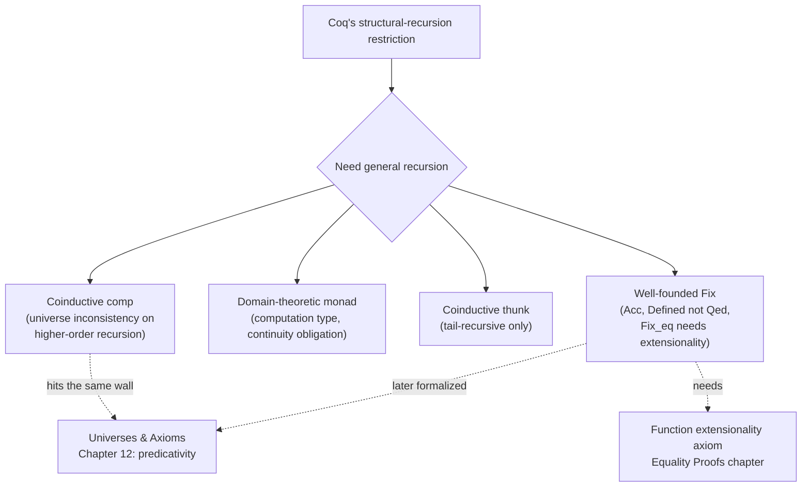

[[book-guidelines|↩ Back to guidelines]]

## Why does Coq reject perfectly good recursive functions?

Gallina's termination checker is deliberately conservative: for a `Fixpoint`, every recursive call must be on a **syntactic subterm** of the original argument — this is **primitive recursion** in Coq's sense. It's a purely syntactic criterion, checkable without running anything, and it guarantees strong normalization (every well-typed term reduces to a value in finitely many steps). That guarantee isn't optional decoration — by Curry–Howard, a non-terminating term of any type would "prove" any proposition, so unrestricted recursion would make the whole logic inconsistent. (Co-recursive definitions face the dual restriction, the guardedness condition from the coinduction topic — every co-recursive call must be a direct constructor argument.)

The trouble is that plenty of *obviously* terminating functions don't fit this syntactic mold. The book's running example is merge sort:

```
Fixpoint mergeSort (ls : list A) : list A :=
  if leb (length ls) 1
    then ls
    else let lss := split ls in
       merge (mergeSort (fst lss)) (mergeSort (snd lss)).
```

Coq rejects this outright: `Recursive call to mergeSort has principal argument equal to "fst (split ls)" instead of a subterm of "ls"`. The recursion terminates because `split` produces two lists each strictly shorter than the input — but that's a *semantic* fact about `split`'s behavior, not something visible in the term's syntax. This gap between "syntactically structural" and "actually terminates" is exactly what the chapter's three alternative techniques close, each trading off differently between convenience, proof burden, and expressiveness.

**Grounding (Rust):** this is the same wall you hit writing a divide-and-conquer function over a `Vec<T>` where the compiler can't see that a recursive call operates on a strictly smaller slice unless the borrow/length relationship is spelled out — Rust just doesn't check termination at all, so the analogous failure mode there is a non-terminating function type-checking silently. Coq's stricter discipline is the price of proof-term termination as a soundness property, not merely a language nicety.

## Technique 1: Well-founded recursion

**Well-foundedness**: a relation $R$ on $A$ is well-founded if there are no infinite descending chains $\ldots R\ a_2\ R\ a_1\ R\ a_0$. Coq formalizes this not by directly quantifying over chains, but via an *accessibility predicate*:

```
Inductive Acc (A : Type) (R : A → A → Prop) (x : A) : Prop :=
  Acc_intro : (∀ y : A, R y x → Acc R y) → Acc R x.

well_founded R := ∀ a : A, Acc R a.
```

Read `Acc R x` as: "every element $R$-smaller than $x$ is itself accessible." Since `Acc` is an *inductive* proposition, any actual accessibility proof must bottom out after finitely many nested constructor applications — you cannot build an infinite `Acc_intro` chain any more than you can build an infinite `nat` from `S`. This is a genuinely elegant move: instead of stating "no infinite descending chains" as a direct (and awkward, second-order-feeling) property, well-foundedness is *encoded as an inductive type*, so the absence of infinite descent falls out of CIC's own termination guarantee for inductive definitions, for free. The book makes this rigorous by defining a coinductive `infiniteDecreasingChain` predicate and proving `noBadChains`: any `Acc`-accessible element cannot start such a chain — accessibility and "no infinite descent" are provably the same idea from two directions (inductive vs. coinductive).

The payoff is the standard-library combinator:

```
Fix : ∀ (A : Type) (R : A → A → Prop), well_founded R →
      ∀ P : A → Type,
      (∀ x : A, (∀ y : A, R y x → P y) → P x) →
      ∀ x : A, P x
```

You supply a well-foundedness proof for your chosen order $R$, and a function body that receives, alongside the argument `x`, a "recursive self" that only accepts arguments *provably $R$-smaller than $x$* — the well-foundedness restriction is baked directly into the type of the thing you're allowed to call recursively. For `mergeSort`, the order is `lengthOrder ls1 ls2 := length ls1 < length ls2`, and you must separately prove `split` produces two `lengthOrder`-smaller results (`split_wf1`, `split_wf2`) before `Fix` will accept the definition.

**The subtle, load-bearing wrinkle:** the well-foundedness and `split_wf` proofs must end in `Defined`, not `Qed`. `Qed` marks a proof *opaque* — its internal structure is sealed off from later computation. But `Fix` type-checks by being *structurally recursive on the shape of the `Acc` proof itself* (accessibility proofs, being inductively built, are ordinary structurally-decreasing data from the kernel's point of view). If that proof is opaque, unwinding `Fix` at evaluation time gets stuck — the reduction has nothing to structurally recurse on. This is the general Coq lesson: **`Defined` vs. `Qed` is not stylistic — it's a decision about whether a proof's *content*, not just its *existence*, will be needed by later computation.**

A second wrinkle: to later prove things *about* a `Fix`-defined function (not just evaluate it), you need `Fix_eq`, whose statement requires an extra hypothesis that the function body treats extensionally-equal "self" arguments identically — because **general function extensionality is neither provable nor disprovable in bare CIC** (a fact the book revisits at length in the equality-proofs chapter). You must discharge this per-definition, by hand, every time.

**Grounding (Lean):** this is *exactly* Lean's own recursion story, made more ergonomic on the surface. Lean's `termination_by`/`decreasing_by` syntax lets you write a recursive function with an arbitrary measure or well-founded order, and behind the scenes Lean elaborates it into a call to `WellFounded.fix` — the direct namesake and structural analogue of Coq's `Fix` here, built on Lean's own `Acc`. When Lean's automation can't find the decreasing proof itself, you supply a `decreasing_by` tactic block — functionally identical to Coq's obligation to hand-prove `split_wf1`/`split_wf2`. If you are building a compiler with well-founded-recursion support for user-defined functions (e.g., checking a `requires`-style termination measure on a refinement-typed language), this `Acc`/`Fix` pattern *is* the mechanism: an accessibility proof is precisely a certificate that a term's measure will actually reach base cases, which is the semantic content underlying any termination check your elaborator performs.

## Technique 2: A domain-theory-inspired non-termination monad

Well-founded recursion demands an upfront termination proof for *every* input. Sometimes you want to write a function that might not terminate on some inputs, and reason about it anyway on the inputs where it does. **Domain theory** supplies the right intuition: order computation results by how much information they carry — "diverges" is an *approximation* of "returns 5," which is not itself an approximation of "returns 6." The book builds a `computation` type directly on this idea:

```
Definition computation A :=
  {f : nat → option A
    | ∀ n v, f n = Some v → ∀ n', n' ≥ n → f n' = Some v}.
```

A computation is a function from an *approximation level* to an optional result, monotone in the sense that once some level succeeds, every higher level agrees. `run m v := ∃ n, proj1_sig m n = Some v` captures "the computation eventually yields `v`," abstracting away which level was sufficient. `Bottom` (never terminates — returns `None` at every level), `Return` (terminates immediately at every level), and `Bind` (chain two computations, taking the max of the two approximation levels needed) form a genuine monad, verified against the standard left-identity/right-identity/associativity laws.

The recursion combinator here needs one further ingredient: **continuity**. A recursive definition is written as a function `f : (A → computation B) → (A → computation B)` parameterized over "myself," and you must prove `f` is continuous — informally, if `f` terminates when given one approximation of "self," it terminates identically when given any *better* approximation (per the `leq` information order on `option A`). Given continuity, `Fix` is defined by literally indexing on approximation level:

```
Fixpoint Fix' (n : nat) (x : A) : computation B :=
  match n with
  | O => Bottom
  | S n' => f (Fix' n') x
  end.
```

At level 0 you always diverge; at level `n+1` you run the body against the level-`n` approximation of the recursive self. No termination proof is required at all — `mergeSort'` and even a function that fails to terminate on *some* inputs (`looper`) both type-check unconditionally. The cost has moved from "prove termination up front" to "prove continuity of the body" (usually easy, provided automatically by the book's tactics) plus a permanent `computation`-wrapped return type that infects every caller — you're now working inside a genuine non-termination monad, not in ordinary Gallina values.

## Technique 3: Co-inductive non-termination monads

Both prior techniques force you into unusual syntax (explicit `Fix` calls) and immediate proof obligations at definition time. Chapter 5's guarded coinduction offers a third route: encode a possibly-diverging computation as a coinductive value built by an *unbounded* number of "not yet" steps.

**Capretta's `thunk`:**

```
CoInductive thunk (A : Type) : Type :=
| Answer : A → thunk A
| Think : thunk A → thunk A.
```

A `thunk` is either an immediate answer or a "think one more step" wrapped around another thunk; since `thunk` is coinductive, it's also inhabited by an infinite nesting of `Think`s standing for outright non-termination. `TBind` composes thunks by threading `Think` through the recursive call so the guardedness condition is respected. This works cleanly for **tail-recursive** definitions like a thunked factorial — but Fibonacci breaks it: `n1 ← fib (pred n); n2 ← fib (pred (pred n)); Answer (n1+n2)` is rejected, because the two recursive calls are arguments to `TBind`, and `TBind` is a *defined function*, not a `thunk` constructor — so the guardedness checker (which only looks at literal constructor applications) can't see through it. `thunk` simply cannot express "do more computation after a recursive call returns," which rules out any non-tail-recursive structure.

**Megacz's `comp`** fixes this by making bind itself a constructor:

```
CoInductive comp (A : Type) : Type :=
| Ret : A → comp A
| Bnd : ∀ B, comp B → (B → comp A) → comp A.
```

Now Fibonacci (and non-tail-recursive `mergeSort''`) type-check directly, with dramatically less syntactic overhead than either prior technique — no explicit `Fix`, no continuity proof, no well-foundedness proof. It looks like the winning design. But it has a fatal expressivity ceiling: `comp`'s `Bnd` constructor quantifies over an arbitrary type `B`, and Coq's **predicativity restriction** (previewed here, formalized in the [[Universes-and-Axioms|Universes and Axioms]] chapter) forbids instantiating such a quantifier with a term that itself mentions the type being defined. Trying to bind a computation returning a *function* whose codomain is itself `comp`-typed (`Bnd (curriedAdd 2) (fun f => f 3)` where `curriedAdd 2 : comp (nat → comp nat)`) triggers a hard `Universe inconsistency` error. `comp` is unusable for genuinely higher-order recursive functional programs — a real cost hidden behind its inviting simplicity.

## Comparing the four (well-founded recursion, domain-theoretic monad, `thunk`, `comp`)

No technique dominates; the chapter closes with an explicit tradeoff table along several axes:

| Property | Well-founded `Fix` | Domain-theoretic monad | `thunk` | `comp` |
|---|---|---|---|---|
| Function type unaffected by recursion style | Yes | Partial (return type is monadic) | No (monadic) | No (monadic) |
| Evaluates via Coq's built-in computation alone | Yes | Mostly (once approximation level is high enough) | No (needs `frob`/co-recursion unfolding) | No |
| Termination proof separable from definition | No — proof required up front | Yes | Yes | Yes |
| Supports partial (sometimes-diverging) functions | No | Yes | Yes | Yes |
| Supports non-tail-recursive control flow | Yes | Yes | **No** | Yes |
| Fundamental expressivity ceiling | None found | None found | Tail-recursion only | Universe inconsistency on higher-order recursion |

The deep pattern: **every technique buys a real advantage (separability, partiality, syntactic naturalness) at a real cost (proof obligations, monadic contamination, or an outright expressivity wall)**, and there is no encoding that gets you a syntactically natural, type-preserving, freely-partial recursion story for free. This mirrors the broader lesson of Chapter 12 (Universes and Axioms): CIC's own consistency requirements — strict positivity, predicativity — are not arbitrary red tape; they are exactly what keeps showing up as the wall each successive "clever encoding" eventually hits.

## Where this leads



Well-founded recursion here is the direct ancestor of Lean's `WellFounded.fix`/`termination_by` machinery named above — if the compiler project's refinement-type language needs to accept user-supplied termination measures (a natural requirement once you're proving Hoare-style contracts about recursive functions), this chapter's `Acc`/`Fix` pair is the load-bearing mechanism, and the `Defined`-vs-`Qed` transparency distinction is exactly the kind of "does the kernel need to compute through this proof" question your own trusted-kernel design will need to answer for termination certificates. The predicativity wall that kills `comp` is the same restriction the Universes and Axioms chapter formalizes in full — worth remembering when designing any inductively-defined effect/monad type in your own system that quantifies over an unbounded type parameter.
