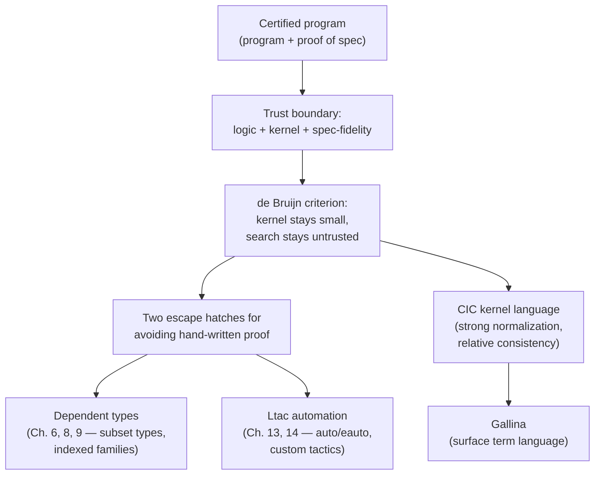

[[book-guidelines|↩ Back to guidelines]]

## Why does a "certified program" need a whole book's worth of justification?

Start from the failure mode this book exists to fix. Most software ships with zero mathematical evidence that it does what it claims — you write tests, you review code, you hope. The promise of formal verification has been around since the 1960s, and it has a bad reputation: too much cost, too little payoff, for most practitioners. Chlipala's opening move is not to defend that promise in the abstract, but to redefine what "certified" means so precisely that the payoff becomes obvious.

**Certified program**: a program bundled with a *certificate* — a formal, machine-checked mathematical artifact proving the program meets its specification. This is unrelated to governmental/regulatory "certification," which typically gives you a paper trail, not a proof. A certified program gives you a guarantee bounded only by three trust assumptions:

1. You trust the definition of the foundational logic (here, the Calculus of Inductive Constructions — more below).
2. You trust the implementation of that logic (the Coq kernel).
3. You trust that your formal specification actually captures your informal intent.

That's it. Once those three hold, there is no fourth place for a bug to hide — the theorem, and the fact that this specific program inhabits it, is *checked*, not merely reviewed.

A closely related but distinct notion: a **certifying program** is one that, at *each run*, emits both an answer and a proof that *that particular answer* is correct — rather than a single up-front proof that *every* answer the program could ever produce is correct. Compilers are a natural example: instead of proving "this compiler is correct" once and for all (a certified compiler), you can have the compiler emit, alongside each compiled output, a proof that this specific output is semantically equivalent to this specific input (a certifying compiler). Composing a certifying program with an independent proof checker yields a certified program as an end-to-end artifact — the certifying-plus-checker pipeline is where you place your final trust, not the certifying program by itself. The book's main focus is the certified case, but the two notions constantly interact: [[Proof-by-Reflection|proof by reflection]] (§1.2.5, its own topic later) is essentially a way of writing certifying *procedures* whose *type* already proves that any answer they'd produce is correct.

**Grounding (Rust):** think of the difference between a function whose type signature statically rules out a whole class of bugs (`fn divide(n: u32, d: NonZeroU32) -> u32` — certified: division-by-zero is a type error, not a runtime concern) versus a function that returns a `Result` alongside a witness (`fn divide_checked(n: u32, d: u32) -> Result<(u32, DivisionProof), DivByZero>` — certifying: each call proves its own correctness at the value level, and something downstream still has to check the `DivisionProof`). The certified version pushes the guarantee into the type; the certifying version defers it to a runtime artifact plus a checker.

## Why should you trust *any* of this? — the de Bruijn criterion

If certification rests on trusting an implementation of a logic, that implementation had better be small and simple, or you've just moved the bug risk rather than removing it. This is where the **de Bruijn criterion** enters: a proof assistant satisfies it if every proof it produces — no matter how baroque, heuristic, or exotic the search procedure that *found* the proof — is ultimately expressed as a term in a *small, simple, independently checkable kernel language*.

This is the single most important architectural idea in the whole book, because it's what licenses everything that follows: elaborate automation (Ltac, `auto`, `eauto`, reflection-based decision procedures) can be as complicated, as buggy, or as heuristic as you like, and none of that complexity ever has to be trusted — only the kernel that checks the *resulting proof term* has to be trusted, and that kernel can be kept small enough to audit by hand. The kernel's language for CPDT's purposes is the Gallina term language, described below.

This is exactly the **trusted computing base** (TCB) principle familiar from systems security, applied to proof: minimize what must be correct for the whole system to be sound, and let everything else be untrusted machinery whose only job is to *propose* candidates that the trusted part independently verifies.

**Grounding (Lean):** this is precisely the architecture of Lean's own elaborator/kernel split. Lean's elaborator — tactics, unification, metaprogramming, instance search — is large, complex, and not trusted. What *is* trusted is the kernel: a small type-checker that re-derives, from first principles, that a fully-elaborated term has the type it claims. `#print axioms foo` in Lean is the direct analogue of Coq's `Print Assumptions` (covered later, in [[Universes-and-Axioms|Universes and Axioms]]) — both let you audit exactly what a proof ultimately rests on. If you are building an elaborator with a metavariable-unification engine of your own, the de Bruijn criterion is the design constraint that tells you where the line between "trusted" and "untrusted" code must fall: your unifier and your bidirectional type-inference machinery can be arbitrarily heuristic (backtracking, retry loops, best-effort search), as long as the *last* step is "re-check the elaborated term against a small independent checker." Get this boundary wrong — e.g., let the elaborator's own judgment of success stand in for kernel re-checking — and a single elaborator bug becomes a soundness hole in every program the whole system accepts.

Chlipala surveys five tools against this and other criteria (each satisfying: intended for software use, well-engineered, has an outside user community — ACL2, Coq, Isabelle/HOL, PVS, Twelf):

| Tool | de Bruijn criterion | Dependent types | Automation |
|---|---|---|---|
| ACL2 | No — fancy decision procedures leave no "evidence trail" | None (first-order only) | Powerful, but untrusted (bugs in the decision procedure are soundness holes) |
| Coq | Yes | Full CIC | Ltac: DSL for building trusted, kernel-checked automation |
| Isabelle/HOL | Yes, "manifestly" | None (HOL is simply typed) | ML-level extension, kernel-checked |
| PVS | Murky — primitive steps include things as strong as a full propositional-tautology solver | Subset types only (a predicate refining a base type) | Strategies built from stronger primitives than Coq's |
| Twelf | Murky | Restricted, monomorphic dependent types (needed for its own soundness argument) | Essentially none outside its niche (syntactic metatheory of languages/logics) |

The pattern to notice: **de Bruijn compliance and automation power are in tension**, and the resolution is always the same — push automation *outside* the kernel and force it to justify itself in kernel terms. ACL2 buys automation power by giving up the criterion entirely (you must trust the decision procedures themselves). PVS blurs the line by making its "primitive" kernel steps unusually strong. Coq's answer — and the one this book is entirely organized around — is `Ltac`: write powerful automation as ordinary Coq-level programs that, no matter how they search, can only ever *emit* a term the untrusted-search-independent kernel re-checks. This is why later chapters (Logic Programming, Ltac, Proof by Reflection) matter architecturally, not just pragmatically: they are all instances of "how do I get automation power without weakening the kernel."

## Why dependent types, specifically?

**Dependent type**: a type that may itself contain, or refer to, ordinary program terms (values), not just other types. The canonical example: an array type parameterized by a *term* giving its length, so that "index out of bounds" becomes something the type checker rules out statically rather than something checked at runtime. Pushed further, dependent types let you encode essentially arbitrary correctness properties directly into a type — later in the book, a compiler's own type will guarantee that it maps well-typed source programs to well-typed target programs (this is literally Chapter 2's running example).

The payoff that matters most for engineering effort, not just expressiveness: dependent types often let you write a certified program *without writing anything that looks like a proof at all*. If a function's type is precise enough, the fact that it type-checks *is* the correctness proof — there's no separate `Theorem ... Qed.` to author. Subset types (PVS's whole dependent-type story, and the subject of Chapter 6) can express almost any property "with enough acrobatics," but subset types still typically require the human to discharge an explicit side-proof; richer dependent types (indexed families, discussed starting in Chapter 8) push more of the guarantee into the type itself.

**Grounding (Rust → Lean progression):** Rust's type system captures a shallow, syntactic slice of this idea — a `NonZeroU32` type rules out a value being `0` at the type level, and array-bounds-checked slicing (`&arr[..n]`) defers the same property to a runtime panic. Rust cannot express "this array's static type carries its exact runtime length as a term," because Rust types cannot depend on values (const generics get partway there for compile-time-known lengths, but not for arbitrary runtime-computed ones). Lean can state exactly this: `def safeGet (v : Vector α n) (i : Fin n) : α`, where `Fin n` is a type *whose very definition depends on the term* `n` — the type of valid indices is different for every different length, and out-of-bounds access is a type error, not a runtime check. This `Vector`/`Fin` idiom is CPDT's own running example later (length-indexed lists, `ilist`, and the `fin n` index type — a direct preview you'll meet again in "[[Dependent-Types-for-Program-Correctness|Dependent Types for Program Correctness]]").

## Why Coq over Agda or Epigram?

All of these languages descend from the same type-theoretic lineage — Chlipala's own analogy is "different historical offshoots of Latin": the deep conceptual moves transfer across all of them. So why pick one?

His answer is narrow and specific: **none of the alternatives has a mature system for tactic-based, semi-automated theorem proving.** Agda and Epigram are designed and marketed primarily as *programming languages* that happen to support dependent types, not as proof assistants. This matters because of a structural fact about proofs: **proving is unavoidable whenever a correctness proof's shape does not mirror the shape of the program itself.** The canonical example is compiler correctness: the proof proceeds by induction on the *execution trace* of the compiled program, a structure with no simple relationship to the compiler's own source-level recursive structure or to the structure of the programs it compiles. No amount of dependent-type cleverness turns that mismatch away — you need genuine, possibly long, tactic-driven proof engineering, and that's precisely the machinery Agda/Epigram under-invest in.

The tradeoff is real, not one-sided: Agda and Epigram, unencumbered by decades of tactic-proving baggage, tend to be the first home for innovations in practical dependently typed *programming* — some dependently typed programs are simply easier to write there than in Coq. Chlipala's claim (anecdotal, by his own admission) is that manual tactic-proving is orders of magnitude more expensive to do without good tooling than manually working around Coq's rougher programming ergonomics — so for genuinely proof-heavy projects, Coq wins on expected effort even if it loses on day-to-day programming polish.

## The language stack: CIC, Gallina, Ltac, Vernacular

By the time you're a few pages into Chapter 2, "Coq" has quietly split into four distinct languages, and conflating them is a common source of confusion:

- **CIC (Calculus of Inductive Constructions)** — the actual *theoretical foundation*: a formal type theory extending the older Calculus of Constructions (CoC) with [[Inductive-Types|inductive types]]. CIC is deliberately spartan — good for proving metatheory about, less pleasant to program in directly.
- **Gallina** — the language Coq programmers actually write: an *extension* of CIC with convenience features. Definitions, `match` expressions, `fun`, and the whole functional-programming surface syntax are Gallina. The important metatheoretic results proved about bare CIC (below) have not all been re-proved for the full breadth of Gallina's extensions — in practice this hasn't cost anyone sleep, but it is a genuine, acknowledged gap between "the theory we can prove things about" and "the language we actually type-check programs in."
- **Ltac** — the separate domain-specific language for writing tactics/decision procedures. Ltac programs *produce* Gallina/CIC terms; they are themselves untrusted (per the de Bruijn criterion above).
- **Vernacular** — the top-level command language: `Definition`, `Inductive`, `Theorem`, `Print Assumptions`, etc. Every Coq source file is a tree of vernacular commands, many of which take Gallina or Ltac programs as arguments.

Two metatheoretic properties are proved about CIC specifically (not, strictly, about the full Gallina extension):

- **Strong normalization**: every well-typed program — and, because of Curry–Howard, every proof term — *terminates*. There is no infinite loop hiding anywhere in CIC. This is what makes "type-checking a proof" a decidable, always-terminating procedure, and it's also precisely why Coq's `Fixpoint` enforces a syntactic structural-recursion restriction (the subject of the later "[[Techniques-for-General-Recursion|Techniques for General Recursion]]" topic) — without such a restriction you could write a non-terminating term, and by Curry–Howard a non-terminating term of any proposition's type would "prove" that proposition, making the whole logic inconsistent.
- **Relative consistency**: CIC is consistent relative to systems like (a version of) Zermelo–Fraenkel set theory — informally, if you already believe set theory doesn't secretly prove `False`, you get to believe CIC doesn't either, and therefore that a CIC proof of a proposition really does mean that proposition is true.

**Grounding (Lean):** the same stack exists in Lean, with the same names doing analogous jobs — Lean's kernel is (an implementation of) a small dependent type theory in this same family; Lean's surface `def`/`theorem`/tactic-mode language is the Gallina analogue; Lean's `tactic`/`Elab` metaprogramming framework is the Ltac analogue, similarly untrusted and similarly required to bottom out in kernel-checkable terms; and Lean's own command language (`#check`, `#eval`, `set_option`, ...) plays the Vernacular role. When this book later formalizes something and you want to ask "what would the Lean equivalent look like," this four-layer decomposition is the map: find the CIC-equivalent core construct first, then ask which layer (surface language vs. tactic vs. command) the book's Coq code is actually operating at.

## Design patterns for readable, maintainable proofs

Coq has a real reputation problem, and Chlipala doesn't dodge it: it is *very* easy to write proof scripts that manipulate goals imperatively, step by step, with zero structure — the kind of proof that conveys nothing about *why* the theorem is true to anyone but its original author. His analogy: judging Coq by such scripts is like judging a programming language by the code first-week undergraduates write in it. The pragmatics of mechanized proving are, in his telling, decades behind the pragmatics of programming — the equivalent of "programming design patterns" for proof scripts mostly haven't been written down yet.

The book's proposed fix reduces to two recurring techniques, used from the very first chapter onward rather than saved for an "advanced" section at the end:

1. **Dependently typed functions** — push correctness into types so there's less (or no) proof left to write by hand.
2. **Custom Ltac decision procedures** — where proof remains unavoidable, replace long, brittle, hand-sequenced tactic invocations with short, robust, reusable automation.

Both techniques are visible immediately in Chapter 2's compiler-correctness demo, and both recur as the organizing spine of the entire book — Parts II and III are essentially deep dives into technique (1) and technique (2), respectively.

## Where this leads

This chapter sets the vocabulary and the trust architecture that every later chapter assumes without re-explaining: when Chapter 6 shows you `sig`/subset types, it's cashing in on "dependent types let you avoid writing proofs." When Chapter 13 shows you `auto`/`eauto` hint databases, it's cashing in on "Ltac lets you build automation without weakening the kernel." When Chapter 12 (Universes and Axioms) worries about which axioms are safe to assume, it's directly interrogating the "trust the logic" leg of the certified-program trust triangle from this chapter.

For the compiler/elaborator project this vault is oriented around (`type-theory`, `automated-reasoning`): the de Bruijn criterion is the load-bearing design constraint for *any* elaborator with an embedded unifier or automated theorem prover — it's the reason a Miller-pattern metavariable unifier, however heuristic its search, must ultimately discharge into a term a small, independent kernel re-checks, exactly the way this chapter describes Ltac's relationship to the Gallina/CIC kernel. And the "dependent types eliminate proof obligations" theme previewed here — subset types, indexed families, `Fin n`-style bounded indices — is the direct ancestor of how a refinement-type surface language should be designed to push verification work into type-checking rather than into a separate proof-search phase wherever possible.
