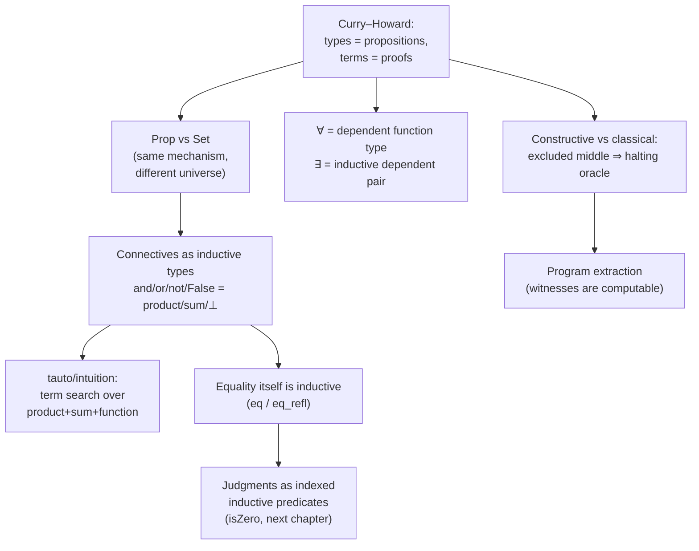

[[book-guidelines|↩ Back to guidelines]]

## What problem does identifying proofs with programs actually solve?

Mainstream mathematics treats a proof as something that lives *outside* the universe of mathematical objects — you write a proof about a number, but the proof itself isn't a number, isn't a set, isn't anything the rest of your formal system can talk about. That separation is exactly what makes proofs hard to *check by machine*: you need a whole separate apparatus (a logic, an inference-rule checker) bolted onto whatever apparatus already checks your programs. Chlipala's move — inherited from Curry and Howard, hence **Curry–Howard correspondence** — is to collapse that separation: represent a theorem as a *type*, such that a proof of the theorem is *exactly* a program that type-checks at that type. One type-checking algorithm now validates both your code and your mathematics.

This isn't a metaphor or a loose analogy grafted on after the fact — it's already been silently at work. Recall the arrow `→` from the very first compiler example in the book: it was used both for function types (`nat → nat`) and for logical implication. That's not overloaded notation; under Curry–Howard, function types and implications are *the same construct*, described twice because two different intellectual traditions independently arrived at it.

## The demonstration: implication *is* function type

The book makes this concrete with a genuinely striking minimal example. The identity function on naturals is unremarkable:

```
Check (fun x : nat => x).
   : nat -> nat
```

Now replace `nat` with `True` — Coq's always-true proposition — and nothing about the term itself changes shape:

```
Check (fun x : True => x).
   : True -> True
```

That second line is simultaneously "a function from `True` to `True`" and "a *proof* that `True` implies itself." An implication proof is a *process that transforms a hypothesis into a conclusion* — take a proof of the premise, hand back a proof of the conclusion — which is precisely what a function does with its argument and return value. This lines up with informal mathematical practice, where you already think of "assume `P`... therefore `Q`" as a transformation, not as some abstract non-computational act.

The single canonical proof of `True` is a primitive term `I`:

```
Check I.
   : True
Check (fun _ : False => I).
   : False -> True
```

— and `False`, having no constructors, has no closed proof term, which is exactly why `fun x : False => x : False -> False` type-checks (vacuously — the function body is well-typed but can never actually be invoked with a real argument) while nothing type-checks at type `False` alone. Any Gallina term whose type is a proposition (a "logical" type — precisely what makes a type logical is elaborated over the rest of the chapter, and formalized in Chapter 12's `Prop`/`Set` distinction) is called a **proof term**.

## `Prop`, `Set`, and why the correspondence is intentionally *not* pushed all the way

A tempting simplification once you've seen `True`/`I` line up with `unit`/`tt` — and indeed the standard-library definitions are structurally identical up to substituting `Prop` for `Set`:

```
Inductive unit : Set  := tt : unit
Inductive True : Prop := I    : True
```

— is to conclude these should simply be *the same type*. Chlipala explicitly argues against this, and the argument matters for how you should think about type theory in general, not just as Coq trivia. The distinguishing principle is **proof irrelevance**: to an engineer, not all functions `A -> B` are interchangeable (a sorting function and a function that always crashes both inhabit `[T] -> [T]`, but they are very different programs), whereas *all* proofs of a proposition `P -> Q` genuinely are interchangeable — a theorem's proof carries no information beyond the bare fact that the theorem holds. Proof irrelevance is *compatible with* Gallina but not *derivable* in it; Coq keeps `Prop` and `Set` as separate universes partly to make room for this principle (efficient compilation — proof-irrelevant terms can be erased at runtime — and avoidance of certain classical-logic paradoxes are the other stated reasons). Practically, this is why the book organizes almost its entire structure around treating *programming* (ordinary functional-programming technique, now enriched with dependent types) and *proving* (custom Ltac decision procedures) as genuinely different disciplines, even though both compile down to the same underlying term language.

**Grounding (Lean):** this is exactly Lean's own `Prop`/`Type` split, and Lean goes further than Coq by baking in actual **definitional proof irrelevance** for `Prop` — any two proofs of the same proposition in Lean are not just *treated* as interchangeable by convention, they are *definitionally equal*, full stop, which Coq's Gallina does not give you for free. When you write `rfl` to close a goal in Lean, you're producing a Curry–Howard proof term exactly the way `Check (fun x : True => x)` above is a proof term — the difference is that Lean's elaborator and kernel actively exploit the `Prop` universe's irrelevance when comparing terms during type-checking, which is directly relevant if you're building a kernel that needs to decide definitional equality efficiently: knowing a subterm lives in `Prop` lets you skip comparing its *contents* entirely.

## The propositional connectives, built from the same machinery as datatypes

The book's real payoff move: instead of introducing a separate logical apparatus for `∧`, `∨`, `¬`, it defines every connective as an ordinary `Inductive` type in `Prop`, using the *exact same mechanism* used for `list` or `nat` in the previous chapter.

```
Inductive False : Prop :=
(* no constructors — nothing can prove False in a consistent context *)

Definition not (A : Prop) := A -> False
(* ¬ P is notation for `not P` *)

Inductive and (A B : Prop) : Prop := conj : A -> B -> A /\ B
Inductive or  (A B : Prop) : Prop :=
  | or_introl : A -> A \/ B
  | or_intror : B -> A \/ B
```

Each definition has a load-bearing computational reading:

- **`False`** has zero constructors, so a proof of `False → anything` can be discharged by `destruct` on the (nonexistent) proof — case-splitting on zero cases immediately closes the goal. This is the formal machinery behind deriving anything from an inconsistent hypothesis (`elimtype False`, then `crush`).
- **`not A := A -> False`** makes negation *literally* "a function that turns a proof of `A` into a proof of the impossible" — refuting `A` is producing that function.
- **`and`/`conj`** is Curry–Howard's mirror of a product/pair type (Chlipala notes its exact analogue is `prod`): a proof of `A ∧ B` *is* a pair holding a proof of `A` and a proof of `B`. `destruct` on a proof of `A ∧ B` literally pattern-matches the pair to extract both components.
- **`or`/`or_introl`/`or_intror`** is Curry–Howard's mirror of a sum/`Either` type: proving `A ∨ B` means committing, at construction time, to a *specific side* and supplying a proof for it — there is no proof of a disjunction that doesn't reveal which disjunct holds. This single fact is the seed of the entire classical/constructive distinction below.

**Grounding (Rust):** the isomorphism is exact and load-bearing, not decorative. `and`/`conj` is `struct And<A, B>(A, B)` — literally a tuple/product. `or`/`or_introl`/`or_intror` is `enum Or<A, B> { Left(A), Right(B) }` — literally `Result`/`Either`. Constructing an `Or::Left(proof_of_a)` value in Rust is structurally the same act as constructing a Coq term `or_introl proof_of_a : A \/ B` — the difference is only which universe (`Type` vs `Prop`) the result is checked against. This is worth internalizing precisely because it demystifies why `tauto` — Coq's "complete decision procedure for constructive propositional logic" (used to auto-discharge goals like `P \/ Q -> Q \/ P`) — is *possible* at all: it is doing nothing more exotic than a term-search algorithm over a small fixed set of product/sum/function constructors, i.e., program synthesis for a tiny total functional language. `intuition` generalizes `tauto` by handling the propositional "glue" of a goal and leaving domain-specific residue (arithmetic, list facts) for other tactics to close — visible in the book's own worked example, where `intuition` reduces a mixed arithmetic/propositional goal to a pure arithmetic fact about `length (ls1 ++ ls2)`, which `rewrite app_length` then turns into a pure tautology `tauto` can finish.

## Why classical tautologies fail — and the halting problem is *why*

This is the sharpest and most consequential idea in the chapter. Constructive (intuitionistic) logic, which Gallina implements, does **not** validate two tautologies you'd take for granted classically:

$$\neg\neg P \rightarrow P \qquad \text{and} \qquad P \lor \neg P \quad \text{(the law of excluded middle)}$$

These only hold constructively when $P$ is *decidable* — when there's an actual terminating procedure that determines which case you're in. The reason traces directly back to the `or` constructors above: a Coq proof of `P \/ ¬P` is a Gallina *term*, and since proofs are programs, you can *run* it. Running it means executing a `match` that reveals — via `or_introl` or `or_intror` — whether the term chose to prove `P` or prove `¬P`. If excluded middle held *unconditionally*, for *every* proposition `P`, you would have a general, always-terminating procedure that decides, for any proposition, which disjunct it is — and since propositions can encode statements like "this specific Turing machine halts," that procedure would decide the halting problem. Since the halting problem is undecidable, unconditional excluded middle cannot be provable in a logic whose proofs are literally executable programs. This is Curry–Howard doing real epistemic work, not just a syntactic curiosity: it's the reason `bool` and `Prop` must stay separate types. `bool` is exactly two values and evaluation is decidable by construction (you can always run a `bool`-valued computation to get `true` or `false`); `Prop` deliberately admits *undecidable* propositions, and that expressiveness is bought at the cost of "you cannot in general just run a `Prop` to see if it's true."

**Grounding (Python, as a sketch — not load-bearing):** imagine `decide(p: Proposition) -> bool` as a Python function that must terminate on *every* input proposition and correctly report which side of `p \/ not p` holds. Feed it a proposition encoding "program X halts on input Y," and you've built a halting-problem oracle. The undecidability of the halting problem is precisely the classical-mathematics argument for why no such total `decide` can exist — Curry–Howard just makes that argument bite *inside the logic itself*, because in Coq, "prove excluded middle for all P" and "write a total decision procedure for all P" are the *same statement*, not merely analogous ones.

**Grounding (Lean):** Lean, being classical-by-default in its standard library (`Classical.em` is available as an axiom, exactly analogous to Coq's optional `Classical` library), makes the tradeoff visible in the other direction — if you `open Classical` and use `em`, you gain a shorter, more familiar style of proof, but you also *give up* the guarantee that your proof term computes to a ground answer via ordinary reduction, because that axiom-derived term gets stuck the moment you try to evaluate it (this exact stuck-computation phenomenon is the subject of the later "[[Universes-and-Axioms|Universes and Axioms]]" topic). Knowing *why* — a total decision procedure over all propositions would be a halting oracle — tells you precisely what you're forfeiting each time you reach for `Classical.em`, `Classical.byContradiction`, or Coq's `Classical.classic`: not "elegance," but the property that the proof, viewed as a program, is guaranteed to actually finish computing something.

## Program extraction: the reward for staying constructive

Because constructive proofs *are* programs, and because each connective's proof carries a genuine witness (a proof of `∃ x, P x` contains an actual `x`; a proof of `A ∨ B` reveals which side), Coq can mechanically strip the propositional "scaffolding" out of a constructive proof and produce an ordinary executable program — **program extraction**. The book flags this technique but is careful to warn against overusing it: because a proof's shape is optimized for being *easy to prove*, not for being *efficient*, extracting a genuinely usable program from a hand-constructed proof term is a niche, mostly theoretical exercise rather than the book's everyday workflow. (Extraction is used to more practical effect in Chapter 2's compiler examples, generating OCaml directly from Gallina *programs*, which is a related but distinct use of the same mechanism.) The key structural fact that makes extraction *possible at all* is the one from the previous section, seen from the other direction: classical proofs built via excluded middle typically don't carry a computable witness, which is exactly why they can't be extracted the same way.

## Quantifiers: `∀` as dependent function type, `∃` as an inductive pair

First-order logic slots into the same picture with no new primitive machinery:

- **Universal quantification `∀`** is not a separate Coq construct at all — it *is* the dependent function type (the very thing "dependent types" names, previewed in the first topic). Implication itself is just the special case where the quantified variable doesn't occur in the body: $P \to Q$ desugars to $\forall x : P,\, Q$. Read literally, this says an implication proof is "a function that, given *any* proof of $P$, produces a proof of $Q$" — which is exactly the reading given to `fun x : True => x` above, now generalized.
- **Existential quantification `∃`** is not built in — it's an ordinary inductive family, `ex`:

```
Inductive ex (A : Type) (P : A -> Prop) : Prop :=
  ex_intro : forall x : A, P x -> ex P
```

  A proof of `∃ x : A, P x` is literally a *dependent pair*: a witness `x : A` bundled with a proof that `P x` holds for that specific `x`. This is why the `exists` tactic (distinct from the formula-level `∃`/`ex` despite the name collision) works the way it does — it discharges the goal by supplying the witness up front (`exists 1.` reduces `∃ x : nat, x + 1 = 2` to the ground goal `1 + 1 = 2`), and conversely `destruct` on an existential *hypothesis* extracts both the witness variable and its accompanying proof into the local context, ready for further reasoning. `firstorder` generalizes `intuition` to this quantifier-aware setting, at the cost of being far more prone to nontermination-feeling slowness, since first-order proof search is a strictly harder problem than pure propositional search.

## Equality is not primitive either — it's inductive too

The chapter closes on a deliberately destabilizing fact that pays off constantly later in the book (especially in "[[Reasoning-About-Equality-Proofs|Reasoning About Equality Proofs]]"): even `=` is *not* a built-in logical primitive. It's yet another `Inductive` definition:

```
Inductive eq (A : Type) (x : A) : A -> Prop := eq_refl : x = x
```

Read this carefully: `eq` takes a *fixed* parameter `x` and one *variable* index of the same type, and has exactly one constructor, `eq_refl`, whose type forces the indexed argument to be *syntactically* `x` itself. This is what the book means by calling equality "the least reflexive relation" — you can *state* an equality between any two same-typed terms, even false ones, but you can only *construct* a proof of `eq` when both sides are already the same term. Every equality-manipulating tactic you've been using implicitly (`reflexivity`, `rewrite`) is, under the hood, just ordinary inductive-type tactics (`apply eq_refl`, `destruct`/`case` on an `eq` proof) specialized to this one carefully chosen family — nothing about equality reasoning in Coq is magic or hardwired outside the general inductive-definitions mechanism introduced for ordinary datatypes.

This closing example is also the chapter's first appearance of an **indexed inductive family** — `isZero : nat -> Prop` with a single constructor `IsZero : isZero 0` — which the book explicitly names a **judgment**, in the sense familiar from programming-language semantics: a natural-deduction-style inference rule (premises above a line, conclusion below), here with *no* premises, concluding `isZero 0`. This is worth flagging early because it's the seed of the entire next topic ("[[Inductive-Predicates-and-Judgments|Inductive Predicates and Judgments]]") and of the book's whole subsequent treatment of operational semantics as inductively defined relations.

## Where this leads



Curry–Howard is the conceptual keystone the rest of Part I builds on: "Inductive Predicates and Judgments" immediately generalizes the `isZero`/`eq` pattern into full natural-deduction-style semantics; "[[Proof-Automation-by-Logic-Programming|Proof Automation by Logic Programming]]" (`auto`/`eauto`) is precisely Prolog-style backward proof-term search over these same inductively-defined connectives, generalized to user-defined predicates; and "[[Proof-by-Reflection|Proof by Reflection]]" later exploits Curry–Howard maximally by writing *programs that compute proof terms*, since proofs and programs were never actually different things to begin with.

For the elaborator/verifier project this vault is oriented around: Curry–Howard is the reason "a type checker" and "a proof checker" are not two different systems you need to design separately — a bidirectional type-checking algorithm for a dependently typed language *is* a proof-checking algorithm, and the metavariable-unification machinery your elaborator needs for implicit-argument resolution is exactly the machinery a `destruct`/`apply`-based tactic needs to unify a goal against a constructor's conclusion. The excluded-middle/halting-problem argument here is also the direct ancestor of a design question you'll face explicitly: any Hoare-logic verification-condition generator you build sits on top of *some* choice of classical vs. constructive validity checking, and that choice determines up front whether "the VC prover found a proof" also hands you a computable witness (a concrete counterexample or invariant) or merely a non-constructive assurance that one exists.
