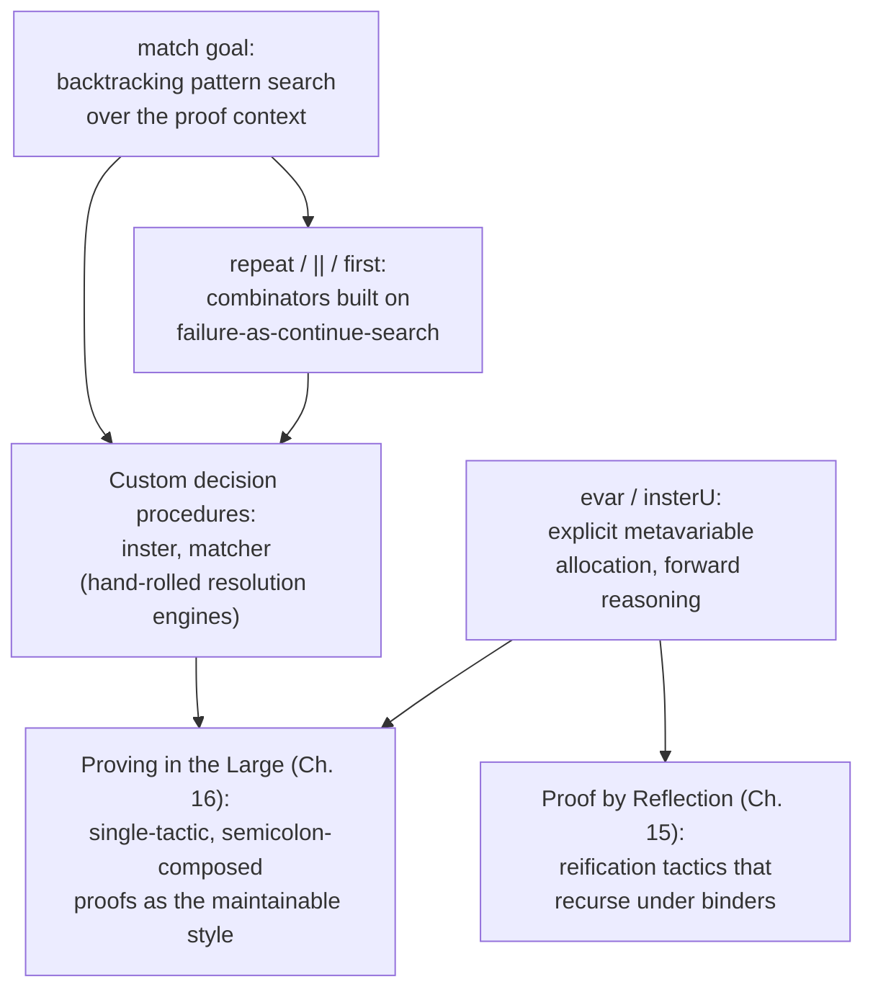

[[book-guidelines|↩ Back to guidelines]]

## Why does Coq need a whole extra language just for writing proofs?

Every proof-search technique this book has shown so far — `auto`, `eauto`, hint databases (see [[Proof-Automation-by-Logic-Programming]]) — is really just Coq's fixed, built-in menu of search strategies. Real projects hit goals that don't fit that menu: a domain-specific decision procedure, a custom case-split heuristic, a bespoke simplifier for one recurring proof shape. You need a language for writing *new* tactics, not just invoking existing ones. That language is **Ltac**, and this chapter is a bottom-up tour of its actual mechanics — not the polished surface you've been using implicitly in every `crush` call, but the primitives underneath.

Before diving into Ltac itself, the chapter surveys Coq's other built-in "black-box" decision procedures for calibration: `intuition` (propositional simplification), `congruence` (equality plus constructor-disjointness reasoning), `omega` (a complete decision procedure for quantifier-free linear/Presburger arithmetic over naturals and integers), `ring`/`field` (algebraic simplification via ring/field axioms), `fourier` (real-number inequalities), and the `setoid` facility for registering custom equivalence relations so `rewrite` can work modulo them (`Prop` itself is registered as a setoid under "if and only if"). These are all fixed, closed procedures. Ltac is what you reach for when the fixed menu runs out.

## `match goal`: the mechanism, and how it differs from ML pattern matching

The first Ltac idiom worth mastering is using `match goal` to *find a target for case analysis*:

```coq
Ltac find_if :=
  match goal with
    | [ |- if ?X then _ else _ ] => destruct X
  end.
```

This finds an `if` in the goal's conclusion and destructs its scrutinee. A `context[...]` variant, `find_if_inside`, matches an `if` occurring *anywhere* as a subterm, not just at the head — strictly more powerful, since it subsumes `find_if`. Composed with the `repeat` tactical (apply repeatedly until failure, then stop — leaving the last-failed subgoal for whatever comes next), this is enough to fully automate a class of theorems by boolean-condition case-splitting.

**The load-bearing subtlety, and the one genuinely new idea in this section:** `match goal` does *not* behave like ML/Haskell pattern matching. In ML, once a pattern matches, its body runs; if the body raises an exception, the whole match propagates that exception outward — matching is a one-shot commitment. In Coq's `match goal`, **a body's tactic failure triggers renewed search**: Coq backtracks and tries either (a) a different, later pattern, or (b) a *different way of satisfying the same pattern* (e.g., binding a different hypothesis to the same metavariable). This example makes the second case concrete:

```coq
Theorem m2 : forall P Q R : Prop, P -> Q -> R -> Q.
  intros; match goal with
            | [ H : _ |- _ ] => exact H
          end.
```

Given three hypotheses `H`, `H0`, `H1` (from `P`, `Q`, `R` respectively), `match goal`'s first attempt binds `H` to whichever hypothesis it encounters first (empirically, `H` bound to the `P`-typed one); `exact H` fails since that doesn't prove `Q`; Coq backtracks and *rebinds the same pattern to a different hypothesis* until `exact H` finally succeeds against `H0`. This single mechanism — pattern-match failure as a search-continuation signal, not a hard stop — is what makes `match goal` into a genuine backtracking search primitive rather than a syntactic dispatch table. It's the same idea underlying `first [t1 | t2 | ...]` (try tactics in order, keep the first that succeeds) and `fail n` (fail past `n` levels of enclosing backtracking, rather than just the innermost alternative).

**Grounding — this is a hand-rolled resolution engine.** If you squint, `match goal` with backtracking is doing exactly what SLD-resolution does in Prolog: try a clause, and on failure of what it derives, backtrack and try another clause (or another unification of the same clause) rather than failing the whole query. The `notHyp`/`extend`/`completer` example built up across §14.2 — checking a proposition isn't already a hypothesis, then closing a context under modus ponens and conjunction elimination — is, structurally, a hand-written forward-chaining Horn-clause solver, built entirely out of `match goal` backtracking plus the fixpoint-like `repeat`. This is directly the shape of a resolution/clause-engine you'd hand-roll for a custom theorem prover: pattern-match against a knowledge base (here, the hypothesis context), apply an inference rule (a `match` case), and on dead ends, backtrack to try a different clause instantiation instead of aborting the whole derivation.

**The subtlety that bites in practice — unification variables cannot capture locally bound variables.** Consider:

```coq
Theorem t1 : forall x : nat, x = x.
  match goal with
    | [ |- forall x, _ ] => trivial
  end.
Qed.

Theorem t1' : forall x : nat, x = x.
  match goal with
    | [ |- forall x, ?P ] => trivial
  end.
(* User error: No matching clauses for match goal *)
```

The second version fails because `?P` would need to be bound to `x = x`, a term that mentions the **locally bound** `x` — and Ltac unification variables may never be assigned a term containing a variable bound later in the same pattern. A wildcard `_` sidesteps the restriction (it binds to nothing, so there's nothing to check), but a named pattern variable does not. This single restriction is what caused a subtle real bug in the chapter's own running example: `completer'`'s modus-ponens rule used a wildcard where `completer`'s original used a genuine (if unused) unification variable `?Q`, and that change silently let the wildcard rule match against `forall`-quantified hypotheses it was never meant to touch — instantiating the wrong variable and turning a provable goal into an unprovable one. The lesson generalizes: *what a pattern binds, syntactically, changes what it's willing to match*, independent of whether the binding is ever used.

**Grounding (elaborator connection, `type-theory` + `automated-reasoning`):** this restriction is not a Coq quirk, it is a shallow surface manifestation of exactly the scope-check every metavariable-based elaborator needs. In Miller's pattern-unification fragment — the tractable subset of higher-order unification your own elaborator's unifier would implement — a metavariable `?M` applied to a spine of *distinct bound variables* is solvable in closed form (project + abstract); a metavariable that would need to be instantiated with a term mentioning a variable *out of its own scope* is exactly the failure Ltac is hitting here, just enforced by pure syntactic rejection rather than full pattern-unification machinery. Coq's later Ltac releases (8.2+) added `@?X` — a pattern form binding a metavariable together with an *explicit list* of the free variables it's allowed to depend on, turning that metavariable into a function of those variables (used properly in Proof by Reflection's binder-aware reification, [[Proof-by-Reflection]] §15.5). That's a hand-rolled instance of exactly the "pattern variable applied to a spine of bound variables" shape that makes Miller patterns solvable — worth remembering by name when you design your own unifier's metavariable representation.

## Ltac as a functional/imperative hybrid — and why that duality causes dynamic type errors

Ltac supports ordinary functional programming — a Lisp-with-syntax feel — but with syntactic conventions that trip up anyone approaching it as "Gallina with tactics":

- Pattern variables need a `?` prefix (`?ls'`, not `ls'`).
- A Gallina term embedded inside Ltac needs an explicit `constr:(...)` escape, because top-level identifiers in Ltac position are parsed as *tactic* applications by default: `S (length ls')` inside an Ltac body is read as "invoke the tactic `S` with argument `length ls'`," not as the Gallina successor applied to a Gallina term.
- The reverse escape, `ltac:(...)`, passes a genuine Ltac computation as an argument where a Gallina-typed argument is normally expected — needed, for instance, to pass an anonymous Ltac function as the "mapping function" argument to a hand-written Ltac `map`.
- `let ... := ... in` binds intermediate values (Gallina terms *or* Ltac values, untyped either way — Ltac has no static type discipline, so a function like a hand-rolled `map` must take the target element type as an explicit argument, since there is no `typeof` available for an Ltac-level function value).

The genuinely subtle failure mode: naively adding a debug `idtac ls;` at the top of a working, purely-functional-looking `length` definition silently turns it fatally broken:

```coq
Ltac length ls :=
  idtac ls;
  match ls with
    | nil => O
    | _ :: ?ls' => let ls'' := length ls' in constr:(S ls'')
  end.
```

This gives `Error: variable n should be bound to a term.` when called. **Why:** a semicolon (`;`) is exclusively the tactic-sequencing operator — writing one at all marks the enclosing Ltac body as an *embedded imperative tactic script* returning a proof-state transformation, not a value. Once `idtac ls;` forces that interpretation, `length`'s recursive self-call (which expects a *value* back, to bind via `let ls'' := ...`) receives a tactic-script instead — a genuine dynamic type confusion between "a value" and "a program that produces a proof-state side effect," with no static type system to catch the mismatch ahead of time.

**The Haskell-IO-monad analogy, and its precise limit:** Chlipala draws this comparison directly, and it's worth taking literally rather than loosely — a pure Ltac program can return, as an ordinary first-class value, the *code of an imperative tactic script*, and Coq's proof engine is the "out-of-band" runner that executes that script later, exactly the way a pure Haskell program builds an `IO a` value that only does anything once handed to the runtime. The fix for `length` is the same fix Haskell needs for the analogous problem: rewrite in **continuation-passing style**, threading an explicit continuation `k` that receives the "return value" and decides what proof-state action to perform with it:

```coq
Ltac length ls k :=
  idtac ls;
  match ls with
    | nil => k O
    | _ :: ?ls' => length ls' ltac:(fun n => k (S n))
  end.
```

**Where the analogy breaks, and why that's actually good news:** a Haskell `IO` action can have side effects on the *outside world* (Chlipala's own example — "launch missile" — a mutation nothing can undo). Ltac's only two forms of mutable state are (1) the current sequence of proof subgoals, and (2) a partial assignment of metavariables discovered during search. Crucially, *every* mutation to either is automatically undone on backtracking triggered by `match`, `auto`, or any other built-in backtracking construct. This is a strictly weaker, strictly safer effect discipline than general `IO` — closer to a stateful, automatically-checkpointed failure monad (the chapter's own comparison) than to arbitrary imperative programming. That reversibility is precisely what makes exhaustive backtracking search *tractable* to write by hand: you never have to manually clean up after a failed branch.

## Custom recursive proof search — `inster` and the separation-logic-style `matcher`

Two worked examples show what "building a custom decision procedure" looks like end to end.

**`inster n`** bounds the classic hard problem in automated first-order proving — deciding how deeply to instantiate universal quantifiers — by a "dependency chain length" `n`, trying all instantiation sequences up to that depth:

```coq
Ltac inster n :=
  intuition;
    match n with
      | S ?n' =>
         match goal with
           | [ H : forall x : ?T, _, y : ?T |- _ ] => generalize (H y); inster n'
         end
    end.
```

The crucial point isn't the code — it's *why* this small amount of code implements exhaustive search at all: when the recursive call `inster n'` eventually fails deep in the tree, the *enclosing* `match goal` doesn't propagate that failure — it backtracks and tries a *different* choice of `H`/`y` at that level, per the backtracking semantics established above. A handful of lines becomes a genuine breadth-first-flavored instantiation search purely because `match goal`'s failure semantics does the bookkeeping that an explicit worklist algorithm would otherwise require by hand.

**The `matcher` tactic** (§14.4) is the chapter's most substantial case study: a resource-cancellation simplifier for implications between conjunctions, modeled on separation-logic entailment checking. It defines a wrapper `imp` predicate, a battery of small commutativity/associativity/introduction lemmas (`pick_prem1`/`pick_prem2`/`comm_prem`, and their `_conc` duals for the conclusion side), and two tree-search helper tactics, `search_prem`/`search_conc`, that use the `||` ("orelse") tactical and `progress` (fails if its argument succeeds *without changing the goal*, guarding against infinite fixpoints of no-ops) to rotate a nested-conjunction tree until a target conjunct reaches the head position where a cancellation lemma can fire. The result — `matcher` — can prove goals requiring *both* propositional simplification *and* correct guesses for existential-quantifier instantiation (via the `Match`/`ex_prem`/`ex_conc` lemmas), entirely through unification triggered by lemma application, with zero explicit witness-supplying code. Printing the resulting proof term (`Print t4`) shows a nontrivial nested application of all these lemmas — exactly the proof-term output that plain, honest use of the `auto`/`eauto` hint machinery would have had to search for combinatorially; here it falls out of a purposefully structured traversal.

## Explicit unification-variable allocation and forward reasoning

`eauto` and its relatives allocate unification variables *internally* to support backward search (start from the goal, work toward hypotheses). Section 14.5 shows the dual, less-automated technique: allocating unification variables **explicitly**, to do **forward reasoning** — starting from a hypothesis and generalizing it, hoping later unification pins down the placeholders.

The mechanism is `evar (x : T)`, which extends the context with a fresh metavariable of type `T`, aliased to a normal-looking name; `eval unfold x in x` recovers the *actual* underlying metavariable (rather than the alias) so it can be substituted into a hypothesis via `specialize`. Packaged into a reusable tactic:

```coq
Ltac insterU H :=
  repeat match type of H with
            | forall x : ?T, _ =>
               let x := fresh "x" in
                 evar (x : T);
                 let x' := eval unfold x in x in
                    clear x; specialize (H x')
          end.
```

This instantiates *every* leading `forall` of `H` with a fresh metavariable, deferring the actual value to whatever later unification (e.g., an `apply`) determines it to be. A refined `insterKeep` (keeps the original hypothesis around via `generalize`+`intro` before instantiating a copy) is genuinely useful for hypotheses ending in existentials that `eauto`/`firstorder` can't crack alone — instantiate manually with placeholders, `destruct` the resulting existentials to introduce witnesses as ordinary variables, and only *then* hand the simplified goal to `eauto`.

The chapter is honest about the technique's limits: `insterU` mishandles quantified hypotheses that also carry *implications* as premises (`forall v, Q v -> exists u, P v u`) — the naive version tries to eagerly instantiate past the implication, generating an unresolved proof obligation (a "non-instantiated existential variable" error) rather than a clean specialized fact, because it can't tell a `Prop`-sorted quantifier (a proof obligation, needing `intro`/discharge) apart from a data-sorted one (an actual value to instantiate) using the same blind `forall x : ?T, _` pattern.

**Grounding — this is your elaborator's metavariable machinery, done by hand.** `evar`/`insterU`/`insterKeep` is a direct, hands-on preview of what a bidirectional elaborator's own metavariable context does internally: allocate a fresh metavariable standing for "a value we'll determine later," thread it through a term, and let subsequent unification (here, `apply`'s own unification algorithm) resolve it — precisely the mechanism an implicit-argument-resolution pass performs when it can't yet see the concrete value an implicit parameter should take. The `Prop`-vs-data-sorted-quantifier distinction that trips up `insterU` is the same distinction a bidirectional elaborator must make when deciding whether an unresolved metavariable is a genuine value hole (needs unification to close) or a proof obligation (needs deferred tactic/instance-search discharge) — get this classification wrong in an elaborator, and you get exactly the "stuck with unresolved metavariables" failure mode this section walks through by hand.

**Grounding (Lean):** Lean's tactic framework plays the same structural role Ltac plays here, just statically typed and packaged as a monad (`TacticM`) rather than an untyped Lisp-like DSL. Lean's `orElse`/`<|>` and `first [...]` combinators are direct analogues of Ltac's `||` and `first [t1 | t2 | ...]`; Lean's `MonadBacktrack` (`saveState`/`restoreState`) is the principled, explicit version of the "every mutation is automatically undone on backtracking" property Ltac gets implicitly from `match`/`auto`'s built-in search; and Lean's own metavariable context (`MetavarContext`, `mkFreshExprMVar`) is the typed, first-class version of `evar` — the same forward-instantiate-then-let-unification-resolve pattern `insterU` hand-rolls here is, in Lean, exactly what `elabTerm` does when it encounters a hole. If you're sketching a Rust implementation of a small tactic engine, the natural shape is: represent a tactic as `Fn(&mut ProofState) -> Box<dyn Iterator<Item = ProofState>>` (a closure returning a lazy stream of alternative resulting states, so `orelse`/backtracking is just "try the next item of the iterator") — that data shape is a fairly literal transliteration of what `match goal`'s backtracking and `||` are doing operationally in Ltac.

## Where this leads



Everything in this chapter is untrusted, per the de Bruijn criterion established all the way back in [[The-Coq-Proof-Assistant-and-Certified-Programming]] — no matter how elaborate `matcher` or `insterU` get, they only ever *produce* ordinary Gallina/CIC proof terms for the kernel to re-check independently. That's what licenses writing arbitrarily hacky, backtracking-heavy search code here without weakening trust anywhere. The `@?X`-pattern / binder-aware reification hinted at in the unification-variable-scoping discussion is picked up in full in [[Proof-by-Reflection]] (Chapter 15, §15.5), where reifying a Gallina term containing binders forces exactly this "metavariable as a function of the free variables collected so far" idiom. And the stylistic argument implicit throughout — that composed, single-tactic automation is more robust than long manual scripts — becomes the explicit organizing principle of Chapter 16 ("Proving in the Large").

For the elaborator/theorem-prover project this vault is oriented around: this chapter is the closest thing in the book to "here is how you actually implement a resolution/clause-search engine and a metavariable allocator by hand" — the `match goal` backtracking discipline is a working model for how your own theorem prover's clause-search loop should treat failure (a continuable signal, not an abort), and `evar`/`insterU`'s explicit-placeholder-then-unify pattern is the same shape your elaborator's metavariable context will need for implicit-argument and instance resolution, just upgraded from Ltac's dynamically-typed, backtracking-implicit style to a properly typed, explicit-`MetavarContext` implementation.
